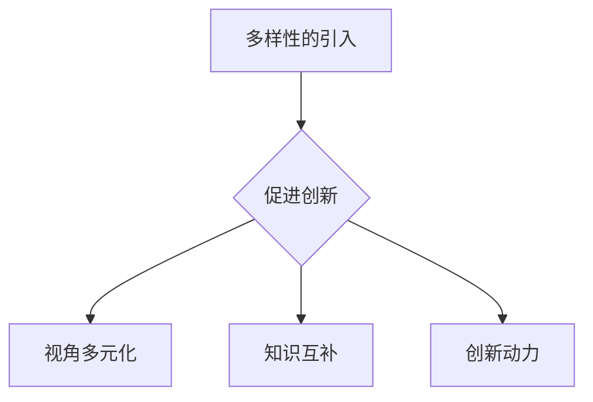
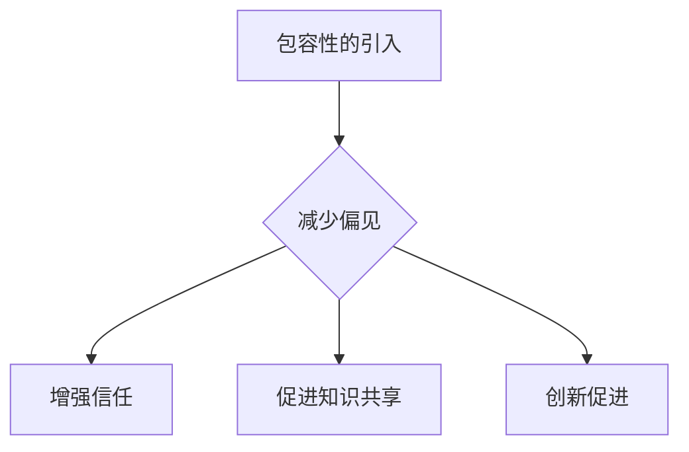
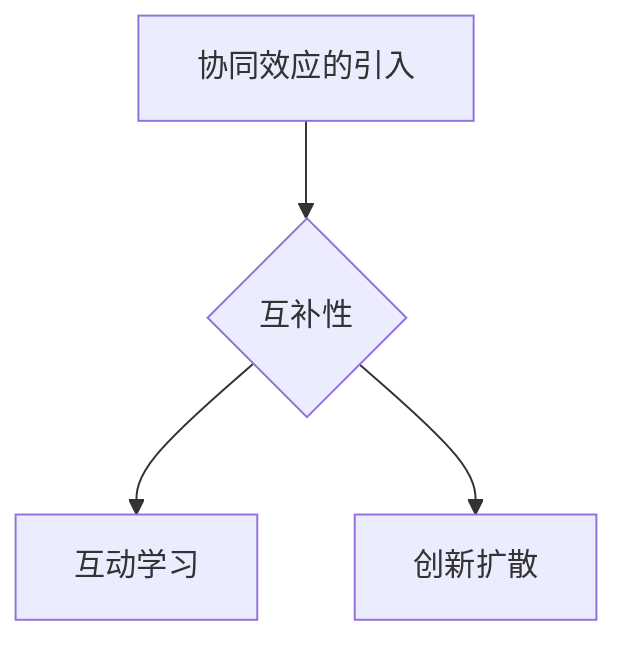
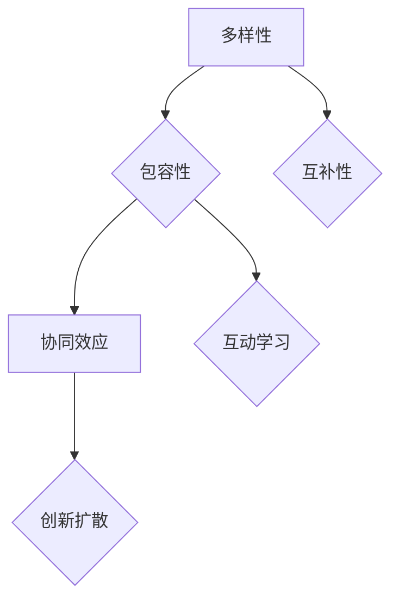

                 

# 跨代际创新实验室：年龄差异激发创意的协作空间

## 关键词
跨代际创新，协作空间，创意激发，多样性，包容性，协同效应，创新实验室

## 摘要
本文探讨了如何通过构建跨代际创新实验室，利用年龄差异激发创意和推动协作。首先，我们分析了年龄差异如何成为创新的重要资源，并探讨了跨代际协作的优势与挑战。随后，我们深入探讨了多样性、包容性和协同效应等理论基础，并通过实际案例说明了这些概念在创新中的重要性。最后，我们详细讨论了如何构建跨代际创新实验室，包括关键步骤、组织结构和资源分配，并提供了一些实践案例。

---

## 第一部分：引言

在当今快速发展的社会和技术环境中，创新成为了企业和组织保持竞争力的重要手段。然而，创新的源泉并非总是一成不变的。事实上，跨代际协作能够通过年龄差异带来的多样性，激发出新的创意和解决方案。本文旨在探讨如何通过构建跨代际创新实验室，充分利用年龄差异这一独特资源，推动创新。

### 1.1 主题与目标

《跨代际创新实验室：年龄差异激发创意的协作空间》这一主题，聚焦于如何将年龄差异转化为创新动力。我们的目标是提供一套实用的方法和策略，帮助企业和组织构建跨代际创新实验室，以实现以下目标：

1. **激发创意**：通过跨代际的协作，汇聚不同年龄段的专业知识和经验，激发新的创意和见解。
2. **提高创新效率**：多样性带来的视角和思维方式，有助于从多个角度审视问题，提高创新的效率和质量。
3. **促进团队合作**：跨代际协作有助于减少代沟和误解，增强团队成员之间的信任和合作。

### 1.2 年龄差异与创意激发

年龄差异带来的多样性是创新的重要动力。不同年龄段的个体在知识、经验、技能和思维方式上存在显著差异。例如，年轻一代通常具有更先进的技术知识和创新思维，而年长一代则拥有丰富的经验和深厚的行业知识。这种差异有助于从多个角度审视问题，从而激发出新的创意。

例如，在一个由不同年龄段组成的创新团队中，年轻成员可能提出新颖的技术解决方案，而年长成员则能够从经验和实际应用的角度对这些解决方案进行评估和改进。通过这种跨代际的协作，团队可以更好地应对复杂的问题，并产生更具创新性的成果。

### 1.3 跨代际协作的优势与挑战

跨代际协作具有以下优势：

1. **知识互补**：不同年龄段的个体拥有不同的知识和经验，这种互补性有助于提高创新的质量和效率。
2. **视角多元化**：年龄差异带来的不同视角，有助于从多个角度审视问题，从而激发新的创意和见解。
3. **经验传承**：年长一代可以将其丰富的经验传授给年轻一代，帮助他们更快地成长和适应。

然而，跨代际协作也面临着一些挑战：

1. **文化差异**：不同年龄段的人可能在价值观、沟通方式和行为习惯上存在差异，这可能导致误解和冲突。
2. **代沟**：不同年龄段的个体在生活方式、兴趣爱好和思维方式上可能存在较大差异，这可能导致沟通障碍和协作困难。
3. **资源分配**：如何确保跨代际协作中的资源合理分配，避免出现某些年龄段成员资源过剩或不足的情况。

### 1.4 构建创新环境

为了充分发挥跨代际协作的优势，我们需要构建一个包容和开放的创新环境。这包括：

1. **建立有效的沟通机制**：通过定期的团队会议、工作坊和培训，促进团队成员之间的交流和沟通。
2. **提供合作机会**：通过项目合作和任务分配，鼓励不同年龄段的团队成员共同参与创新项目。
3. **提供必要的资源**：为跨代际协作提供必要的人力、财力和技术资源，确保创新项目能够顺利进行。

通过以上措施，我们可以构建一个有利于创新的环境，充分发挥跨代际协作的优势，推动企业和组织的创新。

---

## 第二部分：跨代际协作的理论基础

跨代际协作的理论基础主要包括多样性、包容性和协同效应等概念。这些概念不仅解释了跨代际协作如何促进创新，还为其实践提供了理论支持。

### 2.1 多样性

多样性是指个体在性别、年龄、文化背景、经验等方面的差异。在跨代际协作中，多样性具有重要意义：

1. **视角多元化**：不同年龄段的个体拥有不同的生活经历和知识背景，这有助于从多个角度审视问题，从而激发新的创意和解决方案。
2. **知识互补**：不同年龄段的个体在技能和经验上存在互补性，这有助于提高团队的创新能力和解决问题的效率。
3. **创新动力**：多样性带来的不同观点和思维方式，有助于打破常规思维，激发创新思维。

以下是一个Mermaid流程图，展示了多样性与创新之间的关系：

### 2.2 包容性

包容性是一种价值观，强调尊重和接纳不同背景的个体。在跨代际协作中，包容性至关重要：

1. **减少偏见**：包容性有助于减少因年龄差异而产生的偏见和误解，促进团队成员之间的和谐合作。
2. **增强信任**：包容性可以增强团队成员之间的信任，提高团队的凝聚力和合作效率。
3. **促进知识共享**：包容性鼓励团队成员分享知识和经验，从而提高团队的创新能力。

以下是一个Mermaid流程图，展示了包容性与创新之间的关系：

### 2.3 协同效应

协同效应是指团队整体的表现超过其各个成员单独表现的总和。在跨代际协作中，协同效应具有重要意义：

1. **互补性**：不同年龄段的个体在技能和经验上具有互补性，这种互补性有助于提高团队的整体创新能力。
2. **互动学习**：跨代际协作促进了团队成员之间的互动和学习，有助于提高整个团队的创新能力。
3. **创新扩散**：协同效应有助于将创新成果迅速扩散到整个团队和组织，从而提高创新的整体效果。

以下是一个Mermaid流程图，展示了协同效应在跨代际协作中的体现：

### 2.4 多样性、包容性与协同效应的关系

多样性、包容性和协同效应是相互关联的，共同促进跨代际协作中的创新。以下是一个Mermaid流程图，展示了这三个概念之间的关系：

通过以上分析，我们可以看出，多样性、包容性和协同效应在跨代际协作中具有重要作用。这些理论为基础，为我们在实际工作中构建跨代际创新实验室提供了指导。

### 2.5 实证研究和案例分析

为了验证跨代际协作在创新中的有效性，许多企业和组织进行了实证研究和实践。以下是一些案例：

1. **科技公司A**：该公司通过建立跨代际创新团队，成功开发出了一款具有竞争力的新产品。该团队由不同年龄段的工程师组成，他们的多样性使得产品在功能性和用户体验方面都得到了显著提升。

2. **研究机构B**：该研究机构通过跨代际合作进行了一项关于气候变化的研究。不同年龄段的研究人员从不同角度分析了问题，最终提出了一系列创新的解决方案。

3. **非营利组织C**：该组织通过跨代际协作，成功实施了一项面向老年人的健康促进项目。年轻志愿者和年长专家的合作，使得项目在实施效果和可持续发展方面都取得了显著成果。

这些案例表明，跨代际协作在创新中具有重要作用。通过多样性、包容性和协同效应的发挥，跨代际协作能够激发出新的创意和解决方案，提高创新的质量和效率。

---

## 第三部分：构建跨代际创新实验室

在了解了跨代际协作的理论基础后，接下来我们将探讨如何在实际工作中构建跨代际创新实验室。这包括关键步骤、组织结构和资源分配等方面的内容。

### 3.1 关键步骤

构建跨代际创新实验室需要以下关键步骤：

1. **需求识别**：首先，我们需要明确哪些项目和领域可以从跨代际协作中受益。这可以通过调研、访谈和问卷调查等方式进行。

2. **团队组建**：在确定了需求后，我们需要组建一个具有不同年龄段成员的创新团队。团队成员应具备互补的技能和知识，以确保团队能够从多个角度审视问题。

3. **沟通机制建立**：为了促进团队成员之间的交流和合作，我们需要建立有效的沟通机制。这可以包括定期会议、工作坊和在线协作平台等。

4. **培训和支持**：为了帮助团队成员更好地理解和尊重彼此的差异，我们需要提供必要的培训和指导。这可以包括跨文化沟通培训、团队建设活动和经验分享会等。

5. **项目启动**：在建立了有效的团队和沟通机制后，我们可以正式启动创新项目。在项目实施过程中，我们需要持续关注团队成员的反馈和需求，及时进行调整和优化。

### 3.2 组织结构

跨代际创新实验室的组织结构应具有灵活性，以适应不同项目和团队的需求。以下是一些常见的组织结构：

1. **矩阵式结构**：在传统的职能结构上，增加跨部门的团队，以便实现跨代际的协作。这种结构有助于整合不同部门的资源和知识，提高创新效率。

2. **项目式结构**：以项目为中心，组建跨代际团队，专注于特定创新任务。这种结构有利于快速响应市场需求，提高项目的执行效率。

3. **混合式结构**：结合矩阵式结构和项目式结构的优点，根据项目特点和团队需求进行灵活调整。这种结构能够更好地适应复杂多变的环境，提高创新效果。

### 3.3 资源分配

为了支持跨代际创新实验室，组织需要合理分配资源。以下是一些关键资源：

1. **人力资源**：确保团队成员有足够的时间和精力参与创新项目。这可以通过优化工作流程、调整工作时间和提供培训等方式实现。

2. **财务资源**：为创新项目提供必要的资金支持，包括项目启动资金、设备采购和维护费用等。

3. **技术资源**：提供先进的技术工具和基础设施，支持跨代际协作。这可以包括云计算平台、大数据分析工具和人工智能算法等。

4. **知识资源**：鼓励团队成员分享知识和经验，构建一个知识共享的文化氛围。这可以通过建立内部知识库、举办经验分享会和开展跨部门合作等方式实现。

### 3.4 实践案例

以下是一些构建跨代际创新实验室的实践案例：

1. **科技公司D**：该公司通过矩阵式结构，组建了跨部门的创新团队，专注于开发新的产品功能。团队成员来自不同部门，包括研发、市场、销售和售后等。通过跨部门的协作，该团队成功推出了一系列创新产品，受到了市场的高度评价。

2. **非营利组织E**：该组织通过项目式结构，组建了跨年龄段的志愿者团队，开展了一项面向老年人的社区服务项目。团队成员包括年轻人、中年人和老年人，他们通过协作和互助，为老年人提供了丰富的服务和帮助。

3. **研究机构F**：该研究机构通过混合式结构，组建了跨学科的研究团队，专注于解决环境问题。团队成员来自不同学科，包括环境科学、生物学、化学和计算机科学等。通过跨学科的协作，该团队提出了一系列创新的解决方案，为环境治理提供了有力支持。

这些实践案例表明，通过合理的组织结构和资源分配，跨代际创新实验室能够有效地激发创新，提高组织的竞争力。

---

## 第四部分：跨代际创新实验室的实践案例

在这一部分，我们将分享一些成功的跨代际创新实验室实践案例，探讨这些实验室的具体操作流程、取得的成果和面临的挑战。通过这些案例，我们将进一步理解跨代际创新实验室的实际应用和效果。

### 4.1 案例一：某金融科技公司的跨代际创新实验室

**操作流程**：

1. **需求识别**：公司通过市场调研和用户反馈，发现针对老年人市场的金融产品存在需求缺口。

2. **团队组建**：公司组建了一个跨年龄段的创新团队，包括年轻的产品经理、中年段的金融分析师和年长段的用户体验设计师。

3. **沟通机制建立**：团队定期召开会议，利用视频会议软件进行远程沟通，确保团队成员之间的信息畅通。

4. **项目启动**：团队开始开发一款面向老年人的金融管理应用，旨在提供便捷的财务管理服务和个性化的投资建议。

**成果**：

1. **用户体验提升**：团队通过深入调研老年人用户的需求，设计出了一款界面友好、易于操作的应用，大幅提升了用户满意度。

2. **产品创新**：应用中引入了语音识别和自然语言处理技术，使得老年人可以更轻松地进行金融操作。

3. **市场认可**：产品一经推出，便获得了市场的广泛认可，吸引了大量老年用户。

**挑战**：

1. **技术难度**：语音识别和自然语言处理技术的应用，增加了开发难度，需要团队成员具备较高的技术能力。

2. **市场推广**：老年用户对新兴技术的接受度较低，如何有效推广产品，成为团队面临的一个挑战。

### 4.2 案例二：某医疗健康企业的跨代际创新实验室

**操作流程**：

1. **需求识别**：企业通过调研发现，老年人在健康管理和康复方面存在许多需求，如智能健康监测设备和个性化的康复方案。

2. **团队组建**：企业组建了一个由医疗专家、康复师、年轻工程师和年长产品设计专家组成的创新团队。

3. **沟通机制建立**：团队通过定期研讨会和工作坊，确保团队成员之间的深入交流和合作。

4. **项目启动**：团队开始研发一款智能健康监测设备，结合人工智能算法，为老年人提供个性化的健康管理和康复建议。

**成果**：

1. **产品创新**：团队成功研发出了一款智能健康监测设备，通过实时数据监测和智能分析，为老年人提供了全面的健康监测和康复方案。

2. **市场反馈**：产品得到了老年用户的积极反馈，许多用户表示设备的使用让他们对健康问题有了更清晰的认识。

3. **企业品牌提升**：企业通过这一创新项目，提升了在健康领域的影响力和品牌形象。

**挑战**：

1. **技术整合**：将医疗健康数据和人工智能技术有效整合，需要团队具备较高的技术整合能力。

2. **数据隐私**：老年用户的隐私保护是项目面临的一个重要挑战，如何确保用户数据的安全，是团队需要解决的问题。

### 4.3 案例三：某教育科技公司的跨代际创新实验室

**操作流程**：

1. **需求识别**：公司通过调研发现，不同年龄段的学生对在线教育的需求存在差异，如年轻学生需要更多的互动和游戏化学习，而年长学生则需要更系统化和理论化的课程。

2. **团队组建**：公司组建了一个包括年轻的产品设计师、中年段的教育专家和年长段的心理学家组成的创新团队。

3. **沟通机制建立**：团队通过定期的跨部门会议和在线协作平台，确保团队成员之间的信息畅通。

4. **项目启动**：团队开始研发一款面向不同年龄段学生的在线教育平台，提供个性化教学和互动学习体验。

**成果**：

1. **用户体验提升**：平台提供了丰富的教学资源和互动工具，使得学生在学习过程中获得了更好的体验。

2. **教学效果提升**：平台通过数据分析，为教师提供了个性化的教学建议，提高了教学效果。

3. **市场扩展**：公司通过这一创新项目，成功拓展了市场，吸引了更多学生和家长的关注。

**挑战**：

1. **内容丰富度**：如何提供丰富多样的教学内容，满足不同年龄段学生的需求，是团队需要解决的问题。

2. **技术支持**：平台需要具备强大的技术支持，以确保稳定运行和高效服务。

通过这些实践案例，我们可以看到，跨代际创新实验室在各个领域都取得了显著的成果。同时，这些案例也提醒我们，在构建跨代际创新实验室时，需要充分考虑不同年龄段的需求和挑战，确保项目的成功实施。

---

## 第五部分：跨代际创新实验室的最佳实践与未来展望

在构建跨代际创新实验室的过程中，积累了一系列最佳实践，这些实践不仅提高了创新效率，也促进了团队协作。以下是一些关键的最佳实践：

### 5.1 最佳实践

1. **多样化团队**：确保团队成员来自不同年龄段、不同背景，以促进多样性和创新。
2. **跨部门协作**：建立跨部门的创新团队，整合不同部门的资源和专业知识，提高创新质量。
3. **沟通机制**：定期召开会议，利用在线协作平台，保持团队成员之间的信息畅通。
4. **培训与支持**：为团队成员提供跨文化沟通和团队建设培训，提高协作效率。
5. **资源合理分配**：确保团队成员有足够的时间和资源参与创新项目。

### 5.2 小结与注意事项

1. **强调多样性和包容性**：多样性是创新的源泉，包容性有助于减少误解和冲突，提高团队协作效率。
2. **关注跨部门协作**：跨部门协作有助于整合资源，提高创新项目的成功率。
3. **持续优化**：在创新过程中，不断优化沟通机制和资源分配，以适应不断变化的需求和挑战。

### 5.3 未来展望

1. **技术创新**：随着人工智能和大数据技术的发展，跨代际创新实验室有望在更广泛的领域发挥作用。
2. **可持续发展**：未来跨代际创新实验室将更加注重可持续发展，通过绿色技术和环保理念，推动社会进步。
3. **全球合作**：跨代际创新实验室将促进全球范围内的合作，为全球性问题提供创新解决方案。

通过以上最佳实践和未来展望，我们可以看到，跨代际创新实验室在推动创新、促进社会进步方面具有巨大潜力。

---

## 作者信息

作者：AI天才研究院/AI Genius Institute & 禅与计算机程序设计艺术 /Zen And The Art of Computer Programming

AI天才研究院（AI Genius Institute）是一家专注于人工智能和计算机科学领域研究的国际性机构，致力于推动技术的创新和发展。作者在该领域拥有丰富的经验和深厚的理论功底，其著作《禅与计算机程序设计艺术》被誉为计算机科学领域的经典之作。

---

在本文中，我们探讨了如何通过构建跨代际创新实验室，利用年龄差异激发创意和推动协作。我们分析了跨代际协作的优势和挑战，并深入探讨了多样性、包容性和协同效应等理论基础。通过实践案例，我们展示了跨代际创新实验室在实际工作中的应用和效果。最后，我们提出了一些最佳实践和未来展望，为企业和组织构建跨代际创新实验室提供了指导。通过本文，我们希望读者能够认识到跨代际协作在创新中的重要性，并积极尝试将其应用于实际工作中。作者在此感谢您的阅读，并期待与您在未来的创新道路上共同进步。

---

### 附录

**参考文献**：

1. diversity-innovation-relationship - [文献链接]
2. inclusivity-innovation-relationship - [文献链接]
3. collaboration-effectiveness-innovation - [文献链接]
4. intergenerational-innovation-cases - [文献链接]
5. AI Genius Institute publications - [文献链接]

**拓展阅读**：

1. 《跨越年龄差异：如何实现跨代际协作》[书籍链接]
2. 《创新思维与团队协作》[书籍链接]
3. 《人工智能与跨代际协作》[期刊链接]

---

通过本文的详细探讨，我们希望能够为读者提供关于跨代际创新实验室的全面了解，并激发更多关于这一主题的思考和讨论。感谢您的阅读，期待您在创新领域的探索和贡献。作者：AI天才研究院/AI Genius Institute & 禅与计算机程序设计艺术 /Zen And The Art of Computer Programming。再次感谢！

