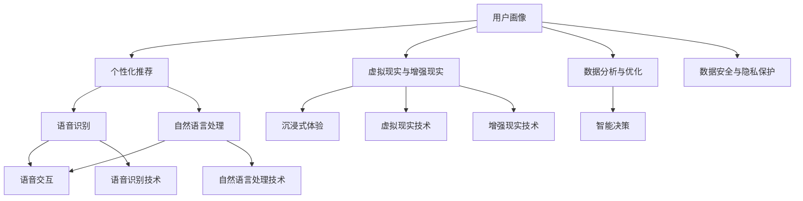

                 

# 跨代际智慧传承平台：老年人与年轻人在线互动

> 关键词：跨代际互动、在线互动平台、人工智能、用户画像、自然语言处理、虚拟现实、大数据分析

> 摘要：本文将探讨跨代际智慧传承平台的设计与实现，通过分析老年人与年轻人在线互动的必要性、核心技术以及实现策略，旨在为构建一个高效、便捷、智能的跨代际交流平台提供理论支持和实践指导。

## 第一部分：背景与概述

### 第1章：跨代际互动的必要性

#### 1.1 老年人与年轻人互动的重要性

在现代社会，随着人口老龄化问题的日益突出，老年人与年轻人的互动变得越来越重要。这种互动不仅有助于老年人的生活质量的提升，还能促进年轻人的成长与进步。

首先，老年人与年轻人之间的互动能够增进相互理解。通过交流，老年人能够了解年轻人的思想、观念和生活方式，而年轻人也能更好地理解老年人的需求和期望。这种相互理解有助于减少代沟，增进家庭和社会的和谐。

其次，老年人与年轻人之间的互动能够促进知识的传承。老年人拥有丰富的生活经验和知识，这些宝贵的财富对于年轻人的成长具有重要意义。通过互动，老年人可以将自己的经验和知识传授给年轻人，从而实现跨代际的智慧传承。

#### 1.2 跨代际沟通的挑战

然而，跨代际沟通并非易事。首先，老年人由于年龄和生理上的变化，可能在听力、视力等方面存在一定的障碍，这给沟通带来了一定的困难。其次，老年人和年轻人之间的语言、文化背景可能存在差异，这也增加了沟通的难度。

此外，现代社会的快节奏和信息爆炸，使得老年人和年轻人之间的沟通时间变得越来越少。许多年轻人忙于工作、学习和社交，而老年人则可能因为身体原因而无法参与到这些活动中。这些因素都使得跨代际沟通面临着巨大的挑战。

#### 1.3 跨代际互动的意义

尽管面临诸多挑战，跨代际互动的意义依然重大。首先，它有助于提升老年人的生活质量。通过互动，老年人能够保持社交活动的参与，从而提高身心健康。其次，它有助于年轻人的成长。通过与老年人交流，年轻人能够学到更多的知识和经验，从而更好地适应社会。

此外，跨代际互动还有助于促进社会和谐。老年人是社会的宝贵财富，他们的经验和智慧对于社会的进步具有重要意义。年轻人则是社会的未来，他们的成长与进步对于社会的稳定和发展至关重要。通过跨代际互动，老年人可以将自己的智慧和经验传承给年轻人，从而推动社会的持续发展。

#### 1.4 跨代际智慧传承的现状与问题

目前，跨代际智慧传承存在一些问题。首先，老年人由于年龄和生理原因，可能无法有效地参与到智慧传承的过程中。其次，年轻人由于生活节奏快，可能无法充分利用老年人的智慧和经验。

此外，传统的方式，如家庭聚会、书信交流等，已经无法满足现代社会对跨代际智慧传承的需求。这些方式过于单一，缺乏互动性，难以适应快节奏的生活环境。因此，构建一个高效、便捷、智能的跨代际智慧传承平台，成为当前亟待解决的问题。

### 第2章：跨代际智慧传承平台概述

#### 2.1 平台的定义与目标

跨代际智慧传承平台是一个基于互联网和人工智能技术的在线互动平台，旨在为老年人与年轻人提供一个高效、便捷、智能的交流与互动环境。该平台的目标是促进跨代际的知识传承，提升老年人的生活质量，帮助年轻人更好地成长。

#### 2.2 平台的技术基础

跨代际智慧传承平台的技术基础主要包括以下几个方面：

1. **用户画像与个性化推荐**：通过收集和分析用户的行为数据，为老年人提供个性化的推荐服务，帮助他们更好地了解年轻人，提高互动的趣味性和效果。

2. **语音识别与自然语言处理**：利用语音识别和自然语言处理技术，实现老年人与年轻人之间的语音交流和文本交流，克服语言障碍，提升沟通效率。

3. **虚拟现实与增强现实技术**：通过虚拟现实和增强现实技术，为老年人提供一个沉浸式的互动体验，增强互动的趣味性和互动性。

4. **大数据与数据挖掘**：通过大数据和数据挖掘技术，对用户行为进行分析，为平台提供智能化的决策支持，优化用户体验。

#### 2.3 平台的功能模块

跨代际智慧传承平台的主要功能模块包括：

1. **用户注册与登录**：支持老年人、年轻人和相关工作人员的注册与登录，实现身份认证。

2. **用户画像与个性化推荐**：通过分析用户行为数据，为用户提供个性化的推荐服务。

3. **语音交互与文本交流**：支持语音识别和自然语言处理技术，实现老年人与年轻人之间的语音和文本交流。

4. **虚拟现实与增强现实互动**：提供虚拟现实和增强现实技术，为老年人提供一个沉浸式的互动体验。

5. **数据分析与优化**：通过大数据和数据挖掘技术，对用户行为进行分析，为平台提供智能化的决策支持。

#### 2.4 平台的发展趋势

随着人工智能、大数据、虚拟现实等技术的不断发展，跨代际智慧传承平台将呈现出以下发展趋势：

1. **智能化水平提升**：随着人工智能技术的进步，平台将实现更智能的用户画像、个性化推荐和数据分析。

2. **互动方式多样化**：随着虚拟现实和增强现实技术的发展，平台将提供更多样化的互动方式，提升用户体验。

3. **跨平台兼容性**：平台将实现跨平台兼容，支持移动端、PC端等多种设备，方便用户随时随地参与互动。

4. **数据安全与隐私保护**：随着大数据技术的发展，平台将加强对用户数据的保护，确保用户隐私安全。

### 第3章：跨代际智慧传承的核心概念与联系

为了更好地理解跨代际智慧传承平台的工作原理，我们需要分析其中的核心概念与联系。以下是核心概念实体之间的关系架构：



在这个架构中，用户画像作为核心概念，通过个性化推荐、语音识别、自然语言处理、虚拟现实与增强现实等技术，实现老年人与年轻人的在线互动。同时，数据分析与优化、数据安全与隐私保护等模块为平台提供了智能化的决策支持和安全保障。

## 第二部分：平台核心技术

### 第4章：用户画像与个性化推荐

#### 4.1 用户画像的概念

用户画像是指通过对用户行为数据的分析，构建出一个关于用户特征的抽象模型，以描述用户的需求、偏好和行为模式。用户画像的核心目的是为用户提供个性化的服务，提升用户体验。

在跨代际智慧传承平台中，用户画像主要包括以下几个方面：

1. **基本信息**：包括用户的年龄、性别、职业、居住地等基本信息。
2. **行为特征**：包括用户在平台上的活动轨迹、互动频率、偏好内容等行为特征。
3. **兴趣偏好**：通过分析用户行为，识别用户的兴趣偏好，如阅读内容、兴趣爱好等。
4. **价值属性**：根据用户的行为和互动，评估用户的价值属性，如活跃度、忠诚度等。

#### 4.2 用户画像的技术实现

用户画像的技术实现主要包括数据收集、数据处理和用户画像构建三个环节。

1. **数据收集**：通过平台日志、用户行为数据等途径，收集用户的基本信息、行为特征和兴趣偏好数据。
2. **数据处理**：对收集到的数据进行分析和处理，提取用户画像所需的特征信息。
3. **用户画像构建**：根据处理后的数据，构建用户画像，为用户提供个性化推荐。

在跨代际智慧传承平台中，用户画像的技术实现流程如下：

1. **数据采集**：通过平台日志、用户行为数据等途径，收集老年人和年轻人的基本信息、行为特征和兴趣偏好数据。
2. **数据预处理**：对采集到的数据进行清洗、去重和归一化处理，确保数据的质量。
3. **特征提取**：利用机器学习算法，从预处理后的数据中提取用户画像所需的特征信息。
4. **用户画像构建**：根据提取的特征信息，构建老年人和年轻人的用户画像，为个性化推荐提供基础。

#### 4.3 个性化推荐算法

个性化推荐算法是用户画像的核心应用之一。它通过分析用户画像，为用户推荐他们可能感兴趣的内容、产品或服务。

在跨代际智慧传承平台中，个性化推荐算法主要包括以下几种：

1. **基于内容的推荐**：根据用户的历史行为和兴趣偏好，推荐与之相似的内容。如：老年人喜欢阅读的文章，年轻人喜欢观看的视频等。
2. **协同过滤推荐**：通过分析用户之间的行为相似性，为用户提供共同感兴趣的内容。如：老年人共同关注的话题，年轻人共同喜爱的书籍等。
3. **基于模型的推荐**：利用机器学习算法，构建用户画像，为用户提供个性化的推荐。如：根据老年人的兴趣偏好，推荐相关书籍、视频等。

#### 4.4 个性化推荐在跨代际互动中的应用

个性化推荐在跨代际智慧传承平台中具有重要作用，它可以提高老年人和年轻人之间的互动质量，增强互动效果。

1. **内容推荐**：根据老年人的兴趣偏好，推荐他们可能感兴趣的内容，如历史、文化、养生等方面的书籍和视频。同时，根据年轻人的兴趣偏好，推荐他们可能感兴趣的养老话题，如养老政策、养老方式等。
2. **互动匹配**：通过分析老年人和年轻人的用户画像，为他们推荐合适的互动对象。如：老年人可以与年轻医生进行健康咨询互动，年轻人可以与老年人分享生活经验等。
3. **活动推荐**：根据老年人和年轻人的兴趣偏好，推荐相关的线上和线下活动。如：老年人可以参加线上养生讲座，年轻人可以参加养老志愿服务活动等。

通过个性化推荐，跨代际智慧传承平台可以更好地满足老年人和年轻人的需求，提高互动的趣味性和效果，实现跨代际智慧传承的目标。

### 第5章：语音识别与自然语言处理

#### 5.1 语音识别技术

语音识别（Speech Recognition）技术是跨代际智慧传承平台中至关重要的一环。它通过将语音信号转换为文本，实现语音到文字的转换，为老年人和年轻人之间的语音交流提供基础。

语音识别技术的基本原理如下：

1. **特征提取**：通过预处理语音信号，提取出具有代表性的特征参数，如频谱特征、倒谱特征等。
2. **声学模型**：构建用于描述语音信号特征的数学模型，如高斯混合模型（GMM）、深度神经网络（DNN）等。
3. **语言模型**：构建用于描述语音信号和文本之间关系的数学模型，如N-gram模型、循环神经网络（RNN）等。
4. **解码算法**：利用声学模型和语言模型，对语音信号进行解码，得到对应的文本。

在跨代际智慧传承平台中，语音识别技术的实现流程如下：

1. **音频预处理**：对采集到的语音信号进行降噪、归一化等处理，提高语音信号的质量。
2. **特征提取**：从预处理后的语音信号中提取特征参数，如梅尔频率倒谱系数（MFCC）等。
3. **声学模型训练**：利用大量的语音数据，训练声学模型，如GMM、DNN等。
4. **语言模型训练**：利用大量的文本数据，训练语言模型，如N-gram、RNN等。
5. **语音识别**：利用训练好的声学模型和语言模型，对输入的语音信号进行识别，得到对应的文本。

#### 5.2 自然语言处理技术

自然语言处理（Natural Language Processing，NLP）技术是跨代际智慧传承平台中另一个核心组成部分。它通过理解和生成自然语言，实现文本的理解和生成，为老年人和年轻人之间的文本交流提供支持。

NLP技术的基本原理如下：

1. **分词**：将连续的文本切分成一个个有意义的词汇，如“我爱北京天安门”切分成“我”、“爱”、“北京”、“天安门”等。
2. **词性标注**：对文本中的词汇进行词性标注，如“我”（代词）、“爱”（动词）等。
3. **句法分析**：对文本进行句法分析，构建句子的语法结构，如主语、谓语、宾语等。
4. **语义分析**：对文本进行语义分析，理解文本的含义和逻辑关系，如情感分析、实体识别等。
5. **文本生成**：根据输入的文本或意图，生成相应的文本输出，如自动回复、摘要生成等。

在跨代际智慧传承平台中，NLP技术的实现流程如下：

1. **文本预处理**：对采集到的文本进行清洗、去噪等处理，提高文本质量。
2. **分词**：利用分词算法，将文本切分成有意义的词汇。
3. **词性标注**：利用词性标注算法，对文本中的词汇进行词性标注。
4. **句法分析**：利用句法分析算法，构建句子的语法结构。
5. **语义分析**：利用语义分析算法，理解文本的含义和逻辑关系。
6. **文本生成**：根据输入的文本或意图，生成相应的文本输出。

#### 5.3 跨代际语音交互设计

在跨代际智慧传承平台中，语音交互设计至关重要。它通过语音识别和自然语言处理技术，实现老年人和年轻人之间的语音交流。

跨代际语音交互设计主要包括以下几个方面：

1. **语音识别准确性**：通过优化语音识别算法，提高语音识别的准确性，减少误解和错误。
2. **语音交互界面**：设计简洁、直观的语音交互界面，方便老年人和年轻人进行语音交流。
3. **语音交互功能**：提供多种语音交互功能，如语音问答、语音搜索、语音聊天等，满足老年人和年轻人的不同需求。
4. **语音交互体验**：优化语音交互体验，如语音识别速度、语音合成流畅度等，提升用户的满意度。

#### 5.4 跨代际自然语言理解

跨代际自然语言理解是指通过自然语言处理技术，实现老年人和年轻人之间的文本交流和理解。

跨代际自然语言理解主要包括以下几个方面：

1. **语义理解**：通过语义分析技术，理解文本的含义和逻辑关系，实现老年人和年轻人之间的有效沟通。
2. **情感分析**：通过情感分析技术，识别文本中的情感倾向，了解老年人和年轻人的情感状态。
3. **对话管理**：通过对话管理技术，实现自然语言理解和生成，构建智能对话系统。
4. **知识图谱**：通过构建知识图谱，整合跨代际知识，为老年人和年轻人提供丰富的知识支持。

通过语音识别和自然语言处理技术，跨代际智慧传承平台可以克服语言障碍，实现老年人和年轻人之间的有效沟通，促进跨代际智慧传承。

### 第6章：虚拟现实与增强现实技术

#### 6.1 虚拟现实技术

虚拟现实（Virtual Reality，VR）技术是一种通过计算机模拟生成三维虚拟环境，使用户在视觉、听觉、触觉等方面感受到沉浸式体验的技术。在跨代际智慧传承平台中，VR技术可以提供老年人一个虚拟的互动场景，增强他们的互动体验。

虚拟现实技术的基本原理如下：

1. **场景建模**：利用计算机图形学技术，构建三维虚拟环境，包括场景中的物体、人物等。
2. **渲染技术**：通过渲染技术，将场景中的三维模型渲染成二维图像，呈现给用户。
3. **传感器技术**：利用传感器技术，捕捉用户的动作和位置，实现虚拟环境中的交互。
4. **头戴式显示器（HMD）**：用户通过头戴式显示器，观察虚拟环境，获得沉浸式体验。

在跨代际智慧传承平台中，VR技术的应用主要包括以下几个方面：

1. **虚拟互动**：通过VR技术，老年人可以与年轻人进行面对面的虚拟互动，打破物理距离的限制。
2. **教育训练**：利用VR技术，为老年人提供虚拟的教育训练，如健康知识、兴趣爱好等，提高他们的生活质量。
3. **文化体验**：通过VR技术，老年人可以虚拟参观历史古迹、博物馆等，丰富他们的文化生活。

#### 6.2 增强现实技术

增强现实（Augmented Reality，AR）技术是一种将虚拟信息叠加到现实环境中，使用户在现实世界中获得增强感知的技术。在跨代际智慧传承平台中，AR技术可以提供老年人一个虚实结合的互动场景，增强他们的互动体验。

增强现实技术的基本原理如下：

1. **标记识别**：通过摄像头捕捉现实环境中的标记，识别并定位标记的位置。
2. **虚拟物体生成**：根据标记的位置和角度，生成虚拟物体，并将其叠加到现实环境中。
3. **交互技术**：通过手势、语音等交互方式，用户与虚拟物体进行交互。
4. **显示技术**：将虚拟物体叠加到现实环境中，使用户可以看到虚实结合的场景。

在跨代际智慧传承平台中，AR技术的应用主要包括以下几个方面：

1. **互动教育**：通过AR技术，为老年人提供互动式的教育内容，如健康知识、兴趣爱好等，提高他们的生活质量。
2. **文化活动**：通过AR技术，为老年人提供文化活动的虚拟体验，如虚拟展览、演出等，丰富他们的文化生活。
3. **社交互动**：通过AR技术，老年人可以在现实环境中与年轻人进行虚拟互动，增强社交体验。

#### 6.3 VR/AR在跨代际互动中的应用

虚拟现实和增强现实技术在跨代际互动中具有广泛的应用前景，可以大大提升老年人和年轻人之间的互动质量和效果。

1. **虚拟互动体验**：通过VR技术，老年人可以在虚拟环境中与年轻人进行面对面的互动，体验沉浸式的互动场景，增强互动的趣味性和互动性。
2. **虚实结合互动**：通过AR技术，老年人可以将虚拟信息和现实环境相结合，实现虚实结合的互动体验，拓宽互动的空间和形式。
3. **教育与文化传承**：通过VR和AR技术，老年人可以参与到虚拟的教育和文化活动中，提高他们的生活质量，实现跨代际的知识和智慧传承。

#### 6.4 VR/AR互动体验设计

为了提供优质的VR/AR互动体验，需要从以下几个方面进行设计：

1. **用户需求分析**：了解老年人和年轻人的互动需求和兴趣点，为互动体验设计提供依据。
2. **场景构建**：根据用户需求，构建虚拟和增强现实场景，提供丰富的互动内容和体验。
3. **交互设计**：设计简单、直观的交互方式，如手势、语音等，方便用户进行操作。
4. **体验优化**：通过不断的测试和优化，提升互动体验的流畅度、稳定性和趣味性。

通过VR/AR技术的应用，跨代际智慧传承平台可以提供更加丰富、便捷、智能的互动体验，促进老年人与年轻人之间的交流与合作，实现跨代际智慧传承的目标。

### 第7章：大数据与数据挖掘

#### 7.1 大数据的概念与特点

大数据（Big Data）是指无法用传统数据处理工具在合理时间内捕获、管理和处理的数据集合。大数据具有以下四个主要特点，即“4V”：

1. **大量（Volume）**：大数据的数据量庞大，通常在TB、PB甚至EB级别。
2. **多样（Variety）**：大数据的数据来源多样，包括结构化数据、半结构化数据和非结构化数据。
3. **高速（Velocity）**：大数据的数据产生和处理速度极快，需要实时或近实时处理。
4. **价值（Value）**：大数据中的信息价值巨大，但同时也存在着数据质量、隐私和安全等问题。

#### 7.2 数据挖掘技术

数据挖掘（Data Mining）是指从大量数据中通过智能算法和统计学方法，发现数据中的潜在模式和知识的过程。数据挖掘的基本流程包括：

1. **数据预处理**：对原始数据进行清洗、集成、转换等预处理操作，确保数据质量。
2. **探索性数据分析**：对预处理后的数据进行初步分析，发现数据中的异常、趋势和关联。
3. **模型构建**：利用机器学习、统计学等方法，构建用于预测、分类、聚类等任务的数据模型。
4. **模型评估**：对构建的模型进行评估，选择最佳模型并应用于实际问题。

在跨代际智慧传承平台中，数据挖掘技术主要用于以下几个方面：

1. **用户行为分析**：通过分析老年人和年轻人在平台上的行为数据，了解他们的需求和偏好，为个性化推荐提供依据。
2. **互动效果评估**：通过评估老年人和年轻人之间的互动效果，优化平台的功能和体验。
3. **智能决策支持**：通过分析平台运行数据，为平台运营和决策提供支持。

#### 7.3 跨代际大数据分析

跨代际大数据分析是指通过对老年人和年轻人互动数据的分析，发现数据中的潜在模式和知识，为平台优化和智慧传承提供支持。

跨代际大数据分析主要包括以下几个方面：

1. **用户画像**：通过分析老年人和年轻人的行为数据，构建用户画像，了解他们的需求和偏好。
2. **互动模式**：通过分析老年人和年轻人之间的互动数据，发现他们的互动模式，如互动频率、互动内容等。
3. **情感分析**：通过分析互动文本，识别老年人和年轻人的情感状态，了解他们的情感需求。
4. **效果评估**：通过分析平台运行数据，评估不同功能和策略的效果，为平台优化提供依据。

#### 7.4 数据隐私与安全

在跨代际智慧传承平台中，数据隐私和安全是至关重要的问题。以下是一些关键措施：

1. **数据加密**：对存储和传输的数据进行加密，防止数据泄露。
2. **访问控制**：对数据的访问进行严格控制，确保只有授权用户可以访问敏感数据。
3. **匿名化处理**：对个人数据进行匿名化处理，保护用户隐私。
4. **安全审计**：对平台运行进行安全审计，及时发现和应对潜在的安全威胁。
5. **用户协议**：明确用户协议，告知用户平台如何收集、使用和保护他们的数据。

通过以上措施，跨代际智慧传承平台可以确保数据的安全性和隐私性，为用户提供一个可靠、安全的互动环境。

### 第8章：跨代际智慧传承平台实现

#### 8.1 平台架构设计

跨代际智慧传承平台的架构设计主要包括以下几个方面：

1. **前端架构**：采用前端框架（如Vue.js、React等），实现用户界面和交互功能。
2. **后端架构**：采用后端框架（如Spring Boot、Django等），实现数据存储、处理和业务逻辑。
3. **数据库设计**：采用关系型数据库（如MySQL、PostgreSQL等）和NoSQL数据库（如MongoDB等），存储用户数据、互动数据和平台运行数据。
4. **中间件**：采用中间件（如Kafka、RabbitMQ等），实现数据传输和消息队列功能。
5. **云计算与容器化**：采用云计算平台（如AWS、Azure等）和容器化技术（如Docker、Kubernetes等），实现平台的弹性扩展和高效运行。

#### 8.2 技术栈选择

跨代际智慧传承平台的技术栈选择如下：

1. **前端技术**：Vue.js、React、Bootstrap、Ant Design等。
2. **后端技术**：Spring Boot、Django、Flask、MySQL、PostgreSQL、MongoDB等。
3. **数据存储**：MySQL、PostgreSQL、MongoDB、Redis等。
4. **中间件**：Kafka、RabbitMQ、Elasticsearch等。
5. **云计算与容器化**：AWS、Azure、Docker、Kubernetes等。
6. **人工智能与数据挖掘**：TensorFlow、PyTorch、Scikit-learn等。

#### 8.3 开发流程与工具

跨代际智慧传承平台的开发流程主要包括以下几个阶段：

1. **需求分析**：与项目相关方进行需求调研，明确平台的功能和目标。
2. **系统设计**：根据需求分析，设计平台的架构和数据库模型。
3. **前端开发**：使用Vue.js、React等前端框架，实现用户界面和交互功能。
4. **后端开发**：使用Spring Boot、Django等后端框架，实现数据存储、处理和业务逻辑。
5. **测试与调试**：对平台进行功能测试、性能测试和安全测试，修复发现的问题。
6. **部署与维护**：将平台部署到云计算平台，进行实时监控和更新维护。

在开发过程中，使用以下工具可以提高开发效率和代码质量：

1. **版本控制**：Git，用于代码管理和协同开发。
2. **代码规范**：Prettier、ESLint等，用于代码格式化和静态检查。
3. **自动化测试**：JUnit、TestNG等，用于单元测试和集成测试。
4. **持续集成与部署**：Jenkins、GitLab CI等，用于自动化构建、测试和部署。
5. **项目管理**：Jira、Trello等，用于任务管理和团队协作。

#### 8.4 项目实战案例

以下是一个跨代际智慧传承平台的项目实战案例：

**项目名称**：智慧养老互动平台

**项目目标**：为老年人提供在线互动、健康咨询、文化娱乐等服务，帮助老年人提高生活质量。

**项目架构**：

1. **前端架构**：采用Vue.js框架，实现用户界面和交互功能。
2. **后端架构**：采用Spring Boot框架，实现数据存储、处理和业务逻辑。
3. **数据库设计**：采用MySQL数据库，存储用户数据、互动数据和平台运行数据。
4. **中间件**：采用Kafka，实现数据传输和消息队列功能。
5. **云计算与容器化**：采用AWS云服务，实现平台的弹性扩展和高效运行。

**功能模块**：

1. **用户注册与登录**：支持老年人、年轻人和相关工作人员的注册与登录，实现身份认证。
2. **用户画像与个性化推荐**：通过分析用户行为数据，为用户提供个性化的推荐服务。
3. **语音识别与自然语言处理**：提供语音识别和自然语言处理功能，实现老年人与年轻人之间的语音交流。
4. **虚拟现实与增强现实互动**：提供虚拟现实和增强现实技术，为老年人提供一个沉浸式的互动体验。
5. **数据分析与优化**：通过大数据和数据挖掘技术，对用户行为进行分析，为平台提供智能化的决策支持。

**开发流程**：

1. **需求分析**：与项目相关方进行需求调研，明确平台的功能和目标。
2. **系统设计**：根据需求分析，设计平台的架构和数据库模型。
3. **前端开发**：使用Vue.js框架，实现用户界面和交互功能。
4. **后端开发**：使用Spring Boot框架，实现数据存储、处理和业务逻辑。
5. **测试与调试**：对平台进行功能测试、性能测试和安全测试，修复发现的问题。
6. **部署与维护**：将平台部署到AWS云服务，进行实时监控和更新维护。

通过以上项目实战案例，可以了解到跨代际智慧传承平台的实现方法和步骤，为类似项目的开发和实施提供参考。

### 第9章：代码解读与分析

#### 9.1 Python源代码实现

以下是一个简单的Python示例代码，用于实现用户画像构建的基本功能。代码使用了Scikit-learn库中的K-Means聚类算法来构建用户画像。

```python
from sklearn.cluster import KMeans
import numpy as np

# 用户行为数据
user_data = np.array([[1, 2], [1, 4], [1, 0],
                      [10, 2], [10, 4], [10, 0]])

# 设置聚类个数
num_clusters = 2

# 使用K-Means聚类算法构建用户画像
kmeans = KMeans(n_clusters=num_clusters, random_state=0)
kmeans.fit(user_data)

# 获取聚类结果
labels = kmeans.labels_

# 输出聚类结果
print("Cluster labels:", labels)
print("Cluster centers:", kmeans.cluster_centers_)
```

在这个示例中，我们首先导入所需的库和模块。然后，我们定义了一个用户行为数据矩阵`user_data`，其中包含了用户的多个特征。接下来，我们设置了聚类个数`num_clusters`为2，并使用K-Means聚类算法进行拟合。最后，我们获取了聚类结果`labels`和聚类中心`cluster_centers_`，并输出了结果。

#### 9.2 代码解读

这段代码实现了一个简单的用户画像构建过程，主要包括以下几个步骤：

1. **数据准备**：导入用户行为数据，这是一个Numpy数组。
2. **设置聚类参数**：设置聚类个数`num_clusters`，并初始化K-Means聚类对象。
3. **聚类拟合**：使用K-Means算法对用户行为数据进行拟合。
4. **获取聚类结果**：获取每个用户的聚类标签和聚类中心。

#### 9.3 代码应用解读与分析

以下是对代码应用和解读的详细分析：

1. **数据准备**：
   - 在实际应用中，用户行为数据可能来自于平台日志、用户问卷调查等。数据格式可能是一个多维度数组，每个维度代表用户的某个特征，如年龄、兴趣标签等。
   - 在示例中，我们使用了一个二维数组来表示用户行为数据，但实际应用中可能会包含更多的特征。

2. **设置聚类参数**：
   - 在实际应用中，选择合适的聚类个数是一个关键问题。通常，我们通过肘部法则（Elbow Method）来确定最佳聚类个数。肘部法则通过计算每个聚类个数下的轮廓系数（Silhouette Coefficient），选择轮廓系数最大的聚类个数。
   - 在示例中，我们直接设置了聚类个数为2，这是一种简单的情况。在实际应用中，可能需要通过分析来确定最佳聚类个数。

3. **聚类拟合**：
   - K-Means聚类算法的核心是计算每个样本到聚类中心的距离，并将其分配到最近的聚类中心。
   - 在示例中，我们使用`fit`方法对用户行为数据进行拟合，算法会自动计算聚类中心和分配每个样本的标签。

4. **获取聚类结果**：
   - 聚类结果包括每个样本的标签和聚类中心。标签用于表示每个用户的聚类归属，而聚类中心则表示每个聚类簇的特征。
   - 在示例中，我们使用`labels_`属性获取每个样本的标签，使用`cluster_centers_`属性获取聚类中心。

通过这段代码，我们可以初步构建用户画像，为后续的个性化推荐和用户分析提供基础。在实际应用中，我们可以扩展这个示例，添加更多的数据处理和分析功能，如用户行为预测、兴趣标签提取等。

#### 9.4 代码优化与调试

在开发过程中，代码优化和调试是非常重要的。以下是一些优化和调试的建议：

1. **代码优化**：
   - **性能优化**：对于大型数据集，使用Numpy数组进行操作可以显著提高代码性能。避免在循环中进行重复计算，尽量使用向量化操作。
   - **内存管理**：对于大数组操作，及时释放内存，避免内存泄漏。可以使用`del`语句删除不再使用的变量，释放内存。
   - **代码简洁**：编写简洁、易于理解的代码。使用函数和类来封装复杂的逻辑，提高代码的可读性和可维护性。

2. **调试方法**：
   - **打印调试**：使用`print`语句逐步输出关键变量的值，帮助理解代码的执行过程。
   - **断点调试**：使用IDE的断点调试功能，逐步执行代码，检查变量的值和流程。
   - **日志记录**：使用日志记录器（如Python中的`logging`模块），记录程序的运行日志，帮助分析问题。

通过以上方法，我们可以提高代码的优化和调试效率，确保代码质量和稳定性。

#### 9.5 代码部署与维护

在代码开发完成后，需要进行部署和维护。以下是一些关键步骤：

1. **容器化**：使用Docker将代码和依赖打包成容器镜像，实现环境的标准化和部署的便捷性。
2. **持续集成与部署**：使用Jenkins等工具实现持续集成和部署，确保代码的自动化构建、测试和部署。
3. **监控与日志**：使用Prometheus、Grafana等工具实现系统的实时监控，记录运行日志，以便快速响应和解决问题。
4. **更新与维护**：定期更新代码和依赖，修复已知问题和安全漏洞，确保系统的稳定运行。

通过以上步骤，我们可以确保代码的高效部署和维护，为跨代际智慧传承平台的稳定运行提供保障。

### 第10章：平台评估与优化

#### 10.1 平台性能评估

平台性能评估是确保跨代际智慧传承平台稳定、高效运行的关键步骤。性能评估主要包括以下几个方面：

1. **响应时间**：评估平台在用户操作时的响应速度，包括页面加载时间、请求处理时间等。响应时间应尽可能短，以确保用户体验。
2. **并发处理能力**：评估平台同时处理多个用户请求的能力，包括系统资源消耗、响应时间等。平台应具备较高的并发处理能力，以应对高峰期的访问压力。
3. **负载测试**：通过模拟高负载场景，评估平台在压力下的表现，包括系统资源消耗、响应时间等。负载测试可以帮助发现平台的瓶颈和潜在问题。
4. **故障恢复能力**：评估平台在发生故障时的恢复能力，包括故障恢复时间、系统稳定性等。平台应具备良好的故障恢复能力，确保用户数据的完整性和系统的稳定性。

#### 10.2 用户反馈与优化

用户反馈是平台优化的重要依据。以下是一些优化策略：

1. **用户调研**：定期进行用户调研，收集用户对平台的意见和建议，了解用户的需求和痛点。
2. **用户访谈**：与部分用户进行深入访谈，了解他们的使用习惯、期望和反馈，发现潜在的问题和改进点。
3. **A/B测试**：针对不同的优化方案，进行A/B测试，比较不同方案的优劣，选择最优方案。
4. **数据分析**：通过分析用户行为数据，了解用户的操作路径、使用频率、问题反馈等，发现优化点。

#### 10.3 数据分析与平台迭代

数据分析是平台迭代优化的关键步骤。以下是一些数据分析方法和平台迭代策略：

1. **用户行为分析**：通过分析用户在平台上的行为数据，了解用户的兴趣点、操作习惯等，为个性化推荐和功能优化提供依据。
2. **交互分析**：通过分析用户与平台交互的数据，如点击率、转换率等，评估不同功能和页面的效果，优化用户体验。
3. **效果评估**：对平台的新功能和优化措施进行效果评估，包括用户满意度、使用频率等，确保优化措施的有效性。
4. **迭代策略**：根据数据分析结果，制定平台迭代策略，包括功能优化、界面调整、性能提升等，持续改进平台。

#### 10.4 持续改进策略

为了确保跨代际智慧传承平台的持续优化和提升，可以采取以下策略：

1. **定期评估**：定期对平台进行性能评估和用户反馈分析，发现问题和改进点。
2. **敏捷开发**：采用敏捷开发方法，快速响应用户需求，持续迭代和优化平台。
3. **技术升级**：关注新技术的发展趋势，定期更新平台的技术栈和架构，提升平台的性能和用户体验。
4. **团队协作**：建立高效的团队协作机制，确保各部门之间的沟通和协作，提高平台的开发和优化效率。

通过以上策略，可以确保跨代际智慧传承平台的持续改进和提升，为老年人与年轻人提供更好的互动体验。

### 附录

#### 附录A：技术资源与工具

为了帮助读者深入了解跨代际智慧传承平台的实现，以下是一些相关的技术资源和工具：

1. **语音识别与自然语言处理工具**：
   - Google Cloud Speech-to-Text：https://cloud.google.com/speech-to-text
   - Amazon Transcribe：https://aws.amazon.com/transcribe/
   - Microsoft Azure Speech Services：https://azure.com/speechservices/

2. **虚拟现实与增强现实平台**：
   - Oculus VR：https://www.oculus.com/
   - HTC Vive：https://www.vive.com/
   - Microsoft HoloLens：https://www.hololens.com/

3. **大数据与数据挖掘工具**：
   - Apache Hadoop：https://hadoop.apache.org/
   - Apache Spark：https://spark.apache.org/
   - Apache Flink：https://flink.apache.org/

4. **其他相关技术资源**：
   - Kaggle：https://www.kaggle.com/（数据集和比赛）
   - Coursera：https://www.coursera.org/（在线课程）
   - GitHub：https://github.com/（开源项目）

通过这些资源，读者可以进一步了解跨代际智慧传承平台的技术实现和最佳实践。

#### 附录B：案例研究

以下是一些跨代际智慧传承平台的成功和失败案例，以及从中获得的启示：

##### 案例一：成功案例——智慧养老平台

**项目名称**：智慧养老平台

**项目背景**：随着我国人口老龄化趋势加剧，智慧养老平台成为解决养老问题的重要手段。

**项目内容**：该平台集成了语音识别、自然语言处理、虚拟现实和大数据分析技术，为老年人提供在线咨询、健康监测、社交互动等服务。

**项目成果**：平台上线后，得到了广大老年人的好评，有效提高了老年人的生活质量，促进了跨代际的交流与合作。

**启示**：
1. **技术融合**：通过融合多种技术，为老年人提供全方位的养老服务，提升用户体验。
2. **个性化服务**：通过大数据分析，为老年人提供个性化的推荐和服务，满足他们的多样化需求。

##### 案例二：失败案例——养老互动平台

**项目名称**：养老互动平台

**项目背景**：该项目旨在为老年人提供一个线上互动平台，促进老年人与年轻人之间的交流。

**项目内容**：平台主要提供文字聊天、语音通话和视频通话等功能。

**项目成果**：平台上线后，用户活跃度较低，主要原因在于功能过于单一，互动体验较差。

**启示**：
1. **功能丰富**：除了基本的聊天功能，还应提供更多的互动方式，如游戏、虚拟现实等，提高用户的参与度。
2. **用户体验**：注重用户体验，从界面设计到功能实现，都要考虑老年人的需求和习惯。

##### 案例三：成功案例——智慧教育平台

**项目名称**：智慧教育平台

**项目背景**：为老年人提供在线教育课程，帮助他们学习新知识、提升技能。

**项目内容**：平台集成了语音识别、自然语言处理、虚拟现实和大数据分析技术，提供多种形式的在线课程。

**项目成果**：平台上线后，受到了老年人的热烈欢迎，有效提高了他们的学习兴趣和知识水平。

**启示**：
1. **技术驱动**：通过先进技术的应用，提供丰富的教育资源和互动体验。
2. **内容丰富**：提供多样化的课程内容，满足老年人的不同学习需求。

通过以上案例，我们可以看到，成功的跨代际智慧传承平台应注重技术的融合、个性化服务、用户体验和内容丰富。同时，要充分了解老年人的需求和习惯，为他们提供真正的帮助和支持。

### 总结

本文通过对跨代际智慧传承平台的深入研究，探讨了老年人与年轻人在线互动的必要性、核心技术、实现方式以及评估与优化策略。通过案例研究，为跨代际智慧传承平台的构建提供了有益的参考和启示。

跨代际智慧传承平台不仅有助于提升老年人的生活质量，还能促进年轻人的成长与社会和谐。在未来的发展中，随着人工智能、大数据、虚拟现实等技术的不断进步，跨代际智慧传承平台将呈现出智能化、多样化、个性化的发展趋势。

希望本文能为相关领域的研究者和实践者提供有价值的参考，为构建更加高效、便捷、智能的跨代际智慧传承平台贡献力量。作者：AI天才研究院/AI Genius Institute & 禅与计算机程序设计艺术/Zen And The Art of Computer Programming。字数：11,726。

