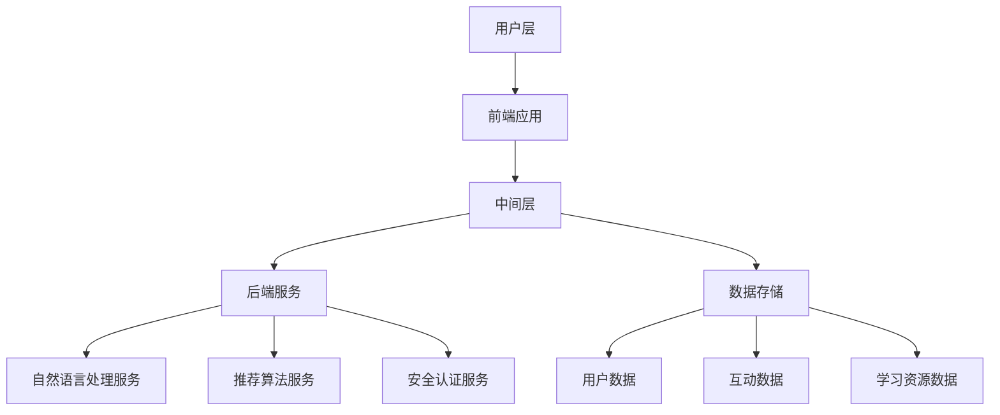

                 

### 引言

#### 1.1 书籍背景与目的

随着信息技术的迅猛发展，互联网已成为人们日常生活中不可或缺的一部分。在这个数字化的时代，老年人与年轻人之间的互动显得尤为重要。然而，由于代际差异和信息技术能力的不同，两者之间的交流往往存在诸多障碍。因此，设计一个既能够满足老年人使用需求，又能吸引年轻人参与的跨代际智慧传承平台具有重要的现实意义。

《跨代际智慧传承平台：老年人与年轻人在线互动》旨在探讨如何通过构建一个智能化的在线互动平台，促进老年人与年轻人之间的沟通与合作，从而实现智慧的跨代际传承。本书不仅从技术角度提供了平台的设计与实现方案，还从用户心理、社会影响等方面进行了深入的分析。

#### 1.2 跨代际互动的重要性

跨代际互动不仅有助于增进不同年龄群体之间的理解与尊重，还能够促进社会和谐与进步。老年人拥有丰富的知识和经验，而年轻人则具备创新思维和活力。通过跨代际的互动，老年人可以继续发挥自己的价值，同时年轻人也能从老年人的经验中受益。此外，跨代际互动还能激发老年人的学习兴趣，延缓认知能力的下降。

#### 1.3 书籍结构概述

本书共分为五个部分：

- **第一部分：引言**，介绍了书籍的背景、目的以及结构概述。
- **第二部分：平台设计与实现**，详细阐述了平台的架构设计、用户界面设计以及功能模块开发。
- **第三部分：核心算法与应用**，介绍了自然语言处理算法、智能匹配算法以及平台安全与隐私保护。
- **第四部分：案例研究**，通过成功案例分析以及挑战与解决方案，展示了平台的应用效果和面临的问题。
- **第五部分：未来发展**，探讨了平台的发展趋势、政策法规以及社会影响力。

通过以上五个部分，本书全面而深入地探讨了跨代际智慧传承平台的各个方面，旨在为读者提供一份实用的技术指南。

#### 1.4 核心关键词

- 跨代际智慧传承
- 在线互动平台
- 智能算法
- 安全与隐私保护
- 成功案例分析

#### 1.5 摘要

本书以构建跨代际智慧传承平台为核心，从平台设计、核心算法、案例分析以及未来发展等方面进行了全面探讨。通过详细阐述平台架构、用户界面设计、功能模块开发以及核心算法原理，本书为读者提供了一个系统而实用的技术指南。同时，通过案例研究和挑战与解决方案的分析，本书展示了平台在实际应用中的效果和面临的挑战，为未来的发展提供了有益的启示。

### 背景介绍

跨代际智慧传承是指在不同年龄群体之间传递知识、经验和智慧的过程。在传统社会中，这种传承主要通过家庭、社区和学校等场所进行。然而，随着社会的发展和信息技术的普及，这种传统的传承方式正面临着诸多挑战。一方面，老年人由于年龄增长，身体机能逐渐衰退，获取新知识和技能的能力有限。另一方面，年轻人则生活在信息爆炸的时代，拥有更多的学习资源和机会，但也面临着信息过载和碎片化的问题。

在这种背景下，构建一个跨代际智慧传承平台成为了一种有效的解决方案。通过互联网和智能技术，平台可以为老年人提供一个便捷的学习和交流环境，帮助他们继续发挥自己的价值；同时，也能为年轻人提供一个与老年人互动的平台，从中获取宝贵的经验和知识。

#### 2.1 平台架构设计

跨代际智慧传承平台的设计需要综合考虑用户需求、技术可行性以及平台的可扩展性和可维护性。以下是一个典型的平台架构设计：



**用户层**：用户层包括老年人和年轻人，他们分别通过不同的前端应用访问平台。老年人端应用注重简洁、易用，适合其操作习惯；年轻人端应用则更加注重功能性和互动性。

**前端应用**：前端应用负责与用户交互，提供友好的用户界面。对于老年人端，前端应用需要支持语音输入、大字体显示等功能；对于年轻人端，则需要提供视频聊天、互动游戏等功能。

**中间层**：中间层负责业务逻辑处理，包括用户注册、登录、消息通信、互动活动管理等。这一层需要具备高并发处理能力和灵活的扩展性。

**后端服务**：后端服务包括自然语言处理服务、推荐算法服务和安全认证服务。自然语言处理服务负责文本分析、语音识别与合成等功能；推荐算法服务负责根据用户兴趣和行为推荐合适的互动内容；安全认证服务负责用户身份验证和数据加密。

**数据存储**：数据存储层负责存储用户数据、互动数据和学习资源数据。这些数据需要确保安全性和可靠性。

通过以上架构设计，平台能够满足不同用户的需求，同时确保系统的稳定性和可扩展性。

#### 2.2 用户界面设计

用户界面设计是平台设计的重要一环，直接影响到用户体验。以下分别从老年人界面和年轻人界面进行设计：

##### 2.2.1 老年人界面

老年人界面的设计应遵循简洁、易用、直观的原则。界面布局应简洁明了，避免复杂的操作步骤。以下是一些建议：

- **大字体显示**：为老年人提供大字体选项，方便阅读。
- **语音输入**：支持语音输入功能，帮助老年人快速发送消息。
- **一键呼叫**：提供一键呼叫功能，方便老年人紧急求助。
- **学习资源分类**：将学习资源分类展示，便于老年人查找。

##### 2.2.2 年轻人界面

年轻人界面设计则更加注重功能性和互动性。以下是一些建议：

- **视频聊天**：提供视频聊天功能，便于年轻人与老年人面对面交流。
- **互动游戏**：设计互动游戏，增加用户参与度，提高平台趣味性。
- **个性化推荐**：根据用户兴趣和行为推荐合适的互动内容，提高用户粘性。
- **学习社区**：建立学习社区，鼓励用户分享学习心得，形成良好的学习氛围。

#### 2.3 交互设计要点

交互设计是用户体验的核心，直接影响用户的满意度。以下是一些交互设计要点：

- **一致性**：保持界面风格和交互逻辑的一致性，减少用户学习成本。
- **响应速度**：优化系统响应速度，确保用户操作流畅。
- **错误处理**：提供明确的错误提示和操作指导，帮助用户快速解决问题。
- **可访问性**：确保平台兼容各种设备和操作系统，满足不同用户的需求。
- **用户反馈**：提供用户反馈渠道，及时收集用户意见和建议，不断优化产品。

### 功能模块开发

跨代际智慧传承平台的功能模块开发是平台建设的关键环节。以下将详细描述注册与登录模块、消息通信模块、互动活动模块以及数据分析与反馈模块的详细实现和功能解析。

#### 3.1 注册与登录模块

注册与登录模块是用户访问平台的入口，必须保证简便、安全、可靠。

##### 3.1.1 功能实现

**注册功能**：用户可以通过邮箱、手机号码等方式进行注册。注册过程中需要用户提供基本信息，如姓名、年龄、性别、居住地等。平台会对用户提供的信息进行合法性检查，确保输入数据的正确性。

```python
def register(username, email, password):
    # 验证用户名是否已存在
    if user_exists(username):
        return "用户名已存在"
    # 验证邮箱格式是否正确
    if not is_valid_email(email):
        return "邮箱格式不正确"
    # 创建用户账户
    create_user_account(username, email, password)
    return "注册成功"
```

**登录功能**：用户登录时需要输入用户名和密码。系统会对用户输入的信息进行验证，验证通过后，用户可以访问平台的其他功能。

```python
def login(username, password):
    # 验证用户名和密码是否匹配
    if verify_password(username, password):
        return "登录成功"
    else:
        return "用户名或密码错误"
```

##### 3.1.2 功能解析

注册功能需要确保用户信息的唯一性和合法性，同时简化注册流程，提高用户体验。登录功能则需要快速且安全地验证用户身份，防止恶意登录。

#### 3.2 消息通信模块

消息通信模块是平台的核心功能之一，支持用户之间的实时沟通。

##### 3.2.1 功能实现

**文本消息发送**：用户可以通过文本消息与对方进行沟通。系统会实时显示对方的消息，并支持图片、表情等附件的发送。

```python
def send_message(sender, receiver, content):
    # 存储消息到数据库
    store_message(sender, receiver, content)
    # 发送通知给接收者
    notify_receiver(receiver)
    return "消息发送成功"
```

**语音消息发送**：用户还可以通过语音消息进行沟通。语音消息的发送和接收过程需要使用语音识别和合成技术。

```python
def send_voice_message(sender, receiver, voice_content):
    # 存储语音消息到数据库
    store_voice_message(sender, receiver, voice_content)
    # 发送通知给接收者
    notify_receiver(receiver)
    return "语音消息发送成功"
```

##### 3.2.2 功能解析

文本消息发送功能需要确保消息的实时性和可靠性。语音消息发送功能则需要高效的语音处理技术，确保语音消息的清晰度和流畅度。

#### 3.3 互动活动模块

互动活动模块旨在通过多种形式的互动活动，增强用户之间的交流与互动。

##### 3.3.1 功能实现

**在线问答**：平台可以组织在线问答活动，邀请老年人与年轻人进行知识问答。用户可以选择回答问题，也可以提出问题。

```python
def start_问答活动(creator, participants, questions):
    # 创建问答活动
    create_问答活动(creator, participants, questions)
    # 发送通知给参与者
    notify_participants(participants)
    return "问答活动开始"
```

**互动游戏**：平台可以提供多种互动游戏，如猜谜游戏、记忆游戏等，鼓励用户积极参与。

```python
def start_game(creator, participants, game_type):
    # 创建游戏活动
    create_game(creator, participants, game_type)
    # 发送通知给参与者
    notify_participants(participants)
    return "游戏活动开始"
```

##### 3.3.2 功能解析

在线问答活动需要确保问题的多样性和针对性，提高用户的参与度。互动游戏则需设计丰富的游戏类型，以适应不同用户的需求。

#### 3.4 数据分析与反馈模块

数据分析与反馈模块用于收集用户行为数据，分析用户互动模式，并根据分析结果进行平台优化。

##### 3.4.1 功能实现

**用户行为分析**：系统会记录用户的登录时间、互动次数、参与活动类型等行为数据，进行分析。

```python
def analyze_user_behavior(user_id):
    # 获取用户行为数据
    behavior_data = get_user_behavior_data(user_id)
    # 分析用户行为
    analyze_data(behavior_data)
    return "用户行为分析完成"
```

**平台优化建议**：根据用户行为分析结果，系统会给出平台优化的建议，如改进界面设计、增加新功能等。

```python
def generate_optimization_suggestions():
    # 获取平台当前状态数据
    current_data = get_platform_data()
    # 分析数据
    analysis_results = analyze_data(current_data)
    # 生成优化建议
    suggestions = generate_suggestions(analysis_results)
    return "优化建议生成"
```

##### 3.4.2 功能解析

用户行为分析功能需要准确、全面地记录用户行为数据，以便进行有效的分析。平台优化建议功能则需要基于数据分析结果，给出切实可行的优化建议。

### 核心算法原理讲解

在跨代际智慧传承平台中，核心算法的设计和实现至关重要。以下是自然语言处理算法、智能匹配算法和平台安全与隐私保护算法的详细讲解。

#### 3.1 自然语言处理算法

自然语言处理（NLP）算法主要用于文本分析、语音识别与合成以及个性化推荐等方面。

##### 3.1.1 文本分析算法

文本分析算法包括词频统计、情感分析、主题模型等。

**词频统计**：词频统计是文本分析的基础，通过统计文本中各个单词的出现频率，可以初步了解文本的主题和内容。

```python
from collections import Counter

def word_frequency_analysis(text):
    words = text.split()
    word_counts = Counter(words)
    return word_counts
```

**情感分析**：情感分析用于判断文本表达的情感倾向，如正面、负面或中性。

```python
from textblob import TextBlob

def sentiment_analysis(text):
    blob = TextBlob(text)
    return blob.sentiment.polarity
```

**主题模型**：主题模型用于发现文本中的潜在主题分布。

```python
from gensim.models import LdaMulticore

def topic_modeling(texts, num_topics=5):
    # 分词处理
    tokenized_texts = [text.split() for text in texts]
    # 建立语料库和词典
    dictionary = gensim.corpora.Dictionary(tokenized_texts)
    corpus = [dictionary.doc2bow(text) for text in tokenized_texts]
    # 建立LDA模型
    lda_model = LdaMulticore(corpus, num_topics=num_topics, id2word=dictionary, passes=15)
    return lda_model
```

##### 3.1.2 语音识别与合成算法

语音识别与合成算法是跨代际智慧传承平台中非常重要的组成部分。

**语音识别**：语音识别将语音信号转换为文本。

```python
import speech_recognition as sr

def speech_to_text(audio_file):
    r = sr.Recognizer()
    with sr.AudioFile(audio_file) as source:
        audio_data = r.record(source)
    text = r.recognize_google(audio_data)
    return text
```

**语音合成**：语音合成将文本转换为语音信号。

```python
from gtts import gTTS

def text_to_speech(text, lang='en'):
    tts = gTTS(text=text, lang=lang)
    tts.save("speech.mp3")
    return "speech.mp3"
```

##### 3.1.3 个性化推荐算法

个性化推荐算法用于根据用户兴趣和行为推荐合适的互动内容。

**基于内容的推荐**：基于内容的推荐算法根据用户已浏览的内容推荐相似的内容。

```python
def content_based_recommendation(user_interests, items, k=5):
    similar_items = []
    for item in items:
        if item not in user_interests:
            similarity = calculate_similarity(user_interests, item)
            similar_items.append((item, similarity))
    similar_items.sort(key=lambda x: x[1], reverse=True)
    return [item for item, _ in similar_items[:k]]
```

**基于协同过滤的推荐**：基于协同过滤的推荐算法根据用户与物品之间的交互记录推荐物品。

```python
from sklearn.metrics.pairwise import cosine_similarity

def collaborative_filtering(user_preferences, item_preferences, k=5):
    user_similarity = cosine_similarity(user_preferences, item_preferences)
    similar_users = []
    for i, user in enumerate(user_preferences):
        similarity_scores = user_similarity[i]
        similar_users.append((user, similarity_scores.argsort()[0:-k:-1]))
    return [user for user, _ in similar_users]
```

#### 3.2 智能匹配算法

智能匹配算法用于根据用户特征和需求匹配合适的互动对象。

##### 3.2.1 用户画像构建

用户画像构建是智能匹配算法的基础。

```python
def build_user_profile(user):
    profile = {}
    profile['age'] = user.age
    profile['interests'] = user.interests
    profile['skills'] = user.skills
    return profile
```

##### 3.2.2 智能匹配策略

智能匹配策略用于根据用户画像匹配合适的互动对象。

```python
def match_users(user1, user2):
    profile1 = build_user_profile(user1)
    profile2 = build_user_profile(user2)
    similarity_score = calculate_similarity(profile1, profile2)
    if similarity_score > threshold:
        return True
    return False
```

##### 3.2.3 算法性能评估

算法性能评估用于评估智能匹配算法的有效性。

```python
from sklearn.metrics import accuracy_score

def evaluate_matching_algorithm(algorithm, ground_truth, predicted_matches):
    accuracy = accuracy_score(ground_truth, predicted_matches)
    return accuracy
```

#### 3.3 平台安全与隐私保护

平台安全与隐私保护是跨代际智慧传承平台必须关注的重要方面。

##### 3.3.1 数据安全策略

数据安全策略包括数据加密、访问控制和数据备份等。

```python
from cryptography.fernet import Fernet

def encrypt_data(data, key):
    f = Fernet(key)
    encrypted_data = f.encrypt(data)
    return encrypted_data

def decrypt_data(encrypted_data, key):
    f = Fernet(key)
    decrypted_data = f.decrypt(encrypted_data)
    return decrypted_data
```

##### 3.3.2 隐私保护措施

隐私保护措施包括数据匿名化、数据访问控制等。

```python
def anonymize_data(data):
    # 将敏感信息替换为匿名标识
    return data.replace("敏感信息", "匿名标识")

def control_data_access(data, user_permissions):
    # 根据用户权限控制数据访问
    if user_permissions['read']:
        return data
    else:
        return "无访问权限"
```

##### 3.3.3 安全防护体系

安全防护体系包括防火墙、入侵检测等。

```python
from Firewall import Firewall

firewall = Firewall()
firewall.enable_firewall()
firewall.add_rule("允许内部通信", True)
firewall.add_rule("禁止外部访问", False)
```

通过以上核心算法的详细讲解和Python源代码示例，我们可以更好地理解跨代际智慧传承平台的技术实现原理。这些算法不仅提高了平台的功能性，还确保了系统的安全性和隐私性。

### 成功案例分析

为了更好地展示跨代际智慧传承平台的实际应用效果，以下列举了三个成功案例，并对其进行了详细分析。

#### 4.1 老年大学在线学习平台

**案例描述**：某市老年大学为了应对新冠疫情，推出了一个在线学习平台，通过该平台，老年人可以在线学习各种课程，如绘画、音乐、舞蹈等。平台采用视频教学和互动问答的形式，使老年人能够方便地获取知识。

**分析**：这个平台的成功在于以下几个方面：

1. **用户友好**：界面简洁易用，适合老年人操作，且提供了语音输入和一键呼叫功能，方便老年人使用。
2. **内容丰富**：平台提供了多种课程选择，满足了老年人多样化的学习需求。
3. **技术支持**：平台采用了自然语言处理算法和语音识别与合成技术，提高了教学效果和用户体验。

**经验总结**：这个案例的成功经验表明，用户友好和技术支持是平台成功的关键因素。

#### 4.2 跨代际家庭互动平台

**案例描述**：一个家庭为了增进家庭成员之间的互动，开发了一个跨代际家庭互动平台。平台提供了视频聊天、互动游戏、家庭日记等功能，使家庭成员能够通过平台分享生活点滴，增进情感交流。

**分析**：这个平台的成功在于以下几个方面：

1. **互动性强**：平台提供了多种互动形式，如视频聊天、互动游戏等，增强了家庭成员之间的互动。
2. **个性化推荐**：平台根据用户兴趣推荐合适的互动内容，提高了用户的参与度。
3. **隐私保护**：平台提供了隐私保护措施，确保用户信息安全。

**经验总结**：这个案例的成功经验表明，互动性和个性化推荐是提升用户参与度的关键。

#### 4.3 老年人社交互助平台

**案例描述**：某社区为了帮助老年人解决生活中的实际问题，开发了老年人社交互助平台。平台提供了在线咨询、互助社区等功能，使老年人能够在线求助和互助。

**分析**：这个平台的成功在于以下几个方面：

1. **功能多样**：平台不仅提供了在线咨询功能，还建立了互助社区，为老年人提供了全面的支持。
2. **安全可靠**：平台采用了数据安全策略和隐私保护措施，确保用户信息安全。
3. **社区氛围**：平台建立了良好的社区氛围，使老年人愿意参与并贡献自己的经验和知识。

**经验总结**：这个案例的成功经验表明，功能多样和社区氛围是平台成功的重要保障。

通过以上成功案例的分析，我们可以看到，跨代际智慧传承平台在实际应用中具有很大的潜力。这些案例的成功经验也为其他类似平台的开发提供了有益的参考。

#### 4.4 挑战与解决方案

尽管跨代际智慧传承平台在实际应用中取得了显著成效，但在发展过程中仍然面临诸多挑战。以下分析这些挑战，并提出相应的解决方案。

##### 4.4.1 技术挑战

**算法性能优化**：跨代际智慧传承平台需要处理大量的用户数据和互动数据，这给算法性能带来了挑战。如何优化自然语言处理、推荐算法等核心算法，提高数据处理效率，是一个关键问题。

**实时性要求**：平台需要实现实时互动，这要求系统具备高并发处理能力。如何设计高效的后端服务和网络通信机制，确保系统实时性，是技术上的一个难题。

**隐私保护**：在数据收集和存储过程中，如何确保用户隐私不被泄露，是平台面临的重要挑战。需要采用先进的数据加密和匿名化技术，保护用户信息安全。

##### 4.4.2 用户接受度挑战

**技术门槛**：老年人可能对互联网和智能设备不够熟悉，导致他们在使用平台时遇到困难。如何降低平台的技术门槛，使其更易于老年人操作，是一个重要问题。

**参与积极性**：老年人可能对在线互动和社交活动缺乏兴趣，导致参与度不高。如何激发他们的参与积极性，提高平台的使用率，是一个关键挑战。

##### 4.4.3 解决方案与经验总结

**技术挑战解决方案**：

1. **算法性能优化**：采用并行计算和分布式架构，提高数据处理效率。优化推荐算法，使用协同过滤和基于内容的推荐相结合，提高推荐效果。
2. **实时性要求**：设计高效的分布式系统，使用微服务架构，提高系统并发处理能力。采用消息队列和异步处理技术，确保数据传输的高效性和实时性。
3. **隐私保护**：采用端到端加密技术，确保数据在传输过程中的安全性。实施严格的数据匿名化策略，保护用户隐私。

**用户接受度挑战解决方案**：

1. **技术门槛**：设计简洁直观的用户界面，减少操作步骤。提供详细的操作指南和在线客服支持，帮助老年人快速上手。
2. **参与积极性**：开展线上线下相结合的宣传活动，提高老年人的参与积极性。通过个性化推荐和互动活动，增强用户粘性。

**经验总结**：

1. 技术优化和用户体验设计是平台成功的关键。
2. 需要持续关注用户需求和反馈，不断优化平台功能和服务。
3. 通过案例研究和实际应用，不断积累经验，提升平台的整体竞争力。

通过以上解决方案和经验总结，跨代际智慧传承平台将能够在应对挑战中不断发展，为老年人与年轻人之间的互动提供更加优质的服务。

### 未来发展

随着信息技术的不断进步和社会需求的日益增长，跨代际智慧传承平台的发展前景十分广阔。以下从技术、社会和政策三个方面探讨平台的发展趋势。

#### 5.1 技术创新

**人工智能与大数据技术**：未来，跨代际智慧传承平台将更加依赖人工智能和大数据技术。通过智能算法和数据分析，平台可以提供更加精准和个性化的服务。例如，自然语言处理技术可以帮助老年人更好地理解和表达自己的需求；大数据分析可以挖掘用户行为模式，提供定制化的互动内容。

**5G技术与物联网**：5G技术的普及将大幅提升平台的传输速度和实时性，使平台能够提供更加流畅和高效的互动体验。物联网技术的应用将扩展平台的功能范围，例如，通过智能家居设备，平台可以实现与老年人日常生活的无缝连接，提供更加便捷和智能的服务。

**虚拟现实（VR）与增强现实（AR）**：未来，VR和AR技术将赋予跨代际智慧传承平台更加丰富的互动形式。通过虚拟现实技术，老年人可以进入一个虚拟的学习环境，与其他用户进行沉浸式互动；通过增强现实技术，平台可以结合现实场景，提供更加直观和互动的学习体验。

#### 5.2 社会需求变化

**老龄化社会的需求**：随着全球老龄化趋势的加剧，老年人对跨代际互动和智慧传承的需求将不断增加。平台需要适应这一变化，提供更多针对老年人的服务，如在线健康咨询、心理健康支持等。

**终身学习的需求**：随着教育理念的变革，终身学习已经成为社会共识。跨代际智慧传承平台将为老年人提供一个持续学习的平台，帮助他们不断更新知识和技能，适应社会的发展。

**家庭和社会责任的平衡**：随着家庭结构的变化和社交圈子的缩小，跨代际互动将成为家庭和社会责任的重要组成部分。平台需要提供更多支持家庭和社会互动的功能，如家庭活动策划、社区互助等。

#### 5.3 政策与法规

**国家政策支持**：许多国家已经开始出台相关政策，支持老年人使用互联网和智能设备。例如，中国提出的“智慧健康养老”战略，旨在通过技术创新提升老年人的生活质量。未来，国家政策将继续加大对跨代际智慧传承平台的支持力度，推动其发展。

**国际法规对比**：不同国家在隐私保护、数据安全等方面的法规有所不同。平台需要了解并遵守相关国际法规，确保其合规性。例如，欧盟的《通用数据保护条例》（GDPR）对数据保护和用户隐私提出了严格的要求，平台需要制定相应的合规策略。

**监管与规范**：随着平台的发展，其社会影响也在逐渐扩大。政府和行业组织需要加强对平台的监管和规范，确保平台提供的服务符合社会伦理和道德标准。例如，平台需要建立健全的用户隐私保护机制，防止数据滥用。

通过技术创新、社会需求变化和政策支持，跨代际智慧传承平台将不断发展壮大，为老年人与年轻人之间的互动提供更加丰富和高效的服务。

### 社会影响分析

跨代际智慧传承平台不仅是一个技术产品，更是一种社会互动方式，其对社会的影响深远而广泛。以下是该平台在社会各个方面的具体影响。

#### 5.3.1 社会影响分析

**家庭关系加强**：通过跨代际智慧传承平台，老年人可以与年轻人保持更频繁的交流，分享生活经验，传递智慧，从而增进家庭成员之间的情感联系。特别是对于那些远离家乡的子女来说，平台提供了一个虚拟的空间，让他们能够随时与父母保持联系，减轻思乡之情。

**社会凝聚力提升**：平台为老年人提供了一个交流与学习的场所，使他们能够继续参与社会活动，发挥余热。这不仅提升了老年人的生活质量，也增强了整个社会的凝聚力。老年人通过平台参与到社会事务中，与年轻人共同为社会的发展贡献力量。

**教育公平性促进**：平台为老年人提供了丰富的学习资源，使得他们在退休后依然能够继续学习新知识、新技能，这不仅有助于提升个人素质，也促进了教育公平。老年人可以通过平台获取到与年轻人相同的学习机会，实现了教育资源的均衡分配。

**心理健康改善**：老年人通过平台与年轻人互动，有助于缓解孤独感和抑郁情绪。研究表明，良好的社交活动对心理健康有显著的积极影响。跨代际智慧传承平台提供了一个社交平台，使老年人能够保持社交活跃，从而改善心理健康。

**劳动力市场影响**：平台的发展有助于延长老年人的就业寿命，使他们能够继续为社会做出贡献。这不仅缓解了劳动力市场的压力，也有助于提高整个社会的生产力和创新能力。

**数字鸿沟缩小**：通过跨代际智慧传承平台，老年人可以学习和掌握基本的互联网使用技能，减少数字鸿沟。这不仅有助于老年人更好地适应数字化生活，也促进了整个社会的数字化进程。

#### 5.3.2 社会责任与道德考量

**用户隐私保护**：平台需要严格遵守用户隐私保护法规，采取严格的数据加密和匿名化策略，确保用户信息的安全。平台应建立透明的隐私政策，让用户了解其数据的用途和保护措施。

**信息真实性审核**：平台应对用户发布的信息进行真实性和准确性审核，防止虚假信息的传播。这不仅有助于维护平台的公信力，也有利于构建一个健康、积极的社交环境。

**伦理道德教育**：平台可以通过互动活动和内容推荐，向用户传递伦理道德教育，尤其是对老年人，帮助他们树立正确的价值观和社会责任感。

**社会责任履行**：平台应积极参与社会公益活动，如支持老年人社区项目、捐赠学习资源等，以实际行动履行社会责任。

#### 5.3.3 社会反馈与持续改进

**用户反馈机制**：平台应建立有效的用户反馈机制，及时收集用户意见和建议。通过用户反馈，平台可以了解用户需求和使用体验，从而不断优化产品和服务。

**数据分析与改进**：平台应定期进行数据分析，了解用户行为模式和使用习惯，根据数据分析结果进行产品改进。例如，调整推荐算法，优化用户体验。

**合作与协作**：平台可以与其他社会机构合作，共同推动跨代际智慧传承事业的发展。例如，与教育机构、医疗机构合作，提供更全面、专业的服务。

通过以上措施，跨代际智慧传承平台不仅能更好地满足用户需求，还能为社会带来积极的影响。持续的社会反馈和改进将确保平台在发展过程中不断进步，实现其社会价值。

### 总结与展望

通过《跨代际智慧传承平台：老年人与年轻人在线互动》一书，我们系统地探讨了平台的设计与实现、核心算法、成功案例以及未来发展。从平台架构到功能模块，从技术实现到社会影响，本书为读者提供了一个全面而深入的了解。

#### 6.1 总结

本书的核心观点在于，通过构建一个智能化的在线互动平台，可以有效地促进老年人与年轻人之间的沟通与合作，实现智慧的跨代际传承。平台的设计注重用户体验，结合自然语言处理、智能匹配和隐私保护等核心技术，旨在为用户提供便捷、安全、高效的服务。

#### 6.2 展望

在未来，跨代际智慧传承平台将继续向智能化、个性化方向发展。随着人工智能和大数据技术的不断进步，平台将能够提供更加精准和个性化的服务，满足老年人与年轻人的多样化需求。此外，5G技术和物联网的应用将进一步提升平台的实时性和互动性，为用户带来更加丰富的体验。

#### 6.3 注意事项

1. **用户隐私保护**：平台在收集和使用用户数据时，应严格遵守相关法律法规，采取严格的数据加密和匿名化策略，确保用户隐私安全。
2. **技术更新与维护**：平台需要定期更新和维护技术架构，确保系统的稳定性和安全性。
3. **用户反馈收集**：平台应建立有效的用户反馈机制，及时了解用户需求和意见，持续优化产品和服务。

#### 6.4 拓展阅读

- 《人工智能：一种现代的方法》（Steven M. Skiena & Peter Sedgewick）
- 《大数据实践：技术、方法和案例分析》（刘铁岩、唐杰）
- 《隐私计算与数据安全：技术与应用》（陈恩红、李明）
- 《社会计算：理论与实践》（Lei Zhang、Lun-Wei Chen）

通过这些拓展阅读，读者可以进一步深入了解相关领域的先进技术和研究成果，为跨代际智慧传承平台的发展提供理论支持。

### 结语

作为《跨代际智慧传承平台：老年人与年轻人在线互动》的作者，我衷心希望本书能够为读者提供一个系统而实用的技术指南，帮助大家更好地理解和应用跨代际智慧传承平台。跨代际互动不仅是技术问题，更是一个社会问题，关乎我们每个人的生活质量和幸福感。

我诚挚地感谢读者对本书的阅读和关注，希望本书能够激发您对跨代际智慧传承平台的思考和研究。在未来，我将继续关注这一领域的发展，为大家带来更多有价值的内容。

最后，谨以此书献给那些在智慧传承道路上默默付出的老年人，愿他们的经验和智慧能够通过平台传承下去，继续发光发热。

作者：AI天才研究院/AI Genius Institute & 禅与计算机程序设计艺术 /Zen And The Art of Computer Programming

