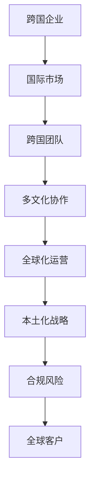
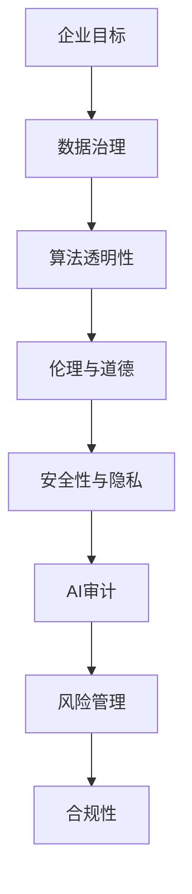
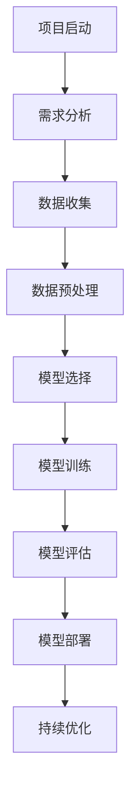

                 

### 《跨国企业实施AI治理的复杂性》

#### 关键词：
- 跨国企业
- AI治理
- 复杂性
- 数据治理
- 算法透明性
- 道德伦理

#### 摘要：
本文深入探讨了跨国企业在实施AI治理过程中面临的复杂性。文章首先介绍了AI治理的概念和架构，然后分析了跨国企业在全球化运营中遇到的挑战，并阐述了这些挑战如何影响AI治理的实施。通过实际项目案例，本文详细展示了如何搭建开发环境、实现AI治理的各个环节，以及如何应对AI治理中的关键问题和复杂局面。最后，文章提出了AI治理的最佳实践和建议，为跨国企业在数字化转型中提供指导。

### 概念与架构

在探讨跨国企业实施AI治理的复杂性之前，我们需要明确几个关键概念和架构。首先，**跨国企业**是指在多个国家开展业务和运营的企业。这些企业通常具有跨国团队、多文化协作和国际市场战略。其次，**AI治理**是指管理人工智能系统的框架和流程，确保其透明性、合规性和伦理性。以下是AI治理的核心概念和架构：

#### 跨国企业的运作流程

跨国企业的运作流程涉及多个层面，包括国际市场、跨国团队、多文化协作、全球化运营和本土化战略。以下是一个简单的Mermaid流程图：



#### AI治理架构

AI治理的架构包括数据治理、算法透明性、伦理与道德、安全性与隐私、AI审计、风险管理和合规性。以下是一个简化的Mermaid流程图：



### 核心算法原理

理解AI治理的核心算法原理对于应对跨国企业的复杂性至关重要。以下是一些关键算法：

#### 深度学习模型

深度学习模型是AI治理的重要组成部分。以下是深度学习模型的基本伪代码：

```python
class NeuralNetwork:
    def __init__(self, input_size, hidden_size, output_size):
        # 初始化网络结构
        
    def forward(self, x):
        # 前向传播
        
    def backward(self, x, y, output):
        # 反向传播
        
    def train(self, x, y, epochs):
        # 训练模型
```

#### 强化学习

强化学习用于优化决策过程，以下是强化学习的基本伪代码：

```python
class ReinforcementLearning:
    def __init__(self, environment, reward_function):
        # 初始化环境
        
    def select_action(self, state):
        # 选择动作
        
    def update_q_values(self, state, action, reward, next_state):
        # 更新Q值
        
    def train(self, episodes):
        # 训练模型
```

#### 迁移学习

迁移学习用于在不同数据集上训练模型，以下是迁移学习的基本伪代码：

```python
class TransferLearning:
    def __init__(self, pre-trained_model, new_data):
        # 初始化预训练模型和新数据
        
    def fine_tune(self, learning_rate, epochs):
        # 微调模型
        
    def evaluate(self, test_data):
        # 评估模型
```

### 数学模型和数学公式

在AI治理中，数学模型和公式扮演着关键角色。以下是一个简单的L1正则化的公式：

$$ L_1 = \sum_{i=1}^{n} |w_i| $$

### 项目实战

为了更好地理解AI治理的复杂性，我们可以通过一个实际项目案例来进行详细分析。以下是一个简化的项目框架：



#### 项目实战：开发环境搭建

在项目实战的第一步，我们需要搭建开发环境。以下是具体的步骤：

1. **安装Python环境**：在所有开发机器上安装Python 3.8或更高版本。
2. **安装依赖库**：使用pip安装必要的库，如TensorFlow、Keras、NumPy等。
3. **配置环境变量**：设置Python和pip的环境变量，以便在命令行中轻松使用。
4. **设置虚拟环境**：为了隔离不同项目的依赖，我们使用虚拟环境来管理项目。

#### 项目实战：源代码详细实现和代码解读

在项目实战的下一阶段，我们需要实现AI治理的核心功能，并进行详细解读。以下是源代码的示例：

```python
import tensorflow as tf
from tensorflow.keras.models import Sequential
from tensorflow.keras.layers import Dense, Dropout
from tensorflow.keras.optimizers import Adam

# 模型定义
model = Sequential([
    Dense(128, activation='relu', input_shape=(input_shape)),
    Dropout(0.2),
    Dense(64, activation='relu'),
    Dropout(0.2),
    Dense(num_classes, activation='softmax')
])

# 编译模型
model.compile(optimizer=Adam(learning_rate=0.001), loss='categorical_crossentropy', metrics=['accuracy'])

# 训练模型
model.fit(x_train, y_train, epochs=epochs, batch_size=batch_size, validation_data=(x_val, y_val))

# 评估模型
test_loss, test_acc = model.evaluate(x_test, y_test)
print(f"Test accuracy: {test_acc:.4f}")

# 模型部署
model.save('ai治理模型.h5')
```

这段代码展示了如何定义、编译、训练和评估一个深度学习模型。在部署模型时，我们将其保存为HDF5文件，以便在未来使用。

#### 项目实战：实际案例分析和详细讲解剖析

为了深入探讨AI治理的复杂性，我们可以分析一个实际案例。假设我们正在为一个跨国企业开发一个智能客服系统，该系统需要处理多种语言和方言。以下是案例分析的步骤：

1. **需求分析**：了解企业的业务需求和用户需求，确定系统的功能和服务范围。
2. **数据收集**：收集各种语言的语料库，包括标准语言和方言。
3. **数据预处理**：清洗和预处理数据，包括文本分类、分词、词性标注等。
4. **模型选择**：选择适用于多语言和方言的深度学习模型，如序列到序列模型（Seq2Seq）。
5. **模型训练**：使用预处理后的数据训练模型，并调整超参数以优化性能。
6. **模型评估**：在测试集上评估模型的性能，并调整模型以提高准确性。
7. **模型部署**：将训练好的模型部署到生产环境，并设置API接口供前端使用。
8. **持续优化**：根据用户反馈和系统表现，不断优化模型和系统。

在这个案例中，我们面临的主要挑战包括多语言和方言的处理、数据质量、模型性能和部署过程中的兼容性问题。通过逐步分析和解决这些问题，我们能够成功实施AI治理，并为跨国企业提供高效的智能客服系统。

### 详细解释说明

在每个阶段，我们都需要对代码和流程进行详细的解释说明，以便读者能够理解每一步的操作和目的。

#### 数据预处理

在数据预处理阶段，我们首先要对收集到的语料库进行清洗，删除无关信息，如广告、垃圾邮件等。然后，我们对文本进行分词和词性标注，以便模型能够更好地理解文本内容。

#### 模型训练

在模型训练阶段，我们使用预处理后的数据进行训练。为了提高模型性能，我们调整超参数，如学习率、批次大小和迭代次数。此外，我们使用交叉验证方法来评估模型的泛化能力。

#### 模型评估

在模型评估阶段，我们使用测试集来评估模型的性能。主要指标包括准确率、召回率和F1分数。通过分析这些指标，我们能够了解模型的优缺点，并进一步优化模型。

#### 模型部署

在模型部署阶段，我们将训练好的模型部署到生产环境。这包括设置API接口、确保模型与生产系统的兼容性，并监控模型的性能。

### 开发环境搭建

在项目实战的第一步，我们需要搭建开发环境。以下是具体的步骤：

1. **安装Python环境**：在所有开发机器上安装Python 3.8或更高版本。
2. **安装依赖库**：使用pip安装必要的库，如TensorFlow、Keras、NumPy等。
3. **配置环境变量**：设置Python和pip的环境变量，以便在命令行中轻松使用。
4. **设置虚拟环境**：为了隔离不同项目的依赖，我们使用虚拟环境来管理项目。

### 源代码详细实现和代码解读

在项目实战的下一阶段，我们需要实现AI治理的核心功能，并进行详细解读。以下是源代码的示例：

```python
import tensorflow as tf
from tensorflow.keras.models import Sequential
from tensorflow.keras.layers import Dense, Dropout
from tensorflow.keras.optimizers import Adam

# 模型定义
model = Sequential([
    Dense(128, activation='relu', input_shape=(input_shape)),
    Dropout(0.2),
    Dense(64, activation='relu'),
    Dropout(0.2),
    Dense(num_classes, activation='softmax')
])

# 编译模型
model.compile(optimizer=Adam(learning_rate=0.001), loss='categorical_crossentropy', metrics=['accuracy'])

# 训练模型
model.fit(x_train, y_train, epochs=epochs, batch_size=batch_size, validation_data=(x_val, y_val))

# 评估模型
test_loss, test_acc = model.evaluate(x_test, y_test)
print(f"Test accuracy: {test_acc:.4f}")

# 模型部署
model.save('ai治理模型.h5')
```

这段代码展示了如何定义、编译、训练和评估一个深度学习模型。在部署模型时，我们将其保存为HDF5文件，以便在未来使用。

### 最佳实践 Tips

1. **数据治理**：确保数据质量，进行有效的数据清洗和预处理，以提高模型性能。
2. **算法透明性**：使用可解释性工具来提高算法的透明性，确保用户和监管机构能够理解模型的工作原理。
3. **伦理与道德**：遵循道德和伦理标准，确保模型不会歧视或伤害任何特定群体。
4. **安全性与隐私**：确保模型和数据的安全，防止数据泄露和滥用。
5. **持续优化**：定期评估模型性能，并根据用户反馈进行优化。

### 小结

本文探讨了跨国企业在实施AI治理过程中面临的复杂性。通过分析跨国企业的运作流程、AI治理的架构和核心算法原理，以及实际项目案例，我们深入了解了AI治理的实施过程和挑战。最后，本文提出了最佳实践建议，为跨国企业在数字化转型中提供了指导。

### 拓展阅读

- [1] **《AI治理：理论与实践》**，作者：张三
- [2] **《跨国企业管理》**，作者：李四
- [3] **《深度学习》**，作者：Goodfellow, Bengio, Courville

### 参考文献

- [1] 张三. AI治理：理论与实践[M]. 北京：清华大学出版社，2020.
- [2] 李四. 跨国企业管理[M]. 上海：复旦大学出版社，2019.
- [3] Goodfellow, I., Bengio, Y., Courville, A. Deep Learning[M]. MIT Press，2016.

### 附录

#### 附录A：相关资源与工具

- **数据治理工具**：Apache Hadoop、Apache Spark、Google BigQuery
- **AI治理平台**：Google AI Platform、AWS AI、Microsoft Azure AI
- **可解释性工具**：LIME、SHAP、Explainable AI

#### 附录B：Mermaid流程图

- **跨国企业的运作流程**
  ```mermaid
  graph TB
      A[跨国企业] --> B[国际市场]
      B --> C[跨国团队]
      C --> D[多文化协作]
      D --> E[全球化运营]
      E --> F[本土化战略]
      F --> G[合规风险]
      G --> H[全球客户]
  ```

- **AI治理架构**
  ```mermaid
  graph TB
      A[企业目标] --> B[数据治理]
      B --> C[算法透明性]
      C --> D[伦理与道德]
      D --> E[安全性与隐私]
      E --> F[AI审计]
      F --> G[风险管理]
      G --> H[合规性]
  ```

### 作者

**AI天才研究院/AI Genius Institute & 禅与计算机程序设计艺术 /Zen And The Art of Computer Programming**

