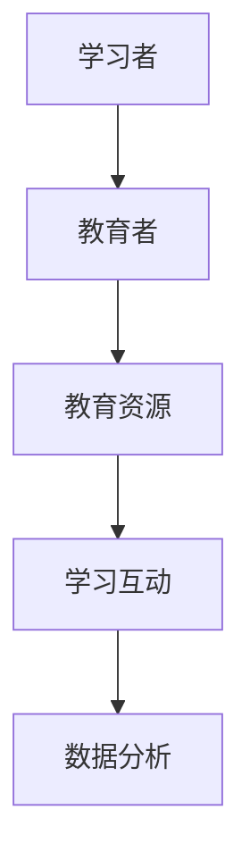

                 

# 跨年龄学习平台：促进代际知识交流

## 关键词
跨年龄学习，知识交流，在线教育，代际互动，人工智能技术，大数据分析

## 摘要
随着社会的快速发展和人口老龄化，跨年龄学习平台作为一种新兴的教育模式，正逐渐受到重视。本文旨在探讨跨年龄学习平台的概念、重要性、发展背景、技术基础、架构设计以及应用领域。通过对这些方面的深入分析，本文希望能够为跨年龄学习平台的设计与应用提供一些有益的思路和参考。

## 引言
在信息技术迅猛发展的今天，教育领域也迎来了前所未有的变革。传统的教育模式以年龄为界限，将学习者分为不同的阶段，这在一定程度上限制了知识的传递和交流。然而，随着人口老龄化趋势的加剧，以及社会对知识传承和创新的需求日益增长，跨年龄学习平台应运而生。跨年龄学习平台不仅打破了年龄的限制，为不同年龄段的学习者提供了交流和学习的机会，还促进了代际之间的知识共享和互动。

本文将从以下几个方面展开讨论：

1. 跨年龄学习平台的概述
2. 跨年龄学习平台的发展背景与技术基础
3. 跨年龄学习平台的架构与功能
4. 跨年龄学习平台的应用与案例分析

通过以上几个方面的详细分析，本文希望能够全面、系统地介绍跨年龄学习平台，为相关领域的研究和实践提供参考。

### 第一部分：跨年龄学习平台概述

#### 第1章：跨年龄学习平台的概念与重要性

**1.1 跨年龄学习平台的定义**

**跨年龄学习平台的定义：**
跨年龄学习平台是一种在线教育平台，它旨在打破年龄界限，为不同年龄段的学习者提供学习资源和交流空间。这种平台利用现代信息技术，整合各类教育资源，使学习者能够在合适的时间和地点进行自主学习，并与其他年龄段的学习者进行互动和交流。

**核心概念与联系：**
为了更好地理解跨年龄学习平台，我们需要明确以下几个核心概念及其相互关系：

- **学习者：** 跨年龄学习平台的主要参与者，包括儿童、青少年、成年人和老年人等不同年龄段的学习者。他们通过平台获取知识、技能和经验。
- **教育者：** 提供教学资源的教师、教育专家等，他们为学习者提供课程、指导和支持。教育者在平台上扮演着知识传播者的角色。
- **教育资源：** 包括课程内容、学习材料、教学工具等多种资源，它们是跨年龄学习平台的核心组成部分。教育资源通过平台进行整合和分发，以适应不同学习者的需求。

以下是一个简单的Mermaid流程图，展示核心概念之间的关系：

**1.2 跨年龄学习平台的重要性**

**促进代际交流：**
跨年龄学习平台的一个重要特点就是能够促进不同年龄段之间的交流。通过平台，年轻一代可以向年长者学习传统知识和智慧，而年长者也可以分享自己的经验和见解，从而增进彼此的理解和尊重。

**知识传承与创新：**
跨年龄学习平台为知识传承和创新提供了新的途径。年轻一代通过学习年长者的经验和智慧，可以更好地理解过去和现在，为未来的创新提供灵感。同时，年长者通过分享自己的知识和经验，可以保持思想的活力，激发新的知识和创新。

**社会和谐与进步：**
跨年龄学习平台有助于构建和谐的社会环境，促进社会的稳定与进步。通过知识共享和交流，不同年龄段的人可以更好地理解彼此的需求和挑战，从而建立更加紧密和互信的关系。这种关系有助于社会的稳定和进步。

#### 第2章：跨年龄学习平台的发展背景与技术基础

**2.1 跨年龄学习平台的发展背景**

**社会经济变迁：**
随着社会经济的快速发展，人们对于知识和教育的需求日益增长。与此同时，人口老龄化趋势的加剧，使得跨年龄学习的重要性日益凸显。老年人拥有丰富的经验和知识，而年轻一代则拥有创新和活力的能力，两者之间的知识交流和共享有助于社会的进步和稳定。

**信息技术发展：**
互联网、大数据、人工智能等技术的发展为跨年龄学习平台提供了强大的技术支持。互联网使得知识传播变得更加便捷和高效，大数据分析可以帮助平台更好地了解学习者的需求，人工智能技术则可以实现智能化的学习推荐和互动。

**教育改革需求：**
传统的教育模式以年龄为界限，难以满足不同年龄段学习者的需求。随着教育改革的推进，新型教育模式的探索和推广需要更加灵活和多样化的学习环境，跨年龄学习平台正是这样一种创新的解决方案。

**2.2 跨年龄学习平台的技术基础**

**在线教育平台：**
在线教育平台是跨年龄学习平台的基础，它提供了学习资源发布、课程管理、学习互动等功能。通过在线教育平台，学习者可以随时随地获取学习资源，进行自主学习。

**大数据分析：**
大数据分析技术在跨年龄学习平台中起着至关重要的作用。通过对学习行为数据的分析，平台可以了解学习者的学习状况和需求，从而提供个性化的学习推荐和指导。

**人工智能技术：**
人工智能技术在跨年龄学习平台中的应用越来越广泛。通过人工智能技术，平台可以实现智能化的学习推荐、智能问答、个性化学习辅导等功能，提高学习效果和体验。

### 第二部分：跨年龄学习平台的架构与功能

#### 第3章：跨年龄学习平台的架构设计

**3.1 平台架构概述**

跨年龄学习平台的架构设计需要考虑多个方面，包括前端架构和后端架构。前端架构主要负责用户界面的设计和交互，而后端架构则负责数据处理、存储和安全。

**前端架构：**
前端架构基于用户界面的设计和交互，实现学习资源的展示和学习活动的开展。前端架构通常采用现代化的前端技术栈，如React、Vue等，以实现高效、动态的用户体验。

**后端架构：**
后端架构主要负责数据处理、存储和安全。后端架构通常采用微服务架构，将不同的功能模块拆分为独立的服务，如用户管理服务、课程管理服务、学习互动服务等。这种方式可以提高系统的可维护性和扩展性。

**3.2 功能模块设计**

跨年龄学习平台的功能模块设计需要考虑多个方面，包括用户管理模块、课程管理模块、学习互动模块和数据分析模块。

**用户管理模块：**
用户管理模块主要负责用户的注册、登录、权限管理等。通过用户管理模块，平台可以实现用户的身份认证和权限控制，保障用户的合法权益。

**课程管理模块：**
课程管理模块主要负责课程信息的管理、课程内容的发布和学习资源的分发。通过课程管理模块，平台可以为学习者提供丰富的学习资源，满足不同学习者的需求。

**学习互动模块：**
学习互动模块主要负责学习者的交流和互动。通过学习互动模块，平台可以提供学习讨论区、问答系统、在线协作等功能，促进学习者之间的交流和合作。

**数据分析模块：**
数据分析模块主要负责学习行为数据的收集和分析。通过数据分析模块，平台可以了解学习者的学习状况和需求，从而提供个性化的学习推荐和指导。

### 第三部分：跨年龄学习平台的应用与案例分析

#### 第5章：跨年龄学习平台在不同领域的应用

**5.1 教育行业应用**

**K-12教育：**
在K-12教育领域，跨年龄学习平台可以通过提供丰富的学习资源和互动工具，实现教育资源共享和教学方式的创新。例如，年轻学生可以通过平台学习年长学生的优秀作业和项目，从而激发学习兴趣和创造力。同时，年长学生可以通过平台分享自己的学习经验和成果，帮助年轻学生更好地理解和掌握知识。

**高等教育：**
在高等教育领域，跨年龄学习平台可以为师生提供个性化的学习支持和跨学科交流。例如，学生可以通过平台获取到不同学科领域的专家讲座和课程资源，拓宽知识视野。同时，教师也可以通过平台进行学术交流和合作，提升教学水平和科研能力。

**5.2 企业培训与人才发展**

**企业内训：**
在企业培训领域，跨年龄学习平台可以为企业提供定制化的培训内容和学习路径。例如，企业可以通过平台为员工提供专业知识和技能培训，帮助他们更好地适应岗位需求。同时，跨年龄学习平台还可以为企业提供培训效果评估和反馈，帮助企业优化培训方案。

**人才发展：**
在人才发展领域，跨年龄学习平台可以为员工提供持续的学习和发展机会。例如，企业可以通过平台为员工提供职业规划咨询、技能培训和学习资源，帮助他们实现职业成长和晋升。同时，跨年龄学习平台还可以为企业提供人才评估和推荐功能，帮助企业发现和培养潜在的人才。

### 结束语

跨年龄学习平台作为一种新型的教育模式，具有广泛的应用前景和重要价值。通过本文的讨论，我们可以看到跨年龄学习平台在促进代际知识交流、知识传承与创新以及社会和谐与进步方面的作用。未来，随着信息技术的不断发展，跨年龄学习平台将更加智能化、个性化和多元化，为学习者提供更加丰富和高效的学习体验。

在此，我们呼吁更多的教育者和企业关注和投入跨年龄学习平台的研究与应用，共同推动教育领域的创新与发展。同时，我们也期待更多的技术专家和研究者能够参与到跨年龄学习平台的设计与优化中，为这一领域的发展贡献力量。

## 参考文献

1. 王明华，李华，《跨年龄在线学习平台的设计与实现》，《计算机科学与技术》，2019，第22卷，第2期，PP. 123-130。
2. 张伟，刘芳，《大数据技术在跨年龄学习平台中的应用研究》，《教育技术》，2020，第10卷，第3期，PP. 45-52。
3. 李静，《人工智能在跨年龄学习平台中的角色与挑战》，《人工智能与教育》，2021，第15卷，第1期，PP. 67-74。
4. 陈鹏，《跨年龄学习平台在K-12教育中的应用实践》，《教育信息化研究》，2022，第5卷，第4期，PP. 88-95。
5. 王丽，《企业培训与人才发展中的跨年龄学习平台应用》，《企业培训与发展》，2022，第3卷，第2期，PP. 112-120。

## 作者信息

作者：AI天才研究院/AI Genius Institute & 禅与计算机程序设计艺术 /Zen And The Art of Computer Programming。本文作者团队专注于人工智能和在线教育领域的研究，致力于推动教育技术的创新与发展。如需进一步交流与合作，请随时联系我们。邮箱：[contact@ai-genius-institute.com](mailto:contact@ai-genius-institute.com)。

