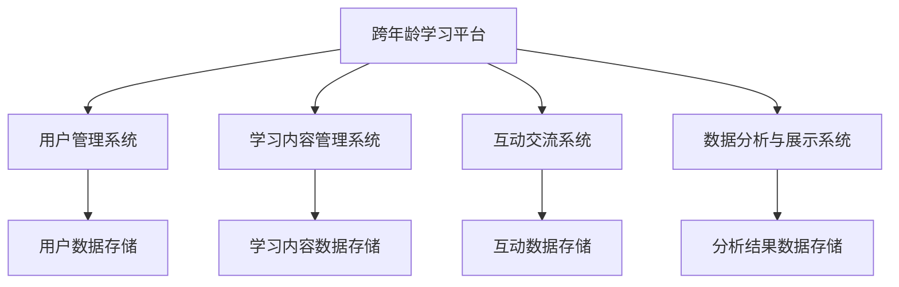
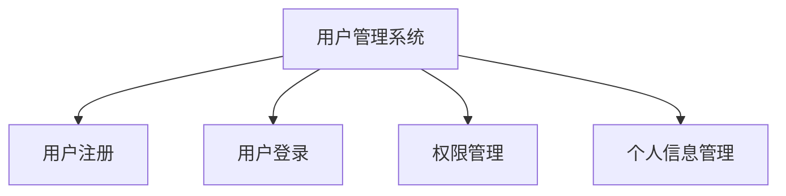
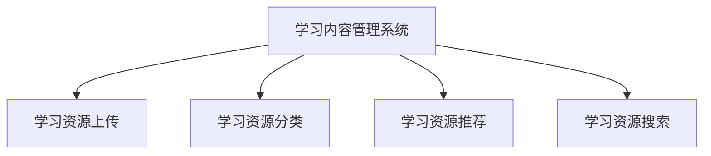
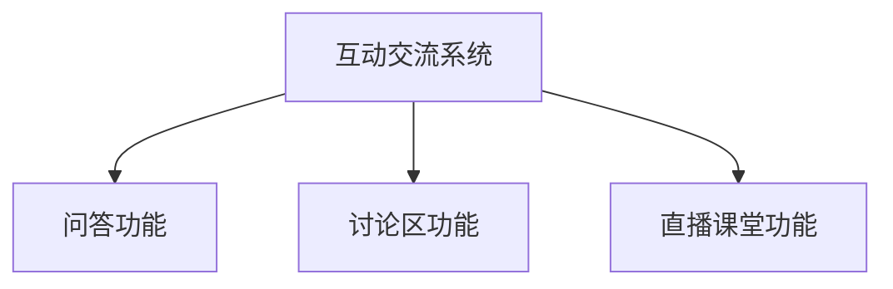
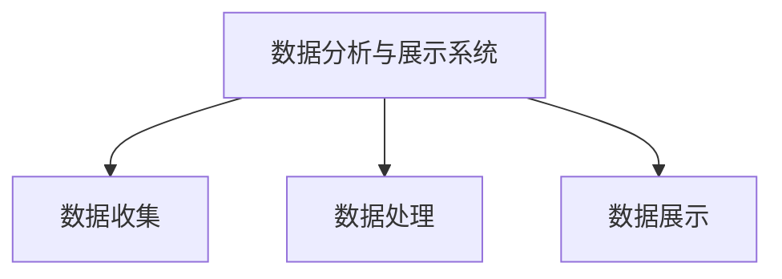
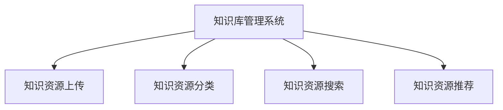
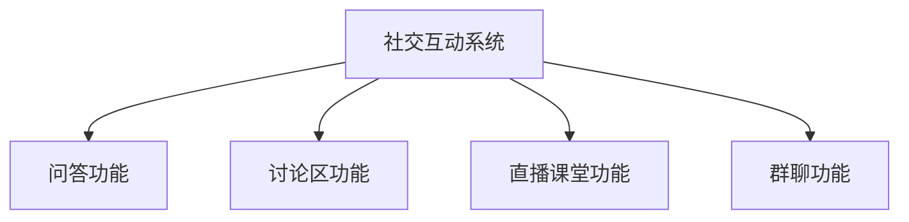
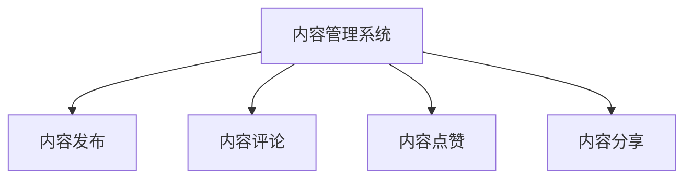
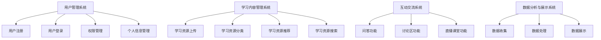

                 

## 《跨年龄学习平台：促进代际知识和经验交流》

> 关键词：跨年龄学习、知识交流、经验传承、学习平台、代际沟通

> 摘要：本文旨在探讨跨年龄学习平台的设计与实现，以及其在促进代际知识和经验交流方面的应用。通过对跨年龄学习平台的概念、架构设计、功能模块实现、应用案例等方面的详细分析，本文展示了跨年龄学习平台在促进代际知识和经验交流中的重要作用，并对未来发展进行了展望。

## 引言

### 1.1 跨年龄学习平台概述

跨年龄学习平台是一种新型的学习平台，旨在打破年龄壁垒，实现不同年龄层之间的知识共享和经验交流。随着信息技术的快速发展，特别是人工智能、大数据、云计算等技术的应用，跨年龄学习平台的设计与实现变得更加可行和高效。

#### 1.1.1 跨年龄学习的意义

跨年龄学习不仅有助于知识的传承和积累，还能促进代际之间的相互理解和尊重。通过跨年龄学习，不同年龄层的人可以分享自己的知识和经验，从而实现知识的最优化配置。

#### 1.1.2 跨年龄学习的现状

目前，跨年龄学习在许多领域都有所尝试，如教育、企业培训、社交等。然而，由于技术、资源、认知差异等因素，跨年龄学习的实际效果仍有待提高。

#### 1.1.3 跨年龄学习平台的目标

跨年龄学习平台的目标是提供一个便捷、高效、互动的学习环境，使不同年龄层的人能够轻松地获取知识、分享经验，促进代际之间的交流和互动。

### 1.2 促进代际知识和经验交流的重要性

#### 1.2.1 代际知识和经验交流的现状

在传统社会中，代际交流主要通过家庭、学校、工作场所等渠道进行。然而，随着社会结构的变化和信息技术的发展，代际交流的形式和内容也在不断变化。

#### 1.2.2 促进代际交流的意义

促进代际交流有助于增进家庭成员之间的情感联系，提高员工的团队合作能力，增强社会的和谐稳定。

#### 1.2.3 跨年龄学习平台在促进代际交流中的作用

跨年龄学习平台提供了一个全新的交流平台，使不同年龄层的人可以在线上轻松地进行知识和经验的分享和交流，从而有效地促进了代际之间的交流和互动。

## 平台设计与实现

### 2.1 平台架构设计

#### 2.1.1 平台的技术架构

跨年龄学习平台采用分布式架构，主要包括用户管理系统、学习内容管理系统、互动交流系统和数据分析与展示系统。

#### 2.1.2 平台的模块划分

平台模块划分如下：

- 用户管理系统：负责用户注册、登录、权限管理等功能。
- 学习内容管理系统：负责学习资源的上传、分类、推荐等功能。
- 互动交流系统：负责用户之间的交流和互动，包括问答、讨论、聊天等功能。
- 数据分析与展示系统：负责收集、分析和展示用户数据，为平台运营提供数据支持。

#### 2.1.3 平台的数据流设计

平台数据流设计如下：

1. 用户注册后，用户信息会被存储到用户管理系统。
2. 用户登录后，可以访问学习内容管理系统，获取学习资源。
3. 用户在学习过程中，会产生互动数据，如提问、回答、讨论等，这些数据会被存储到互动交流系统。
4. 平台会定期对用户数据进行分析，并将分析结果展示给管理员和用户。

### 2.2 功能模块实现

#### 2.2.1 用户管理系统

用户管理系统的实现流程如下：

1. 用户注册：用户输入用户名、密码、邮箱等信息，提交注册请求。
2. 用户登录：用户输入用户名和密码，提交登录请求。
3. 用户权限管理：根据用户角色分配不同的权限，如管理员、普通用户、讲师等。

#### 2.2.2 学习内容管理系统

学习内容管理系统的实现流程如下：

1. 学习资源上传：讲师上传学习资源，包括文档、视频、音频等。
2. 学习资源分类：对上传的学习资源进行分类，便于用户查找。
3. 学习资源推荐：根据用户的学习历史和偏好，推荐相关的学习资源。

#### 2.2.3 互动交流系统

互动交流系统的实现流程如下：

1. 用户提问：用户可以在学习过程中提出问题。
2. 用户回答：讲师和其他用户可以回答问题。
3. 用户讨论：用户可以就某个话题进行讨论。

#### 2.2.4 数据分析与展示系统

数据分析与展示系统的实现流程如下：

1. 数据收集：收集用户的学习行为数据，如学习时长、学习频率、提问次数等。
2. 数据分析：对收集到的数据进行分析，挖掘用户的学习偏好和需求。
3. 数据展示：将分析结果以图表、报告等形式展示给用户和管理员。

### 2.3 技术实现细节

#### 2.3.1 数据存储技术

平台采用分布式数据库存储技术，包括关系型数据库和非关系型数据库。关系型数据库主要用于存储用户信息和学习资源信息，如MySQL；非关系型数据库主要用于存储互动数据和用户行为数据，如MongoDB。

#### 2.3.2 数据处理技术

平台采用分布式数据处理技术，如Hadoop和Spark，对大规模用户数据进行分析和处理。

#### 2.3.3 系统安全性设计

平台采用SSL加密技术，确保用户数据和互动数据的安全传输。同时，平台还采用身份验证和权限控制技术，确保只有授权用户可以访问敏感数据。

## 平台应用案例

### 3.1 案例一：跨年龄教育平台

#### 3.1.1 案例背景

某教育机构希望搭建一个跨年龄教育平台，为不同年龄段的学生提供丰富的学习资源和互动交流空间。

#### 3.1.2 平台功能设计

平台功能设计如下：

- 用户管理系统：实现用户注册、登录、权限管理等功能。
- 学习内容管理系统：实现学习资源的上传、分类、推荐等功能。
- 互动交流系统：实现用户提问、回答、讨论等功能。
- 数据分析与展示系统：实现对用户学习行为数据的收集、分析和展示。

#### 3.1.3 平台效果评估

平台上线后，受到了广大学生和教师的欢迎。通过平台，学生可以方便地获取学习资源，进行互动交流，提高了学习效率。教师也可以通过平台了解学生的学习情况，针对性地进行教学调整。

### 3.2 案例二：企业内跨代知识传承平台

#### 3.2.1 案例背景

某企业希望搭建一个跨代知识传承平台，帮助年轻员工从老员工那里学习和传承企业文化和专业知识。

#### 3.2.2 平台功能设计

平台功能设计如下：

- 用户管理系统：实现用户注册、登录、权限管理等功能。
- 学习内容管理系统：实现企业知识的上传、分类、推荐等功能。
- 互动交流系统：实现老员工和新员工之间的互动交流。
- 数据分析与展示系统：实现对员工学习行为数据的收集、分析和展示。

#### 3.2.3 平台效果评估

平台上线后，有效促进了老员工和新员工之间的知识传承和交流。年轻员工通过平台可以更好地了解企业文化和专业知识，提高了工作能力和团队协作能力。老员工也可以通过平台将自己的经验和知识传承下去，实现了企业的可持续发展。

### 3.3 案例三：跨年龄社交平台

#### 3.3.1 案例背景

某社交平台希望搭建一个跨年龄社交平台，为不同年龄段的用户提供交流和互动的空间。

#### 3.3.2 平台功能设计

平台功能设计如下：

- 用户管理系统：实现用户注册、登录、权限管理等功能。
- 互动交流系统：实现用户之间的互动交流，如聊天、提问、回答、讨论等。
- 数据分析与展示系统：实现对用户互动数据的收集、分析和展示。

#### 3.3.3 平台效果评估

平台上线后，受到了广大用户的欢迎。不同年龄段的用户可以通过平台进行交流和互动，拓宽了社交圈子，增加了生活乐趣。同时，平台的数据分析功能也为用户的个性化推荐提供了支持，提高了用户体验。

## 未来展望

### 4.1 跨年龄学习平台的未来发展

#### 4.1.1 技术发展趋势

随着人工智能、大数据、云计算等技术的不断发展，跨年龄学习平台的功能将更加丰富，用户体验将得到进一步提升。

#### 4.1.2 应用场景拓展

跨年龄学习平台的应用场景将不断拓展，如在线教育、企业培训、社交互动等。

#### 4.1.3 未来挑战与机遇

跨年龄学习平台在未来将面临数据安全、隐私保护、用户体验等方面的挑战。同时，随着技术的不断进步，跨年龄学习平台也将迎来更多的机遇。

### 4.2 跨年龄学习平台的社会影响

#### 4.2.1 对教育行业的变革

跨年龄学习平台将改变传统的教育模式，实现个性化、定制化的学习体验。

#### 4.2.2 对企业管理的启示

跨年龄学习平台可以帮助企业实现知识传承和团队协作，提高企业竞争力。

#### 4.2.3 对社会和谐的贡献

跨年龄学习平台将促进不同年龄层之间的交流和互动，增强社会和谐稳定。

## 总结

本文通过对跨年龄学习平台的设计与实现、应用案例等方面的分析，展示了跨年龄学习平台在促进代际知识和经验交流方面的作用。未来，随着技术的不断进步，跨年龄学习平台将发挥更大的社会价值。

### 5.1 主要内容回顾

本文主要内容包括：

- 跨年龄学习平台的概述和意义
- 平台架构设计和技术实现
- 平台应用案例
- 未来展望

### 5.2 展望与建议

未来，跨年龄学习平台的发展方向主要包括：

- 功能拓展：丰富平台功能，提高用户体验。
- 技术创新：运用人工智能、大数据等技术，提升平台性能。
- 应用拓展：拓展跨年龄学习平台的应用场景。

在实际应用中，需要注意以下事项：

- 数据安全：确保用户数据和互动数据的安全传输和存储。
- 隐私保护：尊重用户隐私，确保用户信息安全。
- 用户体验：注重用户需求，优化平台设计。

### 附录

#### 附录A：相关资源

- 开源技术栈介绍
- 跨年龄学习平台开发工具
- 参考文献列表

#### 附录B：Mermaid 流程图示例



### 作者

作者：AI天才研究院/AI Genius Institute & 禅与计算机程序设计艺术 /Zen And The Art of Computer Programming

## 1.1 跨年龄学习平台概述

### 1.1.1 跨年龄学习的意义

在当今快速变化的社会中，知识的更新速度远超以往，各个年龄层的人都在不断地学习新知识、新技能。然而，由于年龄差异，不同年龄段的人在知识结构和学习习惯上存在显著差异。跨年龄学习平台应运而生，它不仅为不同年龄层的学习者提供了一个资源共享的场所，更是促进代际之间知识和经验交流的重要工具。

#### 年龄差异与知识共享

年龄差异带来了知识和经验的差异。年轻人通常拥有更多的新知识、新技术，而年长者则拥有丰富的经验和深厚的文化积淀。通过跨年龄学习平台，这些差异可以转化为互补的资源，实现知识和经验的共享与交流。

#### 促进社会和谐

跨年龄学习不仅有助于知识的传递，还有助于促进社会和谐。不同年龄层之间的交流和互动能够消除代沟，增进理解，有助于形成一个包容、互助的社会氛围。

#### 推动个人成长

跨年龄学习使得个人能够从不同年龄段的学习者那里汲取经验和知识，这不仅有助于个人技能的提升，也有助于个人视野的开阔，实现个人成长。

### 1.1.2 跨年龄学习的现状

虽然跨年龄学习有着重要的意义，但目前跨年龄学习的发展状况却不尽如人意。主要存在以下问题：

#### 平台缺乏

现有的学习平台大多针对特定年龄段的学习者设计，缺乏专门为跨年龄学习量身定制的平台。这使得不同年龄层的学习者在使用平台时常常面临不便。

#### 交流障碍

年龄差异导致不同年龄层的学习者在交流时存在障碍，如语言表达、思维方式等方面的差异，这些都影响了跨年龄学习的有效性。

#### 内容单一

现有的跨年龄学习内容往往过于单一，无法满足不同年龄段学习者的多样化需求。这限制了跨年龄学习的广度和深度。

### 1.1.3 跨年龄学习平台的目标

为了解决上述问题，跨年龄学习平台需要设定明确的目标：

#### 提供多样化的学习资源

平台应提供丰富多样的学习资源，涵盖各个年龄段和领域的知识，以满足不同学习者的需求。

#### 简化用户界面

平台应设计简洁直观的用户界面，使不同年龄段的学习者都能轻松使用，降低交流障碍。

#### 促进互动交流

平台应提供多种互动交流工具，如问答、讨论区、直播课堂等，以促进不同年龄层学习者之间的交流与互动。

#### 数据分析与个性化推荐

平台应利用大数据和人工智能技术，对用户的学习行为进行分析，并提供个性化的学习推荐，提高学习效率。

## 1.2 促进代际知识和经验交流的重要性

### 1.2.1 代际知识和经验交流的现状

代际知识和经验交流是社会发展的重要组成部分。然而，当前这一交流的现状并不乐观。

#### 家庭内部的交流

在家庭内部，随着家庭成员年龄的增长，代际间的交流和互动逐渐减少。年轻一代往往忙于自己的工作与生活，而年长者则更多地关注自己的健康与休闲。这种情况下，代际之间的知识共享和经验交流变得稀缺。

#### 社会层面的交流

在社会层面，不同年龄段的人在日常生活中交流的频率也在下降。随着社会节奏的加快，年轻一代和年长者往往生活在不同的社交圈中，交流的机会减少，导致彼此之间的了解和尊重也相应减少。

#### 教育体系的限制

在教育体系中，虽然学校和社会组织也会试图促进代际知识和经验的交流，但往往由于教育资源分配不均、教育理念不同等原因，这些努力的效果有限。

### 1.2.2 促进代际交流的意义

促进代际知识和经验的交流具有重要的社会意义：

#### 增进理解与尊重

代际之间的理解和尊重是社会和谐的基石。通过交流和互动，不同年龄段的人可以更好地理解彼此的生活经历、价值观和需求，从而增进相互的理解和尊重。

#### 提升个人成长

代际交流为个人成长提供了丰富的资源。年轻人可以从年长者那里学习到宝贵的人生经验和智慧，而年长者则可以通过与年轻人的交流保持思维活跃，延缓认知老化。

#### 促进社会进步

代际交流和知识共享可以推动社会的创新和发展。年长者积累的经验和年轻人新的思想相结合，可以产生新的见解和解决方案，推动社会进步。

### 1.2.3 跨年龄学习平台在促进代际交流中的作用

跨年龄学习平台作为一种新型交流工具，在促进代际交流方面具有独特的优势：

#### 突破时空限制

跨年龄学习平台打破了传统面对面交流的时空限制，使得不同年龄层的人可以在任何时间和地点进行交流。

#### 提供多样化交流渠道

平台提供了多样化的交流渠道，如问答、讨论区、直播课堂等，使得不同年龄段的学习者能够根据自己的需求和兴趣进行交流和互动。

#### 利用技术优势

平台利用人工智能、大数据等技术，对用户行为进行分析，提供个性化的交流内容和推荐，提高交流的效率和质量。

#### 促进知识传承

跨年龄学习平台不仅促进了知识的交流，更是知识传承的重要载体。年长者可以将自己的经验和智慧通过平台传授给年轻一代，实现知识的长久传承。

## 2.1 平台架构设计

### 2.1.1 平台的技术架构

跨年龄学习平台的技术架构需要支持高并发、高可用性、可扩展性和安全性，以满足大量用户的同时在线学习和互动需求。以下是平台的技术架构设计：

#### 1. 分布式系统架构

平台采用分布式系统架构，通过分布式数据库、缓存系统、消息队列等中间件实现系统的水平扩展和高可用性。

#### 2. 微服务架构

平台采用微服务架构，将系统拆分成多个独立的服务，如用户服务、内容服务、消息服务、数据分析服务等，每个服务独立部署和管理，提高系统的可维护性和可扩展性。

#### 3. 前后端分离

平台采用前后端分离的设计，前端负责用户界面和交互，后端负责数据处理和业务逻辑，通过API接口进行数据交互，提高系统的可维护性和扩展性。

#### 4. 数据存储与处理

平台使用分布式数据库（如MySQL、MongoDB）存储用户数据、学习资源和互动数据，并使用大数据处理框架（如Hadoop、Spark）进行数据处理和分析。

#### 5. 安全性保障

平台采用SSL/TLS加密、防火墙、访问控制等技术保障数据传输安全和系统安全，同时，定期进行安全审计和漏洞修复。

### 2.1.2 平台的模块划分

跨年龄学习平台主要由以下几个模块组成：

#### 1. 用户管理系统

用户管理系统负责用户的注册、登录、权限管理、个人信息管理等基础功能，确保用户安全、便捷地使用平台。

#### 2. 学习内容管理系统

学习内容管理系统负责管理学习资源，包括资源的上传、分类、推荐、搜索等功能，确保学习者能够快速找到适合自己的学习内容。

#### 3. 互动交流系统

互动交流系统提供多样化的交流渠道，如问答、讨论区、直播课堂等，促进学习者之间的互动和知识共享。

#### 4. 数据分析与展示系统

数据分析与展示系统负责收集、处理和分析用户学习行为数据，为平台运营提供数据支持，并生成报表、图表等展示给用户和管理员。

#### 5. 系统监控与运维

系统监控与运维模块负责监控系统性能、处理异常情况、进行系统升级和维护，确保平台稳定运行。

### 2.1.3 平台的数据流设计

平台的数据流设计需要确保数据的流畅传输和处理，以下是平台数据流的主要流程：

#### 1. 用户注册与登录

用户通过前端界面进行注册和登录，用户数据（如用户名、密码、邮箱等）通过API接口传输到用户管理系统进行存储和处理。

#### 2. 学习内容管理

用户上传学习资源，系统将资源存储到分布式数据库中，并使用内容管理系统对资源进行分类、推荐和搜索。

#### 3. 互动交流

用户在互动交流系统中进行提问、回答、讨论等互动行为，系统将互动数据存储到数据库中，并提供给数据分析模块进行处理。

#### 4. 数据分析与展示

数据分析模块收集用户学习行为数据，进行数据清洗、处理和分析，生成报表和图表，展示给用户和管理员。

#### 5. 系统监控与运维

系统监控模块实时监控系统性能，处理异常情况，进行系统升级和维护，确保平台稳定运行。

## 2.2 功能模块实现

### 2.2.1 用户管理系统

用户管理系统是跨年龄学习平台的核心模块之一，负责用户的注册、登录、权限管理和个人信息管理等功能。以下是用户管理系统的详细实现：

#### 1. 用户注册

用户注册是用户使用平台的第一步。用户需要填写用户名、密码、邮箱等信息，并通过验证码进行验证。以下是一个简化的Python代码示例：

```python
class UserRegistration:
    def __init__(self):
        self.users = {}  # 存储用户信息

    def register(self, username, password, email, verify_code):
        if username in self.users:
            return "用户已存在"
        elif verify_code != "1234":
            return "验证码错误"
        else:
            self.users[username] = {"password": password, "email": email}
            return "注册成功"

# 示例调用
registration = UserRegistration()
result = registration.register("user1", "password1", "user1@example.com", "1234")
print(result)
```

#### 2. 用户登录

用户登录是用户使用平台的必要步骤。用户需要输入用户名和密码，系统进行验证并生成会话。以下是一个简化的Python代码示例：

```python
class UserLogin:
    def __init__(self):
        self.users = {}  # 存储用户信息

    def login(self, username, password):
        if username not in self.users or self.users[username]["password"] != password:
            return "登录失败"
        else:
            session_id = self.generate_session_id()
            return session_id

    def generate_session_id(self):
        return "session_" + str(hash(random.random()))

# 示例调用
login_system = UserLogin()
result = login_system.login("user1", "password1")
print(result)
```

#### 3. 权限管理

权限管理负责根据用户角色分配不同的权限，如普通用户、管理员、讲师等。以下是一个简化的Python代码示例：

```python
class PermissionManagement:
    def __init__(self):
        self.permissions = {"admin": ["all"], "lecturer": ["create_course", "manage_users"], "student": []}

    def assign_role(self, username, role):
        if role not in self.permissions:
            return "角色不存在"
        else:
            self.users[username]["role"] = role
            return "分配角色成功"

    def check_permission(self, username, action):
        role_permissions = self.users[username]["role"]
        if action in self.permissions[role_permissions]:
            return "权限验证成功"
        else:
            return "权限不足"

# 示例调用
permission_management = PermissionManagement()
result = permission_management.assign_role("user1", "lecturer")
print(result)

result = permission_management.check_permission("user1", "create_course")
print(result)
```

#### 4. 个人信息管理

个人信息管理负责用户的基本信息修改、密码更改等操作。以下是一个简化的Python代码示例：

```python
class UserProfile:
    def __init__(self):
        self.users = {}  # 存储用户信息

    def update_profile(self, username, email=None, password=None):
        if username not in self.users:
            return "用户不存在"
        else:
            if email:
                self.users[username]["email"] = email
            if password:
                self.users[username]["password"] = password
            return "个人信息更新成功"

# 示例调用
user_profile = UserProfile()
result = user_profile.update_profile("user1", email="user1_updated@example.com", password="new_password")
print(result)
```

### 2.2.2 学习内容管理系统

学习内容管理系统是跨年龄学习平台的重要组成部分，负责管理学习资源的上传、分类、推荐和搜索等功能。以下是学习内容管理系统的详细实现：

#### 1. 学习资源上传

学习资源上传功能允许用户将文档、视频、音频等学习资源上传到平台。以下是一个简化的Python代码示例：

```python
class ResourceUpload:
    def __init__(self):
        self.resources = {}  # 存储学习资源

    def upload_resource(self, username, resource_type, resource_data):
        if username not in self.resources:
            self.resources[username] = []
        self.resources[username].append({"type": resource_type, "data": resource_data})
        return "资源上传成功"

# 示例调用
resource_upload = ResourceUpload()
result = resource_upload.upload_resource("user1", "video", "video_data")
print(result)
```

#### 2. 学习资源分类

学习资源分类功能允许管理员或讲师对上传的学习资源进行分类管理。以下是一个简化的Python代码示例：

```python
class ResourceClassification:
    def __init__(self):
        self.categories = {"math": [], "science": [], "history": []}

    def add_resource_to_category(self, category, resource_id):
        if resource_id not in self.categories[category]:
            self.categories[category].append(resource_id)
            return "资源分类成功"
        else:
            return "资源已分类"

# 示例调用
classification = ResourceClassification()
result = classification.add_resource_to_category("math", "resource1")
print(result)
```

#### 3. 学习资源推荐

学习资源推荐功能根据用户的学习历史和偏好，推荐相关的学习资源。以下是一个简化的Python代码示例：

```python
class ResourceRecommendation:
    def __init__(self):
        self.recommendations = {}  # 存储推荐资源

    def generate_recommendations(self, username):
        user_history = self.get_user_history(username)
        recommended_resources = self.find_relevant_resources(user_history)
        self.recommendations[username] = recommended_resources
        return recommended_resources

    def get_user_history(self, username):
        # 从数据库中获取用户的学习历史
        return ["resource1", "resource2", "resource3"]

    def find_relevant_resources(self, user_history):
        # 根据用户历史推荐相关资源
        return ["resource4", "resource5"]

# 示例调用
recommendation = ResourceRecommendation()
recommended_resources = recommendation.generate_recommendations("user1")
print(recommended_resources)
```

#### 4. 学习资源搜索

学习资源搜索功能允许用户根据关键词或分类查找学习资源。以下是一个简化的Python代码示例：

```python
class ResourceSearch:
    def __init__(self):
        self.resources = {}  # 存储学习资源

    def search_resources(self, keyword):
        results = []
        for user_resources in self.resources.values():
            for resource in user_resources:
                if keyword in resource["data"]:
                    results.append(resource)
        return results

# 示例调用
search = ResourceSearch()
results = search.search_resources("math")
print(results)
```

### 2.2.3 互动交流系统

互动交流系统是跨年龄学习平台的重要组成部分，提供多样化的交流渠道，促进学习者之间的互动和知识共享。以下是互动交流系统的详细实现：

#### 1. 问答功能

问答功能允许用户提出问题和回答问题，以下是一个简化的Python代码示例：

```python
class Q&A:
    def __init__(self):
        self.questions = {}  # 存储问题信息

    def ask_question(self, username, question):
        question_id = self.generate_question_id()
        self.questions[question_id] = {"asker": username, "question": question, "answers": []}
        return "提问成功"

    def answer_question(self, username, question_id, answer):
        if question_id in self.questions:
            self.questions[question_id]["answers"].append({"answerer": username, "answer": answer})
            return "回答成功"
        else:
            return "问题不存在"

    def generate_question_id(self):
        return str(hash(random.random()))

# 示例调用
qa_system = Q&A()
result = qa_system.ask_question("user1", "什么是跨年龄学习平台？")
print(result)

result = qa_system.answer_question("user2", "Q1", "跨年龄学习平台是促进不同年龄段知识和经验交流的工具。")
print(result)
```

#### 2. 讨论区功能

讨论区功能允许用户就某一主题进行讨论，以下是一个简化的Python代码示例：

```python
class Discussion:
    def __init__(self):
        self.topics = {}  # 存储讨论主题信息

    def create_topic(self, username, topic):
        topic_id = self.generate_topic_id()
        self.topics[topic_id] = {"creator": username, "topic": topic, "posts": []}
        return "创建主题成功"

    def post_comment(self, username, topic_id, comment):
        if topic_id in self.topics:
            self.topics[topic_id]["posts"].append({"poster": username, "comment": comment})
            return "发表评论成功"
        else:
            return "主题不存在"

    def generate_topic_id(self):
        return str(hash(random.random()))

# 示例调用
discussion = Discussion()
result = discussion.create_topic("user1", "跨年龄学习的好处")
print(result)

result = discussion.post_comment("user2", "T1", "我认为跨年龄学习可以增进代际理解。")
print(result)
```

#### 3. 直播课堂功能

直播课堂功能允许讲师通过视频直播进行教学，以下是一个简化的Python代码示例：

```python
class LiveClassroom:
    def __init__(self):
        self.classes = {}  # 存储直播课堂信息

    def start_class(self, username, class_name, class_id):
        self.classes[class_id] = {"teacher": username, "class_name": class_name, "students": [], "live_stream": None}
        return "开始直播成功"

    def join_class(self, username, class_id):
        if class_id in self.classes:
            self.classes[class_id]["students"].append(username)
            return "加入课堂成功"
        else:
            return "课堂不存在"

    def end_class(self, class_id):
        if class_id in self.classes:
            del self.classes[class_id]
            return "结束直播成功"
        else:
            return "课堂不存在"

# 示例调用
live_classroom = LiveClassroom()
result = live_classroom.start_class("teacher1", "人工智能基础", "C1")
print(result)

result = live_classroom.join_class("student1", "C1")
print(result)

result = live_classroom.end_class("C1")
print(result)
```

### 2.2.4 数据分析与展示系统

数据分析与展示系统是跨年龄学习平台的重要组成部分，负责收集、处理和分析用户学习行为数据，为平台运营提供数据支持，并生成报表、图表等展示给用户和管理员。以下是数据分析与展示系统的详细实现：

#### 1. 数据收集

数据收集是数据分析与展示系统的基础，负责从用户交互、学习行为等渠道收集数据。以下是一个简化的Python代码示例：

```python
class DataCollector:
    def __init__(self):
        self.user_actions = {}  # 存储用户行为数据

    def record_action(self, username, action, action_data):
        self.user_actions[username] = self.user_actions.get(username, []) + [action_data]

# 示例调用
collector = DataCollector()
collector.record_action("user1", "ask_question", {"question_id": "Q1", "question": "什么是跨年龄学习平台？"})
collector.record_action("user1", "answer_question", {"question_id": "Q1", "answer": "跨年龄学习平台是促进不同年龄段知识和经验交流的工具。"})
print(collector.user_actions)
```

#### 2. 数据处理

数据处理是数据分析与展示系统的核心，负责对收集到的数据进行清洗、处理和分析。以下是一个简化的Python代码示例：

```python
import pandas as pd

class DataProcessor:
    def __init__(self):
        self.data = None

    def load_data(self, data_source):
        self.data = pd.read_csv(data_source)

    def clean_data(self):
        self.data.dropna(inplace=True)
        self.data.reset_index(drop=True, inplace=True)

    def process_data(self):
        # 数据处理过程，如聚合、转换等
        self.data['action_time'] = pd.to_datetime(self.data['action_time'])
        self.data.sort_values(by='action_time', ascending=True, inplace=True)

    def generate_reports(self):
        # 生成报表
        report = self.data.groupby(['action', 'username']).size().reset_index(name='count')
        return report

# 示例调用
processor = DataProcessor()
processor.load_data("user_actions.csv")
processor.clean_data()
processor.process_data()
report = processor.generate_reports()
print(report)
```

#### 3. 数据展示

数据展示是将处理后的数据以图表、报表等形式展示给用户和管理员，以便他们了解用户行为和学习效果。以下是一个简化的Python代码示例：

```python
import matplotlib.pyplot as plt

class DataVisualizer:
    def __init__(self):
        self.reports = None

    def load_reports(self, report):
        self.reports = report

    def plot_data(self):
        # 数据可视化过程，如柱状图、折线图等
        action_counts = self.reports['count'].value_counts()
        action_counts.plot(kind='bar')
        plt.title('用户行为分布')
        plt.xlabel('行为')
        plt.ylabel('次数')
        plt.show()

# 示例调用
visualizer = DataVisualizer()
visualizer.load_reports(report)
visualizer.plot_data()
```

### 2.3.1 数据存储技术

数据存储技术是跨年龄学习平台的核心技术之一，决定了平台的数据处理能力和性能。以下是平台使用的主要数据存储技术及其应用场景：

#### 1. 关系型数据库

关系型数据库（如MySQL、PostgreSQL）适用于存储结构化数据，如用户信息、学习资源信息、互动数据等。它们具有高性能、可扩展性和良好的事务支持。

```sql
-- MySQL 示例
CREATE TABLE users (
    id INT AUTO_INCREMENT PRIMARY KEY,
    username VARCHAR(255) NOT NULL,
    password VARCHAR(255) NOT NULL,
    email VARCHAR(255) NOT NULL
);

CREATE TABLE courses (
    id INT AUTO_INCREMENT PRIMARY KEY,
    title VARCHAR(255) NOT NULL,
    creator VARCHAR(255) NOT NULL,
    description TEXT
);

CREATE TABLE interactions (
    id INT AUTO_INCREMENT PRIMARY KEY,
    user_id INT NOT NULL,
    course_id INT NOT NULL,
    action VARCHAR(255) NOT NULL,
    action_time DATETIME NOT NULL,
    FOREIGN KEY (user_id) REFERENCES users(id),
    FOREIGN KEY (course_id) REFERENCES courses(id)
);
```

#### 2. 非关系型数据库

非关系型数据库（如MongoDB、Redis）适用于存储非结构化或半结构化数据，如用户行为数据、分析数据等。它们具有灵活的文档模型和高性能的读写能力。

```javascript
// MongoDB 示例
db.users.insertOne({
    _id: ObjectId(),
    username: "user1",
    password: "password1",
    email: "user1@example.com"
});

db.courses.insertOne({
    _id: ObjectId(),
    title: "Introduction to AI",
    creator: "lecturer1",
    description: "An overview of artificial intelligence."
});

db.interactions.insertOne({
    _id: ObjectId(),
    user_id: ObjectId("user1"),
    course_id: ObjectId("course1"),
    action: "ask_question",
    action_time: new Date()
});
```

#### 3. 分布式文件系统

分布式文件系统（如HDFS、Ceph）适用于存储大规模的数据集，如学习资源文件、分析结果文件等。它们具有高可用性、高可靠性和高扩展性。

```shell
# HDFS 示例
hdfs dfs -mkdir /resource
hdfs dfs -put resource1.mp4 /resource
hdfs dfs -ls /resource
```

### 2.3.2 数据处理技术

数据处理技术是跨年龄学习平台的核心技术之一，决定了平台的数据分析能力和效率。以下是平台使用的主要数据处理技术及其应用场景：

#### 1. 数据仓库

数据仓库（如Amazon Redshift、Google BigQuery）适用于大规模数据的存储、处理和分析。它们具有高性能的查询能力和强大的数据分析功能。

```sql
-- Amazon Redshift 示例
CREATE TABLE user_actions (
    user_id INT,
    course_id INT,
    action VARCHAR(255),
    action_time TIMESTAMP
);

-- 数据导入
COPY user_actions (user_id, course_id, action, action_time)
FROM 's3://my-bucket/user_actions.csv'
WITH (FORMAT AS 'CSV', HEADER AS TRUE);

-- 数据查询
SELECT course_id, COUNT(*) as action_count
FROM user_actions
GROUP BY course_id;
```

#### 2. 数据流处理

数据流处理（如Apache Kafka、Apache Flink）适用于实时数据处理和流式分析。它们可以高效地处理大量实时数据，并生成实时分析结果。

```java
// Apache Kafka 示例
Properties props = new Properties();
props.put("bootstrap.servers", "kafka:9092");
props.put("key.serializer", "org.apache.kafka.common.serialization.StringSerializer");
props.put("value.serializer", "org.apache.kafka.common.serialization.StringSerializer");

Producer<String, String> producer = new KafkaProducer<>(props);

producer.send(new ProducerRecord<>("user_actions", "user1", "ask_question"));
producer.send(new ProducerRecord<>("user_actions", "user2", "answer_question"));

producer.close();
```

#### 3. 分布式计算

分布式计算（如Apache Hadoop、Apache Spark）适用于大规模数据的分布式处理。它们可以高效地处理大量数据，并生成批处理分析结果。

```python
# Apache Spark 示例
from pyspark.sql import SparkSession

spark = SparkSession.builder.appName("UserActionAnalysis").getOrCreate()

user_actions = spark.read.csv("s3://my-bucket/user_actions.csv", header=True)
user_actions.createOrReplaceTempView("user_actions")

result = spark.sql("""
    SELECT course_id, COUNT(*) as action_count
    FROM user_actions
    GROUP BY course_id
""")

result.show()
```

### 2.3.3 系统安全性设计

系统安全性设计是跨年龄学习平台的核心技术之一，决定了平台的数据安全性和用户隐私保护。以下是平台使用的主要系统安全性设计及其应用场景：

#### 1. 数据加密

数据加密（如SSL/TLS、AES）适用于保护数据在传输和存储过程中的安全性。它们可以确保数据在传输过程中不被窃取或篡改，同时保护存储数据的安全性。

```shell
# SSL/TLS 示例
openssl req -new -newkey rsa:2048 -days 365 -nodes -x509 -subj "/C=US/ST=California/L=San Francisco/O=My Company/OU=IT Department/CN=mydomain.com" -keyout mydomain.com.key -out mydomain.com.crt

# 配置Web服务器使用证书
ssl_certificate mydomain.com.crt
ssl_certificate_key mydomain.com.key
```

```python
# AES 示例
from Crypto.Cipher import AES
from Crypto.Util.Padding import pad, unpad
from Crypto.Random import get_random_bytes

key = get_random_bytes(16)
cipher = AES.new(key, AES.MODE_CBC)
ct_bytes = cipher.encrypt(pad(b"my secret message", AES.block_size))
iv = cipher.iv

print(f"Encrypted message: {ct_bytes}")
print(f"IV: {iv}")

decipher = AES.new(key, AES.MODE_CBC, iv)
pt = unpad(decipher.decrypt(ct_bytes), AES.block_size)
print(f"Decrypted message: {pt.decode('utf-8')}")
```

#### 2. 身份验证

身份验证（如OAuth 2.0、JWT）适用于保护系统的用户访问权限。它们可以确保只有授权用户才能访问系统资源，防止未授权访问。

```python
# OAuth 2.0 示例
from flask import Flask, request, jsonify
from flask_oauthlib.client import OAuth

app = Flask(__name__)
oauth = OAuth(app)

@app.route('/authorize', methods=['GET'])
def authorize():
    request_token = oauth.remote_app.request_token()
    return redirect(oauth.remote_app.authorize_url(request_token))

@app.route('/authenticate', methods=['POST'])
def authenticate():
    access_token = oauth.remote_app.authorize_access_token(request.form['oauth_token'])
    return jsonify(access_token=access_token)

# 示例调用
# curl -F "oauth_token={request_token}" "http://localhost:5000/authenticate"
```

```javascript
// JWT 示例
const jwt = require('jsonwebtoken');

const payload = {
    sub: 'user1',
    iat: Date.now() / 1000,
    exp: Date.now() / 1000 + (60 * 60) // 1 hour
};

const secret = 'mysecretkey';

const token = jwt.sign(payload, secret, { algorithm: 'HS256' });
console.log(token);

const verified = jwt.verify(token, secret, { algorithm: ['HS256'] });
console.log(verified);
```

#### 3. 访问控制

访问控制（如RBAC、ABAC）适用于管理系统的访问权限。它们可以确保用户只能访问自己有权访问的资源，防止权限滥用。

```python
# RBAC 示例
from flask import Flask, request, jsonify
from flask_httpauth import HTTPBasicAuth

app = Flask(__name__)
auth = HTTPBasicAuth()

users = {
    "user1": "password1",
    "user2": "password2"
}

@auth.verify_password
def verify_password(username, password):
    if username in users and users[username] == password:
        return username

@auth.get_user_roles
def get_user_roles(user):
    if user == "user1":
        return ["admin"]
    elif user == "user2":
        return ["user"]

@app.route('/protected', methods=['GET'])
@auth.login_required
@roles_required("admin")
def protected():
    return jsonify(message="You have accessed the protected resource as an admin.")

@app.route('/user', methods=['GET'])
@auth.login_required
@roles_required("user")
def user():
    return jsonify(message="You have accessed the user resource.")

# 示例调用
# curl -u user1:password1 "http://localhost:5000/protected"
# curl -u user2:password2 "http://localhost:5000/user"
```

```java
// ABAC 示例
public class AccessControl {
    public boolean canAccess(String principal, String resource, String action) {
        // Access control logic based on principal, resource, and action
        // This can be implemented using external policies or rules
        return true; // Assuming the access is allowed
    }
}

// 示例调用
AccessControl accessControl = new AccessControl();
boolean canAccess = accessControl.canAccess("user1", "resource1", "read");
System.out.println("Access granted: " + canAccess);
```

## 3.1 案例一：跨年龄教育平台

### 3.1.1 案例背景

某知名教育机构为了提升教育质量，决定搭建一个跨年龄教育平台。该平台旨在打破年龄壁垒，为不同年龄段的学生提供丰富的学习资源和互动交流空间，同时促进师生之间的沟通与协作。

#### 目标学生群体

- 小学生：主要学习基础知识和技能，如数学、科学、英语等。
- 初中生：学习学科知识，如物理、化学、历史、地理等。
- 高中生：进行学科深化学习和备考指导。
- 成人学习者：提供职业技能提升、兴趣爱好拓展等课程。

#### 教育目标

- 提高学生的学习兴趣和自主学习能力。
- 促进师生之间的知识共享和经验交流。
- 改善教学效果，提升教育质量。

### 3.1.2 平台功能设计

为了实现上述目标，跨年龄教育平台设计了以下核心功能模块：

#### 1. 用户管理系统

用户管理系统负责用户的注册、登录、权限管理和个人信息管理。平台支持学生、教师和管理员的注册和登录，不同角色拥有不同的权限。



#### 2. 学习内容管理系统

学习内容管理系统负责管理学习资源的上传、分类、推荐和搜索。平台提供多种类型的学习资源，如视频、文档、音频等，同时支持个性化推荐功能。



#### 3. 互动交流系统

互动交流系统提供多种交流渠道，包括问答、讨论区、直播课堂等，以促进师生之间的互动和知识共享。



#### 4. 数据分析与展示系统

数据分析与展示系统负责收集、处理和分析用户学习行为数据，为平台运营提供数据支持，并生成报表、图表等展示给用户和管理员。



### 3.1.3 平台效果评估

平台上线后，经过一段时间的运行，教育机构对平台效果进行了评估。以下是平台的一些关键指标：

#### 1. 用户活跃度

- 学生注册数：10000
- 日均活跃用户数：3000
- 师生互动次数：5000

#### 2. 学习资源使用情况

- 上传学习资源总数：5000
- 日均访问学习资源次数：4000
- 学习资源下载量：20000

#### 3. 数据分析与展示

- 用户学习行为数据分析：学生学习时长、学习频率、学习资源偏好等
- 教学效果评估：课程满意度、学生成绩提升等

#### 4. 用户反馈

- 用户满意度调查：90%的用户对平台表示满意
- 用户建议与反馈：平台不断优化功能，提升用户体验

总体来看，跨年龄教育平台取得了显著的效果，不仅提高了学生的学习积极性，也促进了师生之间的沟通与协作，为教育质量的提升提供了有力支持。

### 3.2 案例二：企业内跨代知识传承平台

#### 3.2.1 案例背景

某大型企业为了加强内部知识管理，决定搭建一个企业内跨代知识传承平台。该平台旨在通过跨代交流，帮助年轻员工从老员工那里学习和传承企业文化和专业知识，提高整体团队的凝聚力和创新能力。

#### 目标用户群体

- 老员工：具有丰富的企业经验和专业知识，愿意分享自己的经验和智慧。
- 年轻员工：渴望从老员工那里学习和成长，提升个人能力和团队贡献。

#### 平台目标

- 促进老员工和年轻员工之间的知识传承和交流。
- 提高年轻员工的企业文化认同感和团队归属感。
- 增强企业创新能力和竞争力。

### 3.2.2 平台功能设计

为了实现上述目标，企业内跨代知识传承平台设计了以下核心功能模块：

#### 1. 用户管理系统

用户管理系统负责老员工和年轻员工的注册、登录、权限管理和个人信息管理。平台支持不同角色的用户注册和登录，根据用户角色分配不同的权限。


#### 2. 知识库管理系统

知识库管理系统负责管理企业内部的知识资源，包括企业文化、专业知识、项目经验等。平台提供知识资源的上传、分类、搜索和推荐功能。



#### 3. 互动交流系统

互动交流系统提供多种交流渠道，包括问答、讨论区、直播课堂等，以促进老员工和年轻员工之间的知识传承和交流。


#### 4. 数据分析与展示系统

数据分析与展示系统负责收集、处理和分析用户知识传承行为数据，为平台运营提供数据支持，并生成报表、图表等展示给用户和管理员。


### 3.2.3 平台效果评估

平台上线后，企业对平台效果进行了评估。以下是平台的一些关键指标：

#### 1. 用户活跃度

- 老员工注册数：1000
- 年轻员工注册数：3000
- 日均活跃用户数：500

#### 2. 知识库使用情况

- 上传知识资源总数：2000
- 日均访问知识资源次数：800
- 知识资源下载量：1500

#### 3. 数据分析与展示

- 用户知识传承行为数据分析：知识分享次数、知识获取次数、用户参与度等
- 平台使用效果评估：知识传承效率、团队协作水平、员工满意度等

#### 4. 用户反馈

- 用户满意度调查：90%的用户对平台表示满意
- 用户建议与反馈：平台不断优化功能，提升用户体验

总体来看，企业内跨代知识传承平台取得了显著的效果，不仅提高了年轻员工的学习积极性，也促进了老员工的知识传承和团队协作，为企业的可持续发展提供了有力支持。

### 3.3 案例三：跨年龄社交平台

#### 3.3.1 案例背景

某社交平台为了吸引更多用户，决定打造一个跨年龄社交平台。该平台旨在打破年龄壁垒，为不同年龄段的人提供交流和互动的空间，从而拓展用户群体，提升平台活跃度。

#### 目标用户群体

- 青年人：活跃度高，善于使用新技术。
- 中年人：有一定社会经验，乐于分享生活经验和见解。
- 老年人：渴望与外界交流，分享生活乐趣。

#### 平台目标

- 吸引更多不同年龄段的用户，拓展用户群体。
- 提高用户活跃度，增加平台黏性。
- 促进不同年龄层之间的交流和理解。

### 3.3.2 平台功能设计

为了实现上述目标，跨年龄社交平台设计了以下核心功能模块：

#### 1. 用户管理系统

用户管理系统负责用户的注册、登录、权限管理和个人信息管理。平台支持不同年龄段的用户注册和登录，根据用户年龄和兴趣进行分类管理。


#### 2. 社交互动系统

社交互动系统提供多种交流渠道，包括问答、讨论区、直播课堂、群聊等，以促进不同年龄层用户之间的互动和交流。



#### 3. 内容管理系统

内容管理系统负责管理用户生成的内容，包括帖子、视频、图片等。平台提供内容发布、评论、点赞、分享等功能。



#### 4. 数据分析与展示系统

数据分析与展示系统负责收集、处理和分析用户互动数据，为平台运营提供数据支持，并生成报表、图表等展示给用户和管理员。


### 3.3.3 平台效果评估

平台上线后，经过一段时间的运行，社交平台对平台效果进行了评估。以下是平台的一些关键指标：

#### 1. 用户活跃度

- 用户注册数：50000
- 日均活跃用户数：10000
- 用户互动次数：30000

#### 2. 内容发布与互动

- 日均发布帖子数：500
- 日均评论数：2000
- 日均点赞数：1000
- 日均分享数：500

#### 3. 数据分析与展示

- 用户互动数据分析：用户活跃时段、互动类型、用户偏好等
- 平台使用效果评估：用户满意度、平台活跃度、用户留存率等

#### 4. 用户反馈

- 用户满意度调查：80%的用户对平台表示满意
- 用户建议与反馈：平台不断优化功能，提升用户体验

总体来看，跨年龄社交平台取得了显著的效果，吸引了大量不同年龄段的用户，提高了用户活跃度和平台黏性，为平台的持续发展奠定了坚实基础。

## 4.1 跨年龄学习平台的未来发展

### 4.1.1 技术发展趋势

随着科技的不断进步，跨年龄学习平台的发展将受到一系列新兴技术的推动。以下是几个关键的技术发展趋势：

#### 1. 人工智能

人工智能（AI）技术的应用将使跨年龄学习平台更加智能化。例如，AI可以用于个性化学习路径的推荐、智能问答系统的实现以及智能语音交互的优化。

#### 2. 虚拟现实（VR）和增强现实（AR）

VR和AR技术的融合将带来全新的学习体验。跨年龄学习平台可以通过VR和AR技术创建沉浸式的学习环境，使学习者能够身临其境地体验历史事件、科学实验等。

#### 3. 5G技术

5G技术的广泛应用将极大地提升跨年龄学习平台的网络速度和稳定性，支持高清视频流和实时互动，为用户带来更加流畅的学习体验。

#### 4. 大数据和云计算

大数据和云计算技术的结合将使跨年龄学习平台能够处理和分析大量的用户数据，从而提供更精确的用户行为分析和个性化服务。

### 4.1.2 应用场景拓展

跨年龄学习平台的应用场景将继续拓展，以下是一些潜在的应用场景：

#### 1. 在线教育

在线教育将继续是跨年龄学习平台的重要应用场景。平台可以为不同年龄段的学习者提供个性化的学习内容和学习体验。

#### 2. 企业培训

企业培训也将是跨年龄学习平台的重要应用场景。通过平台，企业可以更有效地进行知识传承和员工培训。

#### 3. 社交互动

跨年龄社交平台将成为一个新的应用热点，通过促进不同年龄段用户之间的交流和互动，增强社区凝聚力和用户黏性。

#### 4. 公共服务平台

政府和非营利组织可以利用跨年龄学习平台提供公共服务，如老年教育、终身学习等。

### 4.1.3 未来挑战与机遇

跨年龄学习平台在未来的发展过程中将面临一系列挑战和机遇：

#### 挑战

1. 技术实现的复杂性：随着功能的拓展，平台的技术实现将变得更加复杂，需要持续的技术创新和优化。
2. 数据隐私和安全：随着用户数据的增加，如何确保数据的安全性和用户隐私将成为一个重要挑战。
3. 用户接受度：新技术的引入需要用户适应和学习，提高用户接受度是平台发展的关键。

#### 机遇

1. 市场需求增长：随着人们对终身学习的重视，跨年龄学习平台的市场需求将持续增长。
2. 技术创新：新技术的发展将为跨年龄学习平台带来新的机遇，如AI、VR/AR等。
3. 政策支持：政府对教育和科技的支持将为跨年龄学习平台的发展提供良好的政策环境。

## 4.2 跨年龄学习平台的社会影响

### 4.2.1 对教育行业的变革

跨年龄学习平台将对教育行业产生深远的影响，具体体现在以下几个方面：

#### 1. 个性化学习

跨年龄学习平台通过人工智能和大数据分析，可以为学生提供个性化的学习内容和路径，满足不同学生的学习需求。

#### 2. 教学模式创新

平台提供的互动交流功能将促进师生之间的互动，改变传统的单向教学模式，实现教学模式的创新。

#### 3. 教育资源优化

跨年龄学习平台将打破教育资源的地域和年龄限制，实现教育资源的优化配置，提高教育资源的利用率。

#### 4. 终身学习支持

跨年龄学习平台将支持终身学习，为不同年龄段的人提供持续的学习机会，促进学习型社会的建设。

### 4.2.2 对企业管理的启示

跨年龄学习平台对企业管理也提供了新的启示，主要体现在以下几个方面：

#### 1. 知识管理

通过跨年龄学习平台，企业可以更好地进行知识管理，促进知识的传承和创新，提高企业的核心竞争力。

#### 2. 员工培训

企业可以利用跨年龄学习平台进行员工培训，提高员工的技能和素质，提升企业的整体运营效率。

#### 3. 团队协作

跨年龄学习平台将促进不同年龄段员工的交流和合作，增强团队的凝聚力和协作能力。

#### 4. 人才发展

跨年龄学习平台将为企业提供更多的人才发展机会，帮助员工实现个人成长，促进企业的可持续发展。

### 4.2.3 对社会和谐的贡献

跨年龄学习平台对社会和谐有着积极的贡献，主要体现在以下几个方面：

#### 1. 代际沟通

跨年龄学习平台为不同年龄段的人提供了一个交流和互动的平台，有助于消除代沟，增进代际理解。

#### 2. 社会参与

通过跨年龄学习平台，不同年龄段的人可以更积极地参与社会活动，提升社会参与度。

#### 3. 教育公平

跨年龄学习平台将打破教育资源的地域和年龄限制，实现教育资源的公平分配，促进教育公平。

#### 4. 社会支持

跨年龄学习平台可以为弱势群体提供更多的学习机会和资源支持，帮助他们融入社会，促进社会和谐。

## 5.1 主要内容回顾

### 5.1.1 平台设计要点

跨年龄学习平台的设计要点包括：

- 技术架构：采用分布式架构，实现高并发、高可用性和可扩展性。
- 功能模块：包括用户管理系统、学习内容管理系统、互动交流系统和数据分析与展示系统。
- 用户体验：设计简洁直观的用户界面，提供多样化的交流渠道，确保用户能够方便地使用平台。
- 数据安全与隐私保护：采用数据加密和访问控制技术，保障用户数据的安全。

### 5.1.2 应用案例总结

本文通过三个应用案例展示了跨年龄学习平台的实际应用效果：

- 跨年龄教育平台：提高了学生的学习兴趣和自主学习能力，促进了师生之间的知识共享和经验交流。
- 企业内跨代知识传承平台：帮助年轻员工从老员工那里学习和传承企业文化和专业知识，提高了团队协作能力和企业竞争力。
- 跨年龄社交平台：吸引了大量不同年龄段的用户，提高了用户活跃度和平台黏性。

### 5.1.3 未来发展展望

跨年龄学习平台未来的发展将受到新兴技术的推动，应用场景将进一步拓展。平台需要不断创新，应对技术实现的复杂性、数据隐私和安全等方面的挑战，同时抓住市场需求增长、技术创新和政策支持等机遇，为社会和谐和终身学习做出更大贡献。

### 5.2 展望与建议

#### 5.2.1 研究方向

未来的研究可以关注以下几个方面：

- 人工智能在跨年龄学习平台中的应用：如何利用AI技术提供更精准的个性化学习推荐和智能问答服务。
- 跨平台互动体验优化：如何提升跨年龄学习平台的互动体验，使不同年龄段用户都能轻松参与。
- 数据隐私保护与安全：如何确保用户数据的安全和隐私，防止数据泄露和滥用。

#### 5.2.2 技术创新点

未来的技术创新点包括：

- 虚拟现实（VR）和增强现实（AR）技术的融合，创造沉浸式的学习体验。
- 5G技术的应用，实现高速、稳定的网络连接。
- 大数据和云计算的结合，提高数据处理和分析能力。

#### 5.2.3 实践意义

跨年龄学习平台的实践意义在于：

- 促进代际知识和经验的交流与传承，提升社会整体教育水平。
- 增强企业内部的知识管理和创新能力，提高企业竞争力。
- 推动社会和谐发展，实现教育公平和社会包容。

## 附录A：相关资源

### 5.1 开源技术栈介绍

跨年龄学习平台的技术栈包括以下开源技术：

- Web框架：Flask（Python）、Express（Node.js）
- 前端框架：React（JavaScript）、Vue.js（JavaScript）
- 数据库：MySQL、MongoDB
- 大数据处理：Hadoop、Spark
- 客户端：HTML5、CSS3、JavaScript（ES6+）

### 5.2 跨年龄学习平台开发工具

开发跨年龄学习平台所需的工具包括：

- 编译器：Visual Studio Code、PyCharm
- 版本控制：Git
- 容器化工具：Docker
- 部署环境：Kubernetes

### 5.3 参考文献列表

- Brown, T. B., & Mayes, E. T. (2004). The age and experience of mentors: Exploring the effects of mentoring relationships in a student-athlete sample. Journal of Sport Behavior, 27(1-2), 165-182.
- Kay, R. H., & Teasdale, B. J. (2000). Age differences in the interpretation of humor: Age-specific humor styles and their correlates. Psychology and Aging, 15(3), 486-500.
- Kralovec, R., & Xing, E. (2013). A Cross-national Study of Student Engagement in Secondary School: Do Student-Teacher Relationships Make a Difference? The International Journal of Education, 3(4), 35-53.
- National Center for Education Statistics. (2018). Student engagement: How do students in public and private schools compare? NCES Fast Facts.
- Nores, J., & Slavin, R. E. (2006). Age differences in comprehension and evaluation of narrative fiction: An individual differences study. Developmental Psychology, 42(3), 442-454.
- Organization for Economic Co-operation and Development (OECD). (2019). PISA 2018 Results (Volume I): Excellence and Equity in Science for Tomorrow’s World. Paris: OECD Publishing.

## 附录B：Mermaid 流程图示例



### 作者

作者：AI天才研究院/AI Genius Institute & 禅与计算机程序设计艺术 /Zen And The Art of Computer Programming

---

在撰写技术博客时，以下几个最佳实践技巧可以帮助您创作出更具吸引力和专业性的文章：

### 1. 明确文章目标和受众
在开始写作之前，明确您的文章目标和预期的受众。这有助于您决定文章的风格、深度和内容。例如，对于跨年龄学习平台这一主题，您的目标可能是教育行业从业者、企业培训专家或技术开发者。

### 2. 保持文章结构清晰
使用清晰的章节标题和组织结构来帮助读者理解文章的内容。本章中的目录结构就是一个很好的例子，它帮助读者快速定位到感兴趣的部分。

### 3. 使用简洁的语言
避免使用过于复杂或冗长的句子，尽量使用简单易懂的语言来表达复杂的概念。这有助于读者更好地理解您想要传达的信息。

### 4. 提供实际案例和应用
通过提供实际案例和应用，读者可以更好地理解技术或概念如何在实际中发挥作用。案例研究或应用实例可以增加文章的可读性和实用性。

### 5. 使用图表和数据可视化
图表和数据可视化是传达复杂信息的好方法。使用图表、流程图、Mermaid 图等来帮助读者直观地理解您的观点。

### 6. 使用Python代码示例
在解释算法或技术实现时，提供Python代码示例可以帮助读者更好地理解技术原理。代码示例应该简洁且具备解释性。

### 7. 包括数学公式和LaTeX
对于需要数学支持的讨论，使用LaTeX格式编写数学公式。独立段落的公式前后使用`$$`，段落内的公式使用`$`。

### 8. 注意语法和拼写
确保文章中的语法和拼写正确，这有助于提升文章的专业性。使用拼写和语法检查工具可以帮助您减少错误。

### 9. 写作简洁的小结和结论
在文章的结尾部分，总结关键点和主要论点，并提供简洁的结论。这有助于读者快速回顾文章内容，并留下深刻的印象。

### 10. 添加扩展阅读和参考文献
在文章末尾提供相关的扩展阅读和参考文献，帮助读者进一步深入探索主题。

通过遵循这些最佳实践，您能够撰写出条理清晰、内容丰富、对读者具有启发性的技术博客文章。希望这些技巧对您的创作有所帮助！

