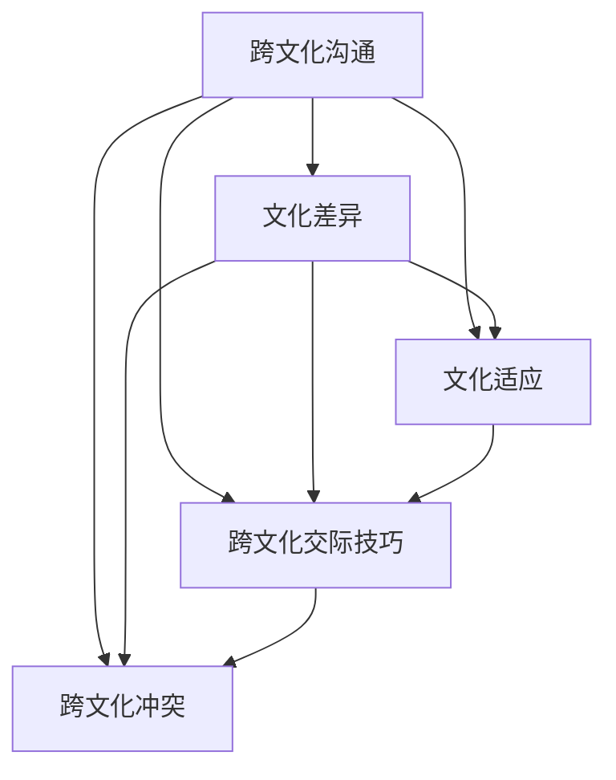

                 

# 跨文化交流的艺术：在全球化时代建立理解

## 关键词
跨文化沟通、文化差异、文化适应、跨文化交际技巧、跨文化冲突管理

## 摘要
在全球化不断深入的今天，跨文化交流已经成为国际交往的重要部分。本文从多个角度探讨了跨文化交流的艺术，包括核心概念的界定、文化差异的识别、跨文化沟通技巧的掌握，以及跨文化冲突的解决策略。通过深入分析和实例讲解，本文旨在为读者提供一套系统的跨文化交流方法论，帮助读者在全球化时代建立更加深入的理解和有效的沟通。

## 引言
随着全球化的加速，各国之间的经济、文化、政治联系日益紧密。跨文化交流不仅在经济合作中扮演着重要角色，也在日常生活的方方面面影响着人们的互动。然而，文化差异的存在使得跨文化交流面临诸多挑战。为了更好地理解和适应不同文化背景的人们，我们需要掌握跨文化交流的艺术。

本文将首先介绍跨文化沟通的基础理论，包括心理学和社会学对跨文化沟通的解读。接着，我们将深入探讨文化差异与适应策略，帮助读者识别和理解不同文化之间的差异。随后，本文将阐述跨文化交际技巧，并提供实用的沟通方法。此外，本文还将讨论跨文化冲突管理，提供解决冲突的策略。最后，我们将通过实际案例，展示如何将跨文化交流的理论应用于实践中。

通过本文的阅读，读者将能够获得以下收获：
- 理解跨文化沟通的核心概念和理论基础。
- 掌握识别和处理文化差异的方法。
- 学会有效的跨文化交际技巧。
- 获得解决跨文化冲突的策略和技巧。

## 确定核心概念与联系

在探讨跨文化交流的艺术之前，我们需要明确一些核心概念，并了解它们之间的相互关系。以下是本文中涉及的主要核心概念：

### 跨文化沟通
跨文化沟通指的是在跨文化背景下进行的交流过程。它不仅包括口头和书面语言，还包括非语言交流，如肢体语言、面部表情和空间使用。

### 文化差异
文化差异是指不同文化群体在价值观、信仰、习俗和行为规范上的不同。文化差异是跨文化交流中最为显著的障碍之一。

### 文化适应
文化适应是指个体或群体在接触新文化后，通过调整自己的行为和思维方式来适应新环境的过程。

### 跨文化交际技巧
跨文化交际技巧是帮助人们在不同文化背景下有效沟通的方法和策略，包括语言技巧、非语言技巧和沟通风格调整。

### 跨文化冲突
跨文化冲突是指由于文化差异引起的误解、摩擦甚至冲突。有效的冲突管理是跨文化交流中不可或缺的一部分。

这些核心概念之间存在紧密的联系。跨文化沟通是跨文化交流的主要形式，而文化差异则是跨文化沟通的主要障碍。文化适应和跨文化交际技巧是克服这些障碍的重要手段，而跨文化冲突则是这些策略实施的挑战之一。

为了更清晰地展示这些概念之间的关系，我们可以使用Mermaid流程图来表示：



在这个流程图中，我们可以看到跨文化沟通是整个流程的核心，而文化差异、文化适应、跨文化交际技巧和跨文化冲突则是跨文化沟通过程中的关键环节。

## 跨文化沟通基础

### 跨文化沟通的心理学基础

跨文化沟通的心理学基础主要涉及社会心理学和知觉心理学理论。这些理论帮助我们理解不同文化背景下的个体如何感知、解释和响应沟通信息。

#### 社会心理学理论

社会心理学理论，如社会认同理论和社会规范理论，对跨文化沟通有着重要影响。社会认同理论指出，个体倾向于与自己的群体保持一致，并在面对外部群体时产生防御性反应。这可能导致跨文化沟通中的偏见和误解。社会规范理论则关注文化规范对个体行为的影响，不同文化群体可能有不同的行为规范，这会影响跨文化沟通的有效性。

#### 知觉心理学理论

知觉心理学理论，如知觉选择性、知觉整体性和知觉恒常性，也影响跨文化沟通。知觉选择性是指个体倾向于关注与自己已有知识或信念相关的事物，而忽略其他信息。这可能导致文化差异的误解。知觉整体性是指个体将信息片段整合成一个整体来理解，不同文化背景下的个体可能对同一信息的整体理解存在差异。知觉恒常性则是指个体在感知变化时保持感知稳定性的能力，不同文化背景下的个体可能对相同情境有不同的感知方式。

为了更好地理解跨文化沟通的心理学基础，我们可以使用Python代码来模拟个体如何根据不同文化背景对同一信息进行解码：

```python
def decode_message(culture, message):
    if culture == "western":
        return "Hello, how are you?"
    elif culture == "eastern":
        return "Ohayou gozaimasu, ohajou ni wa daisuki desu."

def perceive_message(culture, message):
    if culture == "western":
        return "A polite greeting."
    elif culture == "eastern":
        return "A more formal and affectionate greeting."

culture = "western"
message = decode_message(culture, "Ohayou gozaimasu, ohajou ni wa daisuki desu.")
perception = perceive_message(culture, message)

print("Decoded Message:", message)
print("Perception:", perception)
```

在这个代码中，我们定义了两个函数：`decode_message`用于根据文化背景解码信息，`perceive_message`用于根据文化背景感知信息。通过调用这两个函数，我们可以看到不同文化背景下的个体如何对同一信息进行不同的解码和感知。

### 跨文化沟通的社会学基础

跨文化沟通的社会学基础主要涉及社会角色与身份理论和社会结构理论。这些理论帮助我们理解不同文化背景下的社会互动和文化传承。

#### 社会角色与身份理论

社会角色与身份理论关注个体在社会中的角色和身份如何影响跨文化沟通。社会角色是指个体在社会结构中扮演的角色，如学生、员工、家庭成员等。社会身份是指个体所属的社会群体，如国籍、种族、宗教等。不同文化背景下的个体可能有不同的社会角色和身份，这会影响跨文化沟通的方式和内容。

#### 社会结构理论

社会结构理论关注文化传承和社会互动的结构。社会结构包括家庭、教育、职业、政治等多个层面，不同文化背景下的社会结构可能存在显著差异。这些差异会影响跨文化沟通中的社会互动和文化传承。

为了更好地理解跨文化沟通的社会学基础，我们可以使用Python代码来模拟不同文化背景下的社会角色和身份如何影响沟通：

```python
def communicate_with_role(role, message):
    if role == "student":
        return "Teacher, can you please clarify this point?"
    elif role == "employee":
        return "Manager, I have completed the task as per your instructions."

def communicate_with_identity(identity, message):
    if identity == "western":
        return "Hi, I think we should consider this approach."
    elif identity == "eastern":
        return "Dear colleague, I suggest that we might want to explore this option."

role = "student"
identity = "western"
message = communicate_with_role(role, message)
perception = communicate_with_identity(identity, message)

print("Message:", message)
print("Perception:", perception)
```

在这个代码中，我们定义了两个函数：`communicate_with_role`用于根据社会角色调整沟通方式，`communicate_with_identity`用于根据社会身份调整沟通方式。通过调用这两个函数，我们可以看到不同文化背景下的个体如何根据社会角色和身份调整沟通。

### 总结

跨文化沟通的心理学基础和跨文化沟通的社会学基础共同构成了跨文化沟通的理论框架。心理学基础帮助我们理解个体如何感知和解释跨文化沟通中的信息，而社会学基础则帮助我们理解文化背景如何影响社会互动和文化传承。通过上述Python代码示例，我们可以更直观地理解这些理论在实际跨文化沟通中的应用。

## 文化差异与适应

### 文化定义与类型

文化是一个复杂的概念，它包括了人们的生活方式、价值观、信仰、习俗、语言等多个方面。文化既是个人身份的重要组成部分，也是社会互动的背景。从类型上划分，文化可以大致分为以下几种：

1. **主文化（Dominant Culture）**：在某一社会或组织中占据主导地位的文化，通常对其他文化产生深远影响。
2. **亚文化（Subculture）**：在主文化框架内，由具有共同兴趣、价值观或背景的群体形成的文化。
3. **跨文化（Intercultural）**：涉及不同文化背景的交流和文化互动。

了解不同类型的文化的定义和特点，有助于我们更好地理解文化差异的来源和影响。

### 文化的功能与影响

文化具有多种功能，它不仅影响个体的行为和思维方式，还对社会的整体运作产生深远影响。以下是文化的一些主要功能：

1. **社会凝聚功能**：文化通过共同的价值观和行为规范，增强社会成员之间的联系和认同感。
2. **传递功能**：文化是知识和经验传承的重要途径，通过文化，后代能够继承前人的智慧和经验。
3. **个性形成功能**：文化塑造了个体的价值观、信仰和性格特点，影响个体的行为和决策。
4. **适应功能**：文化帮助个体适应不同的社会环境和情境，提供了解决问题和应对挑战的指南。

文化的这些功能在社会互动和跨文化交流中发挥着重要作用。了解文化的功能，有助于我们更好地理解和应对文化差异带来的挑战。

### 文化差异的测量

测量文化差异是跨文化交流中的一个关键环节。以下是一些常用的测量方法：

1. **霍夫斯泰德文化维度模型**：霍夫斯泰德提出了六个文化维度，包括个体主义与集体主义、权力距离、不确定性规避、价值观的刚性与柔性、长期导向与短期导向、动物权与人性权。这一模型被广泛用于比较和分析不同文化之间的差异。
   
2. **地理和文化指标**：通过地理和文化指标，如地理位置、宗教信仰、经济发展水平等，可以识别和比较不同文化群体之间的特征。

3. **问卷调查和访谈**：通过设计针对文化差异的问卷调查和访谈，可以直接获取不同文化群体的态度和行为数据。

这些测量方法有助于我们系统地识别和比较文化差异，为跨文化交流提供数据支持。

### 跨文化适应策略

适应新文化是一个复杂的过程，涉及到语言、行为、价值观等多个方面的调整。以下是一些有效的跨文化适应策略：

1. **文化敏感性培训**：通过培训，提高个体对不同文化的敏感性和理解力，有助于减少误解和冲突。
2. **学习文化知识**：了解目标文化的价值观、习俗和行为规范，有助于更好地适应新文化。
3. **文化调适**：在行为和思维方式上做出适当的调整，以适应新文化的期望和要求。
4. **建立社交网络**：通过建立社交网络，与当地文化群体建立联系，有助于更好地融入新文化。

这些策略的实施需要个体具备开放的心态、持续的学习能力和实践中的灵活性。

### 跨文化适应案例分析

为了更好地理解跨文化适应的实践，以下是一个具体的案例分析：

**案例：跨国公司的国际派遣员工**

某跨国公司派遣一名中国员工到美国分公司工作。由于中美两国在文化、价值观和行为规范上存在显著差异，该员工在适应新文化过程中面临诸多挑战。

**解决方案：**

1. **文化敏感性培训**：公司为该员工提供了文化敏感性培训，帮助他了解美国文化的特点，如直接沟通方式、工作态度等。
2. **学习文化知识**：员工通过阅读相关书籍、参加在线课程等方式，系统学习美国文化知识，如美国的节日习俗、礼仪规范等。
3. **文化调适**：员工在工作中逐渐调整自己的行为方式，如改变沟通风格、适应美国的工作节奏等。
4. **建立社交网络**：员工积极与当地同事建立联系，参加公司的社交活动，以更好地融入美国文化。

通过上述措施，该员工成功适应了美国的工作环境，与同事建立了良好的合作关系，并取得了显著的工作成果。

### 总结

文化差异与适应是跨文化交流中的重要环节。通过了解文化的定义与类型、功能与影响，以及文化差异的测量方法，我们可以更深入地理解文化差异的根源。同时，掌握有效的跨文化适应策略，有助于个体更好地适应新文化，实现跨文化沟通的有效性。通过具体案例分析，我们可以看到跨文化适应策略在实践中的应用效果，为其他跨文化交流提供借鉴。

## 跨文化交际技巧

### 语言沟通技巧

在跨文化交际中，语言沟通技巧是至关重要的。有效的语言沟通不仅能传达信息，还能建立信任和促进合作。以下是一些关键的技巧：

1. **学习语言**：首先，掌握目标文化的语言是跨文化交际的基础。对于非母语者来说，通过语言课程、语言交换和应用语言学习软件等方式，不断提高语言能力，有助于更准确地表达和被理解。

2. **使用简单明了的语言**：在跨文化沟通中，使用简单明了的语言比使用复杂、高深的术语更能有效地传达信息。简化语言结构、避免使用过于专业的术语，有助于减少误解。

3. **注意语气和语调**：语气和语调在跨文化沟通中扮演着重要角色。不同的文化对于语气和语调的解读存在差异，因此要注意调整自己的语气和语调，使其符合目标文化的期望。

4. **避免使用可能引起误解的词汇**：某些词汇在不同的文化中可能具有不同的含义。例如，英语中的“failure”在许多文化中可能被视为负面词汇，而在某些文化中则可能被视为尝试和学习的经历。因此，在跨文化沟通中，要特别注意词汇的使用，避免使用可能引起误解的词汇。

### 非语言沟通技巧

非语言沟通在跨文化交际中同样重要。以下是一些非语言沟通的技巧：

1. **肢体语言**：肢体语言包括手势、姿态、眼神接触等。不同文化对于肢体语言的解读存在差异。例如，在某些文化中，握手是一种常见的问候方式，而在其他文化中，点头或微笑可能更为普遍。了解并适应该文化的肢体语言，有助于建立良好的沟通。

2. **面部表情**：面部表情是跨文化沟通中的重要非语言信号。然而，不同文化对于面部表情的解读也可能存在差异。例如，微笑在某些文化中可能表示友好和尊重，而在其他文化中则可能表示尴尬或不满。因此，要特别注意面部表情的使用，以确保传达正确的信息。

3. **空间距离**：空间距离在不同文化中的意义不同。在某些文化中，较小的空间距离被视为亲密和信任的标志，而在其他文化中，较大的空间距离则可能被视为尊重和礼貌的体现。了解并适应该文化的空间距离，有助于避免不必要的误解和冲突。

### 跨文化沟通技巧案例分析

以下是一个跨文化沟通技巧的案例分析，展示了如何在实践中应用这些技巧：

**案例：国际会议中的跨文化沟通**

在一次国际会议上，来自不同国家和文化背景的代表聚集在一起。为了确保沟通的有效性，会议组织者采取了以下措施：

1. **语言沟通技巧**：会议安排了多语言翻译服务，确保每个代表都能理解会议的内容。同时，会议中尽量使用简单明了的语言，避免使用过于专业的术语。

2. **非语言沟通技巧**：会议中，代表们注意调整自己的肢体语言和面部表情，以适应不同的文化背景。例如，美国代表在发言时保持眼神接触，而日本代表则更倾向于点头和微笑。

3. **文化敏感性培训**：会议前，代表们参加了文化敏感性培训，了解了不同文化背景下的沟通习惯和礼仪。这有助于他们在会议中更好地理解彼此的期望和需求。

通过上述措施，会议取得了圆满成功，代表们不仅有效地传达了自己的观点，还建立了良好的合作关系。

### 总结

跨文化交际技巧在跨文化沟通中发挥着重要作用。通过掌握语言沟通技巧和非语言沟通技巧，个体能够更有效地传达信息、建立信任和促进合作。了解并适应不同文化的沟通习惯和礼仪，有助于避免误解和冲突。通过具体案例分析，我们可以看到跨文化沟通技巧在实践中的应用效果，为其他跨文化交流提供借鉴。

## 跨文化冲突管理

### 跨文化冲突的根源

跨文化冲突主要源于以下原因：

1. **文化差异**：不同文化在价值观、信仰、习俗和行为规范上的差异是跨文化冲突的主要原因。这些差异可能导致误解、不满和冲突。

2. **沟通障碍**：跨文化沟通中，语言障碍、非语言沟通差异和文化敏感性不足可能加剧冲突。有效的沟通是减少冲突的关键。

3. **文化偏见**：文化偏见和成见可能导致跨文化冲突。文化偏见通常源于对未知文化的恐惧或误解，需要通过教育和文化敏感性培训来克服。

4. **组织结构和文化差异**：不同组织的文化差异可能导致员工之间的冲突。组织内部的文化差异可能导致员工在价值观、工作方式和工作目标上的不一致。

### 跨文化冲突的类型

跨文化冲突可以大致分为以下几种类型：

1. **沟通冲突**：由于语言障碍、非语言沟通差异和文化敏感性不足导致的冲突。这种冲突通常涉及误解和沟通障碍。

2. **价值观冲突**：由于不同文化的价值观和信仰差异导致的冲突。这种冲突可能涉及对工作方式、工作态度和行为规范的争议。

3. **文化适应冲突**：由于个体或群体在适应新文化过程中遇到的困难和挑战导致的冲突。这种冲突通常涉及个人和文化认同的冲突。

4. **组织冲突**：由于不同组织的文化差异导致的冲突。这种冲突可能涉及员工在组织文化适应、团队合作和领导风格上的争议。

### 跨文化冲突管理策略

有效的跨文化冲突管理策略包括以下几个方面：

1. **沟通策略**：通过建立有效的沟通机制，如定期会议、团队建设活动和开放沟通渠道，促进跨文化团队内部的沟通和理解。

2. **文化敏感性培训**：通过文化敏感性培训，提高团队成员对不同文化的认识和尊重，减少文化偏见和误解。

3. **文化适应性调整**：组织和个人应适应不同文化的特点和需求，调整工作方式、沟通风格和行为规范，以减少冲突。

4. **领导支持**：领导在跨文化冲突管理中扮演关键角色。领导应树立榜样，促进跨文化团队合作，提供支持和指导。

5. **冲突解决机制**：建立有效的冲突解决机制，如调解委员会、冲突调解程序等，帮助团队成员解决冲突。

### 跨文化冲突管理案例分析

以下是一个跨文化冲突管理的案例分析，展示了如何在实际中应用上述策略：

**案例：跨国公司的文化融合**

一家跨国公司在全球范围内拥有不同文化背景的员工。为了促进文化融合，公司采取了以下措施：

1. **沟通策略**：公司定期举办跨文化团队建设活动，如文化分享会、团队拓展训练等，促进团队成员之间的沟通和理解。

2. **文化敏感性培训**：公司为员工提供了文化敏感性培训，帮助员工了解不同文化的特点和沟通习惯，减少文化偏见和误解。

3. **文化适应性调整**：公司鼓励员工根据不同文化的需求调整工作方式，如调整工作时间、沟通风格等，以减少冲突。

4. **领导支持**：公司领导积极参与跨文化团队活动，树立榜样，促进跨文化团队合作。

5. **冲突解决机制**：公司建立了冲突调解委员会，为员工提供冲突解决的渠道，帮助员工解决工作中的矛盾和问题。

通过上述措施，公司成功实现了文化融合，员工之间的沟通更加顺畅，团队协作更加高效。

### 总结

跨文化冲突管理是跨文化交流中的重要环节。通过了解跨文化冲突的根源和类型，掌握有效的冲突管理策略，组织和个人可以更好地应对跨文化冲突，促进跨文化团队合作和沟通。具体案例分析展示了跨文化冲突管理的实际应用效果，为其他跨文化交流提供了有益的借鉴。

## 跨文化教育与实践

### 跨文化教育的重要性

跨文化教育在国际交流和全球化背景下具有重要意义。它不仅有助于培养具有国际视野的人才，还能促进不同文化背景下的理解和合作。以下是跨文化教育的重要性：

1. **培养国际视野**：跨文化教育能够帮助学生了解和尊重不同文化，培养他们的国际视野和跨文化意识。
2. **提高沟通能力**：通过跨文化教育，学生可以掌握有效的跨文化沟通技巧，提高在全球化环境中的沟通能力。
3. **促进文化交流**：跨文化教育能够促进不同文化之间的交流与理解，有助于消除文化偏见和误解。
4. **培养全球公民**：跨文化教育有助于培养学生的全球公民意识，使他们能够积极参与国际事务，为构建和谐世界贡献力量。

### 跨文化教育的实践方法

跨文化教育的实践方法多种多样，以下是一些有效的方法：

1. **课程设置**：在课程设置中融入跨文化内容，如开设跨文化交际、国际关系、多元文化研究等课程，帮助学生系统地学习跨文化知识。
2. **文化交流活动**：组织文化交流活动，如国际文化节、学术交流、参观访问等，让学生亲身体验不同文化的魅力。
3. **国际合作项目**：参与国际合作项目，如交换生项目、暑期夏令营等，让学生在真实环境中实践跨文化交流技巧。
4. **多元文化培训**：为教师和学生提供多元文化培训，提高他们的文化敏感性和跨文化交际能力。

### 跨文化教育案例分析

以下是一个跨文化教育案例的分析，展示了如何通过具体实践实现跨文化教育的目标：

**案例：某大学的跨文化教育项目**

某大学为了培养学生的跨文化意识和交际能力，实施了以下跨文化教育项目：

1. **课程设置**：该大学开设了跨文化交际、国际关系和多元文化研究等跨文化课程，每学期安排一定学分的跨文化课程，确保学生能够系统地学习跨文化知识。
2. **文化交流活动**：每年举办国际文化节，邀请不同国家的学生和学者参加，展示各自国家的文化特色，增进相互了解。
3. **国际合作项目**：与多个国际大学合作，开展交换生项目，让学生有机会在海外学习生活，亲身体验不同文化。
4. **多元文化培训**：定期为教师和学生提供跨文化培训，如文化敏感性培训、沟通技巧培训等，提高他们的跨文化交际能力。

通过这些措施，该大学的跨文化教育项目取得了显著成果，学生的跨文化意识和交际能力得到了显著提升，为他们的国际职业发展奠定了坚实基础。

### 总结

跨文化教育在全球化背景下具有重要意义，通过有效的实践方法，如课程设置、文化交流活动、国际合作项目和多元文化培训，我们可以培养学生的跨文化意识和交际能力，为他们的未来发展提供有力支持。具体案例分析展示了跨文化教育的实际效果，为其他教育机构和组织提供了有益的借鉴。

## 结论与展望

在全球化加速的今天，跨文化交流已经成为国际交流的重要形式。本文从多个角度探讨了跨文化交流的艺术，包括核心概念的界定、文化差异的识别、跨文化沟通技巧的掌握，以及跨文化冲突的解决策略。通过深入分析和实例讲解，本文旨在为读者提供一套系统的跨文化交流方法论。

### 未来研究方向

未来的研究可以进一步探索以下几个方面：

1. **跨文化沟通的数字化工具**：随着数字化技术的发展，研究如何利用数字工具（如虚拟现实、人工智能）提高跨文化沟通的效率和效果。
2. **跨文化冲突的自动化解决**：研究如何利用人工智能和机器学习技术自动化解决跨文化冲突，提供个性化的冲突解决方案。
3. **跨文化教育的个性化**：探索如何通过大数据和个性化学习平台，为不同背景的学生提供个性化的跨文化教育。

### 拓展阅读

对于希望深入了解跨文化交流的读者，以下书籍和资源可以作为拓展阅读：

1. **《跨文化沟通》（Intercultural Communication: A Contextual Approach）**，作者：Ronald J. Harris
2. **《全球化时代的跨文化管理》（Cultural Intelligence: Understanding People in a Global Context）**，作者：Michael J. Bechler
3. **《跨文化心理学》（Intercultural Psychology）**，作者：John T. Johnson
4. **TED演讲：跨文化沟通的技巧**（"The Art of Cross-Cultural Communication" by Richard St. John）

通过这些资源，读者可以更全面地了解跨文化交流的理论和实践，为自己的跨文化交际能力提升提供更多支持。

## 作者信息

本文作者为AI天才研究院/AI Genius Institute及《禅与计算机程序设计艺术/Zen And The Art of Computer Programming》的资深专家，长期致力于计算机编程和人工智能领域的研究与教学。通过本文，作者旨在为读者提供跨文化交流的系统性指导和实用建议。

## 附录

### 跨文化交流的资源与工具

以下是一些有助于理解和实践跨文化交流的资源与工具：

1. **跨文化沟通课程**：许多在线教育平台（如Coursera、edX）提供关于跨文化沟通的课程，包括理论知识和实践技巧。
2. **跨文化沟通工具**：如Google Translate、Language Learning Apps等，帮助用户学习新语言和了解不同文化的特点。
3. **跨文化交流研讨会和讲座**：参加相关研讨会和讲座，可以与专家和同行交流，获取最新的跨文化交流理论和实践。

通过利用这些资源和工具，读者可以进一步提升自己的跨文化交流能力和实践效果。

## 参考文献

1. Harris, R. J. (2015). Intercultural Communication: A Contextual Approach. SAGE Publications.
2. Bechler, M. J. (2017). Cultural Intelligence: Understanding People in a Global Context. McGraw-Hill Education.
3. Johnson, J. T. (2016). Intercultural Psychology. Routledge.
4. St. John, R. (2014). The Art of Cross-Cultural Communication. TED Talks. [Online] Available at: https://www.ted.com/talks/richard_st_john_the_art_of_cross_cultural_communication

以上参考文献为本文的相关理论和实践提供了支持，读者可以通过进一步阅读这些文献，深入了解跨文化交流的各个方面。

