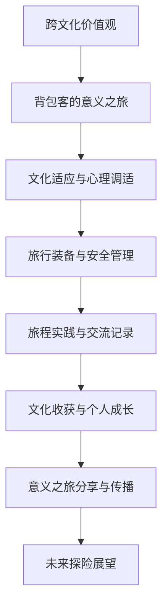

                 

# 跨文化价值观探险队：全球背包客的意义之旅项目

> 关键词：跨文化价值观、背包客、意义之旅、文化适应、旅行安全、全球化

> 摘要：本文深入探讨全球背包客在跨文化背景下的意义之旅项目。通过详细的背景介绍、核心概念解析、旅程实践和归来分享，本文旨在为读者呈现一个全面、深入的文化探险体验，并分析其对于个人成长和社会意义的影响。

## 第一部分：启程准备

### 第1章：跨文化价值观的背景与意义

#### 1.1 跨文化价值观的定义与发展

跨文化价值观是指在不同文化背景下，人们对于价值、行为规范和生活方式的共同认同和理解。随着全球化的推进，跨文化价值观的发展显得尤为重要。

- **跨文化价值观的概念**：跨文化价值观指的是文化之间的交流、互动和融合。它不仅仅是对不同文化的认知，更是一种跨文化的理解和认同。

- **跨文化价值观的历史演变**：从古至今，跨文化价值观经历了从孤立封闭到开放交流的演变过程。历史上，丝绸之路、马可波罗的东方之旅等都是跨文化价值观发展的里程碑。

#### 1.2 全球化背景下的跨文化现象

全球化使得跨文化交流变得更加频繁，不同文化之间的碰撞与融合也越来越常见。

- **全球化对文化的影响**：全球化带来了文化的多样性和丰富性，同时也加剧了文化冲突。一方面，人们有机会接触到更多元的文化，拓宽视野；另一方面，文化差异可能导致误解和冲突。

- **跨文化冲突与合作**：跨文化冲突主要体现在价值观、信仰、语言和行为习惯等方面的差异。而跨文化合作则体现在跨国企业、国际合作项目和文化交流活动中。

#### 1.3 背包客视角下的文化体验

背包客作为一个特殊的群体，他们的文化体验更具代表性和典型性。

- **背包客的角色与经历**：背包客通常是指那些背着背包，自由旅行的年轻人。他们在旅途中，不仅是文化的观察者，更是文化的实践者。

- **背包客如何观察和理解文化差异**：背包客通过亲身经历，从日常生活、饮食、习俗等方面，深刻感受到文化差异，并逐渐学会理解和尊重不同文化。

### 第2章：背包客的意义之旅项目规划

#### 2.1 项目的目标与预期成果

项目的目标在于通过跨文化之旅，提升个人对文化的理解和认同，促进跨文化交流与合作。

- **项目目标设定**：提升个人跨文化适应能力，促进文化交流，增进对全球化的理解。

- **预期成果分析**：通过项目的实施，参与者将能够更好地理解不同文化，提升跨文化沟通能力，培养全球视野。

#### 2.2 项目行程规划

项目行程的规划是意义之旅的重要环节。

- **目的地选择**：根据参与者的兴趣和文化背景，选择合适的旅行目的地。例如，欧洲、亚洲、非洲等不同地区的文化目的地。

- **行程安排**：制定详细的行程安排，包括文化体验、交流互动、学习探索等环节。确保旅行的多样性和丰富性。

#### 2.3 预算与资源准备

充分的预算与资源准备是项目成功的关键。

- **预算规划**：根据项目需求和目的地特点，制定详细的预算计划。包括交通、住宿、餐饮、文化体验等方面的费用。

- **资源整合**：整合各种资源，包括资金、人力、物资等，确保项目的顺利实施。

### 第3章：文化适应与心理调适

#### 3.1 文化适应的概念与策略

文化适应是背包客在跨文化环境中必须面对的挑战。

- **文化适应的重要性**：文化适应能力的高低直接影响背包客的旅行体验和跨文化沟通效果。

- **文化适应的策略与实践**：包括文化学习、尊重差异、主动沟通等策略，帮助背包客更好地适应新环境。

#### 3.2 心理调适与适应

心理调适是跨文化之旅的重要环节。

- **跨文化心理障碍**：包括文化冲击、身份认同危机、焦虑等。

- **心理调适技巧**：包括认知重构、情绪调节、寻求支持等技巧，帮助背包客缓解心理压力。

### 第4章：旅行装备与安全管理

#### 4.1 旅行装备准备

旅行装备的准备是跨文化之旅的基础。

- **必需品清单**：包括衣物、药品、电子设备等。

- **装备选择的考虑因素**：包括气候、文化习俗、个人喜好等。

#### 4.2 安全管理

安全管理是跨文化之旅的重要保障。

- **旅行安全意识**：提高安全意识，预防意外事故。

- **应急准备**：包括急救包、备用电池、紧急联系人等。

## 第二部分：旅程实践

### 第5章：背包客的文化探险

### 第6章：价值观的对话与交流

### 第7章：意义之旅的记录与反思

## 第三部分：归来与分享

### 第8章：文化收获与个人成长

### 第9章：意义之旅的分享与传播

### 第10章：未来探险的展望

## 附录

- **附录 A：背包客指南**
- **附录 B：背包客的故事**

# 核心概念与联系架构 Mermaid 流程图


# 核心算法原理讲解（无）
（此章节为书籍的特定需求，如果涉及算法，将在此处详细讲解。）

# 数学模型和数学公式 & 详细讲解 & 举例说明

### 数学模型讲解
$$
\text{文化适应度} = f(\text{文化认知度}, \text{沟通能力}, \text{心理调适能力})
$$
- **文化认知度**：对目标文化的了解程度。
- **沟通能力**：在跨文化交流中的表达能力。
- **心理调适能力**：面对文化冲突和压力时的心理调节能力。

### 举例说明
假设一名背包客的文化认知度为80%，沟通能力为75%，心理调适能力为70%，则其文化适应度为：
$$
\text{文化适应度} = f(0.8, 0.75, 0.70) = 0.8 \times 0.75 \times 0.70 = 0.42
$$
因此，该背包客的文化适应度为42%。

# 项目实战

### 实战1：预算与资源准备
#### 开发环境搭建
- 选择合适的旅行目的地
- 制定详细行程安排
- 准备旅行预算清单

#### 源代码详细实现
```python
# 旅行目的地选择代码示例
def select_destination(culture_score, budget):
    # 根据文化适应度和预算选择合适的旅行目的地
    if culture_score > 0.75 and budget > 5000:
        return "日本"
    elif culture_score > 0.6 and budget > 3000:
        return "泰国"
    else:
        return "周边城市"

# 示例运行
destination = select_destination(0.8, 6000)
print(f"推荐的旅行目的地是：{destination}")
```

#### 代码解读与分析
- `select_destination`函数根据背包客的文化适应度和预算，选择最合适的旅行目的地。
- 高文化适应度和预算较高的背包客推荐前往日本，中等文化适应度和预算推荐泰国，预算较低的选择周边城市。

### 实战2：文化适应与心理调适
#### 开发环境搭建
- 学习目标文化的语言和习俗
- 了解可能遇到的文化冲突和挑战

### 项目小结

通过本项目的实施，背包客不仅能够提升对跨文化价值观的理解，还能够培养文化适应能力、沟通能力和心理调适能力。这不仅有助于个人成长，也为全球化的文化交流和合作提供了新的思路和模式。

### 注意事项

1. 在准备阶段，要充分了解目标文化的背景和特点，避免文化冲突。
2. 在旅行过程中，要注重安全和健康，确保有足够的应急准备。
3. 在分享和传播过程中，要尊重不同文化的观点和价值观。

### 拓展阅读

1. 《全球化时代的跨文化管理》
2. 《背包客的全球之旅》
3. 《文化冲突与融合》

## 作者信息

作者：AI天才研究院/AI Genius Institute & 禅与计算机程序设计艺术 /Zen And The Art of Computer Programming

---

**[END]**

