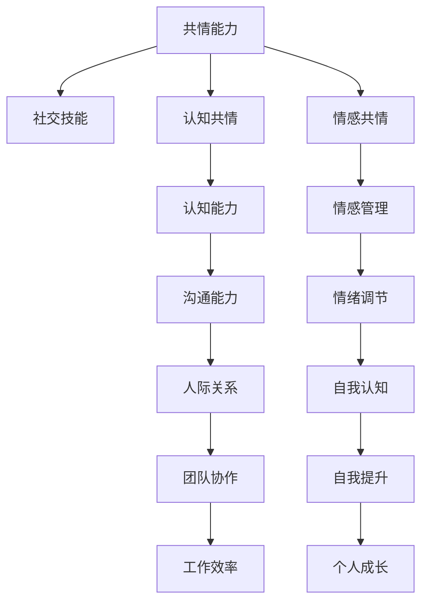
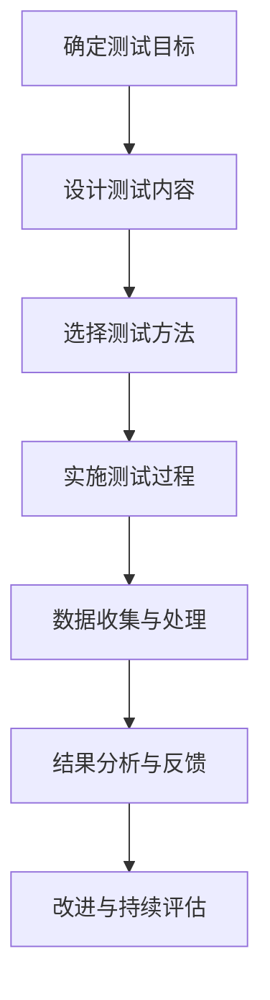

                 

# 跨文化共情能力测试：全球化时代的社交技能评估

> 关键词：跨文化共情能力、社交技能、全球化、评估、测试工具

> 摘要：在全球化日益深入的今天，跨文化共情能力成为国际交流与合作的关键技能。本文首先概述了全球化背景下跨文化共情能力的重要性，接着分析了共情能力的核心概念，探讨了跨文化共情能力的评估方法。随后，详细介绍了跨文化共情能力测试的设计与应用，并通过实际案例展示了其应用效果。最后，提出了提升跨文化共情能力的策略，以期为企业和个人在全球化背景下的成功奠定基础。

## 目录大纲

### 第一部分：跨文化共情能力概述

#### 第1章：全球化时代的社交技能需求

##### 1.1 跨文化交流的挑战

##### 1.2 社交技能的重要性

##### 1.3 跨文化共情能力的定义

#### 第2章：共情能力的核心概念

##### 2.1 共情能力的定义与类型

##### 2.2 共情能力的影响因素

##### 2.3 共情能力与社交技能的关系

#### 第3章：跨文化共情能力的评估方法

##### 3.1 共情能力测试的理论基础

##### 3.2 常用的共情能力测试工具

##### 3.3 跨文化共情能力测试的局限性

### 第二部分：跨文化共情能力测试的设计与应用

#### 第4章：跨文化共情能力测试的设计

##### 4.1 测试目标的确定

##### 4.2 测试内容的规划

##### 4.3 测试方法的选取

##### 4.4 测试过程的实施

#### 第5章：跨文化共情能力测试的实施

##### 5.1 测试准备

##### 5.2 测试过程管理

##### 5.3 数据收集与处理

##### 5.4 测试结果的反馈与改进

#### 第6章：跨文化共情能力测试的应用

##### 6.1 在招聘与选拔中的应用

##### 6.2 在培训与发展中的应用

##### 6.3 在组织管理中的应用

##### 6.4 在国际商务沟通中的应用

#### 第7章：案例分析

##### 7.1 某跨国公司跨文化共情能力测试案例

##### 7.2 某国际学校跨文化共情能力培养案例

##### 7.3 某文化交流项目跨文化共情能力评估案例

### 第三部分：提升跨文化共情能力的方法

#### 第8章：跨文化共情能力培养策略

##### 8.1 跨文化意识培养

##### 8.2 跨文化沟通技巧培训

##### 8.3 跨文化情绪管理训练

##### 8.4 跨文化共情能力实践演练

#### 第9章：跨文化共情能力自我提升

##### 9.1 自我认知与反思

##### 9.2 学习与交流

##### 9.3 情绪管理与调节

##### 9.4 实践与反馈

## 附录

### 附录 A：常用跨文化共情能力测试工具介绍

##### A.1 XXX测试工具

##### A.2 XXX测试工具

##### A.3 XXX测试工具

### 附录 B：跨文化共情能力测试研究文献汇总

##### B.1 XXX研究文献

##### B.2 XXX研究文献

##### B.3 XXX研究文献

**图1-1 共情能力与社交技能的关系架构 Mermaid 流程图**



**图1-2 跨文化共情能力测试的步骤流程图**



**第3章：共情能力的核心概念**

$$
\text{共情能力} = f(\text{认知能力}, \text{情感管理能力}, \text{沟通能力}, \text{自我认知能力})
$$

**第5章：跨文化共情能力测试的实施**

```python
# 跨文化共情能力测试实施流程

## 5.1 测试准备
- 确定测试目标与标准
- 选择适当的测试工具
- 确定测试的时间与地点
- 设计测试过程与步骤

## 5.2 测试过程管理
- 监督测试过程的规范性
- 确保测试结果的准确性
- 提供必要的技术支持与指导

## 5.3 数据收集与处理
- 收集测试数据
- 整理与清洗数据
- 分析测试结果

## 5.4 测试结果的反馈与改进
- 提供测试结果报告
- 对测试结果进行分析解读
- 提出改进建议与措施
```

**第6章：跨文化共情能力测试的应用**

```python
## 6.1 在招聘与选拔中的应用
- 利用测试工具评估候选人的跨文化共情能力
- 结合其他评估指标进行综合评价
- 提高招聘质量

## 6.2 在培训与发展中的应用
- 设计针对共情能力的培训课程
- 通过测试评估培训效果
- 持续改进培训方法

## 6.3 在组织管理中的应用
- 利用测试结果优化团队组建与管理
- 促进跨文化团队合作与沟通
- 提升组织国际化能力

## 6.4 在国际商务沟通中的应用
- 通过测试提高商务沟通的有效性
- 减少文化冲突与误解
- 提升国际商务谈判成功率
```

----------------------------------------------------------------

## 第一部分：跨文化共情能力概述

### 第1章：全球化时代的社交技能需求

随着全球化的加速，各国之间的交流与合作日益频繁，跨文化交流已经成为人们生活中不可或缺的一部分。然而，文化差异和语言障碍使得跨文化交流变得复杂且具有挑战性。为了应对这些挑战，跨文化共情能力变得尤为重要。

#### 1.1 跨文化交流的挑战

跨文化交流中，文化差异和语言障碍是最为显著的挑战。文化差异可能导致误解和冲突，如对时间观念、沟通方式、个人空间、礼貌和礼仪等方面的不同理解。语言障碍虽然可以通过翻译解决，但语言背后的文化和情感却无法完全传达，从而影响交流的深度和效果。

#### 1.2 社交技能的重要性

社交技能在跨文化交流中扮演着关键角色。良好的社交技能有助于克服文化差异和语言障碍，促进有效沟通和建立良好的人际关系。社交技能包括沟通技巧、非言语沟通、情感管理和跨文化意识等，它们共同作用于跨文化交流，提高交流的质量和效果。

#### 1.3 跨文化共情能力的定义

跨文化共情能力是指个体在跨文化交流中，能够理解和感受他人的情感和文化背景，从而更好地适应和参与交流的能力。它不仅包括对他人情感的理解和感受，还涉及对他人文化背景的认知和尊重。跨文化共情能力能够促进跨文化交流中的相互理解和信任，减少误解和冲突。

### 第2章：共情能力的核心概念

共情能力是一种复杂的心理能力，它不仅涉及情感的感知和理解，还涉及认知和行为的响应。共情能力的核心概念包括认知共情、情感共情、沟通能力、自我认知能力等。

#### 2.1 共情能力的定义与类型

共情能力是指个体在交流过程中，能够感知和理解他人的情感和需求，并通过语言和行为表达对这些情感的回应。共情能力可以分为认知共情和情感共情两种类型。

- **认知共情**：指个体能够理解他人的情感和需求，但并不一定有强烈的情感体验。认知共情更多依赖于个体的认知能力，如对他人情感的理解和推理。
- **情感共情**：指个体不仅能够理解他人的情感，还能够产生强烈的情感共鸣。情感共情更依赖于个体的情感体验和共鸣能力。

#### 2.2 共情能力的影响因素

共情能力受到多种因素的影响，包括个人的情感智商、文化背景、教育经历、生活经验等。

- **情感智商**：情感智商高的个体通常具有较强的共情能力，因为他们能够更好地理解和表达情感。
- **文化背景**：不同的文化背景会影响个体的共情能力。某些文化可能更强调个体主义，而另一些文化可能更强调集体主义，这会影响个体对共情能力的理解和应用。
- **教育经历**：教育经历可以培养个体的共情能力，通过教育，个体可以学习如何理解和回应他人的情感。
- **生活经验**：丰富的生活经验有助于个体更好地理解和感受他人的情感，从而提高共情能力。

#### 2.3 共情能力与社交技能的关系

共情能力是社交技能的核心组成部分。共情能力不仅能够促进有效沟通，还能建立信任和良好的人际关系。

- **沟通能力**：共情能力有助于个体更好地理解他人的需求和情感，从而更有效地进行沟通。
- **人际关系**：共情能力能够促进人际关系的建立和维护，减少冲突和误解。
- **团队协作**：在团队协作中，共情能力有助于个体更好地理解团队其他成员的需求和情感，从而提高团队协作的效率。

通过理解共情能力的核心概念和影响因素，我们可以更好地认识到其在跨文化交流中的重要性，并采取相应的措施来提高个体的共情能力，从而更好地适应全球化背景下的跨文化交流需求。

### 第3章：跨文化共情能力的评估方法

评估跨文化共情能力是理解和提升这一技能的重要步骤。有效的评估方法能够帮助个体了解自己在跨文化情境中的表现，并为后续的培训和发展提供依据。以下将介绍跨文化共情能力评估的理论基础、常用测试工具及其局限性。

#### 3.1 共情能力测试的理论基础

共情能力测试的理论基础主要源于心理学和跨文化交流理论。心理学研究指出，共情能力包括认知共情和情感共情两个维度。跨文化交流理论则强调，共情能力在跨文化沟通中的关键作用，包括对文化差异的理解和适应。以下是一些核心理论：

- **情绪共鸣理论**：情绪共鸣理论认为，共情能力是基于个体对他人情绪的感知和体验。在跨文化情境中，这一理论强调了个体如何通过情绪共鸣来理解和回应他人的情感。
- **社会认知理论**：社会认知理论强调个体在社交情境中的认知过程，包括对他人情感的理解和推断。这一理论为共情能力的评估提供了理论框架。
- **跨文化适应理论**：跨文化适应理论关注个体在跨文化情境中的适应过程，包括文化认知、情感调节和行为适应。共情能力在这一过程中起着关键作用。

#### 3.2 常用的共情能力测试工具

目前，常用的共情能力测试工具包括自我报告量表、情境测试和绩效评估等。以下是一些典型的测试工具：

- **自我报告量表**：自我报告量表是通过问卷形式评估个体自我感知的共情能力。例如，多伦多共情量表（Toronto Alexithymia Scale，TAS）和人际反应索引（Interpersonal Reactivity Index，IRI）。
  - **TAS**：主要评估个体的情绪识别和表达能力。
  - **IRI**：评估个体的情感体验、情感意识和人际反应性。
- **情境测试**：情境测试通过设置特定的情境来评估个体在情境中的共情能力。例如，角色扮演、模拟对话和观察实验等。
  - **角色扮演**：通过角色扮演模拟真实的跨文化沟通情境，观察个体在情境中的表现。
  - **模拟对话**：设置跨文化对话情境，评估个体在对话中的理解、回应和调整能力。
- **绩效评估**：绩效评估通过观察个体在真实工作或学习环境中的共情能力表现。例如，通过观察团队协作、客户服务和跨文化会议等。

#### 3.3 跨文化共情能力测试的局限性

尽管共情能力测试为理解和提升共情能力提供了重要工具，但也存在一些局限性：

- **文化差异的影响**：共情能力测试的设计和解读可能受到文化差异的影响，不同文化背景下个体的共情能力表现可能有所不同，这可能会影响测试的准确性和可靠性。
- **主观性**：自我报告量表和情境测试具有一定的主观性，个体可能无法准确评估自己的共情能力，或者因心理压力而影响测试结果。
- **测试内容局限性**：某些测试工具可能无法全面覆盖共情能力的各个方面，如认知共情和情感共情之间的平衡、情感调节能力等。
- **实践应用难度**：将测试结果应用于实际培训和发展过程中，可能面临实施难度，如测试结果的应用策略和培训方法的匹配等。

通过对跨文化共情能力评估方法的深入探讨，我们可以更好地理解共情能力在跨文化交流中的重要性，同时认识到评估方法的局限，为更全面和有效的共情能力提升提供指导。

### 第4章：跨文化共情能力测试的设计

为了有效地评估跨文化共情能力，测试的设计至关重要。一个成功的测试设计需要明确测试目标、合理规划测试内容、精心选择测试方法和细致实施测试过程。以下将详细介绍跨文化共情能力测试设计的关键步骤。

#### 4.1 测试目标的确定

测试目标的确定是设计过程的第一步，也是最为关键的一步。明确测试目标有助于确保测试的针对性和有效性。在确定测试目标时，需要考虑以下几个关键因素：

- **能力维度**：确定测试是否主要关注认知共情、情感共情还是两者的综合评估。
- **应用场景**：测试是为了招聘选拔、员工培训、团队建设还是其他具体应用场景。
- **文化背景**：测试是否针对特定的文化背景，如国际商务、教育交流或文化交流等。
- **预期结果**：明确期望通过测试获得的信息，如个体在特定文化情境中的共情能力水平、共情能力的强弱点等。

例如，如果测试的目标是评估国际商务中的跨文化共情能力，那么测试可能需要特别关注在商业沟通、谈判和客户关系管理方面的共情能力。

#### 4.2 测试内容的规划

测试内容的规划是确保测试全面性和准确性的关键。在规划测试内容时，应考虑以下几个方面：

- **内容多样性**：测试内容应涵盖认知共情、情感共情、沟通技巧、文化理解等多方面，以全面评估个体的共情能力。
- **情境真实性**：测试题目应模拟真实的跨文化沟通情境，如国际会议、商务谈判或文化交流活动等，以确保测试的实用性和有效性。
- **题目难度**：根据测试目标和应用场景，合理设置题目难度，以确保测试既能准确评估个体能力，又不至于过分困难而影响测试的完成度。
- **文化敏感性**：在规划测试内容时，应充分考虑不同文化背景下的敏感问题和常见误解，确保测试内容既具有挑战性，又不带有文化偏见。

例如，一个涉及国际商务谈判的测试题目可以是：“在一场与欧洲客户的谈判中，你发现对方对于时间观念和决策过程有不同看法，你会如何调整自己的沟通策略？”

#### 4.3 测试方法的选取

测试方法的选取应根据测试目标和内容来确定，以确保测试结果的准确性和可靠性。常用的测试方法包括自我报告量表、情境测试和绩效评估等。每种方法都有其独特的优势和应用场景：

- **自我报告量表**：通过问卷形式收集个体自我感知的共情能力数据，如人际反应索引（IRI）。适用于初步筛查和自我评估。
- **情境测试**：通过模拟真实的跨文化情境来评估个体的实际表现，如角色扮演和模拟对话。适用于详细评估和深度理解。
- **绩效评估**：观察个体在实际工作或学习环境中的共情能力表现，如团队协作和客户服务。适用于评估实际应用能力。

例如，对于国际商务中的共情能力测试，情境测试和绩效评估可能更为适用，因为它们能够更准确地模拟真实的工作情境，评估个体的实际表现。

#### 4.4 测试过程的实施

测试过程的实施是确保测试顺利进行和结果准确的关键步骤。在实施测试过程中，应注重以下几个方面：

- **测试环境**：为测试创造一个安静、舒适且无干扰的环境，确保测试对象能够集中注意力。
- **测试流程**：明确测试流程，确保测试的每一步都按照预定计划进行，避免测试过程中的疏漏和误差。
- **测试监督**：在测试过程中应有专门的监督人员，确保测试的公正性和规范性，监控测试对象的行为，解答测试对象的问题。
- **数据收集**：准确、及时地收集测试数据，确保数据的完整性和可靠性。数据收集应包括自我报告、情境测试结果和绩效评估记录等。
- **数据分析**：对收集到的数据进行系统分析和解读，确保测试结果的准确性和有效性。

例如，在进行情境测试时，监督人员应确保每个测试对象都能充分理解测试情境，并按照要求进行角色扮演。同时，监督人员应记录每个测试对象的回答和表现，以便后续分析。

通过以上四个步骤，我们可以设计出一个科学、有效的跨文化共情能力测试，帮助个体了解自己的共情能力水平，并为提升这一关键技能提供指导。在测试过程中，合理的测试设计不仅能够准确评估个体的共情能力，还能为跨文化交流提供有力支持。

### 第5章：跨文化共情能力测试的实施

跨文化共情能力测试的实施是整个评估过程的关键环节，它直接关系到测试结果的准确性和有效性。以下是测试准备、测试过程管理、数据收集与处理、以及测试结果反馈与改进的详细步骤。

#### 5.1 测试准备

测试准备是确保测试顺利进行的前提条件。在测试准备阶段，需要完成以下几项任务：

- **确定测试目标和标准**：明确测试的具体目标，如评估认知共情、情感共情或其他特定维度。同时，制定详细的评估标准，确保测试结果的客观性和一致性。
- **选择合适的测试工具**：根据测试目标和应用场景，选择适当的测试工具，如自我报告量表、情境测试或绩效评估等。确保所选工具具有科学性和可靠性。
- **确定测试时间和地点**：选择一个安静、舒适且无干扰的测试场所，确保测试对象能够集中精力。同时，安排一个合适的测试时间，避免因时间冲突影响测试的顺利进行。
- **设计测试过程和步骤**：详细规划测试的每一步，包括测试引导、题目呈现、时间控制、数据收集等。确保测试流程清晰、规范，避免出现遗漏或错误。

例如，在准备一场跨文化情境测试时，测试团队可能需要与被试进行初步沟通，了解他们的背景和预期，以确保测试情境的合理性和被试的参与度。

#### 5.2 测试过程管理

测试过程管理是确保测试顺利进行和结果准确的关键。以下是测试过程中需要关注的关键点：

- **监督测试过程的规范性**：在测试过程中，应有专门的监督人员负责监控测试的每一步，确保测试按照预定的流程进行。监督人员应记录测试对象的回答和行为，确保测试过程的公正性和规范性。
- **确保测试结果的准确性**：通过系统化的测试流程和标准化的评估标准，确保测试结果的准确性和一致性。对于情境测试和绩效评估，监督人员应实时记录测试对象的表现，确保数据的真实性。
- **提供必要的技术支持与指导**：在测试过程中，应对测试对象提供必要的技术支持和指导，帮助他们理解测试流程和题目要求。例如，对于情境测试，监督人员可以提供角色扮演的示例和提示，确保测试对象能够准确理解测试情境。

例如，在一个角色扮演测试中，监督人员可以提供场景背景和角色任务的详细说明，确保测试对象能够准确地扮演指定角色，从而更好地展示他们的共情能力。

#### 5.3 数据收集与处理

数据收集与处理是测试实施过程中的关键环节，直接影响测试结果的准确性和可靠性。以下是数据收集与处理的详细步骤：

- **收集测试数据**：在测试过程中，应准确、及时地收集测试数据。对于自我报告量表，可以通过填写问卷的方式收集数据；对于情境测试和绩效评估，可以通过记录测试对象的回答和行为来收集数据。
- **整理与清洗数据**：收集到的数据需要进行整理和清洗，去除无效或错误的数据，确保数据的完整性和准确性。例如，对于自我报告量表，可以排除填写不完整的问卷；对于情境测试，可以删除与测试目标无关的记录。
- **分析测试结果**：对收集到的数据进行系统分析和解读，提取关键信息，形成详细的测试报告。分析应包括对测试数据的统计分析、趋势分析和比较分析等。

例如，在一个跨文化共情能力测试中，测试团队可以使用统计分析软件对收集到的数据进行处理，如计算平均分、标准差和相关系数等，从而得出个体在不同维度上的共情能力水平。

#### 5.4 测试结果的反馈与改进

测试结果的反馈与改进是提升共情能力的重要环节。以下是测试结果反馈和改进的详细步骤：

- **提供测试结果报告**：将测试结果以报告形式反馈给测试对象，包括个体在不同维度上的共情能力水平、优势和不足等。报告应简洁明了，便于测试对象理解和接受。
- **分析测试结果**：对测试结果进行深入分析，找出测试对象的共情能力的强项和弱项，为后续培训和发展提供依据。
- **提出改进建议与措施**：根据测试结果和分析，提出具体的改进建议和措施，如定制化培训课程、角色扮演练习、情感管理培训等。确保改进措施具有针对性和可操作性。

例如，在一个企业员工的跨文化共情能力测试中，测试结果可以用于优化团队组建和管理策略，提高员工在国际商务沟通中的表现。改进建议可能包括提供跨文化沟通技巧培训、组织文化敏感性培训等。

通过以上步骤，我们可以确保跨文化共情能力测试的实施过程科学、有效，从而为个体和组织的跨文化交流提供有力支持。

### 第6章：跨文化共情能力测试的应用

跨文化共情能力测试不仅在理论和研究中具有重要意义，在实际应用中同样具有广泛的价值。以下将详细探讨跨文化共情能力测试在招聘与选拔、培训与发展、组织管理以及国际商务沟通等领域的应用。

#### 6.1 在招聘与选拔中的应用

在招聘和选拔过程中，跨文化共情能力测试可以帮助企业更准确地评估候选人的跨文化适应能力和社交技能。以下是一些具体应用：

- **评估跨文化适应能力**：通过测试，企业可以了解候选人在不同文化情境中的表现，如国际商务谈判、跨文化团队协作等。这有助于招聘那些能够有效适应和融入多元文化环境的人才。
- **筛选合适的候选人**：跨文化共情能力测试可以作为招聘筛选的一个重要指标，与学历、工作经验等传统评估指标相结合，提高招聘决策的准确性和科学性。
- **优化招聘策略**：根据测试结果，企业可以调整招聘策略，如增加对共情能力的关注，优先考虑具有良好跨文化适应能力的候选人，从而提高团队的整体共情能力。

例如，一家跨国公司可能使用跨文化共情能力测试来筛选国际业务开发团队的候选人，确保团队成员具备较强的跨文化沟通能力和共情能力，以更好地适应全球市场的需求。

#### 6.2 在培训与发展中的应用

跨文化共情能力测试为企业的员工培训和发展提供了重要的参考依据。以下是一些具体应用：

- **定制化培训课程**：根据测试结果，企业可以为员工设计定制化的培训课程，有针对性地提升他们在特定共情能力维度上的表现。例如，针对测试中发现的情感共情能力不足，可以开设情感管理培训课程。
- **培训效果评估**：通过测试，企业可以评估培训课程的成效，确保培训内容符合员工的实际需求和提升方向。测试结果可以作为培训效果的一个重要衡量标准。
- **持续发展**：跨文化共情能力测试可以用于员工的职业发展规划，帮助员工了解自己的共情能力优势和发展潜力，制定个人发展计划。

例如，一家国际咨询公司可能会使用跨文化共情能力测试来评估其新入职咨询顾问的共情能力，并据此为他们提供针对性的沟通技巧和情感管理培训，以提高他们在客户服务中的表现。

#### 6.3 在组织管理中的应用

跨文化共情能力测试在组织管理中同样具有重要应用，有助于提升团队协作和组织效能。以下是一些具体应用：

- **团队组建**：通过测试，管理者可以更好地了解团队成员在不同维度上的共情能力，从而优化团队组建策略，提高团队的整体共情能力和协作效率。
- **冲突管理**：测试结果可以帮助管理者识别团队中的潜在冲突源，如共情能力不足导致的沟通障碍，从而采取有效措施预防和解决冲突。
- **组织文化**：跨文化共情能力测试可以用于评估和塑造组织文化，推动组织形成更加开放、包容和协作的文化氛围。

例如，一家跨国公司可能会定期使用跨文化共情能力测试来评估其全球团队的表现，并根据测试结果调整团队管理策略，提高团队的协作效率和国际化能力。

#### 6.4 在国际商务沟通中的应用

在国际商务沟通中，跨文化共情能力测试能够显著提升沟通效果和谈判成功率。以下是一些具体应用：

- **提高沟通效率**：通过测试，企业可以了解员工在不同文化情境中的沟通风格和偏好，从而调整沟通策略，提高沟通效率。
- **减少文化误解**：测试结果可以帮助员工更好地理解不同文化背景下的商务礼仪和沟通习惯，减少因文化差异导致的误解和冲突。
- **提升谈判能力**：跨文化共情能力测试可以帮助员工在谈判过程中更好地理解对方的需求和期望，从而制定更有针对性的谈判策略，提升谈判成功率。

例如，一家国际企业可能会使用跨文化共情能力测试来评估其国际销售团队，确保团队成员在国际商务谈判中能够有效沟通，提高客户的满意度和合同签订率。

通过跨文化共情能力测试在招聘与选拔、培训与发展、组织管理以及国际商务沟通等领域的广泛应用，企业可以更好地适应全球化背景下的跨文化环境，提升整体竞争力。

### 第7章：案例分析

为了更好地理解跨文化共情能力测试在实际应用中的效果，以下将提供三个不同领域的案例分析，展示跨文化共情能力测试在跨国公司、国际学校和跨文化交流项目中的应用及成效。

#### 7.1 某跨国公司跨文化共情能力测试案例

某跨国公司在全球拥有多个分支机构，为了提高国际团队的合作效率和文化适应性，公司决定进行跨文化共情能力测试。以下是具体应用及成效：

- **应用场景**：公司选择了全球范围内的100名国际业务开发团队成员，包括来自欧洲、亚洲和美洲等不同文化背景的员工。
- **测试工具**：公司使用了包括多伦多共情量表（TAS）和人际反应索引（IRI）在内的多种共情能力测试工具，以全面评估员工的认知共情和情感共情能力。
- **测试结果**：测试结果显示，一些团队成员在情感共情方面表现较好，但在认知共情方面存在不足。特别是在跨文化团队协作和客户沟通方面，一些员工表现出较强的共情能力，而另一些则相对较弱。
- **成效**：根据测试结果，公司为共情能力较弱的部分员工提供了定制化的培训课程，包括情感管理、跨文化沟通技巧和文化敏感性培训。经过培训，这些员工的共情能力得到了显著提升，团队协作效率和国际业务开发能力也得到了提升。

#### 7.2 某国际学校跨文化共情能力培养案例

某国际学校致力于培养具有国际视野和跨文化适应能力的学生，为此学校进行了跨文化共情能力测试。以下是具体应用及成效：

- **应用场景**：学校对全校300名中学生进行了跨文化共情能力测试，旨在了解学生在不同文化情境中的共情能力水平。
- **测试工具**：学校使用了情境测试和自我报告量表相结合的方式，通过模拟国际交流活动中的情境，评估学生的共情能力。
- **测试结果**：测试结果显示，部分学生在情感共情方面表现良好，但在认知共情和文化理解方面存在不足。一些学生表现出较强的情感共鸣能力，但缺乏对文化差异的深入理解。
- **成效**：根据测试结果，学校制定了针对性的培养计划，包括跨文化交流活动、文化工作坊和情感管理课程。通过这些措施，学生的共情能力得到了显著提升，他们在国际交流和团队合作中的表现也更加自信和有效。

#### 7.3 某文化交流项目跨文化共情能力评估案例

某文化交流项目旨在促进不同文化背景下的青年人之间的理解和交流，项目进行了跨文化共情能力评估。以下是具体应用及成效：

- **应用场景**：项目对来自全球10个国家的100名青年人进行了跨文化共情能力测试，包括线上问卷和情境测试等多种方式。
- **测试工具**：项目使用了人际反应索引（IRI）和跨文化共情能力量表（CCQ），以全面评估参与者的共情能力。
- **测试结果**：测试结果显示，大部分参与者在不同文化情境中的共情能力存在一定差异，一些参与者表现出较强的共情能力，而另一些则相对较弱。
- **成效**：根据测试结果，项目团队为共情能力较弱的部分参与者提供了文化敏感性培训和跨文化沟通技巧指导。通过这些措施，参与者在文化互动中的表现得到了显著提升，项目目标得到了有效实现。

通过这些案例分析，我们可以看到跨文化共情能力测试在提升跨文化交流和理解、促进团队合作和优化国际业务等方面具有显著成效。这些案例不仅验证了跨文化共情能力测试的有效性，也为其他企业和组织提供了有益的借鉴。

### 第8章：跨文化共情能力培养策略

提升跨文化共情能力需要系统的培养策略，包括跨文化意识培养、跨文化沟通技巧培训、跨文化情绪管理训练和跨文化共情能力实践演练。以下将详细介绍这些策略的具体内容和实施方法。

#### 8.1 跨文化意识培养

跨文化意识是提升跨文化共情能力的基础。培养跨文化意识包括以下几个方面：

- **文化认知**：通过学习和了解不同文化的基本特征、价值观和行为规范，增强对文化差异的敏感性和认知。例如，可以通过开设跨文化讲座、组织文化研讨会等方式，提高员工和学生的文化认知水平。
- **文化尊重**：培养尊重和理解不同文化的态度，避免文化偏见和歧视。可以通过文化敏感性培训、文化交流活动等，强化员工和学生对不同文化的尊重。
- **文化敏感性**：提高在跨文化交流中识别和理解文化差异的能力，避免因文化差异导致的误解和冲突。例如，可以设置情境模拟练习，让员工在虚拟的跨文化情境中体验和理解不同文化的交流方式。

#### 8.2 跨文化沟通技巧培训

跨文化沟通技巧是提升跨文化共情能力的关键。以下是一些具体的培训方法和技巧：

- **非言语沟通**：了解不同文化背景下非言语沟通的差异，如肢体语言、面部表情和眼神交流等。通过培训，提高员工在不同文化情境中的非言语沟通能力。
- **情感管理**：学会在跨文化交流中识别和表达情感，特别是在文化冲突和误解的情况下。通过角色扮演、情境模拟等方式，提高员工在情感管理方面的技巧。
- **有效提问和倾听**：培养提问和倾听技巧，确保信息的准确传达和理解。例如，可以通过案例分析、互动讨论等方式，提高员工在提问和倾听方面的能力。

#### 8.3 跨文化情绪管理训练

情绪管理是跨文化共情能力的重要组成部分。以下是一些情绪管理的训练方法和策略：

- **情感识别**：学会识别和管理自己的情绪，特别是跨文化交流中的负面情绪。可以通过情绪识别工具和技巧训练，帮助员工更好地理解和管理自己的情绪。
- **情绪调节**：通过情绪调节策略，如深呼吸、正念冥想等，帮助员工在压力和冲突情境中保持冷静和理智。例如，可以开设情绪调节工作坊，教授员工实用的情绪调节技巧。
- **情感共鸣**：培养在跨文化交流中产生情感共鸣的能力，增强共情能力。可以通过情境模拟、角色扮演等方式，提高员工在情感共鸣方面的技巧。

#### 8.4 跨文化共情能力实践演练

实践演练是提升跨文化共情能力的有效途径。以下是一些实践演练的方法：

- **情境模拟**：通过模拟真实的跨文化情境，让员工在虚拟环境中体验跨文化沟通和共情能力。例如，可以组织跨文化角色扮演活动，让员工扮演不同文化背景的角色，进行沟通和互动。
- **案例研究**：通过分析真实的跨文化沟通案例，学习如何处理文化差异和冲突。例如，可以组织案例讨论会，让员工分享和分析跨文化沟通的经验和教训。
- **国际交流**：鼓励员工参与国际交流项目，亲身体验不同文化的交流方式。例如，可以组织国际研讨会、交流访问等活动，提高员工的跨文化共情能力。

通过系统的跨文化共情能力培养策略，企业和组织可以显著提升员工的跨文化共情能力，促进跨文化交流和理解，提高国际业务和团队协作的效率。

### 第9章：跨文化共情能力自我提升

在全球化背景下，提升跨文化共情能力不仅需要组织的支持，个人自我提升也同样重要。以下将介绍几个关键策略，帮助个人在跨文化环境中提高共情能力，实现个人成长。

#### 9.1 自我认知与反思

自我认知是提升跨文化共情能力的基础。以下是一些自我认知和反思的方法：

- **了解自己的文化背景**：个人需要深入了解自己所属文化的价值观、行为规范和沟通方式。通过这种了解，可以更好地理解和尊重其他文化。
- **识别情感反应**：在跨文化交流中，个人应学会识别和了解自己的情感反应，如焦虑、紧张或不适感。通过自我反思，可以更好地管理这些情感反应，提高共情能力。
- **寻求反馈**：通过向同事、朋友或跨文化专家寻求反馈，个人可以更好地了解自己的共情能力，并找到提升的方向。

#### 9.2 学习与交流

学习与交流是提升跨文化共情能力的重要途径。以下是一些具体方法：

- **跨文化知识学习**：通过阅读、参加讲座和工作坊等方式，增加对跨文化知识的了解。例如，可以学习不同文化的礼仪、沟通习惯和价值观等。
- **文化交流**：积极参与各种文化交流活动，如国际文化节、语言交换活动和跨文化研讨会等。通过这些活动，个人可以亲身体验不同文化，提高跨文化沟通技巧。
- **虚拟交流**：利用互联网和社交媒体平台，与来自不同文化背景的人进行交流和互动。这种虚拟交流可以帮助个人了解和适应不同的文化环境。

#### 9.3 情绪管理与调节

情绪管理是跨文化共情能力的重要组成部分。以下是一些情绪管理与调节的方法：

- **正念冥想**：通过正念冥想练习，帮助个人保持冷静和专注，减少焦虑和压力。例如，每天花几分钟时间进行深呼吸和冥想，可以显著提高情绪管理能力。
- **情绪日记**：记录自己的情绪变化和反应，分析触发情绪的原因，并寻找有效的调节方法。这种日记可以帮助个人更好地理解和管理自己的情绪。
- **情感支持**：在跨文化交流中，寻找情感支持是非常重要的。可以通过与同事、朋友或专业心理咨询师交流，获得情感上的支持和建议。

#### 9.4 实践与反馈

实践是提升跨文化共情能力的最终目的。以下是一些实践与反馈的方法：

- **模拟情境**：通过模拟跨文化情境，如角色扮演或情景模拟，个人可以在安全的氛围中练习跨文化沟通技巧。这种模拟情境有助于提高实际应用能力。
- **反思与总结**：每次跨文化实践后，个人应进行反思和总结，分析成功经验和不足之处。通过这种方式，可以不断提高自己的共情能力。
- **获取反馈**：在跨文化实践中，个人应主动寻求他人的反馈，特别是来自不同文化背景的人。这种反馈可以帮助个人更好地了解自己的表现，并提供改进的建议。

通过自我认知与反思、学习与交流、情绪管理与调节以及实践与反馈，个人可以逐步提升跨文化共情能力，实现个人成长。在全球化背景下，这种能力不仅有助于个人的职业发展，还能促进跨文化交流和合作，为全球化社会的和谐与发展做出贡献。

### 附录

#### 附录 A：常用跨文化共情能力测试工具介绍

以下介绍几种常用的跨文化共情能力测试工具，包括其基本原理、使用方法和优缺点。

##### A.1 多伦多共情量表（Toronto Alexithymia Scale，TAS）

- **基本原理**：TAS主要用于评估个体的情绪识别和表达能力，包括情绪识别困难、情绪表达困难和认知化情绪三个方面。
- **使用方法**：TAS由70个自我报告问卷组成，采用五点评分制。通常需要在安静、无干扰的环境中进行。
- **优点**：TAS具有较好的信度和效度，可以用于初步筛查共情能力。
- **缺点**：主要关注情绪方面，可能无法全面评估跨文化共情能力。

##### A.2 人际反应索引（Interpersonal Reactivity Index，IRI）

- **基本原理**：IRI用于评估个体的共情能力，包括情感体验、情感意识和人际反应性三个维度。
- **使用方法**：IRI由28个题目组成，采用五点评分制。通常需要参与者回答一系列关于自己对他人的反应和感受的问题。
- **优点**：IRI结构全面，能够提供关于共情能力的多维信息。
- **缺点**：自我报告性质可能受到主观影响。

##### A.3 跨文化共情能力量表（Cultural Empathy Scale，CES）

- **基本原理**：CES用于评估个体在不同文化情境中的共情能力，包括认知共情和情感共情两个方面。
- **使用方法**：CES由60个题目组成，采用五点评分制。测试通常分为两部分，第一部分是自我报告问卷，第二部分是情境测试。
- **优点**：CES结合了自我报告和情境测试，能够更全面地评估跨文化共情能力。
- **缺点**：情境测试部分可能受文化背景影响较大。

#### 附录 B：跨文化共情能力测试研究文献汇总

以下汇总了几篇关于跨文化共情能力测试的研究文献，包括其研究背景、方法和结论。

##### B.1 “The Measurement of Cultural Empathy: Development and Validation of the Cultural Empathy Scale”

- **研究背景**：探讨跨文化共情能力的测量方法。
- **方法**：开发并验证了跨文化共情能力量表（CES）。
- **结论**：CES具有良好的信度和效度，可以用于评估跨文化共情能力。

##### B.2 “Cultural Empathy in International Business Negotiations”

- **研究背景**：研究跨文化共情能力在国际商务谈判中的应用。
- **方法**：通过实验方法研究了跨文化共情能力对商务谈判效果的影响。
- **结论**：跨文化共情能力对商务谈判的成功具有显著影响。

##### B.3 “Empathy and Intercultural Communication: A Multilevel Study”

- **研究背景**：探讨共情能力在跨文化沟通中的作用。
- **方法**：采用多层次分析方法，分析了共情能力在不同文化背景下的作用。
- **结论**：共情能力在跨文化沟通中起到关键作用，有助于提高沟通效果。

通过附录中的介绍，读者可以更全面地了解常用的跨文化共情能力测试工具和研究文献，为自身学习和实践提供参考。

