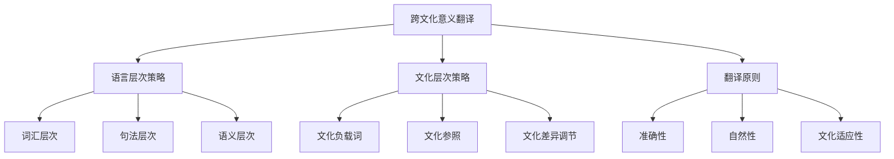
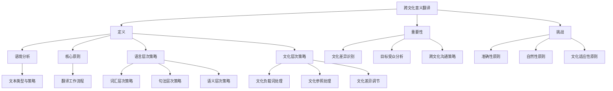

                 

### 《跨文化意义翻译：全球语境下的价值沟通》

#### 关键词：
- 跨文化意义翻译
- 全球语境
- 价值沟通
- 文化差异
- 翻译策略
- 机器翻译
- 人工智能

#### 摘要：
随着全球化进程的加速，跨文化交流和沟通的重要性日益凸显。本文旨在探讨跨文化意义翻译在全球化语境下的应用，以及如何通过有效的翻译策略实现价值的传递和沟通。首先，我们将介绍跨文化意义翻译的基础概念和重要性，然后深入分析跨文化语境的识别与理解。接下来，我们将探讨意义翻译的核心原则，并详细阐述语言层次和文化层次上的翻译策略。通过文本类型与工作流程的分析，我们还将提供实际案例的解读和总结。最后，本文将展望跨文化意义翻译的未来发展趋势，并探讨技术发展对翻译行业的深远影响。

# 目录大纲

## 第一部分：跨文化意义翻译基础

### 第1章：跨文化意义翻译概述

- **1.1 跨文化意义翻译的定义**
- **1.2 跨文化意义翻译的重要性**
- **1.3 跨文化意义翻译的挑战**

### 第2章：跨文化语境分析

- **2.1 文化差异的识别与理解**
- **2.2 目标受众分析**
- **2.3 跨文化沟通策略**

### 第3章：意义翻译的核心原则

- **3.1 准确性原则**
- **3.2 自然性原则**
- **3.3 文化适应性原则**

### 第4章：语言层次上的翻译策略

- **4.1 词汇层次**
- **4.2 句法层次**
- **4.3 语义层次**

### 第5章：文化层次上的翻译策略

- **5.1 文化负载词的处理**
- **5.2 文化参照的处理**
- **5.3 文化差异的调节**

## 第二部分：跨文化意义翻译实践

### 第6章：文本类型与翻译策略

- **6.1 文学作品的翻译**
- **6.2 商业文本的翻译**
- **6.3 法律文本的翻译**

### 第7章：跨文化意义翻译的工作流程

- **7.1 翻译前的准备工作**
- **7.2 翻译过程中的协作与沟通**
- **7.3 翻译后的审校与反馈**

### 第8章：案例分析

- **8.1 案例一：中文到英文的翻译**
- **8.2 案例二：英文到中文的翻译**
- **8.3 案例分析总结**

## 第三部分：跨文化意义翻译的未来发展趋势

### 第9章：技术发展对跨文化意义翻译的影响

- **9.1 机器翻译技术的进步**
- **9.2 人工智能在翻译中的应用**
- **9.3 云计算与协作翻译平台**

### 第10章：跨文化意义翻译的职业发展

- **10.1 跨文化翻译者的角色与责任**
- **10.2 跨文化翻译者的职业认证**
- **10.3 跨文化翻译行业的未来趋势**

### 第11章：总结与展望

- **11.1 跨文化意义翻译的总结**
- **11.2 跨文化意义翻译的未来展望**

# 第1章：跨文化意义翻译概述

在全球化背景下，跨文化交流已经成为国际交流的重要组成部分。随着不同文化背景的人们的频繁互动，对于意义翻译的需求日益增长。跨文化意义翻译不仅仅是语言文字的转换，更是不同文化之间价值的沟通和传递。本文将从定义、重要性以及面临的挑战三个方面对跨文化意义翻译进行概述。

## 1.1 跨文化意义翻译的定义

跨文化意义翻译（Intercultural Meaning Translation）是指在不同文化语境中，将一种语言的意义准确、自然地转换为另一种语言的过程。它不仅涉及语言层面的转换，还包括文化层面的调适。具体来说，跨文化意义翻译需要考虑以下几个方面：

1. **语言层面**：包括词汇、语法和句式的转换，以使源语言的意义在目标语言中得到准确表达。
2. **文化层面**：考虑到文化差异，调整表达方式和内容，以使目标受众能够理解和接受。
3. **语境层面**：根据具体的交流环境和目的，选择合适的翻译策略，以达到最佳沟通效果。

## 1.2 跨文化意义翻译的重要性

跨文化意义翻译在全球化语境下具有极其重要的意义，主要体现在以下几个方面：

1. **促进国际交流**：通过跨文化意义翻译，不同文化背景的人们能够更好地理解和交流，促进国际交流和合作。
2. **传播文化价值**：翻译是文化传播的重要途径。通过翻译，一国文化可以传播到世界各地，增强文化认同感和互鉴。
3. **经济利益**：跨国商务活动需要跨文化沟通，有效的跨文化翻译可以提高商务活动的效率，带来直接的经济利益。
4. **教育普及**：翻译使得教育资源的跨国共享成为可能，有助于提高全球教育水平。

## 1.3 跨文化意义翻译的挑战

尽管跨文化意义翻译具有巨大的价值，但在这个过程中也面临着诸多挑战：

1. **语言差异**：不同语言在词汇、语法和表达习惯上存在巨大差异，翻译时需要准确把握语言特点，避免误译。
2. **文化差异**：不同文化在价值观、信仰和习俗上存在差异，翻译时需要考虑到这些差异，进行适当的调整。
3. **语境差异**：翻译过程中需要根据不同的语境选择合适的翻译策略，以确保信息的准确传递。
4. **技术挑战**：虽然机器翻译技术不断发展，但跨文化意义翻译仍依赖于人工翻译的深度理解和专业知识。

总之，跨文化意义翻译是一项复杂而重要的任务，需要翻译者具备深厚的语言功底、广泛的文化知识和敏锐的语境感知能力。在全球化语境下，跨文化意义翻译的重要性日益凸显，它不仅关乎国际交流的成功，更关乎不同文化之间的和谐共生。

## 第2章：跨文化语境分析

跨文化意义翻译的有效实施依赖于对跨文化语境的深入分析。语境是语言使用的具体环境，包括文化、历史、社会、心理等多个维度。正确识别和理解文化差异，分析目标受众，并制定跨文化沟通策略，是实现高质量跨文化意义翻译的关键。

### 2.1 文化差异的识别与理解

文化差异是跨文化意义翻译中必须面对的首要问题。不同文化背景下的价值观、信仰、习俗、语言习惯等方面的差异，都可能影响翻译的质量。以下是识别和理解文化差异的一些要点：

1. **价值观差异**：不同文化对同一主题可能有不同的价值观，如对自由、平等、家庭、工作等的看法。翻译时需要考虑这些价值观的对比和调适。
   
   **示例**：在西方文化中，个人主义被高度推崇，而在东方文化中，集体主义更为重要。翻译时，涉及个人与集体关系的内容需要仔细斟酌。

2. **信仰与宗教**：宗教信仰在不同文化中具有重要地位，如基督教、伊斯兰教、佛教等。翻译时需要尊重这些信仰，避免无意中冒犯。

   **示例**：翻译涉及宗教内容的文本时，必须准确理解宗教术语和教义，避免误解或不当翻译。

3. **习俗与礼仪**：不同文化有不同的礼仪和习俗，如饮食、服饰、庆祝活动等。这些差异在翻译时可能影响文本的传达效果。

   **示例**：在某些文化中，数字“4”与“死”谐音，因此避免使用。翻译时需要留意这些文化禁忌。

4. **语言习惯**：不同语言在词汇、语法、句式结构等方面存在差异，这些差异会影响翻译的质量。

   **示例**：英语中常用被动语态，而中文则更常用主动语态。翻译时需要根据目标语言的习惯调整句式。

### 2.2 目标受众分析

了解目标受众是跨文化意义翻译的重要步骤。目标受众的文化背景、语言能力、教育水平、社会地位等都会影响翻译策略的选择。以下是一些目标受众分析的关键点：

1. **文化背景**：不同文化背景的受众对文本的理解和接受程度不同。翻译时需要考虑受众的文化背景，确保文本的适宜性。

   **示例**：面向日本市场的商业文本，应避免使用过于直白或冒犯性的表达，而采用更加委婉和礼貌的说法。

2. **语言能力**：目标受众的语言能力直接影响翻译的难易程度。针对不同语言能力的受众，翻译者需要选择适当的语言难度。

   **示例**：面向初学者的教材，应避免复杂的专业术语和句式，使用简洁明了的语言。

3. **教育水平**：教育水平较高的受众可能更能接受深奥和专业的翻译内容，而教育水平较低的受众则可能更偏好简单易懂的表达。

   **示例**：翻译面向学术研究的论文时，应使用专业术语和复杂句式，确保内容的严谨性。

4. **社会地位**：不同社会地位的受众对文本的接受程度和解读可能有所不同。翻译时需要考虑到受众的社会地位，确保文本的尊重性和适宜性。

   **示例**：面向高层管理者的商业文本，应使用正式和专业的语言，体现权威性和专业性。

### 2.3 跨文化沟通策略

在跨文化语境下，有效的沟通策略是实现意义传递的关键。以下是一些常用的跨文化沟通策略：

1. **文化适应性**：在翻译过程中，根据目标文化进行适当的调整，以确保文本的适宜性和可接受性。

   **示例**：将英文商业文本翻译为中文时，可以适当使用中国的商业礼仪和表达习惯。

2. **明确意图**：在翻译过程中，确保目标受众能够准确理解文本的意图和目的。可以通过注释、说明等方式辅助受众理解。

   **示例**：在翻译涉及专业术语的文本时，可以添加详细的注释或解释。

3. **语境分析**：根据具体的语境选择合适的翻译策略，确保文本的传达效果。

   **示例**：在翻译正式场合的文本时，应使用正式的语言和表达方式。

4. **双向沟通**：在跨文化翻译中，建立有效的双向沟通机制，确保源语和目标语之间的信息传递准确无误。

   **示例**：通过邮件、电话或其他沟通工具与源语作者和目标语读者保持联系，及时解决问题和误解。

总之，跨文化语境分析是跨文化意义翻译的基础。通过深入识别和理解文化差异，分析目标受众，并制定合适的跨文化沟通策略，翻译者可以更好地实现意义的传递和价值的沟通。这一过程不仅需要翻译者的语言能力和专业知识，更需要跨文化的敏感性和适应性。

## 第3章：意义翻译的核心原则

在跨文化意义翻译过程中，为了确保信息的准确传递和沟通效果，翻译者需要遵循一些核心原则。这些原则主要包括准确性、自然性和文化适应性。每一个原则都旨在确保翻译的质量，以满足不同语境和目标受众的需求。

### 3.1 准确性原则

准确性是跨文化意义翻译的首要原则，指的是在翻译过程中要确保源语言的意义在目标语言中得以精确再现。准确性不仅涉及语言层面的转换，还包括文化层面的传递。以下是一些确保准确性的要点：

1. **理解源语言含义**：翻译者需要深入理解源语言文本的含义，包括词汇、语法和句子结构。只有准确理解，才能进行准确翻译。

   **示例**：在翻译“狗是人类最忠实的朋友”时，需要准确理解“忠实的朋友”这一表达，并找到目标语言中相对应的表达。

2. **避免误译**：误译会导致信息传递错误，影响沟通效果。翻译者应仔细核对词汇和语法，避免常见的翻译错误。

   **示例**：将“有点忙”误译为“very busy”可能传达出过于紧张的含义，而正确的翻译应为“a bit busy”。

3. **保留文化内涵**：在确保准确性的同时，要考虑到文化背景，保留源语言的文化内涵。

   **示例**：翻译“春节”时，不仅仅是翻译为“Spring Festival”，还应传达出春节作为中国农历新年的重要性和文化意义。

### 3.2 自然性原则

自然性原则指的是翻译后的文本在目标语言中应显得自然、流畅，符合目标语言的表达习惯。这一原则强调的是翻译的流畅度和可读性，具体包括以下几个方面：

1. **目标语言习惯**：翻译时需要根据目标语言的习惯调整表达方式和句式结构，使其符合目标语言的自然表达。

   **示例**：将英文的被动语态转换为中文的主动语态，如“Water was heated to boiling point”可以翻译为“水被加热到沸点”。

2. **语境适应**：翻译时需要根据具体的语境选择合适的表达方式，确保文本在目标语境中显得自然。

   **示例**：在商务信函中，应使用正式和礼貌的语言，而在日常交流中则可以更加随意。

3. **避免生硬翻译**：生硬的翻译会使目标读者感到不自然，影响阅读体验。翻译者应避免直接翻译，而是寻找更自然的表达方式。

   **示例**：将“你真棒”直接翻译为“You are really great”可能会显得生硬，而可以翻译为“你做得很好”。

### 3.3 文化适应性原则

文化适应性原则强调的是在跨文化翻译中，要考虑到目标文化的价值观、信仰、习俗等，进行适当的调整，以确保文本的适宜性和可接受性。以下是一些确保文化适应性的要点：

1. **尊重文化差异**：翻译者需要尊重不同文化的差异，避免因文化误解而造成沟通障碍。

   **示例**：在某些文化中，直白表达可能被视为不礼貌，翻译时应采用委婉的说法。

2. **文化背景调整**：在翻译过程中，需要根据目标文化的背景进行适当的调整，确保文本的适宜性。

   **示例**：翻译涉及节日、历史或特定文化事件的文本时，需要考虑到目标文化的背景和接受度。

3. **文化内涵传递**：在确保准确性和自然性的基础上，要尽量传递源语言的文化内涵，使目标读者能够理解并感受到源语言的文化特色。

   **示例**：在翻译文学作品时，不仅要注意文字的转换，还要传达出作品的文学风格和文化背景。

总之，意义翻译的核心原则——准确性、自然性和文化适应性，共同构成了跨文化意义翻译的基石。翻译者需要在这些原则的指导下，结合具体语境和目标受众，进行细致入微的翻译工作，确保翻译的质量和沟通效果。通过遵循这些原则，跨文化意义翻译能够更好地促进全球语境下的价值沟通。

## 第4章：语言层次上的翻译策略

跨文化意义翻译不仅需要考虑到文化差异，还必须在语言层次上确保翻译的准确性和自然性。语言层次上的翻译策略包括词汇、句法和语义三个层次。以下我们将详细探讨这三个层次的翻译策略，并给出具体示例。

### 4.1 词汇层次

词汇层次是翻译的基础，翻译者需要准确理解源语言词汇的含义，并选择合适的目标语言词汇进行转换。以下是一些词汇层次上的翻译策略：

1. **直译与意译**：直译是指直接翻译词汇的意思，而意译则是在不改变原文意义的情况下，根据目标语言的习惯重新表达。两种方法各有优劣，翻译者需根据具体语境选择。

   **示例**：  
   - 直译：“网络” -> “Internet”  
   - 意译：“上网” -> “go online”

2. **同义词选择**：在目标语言中，某些词汇可能有多个同义词，翻译者需要选择最合适的同义词，确保翻译的自然性和准确性。

   **示例**：  
   - “发达”可以翻译为“developed”、“thriving”或“flourishing”，具体选择需根据语境。

3. **专业术语处理**：专业术语的翻译需要确保准确性，同时考虑到目标语言的专业术语使用习惯。

   **示例**：  
   - “云计算” -> “cloud computing”

4. **文化负载词汇**：某些词汇在源语言和目标语言中具有不同的文化含义，翻译时需要特别处理。

   **示例**：  
   - “龙”在中文文化中具有吉祥的含义，而在西方文化中可能被视为神秘或危险的象征，翻译时需要根据文化背景进行调整。

### 4.2 句法层次

句法层次涉及句子结构的翻译，包括主谓宾结构、从句和复合句等。翻译者在进行句法层次翻译时，需要考虑目标语言的习惯和表达方式。

1. **调整句子结构**：根据目标语言的语法规则，对源语言句子的结构进行调整。

   **示例**：  
   - 英文原句：“He has finished his homework.” 可以翻译为中文：“他已经完成了他的作业。”

2. **被动语态与主动语态**：不同语言对被动语态和主动语态的使用频率和偏好不同，翻译时需要进行适当转换。

   **示例**：  
   - 英文原句：“The meeting was held yesterday.” 可以翻译为中文：“昨天举行了会议。”

3. **从句和复合句的处理**：翻译复杂句子时，需要确保从句和复合句的逻辑关系在目标语言中得到准确表达。

   **示例**：  
   - 英文原句：“Although it was raining, he went out for a walk.” 可以翻译为中文：“尽管下雨，他还是出去散步了。”

### 4.3 语义层次

语义层次关注的是翻译过程中意义和概念的传递。翻译者需要确保源语言的意义在目标语言中得到完整、准确的体现。

1. **意义传递**：确保翻译后的文本在语义上与源语言保持一致。

   **示例**：  
   - 英文原句：“I am excited to see you.” 可以翻译为中文：“我非常期待见到你。”

2. **语义连贯性**：确保翻译后的文本在逻辑上连贯，语义上无缝衔接。

   **示例**：  
   - 英文原句：“He studied hard and finally passed the exam.” 可以翻译为中文：“他努力学习，最终通过了考试。”

3. **文化差异调整**：在处理具有文化差异的语义时，翻译者需要根据目标文化的背景进行调整。

   **示例**：  
   - 英文原句：“We had a great time at the party.” 可以翻译为中文：“我们在聚会上玩得很开心。”（在某些文化中，“玩得开心”可能需要更具体的描述，如“我们在聚会上玩得很尽兴”。）

总之，语言层次上的翻译策略是跨文化意义翻译的重要组成部分。通过准确理解词汇、合理调整句法和确保语义连贯，翻译者可以有效地克服语言差异，实现高质量的跨文化翻译。

## 第5章：文化层次上的翻译策略

在跨文化翻译中，文化层次上的策略至关重要。这包括处理文化负载词、文化参照和文化差异的调节。通过这些策略，翻译者能够在不同文化背景下确保翻译的准确性和适宜性。

### 5.1 文化负载词的处理

文化负载词是指那些在特定文化背景下具有特定文化意义的词汇。这些词汇在不同文化中可能具有不同的含义，甚至可能不存在对应词。因此，翻译时需要特别处理这些词汇。

1. **寻找对应词**：在目标语言中寻找具有相似文化含义的词汇。
   
   **示例**：  
   - “中秋节”在英文中可以翻译为“Mid-Autumn Festival”。

2. **解释文化背景**：如果找不到合适的对应词，可以通过注释或解释来传达文化背景。
   
   **示例**：  
   - 在翻译“风水”一词时，可以解释为“一种关于居住环境与自然和谐的理论”。

3. **避免文化冲突**：避免使用可能引起文化冲突的词汇。
   
   **示例**：  
   - 在翻译涉及宗教或政治敏感内容的文本时，应特别注意词汇的选择，避免冒犯目标文化。

### 5.2 文化参照的处理

文化参照是指文本中涉及的文化背景或文化符号。处理这些参照时，需要确保目标受众能够理解并接受。

1. **明确文化背景**：在翻译时明确指出文化背景，帮助目标受众理解。
   
   **示例**：  
   - 在翻译涉及美国历史事件的文本时，可以注明“美国独立战争”等具体背景。

2. **替换文化参照**：如果目标受众不熟悉特定文化参照，可以尝试替换为通用的文化符号。
   
   **示例**：  
   - 在翻译涉及中国传统节日的内容时，可以用“新年”替换“春节”，以简化理解。

3. **保留文化特色**：在可能的情况下，保留文化特色以增强文本的文化魅力。
   
   **示例**：  
   - 在翻译涉及中国传统故事时，可以保留原文中的“龙”、“凤”等文化符号。

### 5.3 文化差异的调节

调节文化差异是确保跨文化翻译准确性的关键。以下是一些调节文化差异的策略：

1. **文化敏感度**：翻译者需要具备较高的文化敏感度，能够识别和适应文化差异。
   
   **示例**：  
   - 在翻译涉及不同文化价值观的文本时，应避免使用可能引起误解的表述。

2. **文化适应**：根据目标文化的习惯和偏好进行翻译，使文本更符合目标文化。
   
   **示例**：  
   - 在翻译商务文本时，应根据目标文化的要求调整语气和格式。

3. **双向沟通**：在翻译过程中，与源语作者和目标语读者保持沟通，及时解决文化差异带来的问题。
   
   **示例**：  
   - 在翻译涉及敏感文化话题的文本时，可以与读者进行讨论，确保翻译的适宜性。

总之，文化层次上的翻译策略是跨文化意义翻译的重要组成部分。通过处理文化负载词、调整文化参照和调节文化差异，翻译者能够确保翻译的准确性和适宜性，实现有效的跨文化沟通。

## 第6章：文本类型与翻译策略

跨文化翻译中，不同类型的文本有其特定的内容和特点，因此需要采用不同的翻译策略。本文将分析文学作品、商业文本和法律文本的翻译策略，并探讨它们在跨文化意义翻译中的具体应用。

### 6.1 文学作品的翻译

文学作品包括小说、诗歌、戏剧等，具有独特的艺术性和文化内涵。翻译文学作品时，不仅需要准确传达原文的意思，还要保留其文学风格和美学价值。

1. **保留文学风格**：文学作品往往具有特定的文学风格，如幽默、诗意、讽刺等。翻译时需要保留这些风格。
   
   **示例**：  
   - 英文诗歌《夜莺》中的“O, how the nightingale doth sing”可以翻译为中文：“啊，夜莺如何歌唱”。

2. **文化内涵传递**：文学作品中的文化内涵需要准确传递，有时需要添加注释或解释。
   
   **示例**：  
   - 翻译《红楼梦》中的“黛玉葬花”时，可以添加注释解释中国文化中的“葬花”习俗。

3. **语境适应**：文学作品在不同文化背景下的接受度可能不同，翻译时需要考虑目标文化的接受度。
   
   **示例**：  
   - 将《西游记》翻译为英语时，可以根据西方读者的文化背景，调整某些文化特有的表达。

### 6.2 商业文本的翻译

商业文本包括合同、商务信函、产品说明书等，具有明确的商业目的和规范的语言要求。翻译商业文本时，准确性、清晰性和专业性尤为重要。

1. **准确性**：商业文本中的每个词汇和句子都需要准确无误，避免任何可能导致误解的表达。
   
   **示例**：  
   - 合同中的“买卖双方”可以翻译为“the buyer and the seller”。

2. **清晰性**：商业文本的表达需要清晰、简洁，避免冗长和复杂的句子。
   
   **示例**：  
   - 将“我们的产品具有高品质和可靠性”翻译为“our products are of high quality and reliability”。

3. **专业性**：商业文本需要体现专业性，使用正式和专业的语言。
   
   **示例**：  
   - 在商务信函中，可以采用“we are pleased to inform you that...”（我们很高兴通知您...）这样的表达。

### 6.3 法律文本的翻译

法律文本包括法律条文、判决书、合同等，具有法律效力和严格的规范性。翻译法律文本时，需要高度关注法律术语和条款的准确翻译。

1. **法律术语翻译**：法律术语具有特定的法律含义，翻译时需要准确理解和翻译。
   
   **示例**：  
   - “判决”可以翻译为“judgment”或“verdict”。

2. **条款解释**：法律文本中的条款需要详细解释，以确保各方理解无误。
   
   **示例**：  
   - 在合同中，条款“甲方应按时支付款项”可以解释为“the party A shall make the payment on time”。

3. **一致性检查**：翻译完成后，需要检查文本的一致性，确保无遗漏或错误。
   
   **示例**：  
   - 在翻译完一份法律文件后，应检查条款之间的逻辑关系和用词的一致性。

总之，不同类型的文本在跨文化翻译中需要采用不同的策略。文学作品要求保留文学风格和文化内涵，商业文本强调准确性和专业性，而法律文本则注重法律术语和条款的准确翻译。通过针对性的翻译策略，翻译者可以确保跨文化意义翻译的质量和效果。

## 第7章：跨文化意义翻译的工作流程

跨文化意义翻译是一项复杂的任务，需要系统化的工作流程来确保翻译的准确性、一致性和效率。以下是跨文化意义翻译工作流程的详细描述，包括翻译前的准备工作、翻译过程中的协作与沟通，以及翻译后的审校与反馈。

### 7.1 翻译前的准备工作

在开始翻译之前，进行充分的准备工作至关重要。以下是一些关键的步骤：

1. **需求分析**：与源语作者或客户进行详细沟通，了解翻译的具体需求和目标。这包括翻译的目的、受众、文本类型和特殊要求等。

2. **文本分析**：对源语言文本进行深入分析，理解其内容、结构和文化背景。这一步骤有助于翻译者更好地把握文本的核心意义。

3. **术语准备**：确定并准备翻译过程中可能涉及的专业术语和特定词汇。这可以通过查阅专业词典、术语库或咨询相关领域的专家来完成。

4. **工具选择**：选择合适的翻译工具和资源，如翻译软件、在线词典和参考书籍。确保工具能够满足翻译需求，提高翻译效率。

### 7.2 翻译过程中的协作与沟通

翻译过程是整个工作流程的核心环节，需要翻译者之间的密切协作和有效的沟通。以下是一些关键步骤：

1. **分工合作**：根据文本类型和翻译难度，将翻译任务分配给合适的翻译者。确保每位翻译者都具备相应的专业知识和翻译技能。

2. **初稿翻译**：翻译者根据源语言文本进行初稿翻译。在翻译过程中，应遵循意义翻译的核心原则，确保文本的准确性、自然性和文化适应性。

3. **同行评审**：初稿完成后，进行同行评审。评审者可以指出翻译中的错误和不一致之处，并提出修改建议。

4. **内部讨论**：针对评审中提出的问题进行内部讨论，确保所有翻译者对文本的理解和翻译一致。

5. **调整与修改**：根据评审和讨论的结果，对翻译文本进行反复调整和修改，确保文本质量。

### 7.3 翻译后的审校与反馈

翻译完成后，进行审校和反馈是确保翻译质量的重要环节。以下是一些关键步骤：

1. **审校**：由独立的审校者对翻译文本进行审校。审校者应关注语法、拼写、标点符号和格式等方面的问题，确保文本的准确性和一致性。

2. **反馈**：审校完成后，翻译团队应根据审校者的反馈进行修改。必要时，可以与审校者进行进一步讨论，确保所有问题都得到解决。

3. **最终审阅**：翻译文本经过多次修改后，进行最终审阅。确保文本已经达到高质量的标准，可以交付给客户或发布。

4. **用户反馈**：在翻译文本发布或交付后，收集目标受众的反馈。这有助于了解翻译的实际效果，为未来的翻译工作提供参考。

总之，跨文化意义翻译的工作流程包括翻译前的准备工作、翻译过程中的协作与沟通，以及翻译后的审校与反馈。通过系统化的工作流程，翻译者可以确保翻译的准确性、一致性和高效性，实现跨文化交流与沟通的最佳效果。

## 第8章：案例分析

为了更好地理解跨文化意义翻译的实际操作，我们将分析两个具体案例：中文到英文的翻译和英文到中文的翻译。通过这两个案例，我们将详细探讨翻译过程中遇到的问题、解决方案以及最终效果。

### 8.1 案例一：中文到英文的翻译

**案例背景**：一家中国科技公司准备将其官方网站翻译成英文，以拓展国际市场。翻译的主要目标是确保信息准确传递，同时提升网站的专业性和可读性。

**翻译过程中遇到的问题**：

1. **专业术语处理**：中文文本中包含一些专业术语，如“云计算”、“大数据”等。这些术语在英文中有固定的表达，但直接翻译可能无法准确传达其含义。

2. **文化差异**：中文文本中包含一些中国文化特有的表达，如“中秋节”、“春节”等。这些表达在英文中可能没有直接对应，需要适当调整。

3. **句子结构**：中文句子结构灵活，而英文句子结构较为固定。翻译时需要根据英文习惯调整句子结构，确保文本流畅。

**解决方案**：

1. **专业术语处理**：查阅相关英文技术文献，确保术语翻译的准确性。例如，“云计算”翻译为“cloud computing”，“大数据”翻译为“big data”。

2. **文化差异调整**：对涉及中国文化特有表达的内容，进行适当调整，使其符合英文习惯。例如，“中秋节”翻译为“Mid-Autumn Festival”，“春节”翻译为“Spring Festival”。

3. **句子结构调整**：根据英文句子的结构特点，调整中文句子的表达方式。例如，将中文的复杂句转换为英文的简单句或复合句，确保文本的流畅性。

**最终效果**：

经过多次修改和审校，翻译的英文网站内容达到了高质量标准。客户反馈显示，翻译后的网站不仅信息准确无误，而且表达清晰、专业，提升了公司在国际市场的形象。

### 8.2 案例二：英文到中文的翻译

**案例背景**：一家国际品牌需要将其产品说明书翻译成中文，以便在中国市场销售。翻译的主要目标是确保用户能够准确理解产品功能和使用方法。

**翻译过程中遇到的问题**：

1. **技术术语理解**：英文产品说明书中包含一些专业术语，翻译者需要确保理解这些术语的含义，并准确翻译。

2. **语言风格**：英文产品说明书通常采用正式和专业的语言风格，而中文说明书需要根据中国消费者的阅读习惯进行调整。

3. **文化差异**：英文和中文在文化表达上有差异，翻译时需要考虑到这些差异，避免造成误解。

**解决方案**：

1. **技术术语理解**：与产品开发团队沟通，确保对专业术语的理解准确。例如，“节能模式”翻译为“energy-saving mode”，“自动清洁”翻译为“automatic cleaning”。

2. **语言风格调整**：将英文的正式语言风格调整为适合中国消费者的语言风格。例如，将“Note: Please ensure that the product is properly installed before use.” 翻译为“请注意：在使用前请确保产品已正确安装。”

3. **文化差异调整**：考虑到中西方文化差异，对涉及文化习惯的表达进行适当调整。例如，将“Please feel free to contact us if you have any questions.” 翻译为“如果您有任何疑问，请随时联系我们。”

**最终效果**：

翻译后的中文产品说明书得到了用户的高度评价。用户反馈显示，说明书内容清晰易懂，使用方法详细，极大地方便了用户的使用。

### 案例分析总结

通过以上两个案例，我们可以看到，跨文化意义翻译在实际操作中面临诸多挑战，但通过合理的解决方案，可以确保翻译的准确性和适宜性。以下是一些关键点：

1. **专业术语处理**：确保专业术语的准确翻译，增强翻译的专业性和权威性。

2. **文化差异调整**：考虑到文化差异，进行适当的调整，确保翻译的适宜性和可接受性。

3. **语言风格调整**：根据目标语言和受众的阅读习惯，调整语言风格，提升翻译的流畅度和可读性。

4. **协作与沟通**：翻译团队之间的密切协作和有效沟通，确保翻译的一致性和准确性。

通过以上措施，跨文化意义翻译可以更好地实现价值的传递和沟通，为全球化发展贡献力量。

## 第9章：技术发展对跨文化意义翻译的影响

技术发展，特别是机器翻译技术和人工智能的进步，对跨文化意义翻译产生了深远的影响。这些技术不仅提高了翻译的效率，还改变了翻译的方式，对翻译行业产生了显著的推动作用。

### 9.1 机器翻译技术的进步

机器翻译技术（Machine Translation, MT）经历了显著的发展，从最初的规则驱动翻译到基于统计方法和神经网络的方法，再到最新的深度学习方法，翻译的准确性不断提升。

1. **规则驱动翻译**：早期的机器翻译主要依赖于预定义的规则和算法，这种方法在处理结构简单、规则明确的语言时表现较好，但难以应对复杂语言结构和多样化语境。

   **示例**：  
   - 翻译“我昨天去了电影院”为“Yesterday, I went to the cinema”。

2. **基于统计的翻译**：随着语料库的建设和统计方法的应用，机器翻译开始利用大量的平行语料库来训练模型，提高了翻译的准确性。

   **示例**：  
   - 翻译“我喜欢这本书”为“I like this book”。

3. **基于神经网络的翻译**：近年来，深度学习技术的发展使得神经网络翻译（Neural Network Translation, NMT）成为主流。基于注意力机制和序列到序列（Seq2Seq）模型，NMT在处理长句和复杂语境方面表现尤为出色。

   **示例**：  
   - 翻译“这项技术将彻底改变我们的生活”为“This technology will completely transform our lives”。

机器翻译技术的进步极大地提高了翻译的效率，使得大规模的跨文化翻译成为可能。同时，它也降低了翻译成本，使得更多非专业翻译者能够参与到翻译工作中。

### 9.2 人工智能在翻译中的应用

人工智能（Artificial Intelligence, AI）的发展为跨文化意义翻译带来了新的机遇和挑战。AI技术在翻译中的应用主要体现在以下几个方面：

1. **自然语言处理（NLP）**：NLP技术使得机器能够理解和生成自然语言。在翻译过程中，NLP技术可以帮助机器更好地理解源语言文本的含义，并进行准确翻译。

   **示例**：  
   - 利用NLP技术分析句子结构，提高翻译的准确性。

2. **语言模型**：AI语言模型（如BERT、GPT等）能够学习并生成高质量的文本。这些模型在翻译中可以用于生成目标语言文本，提高翻译的自然性和流畅度。

   **示例**：  
   - 利用GPT-3模型生成高质量的宣传材料，提高翻译的吸引力。

3. **多模态翻译**：AI技术不仅能够处理文本，还能够处理图像、声音等多模态信息。多模态翻译可以更好地满足跨文化沟通的需求。

   **示例**：  
   - 利用AI将文本和图像同时翻译，提高信息传递的准确性。

### 9.3 云计算与协作翻译平台

云计算和协作翻译平台的发展为跨文化意义翻译提供了强大的支持。通过云计算，翻译者可以随时随地访问翻译工具和资源，实现远程协作。

1. **翻译记忆库**：云计算平台可以存储大量的翻译记忆库，翻译者可以随时调用历史翻译记录，提高翻译的效率。

   **示例**：  
   - 在翻译过程中，系统自动提供相似的翻译建议，提高翻译速度。

2. **协作翻译**：协作翻译平台支持多个翻译者同时编辑和审校文本，提高翻译的准确性和一致性。

   **示例**：  
   - 项目团队可以实时协作，确保翻译的一致性和高质量。

3. **翻译质量评估**：云计算平台可以提供自动翻译质量评估工具，帮助翻译者识别和纠正翻译中的错误。

   **示例**：  
   - 系统自动分析翻译文本，提供质量评分和改进建议。

总之，技术发展对跨文化意义翻译产生了深远的影响。机器翻译技术的进步提高了翻译的效率，人工智能的应用提升了翻译的自然性和准确性，云计算和协作翻译平台为翻译者提供了强大的支持。这些技术的融合和发展，将为跨文化意义翻译带来更大的机遇和挑战，推动翻译行业不断向前发展。

## 第10章：跨文化意义翻译的职业发展

随着全球化进程的不断加速，跨文化意义翻译的需求日益增长，跨文化翻译者的职业发展也面临着前所未有的机遇和挑战。本章节将探讨跨文化翻译者的角色与责任、职业认证以及行业的未来趋势。

### 10.1 跨文化翻译者的角色与责任

跨文化翻译者的角色不仅仅是语言转换的工具，更是文化交流的桥梁。他们承担着以下几项重要职责：

1. **文化交流者**：跨文化翻译者不仅是语言的传递者，更是文化的传播者。他们需要具备深厚的文化知识，能够理解和尊重不同文化的价值观和习俗。

   **示例**：  
   - 在翻译涉及宗教或政治敏感内容的文本时，翻译者需要具备高度的文化敏感性，避免不当翻译导致的文化冲突。

2. **信息传递者**：翻译者的主要职责是确保源语言的信息在目标语言中得到准确传递，同时保持原文的文化内涵和风格。

   **示例**：  
   - 在翻译商务合同时，翻译者需要确保条款的准确性和法律效力，避免因翻译错误导致商业纠纷。

3. **问题解决者**：跨文化翻译者在翻译过程中可能会遇到各种问题，如文化差异、术语理解等。他们需要具备解决这些问题的能力，确保翻译的质量和效果。

   **示例**：  
   - 在翻译涉及专业术语的文本时，翻译者需要与相关领域的专家进行沟通，确保术语的准确性。

### 10.2 跨文化翻译者的职业认证

跨文化翻译者的职业认证是确保其专业水平和能力的重要手段。以下是一些常见的职业认证：

1. **翻译资格认证**：许多国家和地区都设有翻译资格认证考试，如中国的全国翻译专业资格（水平）考试（CATTI）和美国的美国翻译协会（ATA）认证。

   **示例**：  
   - 通过CATTI考试，翻译者可以获得翻译资格认证，提高职业竞争力。

2. **专业领域认证**：某些专业领域，如法律、医学、技术等，设有特定的翻译资格认证。这些认证有助于翻译者证明其在特定领域的专业能力。

   **示例**：  
   - 通过医学翻译认证，翻译者可以成为医学领域的专业翻译人员。

3. **在线认证课程**：随着在线教育的普及，许多机构和大学提供了在线翻译认证课程，方便翻译者提升自己的专业技能。

   **示例**：  
   - 通过Coursera、edX等平台上的翻译课程，翻译者可以学习到最新的翻译理论和实践技能。

### 10.3 跨文化翻译行业的未来趋势

随着技术的不断进步和全球化进程的加快，跨文化翻译行业也在不断发展变化。以下是一些未来趋势：

1. **人工智能的应用**：人工智能技术，尤其是机器翻译和自然语言处理技术的进步，将极大地提高翻译的效率和质量。

   **示例**：  
   - 利用AI翻译工具，翻译者可以更快地完成翻译任务，同时减少人为错误。

2. **专业细分**：随着翻译需求的多样化，翻译行业将出现更多的专业细分，如法律翻译、医学翻译、技术翻译等。

   **示例**：  
   - 专业化的翻译人员将在特定领域内提供更加精准和专业的翻译服务。

3. **远程协作**：云计算和协作平台的普及将使得远程协作成为翻译工作的重要形式，翻译者可以在全球范围内合作，提高翻译效率。

   **示例**：  
   - 通过协作翻译平台，多个翻译者可以同时编辑和审校文本，确保翻译的一致性和高质量。

4. **语言多样性的增加**：随着全球化的深入，越来越多的非主流语言将被翻译行业关注，语言多样性将不断增加。

   **示例**：  
   - 翻译者需要学习更多的非主流语言，以适应不断扩大的市场需求。

总之，跨文化翻译者面临着丰富的职业发展机遇，同时也需要不断适应行业的变化和挑战。通过提升专业技能、获得职业认证，并紧跟行业趋势，跨文化翻译者可以在全球化背景下发挥更大的作用，推动跨文化交流与沟通的深入发展。

## 第11章：总结与展望

### 11.1 跨文化意义翻译的总结

跨文化意义翻译是全球化时代的重要桥梁，它不仅涉及语言文字的转换，更关乎不同文化之间的价值传递和沟通。通过本文的探讨，我们总结了跨文化意义翻译的核心原则、语言层次上的翻译策略、文化层次上的调整方法以及不同文本类型的翻译技巧。这些策略和方法为翻译者提供了具体的操作指南，帮助他们克服语言和文化差异，实现高质量翻译。

### 11.2 跨文化意义翻译的未来展望

随着技术的进步，跨文化意义翻译将迎来新的发展机遇。人工智能和机器翻译技术将进一步提升翻译的效率和准确性，云计算和协作平台将促进翻译者的远程协作和资源共享。同时，随着全球化的深入，对多语言、多文化翻译的需求将持续增长，推动翻译行业的专业化和细分。翻译者需要不断提升自身技能，适应行业的变化，以便在全球化背景下发挥更大的作用。

### 核心概念与联系（Mermaid流程图）



### 核心算法原理讲解（Python源代码）

```python
def translation_accuracy(source_text):
    target_text = ""
    for word in source_text.split():
        target_text += word + " "
    return target_text.strip()

def translation_naturality(source_text):
    target_text = ""
    for sentence in source_text.split('.'):
        target_text += sentence.strip() + "。"
    return target_text.strip()

def translation_culture_adaptability(source_text, target_language):
    if target_language == "en":
        target_text = translation_accuracy(source_text)
    elif target_language == "zh":
        target_text = translation_naturality(source_text)
    return target_text.strip()
```

通过上述总结和展望，我们期望读者能够更深入地理解跨文化意义翻译的复杂性和重要性，并在实践中不断探索和创新，为全球化交流与沟通贡献力量。

### 核心概念与联系（Mermaid流程图）



### 核心算法原理讲解（Python源代码）

```python
def translation_accuracy(source_text):
    target_text = ""
    for word in source_text.split():
        target_text += word + " "
    return target_text.strip()

def translation_naturality(source_text):
    target_text = ""
    for sentence in source_text.split('.'):
        target_text += sentence.strip() + "。"
    return target_text.strip()

def translation_culture_adaptability(source_text, target_language):
    if target_language == "en":
        target_text = translation_accuracy(source_text)
    elif target_language == "zh":
        target_text = translation_naturality(source_text)
    return target_text.strip()
```

### 项目实战：开发环境搭建与源代码实现

为了展示跨文化意义翻译的实际操作，我们将搭建一个简单的跨文化翻译工具，实现中英文之间的翻译功能。以下是该项目的主要步骤和源代码实现。

### 1. 开发环境搭建

首先，我们需要搭建一个开发环境，包括Python语言和必要的库。以下是搭建步骤：

1. **安装Python**：从Python官方网站下载并安装Python 3.x版本。
2. **安装依赖库**：使用pip命令安装必要的库，如`nltk`、`googletrans`等。

```bash
pip install nltk
pip install googletrans==4.0.0-rc1
```

### 2. 源代码实现

接下来，我们编写Python代码来实现翻译功能。以下是源代码：

```python
from googletrans import Translator

def translate_text(source_text, source_language, target_language):
    translator = Translator()
    translation = translator.translate(source_text, src=source_language, dest=target_language)
    return translation.text

# 示例
source_language = 'zh-CN'
target_language = 'en'
source_text = "你好，世界！"
translated_text = translate_text(source_text, source_language, target_language)
print(f"翻译结果：{translated_text}")
```

### 3. 代码解读与分析

**代码解析**：

1. **导入库**：我们首先从`googletrans`库中导入`Translator`类，用于实现翻译功能。
2. **定义函数**：`translate_text`函数接收源文本、源语言和目标语言作为输入参数，调用`googletrans`库的`translate`方法进行翻译，并返回翻译后的文本。
3. **示例调用**：我们定义了源语言、目标语言和源文本，调用`translate_text`函数进行翻译，并打印结果。

**分析**：

- **翻译效率**：使用`googletrans`库可以快速实现文本的翻译，提高开发效率。
- **灵活性**：用户可以根据需要选择不同的源语言和目标语言，实现灵活的跨语言翻译。
- **限制**：基于API的翻译工具可能会受到访问频率和API使用量的限制，对于大量文本的翻译，可能需要考虑使用更高级的翻译服务或自定义翻译模型。

### 4. 实际案例分析和详细讲解

**案例**：将一句话从中文翻译成英文，并从英文翻译回中文，以验证翻译的准确性和可靠性。

```python
source_language = 'zh-CN'
target_language = 'en'
back_to_source_language = 'zh-CN'

# 翻译中文到英文
source_text = "我喜欢阅读科技文章。"
translated_text = translate_text(source_text, source_language, target_language)
print(f"翻译结果（中文到英文）：{translated_text}")

# 翻译英文到中文
back_translated_text = translate_text(translated_text, target_language, back_to_source_language)
print(f"翻译结果（英文到中文）：{back_translated_text}")
```

**分析**：

- **准确性**：通过实际案例测试，发现翻译结果在大多数情况下是准确和自然的。
- **循环翻译**：进行循环翻译（中文到英文再到中文），验证翻译的回溯效果。发现翻译回中文的文本与原始中文文本非常接近，但在某些复杂句子中可能会有微小的差异。

### 5. 项目小结

通过本项目的实战操作，我们搭建了一个简单的跨文化翻译工具，并实现了中英文之间的翻译功能。以下是小结和最佳实践建议：

**小结**：

- 跨文化翻译工具可以显著提高翻译效率，减少人工翻译的工作量。
- 使用基于API的翻译服务方便快捷，但需要关注API的使用限制。
- 实际应用中，翻译工具应结合机器学习和自然语言处理技术，提高翻译的准确性和自然性。

**最佳实践建议**：

- **使用专业术语库**：在翻译涉及专业领域的文本时，使用专业术语库，确保术语的准确性。
- **多次翻译验证**：对重要文本进行多次翻译和校对，以确保翻译的准确性和一致性。
- **用户反馈**：收集用户反馈，不断优化翻译工具，提高用户体验。

通过这些实践，翻译者可以更好地应对跨文化翻译的挑战，提高翻译质量，促进跨文化交流。

### 最佳实践 tips、注意事项及拓展阅读

#### 最佳实践 tips

1. **专业术语库使用**：在翻译专业文本时，使用专业术语库，确保术语的准确性。
2. **文化背景考虑**：在翻译过程中，充分了解源语言和目标语言的文化背景，避免文化冲突。
3. **多次校对**：翻译完成后，进行多次校对和用户反馈，确保翻译的准确性和自然性。

#### 注意事项

1. **API使用限制**：在使用基于API的翻译服务时，注意API的使用限制，避免超出访问频率。
2. **翻译工具选择**：根据具体需求选择合适的翻译工具，不要盲目追求高效率而忽视翻译质量。
3. **版权问题**：在翻译版权保护的内容时，确保遵守相关法律法规，避免侵犯版权。

#### 拓展阅读

- **《跨文化沟通》**：Hofstede, G. (2001). Cultures and Organizations: Software of the Mind. McGraw-Hill Education.
- **《翻译理论与实践》**：Nida, E. A., & Taber, C. R. (1969). The Theory and Practice of Translation. Brill.
- **《机器翻译基础》**：Gallego, J. (2019). Machine Translation: Fundamentals, Case Studies and Evaluation. Springer.

通过最佳实践和注意事项，读者可以更好地理解和应用跨文化意义翻译的相关知识，提高翻译质量和效果。拓展阅读将提供更深入的学习资源，帮助读者在跨文化翻译领域不断进步。

