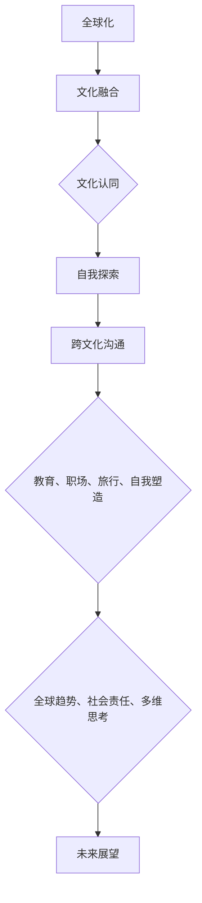

                 

# 跨文化身份探索之旅：全球化背景下的自我定位

> 关键词：跨文化身份、全球化、文化认同、沟通技巧、自我探索、教育影响、职场适应

> 摘要：本文以全球化为背景，探讨了在多元文化交汇的环境中，个体如何进行跨文化身份的探索和自我定位。通过分析全球化对文化融合的影响、文化认同的重要性以及自我探索的方法，文章深入探讨了跨文化沟通技巧、跨文化教育、职场适应和跨文化旅行的意义。同时，文章还展望了跨文化身份的未来发展趋势，并强调了跨文化身份与社会责任的关系。本文旨在为读者提供跨文化身份探索的路径和方法，帮助个体在全球化背景下找到自我定位。

## 目录大纲

1. **第一部分：全球化与跨文化身份**
    1. **第1章：全球化时代的文化融合**
        1.1 **全球化的定义与影响**
        1.2 **跨文化身份的挑战与机遇**
    2. **第2章：文化认同与自我探索**
        2.1 **文化认同的重要性**
        2.2 **自我探索的路径与方法**
    3. **第3章：跨文化沟通技巧**
        3.1 **跨文化沟通的基本原则**
        3.2 **不同文化背景下的沟通策略**

2. **第二部分：跨文化身份的构建与实践**
    4. **第4章：跨文化教育的影响**
        4.1 **跨文化教育的目标与方式**
        4.2 **跨文化教育的实践案例**
    5. **第5章：跨文化职场中的自我定位**
        5.1 **跨文化职场的特点与挑战**
        5.2 **职场中的跨文化适应策略**
    6. **第6章：跨文化旅行的体验与反思**
        6.1 **跨文化旅行的准备与规划**
        6.2 **跨文化旅行的体验与收获**
    7. **第7章：跨文化身份的自我塑造**
        7.1 **跨文化身份的自我认知**
        7.2 **跨文化身份的持续发展与适应**

3. **第三部分：跨文化身份的未来展望**
    8. **第8章：跨文化身份的全球趋势**
        8.1 **全球化背景下的身份变迁**
        8.2 **跨文化身份的未来发展**
    9. **第9章：跨文化身份与社会责任**
        9.1 **跨文化身份与社会互动**
        9.2 **跨文化身份与社会责任**
    10. **第10章：跨文化身份的多维思考**
        10.1 **跨文化身份的哲学探讨**
        10.2 **跨文化身份的未来展望与思考**

4. **附录**
    11. **附录 A：跨文化研究资源与工具**
        11.1 **跨文化研究的重要期刊与书籍**
        11.2 **跨文化研究的在线资源和工具**

## Mermaid 流程图

## 第一部分：全球化与跨文化身份

### 第1章：全球化时代的文化融合

#### 1.1 全球化的定义与影响

全球化是一个复杂而多维度的过程，它不仅涉及经济、政治和技术的领域，也深刻地影响着文化。全球化可以定义为国际社会在经济、政治、文化等方面的相互依赖和互动的加深。在全球化的背景下，不同国家和地区的文化得以更广泛地交流和融合，这既带来了机遇，也带来了挑战。

全球化的影响首先体现在经济领域。跨国公司的兴起和国际贸易的增长，使得不同国家的经济活动更加紧密地联系在一起。这种经济上的融合，不仅促进了商品和服务的流通，也推动了文化和技术的传播。

其次，全球化在政治领域也产生了深远的影响。国际组织和多边协议的增多，使得国家间的政治互动更加频繁和复杂。这种政治上的融合，为跨文化的交流和理解提供了更多的平台和机会。

然而，全球化的最大影响或许在于文化领域。随着人员、信息、商品和服务的跨国流动，不同文化之间的接触和交流变得愈加频繁。这种文化的融合，不仅丰富了人类社会的多样性，也带来了文化认同的挑战。

在全球化时代，文化的融合表现为以下几个方面：

1. **文化交流的增加**：全球化使得人们更容易接触到不同的文化。互联网和社交媒体的普及，使得文化信息的传播更加迅速和广泛。
2. **文化同化**：在全球化过程中，一些强势文化可能对其他文化产生影响，导致文化的同化。这种现象既可能带来文化的消失，也可能促进文化的创新和融合。
3. **文化冲突**：不同文化之间的差异可能导致文化冲突。这种冲突可能表现为文化价值观、行为规范和生活方式的冲突。

总之，全球化时代的文化融合是一个复杂的过程，它既有积极的一面，也有消极的一面。理解这一过程，有助于我们更好地应对全球化带来的挑战，促进跨文化身份的探索和自我定位。

#### 1.2 跨文化身份的挑战与机遇

在全球化时代，跨文化身份的探索成为个体和社会面临的重要课题。跨文化身份指的是个体在不同文化背景下所形成的认同感和归属感。在全球化的背景下，个体的跨文化身份面临着一系列挑战和机遇。

首先，跨文化身份的挑战主要表现在以下几个方面：

1. **文化认同的模糊**：在全球化的浪潮中，个体可能感到文化认同的模糊。一方面，个体可能难以完全融入主流文化；另一方面，个体也可能难以完全抛弃自己的文化传统。这种文化认同的模糊，可能导致个体的焦虑和不安。
   
2. **文化冲突**：不同文化之间可能存在深刻的差异，这种差异可能导致文化冲突。文化冲突不仅体现在价值观和行为规范上，也可能在职场、教育和社会互动中表现出来。个体需要学会如何在冲突中寻求平衡和妥协。

3. **语言障碍**：跨文化身份的个体可能面临语言障碍。语言不仅是沟通的工具，也是文化的一部分。语言的不熟悉可能导致沟通的障碍，影响个体在社会中的融入和表现。

然而，全球化也为跨文化身份的探索带来了机遇：

1. **文化多样性**：全球化使得个体有机会接触到不同的文化，从而丰富自己的文化视野和认知。这种文化多样性不仅有助于个体的成长和发展，也有助于培养全球视野和跨文化沟通能力。

2. **职业发展**：在全球化的背景下，跨文化身份的个体拥有更多的职业发展机会。他们可以在跨国公司、国际组织和多文化环境中工作，发挥自己的优势，实现个人价值和职业发展。

3. **社会互动**：跨文化身份的个体可以成为不同文化之间的桥梁，促进文化交流和理解。他们不仅可以在个人层面实现跨文化的互动，也可以在社会层面推动文化的融合和共生。

总之，在全球化时代，跨文化身份的挑战与机遇并存。个体需要通过不断的自我探索和学习，找到自己的文化定位，把握机遇，应对挑战。这不仅有助于个体的成长和发展，也有助于推动社会的多元和谐。

### 第2章：文化认同与自我探索

#### 2.1 文化认同的重要性

文化认同是个体在心理和社会层面上对自己所属文化的认同感和归属感。文化认同不仅仅是对某种文化的认知，更是个体内心深处的一种情感和态度。在全球化的背景下，文化认同的重要性愈发凸显。

首先，文化认同对于个体的心理健康至关重要。拥有强烈文化认同的个体通常具有更高的自尊心和自我价值感。他们能够更好地应对文化冲击和压力，保持心理健康。相反，文化认同不清晰的个体可能会感到迷茫和焦虑，甚至产生文化冲击和身份认同障碍。

其次，文化认同对于个体的社会互动和社会融合具有重要意义。文化认同使得个体能够更好地融入自己的文化社群，建立社会联系和身份认同。在多元文化的社会中，文化认同有助于个体在尊重和接纳他人文化的同时，保持自己的文化特色和个性。

此外，文化认同还对个体的职业发展产生深远影响。在全球化的职场中，跨文化能力和文化认同是职业成功的关键因素之一。拥有强烈文化认同的个体能够更好地理解和适应不同文化背景的同事和客户，提升工作效率和职业形象。

那么，如何培养和增强文化认同感呢？以下是一些建议：

1. **深入了解自己的文化背景**：通过学习历史、文学、艺术等文化知识，加深对自己文化的理解和认同。
2. **积极参与文化活动**：参与各种文化活动和社群，增强对文化的感受和认同。
3. **培养跨文化沟通能力**：学习不同文化背景下的沟通技巧，提升跨文化沟通能力，促进文化认同的增强。

#### 2.2 自我探索的路径与方法

自我探索是文化认同的重要基础。在全球化背景下，个体需要通过自我探索找到自己的文化定位，从而更好地应对跨文化的挑战和机遇。

首先，个体可以通过反思来探索自己的文化认同。反思是对自我认知的一种深刻思考，通过反思，个体可以更清晰地了解自己的价值观、信仰和行为习惯。以下是一些反思的方法：

1. **日记记录**：通过写日记记录自己的想法、感受和经历，深入挖掘自己的内心世界。
2. **内心对话**：通过与自己进行内心对话，思考自己的文化认同和价值观。
3. **心理测试**：通过心理测试了解自己的性格特点、文化倾向和价值观。

其次，个体可以通过学习来拓宽自己的文化视野。学习不仅包括学术知识，还包括对不同文化的了解和体验。以下是一些学习的方法：

1. **跨文化交流**：积极参与跨文化交流活动，了解不同文化的特点和价值观。
2. **读书**：阅读不同文化的经典著作，了解不同文化的思想、艺术和哲学。
3. **旅行**：通过旅行亲身体验不同文化，拓宽自己的文化视野。

此外，个体还可以通过实践活动来增强文化认同。实践活动不仅包括文化体验，还包括文化创新和传播。以下是一些实践活动的建议：

1. **参与文化项目**：参与各种文化项目，如文化节、艺术展览、文化交流活动等。
2. **文化创作**：通过创作文化作品，如音乐、绘画、文学作品等，表达自己的文化认同。
3. **文化传播**：通过社交媒体、博客、演讲等方式，传播自己的文化认同和价值观念。

总之，自我探索是文化认同的重要路径。通过反思、学习和实践活动，个体可以更好地认识自己，增强文化认同，找到自己的文化定位。

### 第3章：跨文化沟通技巧

#### 3.1 跨文化沟通的基本原则

跨文化沟通是在不同文化背景下进行的交流，它要求沟通者不仅要有良好的语言能力，还需要理解和尊重不同文化的差异。成功的跨文化沟通可以促进合作和理解，而失败的跨文化沟通则可能导致误解和冲突。以下是一些跨文化沟通的基本原则：

1. **尊重差异**：尊重不同文化的差异是跨文化沟通的基础。每个文化都有其独特的价值观、行为规范和沟通方式。了解并尊重这些差异，有助于建立信任和合作关系。

2. **倾听与理解**：跨文化沟通要求沟通者具备良好的倾听和理解能力。通过倾听，可以更好地了解对方的文化背景和观点；通过理解，可以减少误解和偏见。

3. **明确表达**：在跨文化沟通中，清晰明确的表达至关重要。避免使用含糊不清的词语和表达方式，确保信息被正确理解和解读。

4. **避免文化刻板印象**：文化刻板印象是跨文化沟通中的一大障碍。沟通者应避免对特定文化群体进行概括性评价，而是基于个体的实际情况进行交流和互动。

5. **灵活适应**：跨文化沟通要求沟通者具备灵活适应的能力。根据不同文化背景的沟通习惯和方式，灵活调整自己的沟通策略，以实现有效的交流。

6. **建立共同语言**：在跨文化沟通中，寻找双方都能理解和接受的共同语言或术语，有助于减少沟通障碍。

#### 3.2 不同文化背景下的沟通策略

不同文化背景下的沟通策略因文化差异而异。以下是一些常见文化背景下的沟通策略：

1. **高语境文化**：高语境文化强调非言语沟通和信息隐藏，如日本、中国和阿拉伯文化。在这些文化中，沟通者往往更注重关系和上下文，而直接表达较少。因此，跨文化沟通时，应注重建立和维护良好的关系，以及通过身体语言、面部表情和语调来传达信息。

2. **低语境文化**：低语境文化强调直接、明确的沟通，如美国、德国和英国文化。在这些文化中，沟通者倾向于使用清晰、直接的语言来表达观点和意见。因此，跨文化沟通时，应尽量使用简洁、明了的语言，避免使用过多的隐喻和暗示。

3. **集体主义文化**：集体主义文化强调集体利益和关系，如中国和日本文化。在这些文化中，沟通者往往更注重团队合作和集体决策。因此，跨文化沟通时，应强调团队合作和共识，以及通过集体讨论来解决问题。

4. **个人主义文化**：个人主义文化强调个人权利和独立，如美国和澳大利亚文化。在这些文化中，沟通者往往更注重个人表现和自我实现。因此，跨文化沟通时，应尊重个人观点和决策，以及通过个人努力来达成目标。

总之，不同文化背景下的沟通策略因文化差异而异。跨文化沟通者需要根据不同文化的特点，灵活调整沟通策略，以实现有效的交流和合作。

## 第二部分：跨文化身份的构建与实践

### 第4章：跨文化教育的影响

#### 4.1 跨文化教育的目标与方式

跨文化教育是一种旨在培养学生跨文化意识和能力的教育模式。它的目标不仅在于传授知识，更在于培养学生的全球视野和跨文化沟通能力。在全球化的背景下，跨文化教育显得尤为重要。

跨文化教育的目标主要包括：

1. **提高跨文化意识**：通过教育，帮助学生认识到不同文化的差异和多样性，培养尊重和理解不同文化的态度。
2. **培养跨文化沟通能力**：通过语言、交流技巧和文化知识的传授，提升学生跨文化沟通的能力，使他们能够在多元文化环境中有效地交流和合作。
3. **促进全球视野**：通过了解不同国家和地区的文化、经济、社会等方面的知识，培养学生具备全球视野，能够适应和应对全球化带来的挑战和机遇。
4. **培养国际竞争力**：在全球化的职场中，跨文化能力是国际竞争力的重要组成部分。跨文化教育有助于学生提升自己的职业竞争力。

跨文化教育的方式多种多样，以下是一些常见的方法：

1. **课程设置**：在课程设置中融入跨文化内容，如开设国际关系、比较文化、多元文化研究等课程，帮助学生系统地了解不同文化。
2. **跨文化交流**：通过组织学生参与国际交流项目，如交换生、夏令营、文化节等，使学生有机会亲身体验不同文化，提高跨文化沟通能力。
3. **文化体验**：通过参观博物馆、艺术展览、民俗活动等，让学生直观地了解不同文化的特点和魅力。
4. **跨文化课程设计**：在课程设计上，注重培养学生的跨文化思维和解决问题的能力，如通过案例分析、小组讨论、角色扮演等方式，让学生在实际情境中应用跨文化知识。

#### 4.2 跨文化教育的实践案例

跨文化教育的实践案例丰富多样，以下是一些具有代表性的案例：

1. **哈佛大学的跨文化课程**：哈佛大学开设了《多元文化美国》课程，通过讨论和分析美国社会中的多元文化问题，培养学生的跨文化意识和批判性思维能力。
2. **英国的跨文化教育**：英国的学校通过组织多元文化活动，如国际文化节、多元文化论坛等，促进学生对不同文化的了解和尊重。
3. **国际学校的跨文化课程**：国际学校通常设置多样化的课程，涵盖不同国家和地区的文化、历史和社会问题，帮助学生建立全球视野。
4. **交换生项目**：许多学校通过交换生项目，让学生有机会在其他国家学习和生活，亲身体验不同文化，提高跨文化适应能力。

总之，跨文化教育对于培养学生的跨文化意识和能力具有重要意义。通过多种教育方式和实践案例，学生可以在全球化背景下找到自己的文化定位，提升自身的国际竞争力。

### 第5章：跨文化职场中的自我定位

#### 5.1 跨文化职场的特点与挑战

跨文化职场是一个多元文化交织的环境，这种环境既带来了机遇，也带来了挑战。跨文化职场的特点主要包括：

1. **多元文化背景**：跨文化职场中的员工可能来自不同的国家和地区，拥有不同的文化背景和价值观。这种多元文化的背景使得职场环境更加丰富和多样。
2. **文化差异**：不同文化在价值观、行为规范、沟通方式等方面可能存在差异。这种文化差异可能导致误解和冲突，影响团队合作和工作效率。
3. **跨文化沟通**：在跨文化职场中，有效的沟通是关键。跨文化沟通不仅要求语言上的准确表达，还需要理解和尊重不同文化的沟通习惯和方式。
4. **跨文化管理**：跨文化职场要求管理者具备跨文化管理能力，能够理解和应对不同文化背景下的员工需求和问题。

跨文化职场面临的挑战主要包括：

1. **文化冲突**：文化冲突是跨文化职场中最常见的挑战之一。文化冲突可能表现为价值观、行为规范和工作方式的冲突，影响团队和谐和工作效率。
2. **跨文化适应**：跨文化职场要求员工具备良好的跨文化适应能力，能够适应和融入不同文化背景的职场环境。
3. **沟通障碍**：跨文化沟通中的语言障碍和文化差异可能导致沟通效率低下，影响团队合作和工作协调。
4. **文化认同模糊**：在跨文化职场中，员工可能感到文化认同的模糊，难以在多元文化环境中找到自己的位置。

#### 5.2 职场中的跨文化适应策略

为了在跨文化职场中找到自己的位置，员工需要采取一系列适应策略。以下是一些跨文化适应策略：

1. **了解文化差异**：员工需要深入了解不同文化的价值观、行为规范和沟通方式，以减少文化冲突和误解。可以通过阅读相关书籍、参加跨文化培训等方式提高自己的文化素养。

2. **提高跨文化沟通能力**：有效的跨文化沟通是跨文化职场中不可或缺的能力。员工可以通过学习跨文化沟通技巧，如倾听、表达尊重和理解差异等，提高沟通效果。

3. **建立文化联系**：员工可以通过建立和维护与不同文化背景的同事之间的联系，增进相互了解和信任，促进团队合作。

4. **适应职场文化**：员工需要根据不同职场文化的特点，调整自己的工作方式和行为规范，以适应职场环境。

5. **寻求支持与帮助**：在跨文化职场中，员工可能会遇到各种挑战和困惑。寻求支持与帮助，如向同事、导师或人力资源部门咨询，有助于解决问题和适应职场。

6. **持续学习和成长**：跨文化适应是一个持续的过程。员工需要保持学习的态度，不断更新自己的知识和技能，以应对职场中的变化和挑战。

总之，在跨文化职场中，员工需要通过了解文化差异、提高跨文化沟通能力、建立文化联系、适应职场文化、寻求支持与帮助和持续学习和成长，找到自己的位置，实现职业发展。

### 第6章：跨文化旅行的体验与反思

#### 6.1 跨文化旅行的准备与规划

跨文化旅行是探索不同文化、拓宽视野和提升跨文化能力的重要途径。为了确保旅行的顺利进行和最大程度地体验文化，提前的准备和规划至关重要。

首先，旅行者需要做好以下准备：

1. **了解目的地文化**：在旅行前，了解目的地的历史、文化、风俗习惯和法律法规，有助于避免文化冲突和误解。可以通过查阅旅游指南、观看纪录片、参加文化讲座等方式获取信息。
2. **学习当地语言**：尽管英语在许多国家是通用语言，但学习当地语言或常用短语可以更好地融入当地文化，提高沟通效果。可以使用语言学习应用、参加语言课程或请当地语言老师辅导。
3. **准备旅行必需品**：根据目的地的气候、地理和文化特点，准备合适的服装、鞋子、药品、电子产品等旅行必需品，确保旅行的舒适和安全。
4. **制定旅行计划**：制定详细的旅行计划，包括交通、住宿、餐饮、景点参观等，有助于合理安排时间，充分利用旅行机会。

其次，旅行者需要规划以下内容：

1. **文化体验**：根据兴趣和文化背景，选择合适的文化体验活动，如参观博物馆、艺术展览、传统节日庆祝、民俗活动等，深入感受当地文化的魅力。
2. **交流互动**：与当地居民、游客、导游等进行交流和互动，了解他们的生活方式、价值观和观点，增加对文化的理解。
3. **记录与分享**：使用日记、照片、视频等记录旅行中的所见所闻，分享旅行经历和感受，与他人交流旅行心得，促进文化的传播和交流。
4. **反思与成长**：旅行结束后，对旅行经历进行反思和总结，思考自己在跨文化环境中的表现和收获，提出改进和成长的方向。

总之，通过充分的准备和规划，旅行者可以更好地享受跨文化旅行的乐趣，提升自己的跨文化能力和视野。

#### 6.2 跨文化旅行的体验与收获

跨文化旅行不仅是一种探索未知世界的冒险，更是一次深刻的文化体验和自我成长的过程。以下是一些跨文化旅行的体验和收获：

1. **文化震撼**：在陌生的文化环境中，旅行者可能会感受到文化的震撼。这种震撼可能来自于对传统建筑、艺术形式、宗教仪式等视觉冲击，也可能来自于对当地居民生活方式、价值观念的深入了解。例如，参观日本京都的寺庙和花园，让旅行者感受到宁静与和谐的美；在埃及金字塔前，旅行者可能会对古文明的神秘与伟大感到敬畏。

2. **语言交流**：在跨文化旅行中，语言交流是一种重要的体验。旅行者通过学习当地语言或使用有限的英语，与当地人进行交流，不仅提高了语言能力，还加深了对文化的理解。例如，在西班牙巴塞罗那，旅行者通过与当地人交流，了解到加泰罗尼亚语的历史和文化，以及对巴塞罗那足球俱乐部的热爱。

3. **文化融合**：跨文化旅行中的体验不仅仅是单向的文化接受，更是文化融合的过程。旅行者可以在不同的文化环境中，尝试融入当地的生活方式，体验不同文化的独特魅力。例如，在印度尼西亚巴厘岛，旅行者可以参加当地的传统舞蹈表演，学习制作当地美食，感受巴厘岛独特的宗教和文化。

4. **自我成长**：跨文化旅行有助于个体的自我成长和自我认知。在陌生的环境中，旅行者需要独立解决问题，适应不同的生活方式和文化习惯，这有助于提升自信心和独立性。例如，在非洲撒哈拉沙漠旅行，旅行者需要面对极端的天气和艰苦的生活条件，这种经历不仅锻炼了意志，也让他们更加珍惜生活。

5. **反思与学习**：跨文化旅行结束后，旅行者往往会对自己的经历进行反思和总结。他们可能会思考自己在跨文化环境中的表现，分析自己的优点和不足，并提出改进和成长的方向。例如，旅行者在旅行中发现自己在跨文化沟通中存在语言障碍，可能会决定回到家乡后继续学习语言，提升跨文化沟通能力。

总之，跨文化旅行是一次充满挑战和收获的经历。通过这样的旅行，旅行者不仅拓宽了视野，丰富了文化知识，也促进了自我成长和认知。跨文化旅行的体验和收获，将成为他们人生中宝贵的财富。

### 第7章：跨文化身份的自我塑造

#### 7.1 跨文化身份的自我认知

跨文化身份的自我认知是理解自我在多元文化环境中的位置和角色的重要过程。自我认知不仅仅是自我反思的过程，更是对自我在文化交汇中的位置、价值观和认同感的深刻理解。以下是一些关于跨文化身份自我认知的方法：

1. **反思与自我分析**：通过深入反思自己的经历、感受和行为，了解自己是如何在不同文化背景下做出决策和反应的。这种方法有助于揭示自我认知中的文化影响和潜意识。

2. **日记与记录**：通过写日记或记录旅行、学习、工作的经历，系统地回顾和总结自己的跨文化体验。这种方法不仅有助于记忆的保持，还能通过记录的回顾促进自我认知的提升。

3. **文化交流与互动**：积极参与不同文化的交流活动，如文化讲座、座谈会、社区活动等。通过与不同文化背景的人交流，了解他们的生活、价值观和信仰，从而更全面地认识自己。

4. **心理测试与评估**：通过心理测试和评估工具，了解自己在文化适应、文化认同和跨文化沟通等方面的优势和不足。这些工具可以提供客观数据，帮助自我认知更加精准。

5. **导师指导**：寻求有经验的导师或专家的指导，他们可以提供跨文化身份方面的专业知识和经验，帮助自己更好地理解自己的跨文化身份。

#### 7.2 跨文化身份的持续发展与适应

跨文化身份的持续发展与适应是一个动态的过程，需要个体在不同的生活和工作阶段持续学习和调整。以下是一些关于持续发展和适应的建议：

1. **终身学习**：在全球化背景下，知识更新迅速，个体需要不断学习新知识和技能，以适应不断变化的文化环境。可以通过在线课程、专业培训、读书等方式进行持续学习。

2. **职业规划**：根据个人的跨文化能力和职业目标，制定长期的职业规划。选择能够提供跨文化工作机会和挑战的职业路径，有助于个人的跨文化发展和职业成长。

3. **文化交流**：积极参与国际交流和合作项目，如交换生项目、跨国工作、海外志愿者活动等。这些经历不仅可以提升跨文化技能，还能扩大人脉网络，增加跨文化经验。

4. **心理调适**：面对文化冲击和适应挑战时，保持积极的心态和心理调适能力至关重要。可以通过心理咨询、放松训练、社会支持等方式，提升心理韧性。

5. **持续反思**：定期对自己的跨文化身份进行反思和评估，识别新的挑战和机遇，调整自己的策略和行动。这种持续的反思有助于自我认知的提升和跨文化适应能力的增强。

总之，跨文化身份的自我认知和持续发展与适应是一个复杂但值得追求的过程。通过反思、学习、交流和调整，个体可以在多元文化的环境中找到自己的定位，实现个人价值和职业发展。

## 第三部分：跨文化身份的未来展望

### 第8章：跨文化身份的全球趋势

#### 8.1 全球化背景下的身份变迁

随着全球化进程的加速，跨文化身份正在经历深刻的变迁。全球化不仅改变了经济和政治结构，也深刻影响了文化和社会领域。在这个背景下，个体和文化认同面临着前所未有的挑战和机遇。

首先，全球化导致了全球文化流动的加剧。人们更容易跨越地理和文化界限，进行迁徙、交流和合作。这种流动不仅促进了文化的传播和融合，也使得个体在更广阔的背景下定义自己的文化身份。例如，全球化背景下，越来越多的人选择在海外工作、学习或居住，他们在保持自身文化特征的同时，也吸收和融合了其他文化的元素。

其次，全球化背景下的身份变迁还体现在文化认同的多样性上。在多元文化的交汇中，个体不再仅仅局限于单一文化的认同，而是可能同时拥有多重文化认同。这种现象被称为“多元文化认同”或“混合文化认同”。例如，一些移民后代可能会同时认同自己的祖籍文化、所在国的文化以及他们所处社区的多元文化。

此外，全球化还促进了文化创新和跨文化合作。在全球化的过程中，不同文化之间的交流与互动不仅促进了文化的传承和保存，也产生了新的文化形式和创意。例如，国际音乐、电影和艺术作品越来越受到全球观众的欢迎，这些作品往往融合了不同文化的元素，展现了跨文化的魅力。

#### 8.2 跨文化身份的未来发展

未来，跨文化身份的发展将继续受到全球化、科技进步和社会变迁的影响。以下是一些可能的趋势：

1. **文化融合与多元文化认同的加深**：随着全球文化交流的加深，不同文化之间的融合将变得更加普遍。个体可能在保持自身文化传统的同时，接受和融合其他文化的元素，形成更加多元和包容的文化认同。

2. **数字身份与虚拟社区**：随着数字技术的发展，人们的跨文化身份也将越来越多地体现在虚拟空间中。在线社区、社交媒体和国际网络平台将成为个体构建和展示跨文化身份的重要场所。

3. **文化自觉与自我表达**：随着全球文化意识的提高，个体将更加关注和表达自己的文化认同。文化自觉将成为个体在社会中立足的重要基础，通过文化自觉，个体可以更好地理解自己的文化身份，并在多元文化环境中找到自己的位置。

4. **跨文化教育与培训**：跨文化教育和培训将继续发展，成为培养未来全球公民的重要途径。通过系统的教育和培训，个体将能够更好地适应和应对全球化的挑战，提升跨文化能力和竞争力。

总之，全球化背景下的身份变迁和跨文化身份的未来发展充满机遇和挑战。个体需要在不断变化的文化环境中，保持开放的心态，积极学习新知识，提升跨文化能力，以适应未来的发展。

### 第9章：跨文化身份与社会责任

#### 9.1 跨文化身份与社会互动

跨文化身份不仅是个体的内在认同，也是与社会互动的重要组成部分。在全球化背景下，跨文化身份在社会互动中的作用日益凸显。以下是一些关键点：

1. **促进文化交流**：跨文化身份使得个体能够成为不同文化之间的桥梁，促进文化交流和理解。通过分享自己的文化经验和视角，跨文化个体可以帮助他人更好地理解其他文化，减少文化偏见和误解。

2. **增强社会包容性**：跨文化身份的个体在社会互动中，能够推动社会更加包容和多元。他们通过自身的经历和观点，倡导对不同文化的尊重和接纳，促进社会的和谐与稳定。

3. **提升跨文化合作能力**：在多元文化的社会中，跨文化身份的个体能够更好地与不同文化背景的人合作，发挥各自的优势，实现共同的目标。这种跨文化合作能力是现代社会不可或缺的素质。

4. **文化适应与创新**：跨文化身份的个体在社会互动中，需要不断适应和融合不同的文化元素。这种文化适应能力不仅有助于个体的成长，也能激发文化创新，推动社会的进步和发展。

#### 9.2 跨文化身份与社会责任

跨文化身份与社会责任密不可分。作为全球公民，跨文化个体有责任承担起推动社会和谐与进步的使命。以下是一些关于跨文化身份与社会责任的思考：

1. **推动文化平等**：跨文化个体应致力于推动文化平等，反对任何形式的文化歧视和偏见。通过教育和宣传，提高公众对不同文化的认识和尊重，营造一个公平、包容的社会环境。

2. **促进文化多样性**：跨文化个体应积极促进文化多样性，鼓励不同文化的交流和融合。他们可以通过参与文化活动、支持多元文化项目等方式，为文化的多样性和繁荣贡献力量。

3. **参与社会服务**：跨文化个体可以通过参与社会服务，如志愿服务、社区建设等，为社会的和谐与进步做出贡献。他们可以利用自己的跨文化知识和经验，帮助不同文化背景的人更好地融入社会。

4. **倡导和平与理解**：跨文化个体应倡导和平与理解，反对文化冲突和冲突。他们可以通过交流和对话，促进不同文化之间的理解和尊重，为和平共处贡献力量。

总之，跨文化身份与社会责任相互关联、相互促进。作为全球公民，跨文化个体有责任在全球化背景下，推动社会和谐与进步，为构建一个多元、包容和繁荣的世界贡献力量。

### 第10章：跨文化身份的多维思考

#### 10.1 跨文化身份的哲学探讨

跨文化身份的哲学探讨涉及人类存在的根本问题，如身份认同、自我认知和文化理解。以下是一些哲学思考的要点：

1. **身份认同的多元性**：哲学家认为，身份认同并非固定不变，而是多元且动态的。个体在不同的文化背景下，可能会形成不同的身份认同，这反映了人类在复杂社会中的多样性和灵活性。

2. **主体性与客体性的辩证关系**：在哲学上，主体性指的是个体对自己的认识和表达，而客体性指的是个体对他人的认识和评价。跨文化身份的哲学探讨强调主体性与客体性的辩证关系，认为个体应在尊重他人文化的同时，保持自我认知的独立性。

3. **文化相对论**：文化相对论认为，每种文化都有其独特的价值和意义，没有绝对的好与坏。跨文化身份的哲学探讨强调文化相对论的重要性，主张通过理解和尊重不同文化，实现全球文化的和谐共生。

4. **存在主义视角**：存在主义视角认为，个体在面对文化冲突和不确定性时，需要主动寻求自我定位和意义。跨文化身份的存在主义探讨强调个体的自主性和责任感，鼓励个体在多元文化环境中寻找自我价值和意义。

#### 10.2 跨文化身份的未来展望与思考

跨文化身份的未来展望与思考涉及多个层面，包括技术进步、社会变迁和个体发展。以下是一些未来展望和思考：

1. **科技进步的影响**：随着科技的发展，特别是人工智能和虚拟现实的兴起，跨文化身份的构建和表达方式将发生重大变化。例如，虚拟现实技术可以让个体在虚拟环境中体验不同文化，拓宽跨文化视野。

2. **全球化的深化**：全球化进程的深化将带来更多的跨文化交流和互动，促进跨文化身份的多元化和融合。个体将在全球化的背景下，面临更多的文化挑战和机遇，需要不断提升跨文化适应能力。

3. **文化多样性的保护**：在未来，保护文化多样性和防止文化同质化将成为重要的议题。跨文化身份的构建需要平衡全球化和文化多样性的关系，促进不同文化之间的相互尊重和合作。

4. **个体发展的挑战**：在跨文化环境中，个体发展将面临更多的挑战，如文化冲击、身份认同模糊等。个体需要在跨文化身份的构建中，找到自我定位和意义，实现个人成长和自我价值。

总之，跨文化身份的哲学探讨和未来展望提供了深入思考和全面理解跨文化身份的视角。通过哲学思考和未来展望，个体可以更好地认识自我，应对跨文化挑战，实现跨文化身份的构建和发展。

## 附录

### 附录 A：跨文化研究资源与工具

#### A.1 跨文化研究的重要期刊与书籍

1. **《跨文化心理学杂志》（Journal of Cross-Cultural Psychology）**：这是一本国际性的学术期刊，主要发表关于跨文化心理学的研究论文，涵盖文化认同、跨文化沟通、文化适应等多个领域。

2. **《文化多样性杂志》（Journal of Intercultural Education）**：这本期刊关注教育领域的跨文化问题，探讨如何在不同文化背景下进行有效的教育和文化交流。

3. **《跨文化管理杂志》（Journal of Cross-Cultural Management）**：专注于跨文化管理实践和理论的研究，涵盖跨国公司管理、跨文化团队协作等主题。

#### A.2 跨文化研究的在线资源和工具

1. **Cultural Survival：** 这是一个非营利组织，致力于支持世界各地的土著文化，提供关于土著文化和人权的丰富资源。

2. **Culture Crossing：** 一个在线指南，提供关于世界各地文化的详细介绍，包括习俗、礼仪、工作习惯等。

3. **Intercultural Dialogue：** 一个专注于跨文化对话和互动的在线平台，提供关于跨文化交流的研究论文、案例分析和工作坊信息。

4. **Global Language Monitor：** 一个监测全球语言和文化的网站，提供关于全球语言趋势和文化影响力的分析报告。

通过这些期刊、书籍和在线资源，研究人员和跨文化实践者可以获取丰富的信息和工具，以支持他们的研究和实践工作。

