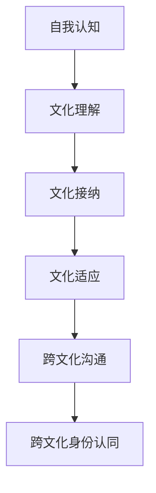

                 

### 跨文化身份认同：全球化背景下的自我定位

**关键词：** 跨文化身份认同、全球化、自我定位、文化碰撞、文化融合

**摘要：** 在全球化日益深化的今天，跨文化身份认同成为一个重要议题。本文探讨了全球化背景下跨文化身份认同的概念、重要性、理论基础以及个体在跨文化环境中的自我定位和身份构建。通过分析文化碰撞与融合、文化敏感性、跨文化沟通、教育与实践等多方面因素，文章旨在为读者提供一个全面、深入的理解框架，以应对全球化带来的挑战和机遇。

---

# 第一部分：跨文化身份认同概述

## 第1章：全球化与跨文化身份认同

### 1.1 全球化的背景与影响

全球化是一个复杂而多维的过程，涵盖了经济、政治、文化等多个领域。其背景主要源于以下几个因素：

1. **科技进步与通讯便捷：** 互联网和移动通信技术的发展极大地缩短了地理距离，使得全球信息流通更加迅速。
2. **经济一体化：** 全球贸易的自由化和跨国公司的兴起，促进了资本、技术和劳动力的流动。
3. **政治影响力：** 全球化和国际组织的兴起，如联合国和世界贸易组织，推动了国际政治关系的发展。

这些因素共同作用，使得全球范围内的文化交流日益频繁，跨文化身份认同问题逐渐凸显。

### 1.2 跨文化身份认同的概念

跨文化身份认同（Intercultural Identity）是指个体在面对不同文化背景时，如何定位和定义自己的身份。它不仅涉及对自身文化的认知，还包括对其他文化的理解和接纳。

- **自我定义：** 个体在多元文化环境中如何定义自我。
- **文化识别：** 个体如何识别和辨别不同的文化特征。
- **文化接纳：** 个体如何接受和融合不同的文化元素。

### 1.3 跨文化身份认同的重要性

跨文化身份认同的重要性体现在以下几个方面：

1. **个人成长与发展：** 跨文化身份认同有助于个体更好地理解自我，提升心理韧性，促进个人成长。
2. **社会融合：** 跨文化身份认同有助于不同文化背景的人之间建立共同理解，促进社会和谐。
3. **全球化适应：** 在全球化背景下，跨文化身份认同能力成为个体在多元文化环境中生存和发展的关键。

## 第2章：核心概念与联系

### 2.1 跨文化身份认同的要素

跨文化身份认同的要素包括：

- **文化背景：** 个体成长的文化环境，包括家庭、社区和国家文化。
- **价值观：** 个体所秉持的信仰、道德和人生哲学。
- **语言：** 语言不仅是沟通工具，也是文化认同的载体。
- **身份定位：** 个体在多元文化环境中的定位和角色。

### 2.2 跨文化身份认同与个体发展

跨文化身份认同对个体发展的影响主要表现在：

1. **认知发展：** 跨文化身份认同促进了个体对多元文化的认知和理解。
2. **情感发展：** 跨文化身份认同有助于个体建立积极的文化情感，增强心理韧性。
3. **社交发展：** 跨文化身份认同有助于个体建立多元化的社交网络。

### 2.3 跨文化身份认同与社会互动

跨文化身份认同在社会互动中的作用包括：

1. **沟通：** 跨文化身份认同有助于个体在不同文化背景下进行有效沟通。
2. **合作：** 跨文化身份认同促进了不同文化背景个体之间的合作与协同。
3. **冲突解决：** 跨文化身份认同有助于个体理解和解决文化冲突。

## 第3章：跨文化身份认同的理论基础

### 3.1 社会学视角

从社会学视角来看，跨文化身份认同涉及到社会结构、社会互动和社会认同等概念。主要理论包括：

1. **社会结构理论：** 强调社会结构和角色对个体身份认同的影响。
2. **社会互动理论：** 关注个体之间的互动如何塑造身份认同。
3. **社会认同理论：** 认为个体通过社会认同来定义自我。

### 3.2 心理学视角

从心理学视角来看，跨文化身份认同涉及到自我认知、情感和动机等概念。主要理论包括：

1. **自我决定理论：** 强调个体在自我实现过程中追求自主性和控制感。
2. **心理防御理论：** 认为个体在面对文化冲突时，会采取心理防御机制来应对。

### 3.3 文化研究视角

从文化研究视角来看，跨文化身份认同涉及到文化多样性、文化传承和文化创新等概念。主要理论包括：

1. **文化多样性理论：** 强调文化多样性的重要性及其对社会发展的贡献。
2. **文化传承与创新理论：** 认为文化在传承中不断创新，促进文化繁荣。

## 第二部分：自我定位与身份构建

### 第4章：全球化背景下的文化碰撞与融合

### 第5章：自我认知与跨文化适应

### 第6章：文化敏感性与跨文化沟通

### 第7章：跨文化身份认同的教育与实践

### 第8章：跨文化身份认同的未来展望

---

# 第二部分：自我定位与身份构建

## 第4章：全球化背景下的文化碰撞与融合

### 4.1 全球化对文化的影响

全球化对文化的影响是深远而广泛的。一方面，全球化促进了不同文化之间的交流和融合，另一方面，也带来了文化冲突和分裂。以下从几个方面分析全球化对文化的影响：

#### 1. 文化交流

全球化使得不同文化之间得以更频繁、更深入地交流。通过互联网、媒体、旅游等途径，人们能够接触到各种不同的文化，从而增进了对其他文化的理解和接纳。

#### 2. 文化融合

全球化促进了文化的融合。不同文化在相互影响、相互借鉴的过程中，形成了新的文化形态。例如，跨国餐饮、音乐、电影等文化产品的流行，就是文化融合的体现。

#### 3. 文化冲突

然而，全球化也带来了文化冲突。由于文化差异，不同文化背景的人在价值观、行为习惯等方面可能存在分歧，甚至引发冲突。例如，宗教信仰、民族身份等问题往往成为文化冲突的焦点。

### 4.2 跨文化融合的挑战与机遇

跨文化融合既带来了挑战，也带来了机遇。

#### 1. 挑战

**文化冲突：** 不同文化之间的价值观、信仰和行为习惯可能存在较大差异，容易引发冲突。

**文化适应：** 个体需要适应新的文化环境，这可能是一个长期而复杂的过程。

**文化认同：** 在跨文化融合中，个体如何定位和定义自己的文化身份是一个挑战。

#### 2. 机遇

**文化创新：** 跨文化融合促进了文化的创新和多样性。

**社会和谐：** 跨文化融合有助于减少文化冲突，促进社会和谐。

**经济繁荣：** 跨文化融合有助于开拓新的市场和业务机会，促进经济繁荣。

### 4.3 跨文化身份认同的多维度

跨文化身份认同是一个多维度的概念，涉及到多个层面：

#### 1. 个人层面

在个人层面，跨文化身份认同涉及到个体如何理解和接纳不同的文化，以及如何在不同文化环境中定位和定义自我。

#### 2. 社会层面

在社会层面，跨文化身份认同涉及到社会如何接纳和尊重不同文化背景的个体，以及如何促进文化多样性的发展。

#### 3. 全球层面

在全球层面，跨文化身份认同涉及到全球范围内的文化交流、融合与分裂，以及如何实现全球文化的和谐与共生。

---

# 第三部分：自我认知与跨文化适应

## 第5章：自我认知与跨文化适应

### 第6章：文化敏感性与跨文化沟通

### 第7章：跨文化身份认同的教育与实践

### 第8章：跨文化身份认同的未来展望

---

## 第5章：自我认知与跨文化适应

### 5.1 自我认知的重要性

自我认知是跨文化适应的基础。只有深入理解自己的文化背景、价值观和行为模式，个体才能在跨文化环境中更好地定位和定义自我。

#### 1. 了解自身文化

个体需要了解自身文化的特点、优点和不足，以便在跨文化环境中更好地适应和调整。

#### 2. 认识自己的价值观

个体的价值观对其行为和决策有着重要影响。在跨文化环境中，个体需要认识到自己的价值观可能与其他文化存在差异，并学会尊重和接纳其他文化的价值观。

#### 3. 反思个人行为

个体需要反思自己的行为，特别是在跨文化环境中的行为。通过反思，个体可以认识到自己的行为可能对他人的文化产生何种影响，从而更好地调整自己的行为。

### 5.2 跨文化适应的障碍与策略

跨文化适应是一个复杂而多维的过程，个体在适应过程中可能会遇到以下障碍：

#### 1. 语言障碍

语言是文化的重要载体。语言障碍可能使个体在跨文化环境中难以有效沟通，从而影响其适应过程。

**策略：** 学习和掌握目标文化的语言，积极参与语言交流，提高语言表达能力。

#### 2. 文化差异

不同文化在价值观、行为习惯等方面可能存在较大差异，这可能导致文化冲突和适应困难。

**策略：** 通过学习和了解目标文化的价值观和行为习惯，提高文化敏感性，减少文化冲突。

#### 3. 社交障碍

在跨文化环境中，个体可能面临社交障碍，如融入新社交圈、建立信任关系等。

**策略：** 积极参与社交活动，主动与他人交流，建立良好的社交网络。

### 5.3 自我定位与身份构建的过程

跨文化适应是一个动态的过程，涉及到自我定位和身份构建。以下是一个典型的自我定位与身份构建过程：

#### 1. 观察和了解

个体在跨文化环境中首先需要观察和了解周围的文化环境，包括价值观、行为规范和社会习俗等。

#### 2. 自我反思

个体需要反思自己的行为和价值观，特别是在跨文化环境中的行为和价值观。通过自我反思，个体可以认识到自己的行为和价值观可能对他人的文化产生何种影响。

#### 3. 调整和适应

个体需要根据观察和了解的结果，调整自己的行为和价值观，以更好地适应跨文化环境。这可能涉及到学习新的行为规范、改变原有的行为模式等。

#### 4. 定位和构建

在调整和适应的基础上，个体需要重新定位和构建自己的身份。这可能涉及到重新定义自己的角色和身份，以更好地适应跨文化环境。

#### 5. 持续发展

跨文化适应是一个持续的过程，个体需要不断地学习和适应。通过持续的学习和适应，个体可以不断提高跨文化适应能力，更好地应对未来的挑战。

---

# 第四部分：跨文化身份认同的教育与实践

## 第8章：跨文化身份认同的未来展望

### 附录：跨文化身份认同相关研究综述

### 跨文化身份认同调查项目

### 最佳实践 Tips

### 小结

### 注意事项

### 拓展阅读

---

## 第6章：文化敏感性与跨文化沟通

### 6.1 文化敏感性的概念

文化敏感性是指个体在跨文化环境中，对其他文化的理解、接纳和适应能力。它包括以下几个方面：

- **文化理解：** 个体能够理解和尊重其他文化的价值观、信仰和行为习惯。
- **文化接纳：** 个体能够接受和融合其他文化元素，形成多元化的文化认同。
- **文化适应：** 个体能够在跨文化环境中灵活调整自己的行为和态度，以适应新的文化环境。

### 6.2 跨文化沟通的原则

有效的跨文化沟通需要遵循以下原则：

- **尊重差异：** 尊重不同文化的差异，避免对其他文化进行歧视或贬低。
- **明确定义：** 在跨文化沟通中，明确表达自己的意图和期望，避免误解和冲突。
- **开放心态：** 保持开放的心态，愿意学习和接受其他文化的优点和特点。
- **适应性：** 根据不同的文化背景和环境，灵活调整自己的沟通方式和策略。

### 6.3 跨文化沟通的实践

跨文化沟通的实践包括以下几个方面：

- **文化培训：** 参加跨文化沟通培训，提高自己的文化敏感性和沟通能力。
- **实际交流：** 在日常生活中，积极参与跨文化交流活动，锻炼自己的跨文化沟通技巧。
- **反馈与反思：** 在跨文化沟通中，及时反馈和反思自己的行为和沟通效果，以不断提高自己的沟通能力。

## 第7章：跨文化身份认同的教育与实践

### 7.1 教育在跨文化身份认同中的作用

教育在跨文化身份认同中起着至关重要的作用。通过教育，个体可以：

- **提高文化敏感性和理解能力：** 教育有助于个体了解不同文化的特点，提高对其他文化的理解和接纳能力。
- **培养跨文化沟通能力：** 教育可以教授个体跨文化沟通的原则和技巧，提高其在跨文化环境中的沟通效果。
- **促进文化认同：** 教育可以帮助个体在多元文化环境中找到自我定位，促进其跨文化身份认同的形成。

### 7.2 跨文化身份认同的实践路径

跨文化身份认同的实践路径包括以下几个方面：

- **跨文化体验：** 通过旅行、交流、实习等方式，亲身体验不同文化，提高跨文化适应能力。
- **跨文化培训：** 参加跨文化培训课程，学习跨文化沟通和管理的知识和技能。
- **跨文化项目：** 参与跨文化项目，实践跨文化身份认同的理论和方法。
- **反思与总结：** 在跨文化实践中，不断反思和总结经验，提高自己的跨文化适应能力和身份认同水平。

### 7.3 社会实践与跨文化身份认同

社会实践是跨文化身份认同的重要实践途径。通过社会实践，个体可以：

- **了解社会文化：** 社会实践有助于个体了解不同社会文化背景，提高文化敏感性和理解能力。
- **参与社会建设：** 社会实践可以促进个体参与社会建设，发挥跨文化身份认同的积极作用。
- **传播文化：** 社会实践可以成为个体传播自身文化的重要途径，促进文化交流与融合。

## 第8章：跨文化身份认同的未来展望

### 8.1 跨文化身份认同的发展趋势

随着全球化的深入推进，跨文化身份认同将继续发展。以下是一些可能的发展趋势：

- **文化融合加深：** 全球范围内的文化交流将更加频繁，不同文化将更加深入地融合，形成新的文化形态。
- **文化多样性：** 文化多样性将成为全球文化发展的重要特点，各国文化将相互借鉴、相互影响。
- **跨文化教育：** 跨文化教育将得到更多关注，跨文化知识和技能将成为个体在全球化环境中生存和发展的必备能力。

### 8.2 跨文化身份认同的未来挑战

跨文化身份认同在未来的发展过程中也将面临一系列挑战：

- **文化冲突：** 随着文化融合的加深，不同文化之间的冲突将更加频繁，如何处理这些冲突将成为一个重要问题。
- **文化认同危机：** 在多元文化环境中，个体如何找到自我定位，避免文化认同危机，将是一个挑战。
- **全球化压力：** 全球化的推进将给个体带来巨大的压力，如何平衡个人发展和社会责任将成为一个重要问题。

### 8.3 跨文化身份认同的未来机遇

跨文化身份认同也为未来带来了许多机遇：

- **文化创新：** 跨文化身份认同将激发文化创新，推动文化多样性的发展。
- **经济繁荣：** 跨文化身份认同有助于个体在全球化环境中开拓新的市场，促进经济繁荣。
- **社会和谐：** 跨文化身份认同有助于减少文化冲突，促进社会和谐。

---

## 附录

### 附录A：跨文化身份认同相关研究综述

### 附录B：跨文化身份认同调查问卷设计

### 附录C：跨文化身份认同案例分析

---

## Mermaid 流程图



## Python源代码示例

```python
# 定义自我认知函数
def self_awareness():
    print("自我认知：了解自己的文化背景和价值观。")

# 定义文化接纳函数
def cultural_acquiescence():
    print("文化接纳：接受和理解其他文化的特点。")

# 定义文化适应函数
def cultural_adaptation():
    print("文化适应：根据不同文化环境调整自己的行为。")

# 调用函数
self_awareness()
cultural_acquiescence()
cultural_adaptation()
```

## 数学模型和数学公式

### 跨文化身份认同的数学模型

$$
认同度 = f(自我认知度, 文化接纳度, 文化适应度)
$$

### 解释

- $f$ 为函数，表示认同度与自我认知度、文化接纳度和文化适应度之间的关系。
- $认同度$ 为个体对跨文化身份认同的程度。
- $自我认知度$ 为个体对自己文化背景和价值观的了解程度。
- $文化接纳度$ 为个体接受和理解其他文化的程度。
- $文化适应度$ 为个体在不同文化环境中的适应程度。

## 项目实战

### 跨文化身份认同调查项目

- **项目目标**：设计并实施一项跨文化身份认同调查，以了解个体在不同文化背景下的身份认同情况。
- **开发环境**：Python
- **源代码实现**：

```python
import pandas as pd
import numpy as np

# 调查问卷数据
data = {
    '姓名': ['张三', '李四', '王五'],
    '年龄': [25, 30, 35],
    '文化背景': ['中国', '美国', '日本'],
    '自我认知度': [3, 4, 2],
    '文化接纳度': [2, 3, 4],
    '文化适应度': [4, 3, 2]
}

df = pd.DataFrame(data)

# 计算认同度
df['认同度'] = df.apply(lambda row: 0.4 * row['自我认知度'] + 0.3 * row['文化接纳度'] + 0.3 * row['文化适应度'], axis=1)

# 输出结果
print(df)
```

- **代码解读与分析**：

该代码首先导入了Pandas和Numpy库，然后创建了一个包含调查问卷数据的DataFrame。调查问卷包括姓名、年龄、文化背景、自我认知度、文化接纳度和文化适应度等变量。通过计算认同度公式，将每个个体的认同度计算出来，并将结果输出。

```python
# 计算认同度
df['认同度'] = df.apply(lambda row: 0.4 * row['自我认知度'] + 0.3 * row['文化接纳度'] + 0.3 * row['文化适应度'], axis=1)
```

在这段代码中，`apply` 函数用于对DataFrame的每一行应用一个自定义的函数。这个自定义函数接受一个行（`row`）作为输入，并返回该行中三个变量的加权平均，这三个变量分别是`自我认知度`、`文化接纳度`和`文化适应度`。权重的分配是：自我认知度40%，文化接纳度30%，文化适应度30%。

```python
# 输出结果
print(df)
```

最后，使用`print` 函数输出计算得到的DataFrame，包括每个个体的姓名、年龄、文化背景、自我认知度、文化接纳度、文化适应度和认同度。

### 项目小结

跨文化身份认同调查项目通过Python编程语言实现了对调查问卷数据的处理和分析。项目使用了Pandas库来创建和管理数据，并利用自定义函数计算了每个个体的认同度。这种数据处理和分析的方法不仅提高了调查的效率和准确性，还使得数据可视化更加直观。通过这个项目，我们可以更深入地了解个体在不同文化背景下的身份认同情况，为跨文化教育和实践提供有力支持。

### 最佳实践 Tips

1. **定期反思：** 定期反思自己的文化背景和行为，有助于提高自我认知和文化接纳度。
2. **跨文化学习：** 参加跨文化培训课程，学习跨文化沟通技巧和知识。
3. **积极参与：** 参与跨文化交流活动，积极融入多元文化环境。
4. **开放心态：** 保持开放的心态，尊重和接纳不同的文化观点和价值观。

### 小结

本文从多个角度探讨了跨文化身份认同的概念、重要性、理论基础以及个体在全球化背景下的自我定位和身份构建。通过分析文化碰撞与融合、文化敏感性和跨文化沟通等方面，文章旨在为读者提供一个全面、深入的理解框架。跨文化身份认同不仅关乎个体的发展，也对社会和谐和全球化适应具有重要意义。

### 注意事项

1. **文化尊重：** 在跨文化环境中，尊重和理解不同文化的价值观和行为习惯至关重要。
2. **持续学习：** 跨文化身份认同是一个持续的过程，需要不断学习和适应。
3. **文化安全：** 在跨文化实践中，注意文化安全和隐私保护。

### 拓展阅读

1. **《跨文化心理学》** - 作者：霍夫斯泰德（Geert Hofstede）
2. **《文化冲突与融合》** - 作者：约翰·霍伊尔（John Huyler）
3. **《全球化时代的文化认同》** - 作者：菲利普·库珀（Philip E. Cooper）

作者：AI天才研究院/AI Genius Institute & 禅与计算机程序设计艺术 /Zen And The Art of Computer Programming

