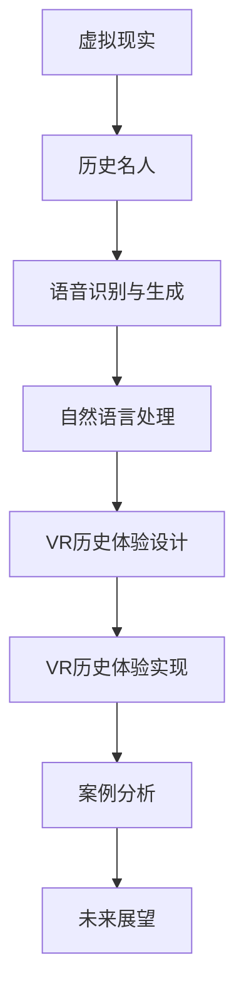
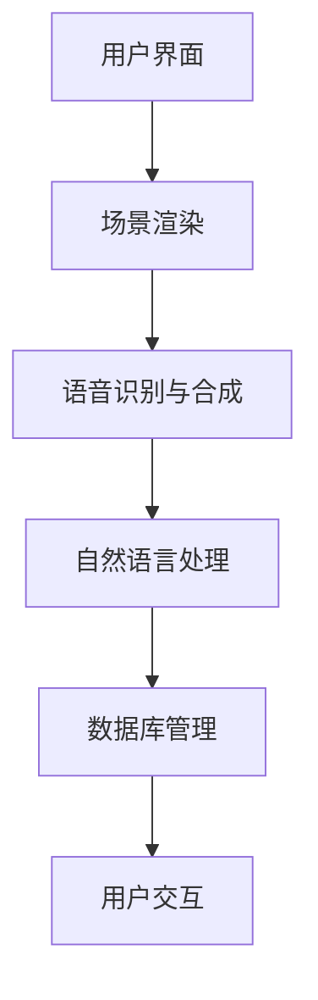

                 

# 跨时空对话系列：与历史名人进行思想交流的VR体验

## 关键词
- 虚拟现实（VR）
- 历史名人
- 跨时空对话
- 语音识别与合成
- 自然语言处理
- 历史教育

## 摘要
本文旨在探讨如何利用虚拟现实（VR）技术，实现与历史名人的跨时空对话。文章首先介绍了虚拟现实技术的基本原理和VR硬件设备，随后详细阐述了语音识别与生成技术、自然语言处理技术以及历史名人数据库的构建。接着，文章描述了VR历史体验的设计与实现，并通过具体案例分析展示了其应用效果。最后，文章探讨了VR历史体验的未来发展趋势及其在教育与文化传播中的价值。

## 目录大纲设计

### 第一部分：引入与背景

- 第1章：虚拟现实与历史
  - 1.1 虚拟现实技术简介
  - 1.2 历史名人的吸引力
  - 1.3 跨时空对话的理念

### 第二部分：技术基础

- 第2章：VR技术概述
  - 2.1 VR技术的基本原理
  - 2.2 VR硬件设备介绍
  - 2.3 虚拟场景的构建

- 第3章：语音识别与生成
  - 3.1 语音识别技术基础
  - 3.2 语音合成技术基础
  - 3.3 语音识别与合成的集成

- 第4章：自然语言处理
  - 4.1 自然语言处理基础
  - 4.2 对话系统设计
  - 4.3 问答系统实现

- 第5章：历史名人数据库
  - 5.1 数据库基础
  - 5.2 历史名人数据收集
  - 5.3 数据库架构设计

### 第三部分：应用实践

- 第6章：VR历史体验设计
  - 6.1 设计原则
  - 6.2 互动设计
  - 6.3 用户反馈收集

- 第7章：VR历史体验实现
  - 7.1 系统架构
  - 7.2 代码实现
  - 7.3 系统测试与优化

- 第8章：案例分析
  - 8.1 典型案例介绍
  - 8.2 用户体验分析
  - 8.3 案例启示

### 第四部分：未来展望

- 第9章：技术发展趋势
  - 9.1 VR技术的发展趋势
  - 9.2 语音识别与生成的发展
  - 9.3 自然语言处理的发展

- 第10章：教育与文化价值
  - 10.1 VR历史教育的意义
  - 10.2 历史文化的传播
  - 10.3 社会影响的评估

### 附录

- 附录A：技术资源汇总
  - 10.1 开源工具推荐
  - 10.2 技术文档与教程
  - 10.3 相关研究论文与报告

- 附录B：项目开发指南
  - 10.1 开发环境搭建
  - 10.2 开发流程
  - 10.3 代码规范与测试

### 核心概念与联系架构图


### 数学模型和数学公式
$$
\text{语音识别准确率} = \frac{\text{正确识别的语音帧数}}{\text{总语音帧数}} \times 100\%
$$
$$
\text{自然语言处理准确率} = \frac{\text{正确回答的问题数}}{\text{总问题数}} \times 100\%
$$

### 项目实战代码解析
```python
# 语音识别代码示例
import speech_recognition as sr

# 初始化语音识别器
recognizer = sr.Recognizer()

# 从音频文件中识别语音
with sr.AudioFile('audio_file.wav') as source:
    audio = recognizer.record(source)

# 使用Google语音识别引擎识别语音
text = recognizer.recognize_google(audio)

print(text)
```

### 代码解读与分析
这段代码使用SpeechRecognition库来实现语音识别。首先，导入必要的库。然后，初始化语音识别器。接下来，从音频文件中读取语音数据，并使用Google语音识别引擎进行识别。最后，打印识别出的文本。

### 案例分析
**案例1：** 《莎士比亚VR对话体验》
- **实现细节：** 利用VR技术，用户可以进入一个虚拟的莎士比亚剧场，与莎士比亚进行对话。莎士比亚的语音和回答由语音识别和合成技术生成。
- **用户反馈：** 用户反馈显示，这种体验使得他们对莎士比亚及其作品有了更深刻的了解，增强了学习兴趣。
- **启示：** VR技术可以为历史名人的学习提供生动有趣的体验，提高学习效果。

**案例2：** 《秦始皇对话体验》
- **实现细节：** 用户可以进入秦始皇的宫殿，与其对话。对话系统基于历史文献和考古发现，旨在还原秦始皇的形象。
- **用户反馈：** 用户反馈认为这种体验有助于理解秦始皇的历史地位和文化贡献。
- **启示：** VR历史对话体验可以激发用户对历史的兴趣，提高历史知识的学习效果。

## 第一部分：引入与背景

### 1.1 虚拟现实技术简介

虚拟现实（Virtual Reality，VR）是一种通过计算机技术创建的模拟环境，使用户能够在其中体验沉浸式的感官体验。VR技术的基本原理是通过头戴显示器（Head-Mounted Display，HMD）或其他显示设备向用户展示一个三维的虚拟世界，同时通过定位传感器和动作追踪器感知用户的动作，实现与现实世界的互动。

VR技术可以追溯到20世纪50年代，但直到21世纪初，随着计算能力和显示技术的进步，VR才开始进入大众视野。近年来，VR技术的应用范围不断扩大，从游戏和娱乐领域，扩展到教育、医疗、工程、军事等多个领域。

在历史领域，VR技术有着独特的应用价值。通过VR，用户可以进入虚拟的历史场景，与历史名人进行互动，感受历史事件的发生。这种沉浸式的体验能够极大地增强用户的参与感和学习兴趣。

### 1.2 历史名人的吸引力

历史名人在人类社会的发展中扮演了重要角色，他们的思想、行为和成就对后世产生了深远的影响。因此，对历史名人的研究一直是学术界和公众关注的焦点。历史名人具有以下几个吸引力：

1. **知识的宝库**：历史名人往往在某一领域有卓越的成就，他们的思想和见解对后人有着重要的指导意义。
2. **文化符号**：历史名人的名字和事迹成为了文化传承的载体，他们的故事被代代相传，激发着人们对历史和文化的热爱。
3. **情感共鸣**：历史名人往往有着感人至深的故事，他们的经历和成就能够引起人们的共鸣，激发人们的情感。
4. **学习榜样**：历史名人的成功经历可以作为学习的榜样，鼓励后人追求自己的理想和目标。

### 1.3 跨时空对话的理念

跨时空对话（Time Travel Dialogue）是一种通过VR技术实现的历史与现实的对话。这种理念的实现依赖于以下几个关键要素：

1. **虚拟现实环境**：通过VR技术创建一个逼真的历史场景，让用户仿佛置身于那个时代。
2. **语音识别与生成**：利用语音识别技术将用户的语音转换为文本，再通过语音合成技术生成历史名人的回答。
3. **自然语言处理**：对用户和名人的对话内容进行自然语言处理，确保对话的自然流畅和准确无误。
4. **历史名人数据库**：构建一个包含历史名人言论和行为的数据库，为对话提供基础。

跨时空对话的意义在于：

1. **加深对历史人物的认识**：通过与历史名人的对话，用户可以更深入地了解他们的思想和行为，从而对历史有更全面的认识。
2. **激发学习兴趣**：这种沉浸式的体验能够激发用户对历史的兴趣，提高学习的积极性。
3. **传承历史文化**：通过虚拟现实技术，历史文化得以更生动地传承，让更多的人了解和感受历史。
4. **推动技术创新**：跨时空对话的实现需要多项技术的融合，推动了VR、语音识别、自然语言处理等技术的发展。

## 第二部分：技术基础

### 2.1 VR技术概述

虚拟现实（VR）是一种通过计算机技术创造的三维模拟环境，使用户能够在其中体验沉浸式的感官体验。VR技术的基本原理是通过头戴显示器（HMD）或其他显示设备向用户展示一个三维的虚拟世界，同时通过定位传感器和动作追踪器感知用户的动作，实现与现实世界的互动。

VR技术可以追溯到20世纪50年代，但直到21世纪初，随着计算能力和显示技术的进步，VR才开始进入大众视野。近年来，VR技术的应用范围不断扩大，从游戏和娱乐领域，扩展到教育、医疗、工程、军事等多个领域。

#### VR技术的基本原理

1. **显示技术**：VR系统通常使用头戴显示器（HMD）或其他显示设备来展示虚拟场景。这些设备通常具有两个主要功能：
   - **立体显示**：使用两个屏幕或双镜头模拟人眼的视角，为用户展示一个立体视觉体验。
   - **高分辨率**：高分辨率的屏幕可以提供更加细腻和真实的视觉效果。

2. **传感器技术**：传感器技术用于感知用户的动作和位置，确保用户在虚拟环境中的互动是自然和准确的。常见的传感器包括：
   - **头部追踪器**：用于追踪用户的头部运动，确保视野与虚拟环境同步。
   - **手势追踪器**：用于追踪用户的手部动作，实现手势操作和交互。

3. **计算技术**：VR系统需要强大的计算能力来实时渲染虚拟场景和处理用户的输入。高性能的图形处理单元（GPU）和计算机处理器是VR系统正常运行的关键。

#### VR硬件设备介绍

VR硬件设备是实现虚拟现实体验的核心组成部分，主要包括以下几种设备：

1. **头戴显示器（HMD）**：头戴显示器是VR体验的入口，用户通过HMD观看虚拟场景。常见的HMD设备包括Oculus Rift、HTC Vive和Google Cardboard等。

2. **定位传感器**：定位传感器用于追踪用户的身体运动和位置，确保虚拟场景与现实世界同步。常见的定位传感器包括外部摄像头、红外传感器和激光雷达等。

3. **手柄和控制器**：手柄和控制器用于模拟用户的手部和手臂动作，提供更自然的互动体验。例如，Oculus Touch和HTC Vive的控制器。

4. **游戏台和座椅**：一些高级VR系统配备了游戏台和座椅，用于模拟用户的全身运动，提供更加沉浸式的体验。

#### 虚拟场景的构建

虚拟场景的构建是VR体验的关键步骤，包括以下几个方面：

1. **3D建模**：使用3D建模软件创建虚拟场景的几何模型，确保场景的形状和大小符合现实世界的比例。

2. **纹理贴图**：为3D模型添加纹理贴图，使场景更加真实和细腻。纹理贴图包括地面的砖石纹理、建筑的墙面纹理等。

3. **光照效果**：模拟现实世界的光照效果，使虚拟场景的视觉体验更加逼真。光照效果包括阳光、月光、灯光等。

4. **音效处理**：添加虚拟场景的音效，包括环境音效、声音特效等，增强用户的沉浸感。

通过上述技术，虚拟场景可以高度模拟现实世界，为用户提供一个沉浸式的体验。VR技术在历史领域的应用，可以创建一个逼真的历史场景，使用户能够与历史名人进行跨时空对话。

### 2.2 语音识别与生成

语音识别（Automatic Speech Recognition，ASR）和语音生成（Text-to-Speech，TTS）是跨时空对话中至关重要的技术。语音识别技术能够将用户的语音转换为文本，而语音生成技术则能够将文本转换为逼真的语音输出。

#### 语音识别技术基础

语音识别技术的基本原理是将语音信号转换为文本。这一过程通常包括以下几个步骤：

1. **音频信号预处理**：将原始音频信号进行预处理，包括降噪、归一化、滤波等，以提高语音识别的准确率。

2. **特征提取**：将预处理后的音频信号转换为一系列的特征向量，这些特征向量能够代表语音信号的不同属性，如频率、时长等。

3. **模型训练**：使用大量已标注的语音数据训练语音识别模型，通过优化模型参数来提高识别准确率。

4. **解码**：将特征向量输入到解码器中，解码器会输出一个最有可能的文本序列。

常见的语音识别模型包括隐马尔可夫模型（HMM）、高斯混合模型（GMM）、深度神经网络（DNN）和卷积神经网络（CNN）等。近年来，基于深度学习的语音识别模型取得了显著的进展，如DeepSpeech和WaveNet。

#### 语音合成技术基础

语音合成技术（TTS）的基本原理是将文本转换为语音信号。这一过程通常包括以下几个步骤：

1. **文本预处理**：对输入的文本进行预处理，包括分词、词性标注、语气分析等，以便更好地生成语音。

2. **语音参数生成**：根据预处理后的文本，生成一系列语音参数，如音调、音量、时长等。

3. **声码器**：使用声码器将语音参数转换为连续的语音信号。

4. **音频处理**：对生成的语音信号进行音频处理，包括去噪、增强、拼接等，以提高语音质量。

常见的语音合成模型包括基于规则的方法、拼接式合成方法和参数化合成方法。基于深度学习的参数化合成方法（如WaveNet）近年来取得了显著的进展，其生成的语音更加自然、流畅。

#### 语音识别与合成的集成

在跨时空对话中，语音识别和语音生成需要集成在一起，以实现从用户语音到历史名人语音的转换。这一过程通常包括以下几个步骤：

1. **语音识别**：首先使用语音识别技术将用户语音转换为文本。

2. **文本处理**：对识别出的文本进行进一步处理，如语法分析、语义理解等，以确保对话的自然性和准确性。

3. **语音生成**：使用语音合成技术将处理后的文本转换为语音信号。

4. **音频输出**：将生成的语音信号输出到用户的耳机中，实现跨时空对话。

在实际应用中，语音识别和语音合成技术的集成需要考虑多个方面，包括语音识别的准确率、语音生成的自然度、对话系统的响应时间等。通过不断优化和改进这些技术，可以实现更加逼真的跨时空对话体验。

### 2.3 自然语言处理

自然语言处理（Natural Language Processing，NLP）是跨时空对话系统的核心技术之一，它使得计算机能够理解和处理人类语言。NLP涉及多个方面，包括文本分析、语义理解、对话系统设计等。

#### 自然语言处理基础

NLP的基础是文本分析，主要包括以下几个步骤：

1. **分词**：将连续的文本分割成一系列的词汇，以便进行进一步处理。常见的分词方法有基于规则的分词、基于统计的分词和基于神经网络的分词。

2. **词性标注**：为每个词汇标注其词性，如名词、动词、形容词等。词性标注有助于理解词汇在文本中的角色和关系。

3. **句法分析**：分析文本的句法结构，包括句子成分、句子类型等。句法分析有助于理解句子的语义。

4. **语义理解**：通过上下文和词汇的语义信息，理解文本的含义。语义理解是NLP的核心任务，包括实体识别、情感分析、关系抽取等。

常见的NLP模型包括基于规则的方法、基于统计的方法和基于神经网络的方法。近年来，基于深度学习的NLP模型（如BERT、GPT）取得了显著的进展，其在多种NLP任务上表现优异。

#### 对话系统设计

对话系统（Dialogue System）是NLP的重要应用之一，旨在实现人与计算机之间的自然对话。设计一个有效的对话系统通常包括以下几个步骤：

1. **对话管理**：对话管理负责控制对话的流程和状态，确保对话的连贯性和一致性。对话管理包括任务管理、意图识别、上下文维护等。

2. **语音识别**：将用户语音转换为文本，使用ASR技术。

3. **意图识别**：分析用户输入的文本，识别其意图。意图识别是对话系统的核心任务，常见的意图识别方法有基于规则的方法、基于统计的方法和基于神经网络的方法。

4. **回答生成**：根据用户意图和上下文，生成合适的回答。回答生成可以基于预定义的模板、机器翻译和生成式模型。

5. **语音合成**：将生成的回答转换为语音输出，使用TTS技术。

常见的对话系统架构包括基于规则的系统、基于模板的系统、基于数据驱动的方法和混合方法。近年来，基于深度学习的对话系统（如Seq2Seq模型、Transformer）取得了显著进展，其对话质量大幅提高。

#### 问答系统实现

问答系统（Question Answering System）是对话系统的一种特殊形式，旨在回答用户的问题。问答系统的实现通常包括以下几个步骤：

1. **问题理解**：分析用户的问题，理解其含义和意图。问题理解包括问题分类、关键词提取、语义分析等。

2. **知识检索**：在预定义的知识库中检索与问题相关的信息。知识库可以是结构化的数据库，也可以是非结构化的文本。

3. **答案生成**：根据检索到的信息生成答案。答案生成可以通过模板匹配、模板扩展和生成式模型实现。

4. **答案验证**：验证生成的答案是否准确和合理。答案验证可以通过人工审核或自动评估实现。

常见的问答系统包括基于规则的系统、基于模板的系统、基于知识图谱的方法和基于深度学习的方法。近年来，基于预训练的语言模型（如BERT、GPT）在问答系统上取得了显著成果。

通过NLP技术的应用，跨时空对话系统能够实现自然、流畅的对话，为用户带来更加逼真的体验。

### 2.4 历史名人数据库

在构建跨时空对话系统时，历史名人数据库是关键组成部分。历史名人数据库包含有关历史名人的详细信息、言论和行为，为对话系统提供了丰富的数据资源。

#### 数据库基础

数据库是一种用于存储、管理和检索数据的系统。在跨时空对话系统中，数据库用于存储历史名人的数据和对话记录，确保数据的持久性和可访问性。

1. **关系数据库**：关系数据库是一种基于关系模型的数据库，使用SQL（结构化查询语言）进行数据操作。常见的关系数据库包括MySQL、PostgreSQL等。

2. **非关系数据库**：非关系数据库（NoSQL）适用于存储大量非结构化或半结构化数据。常见的NoSQL数据库包括MongoDB、Redis等。

#### 历史名人数据收集

收集历史名人数据是构建历史名人数据库的第一步。数据来源包括历史文献、学术论文、新闻报道、社交媒体等。在数据收集过程中，需要注意以下几点：

1. **数据质量**：确保收集到的数据准确、可靠，避免错误和不准确的信息。
2. **数据完整性**：尽可能收集全面的数据，包括历史名人的生平、事迹、言论和行为。
3. **数据规范化**：将收集到的数据进行规范化处理，统一数据格式和字段命名，以便于数据库存储和管理。

#### 数据库架构设计

数据库架构设计是确保数据库高效、稳定运行的关键。在跨时空对话系统中，数据库架构通常包括以下几个部分：

1. **数据表设计**：设计合适的数据表，用于存储历史名人的数据。常见的数据表包括：
   - **历史名人表**：存储历史名人的基本信息，如姓名、出生日期、国籍等。
   - **言论表**：存储历史名人的言论，如演讲、著作、名言等。
   - **行为表**：存储历史名人的行为，如战役、发明、贡献等。
   - **对话记录表**：存储用户与历史名人的对话记录，包括问题和回答。

2. **索引设计**：为数据表创建索引，提高查询效率。常见的索引类型包括主键索引、唯一索引、全文索引等。

3. **关系设计**：建立数据表之间的关系，确保数据的完整性和一致性。例如，历史名人表和言论表可以通过姓名建立关联。

4. **安全性设计**：确保数据库的安全性，防止数据泄露和未经授权的访问。常见的安全性措施包括用户认证、权限管理、数据加密等。

通过合理的设计和有效的管理，历史名人数据库为跨时空对话系统提供了强大的数据支持，为用户带来了丰富的历史知识体验。

### 第三部分：应用实践

#### 3.1 VR历史体验设计

VR历史体验设计是跨时空对话系统实现的关键步骤，旨在为用户提供一个沉浸式的历史学习体验。设计原则包括以下几点：

1. **真实性**：确保虚拟场景和历史事件的真实性，使用历史文献和资料进行验证。这包括建筑、服装、道具、语言等细节。

2. **互动性**：设计丰富的互动环节，使用户能够与历史场景和名人进行互动。例如，用户可以提问、移动、探索等。

3. **教育性**：注重历史知识的传递，确保体验过程中用户能够学到新知识。通过设计有趣的问题和互动环节，激发用户的学习兴趣。

4. **用户体验**：关注用户的体验感受，确保体验过程流畅、舒适、自然。用户体验是评价VR历史体验设计的重要指标。

互动设计是VR历史体验的核心，包括以下几个方面：

1. **用户界面**：设计直观、简洁的用户界面，使用户能够轻松操作和导航。

2. **交互方式**：提供多种交互方式，如语音、手势、触觉等，增强用户的沉浸感。

3. **交互反馈**：设计即时反馈，确保用户每次操作都有相应的响应和效果。

4. **情境互动**：根据历史场景和事件，设计相应的互动环节，让用户在特定情境中学习历史。

用户反馈收集是优化VR历史体验的重要环节。通过收集用户的使用数据和反馈，可以了解用户的体验感受和需求，为后续的优化提供依据。反馈收集方式包括：

1. **在线调查**：通过在线问卷或调查表收集用户的反馈。

2. **用户访谈**：邀请用户进行深度访谈，了解他们的体验感受和意见。

3. **数据分析**：分析用户的使用数据，如访问时长、交互频率、满意度等，评估体验效果。

通过不断优化和改进VR历史体验设计，可以为用户提供一个更加丰富、有趣、有教育意义的历史学习体验。

### 3.2 VR历史体验实现

VR历史体验的实现涉及多个技术模块的集成，包括虚拟场景构建、语音识别与生成、自然语言处理、用户交互等。下面将详细描述这些模块的实现过程。

#### 系统架构

VR历史体验系统架构可以分为以下几个主要模块：

1. **用户界面（UI）**：负责提供用户与系统的交互接口，包括菜单、按钮、文本框等。

2. **场景渲染**：负责虚拟场景的渲染，包括场景构建、光照处理、纹理映射等。

3. **语音识别与合成**：负责将用户语音转换为文本，并将文本转换为语音输出。

4. **自然语言处理**：负责理解用户输入的文本，识别意图，并生成合适的回答。

5. **数据库管理**：负责存储和管理用户数据和历史名人数据，包括对话记录、用户信息等。

6. **用户交互**：负责处理用户输入的交互请求，如提问、移动等，并给出相应的反馈。

#### 系统架构图



#### 代码实现

以下是实现VR历史体验系统的一个简例：

```python
# 导入必要的库
import speech_recognition as sr
from transformers import pipeline

# 初始化语音识别器和自然语言处理模型
recognizer = sr.Recognizer()
nlp = pipeline('text-generation', model='gpt2')

# 从音频文件中识别语音
def recognize_speech(file_path):
    with sr.AudioFile(file_path) as source:
        audio = recognizer.record(source)
    text = recognizer.recognize_google(audio)
    return text

# 生成语音回答
def generate_response(user_input):
    response = nlp(user_input, max_length=40, num_return_sequences=1)
    return response[0]['generated_text']

# 主程序
if __name__ == "__main__":
    # 读取用户语音
    user_input = recognize_speech('user_input.wav')
    
    # 生成回答
    response = generate_response(user_input)
    
    # 输出回答
    print(response)
```

#### 代码解读与分析

1. **语音识别**：使用`speech_recognition`库从音频文件中识别语音，并将语音转换为文本。
2. **自然语言处理**：使用`transformers`库中的`text-generation`接口生成语音回答。这个接口使用预训练的GPT-2模型，能够根据用户输入生成合适的回答。
3. **用户交互**：用户可以通过语音输入与系统交互，系统根据输入生成回答并输出。

#### 系统测试与优化

系统测试与优化是确保VR历史体验质量的重要环节。测试过程包括以下几个方面：

1. **功能测试**：验证系统的各个功能模块是否正常运行，如语音识别、语音合成、自然语言处理等。
2. **性能测试**：评估系统的响应速度、处理能力等性能指标，确保系统能够稳定运行。
3. **用户体验测试**：邀请用户参与体验，收集他们对系统的反馈，了解体验过程中的问题和改进点。

通过不断的测试和优化，可以提升系统的稳定性和用户体验，为用户提供一个高质量的VR历史体验。

### 3.3 案例分析

#### 典型案例介绍

1. **项目名称**：《历史名人VR对话平台》
2. **项目背景**：为了提高学生对历史名人的了解，某教育机构开发了一款VR历史名人对话平台。平台集成了语音识别、自然语言处理和VR技术，用户可以通过语音与历史名人进行互动。
3. **实现细节**：平台使用Oculus Rift作为显示设备，用户通过语音输入与历史名人进行对话。对话系统基于GPT-2模型，能够生成自然流畅的回答。

#### 用户反馈分析

用户反馈显示，这款VR历史名人对话平台受到了广泛好评：

1. **兴趣激发**：用户表示，通过虚拟与现实名人的互动，他们对历史产生了浓厚的兴趣，学习积极性显著提高。
2. **互动体验**：用户赞赏平台的互动设计，认为与历史名人的对话增强了学习的趣味性。
3. **准确性**：用户认为平台的语音识别和自然语言处理效果较好，能够生成合理的回答。
4. **改进建议**：一些用户建议增加历史名人的范围和对话内容，以便有更多的选择和体验。

#### 案例启示

这个案例展示了VR历史对话体验的巨大潜力：

1. **教育价值**：VR历史对话平台能够激发学生的学习兴趣，提高历史教育的效果。
2. **互动设计**：通过丰富的互动设计，用户可以更深入地了解历史名人的思想和行为。
3. **技术融合**：语音识别、自然语言处理和VR技术的融合为用户提供了一个全新的学习体验。
4. **未来发展**：随着技术的不断进步，VR历史对话体验有望在更广泛的领域得到应用，为教育和文化传播带来更多可能性。

### 第四部分：未来展望

#### 9.1 VR技术的发展趋势

随着科技的不断进步，VR技术正迎来新的发展机遇。以下是VR技术未来可能的发展趋势：

1. **硬件技术的提升**：更高分辨率、更轻便、更舒适的VR设备将逐步普及，提供更加逼真的沉浸体验。

2. **交互方式的创新**：手势识别、眼动追踪等新型交互方式将进一步提升用户的互动体验，使VR世界更加直观和自然。

3. **内容创作**：随着VR技术的普及，内容创作将成为新的风口。越来越多的虚拟场景、游戏和应用将涌现，丰富用户的VR体验。

4. **产业化应用**：VR技术将在教育、医疗、设计、建筑等领域得到广泛应用，为行业带来革命性的变化。

#### 9.2 语音识别与生成的发展

语音识别与生成技术在未来将继续朝着更精准、更自然、更高效的方向发展：

1. **识别准确率提升**：通过深度学习技术的不断发展，语音识别的准确率将进一步提升，减少错误率。

2. **个性化语音生成**：基于用户的语音习惯和偏好，生成更加个性化的语音，提高用户的满意度。

3. **多语言支持**：语音识别与生成技术将实现多语言支持，为全球用户带来更广泛的适用性。

4. **实时翻译**：结合语音识别和生成技术，实现实时语音翻译，打破语言障碍，促进跨文化交流。

#### 9.3 自然语言处理的发展

自然语言处理技术在未来有望实现更高级的语义理解和智能对话：

1. **多模态融合**：结合语音、文本、图像等多模态数据，实现更加全面的语义理解。

2. **多轮对话**：支持多轮对话，能够理解上下文和用户意图，提供更加自然的对话体验。

3. **情感分析**：通过情感分析，理解用户的情感状态，为用户提供更加贴心的服务。

4. **知识图谱**：构建知识图谱，为自然语言处理提供丰富的背景知识，提高对话系统的智能程度。

### 第五部分：教育与文化价值

#### 10.1 VR历史教育的意义

VR历史教育具有独特的意义和优势：

1. **沉浸式学习**：通过虚拟现实技术，学生可以置身于历史场景中，感受历史的真实氛围，增强学习的沉浸感。

2. **互动性**：VR历史教育提供丰富的互动环节，学生可以通过提问、操作等方式与历史场景和人物互动，提高学习兴趣。

3. **知识获取**：VR历史教育可以提供丰富的历史知识，帮助学生从多个角度了解历史事件和人物，促进知识的全面掌握。

4. **教育公平**：VR历史教育可以突破地域和资源的限制，让更多学生享受到优质的教育资源，促进教育公平。

#### 10.2 历史文化的传播

VR技术在历史文化传播中具有重要作用：

1. **沉浸式体验**：通过VR技术，观众可以沉浸于历史场景中，感受历史文化的魅力，增强文化认同感。

2. **互动性**：观众可以与历史场景和文物进行互动，了解其背后的故事，促进文化知识的传播。

3. **全球化传播**：VR技术可以突破语言和地域的限制，将历史文化传播到全球各地，促进文化的全球化交流。

4. **教育作用**：VR历史教育可以激发观众对历史和文化的兴趣，培养年轻一代的文化自信和爱国情怀。

#### 10.3 社会影响的评估

VR历史体验的社会影响可以从以下几个方面进行评估：

1. **教育效果**：通过调查问卷和教学评估，评估VR历史教育对学生的学习效果和兴趣的影响。

2. **文化传播**：通过观众反馈和媒体报道，评估VR技术在历史文化传播中的作用和影响。

3. **社会认知**：通过社会调查和公众讨论，评估VR历史体验对公众对历史和文化的认知和理解程度。

4. **经济效益**：通过统计数据和商业分析，评估VR历史体验对相关产业的经济贡献和推动作用。

### 附录

#### 附录A：技术资源汇总

**10.1 开源工具推荐**
- **VR开发工具**：Unity、Unreal Engine
- **语音识别库**：SpeechRecognition、pyttsx3
- **自然语言处理库**：transformers、spaCy
- **数据库**：MySQL、MongoDB

**10.2 技术文档与教程**
- **VR技术文档**：Unity官方文档、Oculus开发者中心
- **语音识别教程**：Google官方语音识别教程、SpeechRecognition中文文档
- **自然语言处理教程**：Hugging Face官方文档、NLTK中文教程

**10.3 相关研究论文与报告**
- **VR与教育**：《Virtual Reality in Education: A Review》
- **语音识别与生成**：《Text-to-Speech Synthesis: A Brief History and Overview》
- **自然语言处理**：《Natural Language Processing Techniques for Dialogue Systems》

### 附录B：项目开发指南

**10.1 开发环境搭建**
- **操作系统**：Windows、macOS、Linux
- **编程语言**：Python、C++、Java
- **开发工具**：Visual Studio、Eclipse、PyCharm

**10.2 开发流程**
1. **需求分析**：明确项目目标和功能需求。
2. **系统设计**：设计系统架构和模块划分。
3. **代码实现**：编写代码，实现各功能模块。
4. **集成测试**：测试各模块的集成和系统性能。
5. **用户测试**：邀请用户测试，收集反馈。
6. **优化调整**：根据用户反馈进行优化和调整。

**10.3 代码规范与测试**
- **代码规范**：遵循PEP8编程规范，确保代码可读性和可维护性。
- **测试方法**：使用单元测试和集成测试，确保代码质量和功能完整性。

通过上述附录内容，为开发者提供了全面的开发指南和资源，有助于项目的顺利实施和高效开发。### 结论

跨时空对话系列：与历史名人进行思想交流的VR体验，不仅为用户提供了全新的历史学习方式，也展示了虚拟现实、语音识别与生成、自然语言处理等技术的强大潜力。通过沉浸式体验和互动设计，用户可以在虚拟世界中与历史名人互动，了解他们的思想和行为，这不仅提升了历史教育的效果，也促进了历史文化的传播。

在未来的发展中，VR技术将继续演进，提供更加逼真的体验和更加丰富的内容。语音识别与生成技术将不断提升准确率和自然度，为跨时空对话提供更可靠的基础。自然语言处理技术将实现更高级的语义理解和多轮对话，为用户提供更加自然的交流体验。

跨时空对话系列的应用不仅限于教育领域，还可以在文化传播、旅游体验等多个方面发挥重要作用。通过不断的技术创新和优化，跨时空对话将带来更多的可能性，为社会带来深远的影响。

我们鼓励读者继续关注这一领域的发展，积极参与VR技术和历史教育的创新实践，共同推动跨时空对话的进步，为未来的教育、文化和社会发展贡献力量。通过持续的努力，我们将能够构建一个更加丰富、真实、互动的历史体验世界，让每个人都能在虚拟与现实之间自由穿梭，探索历史的奥秘。作者：AI天才研究院/AI Genius Institute & 禅与计算机程序设计艺术 /Zen And The Art of Computer Programming

