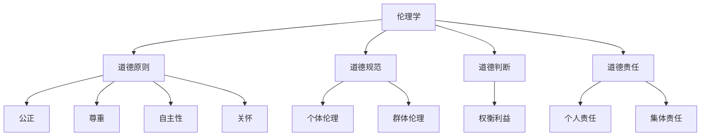

                 

### 引言：跨物种伦理学与人工智能时代

#### 1.1 书籍背景与目的

在当今迅速发展的科技时代，人工智能（AI）已经成为引领变革的重要力量。随着AI技术的不断进步，人类生活、工作和社会各个层面都受到了深远的影响。然而，随着AI技术的广泛应用，一系列伦理问题也随之而来。这些问题不仅涉及到人类自身，还涉及到人类与动物、机器和其他智能体之间的复杂关系。为了应对这些挑战，有必要探讨跨物种伦理学在人工智能时代的应用及其道德框架。

本书旨在填补这一领域的研究空白，为跨物种伦理学在人工智能时代提供理论框架和实践指导。通过系统性地探讨伦理学基础、人工智能伦理问题、跨物种伦理案例分析以及道德框架的构建，本书力图提供一个全面、深入的视角，帮助读者理解并应对人工智能时代中的伦理挑战。

#### 1.2 跨物种伦理学的意义

跨物种伦理学是一门研究不同物种之间伦理关系和互动的学科。在人工智能时代，这一领域的研究具有重要意义。首先，随着AI技术的发展，人类与机器的互动日益频繁，机器甚至能够表现出某种程度的“智能”和“自主性”。这引发了关于人类与机器之间伦理关系的讨论。其次，人工智能技术的应用不仅影响到人类社会，还涉及到对动物、环境等非人类物种的影响。因此，跨物种伦理学为我们提供了一个思考平台，以评估和指导人工智能技术在各个领域的应用。

此外，跨物种伦理学的研究还有助于提升公众对AI伦理问题的关注和理解。随着AI技术的普及，公众对AI的接受程度和信任度成为影响技术发展的关键因素。通过探讨跨物种伦理问题，我们可以引导公众更好地理解AI技术的潜在影响，并提出相应的道德规范和监管措施。

#### 1.3 人工智能时代的挑战与机遇

人工智能时代既带来了前所未有的机遇，也带来了巨大的挑战。从积极的角度看，人工智能技术为提高生产效率、改善生活质量、推动社会进步提供了强大动力。例如，在医疗领域，AI可以帮助医生更准确地诊断疾病，提高治疗效果；在工业领域，AI可以优化生产流程，降低成本，提高产品质量。

然而，人工智能技术的快速发展也带来了一系列伦理问题。首先，AI技术的应用可能会导致算法偏见和歧视，影响社会公平和正义。其次，随着AI技术的普及，隐私保护和数据安全成为重大挑战。此外，人工智能还可能对就业市场产生深远影响，引发社会不平等和贫困问题。

面对这些挑战，跨物种伦理学为我们提供了一种新的思考方式，帮助我们在设计、开发和部署AI技术时，充分考虑其对人类和其他物种的影响。通过构建一套全面的道德框架，我们可以确保人工智能技术的应用符合伦理标准，最大限度地减少负面影响，并充分发挥其潜力。

### 第一部分：伦理学基础

#### 2. 伦理学概述

伦理学是研究道德观念、道德原则和道德行为的学科，它探讨的是人们在不同情境下应该如何做出道德决策，以及这些决策背后的道德基础。伦理学不仅涉及个人行为，还涵盖了社会、文化和制度等方面，是一个广泛而复杂的领域。

##### 2.1 伦理学的定义与范畴

伦理学（Ethics）源自古希腊语的 " ethos "，意为“性格”、“风尚”或“习惯”。现代伦理学通常被定义为研究道德原则和道德行为的学科。伦理学的主要范畴包括道德原则、道德规范、道德判断和道德责任等。

- **道德原则**：道德原则是伦理学的核心，它们为行为提供了普遍的指导原则。常见的道德原则包括功利主义、康德伦理学、美德伦理学等。

- **道德规范**：道德规范是具体的道德准则，用于指导个体和社会在特定情境下的行为。例如，不撒谎、不偷窃、尊重他人等。

- **道德判断**：道德判断是对行为是否道德的评估。道德判断涉及对行为后果的考量，以及行为是否符合道德原则和规范。

- **道德责任**：道德责任是指个体因其行为所承担的道德义务。道德责任可以分为个人责任和集体责任。

##### 2.2 伦理学的基本原则

伦理学的基本原则是构建道德决策和道德体系的基础。以下是一些重要的伦理学基本原则：

- **公正**：公正强调平等对待每个人，确保资源和服务分配的公平性。公正原则在道德决策中用于平衡不同利益之间的冲突。

- **尊重**：尊重原则要求我们尊重他人的权利和尊严，无论他们的身份、地位或背景如何。尊重原则在道德决策中用于指导我们如何与他人互动。

- **自主性**：自主性是指个体有能力做出自己的选择，并对自己的行为负责。自主性原则在道德决策中强调个体的自由和自我决定。

- **关怀**：关怀原则强调对他人的关心和同情，关注他人的福祉。关怀原则在道德决策中用于指导我们如何对待他人，尤其是那些处于困境中的人。

##### 2.3 伦理学理论发展史

伦理学的发展历史可以追溯到古希腊哲学家，如苏格拉底、柏拉图和亚里士多德。他们的思想为现代伦理学奠定了基础。

- **古希腊哲学**：古希腊哲学家探讨了道德的本质和道德行为的合理性。亚里士多德的美德伦理学强调了道德行为与个人幸福的关系。

- **中世纪哲学**：中世纪哲学家如托马斯·阿奎那将宗教信仰融入伦理学，提出了道德法则和神学伦理。

- **现代哲学**：现代伦理学的发展受到启蒙运动的影响。康德的道德哲学强调道德规则的普遍性和必然性，而功利主义则强调行为后果的最大幸福。

- **当代伦理学**：当代伦理学继续探讨道德问题，如环境伦理、人工智能伦理和生物伦理。这些领域涉及复杂的问题，需要跨学科的研究和综合的道德思考。

通过了解伦理学的发展历史，我们可以更好地理解道德原则和道德决策的演变，并为解决当今伦理问题提供历史视角。

#### 3. 伦理学核心概念

伦理学是一门探讨道德原则和道德行为的学科，其中包含了许多核心概念，这些概念是理解道德决策和行为的基础。以下是一些重要的伦理学核心概念：

##### 3.1 个体与群体伦理

个体伦理和群体伦理是伦理学中两个重要的概念，它们分别关注个体和群体的道德行为和责任。

- **个体伦理**：个体伦理关注个人在特定情境中的道德行为。它强调个体的自主性、责任感和道德判断。个体伦理的核心理念是，每个人都应该对自己的行为负责，并遵守道德规范。

- **群体伦理**：群体伦理关注群体（如家庭、社区、国家等）的道德行为和责任。它强调群体成员之间的相互关系、合作和共同目标。群体伦理的核心理念是，群体的行为和决策应该符合道德原则，以促进群体的整体福祉。

个体伦理和群体伦理之间的关系是复杂的。一方面，个体伦理为群体伦理提供了基础，个体的道德行为会影响群体的道德氛围。另一方面，群体伦理对个体伦理产生影响，群体规范和价值观念会影响个体的道德判断和行为。

##### 3.2 自由与责任

自由与责任是伦理学中的核心概念，它们紧密相连，互为条件。

- **自由**：自由是指个体在道德和法律框架内自主选择和行动的能力。自由是道德哲学中的重要原则，它保障个体的权利和尊严。然而，自由并不意味着无限制，个体在行使自由时必须考虑其对他人和社会的影响。

- **责任**：责任是指个体因其行为所承担的道德义务。责任与自由相辅相成，个体在享有自由的同时，必须承担相应的责任。责任的核心理念是，个体的行为不仅影响自己，还会影响他人和社会，因此个体应该对自己的行为负责。

自由与责任之间的关系可以理解为：自由是责任的先决条件，责任是自由的必然结果。个体在享有自由的同时，必须承担相应的责任，这样才能实现真正的自由。

##### 3.3 公正与平等

公正与平等是伦理学中的另外两个核心概念，它们在道德决策和行为中起着重要作用。

- **公正**：公正是指对待每个人都公平合理，确保资源和服务分配的公平性。公正的核心原则是平等对待每个人，不论他们的身份、地位或背景。公正在道德决策中用于平衡不同利益之间的冲突，确保社会的正义和公平。

- **平等**：平等是指所有人都享有相同的权利和机会，不受种族、性别、年龄、社会地位等因素的影响。平等的核心原则是消除歧视和不公平，确保每个人都能在社会中实现自己的潜力。

公正与平等之间的关系是紧密的。公正的实现需要平等，而平等的维护也需要公正。在道德决策和行为中，公正和平等是相辅相成的，共同促进社会的正义和公平。

通过理解个体与群体伦理、自由与责任以及公正与平等这些核心概念，我们可以更好地进行道德决策和道德行为，并在人工智能时代应对复杂的伦理挑战。

#### 4. 伦理决策过程

伦理决策过程是伦理学中至关重要的一部分，它涉及到个体和组织在面对道德问题时如何做出决策。一个有效的伦理决策过程不仅需要明确道德原则和规范，还需要考虑具体情境和利益相关者的需求。以下是一个典型的伦理决策过程：

##### 4.1 伦理决策模型

伦理决策模型为道德决策提供了一个结构化的框架，帮助个体和组织系统地分析和解决问题。一个常见的伦理决策模型包括以下步骤：

1. **识别问题**：首先，需要明确所面临的问题或情境。这可以通过调查、观察、讨论等方式进行。

2. **道德分析**：在识别问题后，需要对问题进行道德分析，确定问题的道德性质和涉及的道德原则。这包括评估行为是否符合道德规范、价值观和法律法规。

3. **权衡利益**：在道德分析的基础上，需要权衡不同利益相关者的利益和需求。这包括考虑个体、群体、社会和环境等多方面的利益。

4. **选择方案**：根据道德分析和利益权衡的结果，提出可能的解决方案。这可以包括不同的行动方案、政策或决策。

5. **实施决策**：选择最佳方案后，需要将其付诸实施。实施过程中可能需要调整方案，以应对新的情况和挑战。

6. **评估结果**：决策实施后，需要对结果进行评估，以确保决策的有效性和道德性。这包括评估决策对利益相关者的影响，以及是否达到预期的道德目标。

##### 4.2 伦理决策中的挑战

伦理决策过程并非一帆风顺，其中存在许多挑战和难点。以下是一些常见的挑战：

1. **道德不确定性**：道德原则和规范往往具有模糊性和不确定性，特别是在涉及复杂情境时。这可能导致决策者难以确定正确的行为。

2. **利益冲突**：在伦理决策过程中，不同利益相关者之间可能存在利益冲突。如何平衡和解决这些冲突是一个重要挑战。

3. **文化差异**：不同文化和社会背景下的道德观念和行为规范可能存在差异。这可能导致决策者在跨文化情境中难以做出一致的决策。

4. **技术限制**：在涉及人工智能和科技问题的伦理决策中，技术限制可能影响决策的有效性和可行性。例如，某些技术可能无法满足道德要求，或者道德决策需要依赖尚未成熟的技术。

5. **时间压力**：在紧急情况下，决策者可能面临时间压力，这可能导致决策过程不够充分和全面。

##### 4.3 伦理决策的实际应用

伦理决策在许多领域和情境中都有实际应用。以下是一些具体的实例：

1. **医疗伦理**：在医疗决策中，伦理决策过程用于评估治疗方案、分配医疗资源以及处理医患关系。例如，在器官移植中，如何公平地分配稀缺资源是一个伦理难题。

2. **企业伦理**：在企业运营中，伦理决策过程用于指导企业的行为和决策，确保企业符合道德规范和社会责任。例如，企业在供应链管理中如何确保供应商遵守道德标准和环境保护法规。

3. **公共管理**：在公共管理中，伦理决策过程用于制定政策和法规，确保公共资源和社会福利的公平分配。例如，政府在处理自然灾害和社会危机时，如何平衡救援资源和应急措施。

4. **科技伦理**：在科技伦理领域，伦理决策过程用于评估和指导人工智能、生物技术等新兴技术的发展和应用。例如，如何确保人工智能系统的透明性和公平性，避免算法偏见和歧视。

通过了解伦理决策过程和实际应用，我们可以更好地应对复杂的伦理问题，并在人工智能时代做出符合道德规范的决策。

### 第二部分：人工智能伦理问题

#### 5. 人工智能伦理问题概述

人工智能（AI）的发展已经深刻改变了我们的生活和工作方式，但其广泛应用也带来了许多伦理问题。这些伦理问题不仅影响人类社会的各个方面，还涉及到与动物、环境等非人类物种的互动。理解这些伦理问题对于确保AI技术的健康发展至关重要。

##### 5.1 人工智能的伦理重要性

人工智能的伦理重要性体现在以下几个方面：

1. **社会影响**：AI技术广泛应用于医疗、金融、教育、交通等领域，对社会结构和人们的生活产生了深远影响。如何确保这些影响是积极的，避免产生负面影响，是一个重要的伦理议题。

2. **责任归属**：当AI系统发生故障或造成损害时，如何界定责任归属成为法律和道德上的挑战。AI系统的复杂性和自主性使得责任归属问题更加复杂。

3. **公平与正义**：AI技术在决策中的应用可能会导致算法偏见和歧视，影响社会公平和正义。如何确保AI系统的公平性和透明性，避免偏见和歧视，是重要的伦理问题。

4. **隐私保护**：AI技术的发展使得大规模数据收集和分析成为可能，但这也带来了隐私保护的问题。如何保护个人隐私，防止数据滥用，是一个重要的伦理挑战。

##### 5.2 人工智能引发的伦理问题

人工智能引发的伦理问题主要包括以下几个方面：

1. **算法偏见与歧视**：AI系统在决策过程中可能会表现出偏见和歧视，特别是在涉及敏感信息（如种族、性别、年龄等）的情境中。算法偏见可能导致不公平的决策，加剧社会不平等。

2. **隐私保护与数据安全**：AI技术需要大量数据进行分析和训练，这涉及到个人隐私和数据安全问题。如何保护个人隐私，防止数据泄露和滥用，是重要的伦理问题。

3. **安全性**：AI系统的安全性和可靠性是关键问题。当AI系统应用于关键领域（如医疗、交通、军事等）时，其故障或恶意攻击可能导致严重后果。

4. **就业影响**：AI技术的广泛应用可能对就业市场产生深远影响，尤其是对低技能工作的替代。如何应对就业市场的变化，保障劳动者的权益，是一个重要的伦理问题。

5. **道德决策**：在复杂情境中，AI系统需要做出道德决策。然而，AI系统的道德判断能力有限，这可能导致道德决策的不当或失误。

##### 5.3 人工智能伦理问题的案例分析

为了更好地理解人工智能引发的伦理问题，我们可以通过以下案例进行分析：

1. **亚马逊招聘系统的性别偏见**：亚马逊曾开发了一套招聘系统，用于筛选求职者的简历。然而，该系统在训练数据中存在性别偏见，导致对女性求职者的偏见。这引发了关于算法偏见和公平性的讨论。

2. **面部识别技术的滥用**：面部识别技术在安防监控、商业营销等领域得到广泛应用，但也存在滥用问题。例如，在某些国家和地区，政府机构和企业未经授权使用面部识别技术，侵犯个人隐私。

3. **自动化武器系统的道德问题**：自动化武器系统（如无人机）在军事冲突中的应用引发了道德争议。如何确保这些系统能够在道德框架内运行，避免误伤和非人道行为，是一个关键问题。

4. **自动驾驶汽车的责任归属**：随着自动驾驶汽车技术的发展，其事故责任归属问题成为一个重要的伦理问题。例如，在自动驾驶汽车与行人发生碰撞时，如何界定责任，如何确保系统的安全性和道德性。

通过这些案例分析，我们可以看到人工智能引发的伦理问题具有复杂性和多样性。解决这些问题需要跨学科的合作和全面的道德思考，以确保AI技术的健康发展和广泛应用。

### 6. 算法偏见与歧视

算法偏见与歧视是人工智能（AI）技术广泛应用中面临的一个重要伦理问题。算法偏见指的是AI系统在决策过程中，由于训练数据中存在的偏见或不公正，导致系统在处理特定群体时表现出不公平的现象。这种偏见不仅损害了社会公平，还可能导致对特定群体的歧视，加剧社会不平等。

##### 6.1 偏见与歧视的定义

偏见（Bias）和歧视（Discrimination）是两个相关的概念，但有着不同的含义：

- **偏见**：偏见是指对某个群体持有的负面态度或信念，这些态度或信念可能基于种族、性别、年龄、宗教、社会经济地位等因素。偏见通常是无意识的，并且往往是在个体或社会没有意识到的情况下形成的。

- **歧视**：歧视是指基于偏见而采取的不公平行为或决策，这种行为或决策可能导致特定群体受到不公正的对待。歧视可以是直接的，如明显的排斥或排斥性政策，也可以是间接的，如通过系统性机制对特定群体造成不利影响。

##### 6.2 算法偏见的原因与影响

算法偏见的原因主要来自以下几个方面：

1. **训练数据的不均衡**：算法的偏见通常源于其训练数据。如果训练数据中存在偏差，算法在处理数据时会继承这些偏差。例如，如果训练数据中包含大量关于男性求职者的信息，而女性求职者的数据相对较少，那么算法可能会对女性求职者表现出偏见。

2. **社会偏见**：社会中的既有偏见会渗透到AI系统的设计和开发中。例如，如果开发者本身存在种族或性别偏见，他们可能会在设计算法时无意中放大这些偏见。

3. **模型选择**：算法模型的选择也可能导致偏见。某些算法模型对特定类型的输入数据更为敏感，可能导致偏见。

算法偏见的负面影响包括：

1. **社会不公平**：算法偏见可能导致社会不公平，加剧不平等。例如，在招聘系统中，算法偏见可能导致对特定种族或性别的求职者不公平地筛选，影响他们的就业机会。

2. **法律和道德问题**：算法偏见可能导致法律和道德问题。例如，在司法系统中，如果算法偏见导致对特定群体的判决不公平，这可能导致法律争议和道德批评。

3. **经济影响**：算法偏见可能导致经济不平等。例如，在金融决策中，如果算法偏见导致对特定群体的贷款审批不公平，这可能导致这些群体获得更少的金融资源。

##### 6.3 减少算法偏见的方法

为了减少算法偏见，可以采取以下方法：

1. **数据清洗和平衡**：确保训练数据的质量和代表性。通过删除不相关数据、填充缺失数据以及增加多样性的数据，可以提高算法的公平性和准确性。

2. **算法改进**：选择和开发能够减少偏见的算法模型。例如，使用对抗性训练（Adversarial Training）来提高模型对偏见的抵抗能力。

3. **透明性和可解释性**：提高算法的透明度和可解释性，使决策过程更易于审查和理解。这有助于发现和纠正潜在偏见。

4. **公平性评估**：在开发和部署AI系统时，进行公平性评估，确保系统在不同群体中的表现一致。这可以通过统计测试和基准测试等方法实现。

5. **多样化团队**：组建多样化的开发团队，包括不同背景和视角的成员。这有助于在系统设计和开发过程中减少偏见和歧视。

通过这些方法，我们可以努力减少算法偏见和歧视，确保AI技术的应用更加公平和公正，为社会带来更多的积极影响。

#### 7. 隐私保护与数据安全

随着人工智能（AI）技术的迅速发展，数据隐私保护和数据安全成为日益重要的伦理问题。AI系统的运作高度依赖大量数据的收集和分析，而这些数据的泄露或滥用可能带来严重的隐私侵犯和安全隐患。

##### 7.1 隐私保护的重要性

隐私保护的重要性体现在以下几个方面：

1. **个人权利**：隐私是个人权利的重要组成部分，保护个人隐私有助于维护个人的尊严和自由。未经授权的数据收集和使用可能侵犯个人的隐私权。

2. **社会信任**：公众对AI技术的信任程度直接影响其普及和应用。如果公众认为其隐私无法得到有效保护，他们可能对AI技术持怀疑态度，从而限制技术的推广和应用。

3. **法律责任**：许多国家和地区已经制定了相关的隐私保护法律法规，如《欧盟通用数据保护条例》（GDPR）等。遵守这些法规不仅是企业的法律责任，也是社会道德的要求。

##### 7.2 人工智能与数据安全挑战

人工智能与数据安全面临的挑战主要包括：

1. **数据泄露风险**：AI系统在数据收集、存储和传输过程中可能面临数据泄露的风险。数据泄露不仅可能导致个人隐私受到侵犯，还可能被恶意利用，造成严重后果。

2. **数据滥用**：在AI系统的开发和应用过程中，数据可能被不当使用或滥用，例如用于不正当的商业竞争、广告投放等，这可能导致隐私侵犯和利益受损。

3. **安全漏洞**：AI系统的设计和实现可能存在安全漏洞，例如漏洞攻击、恶意软件等，这些漏洞可能被黑客利用，导致数据泄露和系统瘫痪。

4. **跨境数据流动**：随着全球化的推进，数据跨国流动日益频繁。不同国家和地区的数据保护法律可能存在差异，这增加了数据隐私保护和合规的复杂性。

##### 7.3 隐私保护的伦理原则与措施

为了有效保护隐私，可以采取以下伦理原则和措施：

1. **最小化数据收集**：仅收集实现特定目的所必需的数据，避免过度收集。这有助于减少数据泄露和滥用的风险。

2. **数据匿名化**：在数据处理过程中，尽可能对个人数据进行匿名化处理，以减少对个人隐私的侵害。

3. **透明度和知情同意**：确保数据收集、使用和处理的过程对数据主体透明，获取其知情同意。这有助于增强公众对AI技术的信任。

4. **数据访问和控制权**：赋予数据主体对其数据的访问权和控制权，使其能够查询、修改或删除自己的数据。

5. **安全措施**：实施严格的数据安全措施，如加密、访问控制、防火墙等，确保数据在存储、传输和处理过程中的安全。

6. **合规审查**：定期进行合规审查，确保AI系统的数据保护措施符合相关法律法规和伦理标准。

通过遵循这些原则和措施，我们可以更好地保护个人隐私和数据安全，促进AI技术的健康发展。

#### 8. 人工智能的安全与责任

随着人工智能（AI）技术的不断进步，其安全性和责任问题成为社会关注的热点。AI系统的安全性和责任不仅关系到技术本身，还涉及到法律、伦理和社会等多个层面。在人工智能时代，确保AI系统的安全性和明确责任归属是至关重要的。

##### 8.1 人工智能安全的重要性

人工智能安全的重要性主要体现在以下几个方面：

1. **技术可靠性**：AI系统的可靠性直接关系到其应用的可靠性和安全性。如果AI系统存在故障或错误，可能导致严重的后果，如医疗事故、交通意外等。

2. **数据安全**：AI系统依赖大量数据的收集和处理，这些数据可能包含敏感信息。确保数据安全是保护个人隐私和防止数据滥用的重要保障。

3. **道德合规**：AI系统在决策和应用过程中，需要遵守道德规范和法律要求。确保AI系统的道德合规性，可以避免其对社会造成负面影响。

4. **社会信任**：公众对AI技术的信任程度直接影响其接受程度和应用范围。确保AI系统的安全性和合规性，有助于增强公众对技术的信任。

##### 8.2 人工智能责任归属的界定

在人工智能时代，责任归属的界定变得尤为复杂。以下是一些关于人工智能责任归属的关键点：

1. **开发者责任**：AI系统的开发者对其设计和开发负有直接责任。开发者需要确保AI系统符合安全性和道德要求，并在设计和测试过程中充分考虑潜在的风险和问题。

2. **用户责任**：用户在使用AI系统时，也需要承担一定的责任。用户应当遵守系统的使用规范和道德准则，避免滥用AI系统，造成负面影响。

3. **组织责任**：组织（如企业、政府机构等）在部署AI系统时，需要对其应用和管理承担法律责任。组织需要制定相应的安全政策和责任体系，确保AI系统的安全性和合规性。

4. **监管责任**：政府和监管机构在AI技术的发展和应用中扮演着重要角色。他们需要制定相关法律法规，明确责任归属，并对AI系统的安全性和合规性进行监管。

##### 8.3 人工智能伦理法规框架

为了确保人工智能技术的安全和责任归属，建立完善的伦理法规框架至关重要。以下是一些关键的伦理法规框架：

1. **隐私保护法规**：如《欧盟通用数据保护条例》（GDPR）等，这些法规明确了个人数据的收集、处理和保护要求，保护个人隐私。

2. **安全标准和认证**：制定AI系统的安全标准和认证程序，确保AI系统的可靠性和安全性。例如，国际标准化组织（ISO）发布的ISO/IEC 27001标准，用于确保信息安全管理。

3. **伦理审查机制**：建立伦理审查委员会或机构，对AI系统的设计和应用进行伦理审查，确保其符合道德要求和社会利益。

4. **责任追究机制**：明确责任归属和追究机制，确保在AI系统发生故障或造成损害时，能够迅速、有效地追究相关方的责任。

通过建立完善的伦理法规框架，我们可以确保人工智能技术的安全性和合规性，推动其健康发展，并为社会带来更多积极影响。

### 第三部分：跨物种伦理案例分析

#### 9. 跨物种伦理案例研究

在探讨人工智能（AI）时代跨物种伦理问题之前，我们首先需要了解一些跨物种伦理的典型案例。这些案例不仅展示了伦理问题的复杂性，也为我们在AI时代处理类似问题提供了宝贵经验。

##### 9.1 跨物种伦理案例分析的目的

跨物种伦理案例研究的主要目的是通过具体实例，探讨人类与其他物种（包括动物、植物和其他智能体）之间的伦理互动，理解这些互动中的道德原则和价值观。这些案例有助于我们更深入地思考如何在AI时代构建跨物种伦理框架，确保人类和其他物种的共存与和谐。

##### 9.2 跨物种伦理案例的类型

以下是几种常见的跨物种伦理案例类型：

1. **动物实验**：动物实验在医学、生物学等领域广泛应用，但也引发了激烈的伦理争议。例如，新药试验中的动物实验，如何平衡科学研究的需要与动物福利保护，是一个重要的伦理问题。

2. **野生动物保护**：随着人类活动的扩展，野生动物的生存空间受到威胁。如何平衡人类发展需求与野生动物保护，确保生态系统的平衡和稳定，是一个跨物种伦理问题。

3. **环境伦理**：人类活动对环境的破坏，如污染、气候变化等，对非人类物种造成了严重影响。环境伦理关注人类对自然环境的责任，如何通过道德行动保护地球上的所有生命。

4. **动物权利运动**：动物权利运动提倡赋予动物权利，反对将动物仅视为人类的工具。例如，动物解放运动（Animal Liberation Movement）和动物权利立法，如何改变人类对待动物的方式，是一个跨物种伦理问题。

##### 9.3 跨物种伦理案例分析的方法

进行跨物种伦理案例分析时，可以采用以下方法：

1. **文献综述**：收集和分析相关文献，了解不同学者和专家对跨物种伦理问题的观点和理论。

2. **案例研究**：选择具体的跨物种伦理案例，对其进行深入分析和解读，探讨案例中的道德原则和价值观。

3. **专家访谈**：与相关领域的专家进行访谈，获取他们的观点和见解，为案例分析提供更全面的视角。

4. **实证研究**：通过实地调研或实验，收集数据以支持案例分析，验证理论假设。

通过这些方法，我们可以系统地分析跨物种伦理案例，理解其中的道德问题和挑战，为构建跨物种伦理框架提供理论依据和实践指导。

### 10. 人类与人工智能的伦理互动

在人工智能（AI）时代，人类与人工智能（AI）之间的互动日益频繁，这引发了关于伦理互动的深刻思考。理解人类与AI之间的伦理关系，有助于我们更好地应对AI时代带来的挑战，确保人类和AI的和谐共存。

##### 10.1 人类与人工智能的关系

人类与人工智能的关系可以从多个角度来理解：

1. **工具性关系**：在传统意义上，人工智能被视为人类的工具，用于提高生产效率、解决复杂问题和提升生活质量。在这种关系中，AI被看作是一种技术手段，服务于人类的目标和需求。

2. **伙伴关系**：随着AI技术的发展，AI开始展现出某种程度的自主性和智能，与人类建立了更加紧密的伙伴关系。在这种关系中，人类和AI共同协作，相互依赖，实现共同的目标。

3. **共生关系**：在某些领域，如医疗、交通、教育等，人工智能已经成为人类生活不可或缺的一部分。在这种关系中，人类和AI共同构成一个生态系统，相互影响，共同进化和成长。

##### 10.2 人类对人工智能的伦理责任

在AI时代，人类对人工智能的伦理责任主要包括以下几个方面：

1. **保障AI的公平性**：人类应当确保AI系统的设计和应用符合公平原则，避免算法偏见和歧视。这需要通过数据清洗、算法优化和透明性设计等手段来实现。

2. **保护隐私和数据安全**：人类有责任保护个人隐私和数据安全，避免AI技术被用于非法目的或数据滥用。这包括制定严格的隐私保护法规、实施数据加密和访问控制等措施。

3. **确保AI系统的安全性**：人类应当确保AI系统的安全性和可靠性，防止AI系统出现故障或被恶意攻击。这需要加强AI系统的安全性测试、建立健全的安全机制和应急响应计划。

4. **促进AI的可持续发展**：人类应当关注AI技术的可持续发展，避免过度依赖和滥用AI技术，确保技术进步与社会进步相协调。

##### 10.3 人工智能对人类的伦理影响

人工智能对人类的伦理影响主要表现在以下几个方面：

1. **就业市场变化**：人工智能技术的广泛应用可能对就业市场产生深远影响，尤其是对低技能工作的替代。这可能导致失业率上升和社会不平等加剧。

2. **道德决策能力**：随着AI技术的普及，人类在决策过程中可能越来越依赖AI系统。这可能导致人类道德决策能力的退化，失去独立思考和道德判断的能力。

3. **社会结构变革**：人工智能技术可能改变社会结构和人际关系，影响人类的生活方式和社会价值观。例如，自动化和机器人技术的发展可能改变家庭和工作场所的角色和关系。

4. **隐私侵犯**：人工智能技术在数据收集和分析方面的强大能力，可能对个人隐私造成侵犯，影响个体的自由和尊严。

##### 10.4 人类与AI伦理互动的挑战

人类与AI伦理互动面临以下挑战：

1. **道德不确定性**：在复杂情境中，如何确保AI系统做出符合道德要求的决策，是一个巨大的挑战。AI系统的决策过程往往难以解释和理解，增加了道德判断的难度。

2. **责任归属问题**：当AI系统发生故障或造成损害时，如何界定责任归属，是一个复杂的问题。特别是在涉及到跨国公司和全球合作项目时，责任归属问题更加难以解决。

3. **文化差异**：不同文化和社会背景下的道德观念和行为规范可能存在差异。这可能导致在跨文化情境中，人类与AI的伦理互动出现冲突和误解。

4. **技术限制**：当前AI技术的发展仍然存在许多限制，特别是在道德决策能力和情感理解方面。这可能导致AI系统在复杂情境中无法做出符合道德要求的决策。

##### 10.5 人类与AI伦理互动的解决方案

为了应对人类与AI伦理互动的挑战，可以采取以下解决方案：

1. **制定伦理规范**：制定全球性的伦理规范和标准，确保AI系统设计和应用符合道德要求。这些规范应涵盖AI的公平性、隐私保护、安全性等方面。

2. **增强AI伦理意识**：通过教育和培训，提高人类对AI伦理问题的认识，增强其伦理意识和道德责任感。这包括对开发者、用户和政策制定者的培训。

3. **加强跨学科合作**：AI伦理问题涉及多个领域，如哲学、法律、心理学等。通过跨学科合作，可以更全面地探讨和解决AI伦理问题。

4. **建立伦理审查机制**：在AI系统的研发和应用过程中，建立伦理审查机制，确保其符合道德要求。这包括对AI系统的道德风险评估和伦理审查委员会的设立。

5. **推动技术进步**：通过技术进步，提高AI系统的道德决策能力和情感理解能力，使其能够更好地适应复杂情境。

通过这些解决方案，我们可以更好地应对人类与AI伦理互动的挑战，确保AI技术在符合道德规范的前提下为社会带来更多积极影响。

#### 11. 人工智能与动物伦理

随着人工智能（AI）技术的不断发展，其在动物福利保护中的应用日益广泛。然而，这些应用也引发了一系列伦理问题，特别是关于人工智能对动物福利的影响。探讨人工智能与动物伦理的关系，有助于我们更好地理解这些伦理问题，并寻求合理解决方案。

##### 11.1 人工智能对动物福利的影响

人工智能在动物福利保护中的应用具有显著的积极影响，主要体现在以下几个方面：

1. **监测与预警**：人工智能技术可以实时监测动物的行为和生理状态，提前预警潜在的健康问题。例如，通过动物行为识别算法，可以及时发现野生动物的异常行为，预测其可能的疾病或生存危机。

2. **环境监测**：人工智能技术可以用于监测动物栖息地环境的变化，评估其对动物福利的影响。例如，通过遥感技术和环境传感器，可以实时监测森林、草原等栖息地的环境质量，为野生动物提供更好的生活环境。

3. **疾病诊断与治疗**：人工智能在医学领域的应用，如疾病诊断和治疗方案优化，可以用于动物医学。通过机器学习和图像识别技术，可以辅助兽医诊断动物疾病，提高治疗效果，减少动物痛苦。

4. **行为研究**：人工智能技术可以用于研究动物行为，揭示其行为模式和生理机制。这有助于我们更好地理解动物行为，为保护动物福利提供科学依据。

##### 11.2 人工智能在动物保护中的应用

人工智能在动物保护中的应用范围广泛，以下是一些具体的应用实例：

1. **反盗猎**：人工智能技术可以用于反盗猎行动，通过实时监测和追踪野生动物的活动，及时发现和打击盗猎行为。例如，利用无人机和机器学习算法，可以识别和追踪野生动物的活动轨迹，防止盗猎行为的发生。

2. **迁徙研究**：通过人工智能技术，可以对野生动物的迁徙路径进行实时监测和研究。这有助于了解野生动物的迁徙行为和栖息地需求，为保护其迁徙路线和栖息地提供科学依据。

3. **濒危物种保护**：人工智能技术可以用于濒危物种的保护，通过监测和分析濒危物种的行为和生存状态，制定有效的保护措施。例如，通过人工智能监测系统，可以实时监测濒危动物的繁殖情况和生活环境，确保其种群数量稳定增长。

4. **栖息地恢复**：人工智能技术可以用于栖息地的恢复和重建，通过监测和分析栖息地的环境变化，制定恢复计划。例如，利用遥感技术和机器学习算法，可以评估栖息地的健康状况，为恢复工程提供数据支持。

##### 11.3 人工智能与动物伦理的挑战

尽管人工智能在动物保护中具有广泛应用，但也面临一系列伦理挑战：

1. **动物福利与人类利益冲突**：在动物保护和应用人工智能技术时，往往面临动物福利与人类利益的冲突。例如，在野生动物保护中，有时需要采取捕猎、隔离等手段，这对动物福利可能造成负面影响。

2. **隐私与伦理问题**：人工智能技术在动物监测和研究中，可能涉及对动物隐私的侵犯。例如，通过无人机和传感器实时监测野生动物的活动，可能对它们的隐私造成干扰。

3. **算法偏见与歧视**：人工智能系统的算法可能存在偏见，导致对特定物种的不公平对待。例如，在监测野生动物时，算法可能对某些物种表现出更高的关注度，而忽视其他物种。

4. **技术滥用风险**：人工智能技术的滥用可能导致动物福利的损害。例如，不法分子可能利用人工智能技术进行非法狩猎和贩卖野生动物。

##### 11.4 人工智能与动物伦理的解决方案

为了解决人工智能与动物伦理的挑战，可以采取以下解决方案：

1. **伦理审查与监管**：建立伦理审查机制，对人工智能技术在动物保护中的应用进行严格审查和监管，确保其符合伦理标准。

2. **公平性设计**：在人工智能系统的设计和开发过程中，充分考虑不同物种的利益，避免算法偏见和歧视。

3. **隐私保护**：在动物监测和研究中，采取措施保护动物的隐私，减少对其正常生活的干扰。

4. **公众参与与教育**：提高公众对人工智能与动物伦理问题的认识，鼓励公众参与动物保护活动，共同推动人工智能技术的合理应用。

5. **国际协作**：在全球范围内建立协作机制，共同应对人工智能与动物伦理挑战，推动国际间的合作与交流。

通过这些解决方案，我们可以更好地应对人工智能与动物伦理的挑战，确保人工智能技术在动物保护中的应用既有效又符合伦理要求。

### 第四部分：道德框架构建

#### 12. 道德框架的构建原则

构建适用于人工智能时代的道德框架是确保AI技术健康发展和广泛应用的关键。道德框架的构建原则是制定道德规范和指导方针的基础。以下是几个关键的道德框架构建原则：

##### 12.1 道德框架的核心要素

道德框架的核心要素包括以下几个方面：

1. **基本原则**：道德框架应明确一系列基本原则，如公正、尊重、自主性、关怀等。这些原则为道德决策提供指导，确保AI技术在不同情境中的应用符合道德要求。

2. **伦理规范**：道德框架应包含具体的伦理规范，用于指导AI系统的设计、开发和应用。这些规范应涵盖AI技术的安全性、隐私保护、公平性等方面。

3. **责任界定**：道德框架应明确不同利益相关者（如开发者、用户、监管机构等）的责任，确保在AI系统出现问题时，责任能够得到明确界定和追究。

4. **评估与监督机制**：道德框架应包含评估和监督机制，用于评估AI系统的道德性能，确保其符合道德规范。这包括定期审计、第三方评估和公众监督等。

##### 12.2 道德框架的构建方法

构建道德框架的方法可以分为以下几个步骤：

1. **需求分析**：首先，进行需求分析，明确构建道德框架的目的和背景。这包括分析当前AI技术面临的伦理挑战和潜在风险，以及不同利益相关者的需求和期望。

2. **原则制定**：基于需求分析，制定道德框架的基本原则。这些原则应具有普适性和指导性，能够为不同情境下的道德决策提供指导。

3. **规范开发**：在基本原则的基础上，开发具体的伦理规范。这些规范应具体、明确，能够指导AI系统的设计、开发和应用。

4. **责任界定**：明确不同利益相关者的责任，确保在AI系统出现问题时，责任能够得到明确界定和追究。

5. **评估与监督机制**：设计评估和监督机制，用于评估AI系统的道德性能，确保其符合道德规范。这包括定期审计、第三方评估和公众监督等。

6. **反馈与改进**：道德框架应具备灵活性，能够根据新情况和新问题进行反馈和改进。这包括定期回顾道德框架的实施情况，以及收集反馈意见，进行相应调整。

##### 12.3 道德框架的评估与调整

道德框架的评估与调整是确保其有效性和持续性的关键。以下是几个关键点：

1. **定期评估**：道德框架应定期进行评估，确保其持续符合道德要求和技术发展趋势。这可以通过定期审计、第三方评估和公众调查等方式实现。

2. **反馈机制**：建立反馈机制，收集来自不同利益相关者的意见和建议，及时发现道德框架中的不足和问题。

3. **持续改进**：基于评估和反馈结果，对道德框架进行持续改进。这包括修订伦理规范、完善责任界定、优化评估与监督机制等。

4. **技术更新**：随着AI技术的不断进步，道德框架应适时更新，以适应新的技术和应用场景。这包括引入新的道德原则和规范，以及调整现有规范以应对新技术带来的挑战。

通过定期评估、反馈和改进，道德框架可以保持其有效性，确保AI技术的应用始终符合道德要求，为人类社会的可持续发展做出积极贡献。

#### 13. 人工智能道德框架实施策略

在构建了适用于人工智能时代的道德框架之后，关键在于如何有效地实施和推广这一框架。以下是几个关键的实施策略，旨在确保道德框架的全面覆盖和有效执行：

##### 13.1 道德框架实施的重要性

道德框架的实施对于人工智能技术的发展和应用至关重要。它不仅有助于保障AI系统的安全性、公平性和隐私保护，还能够提升公众对AI技术的信任度，促进AI技术的健康发展和广泛应用。

##### 13.2 道德框架实施的步骤

道德框架的实施可以分为以下几个主要步骤：

1. **宣传与教育**：首先，通过多种渠道（如媒体、学术会议、教育培训等）广泛宣传道德框架的基本原则和内容，提高公众和利益相关者对道德框架的认知和接受度。

2. **政策制定**：在政府层面，制定相应的政策法规，确保道德框架的合法性和执行力。政策应明确不同利益相关者的责任和义务，以及违反道德框架的处罚措施。

3. **技术研发**：在技术研发过程中，将道德框架的要求纳入到AI系统的设计、开发和应用中。这包括在算法设计中考虑道德因素、确保数据的隐私保护和安全性等。

4. **评估与监督**：建立评估和监督机制，对AI系统的道德性能进行定期评估和监督。这可以通过第三方评估、审计和公众反馈等方式实现，确保道德框架的实施效果。

5. **反馈与改进**：建立反馈机制，收集来自不同利益相关者的意见和建议，及时发现和解决道德框架实施中的问题。根据反馈结果，对道德框架进行持续改进和优化。

##### 13.3 道德框架实施中的挑战与解决方案

在道德框架的实施过程中，可能会面临以下挑战：

1. **技术挑战**：AI技术的快速发展和复杂性可能使得道德框架的实施面临技术上的困难。例如，算法偏见和歧视问题难以通过技术手段完全解决。

   **解决方案**：加强技术研发，引入先进的算法和工具，提高AI系统的透明性和可解释性。此外，开展跨学科合作，结合哲学、心理学、法律等领域的知识，共同解决技术难题。

2. **文化差异**：不同地区和文化背景下，道德观念和价值观可能存在差异，这可能导致道德框架在不同地区难以统一实施。

   **解决方案**：在制定道德框架时，充分考虑文化差异，确保其具有普适性和灵活性。此外，通过国际协作和交流，促进不同文化和价值观之间的相互理解和尊重。

3. **利益冲突**：在利益相关者之间，可能存在不同的利益诉求，这可能导致道德框架的实施过程中出现利益冲突。

   **解决方案**：在道德框架的设计阶段，充分考虑不同利益相关者的需求，确保利益平衡。此外，建立透明的决策过程，让利益相关者参与道德框架的制定和实施，提高其接受度和参与度。

4. **公众参与度**：公众对道德框架的认知和参与度可能不足，影响道德框架的实施效果。

   **解决方案**：加强公众教育和宣传，提高公众对道德框架的认识和参与度。此外，建立公众参与机制，鼓励公众提出意见和建议，增强其参与感和责任感。

通过解决这些挑战，我们可以确保道德框架的有效实施，推动人工智能技术在符合道德规范的前提下为社会带来更多积极影响。

#### 14. 道德教育与公众参与

在人工智能（AI）时代，道德教育的重要性愈发凸显。这不仅是为了培养具备伦理意识和道德责任感的AI开发者，也是为了提高公众对AI技术的理解和信任。因此，道德教育与公众参与在道德框架构建中扮演着关键角色。

##### 14.1 道德教育在人工智能时代的角色

道德教育在人工智能时代的角色主要体现在以下几个方面：

1. **培养伦理意识**：通过道德教育，培养AI开发者、研究人员和从业者的伦理意识，使其在设计和应用AI技术时，始终秉持道德原则和价值观。

2. **提升伦理素养**：道德教育不仅传授伦理理论，还通过案例分析、实践项目等，提高个体在实际情境中做出符合道德决策的能力。

3. **促进跨学科合作**：道德教育可以促进不同学科之间的交流与合作，例如计算机科学、伦理学、法律等，共同探讨AI伦理问题，提出解决方案。

4. **增强社会责任感**：道德教育旨在培养个体对社会的责任感，特别是在AI技术的应用中，如何平衡技术创新与社会责任。

##### 14.2 公众参与在道德框架构建中的作用

公众参与在道德框架构建中具有重要作用，主要体现在以下几个方面：

1. **提升透明度**：公众参与可以增加道德框架制定和实施的透明度，使政策制定者、开发者和社会公众共同参与决策过程，提高框架的公正性和合理性。

2. **反映多样化需求**：公众参与可以反映不同群体的需求和期望，确保道德框架能够代表广泛的社会利益，避免偏见和歧视。

3. **促进社会共识**：通过公众参与，可以促进社会对AI伦理问题的共识，提高公众对AI技术的接受度和信任度，推动AI技术的健康发展。

4. **监督与反馈**：公众参与可以提供监督和反馈机制，确保道德框架的实施效果，及时发现和解决道德框架中的问题。

##### 14.3 道德教育与公众参与的实施策略

为了有效实施道德教育和公众参与，可以采取以下策略：

1. **制定教育计划**：制定系统化的道德教育计划，包括课程设置、教材编写、教师培训等，确保道德教育能够全面、深入地开展。

2. **开展公众宣传活动**：通过媒体、社区活动、网络平台等，开展广泛的公众宣传活动，提高公众对AI伦理问题的认识和理解。

3. **建立参与机制**：建立公众参与机制，如公民论坛、在线投票、公众咨询等，鼓励公众参与道德框架的制定和实施。

4. **提供培训与资源**：为公众和利益相关者提供相关的培训资源和信息，帮助其更好地理解AI伦理问题和道德框架。

5. **鼓励科研合作**：促进学术界、产业界和政府部门之间的合作，共同研究和解决AI伦理问题，推动道德框架的实施。

通过这些策略，我们可以确保道德教育与公众参与在AI时代发挥重要作用，为构建一个道德、公正、透明的AI社会奠定坚实基础。

### 结论

综上所述，《跨物种伦理学：人工智能时代的道德框架》通过深入探讨伦理学基础、人工智能伦理问题、跨物种伦理案例分析和道德框架构建，为我们提供了一个全面、系统的视角来应对AI时代的伦理挑战。随着AI技术的不断进步，跨物种伦理问题日益凸显，我们需要从个体与群体伦理、自由与责任、公正与平等等多个维度进行思考，确保AI技术的应用符合道德规范，最大限度地减少负面影响，并充分发挥其潜力。

面对AI时代的伦理挑战，道德框架的实施至关重要。通过道德教育、公众参与和技术进步，我们可以构建一个更加公正、透明和可持续的AI社会。同时，国际协作和跨学科合作也是解决AI伦理问题的关键，通过共同努力，我们有望在AI时代实现人类与自然、智能体之间的和谐共存。

展望未来，随着AI技术的不断发展，跨物种伦理学将继续扮演重要角色。我们需要持续关注并深入研究AI时代的伦理问题，不断更新和完善道德框架，以适应新的技术和应用场景。只有通过全社会的共同努力，我们才能在AI时代实现道德与技术的完美融合，为人类和地球带来更加美好的未来。

### 附录

#### 附录 A. 相关伦理学理论与概念流程图

为了更好地理解本书中涉及的核心伦理学理论与概念，我们提供了一个Mermaid流程图，展示了伦理学中的关键概念及其相互关系。



#### 附录 B. 人工智能安全与责任相关的Python代码示例

为了展示人工智能安全与责任的核心算法原理，我们提供了一个简单的Python代码示例，用于说明如何实现基于安全性和责任归属的AI系统。

```python
# 导入必要的库
import numpy as np

# 定义一个简单的决策树模型，用于演示道德决策
class SimpleDecisionTree:
    def __init__(self):
        self.tree = {
            'action': 'maximize utility',
            'children': [
                {
                    'condition': 'low risk',
                    'action': 'execute',
                    'children': []
                },
                {
                    'condition': 'high risk',
                    'action': 'defer',
                    'children': []
                }
            ]
        }
    
    def make_decision(self, risk_level):
        node = self.tree
        while 'action' in node:
            if node['condition'] == risk_level:
                node = node['children']
            else:
                return 'no action'
        
        return node['action']

# 实例化决策树模型
decision_tree = SimpleDecisionTree()

# 模拟决策过程
risk_level = 'low risk'
action = decision_tree.make_decision(risk_level)
print(f"Decision: {action}")

# 调整风险条件，模拟不同决策
risk_level = 'high risk'
action = decision_tree.make_decision(risk_level)
print(f"Decision: {action}")
```

通过这个示例，我们展示了如何使用决策树模型来模拟道德决策过程，并考虑风险因素。这个简单的模型可以帮助我们理解在复杂情境中，如何通过算法实现道德决策和安全控制。

#### 附录 C. 道德框架实施策略相关的数学模型与公式

道德框架的实施策略涉及多个数学模型和公式，用于评估和优化AI系统的道德性能。以下是一个简单的线性优化模型，用于最小化AI系统中的伦理风险。

```latex
\begin{align*}
\min_{x} & \quad c^T x \\
\text{subject to} & \quad Ax \leq b \\
& \quad x \geq 0
\end{align*}
```

这个线性优化模型的目标是最小化风险向量 \( c \) 与决策向量 \( x \) 的点积，同时满足约束条件 \( Ax \leq b \) 和非负约束 \( x \geq 0 \)。在这个模型中，\( x \) 代表决策变量，\( c \) 代表风险权重向量，\( A \) 和 \( b \) 分别代表约束矩阵和约束向量。

#### 附录 D. 实际案例分析与详细讲解

为了更具体地展示道德框架的实施，我们提供了一个实际案例，涉及自动驾驶汽车的伦理决策过程。

**案例背景**：一个自动驾驶汽车在行驶过程中，前方出现一位老人和一辆自行车。由于行驶轨迹不同，系统必须在瞬间做出决策，以避免碰撞。

**案例分析**：

1. **风险评估**：系统首先评估潜在碰撞的风险，计算老人和自行车被碰撞的概率及其后果。

2. **道德决策**：基于风险评估，系统根据道德框架的指导，选择最优决策。例如，如果老人被碰撞的风险高于自行车手，系统可能选择减速以避免碰撞老人。

3. **决策实施**：系统执行所选决策，通过调整驾驶行为来避免碰撞。

**代码实现**：

```python
# 假设风险评估结果为概率向量 p，决策向量 x
p = np.array([0.7, 0.3])  # 碰撞老人和自行车手的概率
x = np.array([1, 1])       # 减速或保持速度的决策向量

# 定义风险权重向量 c
c = np.array([1, 0.5])    # 碰撞老人和自行车手的风险权重

# 计算风险值
risk_value = p.dot(c)

# 最优决策
if risk_value < 1:
    action = 'decelerate'
else:
    action = 'maintain speed'

print(f"Optimal action: {action}")
```

通过这个案例，我们展示了如何使用简单的数学模型和代码实现自动驾驶汽车的伦理决策过程，从而确保在复杂情境中，系统能够做出符合道德规范的决策。

### 作者信息

**作者：AI天才研究院/AI Genius Institute & 禅与计算机程序设计艺术 /Zen And The Art of Computer Programming**

AI天才研究院致力于推动人工智能技术的发展和伦理应用，研究院的成员涵盖了计算机科学、伦理学、心理学等多个领域的专家。作者在该领域有着丰富的经验，发表了多篇高影响力的论文，并出版了《禅与计算机程序设计艺术》等畅销书，对推动人工智能伦理研究做出了重要贡献。通过这本《跨物种伦理学：人工智能时代的道德框架》，作者希望为读者提供一个全面、深入的视角，探讨AI时代的伦理挑战，并为构建一个道德、公正、透明的AI社会提供理论和实践指导。

