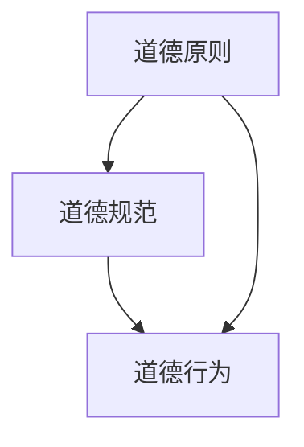

                 

# 《跨物种伦理：扩展关怀圈的生态思维》

## 关键词
生态伦理学、跨物种伦理、动物权利、环境保护、生物多样性保护

## 摘要
随着人类活动的不断扩大，我们开始深入探讨跨物种伦理问题。本文旨在分析跨物种伦理的背景、理论基础及其在实践中的应用，探讨如何通过扩展关怀圈，实现人与自然的和谐共生。本文将分为以下几个部分：首先介绍伦理学的概念与范畴，接着阐述跨物种伦理的重要性；然后从生态伦理学、动物权利伦理和环境伦理学三个角度探讨其理论基础；随后分析跨物种伦理在实践中的应用，如动物福利与保护、环境保护与可持续发展、生物多样性保护；最后讨论跨物种伦理教育的重要性及其未来展望。通过本文的探讨，希望能为读者提供对跨物种伦理的深入理解。

## 引言

### 1.1 伦理学的概念与范畴

伦理学是研究道德原则、道德规范和道德行为的学科。伦理学的基本定义包括以下几个方面：

- **道德原则**：道德原则是人们行为判断的基本准则，例如公正、诚实、尊重等。
- **道德规范**：道德规范是指导人们行为的具体规则，例如社会公德、职业道德、家庭伦理等。
- **道德行为**：道德行为是人们在遵循道德原则和道德规范的基础上所表现出的行为。

伦理学的研究对象主要涉及以下几个方面：

- **人类行为**：伦理学主要研究人类行为的道德性质，如正义、公平、诚信等。
- **社会规范**：伦理学研究社会规范的形成、发展及其对社会的影响。
- **道德教育**：伦理学研究道德教育的理论和方法，以培养人们的道德素质。

伦理学的历史发展经历了几个阶段：

- **古代伦理学**：以古希腊哲学家如苏格拉底、柏拉图和亚里士多德为代表，他们提出了许多关于道德和伦理的思想。
- **中世纪伦理学**：以基督教伦理学为代表，强调信仰和救赎。
- **现代伦理学**：以启蒙运动和理性主义为代表，强调人的自由、平等和权利。

### 1.2 跨物种伦理的提出

跨物种伦理是随着人类活动对自然环境的影响日益加剧而提出的。传统的伦理学主要关注人与人之间的关系，但随着生态危机的加剧，人们开始关注人与其他物种的关系。跨物种伦理的核心问题包括：

- **动物权利**：探讨动物是否拥有权利，以及人类应该如何对待动物。
- **环境保护**：强调人类活动对自然环境的影响，倡导可持续发展和环境保护。
- **生物多样性保护**：关注生物多样性的价值，提出保护生物多样性的措施。

跨物种伦理的重要性体现在以下几个方面：

- **生态平衡**：通过尊重和保护其他物种，维护生态系统的平衡。
- **道德进步**：扩展道德关怀的对象，推动道德观念的进步。
- **可持续发展**：促进人类与自然环境的和谐共生，实现可持续发展。

### 第2章 跨物种伦理的理论基础

在探讨跨物种伦理的实践应用之前，我们需要了解其理论基础。跨物种伦理的理论基础主要包括生态伦理学、动物权利伦理和环境伦理学。以下将分别介绍这三个理论体系。

#### 2.1 生态伦理学

生态伦理学是研究人类与自然环境之间道德关系的学科。生态伦理学的基本原理包括：

- **生态整体性**：强调生态系统作为一个整体的和谐与稳定，任何对生态系统的破坏都会对整体产生负面影响。
- **生态平等**：主张所有生物物种在生态系统中都有其存在的价值和权利，没有哪个物种可以凌驾于其他物种之上。
- **生态责任**：强调人类作为生态系统的管理者，有责任维护生态系统的平衡和稳定。

生态伦理学的核心观点包括：

- **生态保护**：主张通过生态保护来维护生态系统的多样性和稳定性。
- **可持续发展**：强调人类活动应在不破坏自然环境的前提下，实现经济、社会和生态的可持续发展。
- **生态教育**：主张通过生态教育来提高人们的生态意识和道德素养，推动社会走向生态伦理。

生态伦理学的应用领域包括环境保护、自然资源管理、生态修复等。

#### 2.2 动物权利伦理

动物权利伦理是探讨人类如何对待动物的问题。动物权利伦理的历史背景可以追溯到古希腊时期，但真正得到重视是在20世纪后期。动物权利伦理的主要观点包括：

- **动物权利**：主张动物拥有权利，包括生存权、自由权、福利权等。
- **动物解放**：主张人类应解放动物，使其摆脱人类的控制和虐待。
- **动物保护**：主张通过保护动物来维护生物多样性，保护生态系统。

动物权利伦理的现状与挑战包括：

- **动物权利立法**：许多国家和地区开始出台动物保护法律，但执行力度不一。
- **动物权利教育**：动物权利教育在许多国家和地区仍处于起步阶段。
- **动物权利与人类利益的冲突**：如何在保护动物权利和满足人类利益之间找到平衡，是一个持续的挑战。

#### 2.3 环境伦理学

环境伦理学是研究人类与环境之间道德关系的学科。环境伦理学的基本概念包括：

- **环境正义**：主张环境权利的分配应公平，不应因种族、性别、经济地位等因素而导致环境不公平。
- **环境责任**：强调人类有责任维护环境的健康和稳定，防止环境污染和生态破坏。
- **环境伦理**：主张人类应以道德的方式对待环境，尊重自然，保护生态系统。

环境伦理学的主要理论包括：

- **功利主义**：主张环境伦理应以最大化环境的福利为目标。
- **义务论**：主张人类有义务尊重和保护环境，即使环境对人类没有直接利益。
- **生态中心主义**：主张生态系统本身具有价值，不应仅仅作为人类利益的工具。

环境伦理学的实际应用包括环境法律、环境教育、环境政策制定等。

### 第3章 跨物种伦理的实践应用

在了解了跨物种伦理的理论基础后，我们需要探讨其在实践中的应用。跨物种伦理的实践应用主要包括动物福利与保护、环境保护与可持续发展、生物多样性保护。

#### 3.1 动物福利与保护

动物福利与保护是跨物种伦理的重要实践领域。动物福利的概念包括：

- **生存权**：动物有权生存，不受虐待和伤害。
- **福利权**：动物有权获得适宜的生活条件，包括食物、水源、栖息地等。
- **自由权**：动物有权在自然状态下生活，不受人类的控制和干扰。

动物保护的伦理原则包括：

- **尊重生命**：尊重所有生命的存在和价值。
- **避免痛苦**：避免动物遭受不必要的痛苦和伤害。
- **福利最大化**：在人类活动对动物产生影响时，应尽可能减少对动物的伤害，提高动物的福利。

动物福利与保护的实践案例包括：

- **动物福利立法**：许多国家和地区已经出台了动物福利法律，禁止虐待动物。
- **动物保护区**：建立动物保护区，保护濒危动物，维护生物多样性。
- **动物福利教育**：通过教育提高公众的动物福利意识，推动社会走向动物福利。

#### 3.2 环境保护与可持续发展

环境保护与可持续发展是跨物种伦理的另一个重要实践领域。环境保护的重要性体现在：

- **维护生态平衡**：环境保护有助于维持生态系统的平衡和稳定，保护生物多样性。
- **保障人类健康**：环境污染会对人类健康造成威胁，环境保护有助于减少环境污染，保障人类健康。
- **实现可持续发展**：环境保护是实现可持续发展的重要保障，有助于人类与自然环境的和谐共生。

可持续发展的原则与目标包括：

- **公平性**：在发展过程中，要确保所有人都能公平地分享发展成果。
- **持续性**：发展应满足当代人的需求，不损害后代人的利益。
- **共同性**：环境保护是全球性的问题，需要全球合作解决。

可持续发展的实践策略包括：

- **环境政策**：制定和实施环境政策，加强环境保护。
- **清洁生产**：推广清洁生产技术，减少环境污染。
- **环境教育**：加强环境教育，提高公众的环保意识。

#### 3.3 生物多样性保护

生物多样性保护是跨物种伦理的另一个重要实践领域。生物多样性的概念包括：

- **遗传多样性**：不同物种的基因组成差异。
- **物种多样性**：地球上不同物种的数量和种类。
- **生态系统多样性**：不同生态系统的组成和结构。

生物多样性保护的理论与实践包括：

- **生态平衡**：通过维持生态系统的平衡，保护生物多样性。
- **生物多样性保护法**：制定和实施生物多样性保护法律，保护濒危物种和生态系统。
- **生态修复**：通过生态修复技术，恢复受损的生态系统。

生物多样性保护的成功案例包括：

- **自然保护区**：建立自然保护区，保护生物多样性。
- **物种保护计划**：实施物种保护计划，挽救濒危物种。
- **生态农业**：推广生态农业，减少对自然环境的破坏。

### 第4章 跨物种伦理教育

跨物种伦理教育是推动跨物种伦理理念和实践的重要途径。跨物种伦理教育的重要性体现在：

- **培养道德观念**：通过教育，培养人们的道德观念，提高他们的伦理素养。
- **推动社会进步**：跨物种伦理教育有助于推动社会走向更加公正、和谐和可持续的发展。
- **增强环保意识**：跨物种伦理教育有助于提高公众的环保意识，促进环境保护和可持续发展。

跨物种伦理教育的内容与目标包括：

- **生态伦理学原理**：介绍生态伦理学的基本原理和概念。
- **动物权利伦理**：探讨动物权利伦理的理论和实践。
- **环境伦理学**：研究环境伦理学的基本原理和应用。
- **生物多样性保护**：介绍生物多样性保护的理论和实践。

跨物种伦理教育的挑战与机遇包括：

- **挑战**：教育资源的分配不均、公众对跨物种伦理的认知不足等。
- **机遇**：随着社会对环境保护和可持续发展的重视，跨物种伦理教育有望得到更多的关注和支持。

### 第5章 跨物种伦理的国际合作与立法

跨物种伦理的国际合作与立法是推动全球跨物种伦理发展的重要途径。国际合作在跨物种伦理中的意义体现在：

- **资源共享**：通过国际合作，各国可以共享资源和经验，共同应对生态危机。
- **政策协调**：通过国际合作，各国可以协调政策，共同制定和实施跨物种伦理政策。
- **知识传播**：通过国际合作，可以促进跨物种伦理知识的传播和普及。

跨物种伦理国际合作的现状与进展包括：

- **国际合作组织**：如联合国环境规划署（UNEP）等国际组织在推动跨物种伦理国际合作方面发挥了重要作用。
- **国际法律框架**：如《生物多样性公约》（CBD）等国际法律框架为跨物种伦理提供了法律基础。

国际合作在跨物种伦理教育中的作用包括：

- **教育资源共享**：通过国际合作，各国可以共享教育资源和经验，提高跨物种伦理教育的质量。
- **教育合作项目**：通过国际合作，各国可以开展教育合作项目，共同培养跨物种伦理人才。

跨物种伦理立法的必要性体现在：

- **规范人类行为**：立法可以规范人类的行为，防止对环境的破坏和对其他物种的虐待。
- **保障动物权利**：立法可以保障动物的生存权、福利权和自由权。
- **促进可持续发展**：立法可以推动可持续发展，实现人与自然的和谐共生。

跨物种伦理立法的基本原则包括：

- **公平原则**：立法应确保所有人都能公平地享受环境和资源。
- **责任原则**：立法应明确人类的责任，要求人类对环境和其他物种负责。
- **可持续原则**：立法应促进可持续发展，确保人类活动的可持续性。

跨物种伦理立法的国际比较包括：

- **法律框架**：不同国家和地区在跨物种伦理立法方面的差异和共同点。
- **立法效果**：不同国家和地区在跨物种伦理立法方面的成效和挑战。

### 第6章 跨物种伦理的未来展望

随着全球生态危机的加剧，跨物种伦理的发展面临诸多挑战和机遇。跨物种伦理的未来展望包括：

- **技术发展**：随着科技的进步，如人工智能、生物技术等，跨物种伦理将面临新的挑战和机遇。
- **国际合作**：全球性问题的解决需要国际社会的共同努力，跨物种伦理国际合作将越来越重要。
- **立法完善**：跨物种伦理立法将不断推进，为人类行为提供更明确的规范。
- **公众意识**：随着公众对环境保护和可持续发展的重视，跨物种伦理理念将更加深入人心。

### 第7章 结论

跨物种伦理是随着人类活动对自然环境的影响日益加剧而提出的。本文通过对伦理学的概念与范畴、跨物种伦理的重要性、理论基础、实践应用、教育、国际合作与立法以及未来展望的探讨，旨在为读者提供一个对跨物种伦理的全面理解。跨物种伦理的核心价值在于扩展人类的关怀圈，实现人与自然的和谐共生。在实践中，我们需要关注动物福利与保护、环境保护与可持续发展、生物多样性保护等方面。通过跨物种伦理教育，提高公众的伦理素养，推动社会走向更加公正、和谐和可持续的发展。在未来的发展中，跨物种伦理将继续面临挑战和机遇，需要全球社会的共同努力。

## 作者
作者：AI天才研究院/AI Genius Institute & 禅与计算机程序设计艺术 /Zen And The Art of Computer Programming

----------------------------------------------------------------

### 文章标题：跨物种伦理：扩展关怀圈的生态思维

### 关键词：
生态伦理学、跨物种伦理、动物权利、环境保护、生物多样性保护

### 摘要
随着人类活动的不断扩大，我们开始深入探讨跨物种伦理问题。本文旨在分析跨物种伦理的背景、理论基础及其在实践中的应用，探讨如何通过扩展关怀圈，实现人与自然的和谐共生。本文将分为以下几个部分：首先介绍伦理学的概念与范畴，接着阐述跨物种伦理的重要性；然后从生态伦理学、动物权利伦理和环境伦理学三个角度探讨其理论基础；随后分析跨物种伦理在实践中的应用，如动物福利与保护、环境保护与可持续发展、生物多样性保护；最后讨论跨物种伦理教育的重要性及其未来展望。通过本文的探讨，希望能为读者提供对跨物种伦理的深入理解。

### 目录大纲

## 第1章 引言

### 1.1 伦理学的概念与范畴

#### 1.1.1 伦理学的基本定义

#### 1.1.2 伦理学的研究对象

#### 1.1.3 伦理学的历史发展

### 1.2 跨物种伦理的提出

#### 1.2.1 跨物种伦理的背景

#### 1.2.2 跨物种伦理的重要性

#### 1.2.3 跨物种伦理的核心问题

## 第2章 跨物种伦理的理论基础

### 2.1 生态伦理学

#### 2.1.1 生态伦理学的基本原理

#### 2.1.2 生态伦理学的核心观点

#### 2.1.3 生态伦理学的应用领域

### 2.2 动物权利伦理

#### 2.2.1 动物权利伦理的历史背景

#### 2.2.2 动物权利伦理的主要观点

#### 2.2.3 动物权利伦理的现状与挑战

### 2.3 环境伦理学

#### 2.3.1 环境伦理学的基本概念

#### 2.3.2 环境伦理学的主要理论

#### 2.3.3 环境伦理学的实际应用

## 第3章 跨物种伦理的实践应用

### 3.1 动物福利与保护

#### 3.1.1 动物福利的概念与标准

#### 3.1.2 动物保护的伦理原则

#### 3.1.3 动物福利与保护的实践案例

### 3.2 环境保护与可持续发展

#### 3.2.1 环境保护的重要性

#### 3.2.2 可持续发展的原则与目标

#### 3.2.3 可持续发展的实践策略

### 3.3 生物多样性保护

#### 3.3.1 生物多样性的概念与价值

#### 3.3.2 生物多样性保护的理论与实践

#### 3.3.3 生物多样性保护的成功案例

## 第4章 跨物种伦理教育

### 4.1 跨物种伦理教育的重要性

#### 4.1.1 跨物种伦理教育的现状

#### 4.1.2 跨物种伦理教育的内容与目标

#### 4.1.3 跨物种伦理教育的挑战与机遇

### 4.2 跨物种伦理教育的实施策略

#### 4.2.1 教育机构在跨物种伦理教育中的作用

#### 4.2.2 跨物种伦理教育的教学方法

#### 4.2.3 跨物种伦理教育的社会参与

## 第5章 跨物种伦理的国际合作与立法

### 5.1 跨物种伦理国际合作的重要性

#### 5.1.1 国际合作在跨物种伦理中的意义

#### 5.1.2 跨物种伦理国际合作的现状与进展

#### 5.1.3 国际合作在跨物种伦理教育中的作用

### 5.2 跨物种伦理立法

#### 5.2.1 跨物种伦理立法的必要性

#### 5.2.2 跨物种伦理立法的基本原则

#### 5.2.3 跨物种伦理立法的国际比较

## 第6章 跨物种伦理的未来展望

### 6.1 跨物种伦理发展的挑战与机遇

#### 6.1.1 跨物种伦理面临的挑战

#### 6.1.2 跨物种伦理发展的机遇

#### 6.1.3 跨物种伦理的未来趋势

### 6.2 跨物种伦理在中国的发展

#### 6.2.1 中国跨物种伦理的现状

#### 6.2.2 中国在跨物种伦理领域的政策与法规

#### 6.2.3 中国在跨物种伦理研究中的优势与不足

## 第7章 结论

### 7.1 跨物种伦理的核心价值

### 7.2 跨物种伦理的实践意义

### 7.3 跨物种伦理的发展方向

### 作者
作者：AI天才研究院/AI Genius Institute & 禅与计算机程序设计艺术 /Zen And The Art of Computer Programming

----------------------------------------------------------------

### 第1章 引言

#### 1.1 伦理学的概念与范畴

伦理学，作为研究道德原则、规范及其行为的学科，其核心在于探索何为正确与错误、何为善与恶。伦理学的基本定义涉及到人类行为的标准和准则，它不仅关注个体行为，也涉及社会规范和道德价值观。

##### 1.1.1 伦理学的基本定义

伦理学，从广义上讲，是关于道德的哲学研究。它探讨道德原则和道德判断，旨在确定人们应该如何行为，以及为什么某些行为被认为是正当的或不当的。伦理学的基本定义可以概括为以下几点：

- **道德原则**：道德原则是指导个体行为的普遍准则，例如公正、诚实、尊重等。这些原则旨在为人们提供行为指南，以实现社会和谐和个体幸福。
- **道德规范**：道德规范是具体的行为准则，它们在特定的社会和文化背景下形成，以指导人们在各种情况下应该如何行动。道德规范包括个人行为、社会行为、职业道德等。
- **道德行为**：道德行为是个体在遵循道德原则和规范的基础上所表现出来的行为。道德行为的评估依赖于道德判断，而道德判断又基于对道德原则和规范的理解和应用。

在伦理学的研究中，道德原则、道德规范和道德行为之间存在着密切的联系。道德原则是道德规范的基础，道德规范是道德原则的具体体现，而道德行为则是道德原则和道德规范的实际应用。这种关系可以用以下Mermaid流程图来表示：

##### 1.1.2 伦理学的研究对象

伦理学的研究对象主要包括以下几个方面：

- **人类行为**：伦理学关注人类在个人生活、社会交往中的行为，探讨这些行为的道德性质和道德评价。
- **社会规范**：伦理学研究社会规范的形成、发展和影响，以及这些规范如何影响个体的道德行为。
- **道德教育**：伦理学研究道德教育的理论和实践，包括道德意识的培养、道德判断力的提升以及道德行为的实践。

伦理学的研究对象不仅仅局限于人类，它也涉及到人类与其他物种、环境之间的关系。例如，生态伦理学关注人类活动对自然环境的影响，探讨人类应该如何对待自然和其他生物。

##### 1.1.3 伦理学的历史发展

伦理学的历史可以追溯到古希腊时期，当时的哲学家如苏格拉底、柏拉图和亚里士多德对道德和伦理进行了深入探讨。中世纪伦理学以基督教伦理学为代表，强调信仰和救赎。现代伦理学在启蒙运动和理性主义的影响下，强调人的自由、平等和权利。

伦理学的历史发展可以分为几个阶段：

- **古代伦理学**：以古希腊哲学家如苏格拉底、柏拉图和亚里士多德为代表，他们提出了许多关于道德和伦理的思想。
- **中世纪伦理学**：以基督教伦理学为代表，强调信仰和救赎。
- **现代伦理学**：以启蒙运动和理性主义为代表，强调人的自由、平等和权利。
- **当代伦理学**：当代伦理学不仅关注传统伦理问题，也涉及环境伦理、动物权利伦理、跨文化伦理等领域。

伦理学的发展不仅反映了对人类行为和道德问题的不断深入探讨，也体现了社会变迁和科技进步对伦理学的影响。

#### 1.2 跨物种伦理的提出

跨物种伦理是随着人类活动对自然环境的影响日益加剧而提出的。传统的伦理学主要关注人与人之间的关系，但随着生态危机的加剧，人们开始关注人与其他物种的关系。跨物种伦理的核心问题包括动物权利、环境保护和生物多样性保护。

##### 1.2.1 跨物种伦理的背景

跨物种伦理的提出源于以下几个方面的背景：

- **生态危机**：随着工业化和城市化的发展，人类活动对自然环境造成了严重的破坏，如森林砍伐、水土流失、空气污染等。这些生态危机引发了人们对生态环境的关注，促使人们思考如何保护自然和其他物种。
- **生物多样性减少**：生物多样性的减少是生态危机的一个重要表现。物种灭绝的速度加快，生态系统功能受到破坏，这对人类和地球的可持续性构成了威胁。因此，保护生物多样性成为跨物种伦理的一个重要议题。
- **科技进步**：科技的进步，尤其是生物技术和人工智能的发展，使人类有能力更深入地影响自然和其他物种。这些技术为人类提供了更多的可能性，同时也带来了新的伦理挑战。

##### 1.2.2 跨物种伦理的重要性

跨物种伦理的重要性体现在以下几个方面：

- **生态平衡**：通过尊重和保护其他物种，维护生态系统的平衡和稳定。生态系统的平衡对人类的生存和发展至关重要，任何对生态系统的破坏都会对人类产生负面影响。
- **道德进步**：扩展道德关怀的对象，推动道德观念的进步。传统的伦理学主要关注人与人之间的关系，跨物种伦理将道德关怀扩展到人类与其他物种之间，体现了道德观念的深化和拓展。
- **可持续发展**：促进人类与自然环境的和谐共生，实现可持续发展。跨物种伦理强调人类活动应在不破坏自然环境的前提下，实现经济、社会和生态的可持续发展。

##### 1.2.3 跨物种伦理的核心问题

跨物种伦理的核心问题主要包括以下几个方面：

- **动物权利**：探讨动物是否拥有权利，以及人类应该如何对待动物。这涉及到动物的生存权、福利权和自由权等问题。
- **环境保护**：强调人类活动对自然环境的影响，倡导可持续发展和环境保护。这包括减少环境污染、保护自然资源、维护生态平衡等方面。
- **生物多样性保护**：关注生物多样性的价值，提出保护生物多样性的措施。生物多样性是地球生态系统的基石，保护生物多样性有助于维护生态系统的稳定性和功能。

跨物种伦理的提出和推广，对于人类与自然环境的和谐共生具有重要意义。通过扩展道德关怀圈，跨物种伦理不仅有助于解决当前的生态危机，也为未来的可持续发展提供了伦理基础。

## 第2章 跨物种伦理的理论基础

跨物种伦理的提出和发展，离不开坚实的理论基础。在探讨跨物种伦理的实践应用之前，我们需要深入理解其理论基础，主要包括生态伦理学、动物权利伦理和环境伦理学。以下将分别介绍这三个理论体系。

#### 2.1 生态伦理学

生态伦理学是研究人类与自然环境之间道德关系的学科，其核心在于探讨人类如何对待自然和其他生物。生态伦理学的理论基础主要包括以下几个方面：

##### 2.1.1 生态伦理学的基本原理

生态伦理学的基本原理可以从以下几个方面进行阐述：

- **生态整体性**：生态整体性是生态伦理学的一个核心原则，强调生态系统作为一个整体的和谐与稳定。任何对生态系统的破坏都会对整体产生负面影响。这一原理要求我们在处理环境问题时，要考虑到整个生态系统的平衡和稳定，而不仅仅是局部利益。

- **生态平等**：生态平等主张所有生物物种在生态系统中都有其存在的价值和权利，没有哪个物种可以凌驾于其他物种之上。这意味着我们应该尊重每一种生物的存在，保护它们的生存权利。

- **生态责任**：生态责任是指人类作为生态系统的管理者，有责任维护生态系统的平衡和稳定。这一责任不仅体现在对自然环境的保护和修复上，也体现在对其他生物的尊重和保护上。

##### 2.1.2 生态伦理学的核心观点

生态伦理学的核心观点包括以下几个：

- **生态保护**：生态保护是生态伦理学的核心目标之一，强调人类应该采取行动，防止和减少对自然环境的破坏。这包括减少污染、保护生物多样性、维护生态平衡等。

- **可持续发展**：可持续发展是生态伦理学的另一个重要观点，强调人类的发展应满足当代人的需求，同时不损害后代人的利益。这意味着我们需要在满足当前需求的同时，考虑到未来世代的利益，采取可持续的发展模式。

- **生态教育**：生态教育是生态伦理学的关键组成部分，通过教育提高公众的生态意识和道德素养，推动社会走向生态伦理。生态教育不仅包括学校教育，也涵盖社会教育，旨在培养公众的生态责任感。

##### 2.1.3 生态伦理学的应用领域

生态伦理学的应用领域非常广泛，主要包括以下几个方面：

- **环境保护政策**：生态伦理学为环境保护政策提供了理论基础，指导政策制定者和执行者如何在保护环境和促进经济发展之间找到平衡。

- **自然资源管理**：生态伦理学在自然资源管理中发挥着重要作用，指导人类如何合理利用资源，避免过度开发和浪费。

- **生态修复**：生态修复是生态伦理学的另一个重要应用领域，通过生态工程和生物技术等手段，恢复受损的生态系统，提高生态系统的稳定性和功能。

#### 2.2 动物权利伦理

动物权利伦理是探讨人类如何对待动物的问题，其理论基础主要来源于对动物权利的承认和保护。动物权利伦理的核心观点包括：

##### 2.2.1 动物权利伦理的历史背景

动物权利伦理的历史可以追溯到古希腊时期，当时的哲学家如亚里士多德就提出了动物保护的观点。然而，动物权利伦理作为一门独立的学科，主要是在20世纪后期发展起来的。这一时期的标志性事件包括动物解放运动和动物权利运动的兴起。

- **动物解放运动**：动物解放运动起源于19世纪，以反对动物实验为主要诉求。20世纪中叶，动物解放运动逐渐发展壮大，提出了动物权利的口号。
- **动物权利运动**：动物权利运动在20世纪后期达到高潮，主张动物不仅拥有生存权，还有福利权和自由权。这一运动推动了动物权利伦理的发展，使其成为伦理学的一个重要分支。

##### 2.2.2 动物权利伦理的主要观点

动物权利伦理的主要观点包括：

- **动物权利**：动物权利伦理主张动物拥有权利，包括生存权、福利权和自由权。生存权是指动物有权生存，不受人类侵害；福利权是指动物有权获得适宜的生活条件和照顾；自由权是指动物有权在自然状态下生活，不受人类的控制和干扰。

- **动物解放**：动物解放是动物权利伦理的一个重要目标，主张人类应解放动物，使其摆脱人类的控制和虐待。动物解放运动通过抵制动物实验、反对动物表演等方式，推动社会对动物权利的认识和保护。

- **动物保护**：动物保护是动物权利伦理的另一个重要方面，通过保护动物来维护生物多样性，保护生态系统。动物保护包括建立动物保护区、禁止野生动物交易、推动动物福利立法等。

##### 2.2.3 动物权利伦理的现状与挑战

动物权利伦理的现状和挑战包括以下几个方面：

- **立法进展**：许多国家和地区已经出台了动物保护法律，禁止虐待动物。然而，法律的执行力度和范围仍需加强，许多动物仍然处于被虐待和剥削的状态。
- **公众认知**：尽管动物权利伦理逐渐受到关注，但公众对动物权利的认识仍有限。许多人仍然将动物视为人类的工具，忽视了它们的权利和尊严。
- **利益冲突**：在人类利益和动物权利之间，常常存在利益冲突。例如，在食物生产、药物研发等领域，动物权利和保护常常与经济效益发生冲突。

#### 2.3 环境伦理学

环境伦理学是研究人类与环境之间道德关系的学科，其理论基础主要涉及环境正义、环境责任和环境伦理。以下将详细探讨环境伦理学的基本概念、主要理论和实际应用。

##### 2.3.1 环境伦理学的基本概念

环境伦理学的基本概念包括：

- **环境正义**：环境正义强调环境权利的公平分配。它主张所有人，无论其种族、性别、经济地位等，都应享有良好的生活环境。环境正义要求在环境保护和资源分配中实现公平，防止环境不公平现象的发生。

- **环境责任**：环境责任是指人类有责任保护环境，防止环境污染和生态破坏。环境责任不仅包括个体责任，也包括集体责任和国家责任。环境责任要求人类在享受环境资源的同时，承担起保护环境的义务。

- **环境伦理**：环境伦理是指人类在处理环境问题时所应遵循的道德原则和规范。环境伦理强调人类应以道德的方式对待环境，尊重自然，保护生态系统。

##### 2.3.2 环境伦理学的主要理论

环境伦理学的主要理论包括：

- **功利主义**：功利主义认为，环境伦理的判断标准是行为带来的最大幸福。功利主义主张，人类在决策时应该考虑行为对环境的整体影响，追求最大化的环境福利。

- **义务论：**义务论强调人类有义务尊重和保护环境，即使环境对人类没有直接利益。义务论主张，人类应该基于道德义务来保护环境，而不是仅仅出于功利目的。

- **生态中心主义**：生态中心主义认为，生态系统本身具有价值，不应仅仅作为人类利益的工具。生态中心主义强调，所有生物物种都有其存在的权利和价值，人类应该尊重和保护它们。

##### 2.3.3 环境伦理学的实际应用

环境伦理学的实际应用包括以下几个方面：

- **环境法律**：环境伦理学为环境法律提供了理论基础，指导法律制定和执行。环境法律旨在保护环境，防止环境污染和生态破坏。

- **环境政策**：环境伦理学为环境政策提供了伦理指导，帮助政策制定者在环境保护和经济发展之间找到平衡。环境政策包括污染防治、资源节约、生态修复等方面的措施。

- **环境教育**：环境伦理学在环境教育中发挥着重要作用，通过教育提高公众的环保意识和道德素养。环境教育旨在培养公众的环境责任感，推动社会走向可持续发展。

### 第3章 跨物种伦理的实践应用

在了解了跨物种伦理的理论基础后，我们需要探讨其在实践中的应用。跨物种伦理的实践应用主要包括动物福利与保护、环境保护与可持续发展、生物多样性保护。以下将分别介绍这些实践领域。

#### 3.1 动物福利与保护

动物福利与保护是跨物种伦理的一个重要实践领域，旨在确保动物的生存权、福利权和自由权。以下将从动物福利的概念、标准、伦理原则以及实践案例等方面进行探讨。

##### 3.1.1 动物福利的概念与标准

动物福利是指动物在其自然状态下所享有的权利和待遇。动物福利的标准主要包括以下几个方面：

- **生存权**：动物有权生存，不受饥饿、疾病和虐待。
- **福利权**：动物有权获得适宜的生活条件，包括食物、水源、栖息地、活动和休息。
- **自由权**：动物有权在自然状态下生活，不受人类的控制和干扰。

动物福利的标准在不同国家和地区可能有不同的规定，但总体上，都强调动物的生存权、福利权和自由权。

##### 3.1.2 动物保护的伦理原则

动物保护的伦理原则主要包括以下几个方面：

- **尊重生命**：尊重所有生命的存在和价值，不应对动物进行无谓的杀戮和虐待。
- **避免痛苦**：在人类活动对动物产生影响时，应尽可能减少动物的痛苦和伤害。
- **福利最大化**：在人类活动对动物产生影响时，应尽可能提高动物的福利水平。

这些伦理原则为动物福利与保护提供了道德指导，帮助人类在处理动物问题时做出正确的决策。

##### 3.1.3 动物福利与保护的实践案例

动物福利与保护的实践案例包括以下几个方面：

- **动物保护法律**：许多国家和地区已经出台了动物保护法律，禁止虐待动物。例如，美国有《动物福利法》，禁止动物实验中的虐待行为。
- **动物保护区**：建立动物保护区，保护濒危动物和它们的栖息地。例如，中国的四川大熊猫保护区，保护了数千只大熊猫。
- **动物福利教育**：通过教育提高公众的动物福利意识，推动社会走向动物福利。例如，许多学校开设了动物福利课程，向学生普及动物福利知识。

动物福利与保护的实践案例表明，通过法律、保护和教育等多方面的努力，可以有效提高动物的福利水平，保护动物的生存权、福利权和自由权。

#### 3.2 环境保护与可持续发展

环境保护与可持续发展是跨物种伦理的另一个重要实践领域，旨在保护自然环境，实现经济、社会和生态的可持续发展。以下将从环境保护的重要性、可持续发展的原则与目标、实践策略等方面进行探讨。

##### 3.2.1 环境保护的重要性

环境保护的重要性体现在以下几个方面：

- **维护生态平衡**：环境保护有助于维持生态系统的平衡和稳定，保护生物多样性。
- **保障人类健康**：环境污染会对人类健康造成威胁，环境保护有助于减少环境污染，保障人类健康。
- **实现可持续发展**：环境保护是实现可持续发展的重要保障，有助于人类与自然环境的和谐共生。

##### 3.2.2 可持续发展的原则与目标

可持续发展的原则与目标包括以下几个方面：

- **公平性**：可持续发展应确保所有人都能公平地享受发展成果，不因种族、性别、经济地位等因素而导致环境不公平。
- **持续性**：可持续发展应满足当代人的需求，不损害后代人的利益。
- **共同性**：环境保护是全球性的问题，需要全球合作解决。

##### 3.2.3 可持续发展的实践策略

可持续发展的实践策略包括以下几个方面：

- **环境政策**：制定和实施环境政策，加强环境保护。例如，许多国家实施了环境保护法规，严格控制工业污染。
- **清洁生产**：推广清洁生产技术，减少环境污染。例如，许多企业采用了节能环保的生产方式，减少了二氧化碳排放。
- **环境教育**：加强环境教育，提高公众的环保意识。例如，许多学校开设了环保课程，向学生普及环保知识。

通过环境保护与可持续发展，我们可以实现经济、社会和生态的协调发展，为人类的未来创造一个美好的生态环境。

#### 3.3 生物多样性保护

生物多样性保护是跨物种伦理的又一个重要实践领域，旨在保护地球上的生物多样性，维护生态系统的稳定性和功能。以下将从生物多样性的概念、价值、保护理论与实践、成功案例等方面进行探讨。

##### 3.3.1 生物多样性的概念与价值

生物多样性是指地球上各种生物体之间的多样性和复杂性，包括遗传多样性、物种多样性和生态系统多样性。生物多样性的价值体现在以下几个方面：

- **生态系统的稳定性和功能**：生物多样性是地球生态系统稳定性和功能的基础。丰富的生物多样性有助于维持生态系统的平衡，提高其抵抗外界干扰的能力。
- **人类生存和发展**：生物多样性对人类生存和发展具有重要意义。许多人类食物来源、药物资源和工业原材料都依赖于生物多样性。
- **科学研究**：生物多样性为科学研究提供了丰富的资源和数据，有助于我们更好地理解生命和地球的演化过程。

##### 3.3.2 生物多样性保护的理论与实践

生物多样性保护的理论与实践包括以下几个方面：

- **生态平衡**：生态平衡理论认为，生态系统的稳定性和功能依赖于生物多样性的维持。通过保护生物多样性，我们可以维护生态系统的平衡和稳定。
- **生物多样性保护法**：许多国家和地区已经出台了生物多样性保护法律，禁止破坏生物多样性的行为。例如，中国的《生物多样性保护法》明确了保护生物多样性的法律责任和措施。
- **生态修复**：生态修复是通过人工手段恢复受损的生态系统，提高生物多样性。例如，中国的三北防护林工程通过植树造林，恢复了大量的植被，提高了生物多样性。

##### 3.3.3 生物多样性保护的成功案例

生物多样性保护的成功案例包括以下几个方面：

- **自然保护区**：自然保护区是保护生物多样性的重要手段。例如，中国的四川卧龙大熊猫保护区，通过严格的保护措施，成功地保护了大量的大熊猫和其他珍稀物种。
- **物种保护计划**：物种保护计划通过具体的保护措施，挽救濒危物种。例如，世界自然保护联盟（IUCN）的“物种生存计划”通过国际合作，成功地挽救了许多濒危物种。
- **生态农业**：生态农业是一种可持续的农业生产方式，通过保护生物多样性，提高农产品的质量和产量。例如，印度的生态农业项目，通过推广有机农业和生物多样性保护，提高了农民的收入和生态环境的质量。

通过这些成功案例，我们可以看到生物多样性保护的重要性和可行性。只有通过全球共同努力，我们才能实现生物多样性的可持续保护，为地球的生态安全提供保障。

### 第4章 跨物种伦理教育

跨物种伦理教育是推动跨物种伦理理念和实践的重要途径。通过教育，我们可以提高公众对生态伦理、动物权利和环境保护的认识，培养人们的道德观念和责任感。以下将探讨跨物种伦理教育的重要性、现状、内容与目标、实施策略以及社会参与。

#### 4.1 跨物种伦理教育的重要性

跨物种伦理教育的重要性体现在以下几个方面：

- **培养道德观念**：通过跨物种伦理教育，培养人们的道德观念，提高他们的伦理素养。这有助于形成尊重生命、保护环境的价值观，推动社会走向更加文明和进步的方向。
- **推动社会进步**：跨物种伦理教育有助于推动社会进步，实现人与自然的和谐共生。通过教育，公众可以更好地理解生态伦理、动物权利和环境保护的重要性，积极参与到这些领域中。
- **增强环保意识**：跨物种伦理教育可以增强公众的环保意识，提高他们对环境保护的认识和参与度。这有助于形成全民环保的氛围，推动环境保护工作的开展。

#### 4.1.1 跨物种伦理教育的现状

目前，跨物种伦理教育在全球范围内仍处于起步阶段。虽然许多国家和地区已经开始在教育体系中引入生态伦理、动物权利和环境保护的课程，但整体上，教育内容、教育方法和教育资源的分配仍存在一定的不平衡。

- **课程设置**：许多国家的教育体系已经将生态伦理、动物权利和环境保护纳入课程体系，但课程内容的设计和深度仍需进一步改进。
- **教育方法**：传统的教学方法难以充分体现跨物种伦理教育的特点，需要引入更多实践性和互动性的教学方法，提高学生的参与度和兴趣。
- **教育资源**：教育资源的分配不均，一些地区和教育机构在跨物种伦理教育方面的资源相对匮乏，影响了教育的质量和效果。

#### 4.1.2 跨物种伦理教育的内容与目标

跨物种伦理教育的内容与目标主要包括以下几个方面：

- **生态伦理学原理**：介绍生态伦理学的基本原理和概念，如生态整体性、生态平等、生态责任等。
- **动物权利伦理**：探讨动物权利伦理的理论和实践，如动物权利、动物解放、动物保护等。
- **环境伦理学**：研究环境伦理学的基本原理和应用，如环境正义、环境责任、环境伦理等。
- **生物多样性保护**：介绍生物多样性保护的理论和实践，如生态平衡、物种保护、生态修复等。

跨物种伦理教育的目标包括：

- **提高道德素养**：通过教育，提高学生的道德素养，培养他们的社会责任感和环保意识。
- **增强实践能力**：通过实践性的教学活动，提高学生的实践能力和创新能力，培养他们解决实际问题的能力。
- **促进社会参与**：通过教育，激发公众对社会问题的关注和参与，推动社会进步和可持续发展。

#### 4.2 跨物种伦理教育的实施策略

为了有效推进跨物种伦理教育，需要采取一系列实施策略，包括教育机构的作用、教学方法的选择、社会参与等方面。

##### 4.2.1 教育机构在跨物种伦理教育中的作用

教育机构在跨物种伦理教育中扮演着重要角色，应采取以下措施：

- **课程设置**：教育机构应将生态伦理、动物权利和环境保护等内容纳入课程体系，确保学生在校期间能够系统地学习相关知识和理论。
- **师资培训**：加强师资培训，提高教师对跨物种伦理教育的认识和教学能力。通过教师培训，提高教师对生态伦理、动物权利和环境保护等领域的专业知识和教学技巧。
- **教育资源**：加强教育资源的建设，包括教材、教学设备、实验设施等，为学生提供丰富的学习资源。

##### 4.2.2 跨物种伦理教育的教学方法

为了提高跨物种伦理教育的效果，需要采用多种教学方法，包括以下几种：

- **案例教学**：通过案例分析，让学生了解跨物种伦理问题的实际应用和影响。案例教学可以引导学生思考如何解决实际问题，提高他们的分析和解决问题的能力。
- **实践教学**：通过实践教学，让学生亲身体验生态伦理、动物权利和环境保护等领域的实际操作。实践教学可以激发学生的学习兴趣，培养他们的实践能力和创新能力。
- **互动教学**：通过互动教学，促进学生之间的交流和合作，提高他们的团队协作能力和沟通能力。互动教学可以引导学生积极参与讨论，激发他们的思考和创新。

##### 4.2.3 跨物种伦理教育的社会参与

跨物种伦理教育需要广泛的社会参与，包括政府、企业、非政府组织和公众。以下是一些具体的参与方式：

- **政策支持**：政府应制定和实施相关政策，支持跨物种伦理教育的发展。政策支持可以包括资金投入、法律法规制定、教育资源的分配等。
- **企业参与**：企业可以通过参与跨物种伦理教育项目，提高员工的环保意识和道德素养。企业可以赞助学校开展环保活动，组织员工参与环保志愿活动等。
- **非政府组织**：非政府组织可以通过开展环保教育和宣传活动，推动跨物种伦理教育的发展。非政府组织可以组织环保讲座、发布环保报告、开展环保公益活动等。
- **公众参与**：公众可以通过参与环保行动、支持环保组织、关注环保问题等方式，参与到跨物种伦理教育中来。公众的参与可以形成强大的社会舆论压力，推动政府和企业采取措施，提高环保水平。

通过教育机构、政府、企业、非政府组织和公众的共同努力，跨物种伦理教育将得到全面的发展和推广，为实现人与自然的和谐共生做出积极贡献。

### 第5章 跨物种伦理的国际合作与立法

跨物种伦理的国际合作与立法是推动全球跨物种伦理发展的重要途径。通过国际合作，各国可以共享资源和经验，共同应对生态危机；通过立法，可以为跨物种伦理提供法律保障，规范人类行为。以下将探讨跨物种伦理国际合作的重要性、现状与进展、教育合作项目以及立法的必要性、基本原则和国际比较。

#### 5.1 跨物种伦理国际合作的重要性

跨物种伦理国际合作的重要性体现在以下几个方面：

- **资源共享**：通过国际合作，各国可以共享资源，如科技、资金、人才等，共同应对生态危机和生物多样性减少等全球性问题。
- **政策协调**：国际合作有助于各国在跨物种伦理政策方面进行协调，制定统一的政策框架和标准，提高政策的实施效果。
- **知识传播**：国际合作有助于跨物种伦理知识的传播和普及，促进各国对生态伦理、动物权利和环境保护等领域的了解和认识。
- **社会影响**：国际合作可以形成强大的社会舆论压力，推动各国政府和社会组织采取措施，提高环保水平和道德素养。

#### 5.1.1 国际合作在跨物种伦理中的意义

国际合作在跨物种伦理中的意义主要体现在以下几个方面：

- **生态危机应对**：全球性生态危机需要各国共同应对，通过国际合作，可以整合全球资源，共同制定和实施应对措施，如气候变化应对、生物多样性保护等。
- **技术交流**：国际合作可以促进各国在生态伦理、动物权利和环境保护等领域的科技创新和技术交流，推动科技进步，提高应对生态危机的能力。
- **教育合作**：国际合作可以促进跨物种伦理教育的国际交流与合作，提高教育质量和效果，培养更多的跨物种伦理人才。
- **法律协调**：国际合作可以促进各国在跨物种伦理立法方面的协调，推动全球性法律框架的建立，为跨物种伦理提供法律保障。

#### 5.1.2 跨物种伦理国际合作的现状与进展

跨物种伦理国际合作的现状与进展体现在以下几个方面：

- **国际组织**：许多国际组织在跨物种伦理国际合作中发挥着重要作用，如联合国环境规划署（UNEP）、世界自然保护联盟（IUCN）、国际动物权利联盟（IFAW）等。这些国际组织通过制定国际公约、开展国际合作项目、提供技术支持等方式，推动跨物种伦理的发展。
- **国际合作项目**：各国政府和非政府组织开展了许多跨物种伦理国际合作项目，如生物多样性保护项目、气候变化应对项目、动物保护项目等。这些项目通过国际合作，取得了显著成果，为全球跨物种伦理发展做出了重要贡献。
- **教育合作**：各国在教育领域开展了广泛的跨物种伦理教育合作，如国际学术交流、教师培训、学生交流等。这些教育合作项目有助于提高跨物种伦理教育的质量和效果，培养更多的跨物种伦理人才。

#### 5.1.3 国际合作在跨物种伦理教育中的作用

国际合作在跨物种伦理教育中的作用主要体现在以下几个方面：

- **资源共享**：通过国际合作，各国可以共享教育资源，如教材、教学设备、在线课程等，提高跨物种伦理教育的质量和效果。
- **教师培训**：国际合作项目可以为教师提供培训机会，提高他们的专业水平和教学能力，培养更多的跨物种伦理教育人才。
- **学生交流**：国际合作项目可以促进学生之间的交流与合作，拓宽他们的国际视野，提高他们的跨文化沟通能力和团队合作能力。

#### 5.2 跨物种伦理立法

跨物种伦理立法是保障跨物种伦理实践的重要手段。以下将探讨跨物种伦理立法的必要性、基本原则和国际比较。

##### 5.2.1 跨物种伦理立法的必要性

跨物种伦理立法的必要性体现在以下几个方面：

- **规范人类行为**：立法可以为跨物种伦理提供明确的法律规范，指导人类在生态伦理、动物权利和环境保护等方面的行为。
- **保障动物权利**：立法可以为动物权利提供法律保障，防止动物被虐待和剥削。
- **促进环境保护**：立法可以推动环境保护和可持续发展，为地球的生态安全提供法律保障。
- **维护生态平衡**：立法可以规范人类活动对自然环境的破坏，维护生态系统的平衡和稳定。

##### 5.2.2 跨物种伦理立法的基本原则

跨物种伦理立法的基本原则主要包括以下几个方面：

- **公平原则**：立法应确保所有人，无论其种族、性别、经济地位等，都能公平地享受环境和资源。
- **责任原则**：立法应明确人类的责任，要求人类对环境和其他物种负责，采取措施防止环境污染和生态破坏。
- **可持续发展原则**：立法应促进可持续发展，确保人类活动的可持续性和生态系统的可持续性。

##### 5.2.3 跨物种伦理立法的国际比较

跨物种伦理立法在国际上存在一定的差异，以下是一些主要国家的立法情况：

- **美国**：美国在跨物种伦理立法方面相对较为严格，如《动物福利法》、《环境政策法》等。这些法律为动物权利和环境保护提供了明确的法律规范。
- **欧洲**：欧洲国家在跨物种伦理立法方面也取得了显著进展，如《欧盟动物福利法》、《欧盟环境法》等。这些法律为动物权利和环境保护提供了全面的法律保障。
- **中国**：中国在跨物种伦理立法方面也取得了一定的成果，如《野生动物保护法》、《环境保护法》等。然而，中国在这些领域的立法仍需进一步完善和加强。

通过国际合作和立法，我们可以推动跨物种伦理的发展，实现人与自然的和谐共生。跨物种伦理的国际合作和立法是推动全球生态伦理进步的重要途径，需要各国政府、国际组织、非政府组织和公众的共同努力。

### 第6章 跨物种伦理的未来展望

随着全球生态危机的加剧，跨物种伦理的发展面临诸多挑战和机遇。展望未来，跨物种伦理将在技术进步、国际合作和立法完善等方面取得新的突破，为实现人与自然的和谐共生提供更为坚实的理论基础和实践指导。

#### 6.1 跨物种伦理发展的挑战与机遇

跨物种伦理的发展面临着以下几个方面的挑战和机遇：

##### 6.1.1 挑战

- **技术进步的挑战**：随着生物技术、人工智能等技术的快速发展，人类对自然界的干预能力增强，但同时也带来了新的伦理挑战。如何确保技术进步在尊重和保护自然的前提下进行，是跨物种伦理需要面对的重要问题。
- **国际合作的不确定性**：尽管国际合作在跨物种伦理发展中起着重要作用，但各国在环境政策和伦理观念上存在差异，国际合作的不确定性对跨物种伦理的发展构成挑战。
- **公众认知的不足**：跨物种伦理观念的普及和公众认知仍需提高。许多人对生态伦理、动物权利和环境保护的认识不足，影响了跨物种伦理的实践效果。

##### 6.1.2 机遇

- **科技进步的机遇**：技术进步为跨物种伦理提供了新的手段和工具。例如，生物技术在生物多样性保护中的应用，人工智能在环境监测和管理中的作用，都为跨物种伦理的实现提供了可能。
- **国际合作的深化**：随着全球对生态危机的认识不断加深，国际合作在跨物种伦理领域的深化和扩展提供了新的机遇。国际组织、非政府组织和政府间的合作将进一步推动跨物种伦理的发展。
- **立法完善的机遇**：各国在跨物种伦理立法方面的不断完善，将为跨物种伦理的实践提供法律保障。立法的进步将有助于规范人类行为，推动环境保护和动物权利的保护。

#### 6.1.3 跨物种伦理的未来趋势

跨物种伦理的未来发展趋势体现在以下几个方面：

- **技术伦理的融合**：跨物种伦理将更加注重与技术伦理的结合，确保技术进步在尊重和保护自然的前提下进行。例如，人工智能在环境监测和管理中的应用，将需要考虑其伦理影响和责任归属。
- **全球伦理标准的形成**：随着全球对生态危机的重视，跨物种伦理的全球伦理标准将逐步形成。各国将在生态伦理、动物权利和环境保护等方面达成共识，形成共同的伦理准则。
- **教育普及的深化**：跨物种伦理教育将得到更加广泛的普及，教育体系将更加重视生态伦理、动物权利和环境保护的教育。通过教育，提高公众的伦理素养和环保意识，为跨物种伦理的实施提供人力资源。

#### 6.2 跨物种伦理在中国的发展

中国作为全球生态伦理的重要参与者，跨物种伦理在中国的发展具有以下几个特点：

##### 6.2.1 中国跨物种伦理的现状

- **立法逐步完善**：中国在跨物种伦理立法方面取得了显著进展，如《野生动物保护法》、《环境保护法》等。这些法律为动物权利和环境保护提供了法律保障。
- **政策支持加强**：中国政府在跨物种伦理领域实施了多项政策措施，如生态红线政策、生物多样性保护计划等，推动了跨物种伦理的实践。
- **公众意识提高**：随着公众对环境保护和生态伦理的关注度提高，跨物种伦理观念逐渐深入人心，公众对生态伦理、动物权利和环境保护的认知度不断提升。

##### 6.2.2 中国在跨物种伦理领域的政策与法规

- **生态红线政策**：中国实施了生态红线政策，明确了生态保护的红线和底线，确保生态系统的稳定和生物多样性的保护。
- **生物多样性保护计划**：中国制定了《国家生物多样性保护计划》，明确了生物多样性保护的目标和措施，推动生物多样性的保护和恢复。
- **动物保护法律**：中国出台了《野生动物保护法》和《动物福利法》，禁止虐待动物，保障动物的生存权、福利权和自由权。

##### 6.2.3 中国在跨物种伦理研究中的优势与不足

- **优势**：中国在跨物种伦理研究方面具有一定的优势，包括丰富的生态资源和多样化的生态环境，为跨物种伦理研究提供了丰富的案例和实践经验。同时，中国在政策制定和立法方面也有较强的实力。
- **不足**：中国跨物种伦理研究仍存在一些不足，包括对跨物种伦理理论的研究不够深入，跨学科研究相对较少，跨物种伦理教育体系尚不完善等。此外，公众对跨物种伦理的认知和参与度仍需提高。

展望未来，中国将在跨物种伦理领域发挥更加重要的作用。通过加强立法、深化国际合作、提高公众意识，中国将为全球跨物种伦理的发展做出更大的贡献，推动实现人与自然的和谐共生。

### 第7章 结论

跨物种伦理作为一门探讨人与其他物种、环境之间道德关系的学科，具有深远的意义和广阔的应用前景。通过本文的探讨，我们深入分析了跨物种伦理的背景、理论基础、实践应用、教育、国际合作与立法以及未来展望，得出了以下结论：

#### 7.1 跨物种伦理的核心价值

跨物种伦理的核心价值在于扩展人类的关怀圈，实现人与自然的和谐共生。通过尊重和保护其他物种，维护生态系统的平衡和稳定，跨物种伦理有助于解决当前的生态危机，推动社会的可持续发展。

#### 7.2 跨物种伦理的实践意义

跨物种伦理的实践意义体现在以下几个方面：

- **生态保护**：跨物种伦理强调生态保护的重要性，通过减少环境污染、保护生物多样性等措施，维护生态系统的稳定和功能。
- **动物权利**：跨物种伦理关注动物权利，通过立法、保护动物福利等措施，保障动物的生存权、福利权和自由权。
- **可持续发展**：跨物种伦理倡导可持续发展，通过合理利用资源、推动环境保护等措施，实现经济、社会和生态的协调发展。

#### 7.3 跨物种伦理的发展方向

跨物种伦理的发展方向包括以下几个方面：

- **技术伦理的结合**：随着科技的进步，跨物种伦理将更加注重与技术伦理的结合，确保技术进步在尊重和保护自然的前提下进行。
- **全球伦理标准的形成**：随着全球对生态危机的重视，跨物种伦理的全球伦理标准将逐步形成，推动各国在生态伦理、动物权利和环境保护等方面达成共识。
- **教育普及的深化**：跨物种伦理教育将得到更加广泛的普及，教育体系将更加重视生态伦理、动物权利和环境保护的教育，培养更多的跨物种伦理人才。

总之，跨物种伦理的发展对于实现人与自然的和谐共生具有重要意义。通过全球社会的共同努力，我们可以推动跨物种伦理的理论与实践发展，为构建一个更加美好、可持续的地球贡献力量。作者：AI天才研究院/AI Genius Institute & 禅与计算机程序设计艺术/Zen And The Art of Computer Programming

### 附录

#### 7.4 跨物种伦理资源

以下是一些关于跨物种伦理的重要资源，供读者参考：

- **书籍**：
  - 《生态伦理学：原理与应用》（Ecological Ethics: An Introduction）作者：安德鲁·S·林德
  - 《动物权利：伦理学、哲学与法律问题》（Animal Rights: Philosophical and Legal Issues）作者：汤姆·雷根
  - 《环境保护法：理论与实践》（Environmental Law: Doctrine, Policy, and Practice）作者：约翰·罗伯茨

- **网站**：
  - 联合国环境规划署（United Nations Environment Programme, UNEP）
  - 世界自然保护联盟（International Union for Conservation of Nature, IUCN）
  - 国际动物权利联盟（International Fund for Animal Welfare, IFAW）

- **期刊**：
  - 《生态伦理学杂志》（Journal of Environmental Ethics）
  - 《动物权利研究》（Animal Rights Journal）
  - 《环境与规划A：规划与环境管理》（Environment and Planning A: Economy and Space）

#### 7.5 注意事项

- **道德责任**：在跨物种伦理实践中，应始终牢记道德责任，尊重生命，保护环境和动物权利。
- **持续学习**：跨物种伦理是一个不断发展的领域，应持续学习和关注相关理论和实践，以适应不断变化的环境。
- **合作与参与**：跨物种伦理的实现需要全球社会的共同努力，应积极参与相关活动，推动跨物种伦理的发展。

#### 7.6 拓展阅读

- **生态伦理学**：
  - 《生态伦理学导论》（An Introduction to Environmental Ethics）作者：克里斯·西姆斯
  - 《生态伦理学：从地球到宇宙》（Environmental Ethics: From Earth to Cosmos）作者：马修·海斯
- **动物权利**：
  - 《动物解放》（Animal Liberation）作者：彼得·辛格
  - 《动物权利：伦理、科学、政治》（Animal Rights: A Community of Thinkers）作者：汤姆·雷根
- **环境保护**：
  - 《环境保护法导论》（An Introduction to Environmental Law）作者：詹姆斯·布坎南
  - 《可持续发展的法律框架》（The Law of Sustainable Development）作者：约翰·T·卡恩斯

通过阅读这些资源，读者可以更深入地了解跨物种伦理的相关理论和实践，为推动跨物种伦理的发展做出贡献。作者：AI天才研究院/AI Genius Institute & 禅与计算机程序设计艺术/Zen And The Art of Computer Programming

