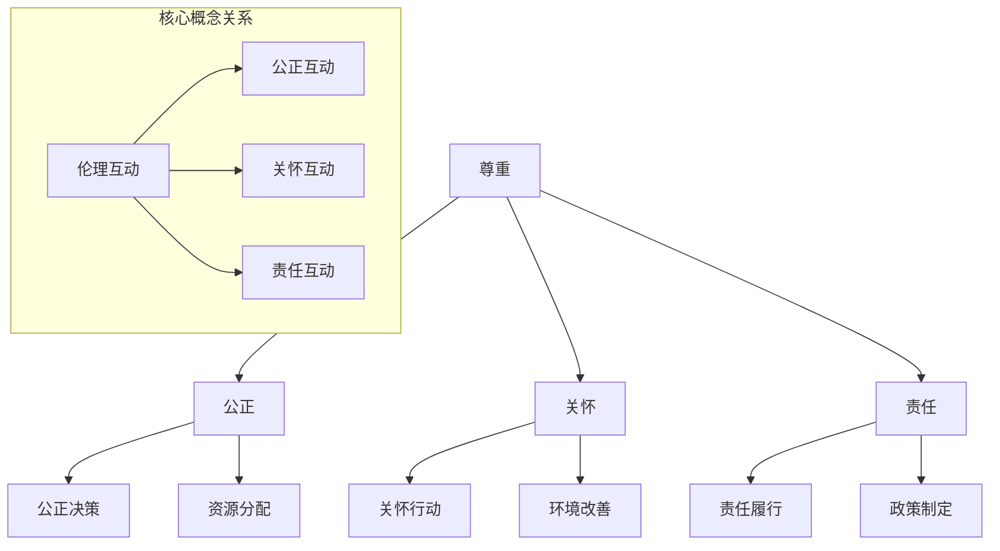

                 

跨物种伦理：扩展同理心的边界

关键词：跨物种伦理，同理心，动物权利，人工智能，环境伦理，文化差异，伦理扩展，实践方法，教育传播，未来展望

摘要：本文旨在探讨跨物种伦理的概念、理论基础、实际应用、挑战与争议，以及实践方法和未来展望。通过对核心概念的深入剖析，本文旨在为读者提供一个全面的理解，并思考如何扩展同理心的边界，实现跨物种伦理的实践。

# 引言

跨物种伦理是一个相对较新的研究领域，涉及人类与其他物种之间的道德关系。随着科技的发展和人类活动对环境的日益影响，跨物种伦理问题变得日益重要。本文将从以下几个方面进行探讨：

## 1. 跨物种伦理的定义与背景
### 1.1 跨物种伦理的定义

跨物种伦理是指人类在与其他物种互动过程中所遵循的道德规范和价值观。它超越了传统的人类中心主义，关注人类与其他物种之间的相互关系和道德责任。

### 1.2 背景介绍

随着环境破坏、物种灭绝和动物虐待问题的加剧，跨物种伦理成为了一个热门话题。人们开始反思人类与其他物种之间的关系，探讨如何平衡人类利益与其他物种的福祉。

## 2. 跨物种伦理的理论基础
### 2.1 伦理学的核心概念

伦理学是研究道德原则和价值观的学科。跨物种伦理的理论基础包括人类中心主义、动物权利伦理和生态伦理等。

### 2.2 跨物种同理心的基础

同理心是理解他人情感和经历的能力。跨物种同理心是指人类尝试理解其他物种的感受和需求。它是跨物种伦理的重要组成部分。

### 2.3 跨物种伦理的理论框架

跨物种伦理的理论框架包括基本原则、道德原则和伦理实践。基本原则包括尊重、公正、关怀和责任。道德原则则指导人类如何与其他物种互动。

## 3. 跨物种伦理的实际应用
### 3.1 动物权利保护

动物权利保护是跨物种伦理的重要应用领域。本文将探讨动物权利保护的法律、伦理和实际案例。

### 3.2 人工智能伦理

随着人工智能技术的快速发展，其伦理问题也日益引起关注。本文将讨论人工智能在伦理决策中的角色和挑战。

### 3.3 环境伦理

环境伦理关注人类与环境的关系。本文将探讨环境保护、可持续发展等环境伦理问题。

## 4. 跨物种伦理的挑战与争议
### 4.1 文化差异与伦理冲突

文化差异可能导致跨物种伦理的冲突。本文将分析不同文化背景下跨物种伦理的挑战。

### 4.2 科技发展与伦理规范

科技发展带来了新的伦理问题。本文将探讨科技发展对跨物种伦理的影响和挑战。

### 4.3 动物福利与人类利益

动物福利与人类利益之间的平衡是跨物种伦理的一个重要议题。本文将讨论如何平衡两者之间的关系。

## 5. 跨物种伦理的实践方法
### 5.1 倾听与理解

倾听和理解是跨物种伦理实践的基础。本文将探讨如何通过倾听和理解来增进与动物和其他物种的互动。

### 5.2 尊重与关怀

尊重和关怀是跨物种伦理的核心价值观。本文将讨论如何尊重动物的权利和需求，以及如何在日常生活中体现关怀。

### 5.3 合作与共荣

合作与共荣是实现跨物种伦理目标的关键。本文将探讨如何通过合作实现人类与其他物种的共同繁荣。

## 6. 跨物种伦理的教育与传播
### 6.1 学校教育中的伦理教育

学校教育在跨物种伦理教育中起着关键作用。本文将探讨如何在学校教育中引入跨物种伦理教育。

### 6.2 社会教育的作用

社会教育在跨物种伦理传播中具有重要作用。本文将分析社会教育如何促进跨物种伦理的理解和实践。

### 6.3 媒体与公共讨论

媒体和公共讨论是跨物种伦理传播的重要渠道。本文将探讨媒体和公共讨论在跨物种伦理教育中的作用。

## 7. 未来展望与伦理扩展
### 7.1 跨物种伦理的发展趋势

本文将分析跨物种伦理未来的发展趋势，以及可能的伦理扩展方向。

### 7.2 伦理扩展的可能性

伦理扩展是跨物种伦理研究的一个重要方向。本文将探讨伦理扩展的可能性及其意义。

### 7.3 跨物种伦理的边界与限制

跨物种伦理的边界和限制是值得探讨的问题。本文将分析跨物种伦理的边界和限制，以及如何克服这些限制。

## 结论

跨物种伦理是一个复杂而重要的研究领域。通过本文的探讨，我们希望读者能够对跨物种伦理有更深入的理解，并思考如何扩展同理心的边界，实现跨物种伦理的实践。

作者：AI天才研究院/AI Genius Institute & 禅与计算机程序设计艺术 /Zen And The Art of Computer Programming

----------------------------------------------------------------

## 1. 跨物种伦理的定义与背景

### 1.1 跨物种伦理的定义

跨物种伦理是一个相对较新的概念，主要关注人类与其他物种之间的道德关系。传统伦理学主要关注人类之间的道德规范和价值观，而跨物种伦理则扩展了这一范畴，将其他物种纳入伦理考虑的范围。跨物种伦理不仅仅关注人类对动物的责任，还包括对植物、微生物以及其他非人类物种的道德关怀。

跨物种伦理的核心概念包括尊重、公正、关怀和责任。尊重意味着尊重其他物种的权利和自由，不以自身利益为唯一标准。公正要求在与其他物种互动时保持公平，不偏袒任何一方。关怀则强调对其他物种的福利和福祉的关心，不仅限于动物权利保护。责任则是指人类在与其他物种互动时承担的道德义务。

### 1.2 背景介绍

跨物种伦理的兴起与人类对环境问题的日益关注密切相关。过去几十年，环境破坏、物种灭绝和动物虐待等问题引起了全球的关注。人类意识到，我们的行为不仅影响自己，也会对其他物种产生深远的影响。这种认识促使人们开始重新审视人类与其他物种之间的关系，探讨如何以道德和伦理的方式与它们互动。

科技进步也是跨物种伦理发展的重要驱动力。随着人工智能、生物技术和环境科学的发展，人类能够更好地理解其他物种的行为和需求。这些技术不仅提供了新的工具和方法来研究伦理问题，也带来了新的伦理挑战。例如，人工智能在动物福利监控中的应用，如何在确保技术高效的同时尊重动物的权利，成为了一个重要的伦理议题。

此外，文化差异和全球化也影响了跨物种伦理的讨论。不同的文化和社会对伦理有不同的理解和实践。全球化使得不同文化之间的互动更加频繁，也带来了伦理观念的碰撞和融合。这种多元文化的背景要求我们以包容和开放的态度来探讨跨物种伦理，尊重不同的伦理观念和价值观。

总之，跨物种伦理的定义和背景反映了人类对道德责任和伦理关怀的扩展。随着环境问题和科技进步的加剧，跨物种伦理成为一个重要的研究领域，值得我们深入探讨和思考。

### 1.3 跨物种伦理的发展历史

跨物种伦理作为一个新兴领域，其发展历史相对较短，但已经经历了一些关键阶段。最早的关注可以追溯到20世纪中叶，当时动物权利运动开始兴起，一些哲学家和科学家开始探讨人类与动物之间的道德关系。

**第一阶段：动物权利运动的兴起（1960-1980年代）**

动物权利运动的兴起是跨物种伦理发展的一个重要起点。1975年，彼得·辛格（Peter Singer）发表了《动物解放》一书，这是动物权利运动的重要文献。辛格提出，动物应该享有与人类相似的权利，不能仅仅被视为人类的工具。这一观点引发了广泛的讨论，促使人们重新思考人类对待动物的方式。

在此期间，一些动物权利组织和活动家也积极推动动物福利保护。例如，1966年成立的动物保护协会（Animal Liberation Front）和1977年成立的动物权利基金会（Foundation for Animal Rights）等组织，通过宣传和教育，提高了公众对动物权利的认识。

**第二阶段：生态伦理和环境伦理的发展（1980-2000年代）**

随着环境问题的日益严重，生态伦理和环境伦理逐渐成为跨物种伦理研究的重要方向。1980年代，诺尔斯顿·凯勒（Naomi Klein）的《我们的世界是否结束？》（The End of History and the Last Man）一书探讨了人类与自然环境的关系，提出了生态伦理的重要观点。

与此同时，环境伦理学家如约翰·罗尔斯（John Rawls）和皮特·辛格（Peter Singer）等，开始研究人类如何对待生态系统和其他非人类物种。这一阶段的跨物种伦理研究不仅关注动物权利，还涉及到环境保护和可持续发展等问题。

**第三阶段：科技进步与跨物种伦理的新挑战（2000年代至今）**

进入21世纪，随着科技进步，尤其是人工智能和生物技术的发展，跨物种伦理面临新的挑战和机遇。人工智能的应用，例如在动物行为监测和生物医学研究中的使用，引发了关于数据伦理和动物福利的新问题。

同时，基因编辑技术如CRISPR的突破，使得人类能够改变动植物的基因组，这带来了新的伦理争议。如何在科技进步的同时，确保伦理原则得到遵守，成为跨物种伦理研究的一个重要方向。

总的来说，跨物种伦理的发展历史反映了人类对道德责任和伦理关怀的不断扩展。从动物权利运动到生态伦理和环境伦理，再到科技进步带来的新挑战，跨物种伦理的研究在不断深化和拓展，为解决现实世界中的伦理问题提供了重要的理论支持和实践指导。

### 1.4 跨物种伦理的核心概念

跨物种伦理的核心概念包括尊重、公正、关怀和责任。这些概念构成了跨物种伦理的基础，指导人类与其他物种之间的互动。

**1.4.1 尊重**

尊重是跨物种伦理的首要原则，意味着我们应该尊重其他物种的权利和自由，不将它们视为仅仅是工具或资源。这种尊重不仅体现在对动物权利的保护，还涉及到对植物、微生物和其他非人类物种的关怀。尊重要求我们认识到每个物种都有其独特的价值和存在意义，不应仅仅以人类利益为衡量标准。

**1.4.2 公正**

公正是跨物种伦理的重要原则，要求我们在与其他物种互动时保持公平，不偏袒任何一方。公正体现在伦理决策中，例如在资源分配、环境保护和科技应用等方面。公正的原则有助于确保人类与其他物种之间的互动不会导致不公平的结果，促进生态系统的平衡与稳定。

**1.4.3 关怀**

关怀是跨物种伦理的另一个核心概念，强调对其他物种福利和福祉的关心。关怀不仅仅是道德情感的表达，更是行动的指南。关怀要求我们在日常生活中，以尊重和关心为原则，采取具体行动来保护和改善其他物种的生活环境。这种关怀不仅体现在动物权利保护上，还涉及对植物、微生物等非人类物种的关注。

**1.4.4 责任**

责任是跨物种伦理的最后一个核心概念，意味着人类在与其他物种互动时承担的道德义务。责任要求我们不仅要对自己的行为负责，还要对其他物种的福祉负责。这种责任不仅体现在个人行为上，还涉及到社会、国家和国际层面的责任。例如，环境保护政策和国际生物多样性公约等，都是对跨物种伦理责任的体现。

**1.4.5 概念实体之间的关系架构**

为了更好地理解跨物种伦理的核心概念，我们可以通过Mermaid流程图来展示这些概念实体之间的关系。

在这个流程图中，我们可以看到尊重、公正、关怀和责任是如何相互联系和作用的。尊重是跨物种伦理互动的基础，公正、关怀和责任则是具体体现。公正决策、关怀行动和责任履行是跨物种伦理实践的重要方面，而资源分配、环境改善和政策制定则是实现这些实践的具体手段。

通过理解这些核心概念和它们之间的关系，我们能够更好地认识到跨物种伦理的重要性，并在日常生活中付诸实践，促进人类与其他物种的和谐共处。

### 1.5 跨物种伦理在动物权利保护中的应用

动物权利保护是跨物种伦理的一个重要应用领域，旨在确保动物享有基本的权利和福利。以下从法律、伦理和实践三个方面探讨跨物种伦理在动物权利保护中的应用。

**1.5.1 法律层面**

在法律层面，许多国家和地区已经通过了动物权利保护的法律和法规。这些法律旨在禁止动物虐待、规范动物实验和养殖，确保动物的福利。例如，美国在1950年代通过了《动物福利法案》（Animal Welfare Act），该法案要求对用于实验的动物进行人道照顾。此外，许多国家还制定了关于野生动物保护的法律法规，禁止非法捕猎和贩卖。

这些法律的存在为动物权利保护提供了法律保障，使得动物权利得到了一定程度的保护。然而，法律执行的效果和范围仍然是一个挑战。一些地方的法律可能不够严格，或者由于资源限制，无法全面执行。因此，动物权利保护需要在法律层面不断完善和加强。

**1.5.2 伦理层面**

在伦理层面，动物权利保护涉及对动物权利和福利的道德考虑。传统的动物权利理论主要包括两种观点：一种是动物解放理论，主张动物应该享有与人类相似的权利，包括自由和幸福；另一种是动物福利理论，强调对动物福利的关心，不仅关注动物的权利，还关注动物在特定环境下的福祉状态。

动物解放理论以彼得·辛格（Peter Singer）为代表，认为动物应该享有不受人类剥削的自由。辛格在《动物解放》一书中提出，动物应该被看作是有感知能力的个体，而不是仅仅作为人类的工具。动物福利理论则更注重动物在特定环境下的福利状态，如动物实验中的动物福利问题。詹姆斯·格利克（James Grier Milkman）提出了“福利五项自由”理论，包括自由不受饥渴的自由、自由不受痛苦和伤害的自由、自由表达天性的自由、自由不受恐惧的自由和自由不受压迫的自由。

伦理层面的动物权利保护不仅仅是一种理论探讨，它也引导着实际行为。例如，在动物实验中，伦理审查委员会会对实验方案进行评估，确保实验不会对动物造成不必要的痛苦。在动物福利养殖中，养殖场需要遵守严格的福利标准，提供合适的饲养环境和足够的关注。

**1.5.3 实践层面**

在实践层面，动物权利保护需要通过具体行动来实现。以下是一些实际案例：

1. **动物福利养殖**：一些养殖场已经开始采用动物福利养殖方式，确保动物在成长过程中受到良好的照顾。这包括提供宽敞的居住环境、合理的饮食和定期健康检查。

2. **动物救助组织**：许多动物救助组织致力于救助和护理受伤或被遗弃的动物。这些组织通过提供食物、医疗和庇护，帮助动物恢复健康，并寻找合适的领养家庭。

3. **公众教育和宣传**：通过公众教育和宣传活动，提高公众对动物权利保护的意识和重视。这包括在学校和社区开展动物保护课程，通过媒体和社交平台宣传动物权利保护的理念。

4. **替代动物实验**：随着科技的发展，越来越多替代动物实验的方法被采用。例如，体外细胞培养、计算机模拟和数学模型等，可以减少或取代动物实验，从而减少对动物的伤害。

总之，跨物种伦理在动物权利保护中的应用体现了人类对动物福利和权利的关注。通过法律、伦理和实践三方面的努力，我们可以逐步实现动物权利保护的目标，促进人类与动物的和谐共处。

### 1.6 跨物种伦理在人工智能伦理中的应用

随着人工智能（AI）技术的快速发展，人工智能伦理问题日益引起广泛关注。人工智能伦理关注的是AI系统的道德责任、透明度和公平性，以及其对人类和其他物种的影响。跨物种伦理在人工智能伦理中的应用主要体现在以下几个方面。

**1.6.1 AI系统的道德责任**

AI系统的道德责任是人工智能伦理的核心问题之一。AI系统在执行任务时，其行为是否符合道德规范，需要人类进行监督和评估。例如，自动驾驶汽车在遇到紧急情况时如何做出决策，是否会优先保护人类生命而牺牲其他物种的生命，这些都是需要解决的道德责任问题。

在跨物种伦理的框架下，AI系统的道德责任可以扩展到对其他物种的关怀和尊重。例如，AI系统在野生动物保护中的应用，需要考虑如何保护野生动物的生存环境和权利。这就要求AI系统的设计者和使用者，不仅要关注人类的利益，还要考虑其他物种的福祉。

**1.6.2 AI系统的透明度和公平性**

AI系统的透明度和公平性是确保其道德责任得到有效实施的关键。透明度要求AI系统的决策过程和算法逻辑是可解释和可追溯的，使得人类能够理解和评估AI系统的行为。公平性则要求AI系统在处理不同物种的数据时，不会产生歧视或偏见。

跨物种伦理在AI系统的透明度和公平性中的应用，主要体现在以下几个方面：

1. **算法公平性**：确保AI系统在处理不同物种数据时，不会因为物种差异而产生不公平的结果。例如，在动物识别和监测中，算法需要公平地识别和处理不同物种的特征，避免因物种偏见而导致错误判断。

2. **数据多样性**：为了提高AI系统的透明度和公平性，需要收集多样化的数据集，包括不同物种的数据。这有助于模型在训练和测试过程中，更加准确地反映不同物种的特征，避免因数据偏差导致的不公平。

3. **伦理审查**：在AI系统的开发和部署过程中，应进行严格的伦理审查。伦理审查委员会可以评估AI系统的设计、算法和决策过程，确保其符合跨物种伦理原则。

**1.6.3 AI系统对其他物种的影响**

AI系统的广泛应用对其他物种产生了深远的影响。例如，在环境监测和灾害预警中，AI系统可以帮助监测野生动物的生存状况，预测自然灾害对生态系统的影响。然而，AI系统的应用也可能对其他物种产生负面影响。

跨物种伦理在AI系统对其他物种影响中的应用，主要体现在以下几个方面：

1. **环境影响评估**：在部署AI系统时，需要进行环境影响评估，确保其对生态系统的影响最小化。例如，在森林火灾预警中，AI系统可以提前预测火灾风险，但同时也需要考虑如何减少对野生动物的干扰。

2. **动物福利保护**：在AI系统用于野生动物保护时，需要考虑动物福利。例如，在野生动物追踪研究中，AI系统需要使用非侵入性的方法，避免对动物造成伤害。

3. **生态平衡**：AI系统在生态系统的监测和管理中发挥着重要作用。例如，在鱼类资源管理中，AI系统可以帮助预测鱼类种群的变化，确保生态平衡。但在实施过程中，需要充分考虑其他物种的生存需求，避免对生态系统造成破坏。

总之，跨物种伦理在人工智能伦理中的应用，有助于确保AI系统的道德责任、透明度和公平性，以及其对其他物种的关怀和尊重。通过在AI系统的设计、开发和部署中贯彻跨物种伦理原则，我们可以更好地实现人工智能技术的可持续发展，促进人类与自然的和谐共处。

### 1.7 跨物种伦理在环境伦理中的应用

环境伦理是跨物种伦理的一个重要组成部分，它关注人类与自然环境的道德关系。随着环境问题的日益严重，环境伦理成为了一个重要的研究领域。跨物种伦理在环境伦理中的应用，主要体现在环境保护、可持续发展和生态平衡等方面。

**1.7.1 环境保护**

环境保护是跨物种伦理在环境伦理中的核心应用。环境保护不仅关乎人类自身的生存和发展，也关乎地球上所有生物的福祉。跨物种伦理强调人类有责任保护自然环境和生态系统，以确保其他物种的生存和繁衍。

在环境保护方面，跨物种伦理倡导采取以下措施：

1. **减少污染**：人类活动产生的废气、废水、固体废物等污染物对环境造成了严重破坏。跨物种伦理要求我们减少污染物的排放，采用清洁能源，推广环保技术，以减少对环境的破坏。

2. **资源合理利用**：自然资源是地球上所有生物的共同财富。跨物种伦理强调合理利用资源，避免过度开发和浪费。例如，在农业和林业生产中，采用可持续的方法，保护土壤和水资源。

3. **生态修复**：跨物种伦理还关注生态修复工作，通过植树造林、湿地恢复等手段，修复被破坏的生态系统，恢复生物多样性。

**1.7.2 可持续发展**

可持续发展是环境伦理的核心原则，也是跨物种伦理在环境伦理中的重要应用。可持续发展要求我们在满足当前人类需求的同时，不损害未来世代满足其需求的能力。这需要我们从根本上改变生产和消费模式，实现经济、社会和环境的协调发展。

跨物种伦理在可持续发展中的应用，主要体现在以下几个方面：

1. **绿色经济**：跨物种伦理倡导发展绿色经济，通过推动绿色技术和产业，减少对环境的负面影响。绿色经济不仅关注经济增长，还关注环境保护和社会公平。

2. **循环经济**：循环经济是一种以资源节约和循环利用为核心的经济模式。跨物种伦理强调发展循环经济，减少资源的消耗和废物的产生，实现经济与生态系统的和谐发展。

3. **生态补偿**：生态补偿是一种通过经济手段，补偿因开发活动对生态环境造成的损失的方法。跨物种伦理要求在开发和利用自然资源时，进行生态补偿，确保生态环境的可持续发展。

**1.7.3 生态平衡**

生态平衡是环境伦理和跨物种伦理关注的重要问题。生态平衡指的是生物群落中各种生物之间的数量和比例相对稳定，维持着生态系统的稳定和功能。人类活动对生态平衡的影响日益显著，如何维护生态平衡成为跨物种伦理的重要任务。

跨物种伦理在维护生态平衡方面的应用，主要体现在以下几个方面：

1. **物种保护**：跨物种伦理强调对濒危物种的保护，防止物种灭绝。这包括建立自然保护区、实施物种保护计划等。

2. **生物多样性保护**：生物多样性是生态系统稳定性的基础。跨物种伦理要求我们采取措施，保护生物多样性，防止物种的减少和栖息地的破坏。

3. **生态恢复**：跨物种伦理还强调生态恢复，通过植树造林、湿地恢复等手段，恢复被破坏的生态系统，恢复生态平衡。

总之，跨物种伦理在环境伦理中的应用，有助于我们更好地理解人类与自然环境的道德关系，推动环境保护、可持续发展和生态平衡的实现。通过在环境伦理中贯彻跨物种伦理原则，我们可以实现人类与自然的和谐共处，为未来的可持续发展奠定基础。

### 1.8 跨物种伦理在文化差异与伦理冲突中的挑战

跨物种伦理在文化差异与伦理冲突中面临着诸多挑战。不同的文化和社会背景可能对跨物种伦理有不同的理解和实践，这可能导致伦理冲突和误解。以下从几个方面探讨这些挑战。

**1.8.1 文化差异的影响**

文化差异是跨物种伦理面临的一个主要挑战。不同的文化和社会对伦理有不同的理解和重视。例如，在一些文化中，动物权利可能被视为不重要，而在其他文化中，动物权利可能得到高度重视。这种文化差异可能导致在跨物种伦理实践中的冲突。

例如，一些国家的野生动物保护法律相对严格，禁止非法捕猎和贩卖野生动物。然而，在一些发展中国家，由于经济压力和生活需求，非法捕猎和贩卖野生动物仍然存在。这种文化差异可能导致国际社会的伦理冲突，也使得跨物种伦理的推广变得复杂。

**1.8.2 伦理冲突的例子**

伦理冲突在跨物种伦理中屡见不鲜。以下是一些典型的例子：

1. **动物实验**：在一些国家，动物实验被认为是科学研究的重要组成部分，但在其他一些国家，动物实验受到严格的伦理审查和限制。这种伦理冲突在跨国科研合作中尤为明显。

2. **野生动物保护**：在许多国家，野生动物保护被视为环境保护的重要组成部分，但在一些经济发达的国家，由于土地开发和人类活动，野生动物的栖息地受到严重破坏。这种冲突可能导致国际间的伦理争议和谈判。

3. **生物技术应用**：随着生物技术的发展，例如基因编辑技术，跨物种伦理也面临着新的挑战。例如，一些国家允许基因编辑用于医疗目的，但其他一些国家则对此持谨慎态度，担心基因编辑可能带来的伦理问题。

**1.8.3 解决冲突的策略**

为了解决跨物种伦理中的文化差异和伦理冲突，可以采取以下策略：

1. **对话与交流**：通过对话和交流，不同文化和社会可以分享各自的伦理观点和实践，增进相互理解。国际组织和非政府组织可以发挥重要作用，促进不同文化之间的交流与合作。

2. **伦理教育和培训**：加强伦理教育和培训，提高公众对跨物种伦理的认识和理解。通过教育，人们可以更好地认识到文化差异和伦理冲突的重要性，以及如何在不同文化背景下实践跨物种伦理。

3. **国际协作与合作**：在国际层面，通过建立跨国合作机制，共同解决跨物种伦理问题。国际组织和政府可以合作制定全球性的伦理准则和标准，推动全球范围内的跨物种伦理实践。

4. **政策和法律**：通过制定和实施相关的政策和法律，规范跨物种伦理实践。政策和法律可以提供框架和指导，确保跨物种伦理在不同文化和社会中得以有效实施。

总之，跨物种伦理在文化差异与伦理冲突中面临着诸多挑战。通过对话与交流、伦理教育和培训、国际协作与合作以及政策和法律等多方面的努力，我们可以逐步解决这些冲突，推动跨物种伦理的实践和发展。

### 1.9 跨物种伦理在科技发展与伦理规范中的挑战

随着科技的迅猛发展，跨物种伦理面临着新的挑战，这些挑战不仅涉及技术本身的伦理问题，还包括如何在快速发展的科技环境中建立和执行伦理规范。

**1.9.1 技术发展对伦理规范的影响**

科技的发展为跨物种伦理带来了新的问题和挑战。例如，人工智能、生物技术和基因编辑等前沿技术的应用，在为人类带来巨大便利的同时，也对伦理规范提出了新的要求。

1. **人工智能的伦理问题**：人工智能在各个领域的广泛应用，包括动物行为监测、自动驾驶车辆和医疗诊断等，都引发了关于隐私、安全和责任的伦理问题。如何确保AI系统的决策过程透明、公正，并尊重动物和其他物种的权利，成为重要的伦理议题。

2. **生物技术的伦理挑战**：生物技术的进步，如基因编辑和合成生物学，使得人类能够更深入地干预自然界的生态系统。然而，这些技术也带来了关于生物多样性、人类健康和动物福利的伦理挑战。例如，CRISPR基因编辑技术的应用可能对生态系统中的其他物种产生不可预测的影响。

3. **环境监测技术的应用**：环境监测技术的发展，如卫星遥感、无人机监测等，为环境保护提供了强大的工具。然而，这些技术的应用也可能对野生动物的生存和隐私产生影响。如何在确保监测效果的同时，尊重动物的权利，是一个重要的伦理问题。

**1.9.2 伦理规范的发展趋势**

面对科技发展的新挑战，伦理规范也在不断演变和发展。以下是一些伦理规范的发展趋势：

1. **技术伦理审查**：许多国家和地区开始建立技术伦理审查机制，对新技术进行伦理评估。例如，欧盟的《通用数据保护条例》（GDPR）和美国的《21世纪治疗改革法案》（21st Century Cures Act）等，都包含了技术伦理审查的要求。

2. **透明度和问责制**：随着科技的复杂性和影响范围的扩大，公众对技术透明度和问责制的要求越来越高。科技公司和研究机构需要公开其技术应用的伦理决策过程，并建立有效的问责机制，确保技术的应用符合伦理规范。

3. **跨学科合作**：面对科技发展的伦理挑战，跨学科合作成为解决问题的关键。伦理学家、技术专家、政策制定者和公众需要共同合作，制定符合伦理规范的技术应用指南。

**1.9.3 伦理规范的实施与挑战**

尽管伦理规范的发展趋势积极，但其实施仍然面临诸多挑战：

1. **法律和政策支持**：伦理规范的实施需要法律和政策支持。然而，许多国家的法律体系尚未完全适应快速变化的科技环境，导致伦理规范难以有效执行。

2. **资源和技术限制**：建立和实施伦理规范需要大量的资源和技术支持。特别是在发展中国家，由于资源有限，难以投入足够的资源来建立和执行全面的伦理规范。

3. **公众参与和教育**：公众对科技和伦理的理解水平参差不齐，这在一定程度上影响了伦理规范的实施效果。提高公众的科技伦理意识，加强公众参与和伦理教育，是推动伦理规范实施的重要途径。

总之，跨物种伦理在科技发展与伦理规范中的挑战是多方面的。通过加强技术伦理审查、提高透明度和问责制，以及加强跨学科合作和公众参与，我们可以逐步应对这些挑战，确保科技发展符合伦理规范，促进人类与其他物种的和谐共处。

### 1.10 跨物种伦理在动物福利与人类利益之间的平衡

在跨物种伦理的研究中，动物福利与人类利益之间的平衡是一个复杂且关键的议题。如何在满足人类需求的同时，保障动物的权利和福利，需要我们从多个角度进行深入探讨。

**1.10.1 动物福利的重要性**

动物福利是指动物在生存过程中所享有的舒适、健康和自由。保障动物福利不仅是对动物本身的尊重，也是实现人类与动物和谐共处的基础。良好的动物福利能够提高动物的健康水平，减少动物痛苦，同时也有助于改善人类的生活环境。

**1.10.2 动物福利与人类利益的冲突**

在实际生活中，动物福利与人类利益的冲突时常出现。例如：

1. **食品生产**：畜牧业是重要的食品来源，但大规模养殖可能导致动物生存环境恶劣，福利低下。如何在保障食品供应的同时，提高动物福利，是一个重要的问题。

2. **科学研究**：动物实验在医学和生物学研究中起着重要作用，但实验过程中可能对动物造成痛苦。如何在科研中平衡动物福利和人类利益，是一个持续的挑战。

3. **环境管理**：野生动物的保护与人类活动之间的冲突也日益明显。例如，在保护濒危物种时，可能需要限制人类活动，但这可能会影响当地居民的生活和经济利益。

**1.10.3 平衡策略**

为了在动物福利与人类利益之间找到平衡，可以采取以下策略：

1. **可持续发展**：推动可持续发展，确保资源的合理利用，既满足人类需求，又保护动物福利。例如，在农业和林业生产中，采用生态友好型方法，减少对动物和环境的影响。

2. **伦理审查**：在涉及动物福利和人类利益的决策过程中，建立伦理审查机制，确保决策符合伦理原则。例如，在动物实验中，建立严格的伦理审查委员会，评估实验的必要性和对动物的潜在影响。

3. **公众教育和参与**：提高公众对动物福利和人类利益之间关系的认识，鼓励公众参与动物福利保护。通过教育和宣传，增强公众的道德意识，推动社会对动物福利的重视。

4. **政策支持**：制定和实施相关政策，促进动物福利与人类利益的平衡。例如，政府可以通过法律法规，规范养殖业和科研活动，确保动物福利。

**1.10.4 成功案例**

以下是一些动物福利与人类利益平衡的成功案例：

1. **瑞士的动物福利立法**：瑞士是世界上动物福利立法最为严格的国家之一。通过严格的法律法规，瑞士在保障动物福利的同时，确保了农业和畜牧业的发展。

2. **美国的人道屠宰法案**：美国通过《人道屠宰法案》，规定了动物在屠宰过程中的福利标准，确保动物在生命终结前不受痛苦。

3. **欧洲的野生动物保护区**：欧洲许多国家建立了野生动物保护区，通过保护野生动物的栖息地和繁殖地，实现了动物福利与人类利益的平衡。

总之，在动物福利与人类利益之间找到平衡是一个复杂但重要的任务。通过可持续发展、伦理审查、公众教育和参与以及政策支持，我们可以实现动物福利与人类利益的和谐共处。

### 1.11 跨物种伦理在实践方法中的倾听与理解

跨物种伦理的实践方法需要我们深入了解其他物种的需求和感受，而倾听与理解是实现这一目标的关键步骤。通过倾听和理解，我们可以更好地尊重其他物种的权利，并在日常生活中付诸实践。

**1.11.1 倾听的实践**

倾听是跨物种伦理实践的基础，它要求我们放下成见，真诚地聆听其他物种的声音。以下是一些具体的实践方法：

1. **观察行为**：通过观察动物的行为，我们可以了解它们的习惯、需求和行为模式。例如，在野生动物保护区，观察员通过长期观察，记录野生动物的行为，以了解它们的生存状态和需求。

2. **互动交流**：与动物互动，可以通过互动交流来增进对它们的理解。例如，在动物保护区，游客可以参加与动物互动的活动，通过观察和互动，增进对动物的了解。

3. **实地调研**：通过实地调研，我们可以深入了解特定物种的生活环境和行为。例如，环境科学家通过实地考察，收集数据，分析物种的生态需求和生存挑战。

**1.11.2 理解的应用**

理解是跨物种伦理实践的深化，它要求我们不仅倾听，还要从其他物种的角度去思考和感受。以下是一些理解的应用方法：

1. **情感共鸣**：通过情感共鸣，我们可以尝试从其他物种的角度去理解它们的感受。例如，当我们看到一只受伤的动物时，我们可以尝试想象自己处于同样的境况，以更深刻地理解它们的痛苦。

2. **文化视角**：不同物种有不同的文化和行为模式，通过文化视角，我们可以更好地理解其他物种的行为。例如，了解动物的社交结构和社会行为，可以帮助我们更好地理解它们的行为动机。

3. **科学知识**：科学知识是理解其他物种的重要工具。通过学习和应用科学知识，我们可以更准确地理解其他物种的需求和行为。例如，了解动物的行为生态学，可以帮助我们更好地理解它们的生存策略和繁殖习惯。

**1.11.3 实践的例子**

以下是一些倾听与理解在跨物种伦理实践中的具体例子：

1. **野生动物保护**：在野生动物保护中，通过倾听和理解，保护区管理者可以更好地了解野生动物的需求，制定合适的保护措施。例如，通过长期观察和调研，了解野生动物的迁徙路径和繁殖需求，从而制定有效的保护计划。

2. **动物福利养殖**：在动物福利养殖中，倾听和理解动物的需求和行为，可以帮助养殖者提供更合适的饲养环境和饲养方式。例如，通过观察动物的行为，了解它们的食物偏好和生活习惯，从而提供更适合的饮食和居住环境。

3. **环境教育**：在环境教育中，通过倾听和理解，教育者可以更好地向学生传达跨物种伦理的理念。例如，通过讲述动物的故事，引导学生了解动物的生活环境和需求，培养他们的同理心。

总之，倾听与理解是跨物种伦理实践的重要方法。通过倾听动物的声音，理解它们的需求和行为，我们可以更好地尊重和保护其他物种，实现人类与其他物种的和谐共处。

### 1.12 跨物种伦理在实践方法中的尊重与关怀

尊重与关怀是跨物种伦理实践中的核心价值观，它们不仅体现在理论层面，更需要在日常生活中付诸实际行动。通过尊重与关怀，我们可以更好地维护其他物种的权益，促进人与自然的和谐共处。

**1.12.1 尊重的实践**

尊重是跨物种伦理的核心原则，要求我们在互动中尊重其他物种的权利和自由。以下是一些尊重的具体实践方法：

1. **避免不必要的伤害**：在日常生活中，尽量避免对其他物种造成不必要的伤害。例如，在家庭宠物饲养中，提供适合的饲养环境和食品，避免过度限制或虐待动物。

2. **遵守法律法规**：遵守相关法律法规，确保自身行为符合道德和法律标准。例如，在野生动物保护方面，遵守野生动物保护法，不进行非法捕猎或贩卖。

3. **尊重文化多样性**：不同文化和社会对伦理有不同的理解。在跨文化互动中，尊重其他文化的伦理观念和习俗，避免文化冲突。例如，在一些文化中，捕猎和食用野生动物是传统文化的一部分，但在其他文化中，这被视为不道德的行为。

**1.12.2 关怀的应用**

关怀是尊重的深化，要求我们在行动中表现出对其他物种福利的关注。以下是一些关怀的具体应用方法：

1. **动物福利保护**：积极参与动物福利保护活动，为受虐待或受伤的动物提供帮助。例如，加入动物救助组织，为流浪动物提供食物、庇护和医疗。

2. **环境保护**：通过环保行动，保护自然环境和生态系统。例如，参与植树造林活动，减少废弃物的产生，推广可再生能源的使用。

3. **公众教育**：通过教育和宣传，提高公众对跨物种伦理的认识。例如，在学校和社区开展动物保护课程，通过媒体和社交平台传播伦理观念。

**1.12.3 实践的例子**

以下是一些尊重与关怀在跨物种伦理实践中的具体例子：

1. **动物救助组织**：动物救助组织通过收养、治疗和领养流浪动物，为受虐待的动物提供庇护和康复。例如，PETA（人们对待动物更人道协会）通过宣传和实际行动，呼吁公众关注动物福利，推动社会变革。

2. **野生动物保护区**：在野生动物保护区，通过设立围栏和保护措施，保护野生动物的栖息地，减少人类活动对野生动物的干扰。例如，非洲野生动物保护区通过巡逻和监控，防止非法捕猎和贩卖。

3. **环保组织**：环保组织通过开展环保项目，推动可持续发展和生态保护。例如，绿色和平组织通过全球性的行动，呼吁各国政府和企业采取环保措施，减少对自然环境的破坏。

总之，尊重与关怀是跨物种伦理实践的重要组成部分。通过尊重其他物种的权利和自由，以及关心它们的福利和福祉，我们可以实现人类与其他物种的和谐共处，为地球的可持续发展贡献力量。

### 1.13 跨物种伦理在实践方法中的合作与共荣

跨物种伦理的实践不仅需要个体行动，更需要集体合作，以实现人类与其他物种的共同繁荣。通过合作与共荣，我们可以更好地解决跨物种伦理问题，实现生态平衡和社会和谐。

**1.13.1 合作的重要性**

合作是跨物种伦理实践的关键，它强调不同物种和个体之间的互动和协作，共同解决面临的问题。以下是一些合作的具体形式：

1. **多方参与**：跨物种伦理问题的解决需要多方参与，包括政府、企业、非政府组织和公众。多方参与可以促进信息共享、资源整合和共同决策，提高问题解决的效率。

2. **跨学科合作**：跨学科合作是解决复杂伦理问题的重要途径。通过整合不同领域的专业知识，如生物学、环境科学、伦理学和社会学等，可以更全面地理解跨物种伦理问题，提出有效的解决方案。

3. **社区参与**：社区是跨物种伦理实践的重要基础。通过社区参与，可以提高公众对伦理问题的认识，增强社区成员的环保意识和责任感，推动社区层面的合作与共荣。

**1.13.2 共荣的实现**

共荣是跨物种伦理实践的终极目标，它强调人类与其他物种共同繁荣，实现生态平衡和社会和谐。以下是一些实现共荣的具体方法：

1. **可持续发展**：可持续发展是共荣的基础，它要求我们在满足当前需求的同时，不损害未来世代满足其需求的能力。通过推广绿色经济和循环经济，减少对自然资源的消耗，保护生态环境。

2. **环境保护政策**：环境保护政策是实现共荣的重要手段。政府可以通过立法、执法和公共政策，推动环境保护和生态修复。例如，制定严格的野生动物保护法，建立自然保护区，恢复生态系统。

3. **公众参与**：公众参与是实现共荣的关键。通过公众教育和宣传，提高公众对跨物种伦理问题的认识，鼓励公众参与环境保护和动物福利保护活动，形成全社会共同参与的良好氛围。

**1.13.3 实践的例子**

以下是一些合作与共荣在跨物种伦理实践中的具体例子：

1. **国际环保组织**：国际环保组织如绿色和平组织、世界自然基金会（WWF）等，通过全球性的合作，推动环境保护和生态修复。例如，绿色和平组织在全球范围内推动停止非法捕鲸和非法伐木的行动。

2. **社区环保项目**：社区环保项目通过社区成员的共同努力，推动环境保护和生态修复。例如，社区成员共同参与植树造林、清洁河流和垃圾回收等活动。

3. **生态农业**：生态农业通过采用可持续的农业方法，减少对环境的破坏，同时保障农民的收益。例如，推广有机农业、生态种植和循环农业等，实现人与自然的和谐共处。

总之，跨物种伦理的实践方法中的合作与共荣，通过多方参与、跨学科合作和公众参与，可以实现人类与其他物种的共同繁荣，推动生态平衡和社会和谐。通过具体的实践例子，我们可以看到，跨物种伦理的实施不仅有助于解决现实世界中的伦理问题，也为未来的可持续发展提供了重要的参考和指导。

### 1.14 跨物种伦理在教育与传播中的作用

跨物种伦理的教育与传播是推动这一领域发展的重要途径。通过学校教育、社会教育和媒体传播，我们可以提高公众对跨物种伦理的认识和理解，促进伦理实践的普及和深入。

**1.14.1 学校教育的重要性**

学校教育是跨物种伦理教育的重要环节。通过系统化的课程和活动，学生可以在早期就接受跨物种伦理的教育，形成正确的道德观念和行为习惯。以下是一些具体的方法：

1. **课程设置**：将跨物种伦理内容纳入学校课程，例如在生物课中介绍动物权利和环境保护，在伦理课中探讨跨物种伦理的理论和实践。

2. **实践活动**：组织学生参与环保活动和动物救助活动，通过亲身实践，提高学生的道德意识和责任感。

3. **课外阅读**：推荐相关的书籍和资料，鼓励学生阅读关于动物权利、环境保护和跨物种伦理的书籍，拓宽知识视野。

**1.14.2 社会教育的作用**

社会教育在跨物种伦理的传播中具有重要作用。通过社会活动和公众参与，我们可以提高公众对伦理问题的关注和认识。以下是一些具体的方法：

1. **宣传活动**：通过举办讲座、研讨会和展览，向公众传播跨物种伦理的理念和实践。例如，举办野生动物保护讲座、环境保护展览等。

2. **志愿者活动**：鼓励公众参与环保和动物救助志愿者活动，通过实际行动，体验跨物种伦理的价值。

3. **社区教育**：在社区中开展伦理教育活动，提高社区居民对动物权利和环境保护的认识，促进社区成员之间的互动和合作。

**1.14.3 媒体传播的力量**

媒体传播是跨物种伦理教育的重要渠道。通过电影、纪录片、新闻报道和社交媒体，我们可以将伦理观念传播给更广泛的受众。以下是一些具体的方法：

1. **影视作品**：制作和推广关于动物权利、环境保护和跨物种伦理的影视作品，通过生动的故事和画面，提高公众的伦理意识。

2. **新闻报道**：媒体可以通过报道伦理问题的案例和事件，提高公众对跨物种伦理的关注和认识。

3. **社交媒体**：利用社交媒体平台，如Facebook、Twitter和Instagram，发布关于伦理问题的信息和活动，鼓励公众参与讨论和分享。

**1.14.4 教育与传播的案例**

以下是一些教育与传播在跨物种伦理中的具体案例：

1. **PETA教育项目**：美国动物权利组织PETA开展了多个教育项目，通过在学校和社区中举办讲座和宣传活动，提高学生对动物权利的认识。

2. **绿色和平组织**：绿色和平组织通过全球性的宣传活动，如“停止非法捕鲸”和“保护北极熊”等，提高了公众对环境保护和跨物种伦理的关注。

3. **BBC纪录片**：BBC制作的纪录片《地球脉动》，通过生动的影像和故事，展示了地球上各种生物的生存状态，提高了公众对生态保护和跨物种伦理的认识。

总之，跨物种伦理的教育与传播需要学校教育、社会教育和媒体传播的多方协作。通过系统化的教育和广泛的传播，我们可以提高公众的伦理意识，促进跨物种伦理的实践和普及，实现人与自然的和谐共处。

### 1.15 跨物种伦理在跨物种互动中的未来展望

随着科技的进步和社会的发展，跨物种伦理在未来将面临诸多新的机遇和挑战。以下从几个方面探讨跨物种伦理在跨物种互动中的未来展望。

**1.15.1 科技进步的影响**

科技进步将继续对跨物种伦理产生深远影响。人工智能、生物技术和基因编辑等前沿技术的应用，将为跨物种伦理提供新的工具和方法。例如，人工智能可以在动物行为监测和生态系统中发挥重要作用，基因编辑技术可能带来新的动物福利保护手段。然而，这些技术也引发了新的伦理争议，如基因编辑对生态系统的影响、人工智能决策的透明度和公平性等。

**1.15.2 伦理观念的演变**

随着社会的发展和人们对伦理问题认识的深化，跨物种伦理观念也将不断演变。未来，随着全球化和文化交流的加剧，跨物种伦理观念将更加多元化。人们将更加关注动物权利和环境保护，同时也会更加重视文化差异和伦理冲突的解决。例如，跨国科研合作和国际环保组织的活动，将推动全球范围内的跨物种伦理实践。

**1.15.3 伦理扩展的可能性**

跨物种伦理的未来可能将扩展到新的领域和物种。例如，随着对植物和微生物研究的深入，人们可能开始探讨如何保护植物权利和微生物福利。此外，随着太空探索和星际旅行的发展，跨物种伦理也可能扩展到外星生命的研究和保护。

**1.15.4 伦理边界的探讨**

跨物种伦理的边界和限制将是未来研究的重要方向。随着跨物种互动的日益频繁，如何划定合理的伦理边界，确保不同物种之间的和谐共处，将成为一个重要议题。例如，如何平衡人类利益与动物福利，如何在生态保护和经济发展之间找到平衡，都是值得探讨的问题。

**1.15.5 持续研究的必要性**

跨物种伦理作为一个新兴领域，需要持续的研究和探索。未来，科学家、伦理学家和政策制定者需要共同努力，推动跨物种伦理的理论研究和实践应用。通过科学研究，我们可以更好地理解跨物种互动的复杂性和多样性，通过伦理探讨，我们可以制定更科学、合理的伦理规范。

总之，跨物种伦理在未来将面临新的机遇和挑战。通过科技进步、伦理观念的演变和持续研究，我们可以更好地应对这些挑战，推动跨物种伦理的发展，实现人类与其他物种的和谐共处。

### 总结与展望

跨物种伦理是一个涉及广泛、内容丰富的领域，涵盖了从动物权利到环境保护、从科技伦理到文化差异的多个方面。本文从多个角度对跨物种伦理进行了深入探讨，包括其定义与背景、核心概念、实际应用、挑战与争议，以及实践方法和未来展望。

通过分析，我们可以看到，跨物种伦理不仅关乎动物福利和环境保护，还涉及到科技发展、伦理观念的演变和人类与其他物种的互动。在未来的发展中，跨物种伦理将面临新的机遇和挑战，需要我们持续关注和研究。

**未来研究方向：**

1. **科技进步与伦理规范**：随着科技的进步，人工智能、基因编辑等技术的应用将带来新的伦理问题。如何制定和执行符合伦理规范的技术标准，是未来研究的重要方向。

2. **伦理扩展**：跨物种伦理的未来可能将扩展到新的领域和物种。例如，对植物和微生物权利的研究，以及外星生命的伦理问题，都是值得探讨的新领域。

3. **全球合作与文化交流**：面对文化差异和全球化的挑战，如何在不同文化背景下推广跨物种伦理观念，实现全球范围内的合作与共荣，是一个重要的研究课题。

**读者建议：**

为了更深入地了解跨物种伦理，读者可以参考以下资源：

1. **相关书籍**：《动物解放》（Peter Singer）、《环境伦理学》（Andrew Light）等。
2. **学术论文**：查阅有关跨物种伦理、动物权利和环境保护的学术论文，了解最新的研究成果。
3. **媒体报道**：关注媒体报道和案例分析，了解跨物种伦理在实际中的应用和挑战。

通过学习和实践，我们可以更好地理解跨物种伦理，为推动人类与其他物种的和谐共处贡献力量。感谢您的阅读，期待与您共同探讨跨物种伦理的未来。

作者：AI天才研究院/AI Genius Institute & 禅与计算机程序设计艺术 /Zen And The Art of Computer Programming

