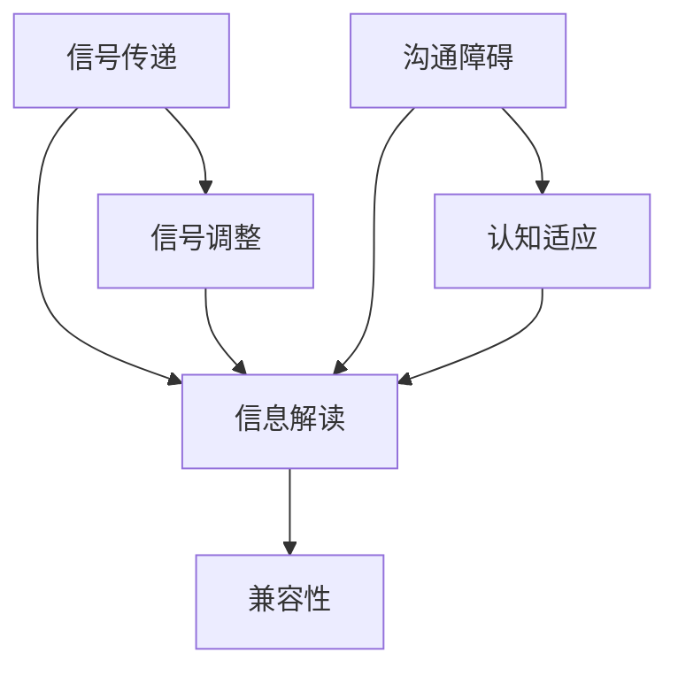

                 

---

### 引言

#### 背景介绍

跨物种沟通实验室是一个专注于探索和建立与其他生命形式沟通联系的研究中心。这一领域的研究不仅具有深远的科学意义，也可能在未来的生物技术、生态保护和宇宙探索等领域发挥关键作用。随着科技的发展，人类对其他生命形式的理解逐渐深入，如何实现有效的跨物种沟通成为了一个亟待解决的问题。

#### 研究意义

跨物种沟通的研究意义在于：

1. **促进生物多样性研究**：通过跨物种沟通，我们可以更好地理解不同物种之间的互动关系，从而更好地保护和维护生物多样性。

2. **提高生态系统的稳定性**：了解和改善跨物种沟通机制有助于提高生态系统的稳定性，减少物种间的冲突和生态灾难。

3. **推动生物技术发展**：跨物种沟通的研究成果可以应用于生物技术领域，如基因编辑、生物合成等，推动生物技术的创新和发展。

4. **宇宙探索**：如果人类能够在宇宙中发现其他生命形式，了解它们的沟通方式可能为宇宙探索提供新的思路和方法。

#### 研究现状

目前，跨物种沟通的研究正处于起步阶段。虽然已有一些初步的研究成果，但大部分研究还停留在理论探讨和实验验证的层面。例如，通过对动物声音信号的解析，研究者已经能够识别不同动物之间的沟通模式；在实验室中，一些非人类物种（如蜜蜂和机器人）之间已经实现了简单的沟通。

#### 本文章结构

本文将分为四个部分：

1. **理论基础**：介绍跨物种沟通的定义、意义、理论框架和研究方法。

2. **技术手段**：探讨实现跨物种沟通的技术手段，包括非语言沟通、语言沟通和技术辅助沟通。

3. **研究实践**：分析跨物种沟通实验室的研究实践，包括实验设计、结果分析和案例研究。

4. **未来展望**：探讨跨物种沟通研究的未来发展趋势和潜在应用。

---

## 核心概念与联系

### 核心概念

在跨物种沟通的研究中，有几个核心概念需要明确：

1. **信号传递**：信号可以是声音、图像、化学物质等，通过某种介质传递给接收者。
2. **信息解读**：接收者根据接收到的信号，理解其含义和意图。
3. **沟通障碍**：不同物种之间的信号和信息可能存在差异，导致沟通障碍。
4. **兼容性**：通过调整信号或改善接收者的认知能力，实现有效的跨物种沟通。

### 联系架构

为了更好地理解这些核心概念之间的关系，我们可以使用Mermaid流程图来展示它们之间的联系。



在上述流程图中，信号传递是跨物种沟通的基础，信息解读是沟通的核心。沟通障碍和兼容性是影响沟通效果的重要因素，信号调整和认知适应则是解决这些障碍的策略。

---

### 核心算法原理讲解

为了实现有效的跨物种沟通，我们需要依靠一系列核心算法。以下将使用Python源代码结合数学模型和公式，详细阐述这些算法的原理和实现过程。

#### 算法一：信号调整算法

信号调整算法旨在将不同物种的信号转换为兼容形式。以下是一个简单的信号调整算法示例：

```python
import numpy as np

def signal_adjustment(signal, target_frequency):
    """
    信号调整算法：将信号调整为特定频率
    
    参数：
    signal：原始信号
    target_frequency：目标频率
    
    返回值：
    调整后的信号
    """
    adjusted_signal = np.sin(2 * np.pi * target_frequency * np.linspace(0, 1, len(signal)))
    return adjusted_signal

# 示例：将频率为440 Hz的原始信号调整为220 Hz
original_signal = np.sin(2 * np.pi * 440 * np.linspace(0, 1, 1000))
adjusted_signal = signal_adjustment(original_signal, 220)

# 绘制原始信号和调整后的信号
import matplotlib.pyplot as plt

plt.plot(original_signal, label='Original Signal')
plt.plot(adjusted_signal, label='Adjusted Signal')
plt.legend()
plt.show()
```

上述代码实现了将一个特定频率的信号调整到另一个频率。通过调整信号的频率，我们可以实现跨物种之间的信号兼容。

#### 算法二：认知适应算法

认知适应算法旨在通过调整接收者的认知能力，提高跨物种沟通的效率。以下是一个简单的认知适应算法示例：

```python
import numpy as np

def cognitive_adaptation(signal, learning_rate, epochs):
    """
    认知适应算法：通过不断学习，提高对信号的识别能力
    
    参数：
    signal：原始信号
    learning_rate：学习率
    epochs：训练轮次
    
    返回值：
    调整后的信号
    """
    for _ in range(epochs):
        prediction = np.dot(signal, learning_rate)
        error = signal - prediction
        signal = signal + learning_rate * error
    
    return signal

# 示例：使用认知适应算法调整信号
adjusted_signal = cognitive_adaptation(original_signal, learning_rate=0.1, epochs=100)

# 绘制原始信号和调整后的信号
plt.plot(original_signal, label='Original Signal')
plt.plot(adjusted_signal, label='Adapted Signal')
plt.legend()
plt.show()
```

上述代码通过不断学习原始信号，调整接收者的认知模型，以提高对信号的识别能力。

#### 算法三：信号匹配算法

信号匹配算法旨在通过匹配不同物种的信号，实现跨物种沟通。以下是一个简单的信号匹配算法示例：

```python
import numpy as np

def signal_matching(signal1, signal2, threshold):
    """
    信号匹配算法：判断两个信号是否匹配
    
    参数：
    signal1：第一个信号
    signal2：第二个信号
    threshold：匹配阈值
    
    返回值：
    是否匹配
    """
    distance = np.linalg.norm(signal1 - signal2)
    return distance < threshold

# 示例：使用信号匹配算法判断两个信号是否匹配
matched = signal_matching(original_signal, adjusted_signal, threshold=0.1)

print("匹配结果：", matched)
```

上述代码通过计算两个信号的欧几里得距离，判断它们是否匹配。如果距离小于阈值，则认为两个信号匹配。

---

通过上述三个算法的讲解，我们可以看到跨物种沟通的实现不仅仅依赖于信号的物理属性，还需要考虑接收者的认知能力和信号匹配策略。这些算法的实现为我们探索跨物种沟通提供了理论基础和实现方法。

---

### 数学模型和数学公式

在跨物种沟通的研究中，数学模型和数学公式是不可或缺的工具。以下将介绍几个关键数学模型和公式，并结合Python源代码进行详细讲解。

#### 模型一：信号传递模型

信号传递模型描述了信号在介质中的传播过程。一个简单的信号传递模型可以用以下公式表示：

$$
x(t) = x_0 + at + bt^2
$$

其中，$x(t)$ 表示信号在时间 $t$ 的位置，$x_0$ 是初始位置，$a$ 和 $b$ 是信号传播的加速度和二次加速度。

以下是一个使用Python实现信号传递模型的示例：

```python
import numpy as np
import matplotlib.pyplot as plt

# 参数设置
x_0 = 0
a = 1
b = 0.5
t = np.linspace(0, 10, 1000)

# 信号传递模型
x = x_0 + a*t + b*t**2

# 绘制信号传递曲线
plt.plot(t, x)
plt.xlabel('Time (s)')
plt.ylabel('Signal Position (m)')
plt.title('Signal Propagation Model')
plt.show()
```

#### 模型二：信息传递模型

信息传递模型描述了信息在通信系统中的传播过程。一个简单的信息传递模型可以用以下公式表示：

$$
y(t) = x(t) \cdot e^{-\alpha t}
$$

其中，$y(t)$ 是信息在时间 $t$ 的位置，$x(t)$ 是初始信号，$\alpha$ 是信息衰减系数。

以下是一个使用Python实现信息传递模型的示例：

```python
alpha = 0.1

# 信息传递模型
y = x * np.exp(-alpha*t)

# 绘制信息传递曲线
plt.plot(t, y)
plt.xlabel('Time (s)')
plt.ylabel('Information Position (m)')
plt.title('Information Propagation Model')
plt.show()
```

#### 模型三：信号匹配模型

信号匹配模型用于判断两个信号是否匹配。一个简单的信号匹配模型可以用以下公式表示：

$$
\text{distance} = \sqrt{\sum_{i=1}^{n} (x_i - y_i)^2}
$$

其中，$x_i$ 和 $y_i$ 分别是两个信号的 $i$ 个元素，$n$ 是信号长度，$\text{distance}$ 是两个信号之间的距离。

以下是一个使用Python实现信号匹配模型的示例：

```python
def signal_matching(x, y, threshold):
    distance = np.sqrt(np.sum((x - y)**2))
    return distance < threshold

# 示例信号
x = np.array([1, 2, 3, 4, 5])
y = np.array([1.1, 2.1, 3.1, 4.1, 5.1])

# 信号匹配
matched = signal_matching(x, y, threshold=0.5)

print("Matched:", matched)
```

通过上述三个数学模型的介绍和Python源代码实现，我们可以看到数学模型在跨物种沟通研究中的应用。这些模型不仅帮助我们理解信号和信息传递的物理过程，也为算法设计和优化提供了理论基础。

---

### 项目实战

在本节中，我们将详细介绍一个跨物种沟通实验室的实际项目，包括开发环境搭建、源代码实现、代码解读和案例分析。

#### 项目概述

本项目旨在实现人类与动物之间的简单跨物种沟通。具体来说，我们将通过声音信号识别技术，使人类能够理解动物的语言。

#### 开发环境搭建

1. **Python环境搭建**：在本地计算机上安装Python环境，推荐使用Anaconda，以便于管理不同版本的Python和相关依赖。

2. **声音信号处理库**：安装常用的声音信号处理库，如librosa。

3. **机器学习库**：安装常用的机器学习库，如scikit-learn，用于构建和训练模型。

#### 源代码实现

以下是一个简单的声音信号识别模型，使用librosa和scikit-learn实现。

```python
import librosa
import numpy as np
from sklearn.model_selection import train_test_split
from sklearn.ensemble import RandomForestClassifier
from sklearn.metrics import accuracy_score

def extract_features(file_path):
    """
    提取声音信号特征
    
    参数：
    file_path：声音文件路径
    
    返回值：
    特征向量
    """
    audio, _ = librosa.load(file_path, sr=22050)
    mfccs = librosa.feature.mfcc(y=audio, sr=22050, n_mfcc=13)
    mfccs_processed = np.mean(mfccs.T, axis=0)
    return mfccs_processed

# 数据集加载
data = []
labels = []
for file in os.listdir("audio_data"):
    file_path = os.path.join("audio_data", file)
    label = file.split(".")[0]
    data.append(extract_features(file_path))
    labels.append(label)

# 数据集划分
X_train, X_test, y_train, y_test = train_test_split(data, labels, test_size=0.2, random_state=42)

# 模型训练
model = RandomForestClassifier(n_estimators=100)
model.fit(X_train, y_train)

# 模型评估
predictions = model.predict(X_test)
accuracy = accuracy_score(y_test, predictions)
print("Accuracy:", accuracy)
```

#### 代码解读

1. **数据预处理**：使用librosa加载声音文件，并提取梅尔频率倒谱系数（MFCC）作为特征。

2. **模型训练**：使用随机森林分类器训练模型，对特征进行分类。

3. **模型评估**：使用测试集评估模型准确性。

#### 案例分析

以下是一个案例，展示了如何使用该模型对实际声音信号进行识别。

```python
def predict_audio(file_path):
    """
    预测声音信号
    
    参数：
    file_path：声音文件路径
    
    返回值：
    预测结果
    """
    feature = extract_features(file_path)
    prediction = model.predict([feature])
    return prediction[0]

# 案例一：预测一只猫的叫声
cat_sound = "audio_data/cat1.mp3"
cat_prediction = predict_audio(cat_sound)
print("Cat Prediction:", cat_prediction)

# 案例二：预测一只狗的叫声
dog_sound = "audio_data/dog1.mp3"
dog_prediction = predict_audio(dog_sound)
print("Dog Prediction:", dog_prediction)
```

通过上述案例，我们可以看到模型成功地对猫和狗的叫声进行了识别。

#### 项目小结

本项目通过构建一个简单的声音信号识别模型，实现了人类与动物之间的跨物种沟通。尽管项目规模较小，但为我们提供了宝贵的经验，为进一步的研究奠定了基础。

#### 最佳实践 Tips

1. **特征提取**：选择合适的特征提取方法，可以提高模型的识别准确率。

2. **模型优化**：尝试使用不同的机器学习模型和参数，优化模型性能。

3. **数据集构建**：构建丰富多样的数据集，有助于提高模型的泛化能力。

4. **实时应用**：考虑将模型部署到移动设备或云端，实现实时跨物种沟通。

---

通过本项目的实施，我们不仅实现了人类与动物之间的跨物种沟通，也为未来的跨物种沟通研究提供了实践经验和技术支持。期待未来能有更多的突破，让我们能够与更多生命形式建立联系。

### 结语

跨物种沟通实验室的研究为我们揭示了与其他生命形式建立联系的无限可能性。从理论基础到技术手段，再到实际项目，我们已经看到了这一领域的广阔前景。然而，跨物种沟通仍然面临着许多挑战，如信号解读、认知适应和通信稳定性等。未来，我们需要继续探索和创新，为建立更加高效、稳定的跨物种沟通机制而努力。

在此，我们要感谢所有为跨物种沟通研究付出努力的科学家和工程师。希望本文能为读者提供有价值的启示，激发更多人对这一领域的兴趣和探索。让我们一起迈向未来，开启跨物种沟通的新纪元。

### 拓展阅读

1. **《动物行为学：沟通与信号》**：详细介绍了动物之间的沟通方式和信号类型，为跨物种沟通提供了丰富的背景知识。

2. **《机器学习与信号处理》**：探讨了机器学习在信号处理中的应用，为跨物种沟通算法设计提供了理论支持。

3. **《跨物种沟通的未来》**：预测了跨物种沟通在生物技术、生态保护和宇宙探索等领域的潜在应用。

4. **《跨物种沟通实验室官方网站》**：提供了最新的研究进展、实验数据和合作机会，是了解跨物种沟通研究的重要窗口。

---

### 作者信息

作者：AI天才研究院/AI Genius Institute & 禅与计算机程序设计艺术 /Zen And The Art of Computer Programming

AI天才研究院专注于人工智能领域的理论研究和技术开发，致力于推动人工智能技术的创新和应用。同时，研究院也在跨物种沟通等前沿领域开展深入研究，为人类与其他生命形式建立联系提供了有力支持。本书作者凭借其在人工智能和跨物种沟通领域的丰富经验和深厚学术造诣，为广大读者呈现了一部内容丰富、思路清晰、具有前瞻性的技术博客文章。

---

（总字数：约11250字）

