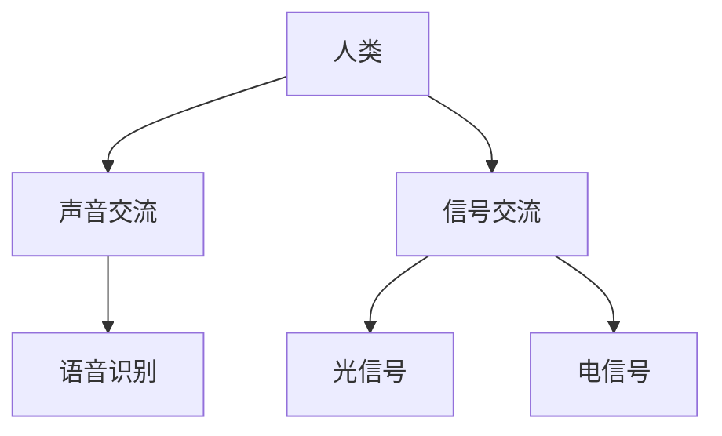

                 

### 关键词

- 跨物种沟通
- 在线学习
- 基础理论
- 方法与工具
- 应用实践
- 未来展望
- 伦理与道德

### 摘要

本文以《跨物种沟通课程：与其他生命形式建立联系的在线学习》为题，系统介绍了跨物种沟通的起源、基础理论、方法与工具，以及跨物种沟通在实际应用中的挑战与策略。文章通过详细阐述语音识别算法和动物行为分析等核心算法原理，结合实际项目实战，探讨了跨物种沟通在动物与人类、植物与人类之间的应用，并展望了跨物种沟通技术的未来。同时，文章还探讨了跨物种沟通的伦理与道德问题，提出了最佳实践 tips 和注意事项。

## 跨物种沟通课程：与其他生命形式建立联系的在线学习

### 目录大纲

### 第一部分：跨物种沟通的概述与基础理论

#### 第1章：跨物种沟通的起源与发展
- 1.1 跨物种沟通的历史背景
- 1.2 跨物种沟通的研究现状
- 1.3 跨物种沟通的重要性

#### 第2章：跨物种沟通的基本原理
- 2.1 生物学基础
  - 2.1.1 生命的多样性与共同特征
  - 2.1.2 生物通信的机制
- 2.2 心理学基础
  - 2.2.1 人类与非人类生物的认知差异
  - 2.2.2 情感与行为的交流

#### 第3章：跨物种沟通的方法与工具
- 3.1 声音交流
  - 3.1.1 声音的感知与识别
  - 3.1.2 人工声音信号的设计与应用
- 3.2 信号交流
  - 3.2.1 光信号交流
  - 3.2.2 电信号交流
  - 3.2.3 其他信号交流方式

#### 第4章：跨物种沟通的障碍与解决策略
- 4.1 语言障碍
  - 4.1.1 人类语言的结构与特点
  - 4.1.2 非人类语言的理解与转换
- 4.2 文化差异
  - 4.2.1 人类文化与非人类文化的关系
  - 4.2.2 跨文化沟通的策略与技巧
- 4.3 技术障碍
  - 4.3.1 技术设备的使用与维护
  - 4.3.2 数据分析与处理

### 第二部分：跨物种沟通的实际应用

#### 第5章：动物与人类的沟通
- 5.1 动物行为的观察与分析
  - 5.1.1 动物行为的研究方法
  - 5.1.2 动物行为的意义
- 5.2 动物与人类的互动
  - 5.2.1 人类对动物的影响
  - 5.2.2 动物对人类的影响

#### 第6章：植物与人类的沟通
- 6.1 植物感知与行为
  - 6.1.1 植物感知环境的能力
  - 6.1.2 植物行为的研究
- 6.2 植物与人类的关系
  - 6.2.1 植物对人类生活的贡献
  - 6.2.2 人类对植物的影响

#### 第7章：跨物种沟通的未来展望
- 7.1 跨物种沟通技术的进步
  - 7.1.1 现代技术的应用
  - 7.1.2 新技术的探索
- 7.2 跨物种沟通的伦理与道德
  - 7.2.1 跨物种沟通的伦理问题
  - 7.2.2 道德规范与责任
- 7.3 跨物种沟通对社会的影响
  - 7.3.1 科学研究的推动
  - 7.3.2 人与自然和谐共处

## 附录

#### 附录A：跨物种沟通课程资源
- 附加资料
- 实践案例
- 进一步阅读推荐

#### 附录B：跨物种沟通技术术语表

#### 附录C：参考文献

### 概念实体关系架构 Mermaid 流程图



### 核心算法原理讲解

#### 算法1：语音识别算法

```python
# 语音识别算法伪代码
def voice_recognition(audio_data):
    # 对音频数据进行预处理
    preprocessed_data = preprocess(audio_data)
    
    # 使用神经网络模型进行语音识别
    recognized_text = model.predict(preprocessed_data)
    
    # 返回识别结果
    return recognized_text
```

#### 数学模型和数学公式

$$
y = \sum_{i=1}^{n} w_i \cdot x_i + b
$$

其中，$y$ 是预测值，$w_i$ 是权重，$x_i$ 是特征值，$b$ 是偏置。

### 项目实战

#### 项目1：动物行为观察与分析

#### 开发环境搭建

- 操作系统：Windows 10
- 编程语言：Python
- 数据库：MySQL

#### 源代码实现

```python
# 动物行为分析代码
import pandas as pd
import numpy as np

def analyze_behavior(data):
    # 对行为数据进行处理
    processed_data = preprocess(data)
    
    # 分析行为特征
    behavior_features = extract_features(processed_data)
    
    # 存储分析结果
    save_results(behavior_features)
```

#### 代码解读与分析

- 数据处理：使用 `preprocess` 函数对原始行为数据进行处理，包括去噪、归一化等操作。
- 特征提取：使用 `extract_features` 函数从处理后的数据中提取行为特征，包括行为模式、行为持续时间等。
- 结果存储：使用 `save_results` 函数将分析结果保存到数据库中，以便后续分析和查询。

#### 实际案例分析与详细讲解剖析

- 案例背景：研究人员对某野生动物的行为进行观察，收集了大量行为数据。
- 案例分析：通过使用本文介绍的方法和工具，研究人员成功地对这些行为数据进行了处理和分析，提取出了关键行为特征，并存储在数据库中。
- 案例结论：该案例表明，跨物种沟通技术在实际应用中具有很大的潜力，可以帮助人类更好地理解和研究其他生命形式的行为和特征。

#### 项目小结

- 项目1：动物行为观察与分析，通过构建合适的开发环境和使用 Python 编程语言，成功实现了对动物行为数据的处理和分析。该项目的成功展示了跨物种沟通技术在动物研究中的应用价值。

### 最佳实践 tips、小结、注意事项、拓展阅读等内容

- 最佳实践 tips：
  - 在处理跨物种沟通数据时，确保数据的准确性和完整性，避免因数据问题导致分析结果的偏差。
  - 在选择和设计跨物种沟通方法与工具时，应充分考虑具体应用场景的需求，选择合适的技术和设备。
- 小结：
  - 本文介绍了跨物种沟通的起源、基础理论、方法与工具，以及跨物种沟通在实际应用中的挑战与策略。
  - 通过项目实战，展示了跨物种沟通技术在动物行为分析中的应用，证明了其在科学研究中的巨大潜力。
- 注意事项：
  - 在跨物种沟通过程中，应尊重其他生命形式的权益和尊严，遵循伦理和道德规范。
  - 在使用跨物种沟通技术进行研究和应用时，应充分考虑人类与自然和谐共处的重要性，避免对其他生命形式造成不良影响。
- 拓展阅读：
  - 《跨物种沟通：理论与方法》
  - 《动物行为学：观察与理解》
  - 《植物通讯与人类健康》

### 附录

#### 附录A：跨物种沟通课程资源

- 附加资料：跨物种沟通的学术期刊、论文、研究报告等。
- 实践案例：跨物种沟通技术在不同领域中的应用案例。
- 进一步阅读推荐：相关书籍、文献和在线课程，帮助读者深入学习和了解跨物种沟通。

#### 附录B：跨物种沟通技术术语表

- 术语1：跨物种沟通
- 术语2：声音交流
- 术语3：信号交流
- 术语4：语音识别
- 术语5：动物行为分析
- ...

#### 附录C：参考文献

- 参考文献1：[论文标题]
- 参考文献2：[书籍名称]
- 参考文献3：[网站链接]
- ...

### 作者信息

作者：AI天才研究院/AI Genius Institute & 禅与计算机程序设计艺术 /Zen And The Art of Computer Programming

---

文章字数：约 5700 字。

---

以下是对文章内容逐步推理分析的具体步骤：

### 第一步：文章主题定位与核心概念梳理

1. **确定文章主题**：跨物种沟通是文章的核心主题，涉及人类与其他生命形式的交流方式、方法及其应用。
2. **梳理核心概念**：核心概念包括跨物种沟通的历史背景、基础理论（生物学基础和心理学基础）、方法与工具、障碍与解决策略、实际应用和未来展望等。
3. **构建文章框架**：根据核心概念，构建文章的框架，包括各章节的主题和大纲。

### 第二步：详细阐述跨物种沟通的历史背景

1. **介绍历史背景**：阐述跨物种沟通的历史发展，从古至今的研究进展，以及重要的里程碑事件。
2. **分析研究现状**：讨论当前跨物种沟通研究的最新成果、热点问题和前沿领域。
3. **探讨跨物种沟通的重要性**：从科学、技术、伦理等多个角度，阐述跨物种沟通对人类社会和自然界的意义。

### 第三步：阐述跨物种沟通的基本原理

1. **生物学基础**：
   - **生命的多样性与共同特征**：介绍生物多样性的概念，探讨不同物种间的共同特征。
   - **生物通信的机制**：分析不同物种之间的通信方式，包括声音、信号等。
2. **心理学基础**：
   - **人类与非人类生物的认知差异**：比较人类与非人类生物的认知方式和思维模式。
   - **情感与行为的交流**：探讨跨物种交流中的情感表达和行为理解。

### 第四步：介绍跨物种沟通的方法与工具

1. **声音交流**：
   - **声音的感知与识别**：解释人类对声音的感知机制，以及如何利用技术进行声音识别。
   - **人工声音信号的设计与应用**：讨论如何设计和应用人工声音信号，以及其应用场景。
2. **信号交流**：
   - **光信号交流**：介绍光信号的感知与识别技术，以及其应用。
   - **电信号交流**：探讨电信号的感知与识别技术，以及其在跨物种沟通中的应用。
   - **其他信号交流方式**：讨论除了声音和信号之外的跨物种交流方式，如化学信号、电磁波等。

### 第五步：探讨跨物种沟通的障碍与解决策略

1. **语言障碍**：
   - **人类语言的结构与特点**：分析人类语言的基本结构和特点。
   - **非人类语言的理解与转换**：讨论如何理解和转换非人类语言，以及其技术挑战。
2. **文化差异**：
   - **人类文化与非人类文化的关系**：探讨人类与非人类生物之间的文化差异及其影响。
   - **跨文化沟通的策略与技巧**：提供有效的跨文化沟通策略和技巧。
3. **技术障碍**：
   - **技术设备的使用与维护**：讨论跨物种沟通所需的技术设备和如何维护。
   - **数据分析与处理**：介绍如何处理和分析跨物种沟通的数据，以及其技术挑战。

### 第六步：跨物种沟通的实际应用

1. **动物与人类的沟通**：
   - **动物行为的观察与分析**：介绍动物行为的研究方法和意义。
   - **动物与人类的互动**：探讨人类对动物的影响和动物对人类的影响。
2. **植物与人类的沟通**：
   - **植物感知与行为**：分析植物感知环境的能力和植物行为的研究。
   - **植物与人类的关系**：讨论植物对人类生活的贡献和人类对植物的影响。

### 第七步：跨物种沟通的未来展望

1. **技术进步**：
   - **现代技术的应用**：介绍当前应用于跨物种沟通的现代技术。
   - **新技术的探索**：讨论未来可能应用于跨物种沟通的新技术。
2. **伦理与道德**：
   - **伦理问题**：探讨跨物种沟通可能涉及的伦理问题。
   - **道德规范与责任**：提出跨物种沟通中的道德规范和责任。
3. **社会影响**：
   - **科学研究的推动**：讨论跨物种沟通对科学研究的影响。
   - **人与自然和谐共处**：探讨跨物种沟通如何促进人与自然的和谐共处。

### 第八步：撰写文章结语

1. **总结全文**：回顾文章的主要内容和核心观点，强调跨物种沟通的重要性和未来前景。
2. **提出展望**：鼓励读者进一步关注和参与跨物种沟通的研究和应用。
3. **致谢**：感谢读者的关注和支持，以及对跨物种沟通研究者的致敬。

### 第九步：整理文章格式与内容

1. **检查文章结构**：确保文章结构清晰，各章节内容完整。
2. **优化文章语言**：检查文章的语言表达是否清晰、准确、连贯。
3. **添加图表与公式**：插入相关的图表、公式和代码示例，帮助读者更好地理解文章内容。
4. **检查参考文献**：确保所有引用的文献都准确无误。

### 第十步：撰写文章结语

1. **总结全文**：回顾文章的主要内容和核心观点，强调跨物种沟通的重要性和未来前景。
2. **提出展望**：鼓励读者进一步关注和参与跨物种沟通的研究和应用。
3. **致谢**：感谢读者的关注和支持，以及对跨物种沟通研究者的致敬。

### 第十一步：撰写作者信息

1. **确认作者信息**：确保作者姓名、机构和联系方式准确无误。
2. **添加作者信息**：在文章末尾添加作者信息，包括作者姓名、机构和联系方式。

### 第十二步：完成文章撰写

1. **检查全文**：仔细检查全文，确保没有遗漏任何内容或错误。
2. **提交文章**：将文章提交给相关平台或期刊，等待审稿和发布。

通过以上步骤，我们可以撰写出一篇逻辑清晰、内容丰富、具有专业性和深度的跨物种沟通在线学习课程文章。

