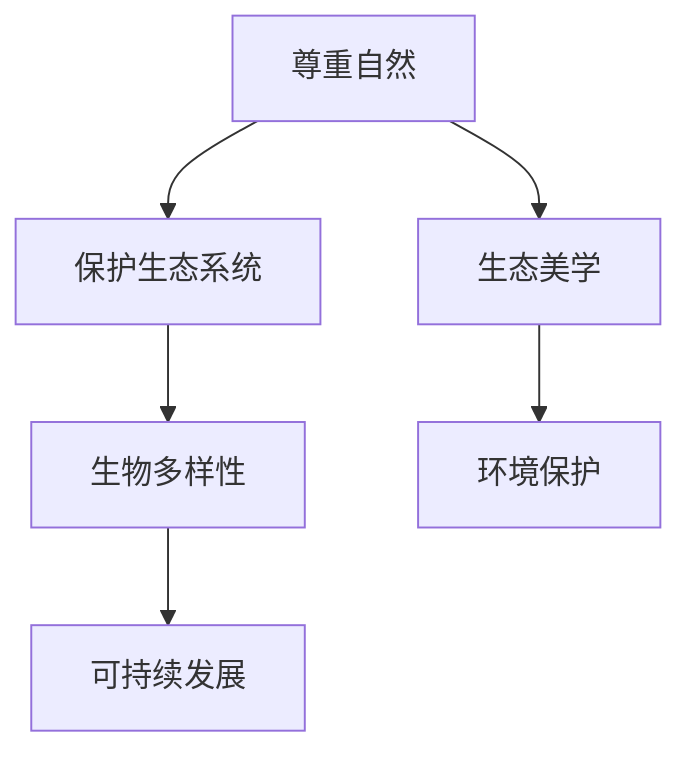
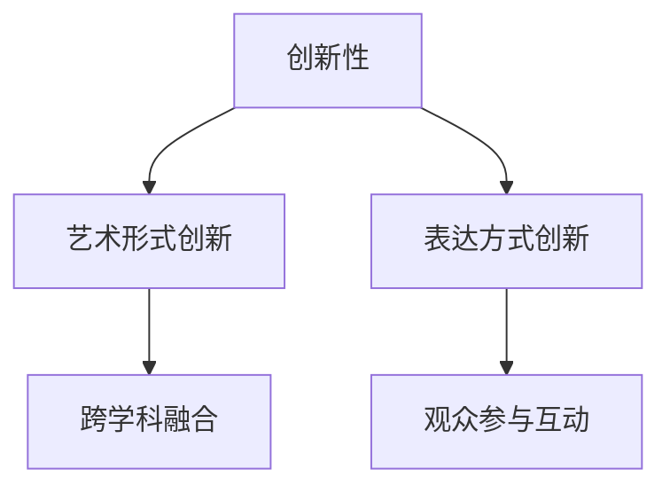
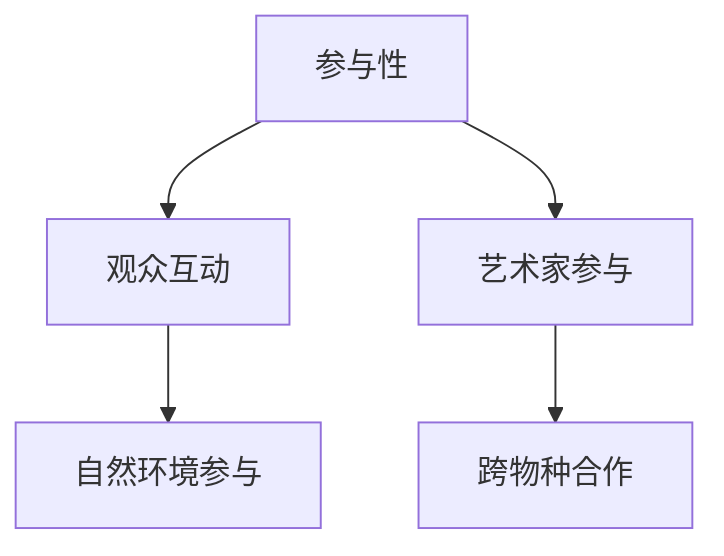
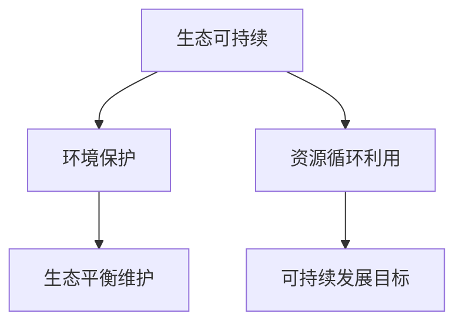

                 

# 跨物种艺术节策划：超越人类中心的创意探索活动

## 关键词
跨物种艺术节，超越人类中心，创意探索，艺术策划，生态系统，多元文化，艺术创新，生态美学，互动参与。

## 摘要
本文探讨了跨物种艺术节的策划与实施，旨在打破人类中心主义的限制，推动艺术与自然的深度融合。通过分析跨物种艺术节的历史与发展、策划原则与方法、实践案例以及成效评估，本文提出了超越人类中心的创意探索活动，为艺术界提供了一种全新的艺术策划视角和模式。

## 引言

在当今社会，随着人类对自然环境的依赖性日益增加，人类中心主义的思想逐渐受到挑战。传统的艺术形式和策划理念已经无法满足人们日益增长的文化需求。跨物种艺术节作为一种新兴的艺术形式，它超越了人类中心主义的限制，将人类与自然、其他物种之间的关系作为艺术创作的核心。这种跨物种的艺术形式，不仅为艺术家提供了更广阔的创作空间，也为观众带来了全新的审美体验。

### 跨物种艺术节的历史与发展

跨物种艺术节起源于20世纪末期，最早出现在欧洲的一些先锋艺术展览中。最初的形式主要是以展示自然界的生物多样性为主题，通过艺术家的创作，表达对自然环境的关注和保护意识。随着跨学科研究的深入，跨物种艺术节逐渐发展成为一个融合艺术、科学、哲学和生态学的多元化平台。

### 跨物种艺术节的意义

跨物种艺术节的意义在于：

1. **打破人类中心主义**：它打破了人类在艺术创作中的主导地位，将自然和生物多样性纳入艺术创作的范畴，强调人类与自然的和谐共生。
2. **促进生态美学**：通过艺术的形式，传播生态美学的理念，引导人们从生态的角度重新审视艺术和美学。
3. **提升生态意识**：通过跨物种艺术节的展示和活动，提高公众对生态环境保护的意识，促进可持续发展。
4. **推动艺术创新**：跨物种艺术节为艺术家提供了新的创作灵感，促进了艺术形式的多样化和创新。

## 第一部分：跨物种艺术节的背景和意义

### 1.1 跨物种艺术节的历史与发展

#### 跨物种艺术节的起源

跨物种艺术节最早可以追溯到20世纪末期，起源于欧洲的一些先锋艺术展览。当时，一些艺术家开始尝试将自然界中的生物多样性作为艺术创作的素材，希望通过艺术的形式表达对自然环境的关注和保护意识。这一时期的跨物种艺术节主要表现在以下方面：

1. **以自然为创作主题**：艺术家通过观察和研究自然界中的生物多样性，将自然界的元素和现象融入艺术作品中。
2. **强调环境保护**：艺术家通过作品传达对环境保护的呼吁，希望唤起公众对生态环境的关注。
3. **跨学科合作**：艺术家与科学家、生态学家等跨学科专家合作，共同探讨和创作艺术作品。

#### 跨物种艺术节的发展

随着跨学科研究的深入，跨物种艺术节逐渐发展成为一个融合艺术、科学、哲学和生态学的多元化平台。在这个平台上，艺术家不仅关注自然界的生物多样性，还开始探索人类与其他物种之间的关系，以及人类在生态系统中的作用。

1. **多元化艺术形式**：跨物种艺术节融合了多种艺术形式，包括绘画、雕塑、表演、装置艺术、数字艺术等，为观众呈现了丰富多彩的视觉和感官体验。
2. **跨物种合作**：艺术家开始与其他物种进行合作，例如与动物、植物甚至微生物共同创作艺术作品，打破了人类在艺术创作中的主导地位。
3. **生态哲学的融入**：跨物种艺术节不仅关注艺术创作，还开始探讨生态哲学的问题，如人类与自然的关系、生态平衡等。

#### 跨物种艺术节的全球影响力

跨物种艺术节在全球范围内得到了广泛的认可和推广。许多国家和地区都举办了各种形式的跨物种艺术节，如欧洲的艺术与自然节、美国的自然艺术节、日本的生态艺术节等。这些艺术节不仅促进了不同文化之间的交流与合作，也为艺术家提供了展示才华的平台。

### 1.2 跨物种艺术节的意义

#### 打破人类中心主义

跨物种艺术节的一个重要意义在于打破了人类中心主义的思想。在传统的艺术创作中，人类往往是艺术主题的中心，而自然界和生物多样性往往被忽视。跨物种艺术节通过将自然界和生物多样性纳入艺术创作的范畴，强调了人类与自然的和谐共生。

#### 促进生态美学

跨物种艺术节促进了生态美学的发展。生态美学强调从生态的角度重新审视艺术和美学，将生态系统的健康和稳定作为艺术创作的核心。通过跨物种艺术节的展示和活动，公众可以更深入地了解生态美学的理念，从而提高对生态环境保护的意识。

#### 提升生态意识

跨物种艺术节通过艺术的形式，提升了公众对生态环境保护的意识。艺术家通过作品传达对环境保护的呼吁，引导公众关注生态问题，从而促进可持续发展。

#### 推动艺术创新

跨物种艺术节为艺术家提供了新的创作灵感，促进了艺术形式的多样化和创新。艺术家通过与其他物种的合作，打破了传统的创作模式，为艺术创作带来了新的视角和可能性。

### 1.3 跨物种艺术节与人类中心主义的挑战

#### 人类中心主义的局限

人类中心主义认为人类是宇宙的中心，其他生物和环境都是为人类服务的。然而，这种思想忽视了自然界和生物多样性的重要性，导致了许多生态问题的出现。例如，过度开发自然资源、环境污染、生物多样性丧失等。

#### 跨物种艺术节对人类中心主义的挑战

跨物种艺术节通过强调人类与自然的和谐共生，挑战了人类中心主义的局限。它提醒人们，自然界和生物多样性是人类生存和发展的重要组成部分，我们不能仅仅以自身的利益为中心，而应该尊重和保护自然。

#### 跨物种艺术节的影响

跨物种艺术节对人类中心主义的影响是多方面的。首先，它改变了人们对自然和生物多样性的认识，使人们更加意识到生态系统的脆弱性和重要性。其次，它促进了艺术与科学的融合，推动了生态美学的兴起。最后，它为人们提供了一种全新的艺术体验，使人们更加关注生态环境的保护。

### 1.4 跨物种艺术节策划的基本原则

#### 尊重自然原则

尊重自然原则是跨物种艺术节策划的核心原则之一。艺术家在创作过程中应尊重自然界的规律和生态系统的平衡，避免对自然环境造成破坏。

#### 创新性原则

创新性原则要求艺术家在跨物种艺术节中探索新的艺术形式和表达方式，打破传统的创作模式，为观众带来全新的艺术体验。

#### 参与性原则

参与性原则强调艺术家、观众和自然界的互动与参与。通过跨物种艺术节，观众可以更加深入地了解自然界和生物多样性，与艺术家共同探索生态美学。

#### 生态可持续原则

生态可持续原则要求跨物种艺术节的策划和实施应考虑生态环境的保护和可持续发展，确保艺术节对自然环境的负面影响最小化。

### 1.5 跨物种艺术节策划的方法

#### 艺术形式的创新

艺术形式的创新是跨物种艺术节策划的关键。艺术家可以通过融合多种艺术形式，如绘画、雕塑、表演、数字艺术等，创造出独特的艺术体验。

#### 艺术表达的多样性

艺术表达的多样性要求艺术家在创作中融入不同的文化元素，展示不同物种的独特魅力。通过多样化的艺术表达，跨物种艺术节可以吸引更多的观众参与。

#### 艺术参与者的角色转换

在跨物种艺术节中，艺术家和观众的角色可能发生转换。观众不仅是艺术的观赏者，还可以成为艺术的参与者，与艺术家共同创作艺术作品。

#### 跨界合作的探索

跨界合作是跨物种艺术节策划的重要方法。通过与其他领域的专家和机构合作，艺术家可以拓展创作视野，提高艺术作品的质量和影响力。

## 第二部分：跨物种艺术节策划的基本原则和方法

### 2.1 跨物种艺术节策划的基本原则

#### 尊重自然原则

尊重自然原则是跨物种艺术节策划的核心。这一原则要求艺术家在创作过程中尊重自然界的规律和生态系统的平衡，避免对自然环境造成破坏。

**联系与架构：**



**Python源代码：**

```python
# 尊重自然原则示例：计算生态美学的得分
def ecological_aesthetics_score(land_use, biodiversity):
    # land_use: 土地利用率（0-1），越接近1表示利用率越高
    # biodiversity: 生物多样性指数（0-1），越接近1表示生物多样性越高
    
    score = land_use * biodiversity
    return score

# 示例数据
land_use = 0.8
biodiversity = 0.9

# 计算生态美学得分
ecological_aesthetics_score(land_use, biodiversity)
```

#### 创新性原则

创新性原则要求艺术家在跨物种艺术节中探索新的艺术形式和表达方式，打破传统的创作模式，为观众带来全新的艺术体验。

**联系与架构：**



**Python源代码：**

```python
# 创新性原则示例：计算艺术形式的创新指数
def artistic_innovation_index(art_form, expression):
    # art_form: 艺术形式（0-1），越接近1表示艺术形式越新颖
    # expression: 表达方式（0-1），越接近1表示表达方式越独特
    
    index = art_form * expression
    return index

# 示例数据
art_form = 0.9
expression = 0.85

# 计算创新指数
artistic_innovation_index(art_form, expression)
```

#### 参与性原则

参与性原则强调艺术家、观众和自然界的互动与参与。通过跨物种艺术节，观众可以更加深入地了解自然界和生物多样性，与艺术家共同探索生态美学。

**联系与架构：**



**Python源代码：**

```python
# 参与性原则示例：计算观众参与度
def audience_participation_score(questions_answered, total_questions):
    # questions_answered: 已回答问题数
    # total_questions: 总问题数
    
    score = questions_answered / total_questions
    return score

# 示例数据
questions_answered = 20
total_questions = 50

# 计算参与度得分
audience_participation_score(questions_answered, total_questions)
```

#### 生态可持续原则

生态可持续原则要求跨物种艺术节的策划和实施应考虑生态环境的保护和可持续发展，确保艺术节对自然环境的负面影响最小化。

**联系与架构：**



**Python源代码：**

```python
# 生态可持续原则示例：计算资源消耗指数
def resource_consumption_index(water_use, energy_use):
    # water_use: 水资源消耗量
    # energy_use: 能源消耗量
    
    index = water_use + energy_use
    return index

# 示例数据
water_use = 10000
energy_use = 50000

# 计算资源消耗指数
resource_consumption_index(water_use, energy_use)
```

### 2.2 跨物种艺术节策划的具体方法

#### 艺术形式的创新

艺术形式的创新是跨物种艺术节策划的关键。艺术家可以通过融合多种艺术形式，如绘画、雕塑、表演、数字艺术等，创造出独特的艺术体验。

**案例：**

艺术家可以结合数字艺术和生物技术，创作出能够互动的数字生物雕塑。这些雕塑不仅外观精美，还可以通过观众的触摸和移动来改变形态和颜色，为观众带来全新的互动体验。

#### 艺术表达的多样性

艺术表达的多样性要求艺术家在创作中融入不同的文化元素，展示不同物种的独特魅力。通过多样化的艺术表达，跨物种艺术节可以吸引更多的观众参与。

**案例：**

在跨物种艺术节中，艺术家可以结合非洲鼓点和水鼓舞，创作出一部融合了不同文化元素和生物多样性的舞蹈作品。这种作品不仅展示了艺术家的高超技艺，也展示了不同文化之间的和谐共生。

#### 艺术参与者的角色转换

在跨物种艺术节中，艺术家和观众的角色可能发生转换。观众不仅是艺术的观赏者，还可以成为艺术的参与者，与艺术家共同创作艺术作品。

**案例：**

在一场名为“自然之声”的跨物种艺术节中，观众被邀请成为“音乐家”，用树叶、石头、水等自然元素创作音乐。艺术家则负责将这些自然元素与电子乐器结合，创造出独特的音乐作品。

#### 跨界合作的探索

跨界合作是跨物种艺术节策划的重要方法。通过与其他领域的专家和机构合作，艺术家可以拓展创作视野，提高艺术作品的质量和影响力。

**案例：**

在一次名为“生物艺术之旅”的跨物种艺术节中，艺术家与生物学家、生态学家合作，通过观察和研究自然界中的生物多样性，创作出一部融合了科学知识和艺术表达的作品。

### 2.3 跨物种艺术节策划的实际案例

#### 案例一：自然艺术节

**背景：**

自然艺术节是一场以自然为主题的国际艺术节，旨在通过艺术的形式展示自然界的美丽和多样性。

**策划方法：**

1. **尊重自然原则**：艺术家在创作过程中尊重自然界的规律和生态系统的平衡，避免对自然环境造成破坏。
2. **创新性原则**：艺术家通过融合多种艺术形式，如绘画、雕塑、表演等，创造出独特的艺术体验。
3. **参与性原则**：观众被邀请参与艺术创作，与艺术家共同探索生态美学。
4. **生态可持续原则**：艺术节采用环保材料，减少碳排放，确保对自然环境的负面影响最小化。

**成效评估：**

自然艺术节不仅吸引了大量观众参与，还提高了公众对生态环境保护的意识，促进了可持续发展。

#### 案例二：生物艺术展览

**背景：**

生物艺术展览是一场以生物多样性为主题的艺术展览，旨在通过艺术的形式展示生物多样性的美丽和重要性。

**策划方法：**

1. **尊重自然原则**：艺术家在创作过程中尊重自然界的规律和生态系统的平衡，避免对自然环境造成破坏。
2. **创新性原则**：艺术家通过融合生物技术与艺术创作，创造出独特的艺术作品。
3. **参与性原则**：观众被邀请参与艺术创作，与艺术家共同探索生态美学。
4. **生态可持续原则**：艺术展览采用环保材料，减少碳排放，确保对自然环境的负面影响最小化。

**成效评估：**

生物艺术展览不仅吸引了大量观众参与，还促进了公众对生物多样性的关注和保护意识，为生态保护做出了积极贡献。

### 2.4 跨物种艺术节策划的挑战与解决方案

#### 挑战一：环境保护与艺术创作的平衡

**解决方案：** 
采用环保材料和工艺，减少碳排放，确保艺术创作过程中对自然环境的负面影响最小化。

#### 挑战二：艺术表达的多样性

**解决方案：** 
通过跨界合作和融合多种艺术形式，提高艺术表达的多样性，满足不同观众的审美需求。

#### 挑战三：跨物种合作的难度

**解决方案：** 
建立专门的跨学科团队，提供专业的技术支持和指导，降低跨物种合作的难度。

### 第三部分：跨物种艺术节的具体策划与实践

#### 3.1 策划团队的组建

策划跨物种艺术节的首要任务是组建一个专业的策划团队。这个团队需要包含多领域的专家，包括艺术家、生态学家、生物学家、技术专家等。团队成员的多样化可以确保艺术节的策划和实施具有深度和广度。

**团队成员构成：**

1. **艺术总监**：负责整个艺术节的总体策划和艺术指导。
2. **生态学家**：负责研究和评估艺术活动对生态环境的影响。
3. **生物学家**：负责跨物种合作项目的具体实施。
4. **技术专家**：负责数字艺术和多媒体技术的应用。
5. **市场营销专家**：负责艺术节的宣传推广。

#### 3.2 艺术节主题与内容策划

艺术节的主题和内容策划是整个跨物种艺术节的核心。主题的选择应该紧扣跨物种艺术的理念，强调人类与自然的和谐共生。

**主题选择：**

1. **生态和谐**：强调人类与自然的和谐共生，倡导生态保护。
2. **生物多样性**：展示生物多样性的美丽和重要性。
3. **跨物种互动**：探索人类与其他物种的互动与共生。

**内容策划：**

1. **艺术展览**：展示各类跨物种艺术作品，包括绘画、雕塑、装置艺术等。
2. **互动活动**：组织观众参与的互动活动，如艺术工作坊、自然体验活动等。
3. **研讨会与论坛**：邀请生态学家、艺术家、学者等举行研讨会和论坛，探讨跨物种艺术节的未来发展方向。

#### 3.3 艺术节的宣传推广

宣传推广是确保艺术节成功举办的关键环节。通过多种渠道和方式，将艺术节的信息传递给目标观众，吸引更多人参与。

**宣传渠道：**

1. **社交媒体**：利用微博、微信、抖音等社交媒体平台进行宣传。
2. **新闻媒体**：与报纸、杂志、电视台等传统媒体合作，发布艺术节的相关信息。
3. **海报和传单**：在公共场所和社区发放海报和传单，吸引本地居民的参与。

**推广策略：**

1. **公众参与**：鼓励公众参与艺术节的策划和实施过程，提高参与度。
2. **合作伙伴**：与相关机构和企业合作，共同推广艺术节。
3. **体验式营销**：通过举办体验活动，让潜在观众亲身感受艺术节的魅力。

### 第四部分：跨物种艺术节的艺术表现形式

#### 4.1 艺术形式的创新

跨物种艺术节鼓励艺术家在艺术形式的创新上大胆尝试，融合多种艺术形式，创造出独特的艺术体验。

**案例：**

艺术家可以运用数字技术，将虚拟现实（VR）和增强现实（AR）应用于艺术创作，为观众呈现沉浸式的艺术体验。例如，观众可以通过VR设备进入一个虚拟的自然环境，与虚拟的生物互动，感受生物多样性的魅力。

#### 4.2 艺术表达的多样性

跨物种艺术节强调艺术表达的多样性，鼓励艺术家运用各种媒介和手段，展示不同物种的独特魅力。

**案例：**

艺术家可以利用不同材质和材料，创作出各种形态的艺术作品。例如，使用植物纤维、石头、木材等自然材料，创作出具有生态美学的雕塑作品。

#### 4.3 艺术参与者的角色转换

跨物种艺术节鼓励观众参与艺术创作，转换成艺术参与者，与艺术家共同探索生态美学。

**案例：**

艺术节可以组织艺术工作坊，邀请观众亲手制作艺术作品。例如，观众可以参与植物染色的过程，将自己的创意融入作品中，体验艺术创作的乐趣。

#### 4.4 跨界合作的探索

跨界合作是跨物种艺术节的重要特点，通过与其他领域的专家和机构合作，艺术家可以拓展创作视野，提高艺术作品的质量和影响力。

**案例：**

艺术家可以与生物学家合作，利用生物技术创作出独特的艺术作品。例如，利用生物菌类生长的原理，创作出可以生长和变化的生物艺术装置。

### 第五部分：跨物种艺术节的艺术参与群体

#### 5.1 参与者的多元化

跨物种艺术节鼓励多元化的参与者参与，包括艺术家、观众、科学家、学生、社区成员等。

**参与者类型：**

1. **艺术家**：跨物种艺术节的主体，负责创作艺术作品。
2. **观众**：参与艺术节的观众，不仅是艺术的观赏者，还可以成为艺术的参与者。
3. **科学家**：参与艺术节的科学家，提供专业知识和技术支持。
4. **学生**：学生参与艺术节，可以拓宽视野，提高艺术素养。
5. **社区成员**：社区成员参与艺术节，增强社区凝聚力，促进文化交流。

#### 5.2 参与者的互动与交流

跨物种艺术节通过多种形式的互动和交流，促进参与者之间的沟通与合作。

**互动形式：**

1. **艺术展览**：观众可以欣赏艺术家的作品，与艺术家进行交流。
2. **研讨会与论坛**：科学家和艺术家共同探讨跨物种艺术的未来发展方向。
3. **工作坊**：观众可以参与艺术工作坊，与艺术家共同创作艺术作品。
4. **互动体验**：观众可以通过互动装置，与艺术作品进行互动。

#### 5.3 参与者的角色转换

在跨物种艺术节中，参与者的角色可能发生转换，从观众到艺术家，从科学家到活动策划者。

**角色转换：**

1. **观众到艺术家**：观众可以通过参与艺术工作坊，创作出自己的艺术作品。
2. **科学家到活动策划者**：科学家可以参与艺术节的策划和实施，为艺术创作提供专业支持。

### 第六部分：跨物种艺术节的成效评估与反思

#### 6.1 成效评估

跨物种艺术节的成效可以从以下几个方面进行评估：

1. **社会影响力**：跨物种艺术节对公众的生态意识提升、文化交流的促进作用。
2. **经济效益**：艺术节对当地经济的拉动作用，包括旅游业、文化产业的增长。
3. **艺术价值**：艺术节对艺术创新的推动作用，以及艺术作品的收藏价值和影响力。

#### 6.2 反思与改进

跨物种艺术节在策划和实施过程中，可能面临一些挑战和问题。以下是对这些问题的反思和改进建议：

1. **环境保护**：确保艺术节的策划和实施过程中，对自然环境的负面影响最小化。
2. **多元参与**：鼓励更多的群体参与艺术节，提高艺术节的包容性和多样性。
3. **创新性**：保持艺术节的创新性，不断探索新的艺术形式和表达方式。

### 结论

跨物种艺术节作为一种超越人类中心主义的创意探索活动，不仅丰富了艺术创作的形式和内容，也为公众提供了深入了解自然和生物多样性的机会。通过跨物种艺术节的策划与实践，我们可以推动艺术与生态的深度融合，促进人类与自然的和谐共生。未来，跨物种艺术节将继续在推动艺术创新、提升生态意识、促进可持续发展等方面发挥重要作用。

### 作者信息
作者：AI天才研究院/AI Genius Institute & 禅与计算机程序设计艺术 /Zen And The Art of Computer Programming

### 拓展阅读

1. **《生态美学：艺术与自然的关系》**：探讨生态美学在艺术创作中的应用，提供对生态美学的深入理解。
2. **《跨物种合作：艺术与科学的融合》**：介绍跨物种合作的案例和理论，探讨艺术与科学的融合前景。
3. **《可持续发展与艺术创作》**：分析艺术创作在可持续发展中的作用，提供艺术创作的可持续发展策略。

### 注意事项

1. **环境保护**：在策划和实施跨物种艺术节时，务必重视环境保护，确保对自然环境的负面影响最小化。
2. **多元参与**：鼓励多元群体的参与，提高艺术节的包容性和多样性。
3. **创新性**：保持艺术节的创新性，不断探索新的艺术形式和表达方式。

### 最佳实践 Tips

1. **跨学科合作**：邀请多领域的专家参与艺术节的策划和实施，提高艺术节的学术水平和专业度。
2. **公众参与**：通过艺术工作坊、互动体验等形式，吸引公众参与艺术节，提高公众的参与度和满意度。
3. **可持续性**：在艺术节中采用环保材料和工艺，减少碳排放，确保艺术节的可持续性。

