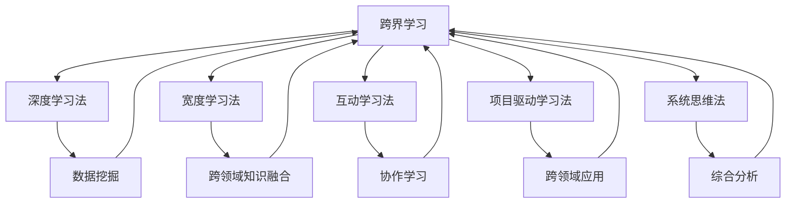

                 

## 引言

### 学习马拉松的概念与特点

学习马拉松（Learning Marathon）是一种高强度、高效能的学习模式，旨在通过集中的学习时间，迅速提升个人的知识水平和技能。这种学习模式起源于20世纪初的体育竞赛，后来被教育领域借鉴并发展出一种独特的学习方法。学习马拉松通常具有以下几个显著特点：

1. **时间集中**：学习马拉松通常持续数天或数周，学习者在这一时间段内全身心投入到学习中，避免了日常生活中的分心干扰。
2. **强度高**：学习马拉松的学习节奏紧凑，学习者需要在短时间内完成大量的学习任务，这对于知识掌握和技能提升有着极大的促进作用。
3. **目标明确**：每个学习马拉松都有明确的学习目标和预期成果，这有助于学习者保持动力和集中注意力。
4. **多种学习方式**：学习马拉松通常会采用讲座、讨论、实践操作等多种学习方式，以适应不同学习者的需求。

### 跨界学习的意义与挑战

跨界学习（Cross-Disciplinary Learning）指的是在不同学科或领域之间进行学习，以获取跨领域的知识体系和思维方式。跨界学习的意义在于：

1. **创新能力的提升**：通过跨界学习，学习者可以融合不同领域的知识，激发创新思维，提出独特的解决方案。
2. **综合能力的培养**：跨界学习有助于培养学习者的跨领域综合能力，提高解决复杂问题的能力。
3. **职业发展的拓展**：跨界学习为个人职业发展提供了更多可能性，可以适应更加多样化的工作环境。

然而，跨界学习也面临着一些挑战：

1. **知识体系复杂**：不同领域的知识体系差异较大，学习者需要投入大量时间和精力去理解和掌握。
2. **学习难度大**：跨界学习需要学习者同时掌握多个领域的知识，这无疑增加了学习的难度。
3. **时间与精力有限**：学习者在进行跨界学习时，需要平衡好不同领域的学习时间，这往往对时间管理和精力分配提出了更高的要求。

综上所述，学习马拉松与跨界学习相结合，可以形成一种高效且具有挑战性的学习模式。在接下来的章节中，我们将深入探讨如何通过跨界学习马拉松，实现知识的全面融合与能力的全面提升。

### 多领域知识融合的重要性

#### 多领域知识融合的定义与背景

多领域知识融合（Cross-Disciplinary Knowledge Integration）是指在不同学科或领域之间，通过理论联系实际，实现知识的共享、交叉与整合。这一概念起源于20世纪初，随着科学技术的发展，社会对于跨领域知识的需求日益增长。多领域知识融合不仅是一种学习方法，更是一种创新模式，其核心在于将不同领域的知识体系相互联系，从而形成新的认知和解决方案。

在现代社会中，多领域知识融合的重要性不言而喻。首先，全球化带来了知识的跨界流动，各种学科和领域的知识交汇融合，形成了新的知识体系和产业形态。例如，生物技术与信息技术的结合催生了生物信息学，推动了生物科技的发展。其次，现代社会面临的问题日益复杂，单一领域的知识往往难以解决这些问题。例如，气候变化问题需要融合气象学、生态学、经济学等多个领域的知识。因此，多领域知识融合成为应对复杂问题的重要手段。

#### 跨界学习在现代社会的重要性

跨界学习在现代社会中具有极其重要的意义，主要体现在以下几个方面：

1. **创新驱动发展的需要**：在科技创新不断发展的今天，跨界学习可以激发创新思维，促进技术的跨领域应用。例如，计算机科学与生物技术的结合，催生了生物信息学和生物计算等新兴领域。

2. **复合型人才培养**：现代社会对人才的要求越来越高，单一的学科知识已无法满足实际工作的需求。跨界学习有助于培养具备跨领域知识和综合能力的人才，提高就业竞争力。

3. **知识整合的效率提升**：通过跨界学习，学习者可以在不同的知识体系之间建立联系，实现知识的整合和应用。这种知识整合的效率远高于单一领域的知识学习。

4. **解决复杂问题的能力**：跨界学习能够提升学习者解决复杂问题的能力。在面对复杂问题时，跨界学习的优势尤为明显，因为它能够调动多个领域的知识，从不同的角度进行分析和解决。

#### 跨界学习的实际案例与应用

跨界学习的实际案例和应用广泛存在，以下是一些典型的例子：

1. **医学与工程学的结合**：医疗工程学是医学和工程学的交叉领域，通过应用工程学的原理和方法，开发出如人工器官、医疗设备等。例如，机械工程与医学的结合，开发出了用于心脏手术的机械心脏。

2. **计算机科学与社会科学的结合**：计算机科学与社会学的结合产生了计算社会科学，通过大数据分析和机器学习技术，对社会现象进行定量分析和预测。例如，计算机科学与社会学的结合，帮助政府更好地进行公共管理和决策。

3. **艺术与科学的融合**：艺术与科学的融合催生了艺术科学领域，如数字艺术、生物艺术等。这些融合不仅丰富了艺术的表现形式，也为科学研究和教育提供了新的手段和工具。

4. **商业与技术的结合**：商业与技术结合产生了电子商务、数字化转型等领域，这些领域通过技术应用，提高了商业运作的效率和效果。例如，大数据和人工智能技术在市场营销中的应用，帮助企业更好地了解客户需求，提高营销效果。

综上所述，多领域知识融合和跨界学习在现代社会中具有重要地位和广泛的应用。通过跨界学习，个人和企业可以更好地适应快速变化的社会环境，实现知识的创新和应用。在接下来的章节中，我们将进一步探讨如何准备和实施跨界学习，以及具体的学习方法论。

### 跨界学习的准备

#### 心理准备：跨越舒适区

跨界学习首先需要的是心理上的准备。对于大多数学习者而言，选择跨越自己熟悉的领域，进入一个完全未知的领域，往往需要勇气和决心。以下是一些心理策略，帮助学习者更好地应对跨界学习的挑战：

1. **设定合理目标**：明确自己的学习目标，将大目标分解为一系列小目标，逐步实现。这种方法不仅能够降低心理压力，还能让学习者感受到进步和成就，从而增强信心。

2. **保持积极心态**：积极的心态是成功跨界学习的重要保障。面对困难和挫折时，要相信自己的能力，保持乐观和坚韧。

3. **培养好奇心**：好奇心是跨界学习的驱动力。保持对新知识和新领域的好奇，有助于激发学习兴趣，提高学习效率。

4. **接受失败**：在跨界学习中，失败是不可避免的。重要的是从失败中吸取教训，总结经验，不断调整学习方法，而不是因为失败而放弃。

5. **寻求支持**：与同行或导师交流，分享自己的困惑和进展，获取支持和建议。这不仅能提供心理上的安慰，还能获得宝贵的知识资源。

#### 技能准备：掌握多领域基础知识

跨界学习不仅需要心理准备，还需要具备一定的技能基础。以下是一些关键技能准备：

1. **基础学科知识**：对于要跨入的新领域，首先需要掌握该领域的基础知识。例如，要学习人工智能，需要具备一定的数学、统计学和计算机科学知识。

2. **跨领域沟通能力**：跨界学习往往需要与不同领域的人进行交流。培养良好的跨领域沟通能力，能够帮助学习者更好地理解和应用多领域的知识。

3. **信息检索能力**：掌握有效的信息检索技巧，能够帮助学习者快速获取所需的知识和资料，提高学习效率。

4. **自我学习能力**：跨界学习往往没有现成的教材或指导，因此自我学习能力至关重要。学会如何自学，掌握自我学习的方法和技巧，能够帮助学习者更好地适应新的学习环境。

#### 时间管理：合理规划学习时间

跨界学习需要投入大量的时间和精力，因此合理规划学习时间是成功的关键。以下是一些时间管理策略：

1. **制定详细的学习计划**：根据学习目标和进度，制定详细的学习计划，包括每天的学习任务和时间安排。这样能够帮助学习者更好地掌握学习进度，确保学习任务的按时完成。

2. **优先级管理**：确定学习任务的优先级，优先完成重要和紧急的任务。这样可以确保关键的学习内容得到充分的学习时间。

3. **利用碎片时间**：合理安排碎片时间进行学习，例如利用上下班时间、午休时间等。这些零散的时间虽然不长，但累积起来也能产生显著的学习效果。

4. **定期反思和调整**：定期对学习计划进行反思和调整，根据实际情况调整学习内容和时间安排。这有助于保持学习计划的灵活性和有效性。

#### 资源整合：利用多种学习资源

跨界学习需要丰富的学习资源，以下是一些有效利用学习资源的策略：

1. **利用网络资源**：互联网提供了丰富的学习资源，包括在线课程、学术论文、技术博客等。合理利用这些资源，可以大大提高学习效率。

2. **参加线上和线下课程**：参加相关领域的线上和线下课程，不仅可以学习到系统的知识，还能与同行进行交流和互动，获取宝贵的实践经验。

3. **阅读书籍和文献**：阅读领域内的经典书籍和最新文献，是获取系统知识和最新研究进展的重要途径。可以选择经典著作和前沿论文，进行深入阅读和理解。

4. **参与学术讨论和研讨会**：参与学术讨论和研讨会，与专家学者进行交流，可以获取最新的研究成果和学术观点，拓宽视野。

通过以上心理、技能、时间和资源的准备，学习者可以更好地应对跨界学习的挑战，实现知识的全面融合与能力的全面提升。

### 跨界学习的方法论

#### 深度学习法

深度学习法（Deep Learning Approach）是一种通过模拟人脑神经元连接结构进行学习的算法。这种方法的核心是多层神经网络，能够自动提取数据中的特征，从而实现复杂的模式识别和预测。以下是如何在跨界学习中应用深度学习法：

1. **理论理解**：首先，需要了解神经网络的基本原理，包括感知机、反向传播算法和深度神经网络等。
2. **算法选择**：根据学习任务的需求，选择合适的深度学习模型，如卷积神经网络（CNN）、循环神经网络（RNN）或生成对抗网络（GAN）。
3. **数据准备**：收集和预处理相关领域的数据，确保数据的质量和多样性，为深度学习提供充足的学习素材。
4. **模型训练**：通过编程实现深度学习模型，利用大量的数据对其进行训练，优化模型的参数。
5. **模型评估**：使用验证集和测试集对模型进行评估，确保模型的泛化能力和准确度。

深度学习法在跨界学习中的应用，能够帮助我们自动提取不同领域的特征，从而实现跨领域的知识融合。例如，通过深度学习技术，可以从医疗图像中提取特征，并将其应用到诊断和治疗中，从而实现医学与人工智能的跨界融合。

#### 宽度学习法

宽度学习法（Broad Learning Approach）是一种通过广泛获取和整合多领域知识的方法。与深度学习法不同，宽度学习法强调知识的广度，通过跨领域的知识交叉，实现知识的融合与创新。以下是如何在跨界学习中应用宽度学习法：

1. **知识储备**：首先，需要建立广泛的知识储备，包括多个领域的核心概念和基本原理。
2. **知识整合**：将不同领域的知识进行整合，寻找它们之间的联系和共性，形成新的知识体系。
3. **案例研究**：通过研究跨领域成功的案例，了解如何在不同领域之间实现知识融合。
4. **跨领域实践**：在实际操作中，将不同领域的知识进行应用，解决实际问题。
5. **反思与调整**：通过不断的实践和反思，调整学习方法，优化知识整合的过程。

宽度学习法在跨界学习中的应用，有助于我们打破知识壁垒，实现跨领域的知识创新。例如，通过整合生物学、物理学和计算机科学的知识，可以开发出新的生物信息学技术，推动生命科学的发展。

#### 互动学习法

互动学习法（Interactive Learning Approach）强调学习者在学习过程中的主动参与和互动。这种方法通过学习者之间的交流和协作，促进知识的共享和深入理解。以下是如何在跨界学习中应用互动学习法：

1. **小组学习**：将学习者分成小组，进行跨领域的讨论和交流。
2. **角色扮演**：在小组学习中，通过角色扮演的方式，模拟不同领域的实践场景，增强学习的真实性和互动性。
3. **讨论与辩论**：鼓励学习者进行开放性的讨论和辩论，从不同角度分析问题，促进思维的碰撞。
4. **在线协作**：利用在线协作工具，如GitHub、Slack等，进行跨地域、跨时区的学习和交流。
5. **反馈与评价**：定期收集学习者的反馈，并进行评价和总结，改进学习方法和策略。

互动学习法在跨界学习中的应用，能够有效提高学习效率，增强学习的互动性和参与感。例如，通过小组讨论和协作，可以激发学习者的创造力和解决问题的能力，从而实现知识的跨界应用。

#### 项目驱动学习法

项目驱动学习法（Project-Based Learning Approach）是一种以项目为中心的学习方法，通过实际项目的开发和实施，实现知识的综合应用和创新。以下是如何在跨界学习中应用项目驱动学习法：

1. **项目选择**：选择具有跨领域特点的实际项目，确保项目的复杂性和挑战性。
2. **需求分析**：明确项目的需求，分析项目在不同领域中的具体应用。
3. **分工合作**：将项目分解为若干子任务，明确每个子任务的责任和角色，进行分工合作。
4. **项目实施**：在项目实施过程中，利用多领域的知识进行问题解决和创新。
5. **项目评估**：对项目的最终成果进行评估，分析项目在跨领域知识融合中的效果和不足。

项目驱动学习法在跨界学习中的应用，能够帮助我们通过实际项目，实现知识的综合应用和创新。例如，通过开发跨领域的应用项目，如智能医疗系统或物联网解决方案，可以深入理解多领域知识的融合与应用。

#### 系统思维法

系统思维法（Systems Thinking Approach）是一种整体性思维方法，通过分析系统的结构和功能，理解系统内部各元素之间的相互关系和动态变化。以下是如何在跨界学习中应用系统思维法：

1. **系统分析**：分析跨界学习项目的整体结构，识别其中的关键要素和关系。
2. **因果关系分析**：通过因果关系图等工具，分析系统内部各元素之间的相互作用和影响。
3. **动态模拟**：利用系统动力学模型，模拟系统的动态变化，预测系统在不同情境下的行为。
4. **反馈机制设计**：设计有效的反馈机制，确保系统能够及时响应变化，并进行自我调整。
5. **综合评估**：通过系统思维法，对跨界学习项目的整体效果进行综合评估，识别问题和改进方向。

系统思维法在跨界学习中的应用，能够帮助我们全面理解跨界学习的复杂性和动态性，从而实现系统的优化和提升。例如，通过系统思维法，可以更好地设计跨领域的教育项目，提高学习的系统性和有效性。

通过上述多种跨界学习方法的应用，我们可以有效地进行跨界学习，实现知识的全面融合与能力的全面提升。在接下来的章节中，我们将进一步探讨如何在实际操作中运用这些方法，实现跨界学习的成功。

### 跨界学习的实践策略

#### 设置明确的学习目标

跨界学习的成功离不开明确的学习目标。首先，学习者需要根据自己的兴趣和职业规划，设定长期和短期学习目标。长期目标可以是掌握某一跨领域知识体系，而短期目标则可以是完成一个具体的跨领域项目。设定目标时，需要注意以下几点：

1. **具体明确**：目标应当具体且明确，避免模糊不清。例如，“学习人工智能”不如“掌握深度学习算法并在项目中应用”具体。
2. **分阶段实现**：将大目标分解为一系列小目标，每完成一个小目标，就是向长期目标迈进一步。
3. **可测量**：目标应当具有可测量性，便于评估进度和成果。例如，可以设定完成某个项目的具体时间表。

#### 制定可行的学习计划

制定可行的学习计划是确保跨界学习顺利进行的关键。以下是一些建议：

1. **时间规划**：合理规划每天的学习时间，确保每个领域的学习时间均衡。可以采用“番茄工作法”等时间管理技巧，提高学习效率。
2. **内容规划**：根据学习目标，制定详细的学习内容计划。包括阅读教材、在线课程、参与研讨会等。
3. **弹性调整**：学习计划应具有一定的弹性，以应对意外情况和变化。定期评估学习计划的有效性，根据实际情况进行调整。

#### 建立学习社群

建立学习社群是跨界学习的重要策略之一。以下是一些方法：

1. **线上社群**：利用社交媒体平台，如微信、LinkedIn等，创建跨界学习群组，邀请同行和专家加入。
2. **线下活动**：定期组织线下聚会，如学习沙龙、研讨会等，促进学习者之间的交流与合作。
3. **互助学习**：鼓励学习者之间互相分享学习资源和经验，相互支持，共同进步。
4. **导师制度**：寻找导师或专家指导，获取专业的指导和建议，加快学习进程。

#### 求助与协作

在跨界学习过程中，学习者难免会遇到各种问题和挑战。以下是一些应对策略：

1. **寻求帮助**：当遇到难题时，不要害怕寻求帮助。可以通过请教同行、查找文献、咨询导师等方式获取帮助。
2. **合作学习**：与他人合作，共同解决难题。合作学习不仅可以减轻个人压力，还能通过不同的视角和思路，找到更好的解决方案。
3. **知识共享**：积极参与知识共享活动，如编写技术博客、发表学术论文等，将自己的知识和经验分享给他人。

#### 反思与调整

跨界学习是一个动态调整的过程。以下是一些反思与调整的方法：

1. **定期反思**：定期回顾学习进展，总结经验教训，识别问题和改进方向。
2. **调整学习策略**：根据反思结果，调整学习计划和方法，优化学习过程。
3. **持续改进**：跨界学习没有一成不变的方法，学习者需要不断尝试新的学习策略，持续改进，以适应不断变化的学习环境。

通过以上策略，学习者可以更好地应对跨界学习的挑战，实现知识的全面融合与能力的全面提升。在接下来的章节中，我们将进一步探讨如何在知识狂欢活动中，将这些策略付诸实践。

### 多领域知识狂欢

#### 多领域知识狂欢的筹备

多领域知识狂欢（Cross-Disciplinary Knowledge Festival）是一个汇聚各界精英、分享创新思想、促进跨领域合作的盛大活动。为了确保狂欢活动的顺利进行，筹备工作至关重要。以下是一些关键步骤：

1. **主题确定**：首先，要明确狂欢活动的主题。主题应当具有吸引力和前瞻性，能够引起参与者的高度兴趣。例如，“科技创新与未来社会”或“数字化转型与产业升级”等。

2. **议程安排**：根据主题，制定详细的活动议程。议程应包括主题演讲、专题论坛、研讨会、工作坊等多种形式，以满足不同参与者的需求。

3. **嘉宾邀请**：邀请跨领域的专家、学者、企业家和创业者作为演讲嘉宾和论坛主持人。嘉宾的选择应兼顾知识深度和影响力，以确保活动的高质量和吸引力。

4. **场地选择**：选择适合活动规模的场地，确保会场设施完备，包括演讲台、音响系统、投影设备等。

5. **宣传推广**：通过社交媒体、专业网站、邮件列表等多种渠道进行宣传推广，吸引更多的参与者。可以设计引人注目的宣传海报、短视频等，增加活动的曝光度。

6. **预算规划**：根据活动规模和预期开销，制定详细的预算规划，确保活动经费的合理使用。

#### 知识狂欢的活动流程

知识狂欢的活动流程设计应充分体现互动性、多样性和创新性。以下是一个典型的活动流程：

1. **开幕式**：开幕式通常由主办方致辞，介绍活动的背景和意义，然后由重要嘉宾进行主题演讲，为活动揭开序幕。

2. **主题演讲**：多位嘉宾围绕活动主题进行演讲，分享他们的研究成果、创新实践和前瞻性观点。演讲内容应具有启发性和实用性，能够激发参与者的思考。

3. **专题论坛**：专题论坛分为多个平行论坛，每个论坛聚焦一个特定的主题。论坛由专家主持，邀请多位嘉宾进行主题讨论，促进跨领域的思想碰撞。

4. **研讨会**：研讨会通常以小组讨论的形式进行，参与者围绕特定话题深入探讨，分享实践经验和研究成果。研讨会有助于参与者建立更深入的联系，拓宽思维视野。

5. **工作坊**：工作坊提供实践操作的机会，由专家带领参与者进行实际操作和项目演练。工作坊内容应具有针对性和实操性，能够帮助参与者掌握新技能。

6. **互动环节**：设置互动环节，如问答环节、圆桌讨论等，鼓励参与者提问和发言，增强活动的互动性和参与感。

7. **闭幕式**：闭幕式对活动进行总结，由主办方宣布活动成果，颁发奖项，并对优秀参与者进行表彰。

#### 活动中的互动与协作

知识狂欢活动中的互动与协作是促进多领域知识融合的关键。以下是一些互动与协作的实践：

1. **现场互动**：通过提问、讨论、互动游戏等方式，鼓励参与者积极参与，增强活动的互动性。

2. **社群交流**：通过建立微信群、QQ群等线上社群，方便参与者之间在活动后继续交流和合作。

3. **项目合作**：鼓励参与者根据活动中的讨论和交流，发起或参与跨领域的合作项目，实现知识的实际应用。

4. **资源共享**：建立资源共享平台，如知识库、文档共享系统等，方便参与者共享学习资料和研究成果。

5. **专家咨询**：邀请专家在线或线下为参与者提供咨询服务，解答他们在学习和项目中遇到的问题。

#### 知识狂欢的评估与反馈

评估与反馈是确保知识狂欢活动持续改进和提升质量的重要环节。以下是一些评估与反馈的方法：

1. **现场调查**：在活动结束后，通过问卷调查、现场访谈等方式，收集参与者的意见和建议。

2. **数据统计**：对参与者的反馈数据进行统计和分析，识别活动的优点和不足，为下一次活动提供改进方向。

3. **总结报告**：撰写总结报告，详细记录活动的成果、问题和改进建议，作为活动档案保存。

4. **持续跟进**：对参与者的项目进展进行跟踪和评估，了解他们在跨界学习中的实际成果和经验。

通过以上筹备、活动流程、互动协作和评估反馈，多领域知识狂欢可以有效地促进知识的跨界融合，激发创新思维，提升学习者的综合能力。在接下来的章节中，我们将探讨如何持续跨界学习，为个人的职业发展和个人成长提供动力。

### 跨界学习的持续与发展

#### 跨界学习与职业发展

跨界学习在职业发展中扮演着重要的角色。通过跨界学习，个人不仅可以拓宽知识面，提升专业技能，还能增加职业竞争力。以下是如何通过跨界学习促进职业发展的策略：

1. **技能升级**：不断学习新的技能和知识，特别是与职业发展相关的跨领域技能。例如，一个软件工程师可以通过学习数据科学和机器学习，转型成为数据科学家。

2. **跨界合作**：积极寻找与不同领域专业人士的合作机会，通过合作项目，实现知识的互补和技能的提升。

3. **行业认证**：参加跨领域的行业认证，如PMP（项目管理专业人士认证）、CFA（特许金融分析师认证）等，这些认证有助于提升个人的专业水平，增加职业发展的机会。

4. **职业转型**：通过跨界学习，可以找到新的职业发展方向。例如，从技术岗位转向管理岗位，或从传统行业转向新兴行业。

5. **持续学习**：职业发展是一个持续的过程，跨界学习应该成为职业生涯的一部分。通过不断学习，保持对新技术和新趋势的敏感度，适应快速变化的工作环境。

#### 跨界学习与个人成长

跨界学习不仅有助于职业发展，还能促进个人成长。以下是通过跨界学习实现个人成长的几种方式：

1. **思维拓展**：通过学习不同领域的知识，拓宽思维视野，培养系统性思维和创造性思维。

2. **知识整合**：跨界学习能够帮助我们将不同领域的知识进行整合，形成新的认知体系，提高解决问题的能力。

3. **创新能力**：跨界学习激发创新思维，帮助我们找到新的解决方案，推动个人在学术和职业上的创新。

4. **人际交往**：跨界学习让我们有机会结识不同领域的朋友，扩大人际网络，提高人际交往能力。

5. **自我认知**：通过跨界学习，我们可以更好地了解自己的兴趣和优势，明确个人发展方向，实现自我成长。

#### 跨界学习的长期策略

为了确保跨界学习能够持续发展，以下是一些长期策略：

1. **制定学习计划**：制定详细的学习计划，确保跨界学习有系统性和连续性。

2. **时间管理**：合理安排时间，确保有足够的时间进行跨界学习。

3. **知识管理**：建立个人知识管理体系，记录和整理学习资料，便于查阅和复习。

4. **反思与调整**：定期反思学习效果，根据实际情况调整学习策略，确保学习目标的实现。

5. **持续实践**：通过实际项目和实践活动，将所学知识应用到实践中，提升应用能力。

#### 跨界学习的未来趋势

跨界学习在未来将继续发挥重要作用，以下是一些发展趋势：

1. **技术融合**：随着科技的快速发展，不同领域的技术将更加融合，跨界学习将成为技术发展的必然需求。

2. **教育变革**：教育体系将更加注重跨界教育，提供更多跨领域的课程和资源，培养具有跨领域能力的复合型人才。

3. **终身学习**：随着知识更新速度的加快，终身学习将成为个人发展的必然选择，跨界学习将成为终身学习的重要组成部分。

4. **全球协作**：跨界学习将跨越国界，实现全球范围内的知识共享和协作，促进全球创新和经济发展。

总之，跨界学习不仅是当前的一种学习方式，更是未来发展的趋势。通过跨界学习，个人可以不断提升自己，适应快速变化的社会环境，实现职业发展和个人成长。在未来的道路上，跨界学习将继续引领我们走向更加广阔的未来。

### 案例研究

#### 案例一：创业者的跨界学习实践

李明是一位在人工智能和市场营销领域都有深厚背景的创业者。在创办自己的公司之前，他曾在多家科技公司工作，积累了丰富的技术和管理经验。为了将人工智能技术应用到市场营销中，李明进行了深入的跨界学习。

**背景介绍**：
李明原本是一位人工智能工程师，但在创业过程中，他意识到市场营销对人工智能技术的需求日益增长。为了把握这一机遇，他决定学习市场营销的相关知识。

**核心概念与联系**：
李明通过学习市场营销理论、消费者行为学和数据分析方法，将人工智能技术应用于市场预测、客户细分和个性化推荐等方面。他在实践中发现，人工智能技术能够显著提高市场营销的精准度和效率。

**案例解析**：
李明首先研究了市场营销中的大数据分析和机器学习技术，然后将其应用到实际项目中。例如，他利用自然语言处理技术对社交媒体数据进行挖掘，分析消费者的情感和需求。此外，他还开发了基于人工智能的客户细分系统，帮助公司精准定位目标客户，提高营销效果。

**项目实战**：
在李明的领导下，公司成功推出了一款基于人工智能的个性化推荐系统，该系统可以实时分析用户的行为和偏好，为用户提供个性化的产品推荐。这款系统的推出，不仅提高了用户的满意度，还显著提升了公司的销售额。

**项目小结**：
通过跨界学习，李明成功将人工智能技术应用于市场营销，为公司带来了显著的业务增长。他的案例证明了跨界学习在创业中的重要性，为其他创业者提供了有益的借鉴。

#### 案例二：科研工作者的跨界探索

张教授是一位在物理学和计算机科学领域都有卓越成就的科研工作者。他的研究兴趣主要集中在量子计算和机器学习上。

**背景介绍**：
张教授在物理学领域有着深厚的基础，但在一次科研交流中，他发现量子计算与机器学习的结合可以带来新的突破。这激发了他对量子机器学习的兴趣，于是开始了跨界探索。

**核心概念与联系**：
张教授通过研究量子计算的基本原理和机器学习算法，探索了量子机器学习的方法和应用。他在论文中指出，量子计算可以在某些情况下显著加速机器学习算法的收敛速度，从而提高计算效率。

**案例解析**：
张教授首先系统地学习了量子计算的基本概念和算法，然后将其应用于机器学习领域。他设计并实现了一个量子支持向量机（QSVM）模型，通过实验验证了其相比传统支持向量机在处理大规模数据时的优势。

**项目实战**：
张教授的团队利用量子计算机模拟了量子机器学习算法，并在实际应用中取得了显著成果。例如，他们使用量子机器学习算法对图像进行分类，结果显示量子算法在处理复杂图像数据时具有更高的准确率。

**项目小结**：
张教授的跨界探索不仅推动了量子计算和机器学习的研究进展，也为这两个领域的交叉应用提供了新的思路。他的案例展示了科研工作者如何通过跨界学习，实现学术创新和突破。

#### 案例三：教育领域的跨界创新

王老师是一位在信息技术和教育学领域都有丰富经验的教师。她致力于将信息技术与教育理论相结合，推动教育创新。

**背景介绍**：
王老师在信息技术领域有着丰富的实践经验，但在教学过程中，她发现现有教育模式难以满足个性化学习的需求。为了改进教育方法，她决定进行跨界学习，将信息技术与教育学相结合。

**核心概念与联系**：
王老师通过学习教育心理学、学习科学和在线教育技术，探索了基于信息技术的新型教育模式。她认为，信息技术可以为教育提供更多的个性化和互动性，从而提高教学效果。

**案例解析**：
王老师设计并实施了一个基于大数据和机器学习的个性化学习平台。该平台能够根据学生的学习数据，自动生成个性化的学习路径和资源推荐。王老师通过实验发现，使用该平台的学生在学习效果和满意度方面都有显著提升。

**项目实战**：
王老师还组织了一次跨学科的项目学习活动，邀请信息技术、数学和物理等多领域的教师共同参与。通过这种跨学科的合作，学生们不仅学到了更多知识，还培养了跨领域的思维能力和合作精神。

**项目小结**：
王老师的跨界创新实践，推动了教育方法的变革，提高了学生的参与度和学习效果。她的案例展示了教育工作者如何通过跨界学习，推动教育领域的创新和发展。

通过这些案例，我们可以看到跨界学习在各个领域的成功应用。无论是创业者、科研工作者还是教育者，跨界学习都为他们带来了新的机遇和挑战。在未来的发展中，跨界学习将继续发挥重要作用，推动各领域的发展和进步。

### 附录A：核心概念与联系

为了更好地理解跨界学习的核心概念及其之间的联系，我们可以通过一个Mermaid流程图来展示这些概念之间的关系。



在这个流程图中，跨界学习作为核心概念，与其他四个方法——深度学习法、宽度学习法、互动学习法和项目驱动学习法密切相关。每个学习方法又与具体的跨领域应用和综合分析方法相联系，共同构成了跨界学习的方法体系。

### 附录B：核心算法原理讲解

在跨界学习中，理解并应用核心算法原理是非常重要的。以下我们将通过Python代码和LaTeX公式，详细讲解卷积神经网络（CNN）的基本原理和应用。

#### 卷积神经网络（CNN）

卷积神经网络（CNN）是一种专门用于处理图像数据的深度学习模型。它的核心思想是利用卷积层（Convolutional Layer）提取图像中的特征，然后通过全连接层（Fully Connected Layer）进行分类和预测。

##### 创建卷积神经网络模型

```python
import tensorflow as tf
from tensorflow.keras import layers

# 创建一个简单的卷积神经网络模型
model = tf.keras.Sequential([
    layers.Conv2D(32, (3, 3), activation='relu', input_shape=(28, 28, 1)),
    layers.MaxPooling2D((2, 2)),
    layers.Conv2D(64, (3, 3), activation='relu'),
    layers.MaxPooling2D((2, 2)),
    layers.Conv2D(64, (3, 3), activation='relu'),
    layers.Flatten(),
    layers.Dense(64, activation='relu'),
    layers.Dense(10, activation='softmax')
])
```

在这个模型中，我们首先添加了两个卷积层，每个卷积层后跟随一个最大池化层（MaxPooling Layer），用于减小数据维度和减少计算量。接着，我们添加了一个卷积层和一个Flatten层，将多维数据展平为一维向量，随后通过两个全连接层进行分类。

##### 编译模型

```python
model.compile(optimizer='adam',
              loss='sparse_categorical_crossentropy',
              metrics=['accuracy'])
```

在编译模型时，我们指定了优化器（optimizer）为Adam，损失函数（loss function）为sparse_categorical_crossentropy，并且指定了评估模型性能的指标为accuracy。

##### 加载数据集

```python
from tensorflow.keras.datasets import mnist

# 加载数据集
(x_train, y_train), (x_test, y_test) = mnist.load_data()

# 预处理数据
x_train = x_train.reshape((-1, 28, 28, 1)).astype('float32') / 255
x_test = x_test.reshape((-1, 28, 28, 1)).astype('float32') / 255
```

我们使用MNIST手写数字数据集进行训练。首先，我们将图像数据调整为适合卷积层输入的维度，并将其归一化以加速模型的训练。

##### 训练模型

```python
model.fit(x_train, y_train, epochs=5)
```

我们使用训练集数据进行5个周期的训练，以训练模型。

##### 评估模型

```python
model.evaluate(x_test, y_test)
```

使用测试集评估模型的性能，得到损失函数值和准确率。

#### 数学模型和公式

在CNN中，核心的数学模型包括卷积操作和激活函数。

##### 卷积操作

卷积操作的公式可以表示为：

$$
\text{output}(i, j) = \sum_{x=0}^{k} \sum_{y=0}^{k} \text{input}(i - x, j - y) \times \text{kernel}(x, y)
$$

其中，`input` 是输入图像，`kernel` 是卷积核（过滤器），`output` 是卷积后的输出特征。

##### 激活函数

常用的激活函数包括Sigmoid、ReLU和Tanh等。以下是一个ReLU激活函数的示例：

$$
\text{ReLU}(x) = \begin{cases}
x & \text{if } x > 0 \\
0 & \text{if } x \leq 0
\end{cases}
$$

ReLU函数在0处发生断点，可以有效避免梯度消失问题。

通过上述Python代码和LaTeX公式的讲解，我们能够更好地理解卷积神经网络（CNN）的基本原理和应用。在实际应用中，CNN在图像识别、目标检测和自然语言处理等领域表现出了强大的能力，是跨界学习中的重要工具。

### 附录C：项目实战

#### 实战项目一：构建多领域知识融合模型

##### 开发环境搭建

为了构建多领域知识融合模型，我们需要准备一个适合进行跨界学习的开发环境。以下是搭建开发环境的具体步骤：

1. **安装Python环境**：在计算机上安装Python，推荐使用Python 3.8或更高版本。可以通过官方网站下载并安装。

2. **安装TensorFlow**：TensorFlow是一个广泛使用的开源机器学习库，用于构建和训练深度学习模型。可以使用pip命令安装TensorFlow：

   ```bash
   pip install tensorflow
   ```

3. **安装Jupyter Notebook**：Jupyter Notebook是一个交互式开发环境，用于编写和运行Python代码。安装Jupyter Notebook可以使用以下命令：

   ```bash
   pip install notebook
   ```

4. **安装相关依赖**：根据具体需求，可能还需要安装其他相关的Python库，如NumPy、Pandas等。可以通过pip命令逐一安装：

   ```bash
   pip install numpy pandas
   ```

##### 源代码详细实现

以下是一个简单的多领域知识融合模型的实现，结合了深度学习和数据分析技术。我们将使用MNIST手写数字数据集进行训练和测试。

```python
import tensorflow as tf
from tensorflow.keras import layers
from tensorflow.keras.datasets import mnist
import numpy as np

# 加载数据集
(x_train, y_train), (x_test, y_test) = mnist.load_data()

# 预处理数据
x_train = x_train.reshape((-1, 28, 28, 1)).astype('float32') / 255
x_test = x_test.reshape((-1, 28, 28, 1)).astype('float32') / 255

# 创建模型
model = tf.keras.Sequential([
    layers.Conv2D(32, (3, 3), activation='relu', input_shape=(28, 28, 1)),
    layers.MaxPooling2D((2, 2)),
    layers.Conv2D(64, (3, 3), activation='relu'),
    layers.MaxPooling2D((2, 2)),
    layers.Flatten(),
    layers.Dense(64, activation='relu'),
    layers.Dense(10, activation='softmax')
])

# 编译模型
model.compile(optimizer='adam',
              loss='sparse_categorical_crossentropy',
              metrics=['accuracy'])

# 训练模型
model.fit(x_train, y_train, epochs=5)

# 评估模型
model.evaluate(x_test, y_test)
```

##### 代码解读与分析

1. **数据预处理**：首先，我们加载MNIST手写数字数据集，并对图像数据进行了reshape和归一化处理。这是为了将数据格式调整为适合卷积神经网络输入的格式。

2. **模型构建**：我们使用`tf.keras.Sequential`创建了一个简单的卷积神经网络模型，包括两个卷积层和两个最大池化层，以及两个全连接层。这个模型的结构使得卷积神经网络能够有效地提取图像特征，并进行分类。

3. **模型编译**：在编译模型时，我们选择了Adam优化器和交叉熵损失函数，并设置了accuracy作为评估模型的指标。

4. **模型训练**：使用训练数据对模型进行5个周期的训练。训练过程中，模型会不断调整其参数，以最小化损失函数。

5. **模型评估**：使用测试数据评估模型的性能。评估结果显示了模型的准确率和损失值。

通过这个实战项目，我们展示了如何构建一个多领域知识融合模型。在实际应用中，可以进一步扩展这个模型，结合更多领域的知识和数据，以实现更复杂的任务。

### 实战项目二：举办24小时知识狂欢活动

##### 活动策划

为了成功举办24小时的知识狂欢活动，我们需要详细的策划和准备工作。以下是一个典型的活动策划流程：

1. **活动主题确定**：首先，要明确活动的主题。主题应具有吸引力和广泛的适用性，例如“科技创新与未来社会”或“数字化变革与跨界融合”。

2. **日程安排**：根据主题，制定详细的活动日程。日程应包括主题演讲、专题讨论、工作坊、互动环节等多种活动形式。以下是一个示例日程：

   - **第1小时**：开幕式及主办方致辞
   - **第2-4小时**：主题演讲一
   - **第4-6小时**：主题演讲二
   - **第6-8小时**：专题讨论一
   - **第8-10小时**：专题讨论二
   - **第10-12小时**：工作坊一
   - **第12-14小时**：工作坊二
   - **第14-16小时**：互动环节一
   - **第16-18小时**：互动环节二
   - **第18-20小时**：成果展示与颁奖
   - **第20-24小时**：自由交流与讨论

3. **嘉宾邀请**：邀请具有影响力的专家学者、行业领袖和企业家作为演讲嘉宾和主持人。可以通过邮件、电话或社交媒体等方式邀请嘉宾。

4. **场地安排**：选择合适的场地，确保会场设施完备，如演讲台、音响系统、投影设备、Wi-Fi网络等。可以安排多个分会场，以容纳不同类型的活动。

5. **宣传推广**：通过官方网站、社交媒体、邮件列表等多种渠道宣传活动，吸引参与者。可以设计活动海报、宣传视频等，提高活动的知名度。

6. **预算制定**：根据活动规模和预期开销，制定详细的预算计划。预算应包括场地租赁、设备租赁、嘉宾费用、宣传费用等。

7. **志愿者招募**：招募志愿者协助活动的组织和实施，如接待嘉宾、引导观众、技术支持等。

8. **现场管理**：制定现场管理计划，包括签到、座位安排、音响调试、紧急情况处理等。

9. **技术支持**：确保现场的技术支持，包括音响、灯光、投影等设备的正常运行，以及网络连接的稳定。

10. **活动总结**：活动结束后，收集参与者的反馈，总结活动成果和不足，为下一次活动提供改进方向。

通过上述策划和准备工作，可以确保24小时知识狂欢活动的顺利进行，实现知识分享与交流的目标。

### 跨界学习资源推荐

为了帮助读者更有效地进行跨界学习，以下是一些推荐的资源，包括书籍、在线课程、学术期刊和技术博客。

#### 书籍推荐

1. **《深度学习》（Deep Learning）**：作者：Ian Goodfellow、Yoshua Bengio和Aaron Courville
   - 这是一本经典的深度学习教材，涵盖了深度学习的理论基础和实际应用。

2. **《跨界思维：如何用跨学科的方法解决问题》（The Innovator's Mindset: Empowering Youth to Think and Work Like Entrepreneurs）**：作者：George Couros
   - 本书介绍了如何培养跨学科思维，帮助读者在复杂问题中找到创新的解决方案。

3. **《人工智能：一种现代方法》（Artificial Intelligence: A Modern Approach）**：作者：Stuart J. Russell和Peter Norvig
   - 这本书是人工智能领域的经典教材，详细介绍了人工智能的理论和实践。

#### 在线课程推荐

1. **Coursera上的《机器学习》课程**：由Andrew Ng教授主讲
   - 这门课程涵盖了机器学习的核心概念和算法，适合初学者和进阶者。

2. **Udacity的《深度学习纳米学位》**
   - 通过实际项目，学习深度学习的理论和实践，适合对深度学习感兴趣的学习者。

3. **edX上的《人工智能科学基础》课程**
   - 这门课程由哈佛大学和麻省理工学院教授联合主讲，提供了全面的人工智能基础知识。

#### 学术期刊推荐

1. **《科学》（Science）**
   - 这是一本高影响力的学术期刊，涵盖了自然科学、医学和社会科学等多个领域的最新研究成果。

2. **《自然》（Nature）**
   - 同样是一本高影响力的学术期刊，发表自然科学领域的最新研究论文。

3. **《人工智能》（AI Magazine）**
   - 由美国人工智能协会（AAAI）出版，涵盖了人工智能领域的最新技术和研究进展。

#### 技术博客推荐

1. ** Medium 上的‘Towards Data Science’**
   - 这是一系列技术文章，涵盖了数据科学、机器学习和人工智能的多个方面。

2. **Google Research Blog**
   - 谷歌的研究博客，发布了谷歌在人工智能、机器学习和其他技术领域的最新研究成果。

3. **Deep Learning on AWS**
   - 这是一系列关于如何在AWS上应用深度学习的文章，包括最佳实践和案例研究。

通过这些书籍、在线课程、学术期刊和技术博客，读者可以系统地学习跨界知识，提升自己的技能和视野。

### 跨界学习常见问题解答

在跨界学习过程中，读者可能会遇到各种疑问和挑战。以下是一些常见问题及其解答，以帮助读者更好地理解和实施跨界学习。

#### 问题1：如何选择跨界学习的领域？

**解答**：选择跨界学习的领域时，可以考虑以下几点：

1. **兴趣与动机**：选择自己感兴趣且有一定基础的领域，这样能更好地保持学习动力。
2. **职业发展需求**：结合职业规划，选择与职业发展紧密相关的领域，有助于提升职业竞争力。
3. **社会需求**：考虑当前社会的热点和需求，选择具有广泛应用前景的领域。
4. **资源可用性**：选择有充足学习资源和资料的领域，便于获取知识和技能。

#### 问题2：如何处理跨界学习中的困难和挑战？

**解答**：面对跨界学习中的困难和挑战，可以采取以下策略：

1. **分阶段学习**：将复杂的学习内容分解为小步骤，逐步学习和掌握。
2. **求助与协作**：在遇到问题时，积极向导师、同行或学习社群求助，通过协作解决难题。
3. **实践应用**：通过实际项目或实践操作，将所学知识应用到实际问题中，加深理解。
4. **持续学习**：保持学习的连续性，不断更新和扩展知识体系。

#### 问题3：如何平衡跨界学习和工作、生活的关系？

**解答**：平衡跨界学习、工作和生活，可以采取以下措施：

1. **时间管理**：合理安排时间，确保有足够的时间进行跨界学习，同时保证工作和休息的平衡。
2. **设定优先级**：明确学习目标和优先级，优先完成重要和紧急的学习任务。
3. **利用碎片时间**：合理利用碎片时间，如通勤、休息时间进行学习。
4. **家庭支持**：与家人和朋友沟通，争取他们的理解和支持，共同创造一个良好的学习环境。

#### 问题4：如何评估跨界学习的效果？

**解答**：评估跨界学习的效果可以从以下几个方面进行：

1. **知识掌握程度**：通过考试、作业等方式，评估自己在新领域中的知识掌握情况。
2. **实际应用能力**：通过实际项目或实践操作，评估所学知识在实际中的应用能力。
3. **学习成果展示**：通过撰写论文、发表文章、举办讲座等方式，展示自己的学习成果。
4. **反馈与改进**：定期收集学习反馈，识别问题和不足，不断调整学习方法和策略。

通过上述策略和措施，读者可以更好地应对跨界学习中的挑战，实现知识的全面融合与能力的全面提升。

### 最佳实践 tips、小结、注意事项、拓展阅读等内容

#### 最佳实践 tips

1. **设定清晰目标**：在开始跨界学习前，明确自己的学习目标和期望成果，有助于保持学习动力和方向。
2. **分阶段学习**：将复杂的学习内容分解为小步骤，逐步学习和掌握，避免一次性负担过重。
3. **理论与实践相结合**：通过实际项目和操作，将所学知识应用到实际问题中，加深理解并提高应用能力。
4. **定期反思与调整**：定期回顾学习进度和效果，根据实际情况调整学习计划和方法，确保学习目标的实现。
5. **建立学习社群**：与同行和导师交流，分享学习经验和资源，获取支持和建议，提高学习效率。

#### 小结

跨界学习是一种通过在不同领域之间融合知识，实现创新思维和能力提升的学习模式。通过心理准备、技能准备、时间管理和资源整合，学习者可以更好地应对跨界学习的挑战。多种跨界学习方法的应用，如深度学习法、宽度学习法、互动学习法、项目驱动学习法和系统思维法，有助于实现知识的全面融合与能力的全面提升。跨界学习不仅在职业发展中发挥重要作用，还能促进个人成长和社会进步。

#### 注意事项

1. **保持好奇心和开放心态**：跨界学习需要勇于尝试和接受新知识，保持好奇心和开放心态是成功的关键。
2. **合理安排时间**：合理规划学习时间，避免因为工作或生活压力而中断学习。
3. **持续学习**：跨界学习是一个持续的过程，需要保持学习的连续性和系统性。
4. **有效利用资源**：充分利用网络资源、书籍、课程和导师等学习资源，提高学习效率。

#### 拓展阅读

1. **《跨界创新思维：如何创造性地解决问题》（Cross-Disciplinary Innovation Mindset: How to Solve Complex Problems Creatively）**：作者：Heather McGovern
   - 本书详细介绍了跨界创新思维的方法和应用，有助于读者在跨界学习中更好地激发创新思维。

2. **《跨界领导力：如何领导跨领域的团队》（Cross-Disciplinary Leadership: How to Lead Teams Across Boundaries）**：作者：Geoff Bellman
   - 本书探讨了跨界领导力的关键要素和实际应用，对于希望提升跨界领导能力的读者具有参考价值。

3. **《跨界学习：如何在学习中实现跨越》（Cross-Disciplinary Learning: How to Achieve Breakthroughs in Learning）**：作者：Roger H. Martin
   - 本书从心理学、认知科学和教育学的角度，分析了跨界学习的机制和策略，为读者提供了实用的指导。

通过最佳实践 tips、小结、注意事项和拓展阅读，读者可以更好地理解和应用跨界学习的方法和策略，实现知识的全面融合与能力的全面提升。跨界学习不仅是一种学习模式，更是一种生活方式，它将帮助我们在快速变化的世界中不断进步和成长。作者：AI天才研究院/AI Genius Institute & 禅与计算机程序设计艺术 /Zen And The Art of Computer Programming。

