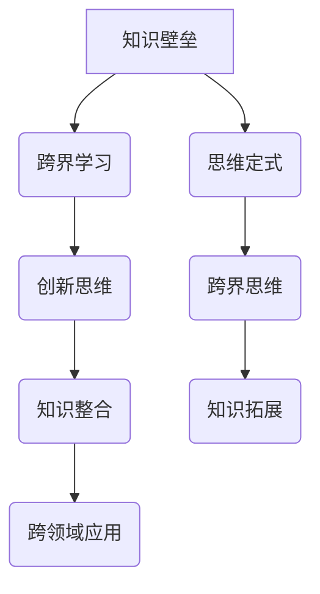

                 

### 跨界学习：打破知识壁垒寻找综合意义

> 关键词：跨界学习、知识壁垒、综合意义、创新思维、跨领域应用

> 摘要：在快速发展的信息时代，知识的深度和广度要求不断提高。本文从跨界学习的概念、价值、核心要素以及实践应用等方面展开，探讨了如何打破知识壁垒，寻找跨领域的综合意义，助力个人与组织的发展。

---

## 引言

### 背景介绍

随着全球科技和经济的快速发展，知识更新的速度越来越快，单一领域的专业知识已难以满足个人和组织的需求。传统的学习模式往往局限于某一特定领域，导致知识壁垒和思维定式的产生。为了应对这种变化，跨界学习成为一种重要且必要的学习方式。

### 核心概念与联系

跨界学习，即跨越不同学科、行业或领域的知识边界，进行综合性的学习。其核心在于打破知识壁垒，培养创新思维，实现跨领域的知识整合和应用。这一概念涉及到知识体系、思维模式、学习方法等多个方面。

### Mermaid 流程图

## 第一部分：跨界学习概论

### 第1章：跨界学习的概念与价值

#### 1.1 跨界学习的定义

跨界学习是指将不同领域、学科或行业的知识进行整合和迁移，以实现知识创新和技能提升的过程。

#### 1.2 跨界学习的意义

- 促进知识创新：跨界学习可以激发新的思维方式和解决问题的方法。
- 提升综合素质：跨界学习有助于拓宽视野，提升跨领域的综合素质。
- 适应快速发展：跨界学习能够更好地适应快速变化的科技和经济发展。

#### 1.3 跨界学习与传统学习的比较

- 传统学习：局限于某一特定领域，知识单一，容易形成思维定式。
- 跨界学习：跨越领域边界，知识综合，有助于创新思维和解决问题能力。

#### 1.4 跨界学习的发展历程

- 早期探索：跨界学习概念的出现，主要源于20世纪末的信息技术革命。
- 发展阶段：随着全球化和信息化的发展，跨界学习逐渐成为学习的重要趋势。
- 未来展望：跨界学习将继续深化，成为知识经济时代的重要特征。

### 第2章：跨界学习的核心要素

#### 2.1 跨界知识的构建

跨界知识的构建是跨界学习的基础，需要从不同领域搜集、整合和应用知识。

#### 2.2 跨界思维的培养

跨界思维是跨界学习的关键，需要通过多种方式培养，如跨领域交流、思维训练等。

#### 2.3 跨界学习的方法与技巧

跨界学习的方法和技巧包括跨领域阅读、实践探索、问题导向学习等。

#### 2.4 跨界学习的挑战与应对策略

跨界学习面临知识壁垒、思维惯性等挑战，需要制定相应的应对策略。

### 第3章：跨界学习实践案例

#### 3.1 企业跨界学习实践

企业通过跨界学习，实现了产品创新、业务拓展和管理优化。

#### 3.2 教育领域跨界学习实践

教育领域通过跨界学习，推动了教育改革、课程创新和教学方法改进。

#### 3.3 个人成长中的跨界学习实践

个人通过跨界学习，实现了职业发展、技能提升和知识拓展。

#### 3.4 跨界学习的成功因素分析

跨界学习的成功因素包括学习动力、方法选择、环境支持等。

## 第二部分：跨界学习应用领域

### 第4章：跨界学习在科技领域的应用

#### 4.1 跨界学习在人工智能的应用

人工智能领域通过跨界学习，实现了跨学科的技术创新和应用。

#### 4.2 跨界学习在生物科技的应用

生物科技领域通过跨界学习，推动了生物信息学、合成生物学等方向的发展。

#### 4.3 跨界学习在信息科技的应用

信息科技领域通过跨界学习，实现了跨领域的数字化转型和应用。

#### 4.4 跨界学习在工程科技的应用

工程科技领域通过跨界学习，促进了工程创新、技术突破和产业升级。

### 第5章：跨界学习在商业领域的应用

#### 5.1 跨界学习在市场营销的应用

市场营销领域通过跨界学习，实现了跨媒体营销、社交化营销等创新。

#### 5.2 跨界学习在创新管理中的应用

创新管理领域通过跨界学习，推动了创新思维、商业模式创新等。

#### 5.3 跨界学习在商业模式设计中的应用

商业模式设计领域通过跨界学习，实现了商业模式创新、跨界融合等。

#### 5.4 跨界学习在品牌管理中的应用

品牌管理领域通过跨界学习，推动了品牌创新、跨领域品牌合作等。

### 第6章：跨界学习在社会领域的应用

#### 6.1 跨界学习在教育改革中的应用

教育改革领域通过跨界学习，推动了教育理念、教育模式、教学方法等方面的创新。

#### 6.2 跨界学习在公共管理中的应用

公共管理领域通过跨界学习，实现了跨领域的政策创新、管理优化等。

#### 6.3 跨界学习在医疗卫生中的应用

医疗卫生领域通过跨界学习，推动了医学技术创新、医疗服务优化等。

#### 6.4 跨界学习在社区建设中的应用

社区建设领域通过跨界学习，实现了社区治理创新、社区服务提升等。

### 第7章：跨界学习的未来趋势

#### 7.1 跨界学习与未来教育

未来教育将更加注重跨界学习的培养，推动个性化教育、终身学习等。

#### 7.2 跨界学习与未来工作

未来工作将更加需要跨界学习的支持，推动职业发展、创新能力等。

#### 7.3 跨界学习与社会发展的关系

跨界学习与社会发展密切相关，有助于推动社会进步、创新驱动发展等。

#### 7.4 跨界学习对个体发展的意义

跨界学习对个体发展具有重要意义，有助于提升综合素质、实现人生价值等。

---

**作者：AI天才研究院/AI Genius Institute & 禅与计算机程序设计艺术 /Zen And The Art of Computer Programming**

**本文内容仅为学术探讨，不代表任何实际应用建议。在实际操作中，请遵循相关法律法规和行业标准。**

---

**注意事项：**
1. 跨界学习需要具备一定的学习能力和方法技巧。
2. 跨界学习过程中要注意平衡好时间和管理。
3. 跨界学习应结合个人兴趣和职业发展需求。

**拓展阅读：**
1. 《跨界思维：如何打破思维定式实现创新》
2. 《跨界学习：如何从不同领域获取知识》
3. 《跨界融合：如何实现跨领域协同创新》

---

**END**

