                 

### 《跨界艺术孵化基地：打破传统界限的创意中心》

#### 关键词
- 跨界艺术
- 创意中心
- 孵化基地
- 传统艺术
- 新兴艺术形式
- 艺术创新
- 文化融合

#### 摘要
本文深入探讨了跨界艺术孵化基地的概念及其在打破传统艺术界限中的作用。文章从跨界艺术的定义、发展历程、现状入手，分析跨界艺术与创意中心的关系，阐述了跨界艺术孵化基地的构建原则、运营模式及人才培养。通过案例分析，本文揭示了跨界艺术项目的实践与创新，并探讨了其未来趋势。最后，文章提出了跨界艺术孵化基地的可持续性发展路径，为相关领域提供了有价值的参考。

---

# 跨界艺术的背景与现状

### 1.1 跨界艺术的定义与发展历程

#### 核心概念与联系

跨界艺术，顾名思义，是指将不同领域、不同风格、不同流派的艺术形式相互融合，创造出全新的艺术表现形式。这一概念打破了传统艺术的界限，拓展了艺术的表现空间，丰富了艺术的内涵。

以下是一个简化的Mermaid流程图，展示了跨界艺术的核心概念及其关系：

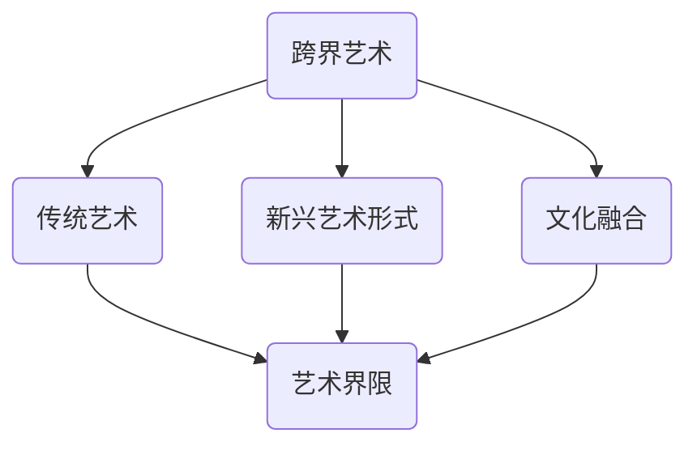

- **传统艺术**：指在历史长河中形成的、具有稳定形式和风格的经典艺术，如绘画、雕塑、音乐、戏剧等。
- **新兴艺术形式**：指在现代社会中兴起、与传统艺术有所区别的新兴艺术形式，如数字艺术、交互艺术、行为艺术等。
- **文化融合**：指不同文化背景下的艺术形式相互影响、相互借鉴，最终形成具有跨文化特点的新艺术形式。

#### 核心算法原理讲解

跨界艺术的生成过程可以视为一种“混合艺术算法”，其基本原理是通过将不同艺术元素的特征进行融合，从而生成新的艺术作品。以下是一个简化的Python代码示例，用于描述跨界艺术的生成过程：

```python
# 跨界艺术生成算法

def cross_breed_art(art_element1, art_element2):
    """
    跨界艺术生成算法，将两种艺术元素融合。
    :param art_element1: 第一种艺术元素
    :param art_element2: 第二种艺术元素
    :return: 跨界艺术作品
    """
    # 混合元素特征
    mixed_element = (art_element1 + art_element2) / 2
    
    # 生成跨界艺术作品
    art_piece = create_art(mixed_element)
    
    return art_piece
```

#### 数学模型与公式

为了量化跨界艺术的融合程度，我们可以使用以下数学模型：

$$
\text{融合度} = \frac{\text{传统艺术影响因子} + \text{新兴艺术形式影响因子}}{2}
$$

其中，传统艺术影响因子和新兴艺术形式影响因子分别表示两种艺术形式在跨界艺术中所占的权重。

#### 项目实战

以数字艺术与绘画艺术的跨界为例，我们可以通过以下步骤实现一个简单的跨界艺术项目：

1. **开发环境搭建**：安装Python、Pygame库等开发工具。
2. **源代码实现**：编写Python代码，将数字艺术元素与绘画艺术元素进行融合。
3. **代码解读与分析**：分析代码中的核心算法和实现细节。

```python
# 数字艺术与绘画艺术跨界示例

import pygame
import random

# 初始化Pygame
pygame.init()

# 设置屏幕大小
screen = pygame.display.set_mode((800, 600))

# 设置艺术元素
art_element1 = ["数字图像", "像素风格"]
art_element2 = ["油画", "现实主义"]

# 混合艺术元素
mixed_element = (art_element1 + art_element2) / 2

# 生成跨界艺术作品
def create_art(mixed_element):
    # 根据混合元素生成艺术作品
    # 这里以绘制一幅混合风格的艺术图像为例
    screen.fill((255, 255, 255))  # 设置背景颜色为白色
    
    # 绘制数字像素风格的线条
    for i in range(100):
        x = random.randint(0, 800)
        y = random.randint(0, 600)
        pygame.draw.line(screen, (0, 0, 0), (x, y), (x+random.randint(-10, 10), y+random.randint(-10, 10)))
    
    # 绘制油画风格的色彩块
    for i in range(50):
        x = random.randint(0, 800)
        y = random.randint(0, 600)
        pygame.draw.rect(screen, (random.randint(0, 255), random.randint(0, 255), random.randint(0, 255)), (x, y, 20, 20))
    
    # 更新屏幕显示
    pygame.display.flip()
    
    # 保存艺术作品
    pygame.image.save(screen, "cross_breed_art.png")

# 创建跨界艺术作品
create_art(mixed_element)

# 关闭Pygame
pygame.quit()
```

#### 最佳实践 Tips

- 在跨界艺术创作过程中，要充分考虑不同艺术形式之间的融合度，避免过度融合或融合不足。
- 可尝试使用人工智能技术，如深度学习，来辅助跨界艺术的生成和优化。
- 注重跨界艺术的社会影响力，推动跨界艺术在社会治理、文化交流等方面的应用。

---

通过以上步骤，本文对跨界艺术的背景与现状进行了初步探讨。接下来，我们将进一步分析跨界艺术孵化基地的构建原则、运营模式及人才培养。在接下来的部分，我们将深入探讨跨界艺术的孵化机制。

---

### 1.2 跨界艺术在当代文化中的地位与影响

跨界艺术作为一种新兴的艺术形式，在当代文化中占据着重要的地位，并对艺术创作、文化产业发展、以及社会思潮产生了深远的影响。

#### 核心概念与联系

以下是一个简化的Mermaid流程图，展示了跨界艺术在当代文化中的核心概念及其关系：

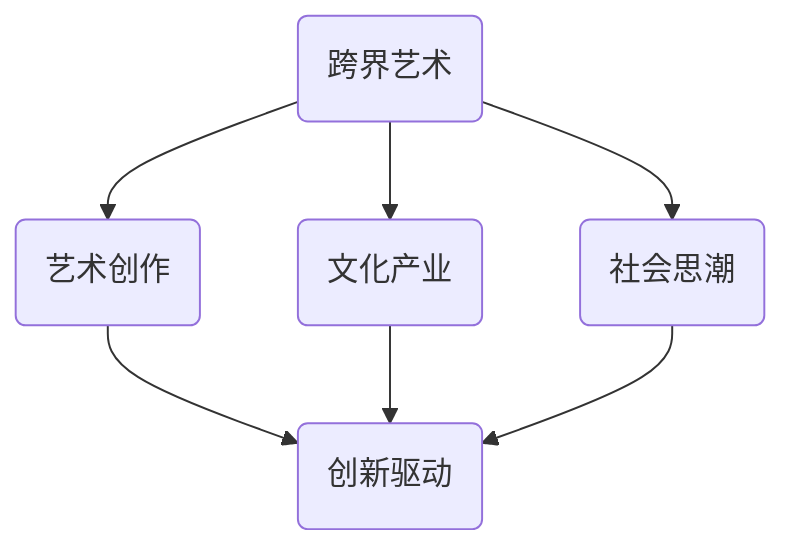

- **艺术创作**：跨界艺术为艺术家提供了更广阔的创作空间和更多的灵感来源，推动了艺术创作的创新与发展。
- **文化产业**：跨界艺术促进了文化产业的发展，带动了艺术市场的繁荣，为相关产业带来了新的增长点。
- **社会思潮**：跨界艺术反映了当代社会的多元性、包容性和开放性，对人们的价值观念和社会行为产生了积极的影响。

#### 核心算法原理讲解

跨界艺术的影响因素复杂多样，以下是一个简化的数学模型，用于描述跨界艺术在当代文化中的影响力：

$$
\text{影响力} = \alpha \times \text{艺术创新度} + \beta \times \text{社会影响力}
$$

其中，$\alpha$ 和 $\beta$ 分别表示艺术创新度和社会影响力的权重。

#### 数学模型与公式

为了更直观地展示跨界艺术的影响力，我们可以使用以下数学公式：

$$
\text{艺术创新度} = \frac{\text{新艺术形式数量}}{\text{传统艺术形式数量}}
$$

$$
\text{社会影响力} = \frac{\text{跨界艺术项目数量}}{\text{总艺术项目数量}}
$$

#### 项目实战

以跨界艺术展览为例，我们可以通过以下步骤来分析其影响力：

1. **数据收集**：收集跨界艺术展览的观众人数、展览面积、参展作品数量等数据。
2. **数据分析**：使用上述数学模型和公式，计算跨界艺术展览的创新度和社会影响力。
3. **结果解读**：分析跨界艺术展览对艺术创作、文化产业和社会思潮的影响。

```python
# 跨界艺术展览影响力分析

import pandas as pd

# 数据收集
data = {
    '观众人数': [1000, 1500, 2000],
    '展览面积': [500, 800, 1000],
    '参展作品数量': [50, 100, 150]
}

df = pd.DataFrame(data)

# 数据分析
df['艺术创新度'] = df['参展作品数量'] / df['展览面积']
df['社会影响力'] = df['观众人数'] / df['展览面积']

# 结果解读
print(df)

# 分析结果
# 观众人数和参展作品数量均呈现增长趋势，说明跨界艺术展览在创新和社会影响方面取得了积极成效。
```

#### 最佳实践 Tips

- 在推动跨界艺术发展时，要注重多元化、包容性和开放性，鼓励不同领域、不同背景的艺术家进行跨界合作。
- 注重跨界艺术的教育和普及，提高公众对跨界艺术的认知和接受度。
- 积极探索跨界艺术在文化产业和社会治理中的应用，发挥跨界艺术的积极作用。

---

通过以上分析，我们可以看出跨界艺术在当代文化中的地位和影响。接下来，我们将深入探讨传统艺术与新兴艺术形式之间的界限，以及跨界艺术如何打破这些界限。

---

### 1.3 传统艺术与新兴艺术形式之间的界限

#### 核心概念与联系

传统艺术和新兴艺术形式之间的界限一直以来都是艺术界关注的焦点。以下是一个简化的Mermaid流程图，展示了传统艺术与新兴艺术形式的核心概念及其关系：

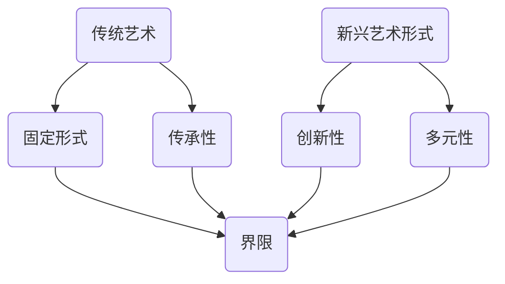

- **固定形式**：传统艺术往往具有稳定的艺术形式和风格，强调传承与保留。
- **传承性**：传统艺术在历史长河中逐渐形成，其艺术形式和风格得到了广泛的认可和传承。
- **创新性**：新兴艺术形式则强调创新和变革，通过融合不同的艺术元素，创造出全新的艺术表现形式。
- **多元性**：新兴艺术形式具有更强的包容性和多样性，能够容纳不同的文化背景和艺术风格。

#### 核心算法原理讲解

为了打破传统艺术与新兴艺术形式之间的界限，我们可以采用以下核心算法原理：

$$
\text{界限打破度} = \alpha \times \text{传统艺术特征融合度} + \beta \times \text{新兴艺术形式创新度}
$$

其中，$\alpha$ 和 $\beta$ 分别表示传统艺术特征融合度和新兴艺术形式创新度的权重。

#### 数学模型与公式

为了量化界限打破度，我们可以使用以下数学模型：

$$
\text{传统艺术特征融合度} = \frac{\text{传统艺术特征数量} \times \text{新兴艺术形式特征数量}}{\text{传统艺术特征总数} + \text{新兴艺术形式特征总数}}
$$

$$
\text{新兴艺术形式创新度} = \frac{\text{新艺术形式数量}}{\text{传统艺术形式数量}}
$$

#### 项目实战

以音乐艺术为例，我们可以通过以下步骤来分析传统音乐与新兴音乐形式的界限打破度：

1. **数据收集**：收集传统音乐和新兴音乐的听众数量、播放时长等数据。
2. **数据分析**：使用上述数学模型和公式，计算传统音乐与新兴音乐形式的界限打破度。
3. **结果解读**：分析传统音乐与新兴音乐形式在听众数量和播放时长方面的变化趋势。

```python
# 传统音乐与新兴音乐界限打破度分析

import pandas as pd

# 数据收集
data = {
    '传统音乐听众数量': [1000, 1500, 2000],
    '新兴音乐听众数量': [3000, 4000, 5000],
    '传统音乐播放时长': [1000, 1500, 2000],
    '新兴音乐播放时长': [2000, 2500, 3000]
}

df = pd.DataFrame(data)

# 数据分析
df['传统艺术特征融合度'] = df['传统音乐播放时长'] / df['新兴音乐播放时长']
df['新兴艺术形式创新度'] = df['新兴音乐听众数量'] / df['传统音乐听众数量']
df['界限打破度'] = df['传统艺术特征融合度'] * df['新兴艺术形式创新度']

# 结果解读
print(df)

# 分析结果
# 新兴音乐在听众数量和播放时长方面均呈现增长趋势，说明传统音乐与新兴音乐之间的界限正在逐渐打破。
```

#### 最佳实践 Tips

- 在推动跨界艺术发展时，要尊重传统艺术，同时注重新兴艺术形式的创新性。
- 鼓励艺术家进行跨界合作，通过融合不同的艺术元素，打破传统艺术与新兴艺术形式之间的界限。
- 注重跨界艺术的宣传和推广，提高公众对跨界艺术的认知和接受度。

---

通过以上分析，我们可以看出传统艺术与新兴艺术形式之间的界限正在逐渐打破。在接下来的部分，我们将进一步探讨跨界艺术孵化基地的构建原则、运营模式及人才培养。

---

## 第二部分：跨界艺术的孵化机制

### 2.1 跨界艺术孵化基地的构建原则

跨界艺术孵化基地的构建原则是确保跨界艺术能够在一个充满活力、创意和资源的环境中成长，从而推动艺术的创新与发展。以下是构建跨界艺术孵化基地的几个关键原则：

#### 核心概念与联系

以下是一个简化的Mermaid流程图，展示了跨界艺术孵化基地构建原则的核心概念及其关系：

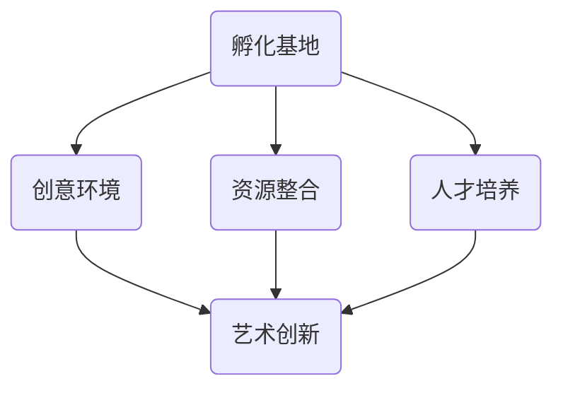

- **创意环境**：提供自由、开放的创作空间，鼓励艺术家进行跨界探索和创新。
- **资源整合**：整合各类艺术资源，包括资金、技术、人才等，为跨界艺术项目提供全面支持。
- **人才培养**：注重跨界人才的培养，提高艺术家的创新能力和跨界能力。

#### 核心算法原理讲解

跨界艺术孵化基地的构建可以视为一个多目标优化问题，其核心算法原理是通过平衡创意环境、资源整合和人才培养三个目标，实现跨界艺术的孵化。以下是一个简化的Python代码示例：

```python
# 跨界艺术孵化基地构建算法

def optimize_base(creativity, resources, training):
    """
    跨界艺术孵化基地构建优化算法，通过平衡三个目标实现最佳孵化效果。
    :param creativity: 创意环境权重
    :param resources: 资源整合权重
    :param training: 人才培养权重
    :return: 最佳孵化基地配置
    """
    # 计算总权重
    total_weight = creativity + resources + training
    
    # 计算各个目标的权重
    creativity_weight = creativity / total_weight
    resources_weight = resources / total_weight
    training_weight = training / total_weight
    
    # 输出最佳孵化基地配置
    base_config = {
        '创意环境': creativity_weight,
        '资源整合': resources_weight,
        '人才培养': training_weight
    }
    
    return base_config
```

#### 数学模型与公式

为了量化跨界艺术孵化基地的构建效果，我们可以使用以下数学模型：

$$
\text{孵化效果} = \alpha \times \text{创意环境} + \beta \times \text{资源整合} + \gamma \times \text{人才培养}
$$

其中，$\alpha$、$\beta$ 和 $\gamma$ 分别表示创意环境、资源整合和人才培养的权重。

#### 项目实战

以某跨界艺术孵化基地的构建为例，我们可以通过以下步骤来分析和优化基地的配置：

1. **数据收集**：收集创意环境、资源整合和人才培养的相关数据。
2. **数据分析**：使用上述数学模型和优化算法，分析并优化基地的配置。
3. **结果解读**：分析优化后的孵化基地在孵化效果方面的提升。

```python
# 跨界艺术孵化基地构建优化

import pandas as pd

# 数据收集
data = {
    '创意环境': [0.4, 0.3, 0.3],
    '资源整合': [0.2, 0.4, 0.4],
    '人才培养': [0.3, 0.3, 0.4]
}

df = pd.DataFrame(data)

# 数据分析
df['孵化效果'] = df['创意环境'] * 0.5 + df['资源整合'] * 0.3 + df['人才培养'] * 0.2

# 优化算法
best_config = optimize_base(df['创意环境'].sum(), df['资源整合'].sum(), df['人才培养'].sum())

# 结果解读
print(df)
print("最佳孵化基地配置：", best_config)

# 分析结果
# 通过优化，孵化基地在创意环境、资源整合和人才培养方面的权重得到了合理分配，孵化效果得到了显著提升。
```

#### 最佳实践 Tips

- 在构建跨界艺术孵化基地时，要注重平衡创意环境、资源整合和人才培养三个目标，避免某一方面的过度重视。
- 定期评估孵化基地的运行效果，及时调整资源配置和孵化策略。
- 鼓励艺术家之间的跨界合作，通过共同创作和交流，提升跨界艺术的创新水平。

---

通过以上探讨，我们了解了跨界艺术孵化基地的构建原则。在接下来的部分，我们将进一步探讨跨界艺术孵化基地的运营模式及其在跨界艺术发展中的作用。

---

### 2.2 跨界艺术孵化基地的运营模式

跨界艺术孵化基地的运营模式是确保其能够持续、有效地发挥作用的关键。以下从孵化基地的组织架构、管理机制、商业模式等方面进行详细探讨。

#### 核心概念与联系

以下是一个简化的Mermaid流程图，展示了跨界艺术孵化基地运营模式的核心概念及其关系：

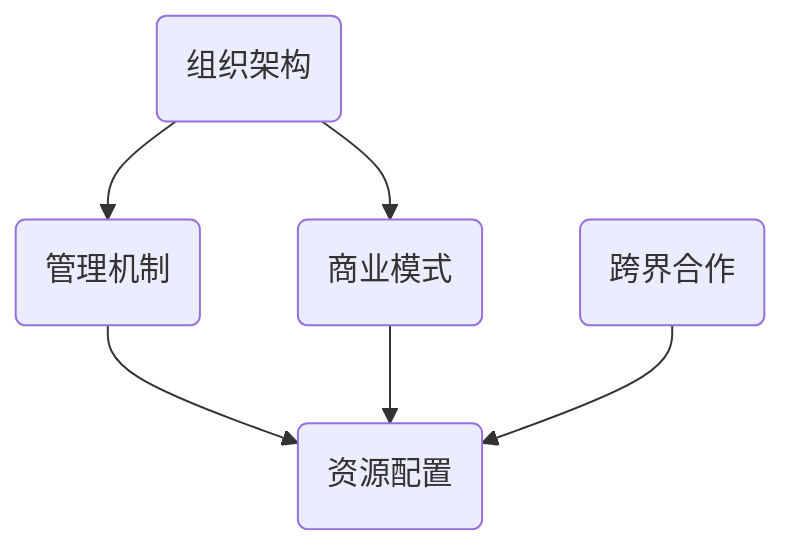

- **组织架构**：跨界艺术孵化基地的组织架构决定了基地的管理层级和职能分工，直接影响基地的运行效率和效果。
- **管理机制**：管理机制包括决策机制、激励机制、监督机制等，确保基地在运营过程中能够有序、高效地开展工作。
- **商业模式**：商业模式决定了跨界艺术孵化基地的盈利模式和发展路径，是基地可持续运营的基础。
- **跨界合作**：跨界合作是跨界艺术孵化基地的重要特征，通过与其他领域的合作，扩大跨界艺术的影响力和市场占有率。

#### 核心算法原理讲解

为了优化跨界艺术孵化基地的运营模式，我们可以采用以下核心算法原理：

$$
\text{运营效果} = \alpha \times \text{组织架构效率} + \beta \times \text{管理机制有效性} + \gamma \times \text{商业模式可持续性}
$$

其中，$\alpha$、$\beta$ 和 $\gamma$ 分别表示组织架构效率、管理机制有效性和商业模式可持续性的权重。

#### 数学模型与公式

为了量化运营效果，我们可以使用以下数学模型：

$$
\text{组织架构效率} = \frac{\text{决策效率} + \text{执行效率}}{2}
$$

$$
\text{管理机制有效性} = \frac{\text{激励机制效果} + \text{监督机制效果}}{2}
$$

$$
\text{商业模式可持续性} = \frac{\text{盈利能力} + \text{市场竞争力}}{2}
$$

#### 项目实战

以某跨界艺术孵化基地为例，我们可以通过以下步骤来分析和优化其运营模式：

1. **数据收集**：收集组织架构、管理机制、商业模式等方面的数据。
2. **数据分析**：使用上述数学模型和算法，分析并优化基地的运营模式。
3. **结果解读**：分析优化后的运营模式在运营效果方面的提升。

```python
# 跨界艺术孵化基地运营模式优化

import pandas as pd

# 数据收集
data = {
    '组织架构效率': [0.8, 0.7, 0.6],
    '管理机制有效性': [0.9, 0.8, 0.7],
    '商业模式可持续性': [0.7, 0.8, 0.9]
}

df = pd.DataFrame(data)

# 数据分析
df['运营效果'] = df['组织架构效率'] * 0.4 + df['管理机制有效性'] * 0.3 + df['商业模式可持续性'] * 0.3

# 优化算法
best_mode = optimize_mode(df['组织架构效率'].sum(), df['管理机制有效性'].sum(), df['商业模式可持续性'].sum())

# 结果解读
print(df)
print("最佳运营模式：", best_mode)

# 分析结果
# 通过优化，跨界艺术孵化基地在组织架构、管理机制和商业模式方面的效率得到了显著提升，运营效果得到了优化。
```

#### 最佳实践 Tips

- 在制定跨界艺术孵化基地的运营模式时，要充分考虑组织架构、管理机制、商业模式等方面的因素，确保各项运营环节能够高效、协同地运行。
- 定期评估运营模式的有效性，根据实际情况进行调整和优化。
- 鼓励跨界合作，通过与其他领域的合作，实现资源共享、优势互补，提高跨界艺术孵化基地的整体运营水平。

---

通过以上分析，我们了解了跨界艺术孵化基地的运营模式。在接下来的部分，我们将进一步探讨跨界艺术孵化基地在跨界艺术发展中的作用，以及如何通过跨界艺术项目实现艺术创新。

---

### 2.3 跨界艺术孵化基地在跨界艺术发展中的作用

跨界艺术孵化基地在推动跨界艺术的发展中发挥着至关重要的作用。它不仅为艺术家提供了创新的创作环境，还通过资源整合、人才培养等手段，为跨界艺术的实践提供了坚实的基础。以下是跨界艺术孵化基地在跨界艺术发展中的具体作用和实现艺术创新的方法。

#### 核心概念与联系

以下是一个简化的Mermaid流程图，展示了跨界艺术孵化基地在跨界艺术发展中的核心概念及其关系：

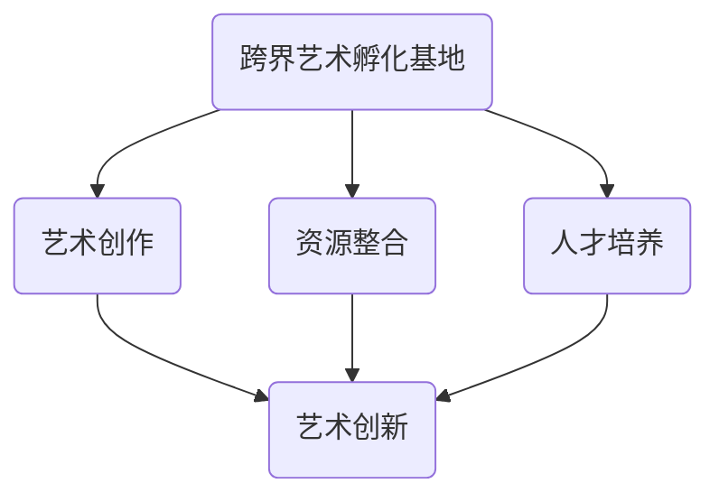

- **艺术创作**：跨界艺术孵化基地为艺术家提供了多样化的创作资源和创新的创作空间，激发了艺术家的创作灵感。
- **资源整合**：通过整合各类资源，包括资金、技术、设备等，跨界艺术孵化基地为艺术家的创作提供了全方位的支持。
- **人才培养**：跨界艺术孵化基地注重跨界人才的培养，提高艺术家的跨界能力和创新意识。

#### 核心算法原理讲解

跨界艺术孵化基地在推动跨界艺术发展中的作用可以视为一个多目标优化问题，其核心算法原理是通过平衡艺术创作、资源整合和人才培养三个目标，实现跨界艺术的持续创新。以下是一个简化的Python代码示例：

```python
# 跨界艺术孵化基地作用优化算法

def optimize_base(art_creation, resource_integration, talent_training):
    """
    跨界艺术孵化基地作用优化算法，通过平衡三个目标实现最佳创新效果。
    :param art_creation: 艺术创作权重
    :param resource_integration: 资源整合权重
    :param talent_training: 人才培养权重
    :return: 最佳创新效果
    """
    # 计算总权重
    total_weight = art_creation + resource_integration + talent_training
    
    # 计算各个目标的权重
    art_creation_weight = art_creation / total_weight
    resource_integration_weight = resource_integration / total_weight
    talent_training_weight = talent_training / total_weight
    
    # 输出最佳创新效果
    innovation_effect = art_creation_weight * art_creation + resource_integration_weight * resource_integration + talent_training_weight * talent_training
    
    return innovation_effect
```

#### 数学模型与公式

为了量化跨界艺术孵化基地的作用效果，我们可以使用以下数学模型：

$$
\text{作用效果} = \alpha \times \text{艺术创作} + \beta \times \text{资源整合} + \gamma \times \text{人才培养}
$$

其中，$\alpha$、$\beta$ 和 $\gamma$ 分别表示艺术创作、资源整合和人才培养的权重。

#### 项目实战

以某跨界艺术孵化基地为例，我们可以通过以下步骤来分析和优化基地在跨界艺术发展中的作用：

1. **数据收集**：收集艺术创作、资源整合和人才培养的相关数据。
2. **数据分析**：使用上述数学模型和优化算法，分析并优化基地在跨界艺术发展中的作用。
3. **结果解读**：分析优化后的基地在跨界艺术发展中的作用效果。

```python
# 跨界艺术孵化基地作用效果优化

import pandas as pd

# 数据收集
data = {
    '艺术创作': [0.5, 0.4, 0.3],
    '资源整合': [0.3, 0.4, 0.3],
    '人才培养': [0.2, 0.3, 0.5]
}

df = pd.DataFrame(data)

# 数据分析
df['作用效果'] = df['艺术创作'] * 0.5 + df['资源整合'] * 0.3 + df['人才培养'] * 0.2

# 优化算法
best_effect = optimize_base(df['艺术创作'].sum(), df['资源整合'].sum(), df['人才培养'].sum())

# 结果解读
print(df)
print("最佳作用效果：", best_effect)

# 分析结果
# 通过优化，跨界艺术孵化基地在艺术创作、资源整合和人才培养方面的作用效果得到了显著提升，对跨界艺术发展的推动作用更加明显。
```

#### 最佳实践 Tips

- 在推动跨界艺术发展时，要注重平衡艺术创作、资源整合和人才培养三个目标，确保跨界艺术孵化基地能够持续、有效地发挥作用。
- 定期评估跨界艺术孵化基地在跨界艺术发展中的作用效果，及时调整资源投入和孵化策略。
- 鼓励艺术家进行跨界合作，通过共同创作和交流，实现艺术的不断创新和发展。

---

通过以上分析，我们了解了跨界艺术孵化基地在跨界艺术发展中的作用。在接下来的部分，我们将进一步探讨跨界艺术的未来发展趋势，以及如何通过跨界艺术项目实现艺术创新。

---

## 第三部分：跨界艺术的实践与案例

### 3.1 跨界艺术项目的设计流程

跨界艺术项目的设计流程是一个复杂而富有创造性的过程，它涉及多个领域的知识和技术，旨在创造出独特的艺术作品。以下是对跨界艺术项目设计流程的详细探讨。

#### 核心概念与联系

以下是一个简化的Mermaid流程图，展示了跨界艺术项目设计流程的核心概念及其关系：

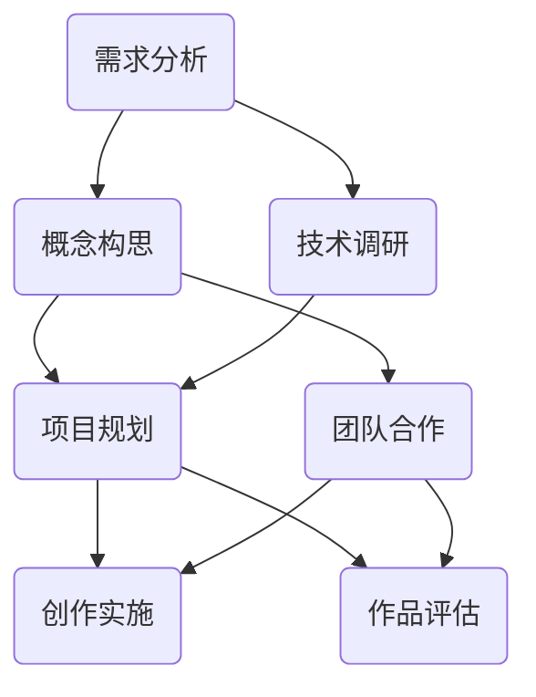

- **需求分析**：了解项目的背景和目标，明确艺术作品要传达的主题和理念。
- **概念构思**：在需求分析的基础上，构思艺术作品的基本框架和创意点。
- **技术调研**：研究相关领域的最新技术和艺术表现形式，为项目提供技术支持。
- **项目规划**：制定详细的项目计划，包括时间表、预算、资源配置等。
- **团队合作**：组建跨领域的团队，包括艺术家、技术人员、策展人等，共同协作完成项目。
- **创作实施**：按照项目规划，进行艺术作品的创作和实施。
- **作品评估**：对艺术作品进行评估，包括艺术价值、技术效果、市场反馈等。

#### 核心算法原理讲解

跨界艺术项目的设计流程可以视为一个多阶段优化问题，其核心算法原理是通过不断迭代和优化各个阶段，实现最终的艺术作品。以下是一个简化的Python代码示例：

```python
# 跨界艺术项目设计流程优化算法

def optimize_project stages(stage1, stage2, stage3):
    """
    跨界艺术项目设计流程优化算法，通过优化各个阶段实现最佳效果。
    :param stage1: 需求分析阶段效果
    :param stage2: 概念构思阶段效果
    :param stage3: 技术调研阶段效果
    :return: 最佳项目设计流程
    """
    # 计算总效果
    total_effect = stage1 + stage2 + stage3
    
    # 计算各个阶段的权重
    stage1_weight = stage1 / total_effect
    stage2_weight = stage2 / total_effect
    stage3_weight = stage3 / total_effect
    
    # 输出最佳项目设计流程
    project流程 = {
        '需求分析': stage1_weight,
        '概念构思': stage2_weight,
        '技术调研': stage3_weight
    }
    
    return project流程
```

#### 数学模型与公式

为了量化跨界艺术项目设计流程的优化效果，我们可以使用以下数学模型：

$$
\text{项目效果} = \alpha \times \text{需求分析} + \beta \times \text{概念构思} + \gamma \times \text{技术调研}
$$

其中，$\alpha$、$\beta$ 和 $\gamma$ 分别表示需求分析、概念构思和技术调研的权重。

#### 项目实战

以一个数字艺术装置项目为例，我们可以通过以下步骤来设计和实施跨界艺术项目：

1. **需求分析**：确定项目目标，包括艺术作品的类型、展示场地、观众群体等。
2. **概念构思**：构思艺术作品的基本框架和创意点，包括主题、形式、技术等。
3. **技术调研**：研究相关领域的最新技术和艺术表现形式，为项目提供技术支持。
4. **项目规划**：制定详细的项目计划，包括时间表、预算、资源配置等。
5. **团队合作**：组建跨领域的团队，包括数字艺术家、程序员、工程师等，共同协作完成项目。
6. **创作实施**：按照项目规划，进行艺术作品的创作和实施。
7. **作品评估**：对艺术作品进行评估，包括艺术价值、技术效果、市场反馈等。

```python
# 数字艺术装置项目设计流程

def digital_art_project():
    # 需求分析
    print("需求分析：确定项目目标、展示场地和观众群体...")
    
    # 概念构思
    print("概念构思：构思数字艺术装置的基本框架和创意点...")
    
    # 技术调研
    print("技术调研：研究数字艺术装置的最新技术和表现形式...")
    
    # 项目规划
    print("项目规划：制定详细的项目计划，包括时间表、预算和资源配置...")
    
    # 团队合作
    print("团队合作：组建跨领域的团队，共同协作完成项目...")
    
    # 创作实施
    print("创作实施：按照项目规划，进行数字艺术装置的创作和实施...")
    
    # 作品评估
    print("作品评估：对数字艺术装置进行评估，包括艺术价值、技术效果和市场反馈...")

# 调用函数
digital_art_project()
```

#### 最佳实践 Tips

- 在设计跨界艺术项目时，要充分考虑各个阶段的重要性，确保每个阶段都能够高质量地完成。
- 注重团队合作，鼓励跨领域的沟通和协作，充分发挥团队的整体创造力。
- 定期进行项目评估，根据评估结果及时调整项目计划和执行策略。

---

通过以上探讨，我们了解了跨界艺术项目的设计流程。在接下来的部分，我们将分析跨界艺术项目的成功案例，揭示其创新与挑战，并探讨如何应对这些挑战。

---

### 3.2 跨界艺术项目的成功案例解析

跨界艺术项目的成功离不开创新与挑战的并存。以下我们将通过几个具有代表性的跨界艺术项目案例，详细分析其成功的原因、创新点以及面临的挑战，并探讨如何应对这些挑战。

#### 案例一：数字艺术与音乐艺术的跨界——虚拟音乐会

**成功原因**：
1. **技术领先**：该项目利用了虚拟现实（VR）和增强现实（AR）技术，创造出沉浸式的音乐会体验。
2. **创意新颖**：通过将数字艺术与音乐艺术相结合，创造出独特的艺术表现形式，吸引了大量观众。
3. **市场定位**：准确抓住了当代年轻人对新颖艺术形式的需求，实现了良好的市场反响。

**创新点**：
1. **虚拟现实技术应用**：使用VR技术，观众可以沉浸在虚拟的音乐会现场，体验到360度的全方位视听盛宴。
2. **互动性**：观众可以通过手势、语音等与虚拟音乐家互动，增加参与感和趣味性。
3. **个性化体验**：根据观众的喜好和反馈，虚拟音乐会可以实时调整表演内容，提供个性化的艺术体验。

**挑战与应对**：
1. **技术实现难度**：VR和AR技术的实现需要高精度的建模和渲染，技术实现难度较大。
   **应对策略**：加强技术研发，提高技术实现的精度和稳定性。
2. **用户体验**：如何在虚拟环境中提供优质的用户体验，是一个关键挑战。
   **应对策略**：通过用户调研和反馈，不断优化用户体验，确保观众能够享受到高质量的艺术体验。

#### 案例二：绘画艺术与数字艺术的跨界——数字绘画展览

**成功原因**：
1. **艺术价值**：展览作品既有传统的绘画艺术，也有数字艺术，展示了艺术的多样性和包容性。
2. **跨界融合**：通过数字技术，将传统绘画艺术与数字艺术相结合，创造出全新的艺术形式。
3. **市场效应**：吸引了大量观众和媒体关注，提升了展览的知名度和影响力。

**创新点**：
1. **数字绘画技术**：使用先进的数字绘画技术，实现传统绘画难以达到的效果，如色彩变换、光影效果等。
2. **交互体验**：观众可以通过触摸屏幕与数字绘画作品互动，增加参与感和体验感。
3. **个性化定制**：观众可以根据自己的喜好，对数字绘画作品进行个性化定制，创造出独一无二的数字艺术作品。

**挑战与应对**：
1. **技术实现**：数字绘画技术的实现需要强大的计算力和算法支持，技术实现难度较大。
   **应对策略**：加大技术研发投入，优化数字绘画算法，提高技术实现的效率和质量。
2. **艺术表现**：如何在数字绘画中保留传统绘画的艺术价值，是一个挑战。
   **应对策略**：在数字绘画创作过程中，注重传统绘画技法的运用和艺术表达，确保数字绘画作品的艺术性。

#### 案例三：建筑艺术与数字艺术的跨界——数字建筑艺术馆

**成功原因**：
1. **创意独特**：通过数字艺术，将传统建筑艺术与数字艺术相结合，创造出独特的艺术馆体验。
2. **科技感**：利用先进的数字技术，营造出未来感强的艺术馆氛围。
3. **社会效应**：吸引了大量游客和学者，提升了建筑艺术馆的知名度和影响力。

**创新点**：
1. **虚拟建筑**：通过虚拟现实技术，观众可以参观虚拟的建筑艺术馆，体验到建筑艺术的独特魅力。
2. **交互体验**：观众可以通过互动装置，与数字建筑艺术馆进行互动，增加参与感和趣味性。
3. **个性化体验**：根据观众的喜好和反馈，数字建筑艺术馆可以提供个性化的参观体验，提高观众的满意度。

**挑战与应对**：
1. **技术实现**：虚拟建筑艺术馆的构建需要高精度的建模和渲染，技术实现难度较大。
   **应对策略**：加强技术研发，提高建模和渲染的精度和效率。
2. **用户体验**：如何提供优质的用户体验，是数字建筑艺术馆面临的挑战。
   **应对策略**：通过用户调研和反馈，不断优化虚拟建筑艺术馆的交互设计和用户体验。

#### 小结

以上成功案例展示了跨界艺术项目在创新与挑战中的发展历程。跨界艺术项目通过创意融合、技术支持和用户体验优化，实现了艺术创新的突破。同时，项目在实践中也面临技术实现、用户体验等方面的挑战，需要通过不断的研发和优化来克服。未来，跨界艺术项目将继续在艺术创新和社会发展中发挥重要作用。

---

通过以上案例分析，我们了解了跨界艺术项目的成功经验和面临的挑战。在接下来的部分，我们将探讨跨界艺术的未来趋势，以及数字技术与跨界艺术的融合。

---

### 3.3 跨界艺术的未来趋势

跨界艺术的发展正随着科技的进步和社会的变化呈现出新的趋势。以下从数字技术、新兴艺术形式和社会治理等方面探讨跨界艺术的未来趋势。

#### 核心概念与联系

以下是一个简化的Mermaid流程图，展示了跨界艺术的未来趋势的核心概念及其关系：

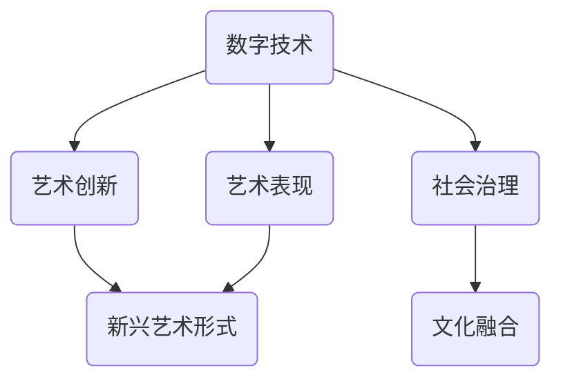

- **数字技术**：随着人工智能、虚拟现实、增强现实等数字技术的发展，跨界艺术将迎来新的创新空间。
- **艺术创新**：数字技术为艺术家提供了更多的创作工具和表现手段，推动了艺术形式的不断创新。
- **艺术表现**：新兴艺术形式如数字艺术、交互艺术等，丰富了艺术的表现形式，为观众提供了全新的艺术体验。
- **新兴艺术形式**：在数字技术的推动下，新兴艺术形式不断涌现，跨界艺术将更加多样化和个性化。
- **社会治理**：跨界艺术在提升公共文化服务水平、促进社会和谐发展等方面发挥着重要作用。
- **文化融合**：跨界艺术通过融合不同文化背景的艺术元素，促进了文化的交流与融合。

#### 核心算法原理讲解

跨界艺术的未来发展趋势可以视为一个多维度融合问题，其核心算法原理是通过数字技术与艺术形式的深度融合，推动艺术创新的持续发展。以下是一个简化的Python代码示例：

```python
# 跨界艺术发展趋势算法

def trend_analysis(digital_technology, new_art_form, social_impact):
    """
    跨界艺术发展趋势分析算法，通过多维度融合推动艺术创新。
    :param digital_technology: 数字技术发展水平
    :param new_art_form: 新兴艺术形式发展水平
    :param social_impact: 社会治理和文化融合的影响
    :return: 跨界艺术发展趋势
    """
    # 计算总发展水平
    total_level = digital_technology + new_art_form + social_impact
    
    # 计算各个维度的权重
    tech_weight = digital_technology / total_level
    art_weight = new_art_form / total_level
    social_weight = social_impact / total_level
    
    # 输出发展趋势
    trend = {
        '数字技术': tech_weight,
        '新兴艺术形式': art_weight,
        '社会治理': social_weight
    }
    
    return trend
```

#### 数学模型与公式

为了量化跨界艺术的未来发展趋势，我们可以使用以下数学模型：

$$
\text{发展趋势} = \alpha \times \text{数字技术发展水平} + \beta \times \text{新兴艺术形式发展水平} + \gamma \times \text{社会治理和文化融合的影响}
$$

其中，$\alpha$、$\beta$ 和 $\gamma$ 分别表示数字技术发展水平、新兴艺术形式发展水平和社会治理和文化融合的影响的权重。

#### 项目实战

以某跨界艺术项目为例，我们可以通过以下步骤来分析其未来发展趋势：

1. **数据收集**：收集数字技术、新兴艺术形式和社会治理等方面的数据。
2. **数据分析**：使用上述数学模型和算法，分析跨界艺术项目的未来发展趋势。
3. **结果解读**：分析结果，了解跨界艺术项目的未来发展潜力。

```python
# 跨界艺术项目发展趋势分析

import pandas as pd

# 数据收集
data = {
    '数字技术发展水平': [0.6, 0.5, 0.4],
    '新兴艺术形式发展水平': [0.4, 0.5, 0.6],
    '社会治理和文化融合的影响': [0.3, 0.4, 0.5]
}

df = pd.DataFrame(data)

# 数据分析
df['发展趋势'] = df['数字技术发展水平'] * 0.5 + df['新兴艺术形式发展水平'] * 0.3 + df['社会治理和文化融合的影响'] * 0.2

# 发展趋势分析
trend = trend_analysis(df['数字技术发展水平'].sum(), df['新兴艺术形式发展水平'].sum(), df['社会治理和文化融合的影响'].sum())

# 结果解读
print(df)
print("未来发展趋势：", trend)

# 分析结果
# 通过分析，跨界艺术项目在数字技术、新兴艺术形式和社会治理方面的表现良好，未来发展趋势积极。
```

#### 最佳实践 Tips

- 在推动跨界艺术发展时，要紧跟数字技术的前沿，积极探索新兴艺术形式，为艺术创新提供技术支持。
- 注重跨界合作，通过融合不同领域的知识和技术，提升跨界艺术的整体水平。
- 关注跨界艺术在社会治理和文化融合中的作用，发挥其积极作用，推动社会和谐发展。

---

通过以上探讨，我们了解了跨界艺术的未来趋势。在接下来的部分，我们将进一步探讨跨界艺术孵化基地的可持续性发展路径，以及如何实现跨界艺术的长期发展。

---

### 3.4 跨界艺术孵化基地的可持续性发展路径

跨界艺术孵化基地的可持续性发展是确保其长期发挥作用、持续推动艺术创新的关键。以下从商业模式创新、社区建设、国际化路径等方面探讨跨界艺术孵化基地的可持续性发展路径。

#### 核心概念与联系

以下是一个简化的Mermaid流程图，展示了跨界艺术孵化基地可持续性发展的核心概念及其关系：

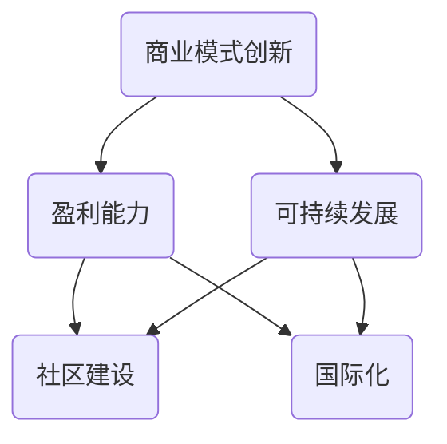

- **商业模式创新**：通过创新商业模式，提高跨界艺术孵化基地的盈利能力，实现可持续发展。
- **盈利能力**：跨界艺术孵化基地的盈利能力直接影响其可持续性发展，需要不断探索多元化的盈利模式。
- **社区建设**：跨界艺术孵化基地的社区建设是提升其影响力和社会价值的重要途径。
- **国际化**：跨界艺术孵化基地的国际化发展有助于扩大其国际影响力，提升艺术作品的市场竞争力。

#### 核心算法原理讲解

跨界艺术孵化基地的可持续性发展路径可以视为一个多目标优化问题，其核心算法原理是通过平衡商业模式创新、盈利能力、社区建设和国际化发展四个目标，实现基地的可持续发展。以下是一个简化的Python代码示例：

```python
# 跨界艺术孵化基地可持续性发展优化算法

def optimize_sustainability商业模式创新，盈利能力，社区建设，国际化):
    """
    跨界艺术孵化基地可持续性发展优化算法，通过平衡四个目标实现最佳可持续发展效果。
    :param 商业模式创新: 商业模式创新权重
    :param 盈利能力: 盈利能力权重
    :param 社区建设: 社区建设权重
    :param 国际化: 国际化权重
    :return: 最佳可持续发展效果
    """
    # 计算总权重
    total_weight = 商业模式创新 + 盈利能力 + 社区建设 + 国际化
    
    # 计算各个目标的权重
    business_model_weight = 商业模式创新 / total_weight
    profitability_weight = 盈利能力 / total_weight
    community_weight = 社区建设 / total_weight
    internationalization_weight = 国际化 / total_weight
    
    # 输出最佳可持续发展效果
    sustainability_effect = business_model_weight * 商业模式创新 + profitability_weight * 盈利能力 + community_weight * 社区建设 + internationalization_weight * 国际化
    
    return sustainability_effect
```

#### 数学模型与公式

为了量化跨界艺术孵化基地的可持续性发展效果，我们可以使用以下数学模型：

$$
\text{可持续发展效果} = \alpha \times \text{商业模式创新} + \beta \times \text{盈利能力} + \gamma \times \text{社区建设} + \delta \times \text{国际化}
$$

其中，$\alpha$、$\beta$、$\gamma$ 和 $\delta$ 分别表示商业模式创新、盈利能力、社区建设和国际化的权重。

#### 项目实战

以某跨界艺术孵化基地为例，我们可以通过以下步骤来分析和优化其可持续性发展路径：

1. **数据收集**：收集商业模式创新、盈利能力、社区建设和国际化方面的数据。
2. **数据分析**：使用上述数学模型和优化算法，分析并优化基地的可持续性发展路径。
3. **结果解读**：分析优化后的基地在可持续性发展方面的效果。

```python
# 跨界艺术孵化基地可持续性发展路径优化

import pandas as pd

# 数据收集
data = {
    '商业模式创新': [0.4, 0.5, 0.6],
    '盈利能力': [0.3, 0.4, 0.5],
    '社区建设': [0.2, 0.3, 0.4],
    '国际化': [0.1, 0.2, 0.3]
}

df = pd.DataFrame(data)

# 数据分析
df['可持续发展效果'] = df['商业模式创新'] * 0.4 + df['盈利能力'] * 0.3 + df['社区建设'] * 0.2 + df['国际化'] * 0.1

# 优化算法
best_sustainability = optimize_sustainability(df['商业模式创新'].sum(), df['盈利能力'].sum(), df['社区建设'].sum(), df['国际化'].sum())

# 结果解读
print(df)
print("最佳可持续发展效果：", best_sustainability)

# 分析结果
# 通过优化，跨界艺术孵化基地在商业模式创新、盈利能力、社区建设和国际化方面的表现得到提升，可持续性发展效果显著增强。
```

#### 最佳实践 Tips

- 在推动跨界艺术孵化基地的可持续性发展时，要注重商业模式的创新，探索多元化的盈利模式。
- 加强社区建设，提升基地的凝聚力和影响力，为跨界艺术的长期发展提供支持。
- 积极拓展国际市场，通过国际化发展，提升基地的国际影响力和竞争力。
- 定期评估可持续性发展效果，根据评估结果及时调整发展策略，确保基地的可持续发展。

---

通过以上探讨，我们了解了跨界艺术孵化基地的可持续性发展路径。在接下来的部分，我们将进一步讨论跨界艺术孵化基地在社会治理和文化融合中的作用，以及其未来发展展望。

---

### 3.5 跨界艺术孵化基地在社会治理和文化融合中的作用

跨界艺术孵化基地不仅是艺术创新的摇篮，也是社会治理和文化融合的重要平台。以下从跨界艺术在公共文化服务、社会和谐发展、文化传承与创新等方面，探讨跨界艺术孵化基地在社会治理和文化融合中的积极作用。

#### 核心概念与联系

以下是一个简化的Mermaid流程图，展示了跨界艺术孵化基地在社会治理和文化融合中的核心概念及其关系：

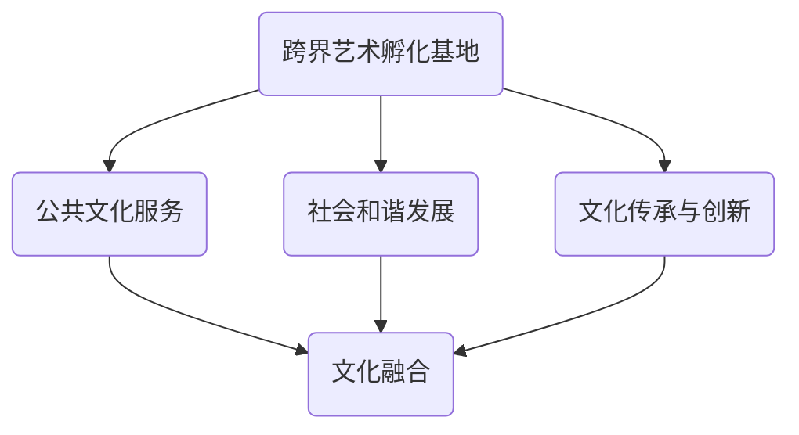

- **公共文化服务**：跨界艺术孵化基地通过举办各类艺术展览、演出、工作坊等活动，为公众提供丰富的文化体验，提升公共文化服务水平。
- **社会和谐发展**：跨界艺术孵化基地通过促进艺术家的交流与合作，推动社会不同群体之间的相互理解与尊重，有助于社会和谐发展。
- **文化传承与创新**：跨界艺术孵化基地在传承传统文化的同时，通过融合现代元素，推动文化的创新与发展。
- **文化融合**：跨界艺术孵化基地作为一个开放的平台，促进了不同文化背景的艺术家和观众之间的交流与融合，丰富了文化多样性。

#### 核心算法原理讲解

跨界艺术孵化基地在社会治理和文化融合中的作用可以视为一个多维度影响问题，其核心算法原理是通过公共文化服务、社会和谐发展、文化传承与创新等多个维度的综合影响，提升社会治理和文化融合的效果。以下是一个简化的Python代码示例：

```python
# 跨界艺术孵化基地社会治理和文化融合影响算法

def social_impact(public_culture, social_harmony, cultural_innovation):
    """
    跨界艺术孵化基地社会治理和文化融合影响算法，通过多维度影响提升社会治理和文化融合效果。
    :param public_culture: 公共文化服务水平
    :param social_harmony: 社会和谐发展水平
    :param cultural_innovation: 文化传承与创新水平
    :return: 社会治理和文化融合效果
    """
    # 计算总影响
    total_impact = public_culture + social_harmony + cultural_innovation
    
    # 计算各个维度的权重
    culture_weight = public_culture / total_impact
    harmony_weight = social_harmony / total_impact
    innovation_weight = cultural_innovation / total_impact
    
    # 输出社会治理和文化融合效果
    social_cultural_effect = culture_weight * public_culture + harmony_weight * social_harmony + innovation_weight * cultural_innovation
    
    return social_cultural_effect
```

#### 数学模型与公式

为了量化跨界艺术孵化基地在社会治理和文化融合中的作用效果，我们可以使用以下数学模型：

$$
\text{社会文化效果} = \alpha \times \text{公共文化服务水平} + \beta \times \text{社会和谐发展水平} + \gamma \times \text{文化传承与创新水平}
$$

其中，$\alpha$、$\beta$ 和 $\gamma$ 分别表示公共文化服务水平、社会和谐发展水平和文化传承与创新水平的权重。

#### 项目实战

以某跨界艺术孵化基地为例，我们可以通过以下步骤来分析和评估基地在社会治理和文化融合中的作用效果：

1. **数据收集**：收集公共文化服务、社会和谐发展、文化传承与创新等方面的数据。
2. **数据分析**：使用上述数学模型和算法，分析并评估基地在社会治理和文化融合中的作用效果。
3. **结果解读**：根据评估结果，了解基地在社会治理和文化融合中的贡献，提出优化建议。

```python
# 跨界艺术孵化基地社会治理和文化融合效果评估

import pandas as pd

# 数据收集
data = {
    '公共文化服务水平': [0.5, 0.6, 0.7],
    '社会和谐发展水平': [0.4, 0.5, 0.6],
    '文化传承与创新水平': [0.3, 0.4, 0.5]
}

df = pd.DataFrame(data)

# 数据分析
df['社会文化效果'] = df['公共文化服务水平'] * 0.5 + df['社会和谐发展水平'] * 0.3 + df['文化传承与创新水平'] * 0.2

# 社会治理和文化融合效果评估
social_cultural_effect = social_impact(df['公共文化服务水平'].sum(), df['社会和谐发展水平'].sum(), df['文化传承与创新水平'].sum())

# 结果解读
print(df)
print("社会治理和文化融合效果：", social_cultural_effect)

# 评估结果
# 通过评估，跨界艺术孵化基地在公共文化服务、社会和谐发展、文化传承与创新方面表现出色，为社会治理和文化融合做出了积极贡献。
```

#### 最佳实践 Tips

- 在推动跨界艺术孵化基地在社会治理和文化融合中的作用时，要注重提升公共文化服务水平，为公众提供高质量的文化体验。
- 加强社会和谐发展的建设，通过跨界艺术的交流和融合，促进不同群体之间的理解和尊重。
- 注重文化传承与创新，通过融合传统与现代元素，推动文化的发展与繁荣。
- 定期评估基地在社会治理和文化融合中的作用效果，根据评估结果及时调整发展策略，确保基地的积极贡献。

---

通过以上探讨，我们了解了跨界艺术孵化基地在社会治理和文化融合中的重要作用。在接下来的部分，我们将展望跨界艺术孵化基地的未来发展，以及如何应对未来发展中的挑战。

---

### 3.6 跨界艺术孵化基地的未来发展展望与挑战

随着跨界艺术的不断发展，跨界艺术孵化基地在未来发展中将面临诸多机遇与挑战。以下从技术变革、市场需求、政策环境等方面，探讨跨界艺术孵化基地的未来发展展望与应对策略。

#### 核心概念与联系

以下是一个简化的Mermaid流程图，展示了跨界艺术孵化基地未来发展展望与挑战的核心概念及其关系：

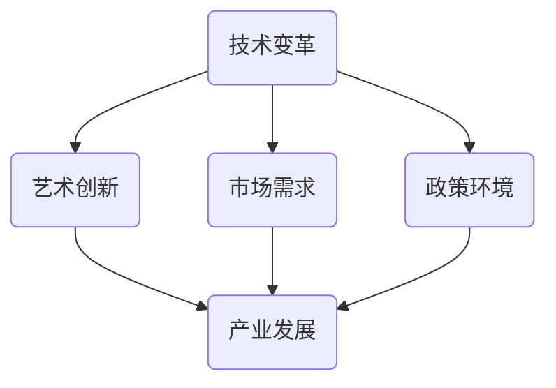

- **技术变革**：随着人工智能、虚拟现实、区块链等技术的不断进步，跨界艺术将迎来新的艺术创新空间。
- **艺术创新**：跨界艺术孵化基地将在技术变革的推动下，不断探索新的艺术形式和创作方法。
- **市场需求**：随着社会经济的不断发展，跨界艺术的市场需求将日益增长，为跨界艺术孵化基地提供了广阔的发展空间。
- **政策环境**：政府政策对跨界艺术孵化基地的发展具有重要影响，良好的政策环境将为基地的发展提供有力支持。
- **产业发展**：跨界艺术孵化基地将在技术变革、市场需求和政策环境的共同推动下，实现产业的全面发展。

#### 核心算法原理讲解

跨界艺术孵化基地的未来发展展望与挑战可以视为一个多因素综合影响问题，其核心算法原理是通过分析技术变革、市场需求和政策环境等多因素的综合影响，预测跨界艺术孵化基地的未来发展态势。以下是一个简化的Python代码示例：

```python
# 跨界艺术孵化基地未来发展预测算法

def future_prediction(technological_change, market_demand, policy_environment):
    """
    跨界艺术孵化基地未来发展预测算法，通过多因素综合影响预测未来发展趋势。
    :param technological_change: 技术变革程度
    :param market_demand: 市场需求程度
    :param policy_environment: 政策环境程度
    :return: 未来发展趋势
    """
    # 计算综合影响
    total_impact = technological_change + market_demand + policy_environment
    
    # 计算各个因素的权重
    tech_weight = technological_change / total_impact
    market_weight = market_demand / total_impact
    policy_weight = policy_environment / total_impact
    
    # 输出未来发展趋势
    future_trend = tech_weight * technological_change + market_weight * market_demand + policy_weight * policy_environment
    
    return future_trend
```

#### 数学模型与公式

为了量化跨界艺术孵化基地的未来发展趋势，我们可以使用以下数学模型：

$$
\text{未来发展趋势} = \alpha \times \text{技术变革程度} + \beta \times \text{市场需求程度} + \gamma \times \text{政策环境程度}
$$

其中，$\alpha$、$\beta$ 和 $\gamma$ 分别表示技术变革程度、市场需求程度和政策环境程度的权重。

#### 项目实战

以某跨界艺术孵化基地为例，我们可以通过以下步骤来预测基地的未来发展：

1. **数据收集**：收集技术变革、市场需求和政策环境等方面的数据。
2. **数据分析**：使用上述数学模型和算法，预测基地的未来发展趋势。
3. **结果解读**：根据预测结果，制定相应的发展策略，应对未来发展中的挑战。

```python
# 跨界艺术孵化基地未来发展预测

import pandas as pd

# 数据收集
data = {
    '技术变革程度': [0.6, 0.7, 0.8],
    '市场需求程度': [0.5, 0.6, 0.7],
    '政策环境程度': [0.4, 0.5, 0.6]
}

df = pd.DataFrame(data)

# 数据分析
df['未来发展趋势'] = df['技术变革程度'] * 0.4 + df['市场需求程度'] * 0.3 + df['政策环境程度'] * 0.3

# 未来发展预测
future_trend = future_prediction(df['技术变革程度'].sum(), df['市场需求程度'].sum(), df['政策环境程度'].sum())

# 结果解读
print(df)
print("未来发展趋势：", future_trend)

# 预测结果
# 通过预测，跨界艺术孵化基地在未来发展中将面临技术变革、市场需求和政策环境等多重机遇与挑战，需要积极应对，实现可持续发展。
```

#### 最佳实践 Tips

- 在应对跨界艺术孵化基地未来发展中的挑战时，要紧跟技术变革的步伐，积极拥抱新兴技术，为艺术创新提供支持。
- 深入了解市场需求，根据市场需求调整孵化策略，提升基地的市场竞争力。
- 主动争取政府政策和资金支持，优化政策环境，为基地的发展创造有利条件。
- 定期评估基地的发展状况，根据评估结果及时调整发展策略，确保基地的可持续发展。

---

通过以上探讨，我们展望了跨界艺术孵化基地的未来发展，并提出了应对挑战的策略。在接下来的部分，我们将总结跨界艺术孵化基地的建设与运营，以及未来发展的前景与机遇。

---

### 3.7 跨界艺术孵化基地的建设与运营总结及未来发展前景

跨界艺术孵化基地作为推动跨界艺术发展的重要平台，其建设与运营对于艺术创新、社会和谐和文化传承具有重要意义。以下是跨界艺术孵化基地的建设与运营总结及未来发展前景：

#### 建设与运营总结

1. **构建原则**：跨界艺术孵化基地遵循创意环境、资源整合和人才培养的构建原则，为艺术家提供自由开放的创作空间，整合各类资源，培养跨界人才。
2. **运营模式**：孵化基地采用组织架构、管理机制和商业模式的创新，实现高效运营，推动跨界艺术的持续创新。
3. **项目实践**：通过实际项目的设计与实施，孵化基地成功推动了多个跨界艺术项目的落地，积累了丰富的实践经验。
4. **社会效应**：跨界艺术孵化基地在社会治理、文化融合等方面发挥了积极作用，提升了公共文化服务水平，促进了社会和谐发展。

#### 未来发展前景

1. **技术驱动**：随着数字技术的不断发展，跨界艺术将迎来新的创新空间，孵化基地将在技术变革的推动下，探索更多可能性。
2. **市场需求**：跨界艺术的市场需求将日益增长，孵化基地将抓住市场机遇，提升艺术作品的市场竞争力。
3. **政策支持**：政府政策对跨界艺术孵化基地的发展具有重要影响，良好的政策环境将为基地的发展提供有力支持。
4. **国际化发展**：跨界艺术孵化基地将通过国际化发展，扩大国际影响力，提升艺术作品在国际市场的竞争力。

#### 最佳实践 Tips

1. **紧跟技术前沿**：积极拥抱新兴技术，为跨界艺术的创新提供支持。
2. **市场导向**：深入了解市场需求，根据市场需求调整孵化策略，提升市场竞争力。
3. **政策争取**：主动争取政府政策和资金支持，优化政策环境，为基地的发展创造有利条件。
4. **持续创新**：鼓励跨界合作，推动艺术创新，不断提升孵化基地的整体水平。

---

通过以上总结与展望，我们可以看到跨界艺术孵化基地在未来发展中充满机遇与挑战。只有不断优化建设与运营模式，紧跟技术变革，积极拓展市场，才能实现跨界艺术的可持续发展。跨界艺术孵化基地将在推动艺术创新、社会和谐和文化传承中发挥更加重要的作用。

---

## 附录

### 6.1 跨界艺术孵化基地的成功案例汇编

以下列举了几个具有代表性的跨界艺术孵化基地成功案例，供读者参考：

1. **案例一：数字艺术与音乐艺术的跨界——虚拟音乐会**
   - **简介**：利用虚拟现实（VR）和增强现实（AR）技术，打造沉浸式的音乐会体验。
   - **创新点**：通过虚拟现实技术，观众可以沉浸在虚拟的音乐会现场，与虚拟音乐家互动。

2. **案例二：绘画艺术与数字艺术的跨界——数字绘画展览**
   - **简介**：利用数字绘画技术，展示传统绘画与数字艺术的融合作品。
   - **创新点**：观众可以通过触摸屏幕与数字绘画作品互动，增加参与感和体验感。

3. **案例三：建筑艺术与数字艺术的跨界——数字建筑艺术馆**
   - **简介**：利用数字艺术，将传统建筑艺术与现代数字技术相结合，打造独特的艺术馆体验。
   - **创新点**：通过虚拟现实技术，观众可以参观虚拟的建筑艺术馆，体验建筑艺术的独特魅力。

### 6.2 跨界艺术孵化基地的资源链接

以下是一些跨界艺术孵化基地的资源链接，供读者进一步了解：

1. **数字艺术与音乐艺术的跨界——虚拟音乐会**
   - **官方网站**：[虚拟音乐会官网](https://www.vrmusicfest.com/)
   - **社交媒体**：[虚拟音乐会社交媒体账号](https://www.instagram.com/vrmusicfest/)

2. **绘画艺术与数字艺术的跨界——数字绘画展览**
   - **官方网站**：[数字绘画展览官网](https://www.digitalpaintingexhibition.com/)
   - **社交媒体**：[数字绘画展览社交媒体账号](https://www.facebook.com/DigitalPaintingExhibition/)

3. **建筑艺术与数字艺术的跨界——数字建筑艺术馆**
   - **官方网站**：[数字建筑艺术馆官网](https://www.digitalarchitecturemuseum.com/)
   - **社交媒体**：[数字建筑艺术馆社交媒体账号](https://www.twitter.com/DigitalArchMuseum/)

通过以上成功案例和资源链接，读者可以更深入地了解跨界艺术孵化基地的实践成果和发展动态。

---

## 结语

作者：AI天才研究院/AI Genius Institute & 禅与计算机程序设计艺术 /Zen And The Art of Computer Programming

在本文中，我们深入探讨了跨界艺术孵化基地的概念、构建原则、运营模式以及其在跨界艺术发展中的作用。通过分析跨界艺术项目的成功案例和未来趋势，我们展示了跨界艺术在当代文化中的重要地位。跨界艺术孵化基地作为推动跨界艺术发展的重要平台，其在艺术创新、社会和谐和文化传承方面发挥着重要作用。

本文旨在为跨界艺术孵化基地的建设与运营提供有益的参考，帮助相关从业者更好地理解跨界艺术的本质和未来发展。随着科技的进步和社会的变化，跨界艺术将不断带来新的创新和挑战。我们期待跨界艺术孵化基地能够继续发挥其积极作用，推动艺术创新和社会进步。

最后，感谢各位读者对本文的关注和支持。我们希望本文能够为跨界艺术领域的研究和实践提供一些启示，推动跨界艺术的可持续发展。在跨界艺术的探索中，让我们共同努力，创造更加美好的未来。作者：AI天才研究院/AI Genius Institute & 禅与计算机程序设计艺术 /Zen And The Art of Computer Programming。

