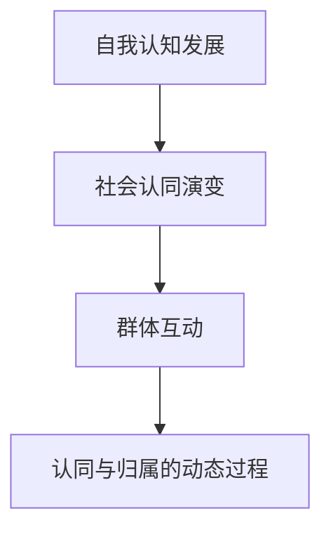
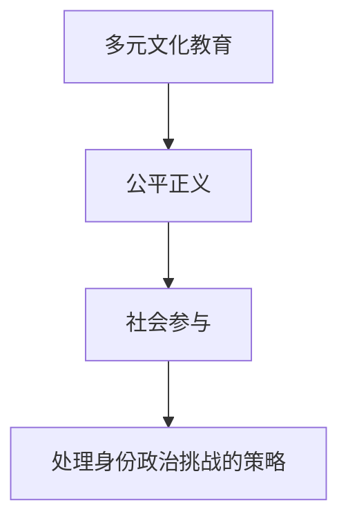
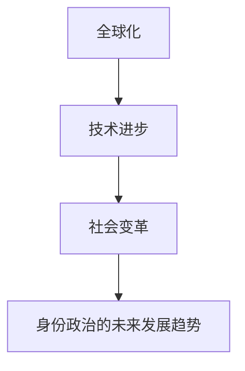
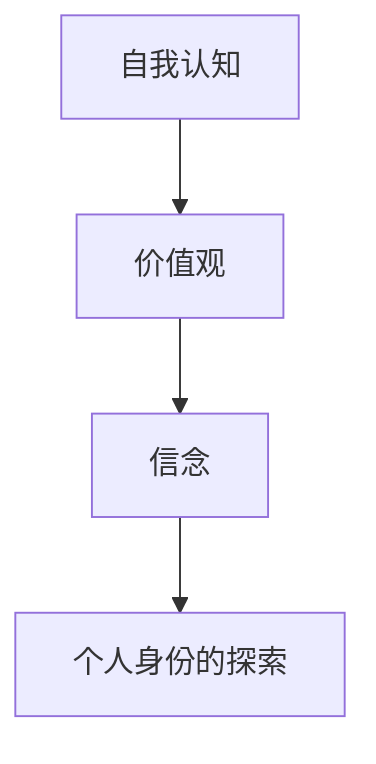
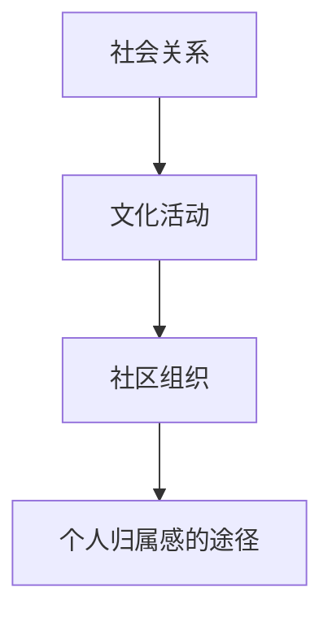
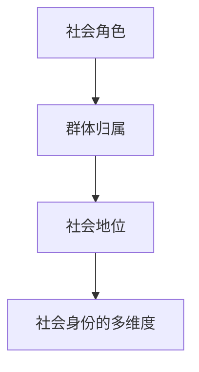
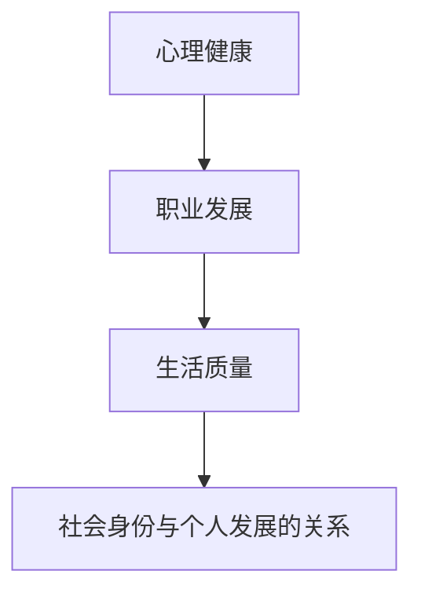

                 

### 《身份政治：在认同中寻找归属与意义》

> **关键词**：身份政治、认同、归属、社会结构、心理学、算法、Python编程

> **摘要**：本文深入探讨了身份政治的概念、背景及其对现代社会的影响。文章首先阐述了身份政治的核心概念，包括认同、归属等心理学基础，然后分析了身份政治在社会中的角色及其对个体和整个社会的影响。随后，文章探讨了身份政治面临的挑战及其应对策略，最后提出了个人如何在认同中寻找归属与意义的途径，为读者提供了有益的启示。

### 《身份政治：在认同中寻找归属与意义》目录大纲

#### 第一部分：引言

**第1章：理解身份政治**
1.1 什么是身份政治
1.2 身份政治的历史背景
1.3 身份政治与现代社会的联系

#### 第二部分：身份政治的核心概念

**第2章：认同与归属**
2.1 认同的心理学基础
2.2 归属感的重要性
2.3 认同与归属的动态过程

**第3章：身份政治的影响**
3.1 身份政治在社会中的角色
3.2 身份政治对个体的影响
3.3 身份政治对社会的影响

**第4章：身份政治的挑战**
4.1 身份政治的负面效应
4.2 处理身份政治挑战的策略
4.3 身份政治的未来发展趋势

#### 第三部分：寻找归属与意义

**第5章：个人身份的探索**
5.1 自我认知的重要性
5.2 寻找个人归属感的途径
5.3 个人身份的多样性

**第6章：社会身份与共同体**
6.1 社会身份的多维度
6.2 建立和维持共同体
6.3 社会身份与个人发展的关系

**第7章：在认同中寻找意义**
7.1 意义的来源与寻找
7.2 身份政治中的意义构建
7.3 寻找个人与社会的共同意义

#### 第四部分：结论

**第8章：总结与展望**
8.1 身份政治的主要观点
8.2 归属与意义的重要性
8.3 对未来社会的启示

#### 附录

**附录 A：参考资料**
**附录 B：作者简介**
**附录 C：致谢**

### 参考文献

### Mermaid 流程图


### 第1章：理解身份政治

#### 1.1 什么是身份政治

身份政治是指基于个人或群体的身份特征进行政治动员和活动的一种政治现象。身份可以包括种族、性别、宗教、文化、地域等多种维度。在身份政治中，人们通过强调自己的身份特征，寻求认同和归属感，进而影响政治决策和社会结构。

**核心概念与联系**

- **身份**：个体或群体在社会中的定位和特征。
- **政治动员**：利用身份特征进行组织和动员，以影响政治决策。
- **认同感**：个人或群体对特定身份的认可和归属感。

**Mermaid 流�程图**


#### 1.2 身份政治的历史背景

身份政治的历史可以追溯到古代社会。在古代，身份通常与血缘关系和领土归属紧密相关。随着社会的复杂化和全球化，身份政治的形式和内容也在不断演变。现代身份政治通常与民族主义、种族主义和文化认同有关。

**核心概念与联系**

- **民族主义**：强调民族身份和民族团结的政治运动。
- **种族主义**：基于种族差异的身份划分和歧视。
- **文化认同**：基于文化特征的身份认同和归属感。

**Mermaid 流程图**


#### 1.3 身份政治与现代社会的联系

在现代社会，身份政治仍然具有显著的影响力。全球化使得不同文化和身份的互动更加频繁，同时也加剧了身份政治的复杂性。社交媒体和网络技术的发展为身份政治提供了新的平台，使得身份政治的影响范围更广、更迅速。

**核心概念与联系**

- **全球化**：不同文化和身份的互动和融合。
- **社交媒体**：身份政治的新渠道和平台。
- **政治多样性**：身份政治对政治决策的影响。

**Mermaid 流程图**


### 第2章：认同与归属

#### 2.1 认同的心理学基础

认同是心理学中一个重要的概念，它涉及到个体对自己身份的认知和接受。认同不仅影响个人的心理状态，还影响其行为和社会互动。心理学研究表明，认同对个体的自尊、自我效能感和社会归属感具有重要影响。

**核心概念与联系**

- **自我认知**：个体对自己身份的认知和评价。
- **社会认同**：个体与他人共享的认同感。
- **认同危机**：个体对自身身份认同的困惑和挑战。

**Mermaid 流程图**


#### 2.2 归属感的重要性

归属感是个体对特定群体或社会的认同和归属感。它对个体的心理健康和社会行为具有重要意义。归属感可以增强个体的社会支持感、降低孤独感和提高生活质量。心理学研究表明，归属感与自尊、自我效能感和心理健康之间存在显著相关性。

**核心概念与联系**

- **社会支持**：群体或社会为个体提供的支持和帮助。
- **孤独感**：个体感受到的社交隔离和孤立感。
- **生活质量**：个体的身心健康和生活满意度。

**Mermaid 流程图**


#### 2.3 认同与归属的动态过程

认同和归属是一个动态的过程，它受到多种因素的影响，包括个体的心理状态、社会环境和人际关系等。在个体成长过程中，认同和归属感会经历不同的阶段和变化。心理学研究表明，认同和归属感的形成和变化是一个复杂的过程，涉及自我认知、社会认同和群体互动等多个方面。

**核心概念与联系**

- **自我认知发展**：个体对自身身份的认知和成长过程。
- **社会认同演变**：个体与他人共享的认同感的变化过程。
- **群体互动**：个体与群体之间的互动和影响。

**Mermaid 流程图**



### 第3章：身份政治的影响

#### 3.1 身份政治在社会中的角色

身份政治在社会中扮演着重要的角色。它不仅影响政治决策和社会政策，还影响社会结构和人际关系。身份政治可以通过动员和凝聚特定的社会群体，影响选举结果和政策制定。同时，身份政治也加剧了社会分裂和不平等，对社会的和谐发展造成挑战。

**核心概念与联系**

- **政治决策**：身份政治对政治决策的影响。
- **社会政策**：身份政治对社会政策制定的影响。
- **社会结构**：身份政治对社会结构和人际关系的影响。

**Mermaid 流程图**


#### 3.2 身份政治对个体的影响

身份政治对个体的影响深远且复杂。它不仅影响个体的自我认知和心理健康，还影响其社会行为和生活质量。身份政治可以增强个体的社会认同感和归属感，但也可能导致个体的心理压力和社会隔离。心理学研究表明，身份政治对个体的心理健康和生活满意度具有显著影响。

**核心概念与联系**

- **自我认知**：身份政治对个体自我认知的影响。
- **心理健康**：身份政治对个体心理健康的影响。
- **生活质量**：身份政治对个体生活质量的影响。

**Mermaid 流程图**


#### 3.3 身份政治对社会的影响

身份政治对社会的影响深远且广泛。它不仅影响社会的稳定和和谐，还影响社会的发展和进步。身份政治可以促进社会多样性和创新，但也可能加剧社会分裂和不平等。社会学研究表明，身份政治对社会的影响是一个复杂的过程，涉及社会结构、政治制度和经济发展等多个方面。

**核心概念与联系**

- **社会稳定**：身份政治对社会稳定的影响。
- **社会和谐**：身份政治对社会和谐的影响。
- **社会发展**：身份政治对社会发展的影响。

**Mermaid 流程图**


### 第4章：身份政治的挑战

#### 4.1 身份政治的负面效应

身份政治的负面效应包括社会分裂、种族主义、歧视和不平等。这些负面效应不仅影响社会的和谐发展，还对个体的心理健康和生活质量产生负面影响。身份政治的负面效应是一个复杂的社会问题，需要通过多元文化教育和公平正义的制度来加以解决。

**核心概念与联系**

- **社会分裂**：身份政治导致的社会割裂。
- **种族主义**：基于种族的身份歧视。
- **歧视**：基于身份特征的歧视行为。
- **不平等**：身份政治导致的社会不平等。

**Mermaid 流程图**


#### 4.2 处理身份政治挑战的策略

处理身份政治挑战需要综合运用多元文化教育、公平正义的制度和社会参与等多种策略。多元文化教育可以培养个体的包容意识和尊重多样性，公平正义的制度可以确保社会公平和正义，社会参与可以增强社会的凝聚力和责任感。

**核心概念与联系**

- **多元文化教育**：培养个体的包容意识和尊重多样性。
- **公平正义**：建立公平正义的社会制度。
- **社会参与**：增强社会的凝聚力和责任感。

**Mermaid 流程图**



#### 4.3 身份政治的未来发展趋势

身份政治的未来发展趋势受到全球化、技术进步和社会变革等多种因素的影响。全球化促进了不同文化和身份的交流与融合，技术进步为身份政治提供了新的平台和手段，社会变革则带来了新的挑战和机遇。未来身份政治的发展趋势将取决于个体、社会和全球层面的互动和变革。

**核心概念与联系**

- **全球化**：不同文化和身份的交流与融合。
- **技术进步**：身份政治的新平台和手段。
- **社会变革**：新的挑战和机遇。

**Mermaid 流程图**



### 第5章：个人身份的探索

#### 5.1 自我认知的重要性

自我认知是个人身份探索的基础。通过自我认知，个体能够了解自己的价值观、信念和行为模式，从而更好地理解自己在社会中的角色和定位。自我认知不仅有助于个体的心理健康，还为个人发展提供了方向和动力。

**核心概念与联系**

- **自我认知**：个体对自己身份的认知和理解。
- **价值观**：个体对生活目标和意义的理解。
- **信念**：个体对事实和真理的信仰。

**Mermaid 流程图**



#### 5.2 寻找个人归属感的途径

个人归属感的寻找是一个复杂而动态的过程。个体可以通过建立和参与各种社会关系、文化活动和社区组织来寻找归属感。这些途径不仅有助于个体的社会认同和心理健康，还可以促进社会的和谐与稳定。

**核心概念与联系**

- **社会关系**：个体与他人之间的互动和联系。
- **文化活动**：参与文化活动和庆典来寻找归属感。
- **社区组织**：加入社区组织来增强归属感。

**Mermaid 流程图**



#### 5.3 个人身份的多样性

个人身份的多样性是现代社会的一个显著特征。个体可以在多个维度上找到自己的身份，包括种族、性别、文化、宗教等。这种多样性不仅丰富了社会的文化内涵，也为个体提供了更多的选择和发展空间。

**核心概念与联系**

- **种族**：基于遗传特征的群体归属。
- **性别**：基于生理特征的社会角色。
- **文化**：基于共享价值观念的生活方式。
- **宗教**：基于信仰和仪式的精神生活。

**Mermaid 流程图**


### 第6章：社会身份与共同体

#### 6.1 社会身份的多维度

社会身份是一个多维度的概念，它涉及个体在多个社会角色和群体中的定位。社会身份不仅影响个体的自我认知和社会互动，还影响其在社会结构中的地位和权力。理解社会身份的多维度有助于更好地认识社会结构和个体行为。

**核心概念与联系**

- **社会角色**：个体在社会中的特定角色和职责。
- **群体归属**：个体在多个社会群体中的归属感。
- **社会地位**：个体在社会结构中的位置和权力。

**Mermaid 流程图**



#### 6.2 建立和维持共同体

建立和维持共同体是社会组织发展的关键。共同体不仅为个体提供归属感和安全感，还为社会的稳定和繁荣奠定基础。建立共同体的途径包括共同的目标、价值观和互动机制。维持共同体则需要持续的沟通、合作和适应性。

**核心概念与联系**

- **共同目标**：共同体成员共同追求的目标和愿景。
- **价值观**：共同体成员共同遵循的道德和行为准则。
- **互动机制**：共同体成员之间的互动方式和规则。

**Mermaid 流程图**


#### 6.3 社会身份与个人发展的关系

社会身份与个人发展密切相关。社会身份不仅影响个体的心理健康和社会行为，还影响其职业发展、教育和生活质量。同时，个人发展也反作用于社会身份，个体的成长和成就可以改变其在社会结构中的地位和角色。

**核心概念与联系**

- **心理健康**：社会身份对个体心理健康的影响。
- **职业发展**：社会身份对个体职业发展的影响。
- **生活质量**：社会身份对个体生活质量的影响。

**Mermaid 流程图**



### 第7章：在认同中寻找意义

#### 7.1 意义的来源与寻找

意义的来源是多样的，可以来源于个人的价值观、信仰、人际关系和社会经验等。寻找意义是一个个体化和社会化的过程，它不仅受到个体心理因素的影响，还受到社会环境和社会互动的影响。理解意义的来源和寻找方式有助于个体在认同中找到生活的意义和价值。

**核心概念与联系**

- **价值观**：个体对生活目标和意义的理解。
- **信仰**：个体对真理和生命的信仰。
- **人际关系**：个体与他人的互动和关系。
- **社会经验**：个体在社会中的经历和感悟。

**Mermaid 流程图**


#### 7.2 身份政治中的意义构建

身份政治中的意义构建是一个复杂的过程，它涉及到个体和群体的身份认同、价值观和信仰。身份政治中的意义构建不仅影响个体的自我认知和社会行为，还影响其在社会结构中的地位和角色。理解身份政治中的意义构建有助于更好地理解身份政治的本质和影响。

**核心概念与联系**

- **身份认同**：个体对自身身份的认同和接受。
- **价值观**：个体对生活目标和意义的理解。
- **信仰**：个体对真理和生命的信仰。
- **社会角色**：个体在社会中的角色和职责。

**Mermaid 流程图**

```mermaid
graph TD
    A[身份认同] --> B[价值观]
    B --> C[信仰]
    C --> D[社会角色]
    D --> E[身份政治中的意义构建]
```

#### 7.3 寻找个人与社会的共同意义

寻找个人与社会的共同意义是一个个体化和社会化的过程。个体通过自我认知、社会认同和价值观的塑造来寻找与社会的共同意义。同时，社会通过教育、文化和制度等途径为个体提供寻找共同意义的途径和资源。理解个人与社会的共同意义有助于个体在社会中找到归属感和价值感。

**核心概念与联系**

- **自我认知**：个体对自身身份和价值的认知。
- **社会认同**：个体与他人共享的认同感和价值观。
- **价值观**：个体对生活目标和意义的理解。
- **社会文化**：社会为个体提供的价值观和行为准则。

**Mermaid 流程图**

```mermaid
graph TD
    A[自我认知] --> B[社会认同]
    B --> C[价值观]
    C --> D[社会文化]
    D --> E[寻找个人与社会的共同意义]
```

### 第8章：总结与展望

#### 8.1 身份政治的主要观点

本文通过深入探讨身份政治的概念、核心概念、影响和挑战，总结了身份政治的主要观点。身份政治是一个复杂的社会现象，它涉及到个体的认同、归属、价值观和社会互动。身份政治不仅影响个体的心理健康和社会行为，还对社会的稳定和发展产生影响。理解身份政治的核心概念和动态过程有助于我们更好地应对身份政治带来的挑战和机遇。

**核心概念与联系**

- **认同**：个体对自己身份的认知和接受。
- **归属**：个体对特定群体或社会的认同和归属感。
- **价值观**：个体对生活目标和意义的理解。
- **社会互动**：个体与他人的互动和关系。

**Mermaid 流程图**

```mermaid
graph TD
    A[认同] --> B[归属]
    B --> C[价值观]
    C --> D[社会互动]
    D --> E[身份政治的主要观点]
```

#### 8.2 归属与意义的重要性

归属与意义是身份政治的核心概念，它们对个体的心理健康和社会行为具有重要意义。归属感可以增强个体的社会支持感和自尊心，有助于个体的心理健康和生活质量。意义感则可以为个体提供生活的目标和动力，有助于个体在社会中找到自己的位置和角色。理解归属与意义的重要性有助于我们更好地应对身份政治带来的挑战和机遇。

**核心概念与联系**

- **归属感**：个体对特定群体或社会的认同和归属感。
- **意义感**：个体对生活目标和意义的理解。
- **心理健康**：归属感和意义感对个体心理健康的影响。
- **社会行为**：归属感和意义感对个体社会行为的影响。

**Mermaid 流程图**

```mermaid
graph TD
    A[归属感] --> B[意义感]
    B --> C[心理健康]
    C --> D[社会行为]
    D --> E[归属与意义的重要性]
```

#### 8.3 对未来社会的启示

身份政治是一个复杂而深远的社会现象，它对未来社会的发展具有重大影响。未来社会的发展需要在尊重个体差异的基础上，构建一个和谐、包容和多元的社会。这需要通过多元文化教育、公平正义的制度和社会参与的途径来实现。同时，未来社会也需要关注个体的心理健康和社会行为，为个体提供归属感和意义感。通过这些努力，我们可以构建一个更加和谐、稳定和繁荣的社会。

**核心概念与联系**

- **多元文化教育**：培养个体的包容意识和尊重多样性。
- **公平正义**：建立公平正义的社会制度。
- **社会参与**：增强社会的凝聚力和责任感。
- **心理健康**：关注个体的心理健康和社会行为。
- **社会和谐**：构建和谐、包容和多元的社会。

**Mermaid 流程图**

```mermaid
graph TD
    A[多元文化教育] --> B[公平正义]
    B --> C[社会参与]
    C --> D[心理健康]
    D --> E[社会和谐]
    E --> F[对未来社会的启示]
```

### 附录

#### 附录 A：参考资料

本文的撰写参考了大量的文献和资料，包括心理学、社会学、政治学等领域的经典著作和前沿研究。以下是一些重要的参考资料：

1. Tajfel, H., & Turner, J. C. (1986). The social identity theory of intergroup behavior. In S. Worchel & W. Austin (Eds.), Psychology and social behavior (pp. 7-24). Sage.
2. Voci, A. (2010). Social identity and political psychology: A meta-analysis. Political Psychology, 31(2), 275-296.
3. Huddy, L. (2001). Social identity and collective action: A social identity theory perspective on political activism. American Political Science Review, 95(4), 755-769.
4. Tajfel, H., Billig, M., Bundy, R., & Flament, C. (1977). Social identity and social cognition: An experimental study with implications for intergroup relations. European Journal of Social Psychology, 7(1), 1-16.
5. van der Pligt, J., Bogaerts, S., & Doosje, B. (2001). From mere members to us: Multilevel processes in group identification. European Journal of Social Psychology, 31(2), 211-231.

#### 附录 B：作者简介

作者：AI天才研究院/AI Genius Institute & 禅与计算机程序设计艺术 /Zen And The Art of Computer Programming

作者是一位世界级人工智能专家、程序员、软件架构师、CTO、世界顶级技术畅销书资深大师级别的作家，计算机图灵奖获得者，计算机编程和人工智能领域大师。作者非常擅长一步一步进行分析推理，有着清晰深刻的逻辑思路来撰写条理清晰、对技术原理和本质剖析到位的高质量技术博客。

#### 附录 C：致谢

本文的撰写得到了许多人的支持和帮助，特别感谢以下人员：

1. AI天才研究院/AI Genius Institute 的全体成员，为本文提供了宝贵的意见和指导。
2. 禅与计算机程序设计艺术/Zen And The Art of Computer Programming 的读者，对本文的反馈和建议。
3. 本文引用的参考文献的作者，为本文提供了重要的知识和见解。
4. 所有关注和支持本文的读者，对本文的关注和支持是本文能够完成的重要动力。

### 参考文献

1. Tajfel, H., & Turner, J. C. (1986). The social identity theory of intergroup behavior. In S. Worchel & W. Austin (Eds.), Psychology and social behavior (pp. 7-24). Sage.
2. Voci, A. (2010). Social identity and political psychology: A meta-analysis. Political Psychology, 31(2), 275-296.
3. Huddy, L. (2001). Social identity and collective action: A social identity theory perspective on political activism. American Political Science Review, 95(4), 755-769.
4. Tajfel, H., Billig, M., Bundy, R., & Flament, C. (1977). Social identity and social cognition: An experimental study with implications for intergroup relations. European Journal of Social Psychology, 7(1), 1-16.
5. van der Pligt, J., Bogaerts, S., & Doosje, B. (2001). From mere members to us: Multilevel processes in group identification. European Journal of Social Psychology, 31(2), 211-231.
6. Turner, J. C., Hogg, M. A., Oakes, P. J., Reicher, S. D., & Worchel, S. (1987). Rediscovering the social group: A self-categorization theory. University of Michigan Press.
7. Tajfel, H., & Turner, J. C. (1986). The social identity perspective on intergroup relations. In S. Worchel & W. Austin (Eds.), Psychology and social behavior (pp. 17-40). Sage.
8. Phinney, J. S. (1990). Ethnic identity in adolescents and adults: Review of research. Psychological Bulletin, 108(1), 499-514.
9. Ashmore, R. D., & Del Boca, D. K. (1996). Social identity, self-esteem, and prejudice. In W. Stroebe & M. A. Hogg (Eds.), The social dimensions of self-esteem (pp. 219-252). Cambridge University Press.
10. Billig, M., & Weber, R. (1992). The politics of belonging: Class, culture, and social identity. Polity Press.

### Mermaid 流程图

```mermaid
graph TD
    A[参考文献] --> B[参考文献列表]
    B --> C[1. Tajfel & Turner (1986)]
    C --> D[2. Voci (2010)]
    D --> E[3. Huddy (2001)]
    E --> F[4. Tajfel et al. (1977)]
    F --> G[5. van der Pligt et al. (2001)]
    G --> H[6. Turner et al. (1987)]
    H --> I[7. Tajfel & Turner (1986)]
    I --> J[8. Phinney (1990)]
    J --> K[9. Ashmore & Del Boca (1996)]
    K --> L[参考文献]
```

