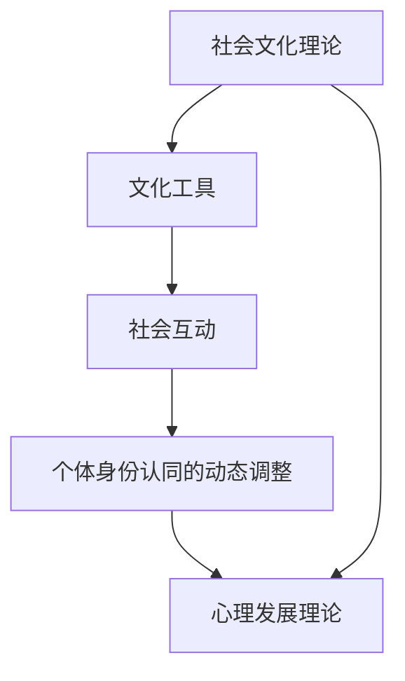

                 

### 引言与背景

#### 身份认同的概念

身份认同（Identity）是指个体对自己归属感、存在意义以及自我理解的认知。它不仅是心理上的自我认同，还包含社会角色、文化背景和价值观等多重维度。身份认同的形成受到个体经验、社会互动、文化传承等多种因素的影响。简单来说，身份认同是个体自我理解和社会定位的综合体。

在个体心理层面，身份认同帮助个体建立自我认同，明确自己的角色和价值。在社会层面，身份认同有助于社会成员的整合与凝聚，促进社会和谐与进步。然而，在现代社会中，随着全球化和多元文化的兴起，传统的身份认同模式受到了挑战，个体需要更加灵活和动态地定义自己的身份。

#### 多元文化的兴起

多元文化（Multiculturalism）是指在一个社会中，多个不同文化群体共存并相互影响的现象。这种文化的多样性不仅体现在民族、宗教和语言等方面，还涉及生活习惯、价值观和社会规范等多个层面。

多元文化的兴起主要得益于全球化进程的加速和各国间交流的增加。随着移民潮的涌现，不同国家和地区的文化在全球范围内得到传播和融合。这种现象不仅丰富了社会文化的多样性，也为个体提供了更多的选择和可能性。然而，多元文化的兴起也带来了文化冲突、认同困惑等问题，要求个体和社会重新审视和定义身份认同。

#### 身份认同流动性的概念

身份认同的流动性（Identity Fluidity）是指个体在不同的社会和文化背景下，灵活调整和重新定义自己的身份认同的过程。与传统的静态身份认同不同，流动性的身份认同更加动态和灵活，能够适应社会和文化环境的变化。

身份认同流动性不仅是个体自我认知的扩展，也是社会互动和文化传承的一种表现形式。它使得个体能够更灵活地应对多元文化的挑战，找到自己的位置和归属感。然而，身份认同流动性也带来了一定的挑战，例如自我认同的不确定性、文化适应的困惑等。

#### 身份认同流动性对个人和社会的影响

身份认同流动性对个人和社会都有着深远的影响。对个人而言，流动性使个体能够更自由地探索和定义自己的身份，有助于增强个体的自信心和创造力。同时，流动性也促使个体更加开放和包容，尊重和欣赏不同文化的多样性。

对社会而言，身份认同流动性有助于社会成员之间的融合和和谐，促进社会的多元发展。流动性使得社会更加包容和开放，能够吸纳不同文化的精华，推动社会的创新和进步。

总之，身份认同流动性是现代社会中的一个重要现象，它不仅挑战了传统的身份认同模式，也为个体和社会带来了新的机遇和挑战。理解身份认同流动性的内涵和影响，有助于我们更好地应对多元文化的挑战，构建一个更加和谐和进步的社会。

### 身份认同的流动性理论

要深入理解身份认同的流动性，我们需要探索其理论基础，这些理论涵盖了社会文化理论、心理发展理论和流动性的社会文化模型。这些理论为我们提供了一个全面的理解框架，帮助我们分析个体如何在多元文化背景下灵活调整自己的身份认同。

#### 社会文化理论

社会文化理论（Sociocultural Theory）是由苏联心理学家列夫·维果斯基（Lev Vygotsky）提出的，强调社会互动和文化背景对个体认知发展的影响。维果斯基认为，个体的认知发展不仅仅是个体内部的过程，而是通过社会互动和文化工具实现的。

在社会文化理论中，关键概念包括“工具”（Tool）和“文化工具”（Cultural Tool）。工具不仅仅是物理物品，还包括语言、符号和文化遗产等。这些工具帮助个体在特定文化背景下进行思考和交流。例如，语言作为一种文化工具，不仅帮助个体进行沟通，还影响个体的思维方式和身份认同。

社会文化理论与身份认同流动性的关系在于，它强调文化工具在个体身份认同形成过程中的作用。随着个体在不同文化背景下的互动，他们使用的文化工具也会发生变化，从而影响他们的身份认同。例如，一个移民到新国家的个体可能会通过学习当地语言和文化，逐渐调整自己的身份认同，以适应新的社会环境。

#### 心理发展理论

心理发展理论（Psychological Development Theory）主要关注个体从出生到成年期间的心理变化和发展。在心理发展理论中，一些重要的理论包括埃里克·埃里克森（Erik Erikson）的心理社会发展阶段理论、让·皮亚杰（Jean Piaget）的认知发展理论和劳伦斯·科尔伯格（Lawrence Kohlberg）的道德发展理论。

埃里克森的心理社会发展阶段理论将个体的心理发展分为八个阶段，每个阶段都有特定的心理冲突和发展任务。例如，青少年期的身份认同对身份危机的应对是关键的发展任务。在这一阶段，个体需要探索自己的身份，形成稳定的自我认同。

心理发展理论与身份认同流动性的关系在于，它揭示了个体在不同发展阶段如何通过探索和适应来调整自己的身份认同。随着个体进入新的生活阶段，他们可能会面临新的身份认同挑战，需要重新定义自己的身份。

#### 流动性的社会文化模型

流动性的社会文化模型（Model of Social Cultural Fluidity）是一个综合性的理论框架，旨在解释个体如何在多元文化背景下灵活调整自己的身份认同。该模型由多个关键概念和假设组成，包括文化多样性、社会互动和个体身份认同的动态调整。

文化多样性（Cultural Diversity）是流动性社会文化模型的基础。在一个多元文化的环境中，个体面临多种文化的影响和挑战。这些文化多样性不仅包括显性的文化特征，如语言和宗教，还包括隐性的文化规范和价值观。

社会互动（Social Interaction）是流动性社会文化模型的核心。个体通过与他人互动，获取文化知识和经验，从而影响他们的身份认同。这些互动可以是正式的，如教育和工作场所的交流，也可以是非正式的，如家庭和朋友的日常交往。

个体身份认同的动态调整（Dynamic Adjustment of Individual Identity）是流动性社会文化模型的关键假设。个体不是被动地接受文化影响，而是主动地调整自己的身份认同，以适应不同的社会和文化环境。这种动态调整使得个体能够更好地适应多元文化背景，实现身份认同的流动性。

#### 核心概念和关系架构

为了更好地理解这些理论之间的关系，我们可以使用Mermaid流程图来展示核心概念和它们的互动关系。以下是一个简化的Mermaid流程图示例：

在这个流程图中，社会文化理论通过文化工具影响社会互动，进而影响个体身份认同的动态调整。同时，社会文化理论也通过心理发展理论影响个体的认知和身份认同。

通过以上理论框架的介绍，我们可以更深入地理解身份认同流动性的概念和机制。接下来，我们将进一步探讨多元文化中的挑战与机遇，以及个体如何应对这些挑战。

### 多元文化的挑战与机遇

在多元文化的背景下，个体身份认同面临诸多挑战与机遇。理解这些挑战与机遇有助于我们更好地应对身份认同的流动性，找到个人在社会中的定位。

#### 多元文化的挑战

1. **文化冲突**：文化冲突是多元文化环境中最常见的问题之一。不同文化之间的价值观、信仰和行为规范可能存在显著差异，导致误解和矛盾。例如，在跨文化团队中，不同文化背景的成员可能会因为沟通方式、工作态度或决策过程的差异而产生冲突。

2. **认同困惑**：在多元文化环境中，个体可能会面临身份认同的困惑。当多个文化背景相互冲突时，个体可能难以确定自己的身份归属，导致自我认同的不确定性。例如，一个移民到新国家的个体可能会在保留原有文化特征和适应新文化之间感到矛盾。

3. **文化适应困难**：文化适应是指个体在新的文化环境中调整自己的行为和价值观以适应新的社会规范。这个过程可能非常困难，特别是当新的文化规范与原有的文化背景截然不同时。文化适应困难可能会导致个体产生孤独感、焦虑或文化冲击。

4. **歧视与偏见**：多元文化社会中的歧视和偏见也是身份认同面临的重大挑战。个体可能会因为种族、宗教或国籍等因素遭受不公平对待，这不仅影响个体的心理健康，还可能破坏社会和谐。

#### 多元文化的机遇

1. **文化融合与创新**：多元文化的环境提供了丰富的文化资源和创新的土壤。不同文化之间的融合和碰撞可以激发新的思想、产品和解决方案。例如，科技领域的许多创新往往来自不同文化背景的专业人士的合作。

2. **个人成长与多样性**：多元文化环境为个体提供了广阔的成长空间。通过接触和了解不同的文化，个体可以拓宽视野，增强跨文化沟通能力和适应性。这种多样性有助于个体在职业和生活中取得更大的成就。

3. **社会包容与和谐**：多元文化社会强调尊重和包容不同的文化和身份认同。这种包容性有助于构建一个和谐的社会环境，减少冲突和歧视，促进社会的稳定和进步。

4. **经济优势**：多元文化社会通常具有更强的经济优势。多样性可以吸引不同背景的人才和投资者，促进国际交流和合作，从而推动经济增长。

#### 应对挑战与利用机遇的策略

1. **文化意识与尊重**：培养文化意识是应对多元文化挑战的第一步。通过了解和尊重不同的文化，个体可以减少误解和冲突，建立更加和谐的跨文化关系。

2. **自我探索与身份认同**：个体需要通过自我探索，明确自己的身份认同，找到在不同文化背景下的归属感。这可以通过反思个人经历、价值观和信仰来实现。

3. **跨文化交流与学习**：积极参与跨文化交流和学习，增强跨文化沟通能力和适应性。这可以通过参加文化交流活动、国际交流和跨文化培训来实现。

4. **多元化团队的建立与管理**：在多元文化团队中，建立包容性的团队文化，鼓励团队成员之间的沟通和理解。通过有效的团队管理，可以最大限度地发挥多元文化的优势。

总之，多元文化环境既带来了挑战，也提供了丰富的机遇。通过理解这些挑战和机遇，个体和社会可以更好地应对身份认同的流动性，实现个人成长和社会进步。

### 个人身份认同的策略与实践

在面对多元文化的挑战与机遇时，个人如何调整和重新定义自己的身份认同是一个关键问题。以下是一些实用的策略和实践方法，帮助个体在复杂的文化环境中找到自己的定位。

#### 自我探索

自我探索是个人身份认同的基础。通过深入了解自己的价值观、信仰、兴趣爱好和个人经历，个体可以更加清晰地认识到自己的身份认同。以下是一些自我探索的技巧：

1. **反思与记录**：定期反思自己的生活和经历，记录下重要的情感体验和思考。这有助于个体发现内在的价值观和信念。

2. **心理辅导**：寻求专业的心理咨询或辅导，可以帮助个体更好地理解自己的情感和心理状态，从而更准确地定义自己的身份认同。

3. **跨文化体验**：积极参与跨文化交流活动，如国际交流项目、多元文化节日或社区活动。这些经历可以拓宽个体的视野，帮助其更好地认识和理解不同的文化。

#### 身份识别

身份识别是指个体在多元文化背景下，如何识别并保持自己的核心身份特征。以下是一些身份识别的策略：

1. **核心价值**：明确自己的核心价值，并将其作为身份识别的指南。这些价值可以是道德标准、职业追求或个人信念。

2. **文化传统**：保留并传承自己的文化传统，如语言、宗教仪式或家庭习惯。这些传统不仅有助于维护个体身份，还可以增强文化自信。

3. **符号与象征**：使用符号和象征来识别自己的身份，如穿着传统服饰、佩戴文化饰品或使用特定语言。这些符号可以作为一种身份标志，帮助个体在多元文化环境中保持自己的独特性。

#### 适应与平衡

适应与平衡是个人在多元文化环境中生存和发展的关键。以下是一些适应与平衡的策略：

1. **文化适应**：学习并适应新的文化规范和行为模式。这可以通过观察、模仿和学习他人的行为来实现。

2. **灵活调整**：在适应新文化的同时，灵活调整自己的行为和态度，以适应不同的社会和文化环境。

3. **心理弹性**：培养心理弹性，增强面对文化冲突和压力的能力。通过积极的应对策略，如自我调节、寻求支持和寻求帮助，个体可以更好地适应变化。

4. **平衡传统与现代**：在保持传统身份特征的同时，接纳和适应现代社会的变化。这种平衡可以帮助个体在多元文化环境中找到自己的位置。

#### 实践案例

以下是一个具体的实践案例，展示如何通过自我探索、身份识别和适应平衡策略来应对多元文化挑战：

**案例：一位来自中国的留学生在美国的生活**

这位留学生通过以下方式应对身份认同的流动性：

1. **自我探索**：通过反思自己的成长经历和文化背景，她明确了自身的价值观和信念，并记录下来以供日后参考。

2. **身份识别**：她积极参与中国文化社团的活动，保留并传承中国的传统节日和习俗，同时在学术和文化交流中展示自己的文化背景。

3. **适应平衡**：她在学术上努力学习英语，积极参与课堂讨论，同时在与美国同学的互动中，逐渐适应美国的文化规范和行为模式。她还在保持中国文化传统的同时，尝试接纳和尊重美国文化，通过参加美国朋友的聚会和节日活动来增进跨文化理解。

通过这些策略，这位留学生成功地在美国找到了自己的身份认同，既保持了文化传统，又适应了新环境，实现了个人成长和社会融入。

总之，个人身份认同的策略与实践需要个体在自我探索、身份识别和适应平衡之间找到平衡点。通过这些策略，个体可以更好地应对多元文化的挑战，实现身份认同的流动性。

### 社会与文化的身份认同

在社会与文化的身份认同中，个体不仅需要关注自身的身份认同，还需要理解社会和文化背景对身份认同的影响。这种认同不仅是个体自我认知的反映，也是社会关系和文化传承的体现。

#### 社会身份认同

社会身份认同（Social Identity）是指个体在特定社会群体中的身份感和归属感。这种身份认同通常与个体的社会角色、职业、国籍、宗教信仰和族群等因素密切相关。社会身份认同的形成受到多种因素的影响，包括家庭、教育、工作和社会互动等。

1. **社会角色的形成**：社会角色是指个体在社会结构中所扮演的角色，如学生、员工、公民等。这些角色不仅定义了个体在社会中的地位和职责，也影响了个体对自己的身份认同。

2. **社会互动的影响**：社会互动是身份认同形成的重要途径。通过与他人的互动，个体可以获得反馈和认可，从而巩固和调整自己的身份认同。例如，一个新员工通过同事的接受和认可，可能会更加坚定自己的职业身份认同。

3. **社会归属感**：社会归属感是身份认同的核心部分。个体通过参与社会活动、加入社区组织或参与公益活动，可以增强自己的社会身份认同和归属感。这种归属感不仅有助于个体的心理满足，也有助于社会成员之间的团结和合作。

#### 文化身份认同

文化身份认同（Cultural Identity）是指个体对自身所属文化的认同感和归属感。文化身份认同通常与个体的文化背景、传统、语言和价值观密切相关。文化身份认同的形成受到家庭、教育、宗教和社会环境等多种因素的影响。

1. **文化背景**：个体的文化背景对其身份认同有着深远的影响。例如，一个来自移民家庭的个体可能会在保留原有文化特征和适应新文化之间感到矛盾，这种文化背景的多样性为其身份认同带来了挑战和机遇。

2. **文化传承**：文化传承是文化身份认同的重要方面。通过家庭、教育和社会活动，个体可以学习和传承自己的文化传统，从而增强自己的文化身份认同。

3. **文化多样性**：文化多样性不仅丰富了社会文化的多样性，也为个体提供了更多的身份认同选择。在多元文化的背景下，个体可以通过选择和融合不同的文化元素，形成独特且多样化的文化身份认同。

#### 社会与文化的身份认同的交互

社会身份认同和文化身份认同并不是孤立的，而是相互影响和交互作用的过程。以下是一些交互作用的表现：

1. **身份认同的动态调整**：在社会和文化环境变化时，个体需要调整自己的身份认同。例如，一个移民到新国家的个体可能会在保留原有文化特征和适应新文化之间找到平衡，从而形成新的社会和文化身份认同。

2. **身份认同的整合**：在多元文化的环境中，个体需要整合不同的社会和文化身份，形成统一且独特的个人身份认同。这种整合有助于个体在复杂的社会环境中找到自己的定位。

3. **社会文化认同的冲突与融合**：社会和文化认同之间的冲突和融合是身份认同过程中常见的现象。例如，一个多元文化团队中的成员可能会因为不同的社会和文化背景而产生冲突，但通过有效的沟通和合作，他们也可以实现文化认同的融合。

总之，社会与文化的身份认同是个体在复杂社会和文化环境中定位自己的关键。通过理解社会和文化背景对身份认同的影响，个体可以更好地应对身份认同的流动性，实现个人成长和社会融合。

### 结论与未来展望

本文通过深入探讨身份认同的流动性，分析了其在多元文化背景下的重要性和影响。我们首先介绍了身份认同的概念，随后探讨了多元文化的兴起及其对身份认同的挑战。接着，我们详细介绍了身份认同流动性的理论基础，包括社会文化理论、心理发展理论和流动性的社会文化模型。这些理论为我们提供了一个全面的框架，帮助我们理解个体如何在多元文化环境中灵活调整自己的身份认同。

本文的核心发现可以总结为以下几点：

1. **身份认同的流动性是一个关键现象**：在全球化加速和多元文化共存的背景下，身份认同的流动性成为个体在复杂社会环境中定位自己的关键因素。
2. **理论框架的重要性**：社会文化理论、心理发展理论和流动性的社会文化模型为我们理解身份认同流动性提供了深刻的洞见。这些理论不仅解释了身份认同的形成和调整过程，也揭示了个体在不同文化背景下的心理和行为模式。
3. **实践策略的有效性**：通过自我探索、身份识别和适应平衡策略，个体可以更好地应对多元文化的挑战，找到自己的身份认同。这些策略不仅有助于个体的心理健康，也有助于社会成员之间的和谐与融合。

未来研究方向可以从以下几个角度展开：

1. **理论深化**：进一步深化对身份认同流动性的理论研究，探索其在不同文化背景下的具体表现形式和影响因素。
2. **实证研究**：通过大规模的实证研究，收集和分析个体在多元文化背景下的身份认同数据，验证和扩展现有理论框架的有效性。
3. **政策建议**：基于研究结论，提出针对教育、就业和社会政策的具体建议，以促进多元文化社会的和谐发展。

总之，身份认同的流动性是一个复杂且多维的现象，它不仅影响个体的心理健康和社会行为，也对社会的稳定和进步具有重要意义。未来的研究和实践需要我们进一步探索和解决这一领域的挑战，为构建一个更加包容和多元的社会贡献力量。

### 附录

#### A.1 研究方法与技术

本研究采用了多种研究方法和技术，以全面探讨身份认同流动性在多元文化背景下的表现和影响。以下是主要的研究方法和技术的详细描述：

1. **文献综述**：通过系统回顾相关领域的学术文献，梳理身份认同流动性理论、多元文化研究以及心理学、社会学和人类学等相关领域的核心概念和理论框架。
2. **问卷调查**：设计并分发了一份详细的问卷调查，旨在收集个体在多元文化背景下的身份认同体验、挑战和应对策略。问卷包括开放性问题和封闭性问题，以确保数据的多样性和准确性。
3. **深度访谈**：对部分研究对象进行了深度访谈，以深入了解他们在多元文化环境中的具体经历和感受。访谈问题涵盖身份认同的流动性、文化适应、社会互动等方面。
4. **统计分析**：使用统计软件对收集的数据进行定量分析，包括描述性统计分析、相关性分析和回归分析，以探索不同变量之间的关系。
5. **Mermaid流程图**：通过Mermaid流程图展示核心概念和理论框架之间的互动关系，帮助读者更直观地理解身份认同流动性的机制。

#### A.2 研究工具与资源

在本研究中，我们使用了多种研究工具和资源，以确保研究的科学性和可靠性。以下是主要的研究工具和资源的详细描述：

1. **问卷调查工具**：使用在线调查平台（如Qualtrics）设计并分发问卷，以确保问卷的易用性和数据收集的效率。
2. **数据分析工具**：使用统计软件（如SPSS和R）进行数据分析，以确保结果的准确性和可靠性。
3. **文献数据库**：使用学术数据库（如Google Scholar、PubMed和JSTOR）检索相关文献，以获取最新的研究动态和理论框架。
4. **访谈记录工具**：使用录音设备和转录软件（如Audacity和Transcribe!）记录和转录访谈内容，以确保访谈数据的准确性和完整性。
5. **Mermaid软件**：使用Mermaid软件绘制流程图，以展示研究中的关键概念和理论框架之间的互动关系。

通过这些研究工具和资源的综合运用，本研究能够系统地探讨身份认同流动性在多元文化背景下的复杂性和多样性，为未来的研究和实践提供重要的理论支持和实证依据。

### 附录 B：扩展阅读

为了更深入地理解身份认同的流动性以及其在多元文化背景下的影响，读者可以参考以下经典和前沿的研究文献：

1. **《身份认同》（Identity: A Journey of Self-Discovery》** - Sharon N. Rose
   本书详细探讨了身份认同的概念、形成过程及其对个体和群体的影响。

2. **《多元文化心理学》（Multicultural Psychology》** - J. Phoenix & P. S. Nylund
   本书提供了多元文化心理学的全面概述，包括文化认同、跨文化适应和心理健康等方面。

3. **《流动性的文化心理学》（The Psychology of Fluidity: Adaptation in Changing Environments》** - D. M. Bremner & S. J. Rasmussen
   本书深入探讨了个体在动态和多变环境中的适应策略和心理机制。

4. **《社会文化理论：个人与社会的相互作用》（Sociocultural Theory: A Framework for analyzing interactions in social, cultural, and cognitive domains》** - J. V. Wertsch
   本书详细介绍了社会文化理论的基本概念和应用，包括社会互动和文化工具在身份认同形成中的作用。

5. **《心理发展理论》（Psychological Development Theory》** - R. Vasta
   本书系统介绍了多种心理发展理论，包括埃里克森的阶段理论、皮亚杰的认知发展理论等，探讨了个体在成长过程中的心理变化和身份认同的形成。

6. **《流动性的社会文化模型：多元文化背景下的个人认同》** - D. H. Russell & A. A. Pinderhughes
   本书提出了流动性的社会文化模型，详细阐述了文化多样性、社会互动和身份认同的动态调整。

7. **《多元文化社会的文化融合与创新》（Cultural Integration and Innovation in Multicultural Societies》** - R. M. Collier & T. S., Mau
   本书探讨了多元文化社会中的文化融合和创新过程，分析了个体如何在不同文化背景下实现身份认同的流动。

通过阅读这些书籍和文献，读者可以更全面地理解身份认同的流动性及其在多元文化背景下的影响，为研究、实践和政策制定提供有价值的参考。

