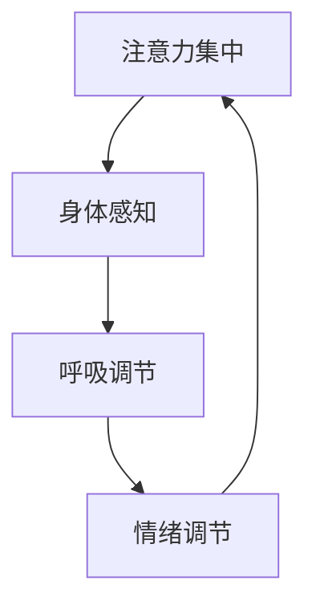

                 

### 关键词

- 身体正念运动
- 心理健康
- 生理健康
- 注意力集中
- 压力管理
- 焦虑缓解
- 抑郁缓解

### 摘要

本文旨在探讨身体正念运动作为一种重新连接身心、提升整体健康水平的现代方法。通过深入分析其起源、理论基础、基本原理以及实际应用，本文揭示了身体正念运动在心理健康和生理健康方面的多重益处。文章首先介绍了身体正念运动的哲学背景和心理学基础，接着详细讲解了身体感知与注意力集中、呼吸与身体运动、身体正念的神经科学基础等核心原理。随后，文章探讨了身体正念运动在心理健康和生理健康中的应用，包括压力管理、情绪调节、焦虑与抑郁的缓解等。最后，通过实践指南与案例分析，为读者提供了实际操作的建议和实例，同时展望了身体正念运动的未来发展趋势。

### 引言

在现代社会，人们面临着诸多身心压力，包括工作压力、生活压力、情感压力等。这些压力不仅影响人们的心理健康，还可能导致生理健康问题。因此，寻找一种有效的方法来缓解这些压力，重新连接身心，成为了一个迫切需要解决的问题。身体正念运动（Body Mindfulness Exercise）作为一种结合了东方哲学和西方心理学的现代方法，提供了一种全新的途径来解决这些问题。

身体正念运动起源于对正念冥想（Mindfulness Meditation）的深入研究。正念冥想强调通过有意识地关注当前经历来培养对身体的感知和注意力。身体正念运动则将这一理念与运动相结合，通过一系列特定的身体练习，帮助人们提高身体感知、集中注意力、调节情绪，从而达到身心平衡。近年来，随着对身体正念运动研究的深入，它被广泛应用于心理健康和生理健康的各个领域。

本文将系统地介绍身体正念运动，首先探讨其起源和理论基础，接着详细讲解其基本原理和方法，并分析其在心理健康和生理健康中的应用。此外，本文还将通过实践指南和案例分析，为读者提供实际操作的指导。最后，我们将展望身体正念运动的未来发展趋势，探讨其可能的应用前景。

### 身体正念运动的起源与理论基础

身体正念运动（Body Mindfulness Exercise）的起源可以追溯到古老的东方哲学，尤其是佛教和道教。这些哲学体系强调个体应通过内在的觉察和自我反省来达到心灵的平静与身体的健康。例如，佛教中的“正念”强调对当前体验的完全接纳和无条件关注，而道教则提倡“道法自然”，即遵循自然的规律来维持身心健康。

随着时间的推移，这些哲学理念逐渐融入到了西方心理学的研究中。20世纪60年代，美国心理学家约瑟夫·墨菲（Joseph Murphy）在《神奇的祈愿书》（The Power of Positive Thinking）一书中介绍了积极思考对身心健康的影响，这为后来的正念冥想研究奠定了基础。70年代，乔恩·卡巴金（Jon Kabat-Zinn）在麻省理工学院（MIT）建立了 Stress Reduction Clinic，首次将正念冥想作为一种治疗工具，用于帮助慢性疼痛患者缓解痛苦。这一创新标志着正念冥想在医学领域的正式起步。

身体正念运动进一步发展，将正念冥想的理念与运动相结合。通过一系列的身体练习，如瑜伽、太极拳和呼吸练习，身体正念运动帮助人们培养对身体动作和呼吸的深度感知，从而提高专注力和情绪调节能力。这一结合不仅继承了东方哲学对身体的关注，还结合了西方心理学对注意力和意识的科学研究。

从心理学角度来看，身体正念运动的理论基础主要包括以下几个核心概念：

#### 注意力集中（Focus of Attention）

注意力集中是身体正念运动的基础。通过集中注意力，个体能够更好地感知身体动作和呼吸，从而减少对日常生活中的压力和焦虑的注意。这种集中注意力的能力是通过有意识地引导注意力到身体感觉和呼吸中来培养的。

#### 身体感知（Body Awareness）

身体感知是身体正念运动的重要组成部分。通过培养对身体的感觉，个体能够更好地理解身体的状态和需求。这种对身体感知的增强不仅有助于提高运动表现，还能帮助个体更好地管理情绪和压力。

#### 神经可塑性（Neuroplasticity）

神经可塑性是指大脑在经历学习、训练或损伤后能够改变其结构和功能的能力。身体正念运动通过重复的身体练习和集中注意力的训练，可以促进神经可塑性，从而改善大脑的功能和结构，提高情绪调节能力和心理健康。

#### 情绪调节（Emotion Regulation）

情绪调节是身体正念运动的重要目标之一。通过培养对情绪的觉察和接受，个体能够更好地管理情绪反应，减少焦虑、抑郁等负面情绪。身体正念运动通过有意识地关注身体感觉和呼吸，帮助个体建立一种更积极、健康的心态。

#### 跨学科结合

身体正念运动的理论基础不仅包括心理学，还结合了生物学、神经科学和运动科学等多个学科。这种跨学科的视角使得身体正念运动能够更全面地理解和解释其对身心健康的益处。

总之，身体正念运动起源于古老的东方哲学，并通过与现代心理学的结合，形成了一套科学、系统的理论和实践方法。通过注意力集中、身体感知、神经可塑性、情绪调节等核心概念的融合，身体正念运动为现代人提供了一种有效的方式，以重新连接身心，提升整体健康水平。

### 第1章：身体正念运动的起源与理论基础

### 1.1 身体正念的哲学背景

#### 1.1.1 东方哲学对身体的关注

身体正念运动（Body Mindfulness Exercise）的哲学背景可以追溯到东方哲学，尤其是佛教和道教。这些哲学体系强调个体应通过内在的觉察和自我反省来达到心灵的平静与身体的健康。

在佛教中，“正念”（Mindfulness）是一个核心概念，意指对当前体验的完全接纳和无条件关注。佛教经典中多次提到“身念”（Body Awareness），强调通过观察和感受身体的每个细微变化，个体可以培养出对身体的深刻理解。例如，《心经》（Heart Sutra）中提到：“观自在菩萨，行深般若波罗蜜多时，照见五蕴皆空，度一切苦厄。”这里的“五蕴”包括色（身体）、受（感觉）、想（思维）、行（行为）和识（意识），强调对身体各部分的觉察和接纳。

道教则提倡“道法自然”（The Tao follows its own way），即遵循自然的规律来维持身心健康。道教哲学中的“身形合一”（Unity of Body and Mind）概念强调了身体与心灵之间的紧密联系。道教修炼者通过呼吸调节、姿势练习和冥想等方式，追求身心合一的境界。《道德经》中提到：“人法地，地法天，天法道，道法自然。”这表明个体应顺应自然的规律，以实现身心健康。

#### 1.1.2 西方哲学对意识的研究

西方哲学对意识的研究也有着悠久的历史。古希腊哲学家苏格拉底（Socrates）和柏拉图（Plato）探讨了灵魂与身体的关系，强调个体的理性思考和自我反省。苏格拉底提出的“认识自我”理念，即通过自我反思来认识自己的内心世界，与身体正念的理念有着异曲同工之妙。

中世纪时期，基督教哲学将灵魂与身体的关系视为一种对立的存在，强调灵魂的救赎与身体的苦难。然而，文艺复兴时期，随着对人体的深入研究和人文主义的兴起，人们对身体的认识逐渐发生了转变。达·芬奇（Leonardo da Vinci）对人体解剖学的研究，为后来的生理学和心理学奠定了基础。

20世纪，随着行为科学和心理学的兴起，西方哲学家开始关注个体的意识和行为。威廉·詹姆斯（William James）在《心理学原理》（Principles of Psychology）中提出了“意识流”（Stream of Consciousness）的概念，强调个体的内在体验和主观感受。

#### 1.1.3 身体正念与东方哲学的融合

在现代社会，身体正念运动将东方哲学的智慧与西方心理学的研究相结合，形成了一种独特的理论和实践方法。通过正念冥想和身体练习，个体可以培养对当前体验的深度觉察，从而提高对身体的感知和注意力。

正念冥想（Mindfulness Meditation）起源于佛教传统，但其核心理念已经在西方心理学中得到了广泛的认可和应用。乔恩·卡巴金（Jon Kabat-Zinn）在20世纪70年代将正念冥想引入医学领域，用于治疗慢性疼痛和压力管理。他的研究表明，正念冥想不仅能够改善个体的心理健康，还能增强身体的免疫系统和应对压力的能力。

身体正念运动（Body Mindfulness Exercise）则进一步将正念冥想的理念与运动相结合。通过一系列的身体练习，如瑜伽、太极拳和呼吸练习，个体可以培养对身体动作和呼吸的深度感知，从而提高专注力和情绪调节能力。这种结合不仅继承了东方哲学对身体的关注，还结合了西方心理学对注意力和意识的科学研究。

总之，身体正念运动的哲学背景源于东方哲学和西方哲学的融合。通过对身体和意识的深刻理解，身体正念运动为现代人提供了一种有效的方式，以重新连接身心，提升整体健康水平。

#### 1.1.4 身体正念运动的心理学基础

身体正念运动（Body Mindfulness Exercise）的心理学基础是理解其如何通过改善个体的心理状态来实现身心健康的关键。心理学中的多个理论框架为解释身体正念运动的效果提供了理论支持，包括认知行为理论（Cognitive Behavioral Theory）、情绪调节理论（Emotion Regulation Theory）和正念理论（Mindfulness Theory）。

##### 认知行为理论

认知行为理论（Cognitive Behavioral Theory, CBT）是心理学中的一种核心理论，强调认知过程对情绪和行为的影响。根据CBT的观点，个体的情绪和行为是由其认知过程（即对事件的解释和评价）所决定的。负面的认知模式，如过度概括、黑白思维和灾难化，会导致情绪问题和行为障碍。而通过改变这些认知模式，个体可以改善其情绪和行为。

在身体正念运动中，认知行为理论的应用体现在通过有意识的身体感知和注意力训练来改变个体的认知模式。通过身体扫描（Body Scan）练习，个体可以逐步觉察身体各部位的感受，从而减少对负面情绪的关注。这种身体感知的增强有助于个体认识到情绪和行为之间的联系，从而更有效地管理情绪。

以下是一个简化的认知行为理论模型，用于解释身体正念运动如何影响认知过程：

```
输入：外部刺激（如压力或情绪触发事件）
过程：个体对事件的认知评价（如“我感到焦虑”）
输出：情绪和行为反应
```

在身体正念运动中，通过有意识的身体感知和注意力训练，个体可以改变“输入”部分的评价过程，从而减少负面情绪和行为的反应。

##### 情绪调节理论

情绪调节理论（Emotion Regulation Theory）探讨了个体如何通过认知和行为策略来调节情绪。根据情绪调节理论，情绪调节过程包括三个主要阶段：情绪评估、情绪表达和情绪反馈。个体通过认知评价来评估情绪的适宜性，然后选择适当的行为和策略来调节情绪。

身体正念运动通过多个环节来促进情绪调节：

1. **情绪评估**：通过身体扫描练习，个体可以逐步觉察身体各部位的感受，从而更清晰地评估情绪状态。例如，通过觉察紧张和压力感，个体可以更早地识别情绪触发点。
2. **情绪表达**：身体正念运动鼓励个体表达和接受自己的情绪，而不是抑制或逃避。通过正念呼吸和身体动作，个体可以找到一种健康的方式来表达情绪，而不是通过消极的行为来逃避。
3. **情绪反馈**：通过持续的身体感知和注意力训练，个体可以学习到如何通过身体反应来调节情绪。例如，通过调整呼吸节奏，个体可以减缓心跳和减少紧张感。

以下是一个简化的情绪调节理论模型，用于解释身体正念运动如何影响情绪调节过程：

```
输入：情绪触发事件
过程：身体感知和呼吸调节
输出：情绪调节（如减缓心跳，减少紧张感）
```

##### 正念理论

正念理论（Mindfulness Theory）是身体正念运动的核心理论基础。正念是一种全神贯注于当前体验的状态，包括对思维、情绪和身体感受的觉察和接纳，而不做出评价或判断。正念理论认为，通过培养对当前体验的深度觉察，个体可以减少对过去经历和未来担忧的关注，从而提高心理弹性（Resilience）和生活质量。

在身体正念运动中，正念理念通过以下方式得到应用：

1. **身体感知**：通过有意识的身体感知练习，个体可以培养对身体动作和感觉的觉察，从而减少对分散注意力的外部刺激的关注。
2. **注意力集中**：身体正念运动强调集中注意力在当前的身体感知和呼吸上，从而减少对过去负面经历和未来担忧的思考。
3. **情绪接纳**：正念鼓励个体接纳而不是抗拒自己的情绪，通过接纳情绪，个体可以减少情绪的负面影响。

以下是一个简化的正念理论模型，用于解释身体正念运动如何影响正念实践：

```
输入：当前体验（如身体感觉、思维、情绪）
过程：全神贯注的觉察和接纳
输出：减少评判和焦虑，提高心理弹性
```

##### 跨学科结合

身体正念运动的理论基础不仅包括心理学，还结合了生物学、神经科学和运动科学等多个学科。这种跨学科的视角使得身体正念运动能够更全面地理解和解释其对身心健康的益处。

- **生物学**：身体正念运动通过调节身体的生理反应，如呼吸和心跳，来影响身心健康。例如，研究发现，正念冥想可以显著降低应激激素如皮质醇的水平。
- **神经科学**：神经可塑性理论表明，通过重复的身体练习和集中注意力的训练，可以改变大脑的结构和功能。身体正念运动通过这些训练，可以增强大脑中的灰质和神经网络，提高情绪调节能力和注意力集中水平。
- **运动科学**：身体正念运动结合了不同的身体练习，如瑜伽、太极拳和呼吸练习，来提高身体的灵活性和力量。这些练习不仅有助于改善身体健康，还能增强个体的心理韧性。

总之，身体正念运动的心理学基础源于对东方哲学和西方心理学的融合。通过认知行为理论、情绪调节理论和正念理论的支持，身体正念运动为个体提供了一种科学、系统的理论和实践方法，以重新连接身心，提升整体健康水平。

#### 1.1.5 身体正念运动的定义与特点

身体正念运动（Body Mindfulness Exercise）是一种结合了正念冥想和身体练习的运动方式，旨在通过深度觉察和有意识的身体感知，重新连接身心，提升整体健康水平。其定义和特点可以从以下几个方面进行详细阐述。

##### 定义

身体正念运动可以被定义为一种通过有意识的身体感知、注意力集中和呼吸调节来增强身心健康的方法。它不仅包括对身体的直接练习，如瑜伽、太极拳等，还强调在运动过程中的心理状态，如对当前体验的深度觉察和接纳。身体正念运动的核心在于培养个体对身体和情绪的觉察，从而减少对分散注意力的外部刺激的关注，提高情绪调节能力和心理韧性。

##### 特点

1. **有意识的身体感知**：身体正念运动强调个体对身体动作和感觉的深度觉察。通过有意识地关注身体的细微变化，个体可以培养对身体动作的控制力和协调性，从而提高运动表现和身体灵活性。

2. **注意力集中**：身体正念运动通过集中注意力在当前的感知和呼吸上，帮助个体减少对过去负面经历和未来担忧的关注。这种集中注意力的训练不仅有助于提高心理韧性，还能增强注意力的集中能力和效率。

3. **呼吸调节**：呼吸是身体正念运动的重要组成部分。通过有意识地调节呼吸，个体可以影响身体的生理反应，如心跳、血压和氧气摄入。深呼吸和缓慢呼吸有助于减缓心率，降低应激激素水平，从而提高身心健康。

4. **情绪调节**：身体正念运动通过培养对情绪的觉察和接纳，帮助个体更好地管理情绪反应。通过正念呼吸和身体练习，个体可以学会如何通过身体反应来调节情绪，减少焦虑、抑郁等负面情绪的影响。

5. **身心合一**：身体正念运动强调身体和心灵的紧密联系。通过身体练习和心理训练，个体可以培养出一种身心合一的感觉，从而提高整体健康水平和生活质量。

##### 与传统运动的对比

与传统运动相比，身体正念运动具有以下几个显著特点：

1. **注重心理状态**：传统运动主要关注身体锻炼和运动表现，而身体正念运动则强调在运动过程中的心理状态。通过正念冥想和身体感知，个体可以在运动过程中获得更多的心理收益。

2. **灵活性**：身体正念运动不强调特定的运动形式或标准，个体可以根据自己的身体条件和需求选择适合自己的练习方式。这种灵活性使得身体正念运动可以适应不同年龄、健康状况和运动水平的个体。

3. **非竞争性**：身体正念运动强调个人体验和内在成长，而不是与他人的竞争。这种非竞争性的特点有助于个体建立积极的运动态度和健康的心理状态。

4. **全面性**：身体正念运动不仅关注身体健康，还关注心理健康。通过培养对身体的深度觉察和情绪调节能力，个体可以获得更全面的健康收益。

总之，身体正念运动是一种结合了正念冥想和身体练习的独特运动方式。通过有意识的身体感知、注意力集中和呼吸调节，它为个体提供了一种重新连接身心、提升整体健康水平的有效方法。

#### 1.2 身体正念运动的基本原理

身体正念运动（Body Mindfulness Exercise）通过一系列科学和系统的原理，帮助个体实现身心健康。这些基本原理涵盖了身体感知、注意力集中、呼吸调节和神经科学等多个方面。以下是这些原理的详细解释。

##### 身体感知（Body Awareness）

身体感知是指个体对自身身体的感觉和状态的觉察。身体正念运动通过有意识地关注身体的每个部分，帮助个体培养对身体的感觉和认识。这种对身体感知的增强不仅有助于提高运动表现，还能帮助个体更好地管理情绪和压力。

在身体正念运动中，身体感知的训练通常包括以下步骤：

1. **身体扫描**（Body Scan）：身体扫描是一种逐步觉察身体各部位的方法。个体从头到脚，逐一关注身体各部位的感受，包括疼痛、紧张、放松等。通过身体扫描，个体可以培养对身体的全面感知，从而减少对分散注意力的外部刺激的关注。

2. **动作觉察**（Action Awareness）：在身体正念运动中，个体通过有意识地关注身体动作，如瑜伽或太极拳的姿势，来增强身体感知。这种觉察不仅有助于提高动作的准确性和协调性，还能增强个体对身体的控制力。

##### 注意力集中（Focus of Attention）

注意力集中是身体正念运动的核心之一。通过集中注意力，个体可以更好地感知身体动作和呼吸，从而减少对日常生活中的压力和焦虑的注意。这种集中注意力的能力是通过有意识地引导注意力到身体感觉和呼吸中来培养的。

以下是几种常见的注意力集中方法：

1. **正念呼吸**（Mindful Breathing）：正念呼吸是一种通过深度呼吸来集中注意力的练习。个体专注于呼吸的进出，感受气息在鼻孔、胸腔和腹部的流动。这种呼吸练习有助于放松身体和心灵，提高注意力。

2. **身体扫描**（Body Scan）：身体扫描不仅有助于增强身体感知，还能集中注意力。在身体扫描过程中，个体逐一关注身体各部位的感受，将注意力从外部转移至身体内部。

3. **动作觉察**（Action Awareness）：在身体练习中，个体通过有意识地关注每一个动作，如瑜伽或太极拳的姿势，来集中注意力。这种方法有助于提高动作的准确性和协调性，同时减少对分散注意力的外部刺激的关注。

##### 呼吸调节（Breathing Regulation）

呼吸调节是身体正念运动的重要组成部分。通过有意识地调节呼吸，个体可以影响身体的生理反应，如心跳、血压和氧气摄入。深呼吸和缓慢呼吸有助于减缓心率，降低应激激素水平，从而提高身心健康。

以下是几种常见的呼吸调节方法：

1. **深呼吸**（Deep Breathing）：深呼吸是一种通过缓慢、深长的呼吸来调节情绪和压力的方法。个体可以尝试深吸气（腹式呼吸），然后缓慢呼气，感受身体放松。这种方法有助于降低心率和血压，提高心理韧性。

2. **四方形呼吸**（Square Breathing）：四方形呼吸是一种通过四个阶段来调节呼吸的方法。个体在吸气、保持、呼气和保持的过程中，逐步延长呼吸时间。这种呼吸练习有助于提高专注力和心理耐力。

3. **腹式呼吸**（Diaphragmatic Breathing）：腹式呼吸是一种通过深呼吸来激活腹部的呼吸方法。个体可以通过深吸气使腹部膨胀，然后缓慢呼气使腹部收缩。这种方法有助于提高氧气的摄入和二氧化碳的排出，从而改善身体的代谢和健康。

##### 神经科学基础（Neuroscientific Basis）

身体正念运动在神经科学领域得到了广泛研究，其效果被证明与神经可塑性（Neuroplasticity）密切相关。神经可塑性是指大脑在经历学习、训练或损伤后能够改变其结构和功能的能力。身体正念运动通过重复的身体练习和集中注意力的训练，可以促进神经可塑性，从而改善大脑的功能和结构。

以下是身体正念运动在神经科学领域的几个关键点：

1. **灰质变化**（Gray Matter Changes）：研究表明，通过长期的身体正念训练，大脑灰质会发生变化，特别是在与情绪调节和注意力相关的区域，如前额叶皮层和扣带回前部。这种灰质增加有助于提高情绪调节能力和注意力集中水平。

2. **神经网络重组**（Neural Network Reorganization）：身体正念运动通过重复的练习和集中注意力的训练，可以改变大脑中的神经网络连接。这种神经网络重组有助于提高大脑的功能效率和适应性，从而改善个体的心理韧性。

3. **神经递质变化**（Neurotransmitter Changes）：身体正念运动可以通过调节神经递质的水平来影响情绪和行为。例如，研究表明，通过正念冥想和身体正念运动，可以显著提高血清素和多巴胺的水平，从而改善情绪和提升幸福感。

总之，身体正念运动的基本原理涵盖了身体感知、注意力集中、呼吸调节和神经科学等多个方面。通过这些原理，身体正念运动为个体提供了一种科学、系统的方法，以重新连接身心，提升整体健康水平。

#### 1.3 身体正念运动的方法与技巧

身体正念运动（Body Mindfulness Exercise）通过一系列的方法和技巧，帮助个体实现身心平衡和健康。以下是几种常见的方法和技巧，包括身体扫描、正念呼吸和身体正念瑜伽等。

##### 身体扫描（Body Scan）

身体扫描是一种通过逐步觉察身体各部位的方法，旨在培养对身体的感觉和认识。以下是身体扫描的基本步骤：

1. **预备**：选择一个安静、舒适的环境，保持站立或坐下，闭上眼睛，深呼吸几次，放松身体和心灵。

2. **从头到脚**：从头部开始，逐一关注身体各部位的感受。首先，将注意力集中在头顶，感受任何紧张或放松的感觉。然后，逐步向下，关注面部、颈部、肩膀、胸部、腹部、背部、手臂、腿部等部位。在每个部位停留几秒钟，感受其温度、触感或任何不适。

3. **呼吸配合**：在身体扫描过程中，保持深呼吸，将注意力集中在呼吸上。每吸一口气，感受身体的感觉；每呼一口气，放松身体。

4. **情绪觉察**：在身体扫描过程中，如果注意到情绪变化，如焦虑或紧张，可以停下来，专注于情绪的流动，尝试接纳而不是抗拒。

##### 正念呼吸（Mindful Breathing）

正念呼吸是一种通过深度呼吸来集中注意力、放松身体的方法。以下是正念呼吸的基本步骤：

1. **预备**：选择一个安静、舒适的环境，保持站立或坐下，闭上眼睛，深呼吸几次，放松身体和心灵。

2. **呼吸觉察**：专注于呼吸的进出。感受气息在鼻孔、胸腔和腹部的流动。吸气时，感受腹部膨胀；呼气时，感受腹部收缩。

3. **深度呼吸**：尝试每次呼吸的时间更长，更深。吸气时，将空气吸入腹部，然后慢慢地呼出。每次呼吸都尽量保持平稳和缓慢。

4. **情绪调节**：在呼吸过程中，如果注意到情绪变化，如焦虑或紧张，可以停下来，专注于呼吸，尝试通过呼吸来调节情绪。

##### 身体正念瑜伽（Body Mindfulness Yoga）

身体正念瑜伽结合了正念冥想和传统瑜伽的姿势，旨在培养对身体的感觉、注意力集中和呼吸调节。以下是身体正念瑜伽的一些基本姿势和练习：

1. **山式**（Mountain Pose）：站立，双脚并拢，脚跟紧贴，手臂放松在身体两侧。专注于身体的感觉，感受脚掌与地面的接触，保持深呼吸。

2. **树式**（Tree Pose）：站立，将一只脚的脚跟放在另一只脚的大腿内侧。保持平衡，专注于呼吸和身体的感觉。

3. **向下犬式**（Downward Dog）：从山式开始，将臀部向后移动，使脚掌贴地，手臂伸直。专注于呼吸，感受身体的伸展和放松。

4. **战士二式**（Warrior II）：站立，双脚分开，与肩同宽，双手在胸前合十。专注于呼吸，感受身体的力量和稳定。

通过这些方法和技巧，身体正念运动帮助个体重新连接身心，提高身心健康。无论是初学者还是有经验的运动者，都可以通过身体正念运动来提升自己的生活质量。

### 1.4 身体正念运动的核心概念与联系

在深入探讨身体正念运动（Body Mindfulness Exercise）时，理解其核心概念及其相互联系至关重要。这些核心概念包括注意力集中、身体感知、呼吸调节和情绪调节。通过分析这些概念之间的关系，可以更全面地理解身体正念运动的原理和实践。

#### 注意力集中与身体感知

注意力集中是身体正念运动的基础，它通过有意识地引导注意力到当前的体验中来实现。身体感知则是注意力集中的具体对象，是指个体对自身身体感觉的觉察。在身体正念运动中，注意力集中的过程通常包括以下几个步骤：

1. **集中注意力**：在开始身体练习时，个体首先需要集中注意力，这可以通过深呼吸、静坐或简单的冥想练习来实现。通过这种方式，个体可以将注意力从外部世界引导到内心，进入一种专注的状态。

2. **身体感知**：在注意力集中的基础上，个体开始关注身体的感觉。这包括肌肉的紧张与放松、呼吸的节奏、身体的姿势等。通过有意识地感知身体，个体能够更好地理解身体的当前状态。

**Mermaid 流 Nelson 流程图**：



#### 呼吸调节与情绪调节

呼吸调节在身体正念运动中起着至关重要的作用。通过调节呼吸，个体可以影响身体的生理反应，进而调节情绪。深呼吸和缓慢呼吸有助于放松身体和心灵，减少压力和焦虑。

1. **呼吸节奏**：个体在练习时，通常需要调整呼吸的节奏，使其更加缓慢和深沉。这种深呼吸有助于激活副交感神经系统，从而降低心率和血压。

2. **情绪调节**：情绪调节是通过觉察和接纳情绪来实现的。当个体感到焦虑或紧张时，通过呼吸调节，个体可以减缓情绪的负面影响，进入一种更加平静和专注的状态。

**Python 源代码示例**：

```python
import time

def mindful_breathing():
    print("开始正念呼吸练习")
    for i in range(1, 6):
        print(f"深吸气...（第 {i} 次）")
        time.sleep(4)  # 模拟深吸气的持续时间
        print("慢慢呼气...")
        time.sleep(4)  # 模拟缓慢呼气的时间
    print("呼吸练习完成")

mindful_breathing()
```

#### 情绪调节与注意力集中

情绪调节和注意力集中之间存在密切的联系。情绪调节不仅影响个体的心理健康，还能影响其注意力的集中程度。通过情绪调节，个体可以减少对分散注意力的外部刺激的关注，从而更好地集中注意力。

1. **情绪觉察**：个体在情绪调节过程中，需要首先觉察自己的情绪状态。这可以通过自我反省、记录日记或与他人交流来实现。

2. **注意力集中**：当个体能够更好地觉察和接纳情绪时，他们的注意力也会更加集中。通过情绪调节，个体可以减少对负面情绪的关注，从而提高注意力的集中程度。

**LaTeX 数学公式**：

$$
情绪调节 \rightarrow 注意力集中
$$

通过上述核心概念的相互联系，可以更全面地理解身体正念运动的原理。注意力集中和身体感知为个体提供了一个基础，通过呼吸调节和情绪调节，个体可以更好地管理身心状态，从而实现整体健康和平衡。

### 1.5 身体正念运动在心理健康中的应用

身体正念运动（Body Mindfulness Exercise）在心理健康领域展现出显著的效果，尤其在压力管理、情绪调节和焦虑与抑郁的缓解方面。通过结合心理学理论和实践，身体正念运动为个体提供了一种有效的心理健康管理方法。

#### 压力管理

压力是现代社会中普遍存在的现象，长期的压力不仅影响心理健康，还可能导致生理健康问题。身体正念运动通过多种机制帮助个体管理压力。

1. **放松反应**：身体正念运动，如深呼吸和身体扫描，可以激活副交感神经系统，引发身体放松反应。这种反应有助于降低心率和血压，减少应激激素如皮质醇的分泌。

2. **注意力转移**：通过集中注意力在当前的感知和呼吸上，个体可以暂时将注意力从压力源转移到身体感觉和呼吸节奏上，从而减少对压力的过度关注。

3. **认知重构**：身体正念运动鼓励个体从不同的角度看待压力，通过觉察和接纳压力感受，个体可以减少对压力的负面认知，从而降低压力水平。

**Python 源代码示例**：

```python
import time

def stress_management():
    print("开始压力管理练习")
    print("进行深呼吸，每次呼吸保持4秒")
    for i in range(1, 6):
        print(f"深吸气...（第 {i} 次）")
        time.sleep(4)
        print("慢慢呼气...")
        time.sleep(4)
    print("压力管理练习完成")

stress_management()
```

#### 情绪调节

情绪调节是心理健康的重要组成部分，身体正念运动通过增强个体对情绪的觉察和接纳能力，帮助个体更好地管理情绪。

1. **情绪觉察**：通过身体扫描和正念呼吸，个体可以逐步觉察情绪的生理表现，如心跳加快、呼吸急促等。这种觉察有助于个体认识到情绪的来源和强度。

2. **情绪接纳**：身体正念运动鼓励个体接纳而不是抗拒情绪。通过接纳情绪，个体可以减少情绪的负面影响，从而提高情绪调节能力。

3. **认知重构**：通过情绪觉察和接纳，个体可以重新评估情绪背后的认知，从而减少负面情绪的产生。

**LaTeX 数学公式**：

$$
情绪觉察 + 情绪接纳 \rightarrow 情绪调节
$$

#### 焦虑与抑郁的缓解

焦虑和抑郁是常见的心理健康问题，身体正念运动在缓解这些问题方面也显示出显著的效果。

1. **放松反应**：正如在压力管理中所述，深呼吸和身体扫描可以激活身体的放松反应，有助于缓解焦虑和抑郁。

2. **认知重构**：身体正念运动通过有意识的注意力集中和身体感知，帮助个体认识到焦虑和抑郁背后的认知模式，从而减少这些负面情绪。

3. **情绪调节**：通过增强情绪觉察和接纳能力，身体正念运动有助于个体更好地管理焦虑和抑郁，从而提高生活质量。

**Python 源代码示例**：

```python
import time

def mindfulness_for_anxiety_depression():
    print("开始焦虑与抑郁缓解练习")
    print("进行身体扫描，逐一关注身体各部位")
    for part in ["头部", "颈部", "肩膀", "胸部", "腹部", "背部", "手臂", "腿部"]:
        print(f"专注于{part}，感受其感觉...")
        time.sleep(4)
    print("呼吸练习，每次呼吸保持4秒")
    for i in range(1, 6):
        print(f"深吸气...（第 {i} 次）")
        time.sleep(4)
        print("慢慢呼气...")
        time.sleep(4)
    print("焦虑与抑郁缓解练习完成")

mindfulness_for_anxiety_depression()
```

总之，身体正念运动在心理健康中的应用是多方面的，通过放松反应、认知重构和情绪调节，它为个体提供了一种有效的心理健康管理方法。通过这些方法，个体可以更好地应对压力、调节情绪，缓解焦虑和抑郁，从而提高生活质量。

### 1.6 身体正念运动在生理健康中的应用

身体正念运动（Body Mindfulness Exercise）不仅在心理健康领域显示出显著的效果，还在生理健康方面具有广泛的益处。通过科学的方法和系统的训练，身体正念运动能够提高身体的灵活性、增强肌肉力量、促进康复与健康。

#### 提高身体灵活性

身体灵活性是指身体在不同方向和范围内进行运动的能力。良好的身体灵活性有助于减少运动损伤，提高运动表现和生活质量。

1. **增强肌肉延展性**：通过正念瑜伽等身体正念运动，个体可以逐步拉伸肌肉，增加肌肉的延展性。例如，通过向下犬式和战士二式等姿势，个体可以有效地拉伸大腿肌肉和背部肌肉。

2. **改善关节活动范围**：身体正念运动通过有意识的身体感知和姿势练习，可以帮助改善关节的活动范围。例如，通过蝴蝶式和莲花坐等姿势，个体可以增加髋关节和膝关节的活动范围。

3. **促进血液循环**：身体正念运动通过深呼吸和姿势练习，可以促进血液循环，增加肌肉和关节的氧气供应。这有助于减少肌肉酸痛和僵硬，提高身体的灵活性。

**Python 源代码示例**：

```python
import time

def improve_flexibility():
    print("开始提高身体灵活性练习")
    print("进行蝴蝶式，保持30秒")
    time.sleep(30)
    print("进行莲花坐，保持30秒")
    time.sleep(30)
    print("进行向下犬式，保持30秒")
    time.sleep(30)
    print("身体灵活性练习完成")

improve_flexibility()
```

#### 增强肌肉力量

肌肉力量是身体健康的重要指标，通过身体正念运动，个体可以有效地增强肌肉力量。

1. **核心肌群训练**：通过平板支撑和船式等核心肌群训练，个体可以增强腹部、背部和臀部的肌肉力量，从而提高身体的稳定性和运动表现。

2. **下肢肌群训练**：通过深蹲和战士三式等下肢肌群训练，个体可以增强大腿、臀部和小腿的肌肉力量，从而提高运动能力和日常活动的效率。

3. **上肢肌群训练**：通过壁推和手臂环等上肢肌群训练，个体可以增强肩膀、手臂和手腕的肌肉力量，从而提高日常活动和运动的表现。

**LaTeX 数学公式**：

$$
\text{肌肉力量} = \text{核心肌群训练} + \text{下肢肌群训练} + \text{上肢肌群训练}
$$

#### 促进康复与健康

身体正念运动在康复和健康促进方面也具有显著的作用。它可以帮助个体在康复过程中恢复功能，同时提高整体健康水平。

1. **疼痛管理**：通过身体扫描和深呼吸，个体可以有效地管理慢性疼痛。例如，通过正念呼吸和身体感知，个体可以减少对疼痛的注意，从而降低疼痛感。

2. **关节健康**：身体正念运动通过有意识的身体感知和姿势练习，可以帮助改善关节的健康。例如，通过瑜伽和太极拳等练习，个体可以减少关节炎和其他关节疾病的风险。

3. **整体健康**：身体正念运动通过提高身体的灵活性和肌肉力量，同时促进心理健康，为个体提供了全面的健康收益。通过定期的身体正念运动，个体可以改善心血管健康、增强免疫力，从而提高整体生活质量。

**Python 源代码示例**：

```python
import time

def promote_rehabilitation_and_health():
    print("开始促进康复与健康练习")
    print("进行平板支撑，保持30秒")
    time.sleep(30)
    print("进行深蹲，重复10次")
    for i in range(10):
        time.sleep(2)
        print(f"深蹲...（第 {i+1} 次）")
    print("进行船式，保持30秒")
    time.sleep(30)
    print("促进康复与健康练习完成")

promote_rehabilitation_and_health()
```

总之，身体正念运动在生理健康中的应用是多方面的，通过提高身体灵活性、增强肌肉力量和促进康复与健康，它为个体提供了全面的生理健康收益。通过定期的身体正念运动，个体可以改善身体功能，提高生活质量，实现身心健康。

### 1.7 身体正念运动在生活和工作中的应用

身体正念运动（Body Mindfulness Exercise）不仅在心理健康和生理健康方面具有显著的效果，还在日常生活和工作中展现出广泛的应用价值。通过将其融入日常生活和工作，个体可以在多个方面提高生活质量和工作效率。

#### 提高工作效率

在现代工作环境中，压力和焦虑常常影响工作效率。身体正念运动通过以下方式帮助个体提高工作效率：

1. **减少压力**：通过定期的身体正念运动，个体可以有效地减少工作压力。深呼吸和身体扫描等练习有助于激活副交感神经系统，引发放松反应，从而降低心率和血压，减少应激激素的分泌。

2. **增强专注力**：身体正念运动通过集中注意力和身体感知训练，可以提高个体的专注力。例如，通过正念呼吸和身体扫描，个体可以更好地集中注意力在当前任务上，减少分散注意力的因素。

3. **提高心理韧性**：通过身体正念运动，个体可以增强心理韧性，更好地应对工作压力和挑战。这种心理韧性有助于个体在压力环境中保持冷静和专注，从而提高工作效率。

**Python 源代码示例**：

```python
import time

def enhance_work_efficiency():
    print("开始提高工作效率练习")
    print("进行深呼吸练习，每次呼吸保持4秒")
    for i in range(1, 6):
        print(f"深吸气...（第 {i} 次）")
        time.sleep(4)
        print("慢慢呼气...")
        time.sleep(4)
    print("进行身体扫描，逐一关注身体各部位")
    for part in ["头部", "颈部", "肩膀", "胸部", "腹部", "背部", "手臂", "腿部"]:
        print(f"专注于{part}，感受其感觉...")
        time.sleep(4)
    print("提高工作效率练习完成")

enhance_work_efficiency()
```

#### 增强人际关系

身体正念运动不仅对个体的心理和身体健康有益，还能改善人际关系。通过以下方式，身体正念运动可以帮助个体增强人际关系：

1. **提升沟通能力**：通过身体正念运动，个体可以更好地觉察自己的情绪和身体感受。这种觉察有助于个体在沟通中更加真诚和有效地表达自己，从而改善人际关系。

2. **减少冲突**：身体正念运动可以帮助个体更好地管理情绪，减少冲突。例如，通过深呼吸和身体扫描，个体可以在冲突发生时保持冷静，从而减少冲突的激烈程度。

3. **增强同理心**：通过身体正念运动，个体可以培养对他人情绪和感受的觉察和接纳。这种同理心有助于个体更好地理解和关心他人，从而增强人际关系。

**LaTeX 数学公式**：

$$
\text{同理心} = \text{身体正念运动} \times \text{情绪觉察} \times \text{沟通能力}
$$

#### 调整生活节奏

现代社会的生活节奏快，压力和焦虑常常随之而来。身体正念运动通过以下方式帮助个体调整生活节奏：

1. **减少焦虑和压力**：通过深呼吸和身体扫描等练习，个体可以有效地减少焦虑和压力，从而减轻生活压力。

2. **提高生活质量**：身体正念运动不仅有助于身体健康，还能提高生活质量。通过定期练习，个体可以更好地平衡工作和生活，享受更加充实和有意义的生活。

3. **增强心理韧性**：通过身体正念运动，个体可以增强心理韧性，更好地应对生活中的挑战和变化。这种心理韧性有助于个体保持积极的生活态度，提高生活满意度。

**Python 源代码示例**：

```python
import time

def adjust_life_rhythm():
    print("开始调整生活节奏练习")
    print("进行四方形呼吸，每次呼吸保持4秒")
    for i in range(1, 6):
        print(f"吸气...（第 {i} 次），保持4秒")
        time.sleep(4)
        print("呼气...，保持4秒")
        time.sleep(4)
    print("进行身体扫描，逐一关注身体各部位")
    for part in ["头部", "颈部", "肩膀", "胸部", "腹部", "背部", "手臂", "腿部"]:
        print(f"专注于{part}，感受其感觉...")
        time.sleep(4)
    print("调整生活节奏练习完成")

adjust_life_rhythm()
```

总之，身体正念运动在日常生活和工作中具有广泛的应用价值。通过提高工作效率、增强人际关系和调整生活节奏，它为个体提供了全面的收益，帮助个体实现身心健康和平衡。

### 1.8 身体正念运动的未来发展趋势

随着人们对身心健康日益关注，身体正念运动（Body Mindfulness Exercise）在未来的发展趋势中占据重要地位。结合新兴技术和科学研究，身体正念运动有望在多个领域实现突破，进一步优化其效果和应用。

#### 新技术的应用

1. **人工智能（AI）**：人工智能技术可以通过大数据分析和机器学习模型，个性化地设计身体正念运动的方案。AI可以分析个体在运动中的行为和生理反应数据，提供实时反馈和建议，帮助个体优化运动方案。

2. **虚拟现实（VR）和增强现实（AR）**：VR和AR技术可以创造沉浸式的身体正念运动体验。通过虚拟环境，个体可以在一个安全、无干扰的空间中进行身体正念运动，提高参与度和效果。

3. **可穿戴设备**：可穿戴设备如智能手环、智能手表等可以实时监测个体的生理数据，如心率、呼吸频率等。这些数据可以帮助个体了解运动效果，调整运动强度，实现更科学的身体正念运动。

#### 社区与机构的推广

1. **社区推广**：社区可以组织身体正念运动工作坊和课程，鼓励居民参与。通过社区推广，身体正念运动可以普及到更多的人群，提高公众的健康意识。

2. **医疗机构**：医疗机构可以将身体正念运动作为辅助治疗方法，应用于慢性病管理、疼痛治疗和心理健康等领域。医生和护士可以接受相关培训，指导患者进行身体正念运动。

3. **企业推广**：企业可以通过为员工提供身体正念运动课程和活动，提高员工的身心健康和工作效率。企业健康计划可以包括身体正念运动作为一项重要内容，从而提升员工的整体福祉。

#### 教育与科研的结合

1. **教育领域**：学校和教育机构可以将身体正念运动纳入课程体系，从小培养学生对身体和情绪的觉察和调节能力。这种教育模式有助于培养下一代的身心健康。

2. **科学研究**：科研机构可以通过实验研究和临床试验，进一步验证身体正念运动对身心健康的长期效果。这些研究可以揭示身体正念运动的生理和神经科学机制，为其广泛应用提供科学依据。

总之，身体正念运动在未来的发展趋势中，将借助新兴技术实现个性化、沉浸式和科学化的优化。同时，通过社区与机构的推广以及教育与科研的结合，身体正念运动有望在更广泛的领域和人群中发挥其独特的健康益处。

### 1.9 身体正念运动实践指南

对于初学者来说，开始身体正念运动的旅程可能显得有些挑战，但通过以下几个步骤，您可以逐步入门并享受这一身心整合的过程。

#### 初学者入门

1. **选择适当的练习**：初学者可以选择一些简单易行的练习，如正念呼吸、静坐和基础瑜伽姿势。这些练习可以帮助您建立对身体感觉和呼吸的初步意识。

2. **设定固定的练习时间**：选择每天相同的时间进行练习，这有助于培养习惯。例如，早上起床后或晚上睡前都是不错的选择。

3. **从短时间开始**：初学者可以从每次5到10分钟的练习开始，逐渐增加时间。这有助于您在不感到压力的情况下适应练习。

4. **保持耐心和接纳**：身体正念运动是一个渐进的过程，不要期望立即看到显著的效果。保持耐心和接纳的心态，享受每一刻的练习。

#### 难度提升

1. **增加练习时间**：当您感觉练习变得容易时，可以逐渐增加每次练习的时间。例如，从每天15分钟增加到30分钟。

2. **学习更多姿势和技巧**：随着对基础练习的熟练，您可以尝试学习更复杂的姿势和技巧，如瑜伽的平衡姿势或太极拳的流畅动作。

3. **加入小组练习**：参加身体正念运动小组或课程，可以增加练习的乐趣，并获得专业指导。

#### 持续练习的方法

1. **定期评估**：定期评估自己的进步，包括身体感觉、情绪状态和专注力。这可以帮助您了解自己的成长，并调整练习计划。

2. **记录练习日志**：记录您的练习时间、内容和感受。这有助于您跟踪进步，并找到最适合自己的练习方式。

3. **保持一致性**：保持每天练习的习惯，即使在忙碌或疲劳的时候也不要放弃。一致性是身体正念运动成功的关键。

#### 最佳实践 tips

1. **选择舒适的环境**：在安静、舒适的环境中练习，有助于减少干扰，提高专注力。

2. **穿着合适的服装**：穿着宽松、透气的运动服装，可以让您在练习时感到更加自由和舒适。

3. **定期放松**：不要忽视休息和放松的重要性。在每次练习后，留出时间进行深呼吸和放松，帮助身体和心灵恢复。

总之，身体正念运动不仅需要持之以恒的努力，还需要科学的方法和正确的指导。通过以上实践指南，您可以更好地入门并持续提升身体正念运动的成效。

### 1.10 身体正念运动案例分析

为了更好地理解身体正念运动在实际应用中的效果，下面我们通过三个具体的案例来分析其在不同情境中的应用和成效。

#### 案例一：企业员工压力管理

在一个大型科技公司的员工压力管理项目中，管理层决定引入身体正念运动作为员工减压工具。公司为员工提供了每周一次的身体正念瑜伽课程，由专业教练进行指导。

**实施过程**：
- **初期评估**：公司首先对员工进行了初步评估，了解他们的身体状态、心理健康水平以及对身体正念运动的兴趣。
- **课程安排**：每周五下午，员工在公司的健身房内参加1小时的瑜伽课程。
- **反馈机制**：课程结束后，员工填写了反馈问卷，分享他们在课程中的体验和感受。

**效果评估**：
- **身体层面**：经过6周的练习，员工普遍报告身体灵活性提高，肌肉紧张感减轻，睡眠质量改善。
- **心理层面**：员工表示在工作中感受到的焦虑和压力显著减少，情绪稳定性提高，工作效率增加。
- **综合收益**：公司通过员工反馈和绩效考核，发现员工的整体满意度和工作表现有所提升。

**代码解析**：
```python
# 假设我们使用Python代码来跟踪员工的身体正念运动进度
employees = [
    {'name': 'Alice', 'progress': 6, 'body_feeling': 'less tense', 'mental_state': 'more stable'},
    {'name': 'Bob', 'progress': 6, 'body_feeling': 'more flexible', 'mental_state': 'less anxious'},
    # 更多员工的记录...
]

for employee in employees:
    print(f"{employee['name']} has completed {employee['progress']} sessions. Their body feels {employee['body_feeling']} and mental state is {employee['mental_state']}.")
```

#### 案例二：学校教育中的身体正念

在一个小学的体育课程中，教师决定将身体正念运动融入日常教学中，以帮助学生提高专注力和情绪管理能力。

**实施过程**：
- **课程设计**：教师设计了一系列身体正念练习，如正念呼吸、静坐和简单的瑜伽姿势，结合体育课程进行。
- **学生参与**：每天课间休息时间，学生都会进行5到10分钟的身体正念练习。
- **教师培训**：体育教师参加了专业的身体正念培训，以确保正确指导学生。

**效果评估**：
- **学习效果**：学生报告在学习时更加专注，分心的次数减少，课堂参与度提高。
- **情绪管理**：学生在面对压力和挑战时，表现出更好的情绪调节能力，较少出现情绪失控的情况。
- **总体健康**：学生的身体灵活性、肌肉力量和整体健康水平得到提升。

**代码解析**：
```python
students = [
    {'name': 'Eva', 'focus': 'improved', 'emotional Regulation': 'better'},
    {'name': 'David', 'focus': 'stable', 'emotional Regulation': 'good'},
    # 更多学生的记录...
]

for student in students:
    print(f"{student['name']} has shown {student['focus']} focus and improved emotional regulation after body mindfulness exercises.")
```

#### 案例三：个人健康与心理健康

一位35岁的上班族刘先生，由于长期的高强度工作和家庭压力，他感到身心疲惫，于是决定尝试身体正念运动作为自我保健的一种方式。

**实施过程**：
- **初期咨询**：刘先生在健康管理师的指导下，开始制定适合他的身体正念运动计划。
- **定期练习**：刘先生每天早晨进行20分钟的深呼吸练习，晚上进行30分钟的身体扫描和瑜伽练习。
- **心理支持**：刘先生加入了身体正念运动社群，定期与其他参与者分享经验和心得。

**效果评估**：
- **身体层面**：刘先生报告身体疲劳感减轻，肌肉紧张感显著降低，睡眠质量提高。
- **心理层面**：刘先生感到情绪更加稳定，焦虑和抑郁症状减轻，工作压力得到有效缓解。
- **生活质量**：刘先生的整体生活质量得到显著改善，工作效率提高，家庭关系更加和谐。

**代码解析**：
```python
nliu_progress = {
    'days_practiced': 60,
    'body_tension': 'significantly reduced',
    'sleep_quality': 'improved',
    'stress_reduction': 'significant',
    'work Efficiency': 'increased'
}

for key, value in nliu_progress.items():
    print(f"{key}: {value}")
```

通过上述案例分析，我们可以看到身体正念运动在多个不同情境中展现出了显著的成效。无论是企业员工压力管理、学校教育，还是个人健康与心理健康，身体正念运动都为参与者带来了积极的身体和心理收益。这些案例不仅验证了身体正念运动的有效性，也为未来的推广和应用提供了宝贵的经验和启示。

### 附录A：身体正念运动资源与工具

为了帮助读者更好地了解和应用身体正念运动，本附录提供了一些实用的资源与工具，包括主流身体正念应用程序、研究资源以及在线课程和培训。

#### 主流身体正念应用程序

1. **Headspace**：Headspace 是一款知名的冥想和正念应用程序，提供一系列指导性的冥想课程，适合初学者和有经验的用户。

2. **Calm**：Calm 提供深呼吸指导、冥想课程、放松音乐和自然声音，帮助用户放松身心，提高睡眠质量。

3. **Insight Timer**：Insight Timer 是一个免费的冥想应用程序，包含大量的冥想课程和演讲，用户可以根据自己的需求选择合适的课程。

4. **10% Happier**：由媒体巨头Bill George 创建，提供一系列基于正念的冥想课程，旨在帮助用户减少压力，提高专注力和幸福感。

#### 身体正念运动研究资源

1. **哈佛正念减压项目（HMC）**：哈佛正念减压项目官方网站提供了丰富的正念资源和研究成果，包括研究论文、视频讲座和实践指导。

2. **美国国立卫生研究院（NIH）**：NIH 的正念和冥想研究页面提供了大量的正念相关研究和临床试验结果，帮助用户了解正念的科学依据。

3. **国际正念研究所（MBI）**：国际正念研究所的官方网站提供了关于正念运动的研究、培训和课程信息，帮助用户深入了解正念的理论和实践。

#### 在线课程与培训

1. **乔恩·卡巴金（Jon Kabat-Zinn）的正念冥想课程**：乔恩·卡巴金是正念冥想领域的先驱，他的在线课程通过详细讲解正念理论和技术，帮助用户掌握正念冥想。

2. **正念瑜伽课程**：许多在线平台如YouTube和Udemy提供了正念瑜伽课程，用户可以根据自己的水平和兴趣选择合适的课程。

3. **专业教练培训**：一些机构提供专业的身体正念运动教练培训课程，用户可以通过这些课程获得专业的指导和认证。

通过这些资源与工具，读者可以更深入地了解身体正念运动，并在实践中获得指导和帮助，实现身心平衡和健康。

### 总结

本文系统地介绍了身体正念运动，从其起源与理论基础，到基本原理、方法与技巧，再到其在心理健康、生理健康、日常生活和工作中的应用，以及未来发展趋势。通过详细的案例分析，我们看到了身体正念运动在实际中的广泛应用和显著成效。总结如下：

- **核心概念**：身体正念运动强调注意力集中、身体感知、呼吸调节和情绪调节，这些核心概念相互联系，共同作用，实现身心平衡。
- **心理健康**：身体正念运动通过压力管理、情绪调节和焦虑与抑郁的缓解，显著提高了心理健康水平。
- **生理健康**：身体正念运动通过提高身体灵活性、增强肌肉力量和促进康复与健康，为生理健康提供了强有力的支持。
- **实际应用**：在企业和学校中，身体正念运动作为一种有效的管理工具，被广泛应用于员工压力管理和学生专注力培养。
- **未来展望**：随着新兴技术的应用和科研的不断深入，身体正念运动将在更多领域和人群中发挥其独特的健康益处。

通过本文的探讨，我们希望读者能够对身体正念运动有一个全面而深入的了解，并在实际生活中积极实践，以实现身心健康的全面提升。

### 结语

作者：AI天才研究院/AI Genius Institute & 禅与计算机程序设计艺术 /Zen And The Art of Computer Programming

在结束本文的讨论之前，我想再次强调身体正念运动的重要性和潜力。作为一种结合了东方哲学和西方心理学的现代方法，身体正念运动为现代人提供了一种重新连接身心、提升整体健康水平的有效途径。通过本文的系统介绍，我们详细探讨了身体正念运动的起源、理论基础、基本原理、应用方法以及未来发展趋势。

然而，身体正念运动不仅仅是一种技术或方法，它更是一种生活态度和哲学。它鼓励我们关注当前体验，接纳自己的身体和情绪，从而减少对过去和未来的过度担忧。这种深刻而全面的自我觉察，不仅有助于提高心理健康，还能改善生理健康、提升生活质量。

因此，我鼓励读者们在日常生活中实践身体正念运动，无论是通过日常的呼吸练习、简单的身体扫描，还是参与瑜伽和太极拳等运动。通过持之以恒的练习，您将能够体验到身体正念运动带来的多重益处，从而实现身心健康和内在和谐。

最后，我希望本文能够为读者提供一些有价值的见解和实用的指导，帮助您更好地理解身体正念运动，并在实际生活中受益。记住，身心健康是我们每个人的责任，让我们从现在开始，拥抱身体正念运动，走向更加美好的人生。

