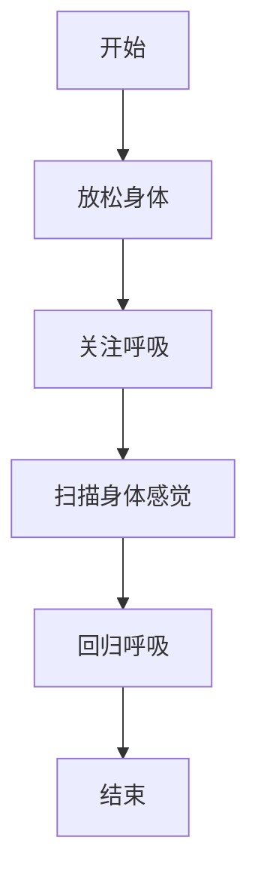

                 

### 《身体正念：重新连接身心的重要性》目录大纲

#### 1. 引言

- **文章标题**：《身体正念：重新连接身心的重要性》
- **关键词**：身体正念、身心健康、心理学、神经科学、实践方法、教育推广
- **摘要**：本文旨在探讨身体正念的概念、理论基础、实践方法及其对身心健康的影响，并提供相关教育和推广策略。

#### 2. 身体正念的核心概念

- **核心概念介绍**：身体正念是一种专注于身体感觉、呼吸和当下的心理状态，以提高身心健康的实践方法。
- **与心理健康的联系**：身体正念可以帮助个体减轻焦虑、抑郁等心理问题，提升心理健康水平。
- **与神经科学的联系**：身体正念与大脑中的神经传导、神经可塑性有关，可以改善大脑功能。

##### Mermaid流程图：身体正念的实践流程



#### 3. 身体正念的理论基础

- **历史发展**：身体正念源自佛教的冥想实践，近年来受到西方心理学、神经科学领域的关注。
- **心理学基础**：身体正念与注意力、意识、情感调节等心理学理论密切相关。
- **神经科学基础**：身体正念可以影响大脑中的神经传导、神经可塑性，改善大脑功能。

##### 伪代码：身体正念的核心算法原理

```python
def body_mind_meditation():
    # 放松身体
    relax_body()
    # 关注呼吸
    focus_on_breathing()
    # 扫描身体感觉
    scan_body_feelings()
    # 回归呼吸
    return_to_breathing()
```

##### 数学公式：身体正念的数学模型

$$
\text{身心状态} = f(\text{身体感觉}, \text{呼吸}, \text{注意力})
$$

#### 4. 身体正念的实践方法

- **身体扫描**：通过扫描身体的不同部位，关注身体感觉，放松身心。
- **正念呼吸**：专注于呼吸，让呼吸引导注意力，减轻心理压力。
- **正念行走**：在行走过程中，专注于脚步的感觉，提高身体意识。
- **正念瑜伽**：结合瑜伽动作和正念呼吸，增强身体柔韧性和平衡感。
- **正念冥想**：通过冥想，专注于当下的身体感觉和呼吸，减轻焦虑和压力。

#### 5. 身体正念与身心健康

- **心理健康影响**：身体正念可以改善焦虑、抑郁等心理问题，提高心理健康水平。
- **身体健康影响**：身体正念有助于改善心血管健康、免疫系统功能，降低慢性疾病风险。

#### 6. 身体正念在日常生活中的应用

- **工作中的应用**：通过身体正念，提高工作效率，减轻工作压力。
- **家庭生活中的应用**：在家庭生活中，通过身体正念，改善家庭氛围，增强家庭成员之间的情感联系。
- **社交场合的应用**：在社交场合，通过身体正念，提高人际交往能力，增强自信。

#### 7. 身体正念的教育与推广

- **教育的重要性**：通过教育，提高公众对身体正念的认识和应用能力。
- **推广策略**：利用媒体、互联网等渠道，推广身体正念的理念和实践方法。

### 总结

身体正念是一种有效的身心健康实践方法，通过理论基础的深入理解和实践方法的熟练掌握，我们可以更好地应对现代生活中的各种压力，提高生活质量和心理健康水平。

## 作者信息

作者：AI天才研究院/AI Genius Institute & 禅与计算机程序设计艺术 /Zen And The Art of Computer Programming

文章标题：《身体正念：重新连接身心的重要性》

关键词：身体正念、身心健康、心理学、神经科学、实践方法、教育推广

摘要：本文探讨了身体正念的概念、理论基础、实践方法及其对身心健康的影响，并提供相关教育和推广策略。通过深入理解和实践身体正念，我们可以更好地管理压力，提高生活质量和心理健康水平。

