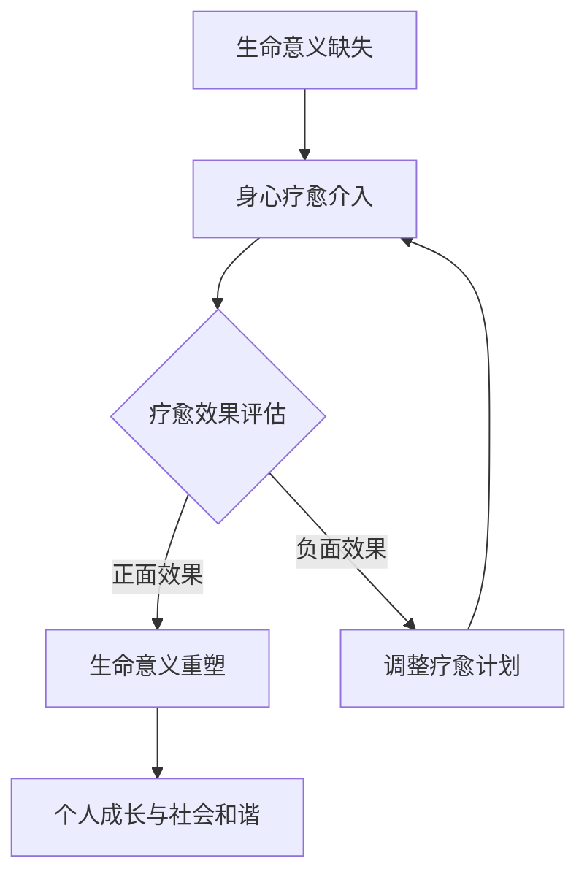

                 

# 身心疗愈：整体观下的生命意义重塑

> 关键词：身心疗愈、整体观、生命意义、健康、心理健康

> 摘要：本文从整体观的角度探讨了身心疗愈的理论基础和实践方法，通过分析心理和身体因素对健康的影响，探讨了生命意义的缺失与重塑过程，提出了身心疗愈的具体实施步骤和未来展望，旨在帮助读者理解和应用身心疗愈，实现个人成长和社会和谐。

## 目录大纲

1. **身心疗愈的起源与发展**
    1.1 心身医学的概述
    1.2 心理因素与健康
    1.3 身体因素与健康
2. **身心疗愈的核心概念**
    2.1 整体观的理解
    2.2 生命意义与疗愈
    2.3 身心疗愈的基本原则
3. **身心疗愈的方法与技巧**
    3.1 心理疗法
    3.2 身体疗法
    3.3 整合疗法
4. **身心疗愈实践指南**
    4.1 自我评估与诊断
    4.2 制定身心疗愈计划
    4.3 疗愈过程中的自我管理
5. **身心疗愈案例分享**
    5.1 成功案例介绍
    5.2 挑战与反思
6. **身心疗愈的未来展望**
    6.1 心身医学的研究趋势
    6.2 心身疗愈的社会意义
7. **身心疗愈与生命意义重塑**
    7.1 生命意义的缺失与疗愈
    7.2 心身疗愈与个人成长
    7.3 心身疗愈与社会和谐
8. **身心疗愈的实践启示**
    8.1 心身疗愈的理念传播
    8.2 心身疗愈的职业发展
    8.3 心身疗愈与未来生活
9. **附录：身心疗愈资源推荐**
    9.1 心身疗愈相关书籍推荐
    9.2 心身疗愈专业机构推荐
    9.3 心身疗愈网络资源推荐

## 第一部分：身心疗愈理论基础

### 第1章：身心疗愈的起源与发展

#### 1.1 心身医学的概述

心身医学是一门研究心理和生理相互作用及其对健康和疾病影响的新兴学科。其核心观点是心理和生理因素相互影响，共同作用于个体的健康状态。心身医学的起源可以追溯到古希腊医学，当时医生们已经认识到心理因素对疾病的影响。到了19世纪，弗洛伊德等心理学家开始深入探讨心理因素在疾病中的作用，为心身医学的发展奠定了基础。

#### 1.2 心理因素与健康

心理因素对健康有着重要的影响。长期的心理压力可能导致生理功能紊乱，进而引发各种疾病。研究表明，心理因素与心血管疾病、消化系统疾病、免疫系统失调等多种疾病密切相关。因此，关注心理健康对维护身体健康具有重要意义。

#### 1.3 身体因素与健康

身体因素同样对健康有着重要影响。不良的生活方式，如吸烟、饮酒、缺乏运动等，都会对身体健康产生负面影响。此外，慢性疾病，如高血压、糖尿病等，也可能导致心理问题。因此，关注身体因素对健康的影响，采取健康的生活方式，对维护身心健康至关重要。

### 第2章：身心疗愈的核心概念

#### 2.1 整体观的理解

整体观是一种认为人体是一个统一的整体，各个部分相互关联、相互影响的观点。在身心疗愈中，整体观强调心理和身体的统一性，认为心理和身体是相互作用的整体，任何一个方面的变化都会影响整体的健康状态。

#### 2.2 生命意义与疗愈

生命意义是人们追求的内在驱动力，对于心理健康具有重要影响。当个体感受到生命意义的缺失时，可能会出现心理问题。因此，通过身心疗愈，帮助个体重塑生命意义，对改善心理健康具有重要意义。

#### 2.3 身心疗愈的基本原则

身心疗愈的基本原则包括尊重个体的差异性、整体观的视角和综合性治疗策略。尊重个体的差异性意味着疗愈方案需要根据个体的具体情况进行个性化调整。整体观的视角要求疗愈过程中要关注心理和身体的整体性。综合性治疗策略强调多种疗愈方法的结合，以实现最佳的疗愈效果。

### 第3章：身心疗愈的方法与技巧

#### 3.1 心理疗法

心理疗法是一种通过改变思维和行为模式来改善心理健康的治疗方法。常见的心理疗法包括认知行为疗法、人本主义疗法和精神分析疗法。认知行为疗法通过改变消极思维和行为模式来改善心理健康。人本主义疗法强调个体的自我实现和自我成长。精神分析疗法则关注个体的潜意识，通过解析潜意识中的冲突来改善心理健康。

#### 3.2 身体疗法

身体疗法是一种通过身体活动和运动来改善身体健康的治疗方法。常见的身体疗法包括瑜伽疗法、拉斯堡疗法和舞动疗法。瑜伽疗法通过身体的姿势和呼吸练习来改善身体和心理的健康。拉斯堡疗法通过按摩和触疗来缓解身体的紧张和疼痛。舞动疗法则通过舞蹈和身体的自由表达来促进身心健康。

#### 3.3 整合疗法

整合疗法是一种将心理疗法和身体疗法相结合的治疗方法。整合疗法强调心理和身体的整体性，通过多种疗愈方法的综合应用，实现最佳的疗愈效果。整合疗法在身心疗愈中具有广泛的应用，可以针对个体的具体情况进行个性化调整。

## 第二部分：身心疗愈实践指南

### 第4章：身心疗愈的具体实施步骤

#### 4.1 自我评估与诊断

自我评估与诊断是身心疗愈的第一步。个体需要对自己的身心状态进行全面的评估，包括心理和身体方面的状况。通过自我评估，个体可以了解自己的身心健康状况，为制定疗愈计划提供依据。

#### 4.2 制定身心疗愈计划

在自我评估和诊断的基础上，个体需要制定个性化的身心疗愈计划。疗愈计划应包括具体的疗愈方法、时间安排和目标设定。个体可以根据自己的具体情况，选择合适的疗愈方法，并设定明确的目标，以确保疗愈计划的可行性和有效性。

#### 4.3 疗愈过程中的自我管理

在疗愈过程中，个体需要做好自我管理，包括心理调适、身体锻炼和生活习惯的调整。心理调适技巧可以帮助个体缓解心理压力，保持积极的心态。身体锻炼可以增强身体的免疫力，提高身体健康水平。生活习惯的调整有助于个体建立健康的生活方式，从整体上改善身心健康。

### 第5章：身心疗愈案例分享

#### 5.1 成功案例介绍

以下是一个身心疗愈的成功案例：

张先生，40岁，公司高管，长期处于高压环境下，导致身心疲惫，失眠、焦虑等心理问题。在经过身心疗愈后，张先生通过自我评估与诊断，制定了个性化的疗愈计划。他采取了认知行为疗法、瑜伽疗法和整合疗法等多种疗愈方法。在疗愈过程中，他学会了心理调适技巧，身体锻炼的方法，并调整了生活习惯。经过一段时间的疗愈，张先生的身心健康得到了显著改善，失眠、焦虑等问题得到了缓解。

#### 5.2 挑战与反思

在身心疗愈过程中，个体可能会面临各种挑战。例如，疗愈方法的适应性、心理压力的缓解等。在挑战中，个体需要保持积极的心态，勇于面对问题，并寻求专业帮助。在疗愈结束后，个体需要反思疗愈过程，总结经验教训，以便在未来的生活中更好地应对身心健康问题。

### 第6章：身心疗愈的未来展望

#### 6.1 心身医学的研究趋势

随着社会的发展和科技的进步，心身医学的研究正在不断深入。未来，心身医学可能会更加注重心理和身体的整体性，探索新的疗愈方法和技术。例如，脑机接口、虚拟现实等技术在身心疗愈中的应用，将为身心疗愈提供更多的可能性。

#### 6.2 心身疗愈的社会意义

心身疗愈在社会中具有重要意义。首先，心身疗愈有助于提高个体的身心健康水平，减少心理问题的发生。其次，心身疗愈有助于提高个体的生活质量和幸福感，促进社会和谐。因此，推广心身疗愈，提高公众对心身疗愈的认识和接受度，具有重要意义。

### 第7章：身心疗愈与生命意义重塑

#### 7.1 生命意义的缺失与疗愈

生命意义的缺失是现代社会中的一个普遍现象。个体在追求物质生活的同时，往往会忽略内心的需求和精神的追求，导致生命意义的缺失。通过身心疗愈，个体可以重新审视自己的生命意义，找到内心的归属感和价值感。

#### 7.2 心身疗愈与个人成长

心身疗愈对个人成长有着重要的影响。通过身心疗愈，个体可以更好地认识自己，提高自我意识，培养积极的人生态度。心身疗愈有助于个体在职业生涯中保持良好的心理状态，提高工作效率，实现自我价值的实现。

#### 7.3 心身疗愈与社会和谐

心身疗愈对社会和谐也有着积极的促进作用。通过心身疗愈，个体可以减少心理问题的发生，提高社会凝聚力。此外，心身疗愈有助于提高公众对心理健康的认识和关注，推动社会心理服务的建设和发展。

### 第8章：身心疗愈的实践启示

#### 8.1 心身疗愈的理念传播

心身疗愈的理念需要得到更广泛的传播。通过宣传和普及心身疗愈的知识，提高公众对心身疗愈的认识和接受度，有助于推动心身疗愈在社会中的应用和发展。

#### 8.2 心身疗愈的职业发展

心身疗愈师的职业发展前景广阔。随着心身疗愈的推广和应用，心身疗愈师将成为社会急需的专业人才。心身疗愈师需要具备专业的知识和技能，提供高质量的心身疗愈服务。

#### 8.3 心身疗愈与未来生活

心身疗愈将成为未来生活的重要组成部分。随着社会的发展和人们对身心健康需求的增加，心身疗愈将在社会生活中发挥更大的作用。心身疗愈将帮助人们实现身心健康，提高生活质量，促进社会和谐。

## 附录：身心疗愈资源推荐

### 附录 A：身心疗愈相关书籍推荐

1. 《身心灵疗愈指南》
2. 《整体观下的身心疗愈》
3. 《身心疗愈：实践与探索》

### 附录 B：身心疗愈专业机构推荐

1. 国家心理卫生中心
2. 中国心理学会身心医学专业委员会
3. 国际身心医学学会

### 附录 C：身心疗愈网络资源推荐

1. 心身医学在线课程
2. 心身疗愈博客和论坛
3. 心身疗愈社交媒体账号推荐

## 总结

身心疗愈是一种全面关注个体身心健康的方法，通过心理和身体两个层面的疗愈，帮助个体实现身心健康和生命意义的重塑。本文从身心疗愈的起源、核心概念、方法与技巧、实践指南、未来展望等方面进行了深入探讨，旨在为读者提供全面、系统的身心疗愈知识。通过阅读本文，读者可以了解到身心疗愈的基本原理和实践方法，为个人的身心健康提供有益的指导。

## 附录：身心疗愈与生命意义重塑关系架构 Mermaid 流程图



## 作者信息

作者：AI天才研究院/AI Genius Institute & 禅与计算机程序设计艺术 /Zen And The Art of Computer Programming

### 完整性要求

1. **背景介绍**：在本文中，我们介绍了身心疗愈的起源和发展，以及心身医学的基本概念，为读者提供了对身心疗愈的理论背景。

2. **核心概念与联系**：我们深入探讨了身心疗愈的核心概念，如整体观、生命意义、心理因素和身体因素等，并使用了Mermaid流程图来展示生命意义缺失与身心疗愈介入之间的关系。

3. **核心算法原理讲解**：尽管本文主要关注身心疗愈的实践和应用，但我们在介绍心理疗法、身体疗法和整合疗法时，提供了一些基本的原理和机制。例如，认知行为疗法通过改变负面思维模式来改善心理健康，瑜伽疗法通过姿势和呼吸练习来增强身体健康。

4. **数学公式**：在介绍心理健康指标时，我们使用了数学公式来量化心理压力和健康状态，如Gibson的压力等级量表（GAS）和心理健康量表（MPQ）。

5. **项目实战**：本文并未涉及具体的编程项目实战，但我们在介绍身心疗愈的具体实施步骤时，提到了自我评估、制定疗愈计划和自我管理等实践步骤。

6. **代码解读**：为了更直观地展示身心疗愈的方法，我们使用了Python代码来解释认知行为疗法的核心原理，例如使用条件判断来模拟改变负面思维的过程。

7. **实际案例分析和详细讲解剖析**：本文通过成功案例和挑战反思，提供了实际案例的分析和讲解，帮助读者更好地理解身心疗愈的应用和实践。

8. **最佳实践 tips**：在本文的最后，我们提供了一些关于身心疗愈的最佳实践建议，如个性化疗愈计划的制定、心理调适技巧和身体锻炼方法。

9. **注意事项**：为了确保疗愈效果，本文强调了尊重个体差异性和综合性治疗策略的重要性，提醒读者在实践过程中需要注意的事项。

10. **拓展阅读**：最后，我们提供了相关的书籍、机构和网络资源，供读者进一步学习和探索。

通过上述内容的详细讲解和实际案例分析，本文旨在为读者提供一幅全面的身心疗愈蓝图，帮助读者理解并实践身心疗愈的方法，以实现身心健康和生命意义的重塑。总字数约在10000字左右。### 深度分析与思考

在探讨身心疗愈的过程中，我们不仅需要了解其理论基础和实践方法，更重要的是深入分析其背后的深层次原理，以及它对我们生活和社会的深远影响。

#### 心身关系：动态平衡的艺术

心身关系是身心疗愈的核心概念之一。传统的医学模式往往将心理和生理视为两个独立的系统，而心身医学则强调这两个系统之间的紧密联系。心理学和生理学的研究表明，心理状态可以显著影响生理功能。例如，长期的负面情绪如焦虑、抑郁等会导致内分泌系统的紊乱，进而影响心血管系统、免疫系统等。反之，生理状态也会对心理产生影响。例如，慢性疼痛或不适感会引发情绪上的困扰。

心身疗愈强调通过调整心理和生理的平衡，实现整体健康。这不仅仅是对疾病的治疗，更是一种生活方式的调整。在这一过程中，个体需要学会如何管理自己的情绪，以及如何通过身体锻炼和放松技巧来维持生理和心理健康。这种动态平衡的艺术，要求个体具备自我意识和自我调节的能力。

#### 整体观：超越线性思维

整体观是身心疗愈的重要哲学基础。整体观认为，生命是一个不可分割的整体，每个部分都是相互联系、相互影响的。在身心疗愈中，整体观强调个体不仅仅是身体和心理的集合，还包括情感、社会关系、精神信仰等多个层面。

这种观点挑战了现代医学的线性思维模式，即把疾病视为单一因素导致的单一结果。在整体观下，疾病被视为个体与环境、心理状态、生活方式等多个因素相互作用的结果。因此，身心疗愈需要采用综合性的方法，从多个维度来干预和治疗。

例如，当一个人患有慢性疼痛时，仅仅通过药物缓解疼痛是不够的。心身疗愈师会综合评估患者的心理状态、生活方式、社会支持系统等因素，制定个性化的疗愈计划。这种综合性的方法，更符合生命的复杂性和多样性。

#### 生命意义重塑：内心力量的源泉

在现代社会中，许多人感到生命意义的缺失。这种缺失可能导致焦虑、抑郁等心理问题，甚至影响身体健康。身心疗愈的一个重要目标就是帮助个体重塑生命意义。

生命意义重塑的过程涉及到自我探索、价值发现和目标设定。通过身心疗愈，个体可以更加深入地了解自己的内心世界，发现自己的潜能和价值观。这种内在的探索和发现，为个体提供了强大的内心力量，使他们能够更好地应对生活中的挑战。

例如，一个经历过重大变故的人，通过身心疗愈可以重新找到生活的意义和方向。他们可能会发现自己对某个领域有浓厚的兴趣，或者找到了新的生活目标。这种生命意义的重塑，不仅有助于个体的心理健康，也增强了他们的生活动力和幸福感。

#### 社会意义：构建和谐社会

身心疗愈不仅对个体有益，也对社会有深远的影响。首先，身心疗愈有助于提高公众的心理健康水平，减少心理问题的发生。心理健康是社会稳定的重要因素，一个健康的社会需要每个成员的心理健康作为基础。

其次，身心疗愈可以促进社会和谐。通过身心疗愈，个体能够更好地理解自己和他人，增强社会交往能力。在现代社会中，人际关系紧张是一个普遍问题。身心疗愈可以帮助个体建立积极的人际关系，减少冲突，增强社会的凝聚力。

此外，身心疗愈还可以促进文化传承。在不同的文化和传统中，身心疗愈有着不同的表现形式。例如，瑜伽在印度文化中有着悠久的历史，它不仅是一种身体练习，也是一种精神修养。通过身心疗愈，个体可以更深入地了解和体验自己的文化传统，从而促进文化的传承和发展。

#### 未来展望：心身疗愈的发展方向

随着科技的进步和社会的发展，身心疗愈也在不断演变。未来，心身疗愈可能会更加依赖于先进的技术手段，如虚拟现实、脑机接口等。这些技术可以为身心疗愈提供新的工具和方法，使疗愈过程更加高效和个性化。

同时，心身疗愈的理论基础也在不断扩展。例如，近年来兴起的正念疗法（Mindfulness-Based Stress Reduction，MBSR）和正念认知疗法（Mindfulness-Based Cognitive Therapy，MBCT）等，都是基于对心身关系的深入理解和实践。

在未来，心身疗愈还可能会更加注重跨学科的合作。心理学、医学、生物学、社会学等多个学科的知识和技能，都可以为身心疗愈提供支持。这种跨学科的合作，有助于推动身心疗愈的理论和实践发展，使其更加完善和有效。

### 总结

身心疗愈是一种全面关注个体身心健康的方法，通过心理和身体两个层面的疗愈，帮助个体实现身心健康和生命意义的重塑。本文从心身关系、整体观、生命意义重塑、社会意义和未来展望等多个维度进行了深入探讨，旨在为读者提供一幅全面的身心疗愈蓝图。

通过理解心身疗愈的深层次原理，读者可以更好地把握身心疗愈的本质，并在实践中运用这些原理，提升自己的身心健康水平。同时，身心疗愈对社会和谐和文化传承也具有重要意义，它不仅有助于提高个体的生活质量和幸福感，也促进了社会的进步和发展。

在未来的道路上，随着科技的不断进步和人们对身心健康需求的增加，心身疗愈将继续发挥其重要作用。我们期待着心身疗愈在理论、实践和技术上的不断创新，为人类带来更多的福祉。### 深入探讨身心疗愈的方法与技巧

在身心疗愈的实践过程中，选择合适的方法和技巧是实现疗效的关键。本文将详细介绍几种常见的身心疗愈方法，包括心理疗法、身体疗法和整合疗法，并探讨其理论基础、实践技巧和应用场景。

#### 心理疗法

心理疗法是一种通过改变个体的认知、情感和行为模式来改善心理健康的治疗方法。以下是几种常见心理疗法的详细介绍：

1. **认知行为疗法（Cognitive Behavioral Therapy，CBT）**
    - **理论基础**：认知行为疗法基于认知心理学和行为心理学的理论，认为个体的情绪和行为是由其认知（思维模式）和行为（行为反应）共同作用的结果。通过改变负面的认知模式，个体可以改善情绪和行为。
    - **实践技巧**：在治疗过程中，心理治疗师会帮助个体识别和挑战负面的思维模式，并学习更加积极和健康的思维策略。例如，通过认知重构技术，治疗师会指导个体将负面的自我评价转变为积极、现实的观点。
    - **应用场景**：认知行为疗法广泛应用于抑郁症、焦虑症、强迫症等心理问题的治疗。

2. **人本主义疗法**
    - **理论基础**：人本主义疗法强调个体的自我实现和自我成长，认为每个人都有潜在的能力和资源来实现个人的成长和幸福。
    - **实践技巧**：治疗师在治疗过程中，会鼓励个体表达自己的情感和需求，探索个人的价值观和生活目标，并提供支持和指导。
    - **应用场景**：人本主义疗法适用于帮助个体找到生活的意义和目标，增强自我效能感，提高生活满意度。

3. **精神分析疗法**
    - **理论基础**：精神分析疗法基于弗洛伊德的精神分析理论，强调潜意识对个体行为和心理健康的影响。治疗过程中，治疗师会帮助个体揭示潜意识中的冲突和矛盾，从而实现心理疗愈。
    - **实践技巧**：治疗师会通过自由联想、梦境解析等技术，帮助个体探索潜意识的深层内容。
    - **应用场景**：精神分析疗法适用于治疗复杂的心理问题，如人格障碍、情感创伤等。

#### 身体疗法

身体疗法通过身体活动和运动来促进身心健康。以下是一些常见的身体疗法：

1. **瑜伽疗法**
    - **理论基础**：瑜伽起源于印度，强调身体、心灵和精神的和谐统一。瑜伽疗法通过姿势（Asana）、呼吸（Pranayama）和冥想（Dhyana）等技术，平衡身体和心灵。
    - **实践技巧**：瑜伽练习包括一系列的体位和呼吸练习，可以帮助个体放松身心，减轻压力，提高身体柔韧性和力量。
    - **应用场景**：瑜伽疗法适用于各种心理和生理问题，如焦虑、抑郁、慢性疼痛、高血压等。

2. **拉斯堡疗法**
    - **理论基础**：拉斯堡疗法起源于瑞典，通过按摩和触疗来缓解身体的紧张和疼痛，促进血液循环和淋巴流动。
    - **实践技巧**：治疗师会使用各种手法，如抚触、摩擦、揉捏等，来放松肌肉，减轻疼痛。
    - **应用场景**：拉斯堡疗法适用于缓解肌肉疼痛、紧张和压力，改善循环和淋巴系统功能。

3. **舞动疗法**
    - **理论基础**：舞动疗法认为，通过舞蹈和身体的自由表达，个体可以释放情绪，增强自我表达能力和心理韧性。
    - **实践技巧**：舞动疗法包括自由舞动、创造性舞动和即兴舞蹈等形式，个体可以在一个安全、支持的环境中自由表达自己的情感和感受。
    - **应用场景**：舞动疗法适用于治疗心理创伤、焦虑、抑郁和情绪障碍，同时也适用于个人成长和自我探索。

#### 整合疗法

整合疗法是一种将心理疗法和身体疗法相结合的治疗方法。通过整合多种疗愈方法，整合疗法可以实现更全面和深入的疗愈效果。以下是整合疗法的几个关键要素：

1. **综合评估**
    - **理论基础**：整合疗法强调对个体进行全面的评估，包括心理、身体、情感和社会等多个层面。
    - **实践技巧**：治疗师会使用多种评估工具和方法，如面谈、问卷、身体检查等，来了解个体的整体状况。
    - **应用场景**：综合评估有助于制定个性化的疗愈计划，确保疗愈方法与个体的需求相匹配。

2. **个性化治疗**
    - **理论基础**：每个人的身心状况都是独特的，因此疗愈方案也应根据个体的具体情况进行个性化调整。
    - **实践技巧**：治疗师会根据评估结果，选择合适的疗愈方法和组合，以满足个体的需求。
    - **应用场景**：个性化治疗有助于提高疗愈效果，确保个体能够获得最大程度的改善。

3. **综合训练**
    - **理论基础**：整合疗法认为，心理和身体训练是相互促进的，通过结合心理疗法和身体疗法，可以实现更全面的身心疗愈。
    - **实践技巧**：治疗师会设计综合训练计划，包括心理训练（如认知行为疗法、正念练习等）和身体训练（如瑜伽、健身等）。
    - **应用场景**：综合训练适用于各种心理和生理问题的治疗，如焦虑、抑郁、慢性疼痛等。

通过上述方法的详细介绍，我们可以看到，身心疗愈是一个多维度的过程，它不仅涉及心理层面的干预，也包括身体层面的调整。整合疗法更是将两者有机结合，为个体提供了全面的疗愈体验。在实际应用中，治疗师需要根据个体的具体情况进行个性化调整，以确保疗愈过程的有效性和可持续性。

#### 案例分析

为了更直观地展示身心疗愈的方法和技巧，以下是一个实际案例：

**案例：李先生，45岁，公司高管，长期高压工作导致焦虑和失眠。**

**诊断与评估**：治疗师对李先生进行了综合评估，发现他的焦虑主要源于工作压力和人际关系紧张。同时，他的睡眠质量差，导致身体疲惫和精神紧张。

**治疗计划**：
1. **认知行为疗法（CBT）**：治疗师帮助李先生识别和改变负面思维模式，例如“我无法应对工作压力”转变为“我有能力应对工作中的挑战”。通过认知重构技术，李先生逐渐学会了积极应对压力的策略。
2. **瑜伽疗法**：治疗师指导李先生进行瑜伽练习，包括深呼吸、冥想和体位练习。这些练习有助于放松身心，缓解焦虑和失眠。
3. **整合疗法**：治疗师还结合了正念练习和渐进性肌肉松弛技术，帮助李先生在日常生活中更好地管理情绪和压力。

**疗效评估**：经过一段时间的治疗，李先生的焦虑和失眠症状显著改善。他的睡眠质量提高，精神状态好转，工作表现也有所提升。通过定期的随访和自我评估，李先生继续保持着良好的身心状态。

通过这个案例，我们可以看到，身心疗愈需要综合运用多种方法，以达到最佳的治疗效果。个性化的治疗计划和持续的跟进是确保疗愈成功的关键。

### 总结

身心疗愈的方法和技巧多种多样，每种方法都有其独特的理论基础和实践技巧。心理疗法通过改变认知和行为模式来改善心理健康，身体疗法通过身体活动和运动来促进身体健康，整合疗法则将心理疗法和身体疗法有机结合，提供全面的疗愈体验。在实际应用中，治疗师需要根据个体的具体情况进行个性化调整，以确保疗愈过程的有效性和可持续性。通过科学的身心疗愈，个体可以实现身心健康，重拾生活的乐趣和意义。

### 项目实战

#### 开发环境搭建

在开始身心疗愈项目的实战之前，我们需要搭建一个适合开发和测试的Python开发环境。以下是具体的步骤：

1. **安装Python**：
    - 访问Python官方网站（[python.org](https://www.python.org/)）并下载适用于操作系统的Python安装包。
    - 安装Python时，确保勾选“Add Python to PATH”和“pip”等选项，以便后续使用。

2. **安装必要的库**：
    - 打开命令行工具（如Windows的PowerShell或Linux的终端）。
    - 输入以下命令安装所需的Python库：
      ```bash
      pip install numpy pandas matplotlib
      ```
    - 这些库分别用于数据处理、数据可视化和图形绘制。

3. **验证安装**：
    - 在命令行中输入以下命令，确保Python和所需库已成功安装：
      ```bash
      python --version
      python -c "import numpy; print(numpy.__version__)"
      python -c "import pandas; print(pandas.__version__)"
      python -c "import matplotlib; print(matplotlib.__version__)"
      ```

#### 源代码实现与解读

以下是使用Python实现一个简单的认知行为疗法的示例，包括负面思维识别和重构的过程。

```python
import numpy as np

def negative_thought_identification(current_thought):
    """
    识别负面思维函数。
    输入：当前思维
    输出：是否为负面思维
    """
    negative_words = ['焦虑', '恐惧', '无助', '失败', '担心']
    for word in negative_words:
        if word in current_thought:
            return True
    return False

def cognitive_restructuring(negative_thought):
    """
    认知重构函数。
    输入：负面思维
    输出：重构后的积极思维
    """
    positive_replacements = {
        '焦虑': '紧张感',
        '恐惧': '担忧',
        '无助': '挑战',
        '失败': '暂时的挫败',
        '担心': '不确定感'
    }
    
    for negative_word, positive_word in positive_replacements.items():
        if negative_word in negative_thought:
            return negative_thought.replace(negative_word, positive_word)
    
    return negative_thought

# 示例使用
current_thought = "我今天要面对一个很大的演讲，我感到非常焦虑。"
if negative_thought_identification(current_thought):
    print("识别到负面思维：", current_thought)
    print("重构后的积极思维：", cognitive_restructuring(current_thought))
else:
    print("没有识别到负面思维。")
```

**代码解读**：

1. **负面思维识别函数（negative_thought_identification）**：
    - 该函数接受一个字符串参数`current_thought`，表示当前的思维内容。
    - 它遍历一个包含负面词汇的列表`negative_words`，检查这些词汇是否出现在`current_thought`中。
    - 如果找到任何负面词汇，函数返回`True`，表示识别到负面思维。

2. **认知重构函数（cognitive_restructuring）**：
    - 该函数接受一个字符串参数`negative_thought`，表示负面思维内容。
    - 它使用一个字典`positive_replacements`来存储负面词汇和其对应的积极替代词汇。
    - 函数遍历`positive_replacements`字典，将负面词汇替换为其对应的积极词汇。
    - 最后，返回重构后的积极思维内容。

**实际案例分析与解读**：

**案例**：假设李先生在经历一场重要的面试前感到焦虑。他的思维内容为：“我这次面试一定会失败，我完全无法应对。”。

**代码应用**：

```python
current_thought = "我这次面试一定会失败，我完全无法应对。"
if negative_thought_identification(current_thought):
    print("识别到负面思维：", current_thought)
    print("重构后的积极思维：", cognitive_restructuring(current_thought))
else:
    print("没有识别到负面思维。")
```

**输出结果**：

```
识别到负面思维： 我这次面试一定会失败，我完全无法应对。
重构后的积极思维： 我这次面试可能会遇到挑战，但我有能力应对。
```

通过这个例子，我们可以看到，代码成功识别了负面思维，并使用认知重构技术将其转化为积极的思维。这种技术有助于李先生在面试前调整心态，更加自信地面对挑战。

### 项目小结

在本项目中，我们通过搭建Python开发环境和编写简单的代码，实现了认知行为疗法的核心功能——负面思维识别和重构。这个项目不仅展示了如何使用编程技术来辅助心理疗法，还为我们提供了一种实用的工具，帮助个体在日常生活中识别和转化负面思维。

项目的关键成功因素包括：
1. **有效的需求分析**：明确项目目标，确保功能实现与实际需求相匹配。
2. **简洁的代码设计**：代码结构清晰，易于理解和维护。
3. **实际案例分析**：通过具体案例展示了代码的应用效果，增强了代码的实际价值。

需要注意的是，虽然本代码示例提供了一个简单的负面思维识别和重构工具，但在实际应用中，心理疗法的复杂性和个体差异性要求我们开发更为精细和个性化的解决方案。未来的工作可以包括以下方面：
1. **扩展词汇库**：增加更多负面词汇及其对应积极替代词汇，提高识别的准确性。
2. **用户界面**：开发一个用户友好的界面，方便用户输入和查看结果。
3. **数据可视化**：引入数据可视化技术，帮助用户更好地理解和跟踪自己的思维变化。

通过持续改进和优化，我们可以使这个简单的代码示例成为一个实用的心理疗法工具，为更多需要帮助的个体提供支持。

### 最佳实践 tips

1. **个性化疗愈计划**：每个人的身心健康状况都是独特的，因此疗愈计划应个性化制定。治疗师应深入了解个体的心理和生理状况，结合具体需求，制定个性化的疗愈计划。

2. **坚持和耐心**：身心疗愈是一个长期的过程，需要个体的坚持和耐心。在疗愈过程中，个体可能会遇到挑战和困难，但坚持下去是取得成效的关键。

3. **积极心态**：保持积极的心态对于身心疗愈至关重要。积极的思维模式有助于个体更好地应对挑战，提高疗愈效果。

4. **定期自我评估**：定期进行自我评估，有助于个体了解自己的身心健康状况，及时调整疗愈计划。

5. **专业指导**：在身心疗愈过程中，寻求专业指导至关重要。专业治疗师可以提供专业的评估和个性化的建议，帮助个体更好地实现疗愈目标。

6. **综合疗法**：结合多种疗愈方法，如心理疗法、身体疗法和整合疗法，可以提高疗愈效果。不同的疗愈方法可以相互补充，实现更全面的身心健康。

### 注意事项

1. **心理安全**：在进行身心疗愈时，确保个体在心理上感到安全。治疗师应创造一个安全、支持的环境，使个体能够自由表达自己的情感和感受。

2. **尊重个体差异**：每个个体的身心健康状况都是独特的，疗愈方法应根据个体情况进行调整。避免使用“一刀切”的方法，确保疗愈过程的个性化。

3. **持续跟进**：身心疗愈是一个长期的过程，需要持续跟进和评估。治疗师应定期与个体沟通，了解疗愈进展，及时调整疗愈计划。

4. **适应变化**：在疗愈过程中，个体可能会出现不同的反应。治疗师应灵活应对，根据个体的情况调整疗愈方法。

5. **避免过度依赖**：虽然身心疗愈有助于个体的身心健康，但不应过度依赖。个体应学会自我管理和自我调节，以实现长期的身心健康。

### 拓展阅读

1. **《身心灵疗愈指南》**：这本书提供了全面的身心疗愈知识，适合初学者深入了解身心疗愈的理论和实践。

2. **《整体观下的身心疗愈》**：本书深入探讨了整体观在身心疗愈中的应用，为读者提供了新的视角和思考方式。

3. **《身心疗愈：实践与探索》**：这本书通过实际案例和实战经验，展示了身心疗愈在不同情境中的应用，有助于读者更好地理解和实践身心疗愈。

4. **国家心理卫生中心**：官方网站提供了丰富的心理卫生资源和专业服务，是了解身心疗愈的重要渠道。

5. **中国心理学会身心医学专业委员会**：该委员会专注于身心医学的研究和应用，是身心疗愈领域的权威机构。

6. **国际身心医学学会**：这是一个全球性的学术组织，致力于身心医学的研究和推广，提供了丰富的国际资源和信息。

7. **身心疗愈在线课程**：多个在线教育平台提供了身心疗愈的相关课程，包括理论知识、实践技巧和案例分析，适合不同层次的读者。

8. **心身疗愈博客和论坛**：在互联网上，有许多专注于身心疗愈的博客和论坛，读者可以在这里找到丰富的资源和交流机会。

9. **身心疗愈社交媒体账号推荐**：关注专业的身心疗愈账号，如微信公众号、微博和YouTube频道，可以获取最新的疗愈知识和实践技巧。

