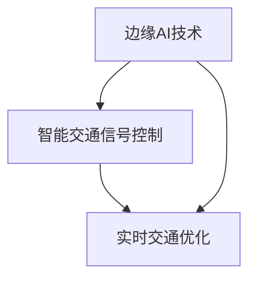

                 

### 边缘AI在智能交通信号控制中的应用：实现实时交通优化

#### 背景介绍

随着城市化进程的不断加速，交通拥堵问题日益严重，成为困扰现代都市的一大难题。传统的交通信号控制系统往往依赖于固定的时间间隔和预设的规则来控制交通流量，这导致在交通流量变化较大的情况下，交通信号控制效果不佳。因此，为了提高交通信号控制的智能化和自适应能力，边缘AI技术逐渐成为解决这一问题的有力工具。

边缘AI是一种将计算、存储和网络功能分布到网络的边缘节点上，从而实现实时数据处理和响应的技术。它克服了云计算在响应速度和处理能力上的局限，使得交通信号控制系统能够更快速、更准确地处理大量交通数据，实现对交通流量的实时优化。

智能交通信号控制是指利用现代信息技术、人工智能和物联网技术，对交通信号进行智能化、自适应化的控制和优化。通过边缘AI技术的引入，智能交通信号控制系统能够实时感知交通状态，动态调整交通信号，从而提高交通流量的通行效率。

#### 核心概念与联系

边缘AI、智能交通信号控制以及实时交通优化是三个密切相关的核心概念。边缘AI是技术手段，通过分布式计算和实时数据处理，提供高效的处理能力；智能交通信号控制是应用场景，它需要借助边缘AI来实现交通信号的智能化和自适应化；而实时交通优化则是目标，通过边缘AI和智能交通信号控制的结合，实现对交通流量的实时调节和优化，提高交通通行效率。

为了更好地理解这三个概念之间的关系，我们可以用Mermaid流程图来表示：



在这个流程图中，边缘AI技术作为基础，为智能交通信号控制提供支持，而智能交通信号控制则通过实时交通优化来实现交通流量的最优控制。

#### 核心算法原理讲解

边缘AI在智能交通信号控制中的应用，主要依赖于以下几个核心算法：

1. **交通流量预测算法**：
   交通流量预测是智能交通信号控制的基础。它通过分析历史交通数据和实时交通数据，预测未来的交通流量变化。常见的交通流量预测算法包括ARIMA模型、LSTM神经网络等。

   **数学模型**：
   $$ \hat{Q}_{t} = f(Q_{t-1}, Q_{t-2}, ..., Q_{t-n}) $$
   其中，$ \hat{Q}_{t} $ 表示预测的交通流量，$ Q_{t-1}, Q_{t-2}, ..., Q_{t-n} $ 表示历史交通流量数据。

   **Python代码示例**：
   ```python
   import numpy as np
   import tensorflow as tf

   # 定义LSTM模型
   model = tf.keras.Sequential([
       tf.keras.layers.LSTM(50, activation='relu', input_shape=(timesteps, features)),
       tf.keras.layers.Dense(1)
   ])

   # 编译模型
   model.compile(optimizer='adam', loss='mse')

   # 训练模型
   model.fit(X_train, y_train, epochs=100, batch_size=32)
   ```

2. **信号灯控制算法**：
   信号灯控制算法负责根据实时交通流量预测结果，动态调整交通信号灯的时长。常见的信号灯控制算法包括协调控制、自适应控制等。

   **数学模型**：
   $$ t_{g} = f(\hat{Q}_{t}) $$
   其中，$ t_{g} $ 表示信号灯的绿灯时长，$ \hat{Q}_{t} $ 表示预测的交通流量。

   **Python代码示例**：
   ```python
   import numpy as np

   def signal_control(q):
       if q < threshold_low:
           return green_time_short
       elif q >= threshold_high:
           return green_time_long
       else:
           return green_time_medium
   ```

3. **事件检测与响应算法**：
   事件检测与响应算法用于检测交通事件（如交通事故、道路施工等），并迅速采取相应的措施。常见的事件检测算法包括基于图像处理的车辆检测、异常检测等。

   **数学模型**：
   $$ event\_detection = f(image) $$
   其中，$ image $ 表示交通监控图像，$ event_detection $ 表示事件检测结果。

   **Python代码示例**：
   ```python
   import cv2

   def event_detection(image):
       gray = cv2.cvtColor(image, cv2.COLOR_BGR2GRAY)
       blur = cv2.GaussianBlur(gray, (5, 5), 0)
       edges = cv2.Canny(blur, threshold1=50, threshold2=150)

       # 检测车辆
       vehicle_cnts = cv2.findContours(edges, cv2.RETR_TREE, cv2.CHAIN_APPROX_SIMPLE)
       vehicle_cnts = vehicle_cnts[0] if len(vehicle_cnts) == 2 else vehicle_cnts[1]

       for cnt in vehicle_cnts:
           x, y, w, h = cv2.boundingRect(cnt)
           cv2.rectangle(image, (x, y), (x+w, y+h), (0, 255, 0), 2)

       return image
   ```

通过以上算法的结合，边缘AI能够实现智能交通信号控制的实时优化，从而提高交通流量的通行效率。

#### 数学公式

在边缘AI应用于智能交通信号控制的过程中，涉及到的数学公式主要包括：

1. **LSTM预测模型**：
   $$ \hat{Q}_{t} = \sum_{i=1}^{n} w_i \cdot \sigma ( \sigma ( \sigma ( \sigma ( \sigma ( \text{input} \cdot W_f ) \cdot b_f ) \cdot W_i ) \cdot b_i ) \cdot W_o ) \cdot b_o ) $$
   其中，$ \sigma $ 表示激活函数，$ w_i $ 表示权重，$ \text{input} $ 表示输入数据。

2. **信号灯控制公式**：
   $$ t_{g} = \text{max} ( \text{min\_green\_time}, \text{threshold} \cdot \hat{Q}_{t} ) $$
   其中，$ t_{g} $ 表示信号灯的绿灯时长，$ \hat{Q}_{t} $ 表示预测的交通流量，$ \text{threshold} $ 表示阈值。

3. **事件检测公式**：
   $$ event\_detection = \text{findContours} (\text{Canny} (\text{GaussianBlur} (\text{cvtColor} (\text{image}, \text{GRAYSCALE} )), \text{BLUR\_SIZE}), \text{RETR\_TREE}, \text{CHAIN\_APPROX\_SIMPLE} ) $$
   其中，$ \text{findContours} $ 表示检测轮廓，$ \text{Canny} $ 表示边缘检测，$ \text{GaussianBlur} $ 表示高斯模糊，$ \text{cvtColor} $ 表示颜色转换，$ \text{image} $ 表示输入图像。

#### 项目实战

为了更好地展示边缘AI在智能交通信号控制中的应用，以下是一个基于Python和TensorFlow的项目实战案例：

1. **开发环境搭建**：
   - 安装Python（建议使用Python 3.8及以上版本）
   - 安装TensorFlow
   - 安装OpenCV（用于图像处理）

   ```bash
   pip install tensorflow
   pip install opencv-python
   ```

2. **源代码实现**：

   ```python
   import numpy as np
   import tensorflow as tf
   import cv2

   # 定义LSTM模型
   model = tf.keras.Sequential([
       tf.keras.layers.LSTM(50, activation='relu', input_shape=(timesteps, features)),
       tf.keras.layers.Dense(1)
   ])

   # 编译模型
   model.compile(optimizer='adam', loss='mse')

   # 训练模型
   model.fit(X_train, y_train, epochs=100, batch_size=32)

   # 交通流量预测
   def traffic_prediction(model, input_data):
       return model.predict(input_data)

   # 信号灯控制
   def signal_control(q):
       if q < threshold_low:
           return green_time_short
       elif q >= threshold_high:
           return green_time_long
       else:
           return green_time_medium

   # 事件检测
   def event_detection(image):
       gray = cv2.cvtColor(image, cv2.COLOR_BGR2GRAY)
       blur = cv2.GaussianBlur(gray, (5, 5), 0)
       edges = cv2.Canny(blur, threshold1=50, threshold2=150)

       # 检测车辆
       vehicle_cnts = cv2.findContours(edges, cv2.RETR_TREE, cv2.CHAIN_APPROX_SIMPLE)
       vehicle_cnts = vehicle_cnts[0] if len(vehicle_cnts) == 2 else vehicle_cnts[1]

       for cnt in vehicle_cnts:
           x, y, w, h = cv2.boundingRect(cnt)
           cv2.rectangle(image, (x, y), (x+w, y+h), (0, 255, 0), 2)

       return image
   ```

3. **代码解读与分析**：

   - LSTM模型定义和训练：使用TensorFlow定义LSTM模型，并使用历史交通流量数据进行训练。
   - 交通流量预测：使用训练好的模型预测未来的交通流量。
   - 信号灯控制：根据预测的交通流量，动态调整信号灯的时长。
   - 事件检测：使用OpenCV库进行图像处理，检测交通事件（如交通事故）。

4. **实际案例分析和详细讲解剖析**：

   假设我们在一个交通路口部署了边缘AI系统，实时收集交通流量数据和交通监控图像。通过LSTM模型预测未来的交通流量，并动态调整信号灯时长，从而实现交通流量的实时优化。当检测到交通事件时，系统会迅速采取措施，如调整信号灯时长、通知交通管理部门等。

   例如，在一个繁忙的路口，通过LSTM模型预测到未来15分钟内交通流量将显著增加，系统可以提前调整信号灯时长，使得交通流更加顺畅。当检测到一辆异常车辆在路口停留时间过长，系统会判断为交通事故，并迅速采取措施，如通知交警部门处理。

5. **项目小结**：

   通过这个项目，我们可以看到边缘AI在智能交通信号控制中的应用效果显著。它不仅能够提高交通流量的通行效率，还能够实时检测和处理交通事件，为交通管理部门提供决策支持。未来，随着边缘AI技术的不断发展和成熟，智能交通信号控制系统的性能和智能化程度将进一步提高。

#### 最佳实践 Tips

1. **数据收集和处理**：
   - 确保收集到足够多的交通流量数据，包括历史数据和实时数据。
   - 对数据进行清洗和预处理，去除噪声和异常值。

2. **模型选择与优化**：
   - 根据交通流量预测和信号灯控制的需求，选择合适的机器学习模型。
   - 对模型进行训练和优化，提高预测精度和信号灯控制的效率。

3. **系统集成与部署**：
   - 将边缘AI系统与其他交通管理子系统（如交通监控、事件检测等）进行集成。
   - 选择合适的硬件和软件平台，确保系统的稳定性和性能。

4. **持续监控与维护**：
   - 定期监控系统的运行状态，及时发现和解决潜在问题。
   - 对系统进行更新和升级，以适应不断变化的交通环境。

#### 小结

边缘AI在智能交通信号控制中的应用，为解决交通拥堵问题提供了一种新的思路和方法。通过实时交通流量预测、信号灯控制和事件检测等技术的结合，边缘AI能够实现交通流量的实时优化，提高交通通行效率。未来，随着边缘AI技术的不断发展和成熟，智能交通信号控制系统的性能和智能化程度将进一步提高，为城市交通管理带来更多可能性。

#### 注意事项

1. **数据安全与隐私保护**：在数据收集和处理过程中，需要确保数据的安全性和隐私保护，遵守相关法律法规。

2. **系统稳定性与可靠性**：在系统设计和部署过程中，要充分考虑系统的稳定性和可靠性，确保能够持续稳定运行。

3. **多学科协作**：边缘AI在智能交通信号控制中的应用需要多学科的协作，包括计算机科学、交通工程、城市规划等。

#### 拓展阅读

1. **边缘计算与智能交通**：
   - [《边缘计算在智能交通中的应用》](链接)
   - [《智能交通信号控制系统设计与实现》](链接)

2. **深度学习与交通流量预测**：
   - [《深度学习在交通流量预测中的应用》](链接)
   - [《基于LSTM的交通流量预测模型研究》](链接)

3. **人工智能与城市交通管理**：
   - [《人工智能在智能交通系统中的应用》](链接)
   - [《城市交通管理中的机器学习技术》](链接)

---

作者：AI天才研究院/AI Genius Institute & 禅与计算机程序设计艺术 /Zen And The Art of Computer Programming

