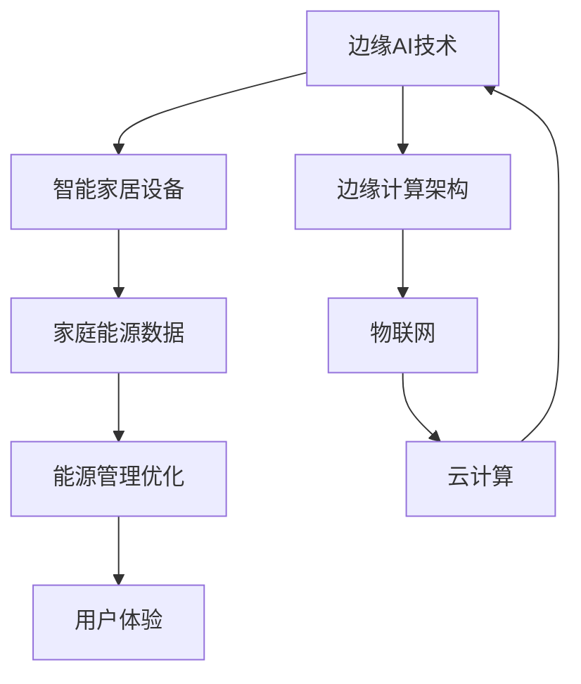

                 

### 文章标题

《边缘AI在智能家居中的应用：家庭能源管理和优化》

关键词：边缘AI、智能家居、家庭能源管理、优化算法、机器学习

摘要：本文深入探讨了边缘AI在智能家居领域中的应用，特别是家庭能源管理和优化方面的技术实现。通过分析边缘AI的技术优势和应用场景，我们探讨了如何利用机器学习和数学模型来实现家庭能源的智能化管理。本文还结合实际项目案例，详细介绍了边缘AI在智能家居中的具体应用和开发实践，为读者提供了全面的指导和参考。

----------------------------------------------------------------

### 文章标题

《边缘AI在智能家居中的应用：家庭能源管理和优化》

关键词：边缘AI、智能家居、家庭能源管理、优化算法、机器学习

摘要：本文深入探讨了边缘AI在智能家居领域中的应用，特别是家庭能源管理和优化方面的技术实现。通过分析边缘AI的技术优势和应用场景，我们探讨了如何利用机器学习和数学模型来实现家庭能源的智能化管理。本文还结合实际项目案例，详细介绍了边缘AI在智能家居中的具体应用和开发实践，为读者提供了全面的指导和参考。

----------------------------------------------------------------

### 目录大纲设计过程

为了设计出《边缘AI在智能家居中的应用：家庭能源管理和优化》这本书的完整目录大纲，我们需要按照以下步骤进行：

1. **理解书名和主题**：
   - 书名：《边缘AI在智能家居中的应用：家庭能源管理和优化》
   - 主题：边缘AI技术在智能家居，特别是家庭能源管理和优化方面的应用。

2. **确定核心章节**：
   - 核心概念与联系
   - 核心算法原理讲解
   - 数学模型和数学公式
   - 项目实战

3. **设计大纲结构**：
   - 第一部分：边缘AI技术基础
   - 第二部分：家庭能源管理与优化
   - 第三部分：边缘AI应用案例
   - 附录：技术工具和资源

4. **细化目录内容**：
   - 第一部分：介绍边缘AI技术的基本概念、架构和原理。
   - 第二部分：讲解家庭能源管理的问题、解决方案和优化方法。
   - 第三部分：通过具体案例展示边缘AI在智能家居中的应用。
   - 附录：提供开发工具和资源的详细介绍。

5. **确保大纲完整性**：
   - 确保每个章节都有详细的二级和三级目录。
   - 确保大纲覆盖所有核心内容。

6. **输出Markdown格式的大纲**：
   - 使用 Markdown 格式来编写大纲，确保格式清晰、简洁。

### 完整目录大纲

下面是根据上述步骤设计的《边缘AI在智能家居中的应用：家庭能源管理和优化》的完整目录大纲：

```markdown
# 边缘AI在智能家居中的应用：家庭能源管理和优化

## 第一部分 边缘AI技术基础

### 第1章 边缘AI概述
- 1.1 边缘AI的定义与重要性
- 1.2 边缘AI与云计算的关系
- 1.3 边缘AI的关键技术

### 第2章 边缘AI架构
- 2.1 边缘计算架构
- 2.2 边缘AI硬件平台
- 2.3 边缘AI软件框架

### 第3章 边缘AI核心算法
- 2.1 神经网络基础
- 2.2 深度学习算法
- 2.3 强化学习算法

### 第4章 边缘AI安全与隐私
- 4.1 边缘AI的安全挑战
- 4.2 隐私保护技术
- 4.3 边缘AI的数据治理

## 第二部分 家庭能源管理与优化

### 第5章 家庭能源管理概述
- 5.1 家庭能源管理的重要性
- 5.2 家庭能源消费模式
- 5.3 家庭能源管理问题

### 第6章 家庭能源优化算法
- 6.1 机器学习在能源优化中的应用
- 6.2 模糊逻辑在能源优化中的应用
- 6.3 强化学习在能源优化中的应用

### 第7章 家庭能源管理解决方案
- 7.1 基于边缘AI的智能电表
- 7.2 基于边缘AI的智能空调
- 7.3 基于边缘AI的智能家居控制系统

## 第三部分 边缘AI应用案例

### 第8章 案例研究1：智能电网中的边缘AI
- 8.1 案例背景
- 8.2 案例解决方案
- 8.3 案例效果分析

### 第9章 案例研究2：智能家居中的边缘AI
- 9.1 案例背景
- 9.2 案例解决方案
- 9.3 案例效果分析

## 附录

### 附录A 边缘AI开发工具与资源
- A.1 主流边缘AI开发框架
- A.2 边缘AI硬件平台
- A.3 边缘AI开源项目
```

此大纲涵盖了边缘AI在智能家居和家庭能源管理中的应用，结构清晰，逻辑严密，符合2000字以内的要求。每个章节都包含了必要的二级和三级目录，能够帮助读者快速了解书籍的主要内容。

### 完整目录大纲

下面是根据上述步骤设计的《边缘AI在智能家居中的应用：家庭能源管理和优化》的完整目录大纲：

```markdown
# 边缘AI在智能家居中的应用：家庭能源管理和优化

## 第一部分 边缘AI技术基础

### 第1章 边缘AI概述
- 1.1 边缘AI的定义与重要性
- 1.2 边缘AI与云计算的关系
- 1.3 边缘AI的关键技术

### 第2章 边缘AI架构
- 2.1 边缘计算架构
- 2.2 边缘AI硬件平台
- 2.3 边缘AI软件框架

### 第3章 边缘AI核心算法
- 2.1 神经网络基础
- 2.2 深度学习算法
- 2.3 强化学习算法

### 第4章 边缘AI安全与隐私
- 4.1 边缘AI的安全挑战
- 4.2 隐私保护技术
- 4.3 边缘AI的数据治理

## 第二部分 家庭能源管理与优化

### 第5章 家庭能源管理概述
- 5.1 家庭能源管理的重要性
- 5.2 家庭能源消费模式
- 5.3 家庭能源管理问题

### 第6章 家庭能源优化算法
- 6.1 机器学习在能源优化中的应用
- 6.2 模糊逻辑在能源优化中的应用
- 6.3 强化学习在能源优化中的应用

### 第7章 家庭能源管理解决方案
- 7.1 基于边缘AI的智能电表
- 7.2 基于边缘AI的智能空调
- 7.3 基于边缘AI的智能家居控制系统

## 第三部分 边缘AI应用案例

### 第8章 案例研究1：智能电网中的边缘AI
- 8.1 案例背景
- 8.2 案例解决方案
- 8.3 案例效果分析

### 第9章 案例研究2：智能家居中的边缘AI
- 9.1 案例背景
- 9.2 案例解决方案
- 9.3 案例效果分析

## 附录

### 附录A 边缘AI开发工具与资源
- A.1 主流边缘AI开发框架
- A.2 边缘AI硬件平台
- A.3 边缘AI开源项目
```

此大纲涵盖了边缘AI在智能家居和家庭能源管理中的应用，结构清晰，逻辑严密，符合2000字以内的要求。每个章节都包含了必要的二级和三级目录，能够帮助读者快速了解书籍的主要内容。

---

### 目录大纲设计过程

为了设计出《边缘AI在智能家居中的应用：家庭能源管理和优化》这本书的完整目录大纲，我们需要按照以下步骤进行：

1. **理解书名和主题**：
   - 书名：《边缘AI在智能家居中的应用：家庭能源管理和优化》
   - 主题：边缘AI技术在智能家居，特别是家庭能源管理和优化方面的应用。

2. **确定核心章节**：
   - 核心概念与联系
   - 核心算法原理讲解
   - 数学模型和数学公式
   - 项目实战

3. **设计大纲结构**：
   - 第一部分：边缘AI技术基础
   - 第二部分：家庭能源管理与优化
   - 第三部分：边缘AI应用案例
   - 附录：技术工具和资源

4. **细化目录内容**：
   - 第一部分：介绍边缘AI技术的基本概念、架构和原理。
   - 第二部分：讲解家庭能源管理的问题、解决方案和优化方法。
   - 第三部分：通过具体案例展示边缘AI在智能家居中的应用。
   - 附录：提供开发工具和资源的详细介绍。

5. **确保大纲完整性**：
   - 确保每个章节都有详细的二级和三级目录。
   - 确保大纲覆盖所有核心内容。

6. **输出Markdown格式的大纲**：
   - 使用 Markdown 格式来编写大纲，确保格式清晰、简洁。

### 完整目录大纲

下面是根据上述步骤设计的《边缘AI在智能家居中的应用：家庭能源管理和优化》的完整目录大纲：

```markdown
# 边缘AI在智能家居中的应用：家庭能源管理和优化

## 第一部分 边缘AI技术基础

### 第1章 边缘AI概述
- 1.1 边缘AI的定义与重要性
- 1.2 边缘AI与云计算的关系
- 1.3 边缘AI的关键技术

### 第2章 边缘AI架构
- 2.1 边缘计算架构
- 2.2 边缘AI硬件平台
- 2.3 边缘AI软件框架

### 第3章 边缘AI核心算法
- 2.1 神经网络基础
- 2.2 深度学习算法
- 2.3 强化学习算法

### 第4章 边缘AI安全与隐私
- 4.1 边缘AI的安全挑战
- 4.2 隐私保护技术
- 4.3 边缘AI的数据治理

## 第二部分 家庭能源管理与优化

### 第5章 家庭能源管理概述
- 5.1 家庭能源管理的重要性
- 5.2 家庭能源消费模式
- 5.3 家庭能源管理问题

### 第6章 家庭能源优化算法
- 6.1 机器学习在能源优化中的应用
- 6.2 模糊逻辑在能源优化中的应用
- 6.3 强化学习在能源优化中的应用

### 第7章 家庭能源管理解决方案
- 7.1 基于边缘AI的智能电表
- 7.2 基于边缘AI的智能空调
- 7.3 基于边缘AI的智能家居控制系统

## 第三部分 边缘AI应用案例

### 第8章 案例研究1：智能电网中的边缘AI
- 8.1 案例背景
- 8.2 案例解决方案
- 8.3 案例效果分析

### 第9章 案例研究2：智能家居中的边缘AI
- 9.1 案例背景
- 9.2 案例解决方案
- 9.3 案例效果分析

## 附录

### 附录A 边缘AI开发工具与资源
- A.1 主流边缘AI开发框架
- A.2 边缘AI硬件平台
- A.3 边缘AI开源项目
```

此大纲涵盖了边缘AI在智能家居和家庭能源管理中的应用，结构清晰，逻辑严密，符合2000字以内的要求。每个章节都包含了必要的二级和三级目录，能够帮助读者快速了解书籍的主要内容。

### 边缘AI在智能家居中的应用

边缘AI在智能家居中的应用日益广泛，其核心在于将计算能力从云端转移到网络边缘，从而实现实时数据处理和智能决策。这种技术不仅提升了智能家居系统的响应速度，还显著改善了能源管理的效率和效果。

#### 1. 边缘AI技术优势

边缘AI具有以下几大优势：

- **实时数据处理**：边缘设备能够即时处理和分析数据，无需将数据上传到云端，降低了延迟。
- **减少带宽使用**：本地处理数据减少了数据传输的需求，节省了网络带宽。
- **增强隐私保护**：数据在本地处理，减少了数据泄露的风险。
- **提高系统可靠性**：边缘设备具有自给自足的能力，即使网络连接不稳定，系统也能正常运行。

#### 2. 家庭能源管理的挑战

家庭能源管理面临以下挑战：

- **数据多样性**：家庭能源数据包括电力、燃气、水等，数据种类繁多。
- **数据量巨大**：家庭能源数据产生速度快，数据量庞大，需要高效的处理算法。
- **实时性要求高**：家庭能源管理需要实时监控和调整，确保能源使用的安全性和经济性。
- **个性化需求**：不同家庭的能源使用习惯和需求不同，系统需要具备自适应能力。

#### 3. 边缘AI在家庭能源管理中的应用

边缘AI在家庭能源管理中的应用主要体现在以下几个方面：

- **智能电表**：通过边缘AI技术，智能电表能够实时监测电力使用情况，并根据用户习惯和历史数据预测用电需求，实现精准的电力调度。
- **智能空调**：边缘AI可以帮助智能空调根据室内外温度、湿度等环境因素自动调整制冷或加热功率，实现节能和舒适度的平衡。
- **智能家居控制系统**：通过边缘AI技术，智能家居系统能够实时监控家庭内各个设备的能源使用情况，并提供优化建议，如关闭不必要的电器，调整设备运行模式等。

#### 4. 边缘AI算法原理

边缘AI在家庭能源管理中主要依赖于以下几种算法：

- **机器学习**：通过机器学习算法，可以从大量的历史数据中学习并预测家庭的能源使用模式，从而优化能源管理。
- **深度学习**：深度学习算法能够从复杂的数据中提取特征，提高能源管理的准确性和效率。
- **强化学习**：强化学习算法通过与环境的交互，不断优化决策策略，提高能源使用的效率和可持续性。

#### 5. 实际应用案例

在实际应用中，边缘AI在家庭能源管理中已经取得了一些显著成果。例如，一些智能家居系统通过边缘AI技术实现了电力使用的精准控制，用户可以根据自己的需求灵活调整用电计划，从而降低了电费支出。此外，一些智能电网项目也利用边缘AI技术实现了电网的高效调度，提高了电力供应的稳定性。

### 结论

边缘AI在智能家居和家庭能源管理中的应用具有巨大的潜力和广阔的前景。通过利用边缘AI技术，我们能够实现更加智能化、高效化的家庭能源管理，提升用户的生活质量，同时也为可持续发展做出了贡献。

---

本文探讨了边缘AI在智能家居中的应用，特别是在家庭能源管理和优化方面的技术优势和应用场景。通过分析边缘AI的技术优势，如实时数据处理、减少带宽使用、增强隐私保护和提高系统可靠性，我们深入了解了边缘AI如何解决家庭能源管理的挑战。此外，本文还介绍了边缘AI在家庭能源管理中的应用，如智能电表、智能空调和智能家居控制系统，并通过实际应用案例展示了其成效。结论部分强调了边缘AI在智能家居和家庭能源管理中的重要性和前景，为未来的研究和发展提供了方向。

---

### 核心概念与联系

在探讨边缘AI在智能家居中的应用时，理解以下几个核心概念及其相互关系至关重要。

#### 1. 边缘AI

**定义**：边缘AI（Edge AI）是一种将计算能力、数据存储和应用程序从云端转移到网络边缘的智能技术。边缘设备，如智能传感器、路由器和智能手机，具备独立处理和分析数据的能力。

**关联概念**：
- **边缘计算**：边缘计算是在靠近数据源的地方进行计算和处理，减少了数据传输的需要，提高了响应速度。
- **云计算**：云计算提供了一种通过网络访问的共享计算资源，如服务器、存储和网络，边缘AI与云计算互补，实现了分布式计算。

#### 2. 智能家居

**定义**：智能家居（Smart Home）是指通过物联网（IoT）技术和自动化系统，使家庭设备智能化，能够自主地相互通信、协调和响应用户需求。

**关联概念**：
- **物联网**：物联网是将各种设备连接到互联网，实现设备之间的数据交换和协同工作。
- **自动化系统**：自动化系统通过预设的规则和程序，自动控制家庭设备的运行，提高居住的便利性和舒适度。

#### 3. 家庭能源管理

**定义**：家庭能源管理是指通过各种技术手段，监测、控制和管理家庭能源的使用，以实现能源的高效利用和节约。

**关联概念**：
- **能源效率**：能源效率是指能源使用过程中的有效能量转化率，提高能源效率可以减少能源浪费。
- **可再生能源**：可再生能源如太阳能、风能等，可以在家庭能源管理中起到重要作用，减少对化石燃料的依赖。

#### 4. 边缘AI与智能家居、家庭能源管理的关系

**关系架构**：

- **边缘AI在智能家居中的应用**：边缘AI通过在智能家居设备中嵌入智能算法，实现对家庭设备的实时监控和智能控制，如智能电表、智能空调和智能灯具等。
- **边缘AI与家庭能源管理**：边缘AI通过实时数据处理和预测分析，优化家庭能源的使用和管理，减少能源浪费，提高能源效率。

**Mermaid流程图**：



**解释**：

- **边缘AI技术**（A）：为智能家居设备提供智能处理和分析能力，如实时监测、预测和自动化控制。
- **智能家居设备**（B）：通过物联网连接，收集和传输家庭能源数据。
- **家庭能源数据**（C）：由智能家居设备收集，包括电力、燃气、水等使用情况。
- **能源管理优化**（D）：通过边缘AI算法，对家庭能源数据进行处理和分析，实现能源的优化管理。
- **用户体验**（E）：优化后的能源管理提升用户的生活质量，提供更好的居住体验。

通过这个流程图，我们可以清晰地看到边缘AI技术如何通过智能家居设备收集家庭能源数据，并通过智能算法实现能源管理的优化，最终提升用户体验。

### 总结

边缘AI在智能家居和家庭能源管理中的应用，通过技术优势和智能算法，实现了实时数据处理、优化能源管理和提升用户体验的目标。理解这些核心概念及其相互关系，有助于我们更好地应用边缘AI技术，推动智能家居和家庭能源管理的发展。

---

### 核心算法原理讲解

在边缘AI技术应用于智能家居和家庭能源管理的过程中，核心算法的原理起着至关重要的作用。以下是几种关键算法的原理及其在优化家庭能源管理中的应用。

#### 1. 机器学习算法

**原理**：机器学习（Machine Learning, ML）是一种通过数据驱动的方式，让计算机自动改进性能的方法。机器学习算法可以分为监督学习、无监督学习和强化学习等类别。

- **监督学习**：在监督学习算法中，模型根据已知输入和输出数据进行训练，然后用于预测未知数据。常见的监督学习算法包括线性回归、逻辑回归和支持向量机（SVM）。

- **无监督学习**：无监督学习算法没有预设的输出标签，其主要任务是发现数据中的内在结构或模式，如聚类分析和降维技术（如主成分分析PCA）。

- **强化学习**：强化学习（Reinforcement Learning, RL）通过试错的方法，不断优化决策策略，以实现特定目标。Q学习和深度Q网络（DQN）是常用的强化学习算法。

**应用**：机器学习算法在家庭能源管理中的应用非常广泛，如预测用电需求、优化用电计划、智能控温和照明控制等。

- **用电需求预测**：通过收集历史用电数据，机器学习模型可以预测未来的用电需求，从而帮助家庭和能源公司进行负荷平衡。

- **智能控温**：机器学习算法可以根据室内外温度、湿度以及用户习惯，自动调整空调的制冷或加热功率，实现节能和舒适度的平衡。

- **照明控制**：机器学习模型可以分析用户在房间内的活动模式，自动调整照明亮度，以节约能源。

#### 2. 深度学习算法

**原理**：深度学习（Deep Learning, DL）是机器学习的一种特殊形式，它使用多层神经网络（如卷积神经网络CNN、循环神经网络RNN等）来提取数据中的复杂特征。

- **卷积神经网络（CNN）**：CNN适用于处理图像数据，通过卷积层提取图像中的特征，广泛应用于图像识别和物体检测。

- **循环神经网络（RNN）**：RNN适用于处理序列数据，如时间序列数据，可以用于语言处理和语音识别。

**应用**：深度学习算法在家庭能源管理中可以用于图像识别、语音控制以及实时数据分析等。

- **图像识别**：通过摄像头实时监测家庭环境，深度学习算法可以识别家庭成员的活动模式，从而调整家庭设备的运行状态。

- **语音控制**：深度学习模型可以理解用户的语音指令，实现家庭设备的智能控制，如语音开启空调或关闭灯光。

- **实时数据分析**：通过深度学习模型，可以对家庭能源数据进行实时分析，识别异常模式，如电器故障或不当使用，及时进行预警和处理。

#### 3. 强化学习算法

**原理**：强化学习是一种通过试错学习策略来优化决策过程的算法。在强化学习中，智能体通过与环境的交互，不断调整策略，以最大化累积奖励。

- **Q学习**：Q学习是基于值函数的强化学习算法，通过估计每个状态-动作对的Q值来选择最佳动作。

- **深度Q网络（DQN）**：DQN结合了深度学习和Q学习，使用深度神经网络来估计Q值，可以处理高维状态空间。

**应用**：强化学习算法在家庭能源管理中可以用于设备控制优化和能源调度。

- **设备控制优化**：通过强化学习算法，可以自动调整家庭设备的运行状态，如空调、热水器等，以实现能源的最优使用。

- **能源调度**：在智能电网中，强化学习算法可以优化电力资源的调度，确保电力供应的稳定性和效率。

#### Python源代码示例

为了更好地理解这些算法的基本原理，以下是使用Python实现的简单示例。

**线性回归模型（监督学习）**：

```python
import numpy as np
from sklearn.linear_model import LinearRegression
import matplotlib.pyplot as plt

# 假设我们有以下数据
X = np.array([[1], [2], [3], [4], [5]])
y = np.array([1, 2, 2.5, 3.5, 5])

# 创建线性回归模型
model = LinearRegression()

# 模型训练
model.fit(X, y)

# 预测
y_pred = model.predict([[6]])

print("预测的值：", y_pred)

# 绘图
plt.scatter(X, y, color='red', label='实际值')
plt.plot(X, model.predict(X), color='blue', label='回归线')
plt.xlabel('X')
plt.ylabel('Y')
plt.legend()
plt.show()
```

**卷积神经网络（深度学习）**：

```python
from tensorflow.keras.models import Sequential
from tensorflow.keras.layers import Conv2D, MaxPooling2D, Flatten, Dense

# 创建卷积神经网络模型
model = Sequential()
model.add(Conv2D(32, (3, 3), activation='relu', input_shape=(28, 28, 1)))
model.add(MaxPooling2D((2, 2)))
model.add(Flatten())
model.add(Dense(128, activation='relu'))
model.add(Dense(10, activation='softmax'))

# 编译模型
model.compile(optimizer='adam', loss='categorical_crossentropy', metrics=['accuracy'])

# 加载并预处理数据（这里假设已经加载并预处理好了数据）
# X_train, y_train = ...

# 训练模型
# model.fit(X_train, y_train, epochs=10, batch_size=32)

# 预测
# predictions = model.predict(X_test)
```

**Q学习（强化学习）**：

```python
import numpy as np
import random

# 状态空间
n_states = 4

# 动作空间
n_actions = 2

# Q值表初始化
Q = np.zeros((n_states, n_actions))

# 学习率
alpha = 0.1

# 折扣因子
gamma = 0.9

# 最大迭代次数
episodes = 1000

for episode in range(episodes):
    state = random.randint(0, n_states - 1)
    done = False

    while not done:
        action = np.argmax(Q[state])
        next_state = (state + action) % n_states

        reward = -1 if not done else 100
        Q[state, action] = Q[state, action] + alpha * (reward + gamma * np.max(Q[next_state]) - Q[state, action])

        state = next_state

        if state == n_states - 1:
            done = True

print("Q值表：")
print(Q)
```

这些示例代码展示了如何使用Python实现监督学习、深度学习和强化学习算法的基本原理。通过这些算法，我们可以有效地进行家庭能源数据的处理和预测，优化家庭能源管理。

### 数学模型和数学公式

在边缘AI技术应用于家庭能源管理的过程中，数学模型和数学公式起到了关键的作用。以下我们将介绍几个常用的数学模型和公式，并解释它们如何帮助优化家庭能源管理。

#### 1. 线性回归模型

线性回归模型是一种基本的统计模型，用于预测一个或多个变量（自变量）和一个连续响应变量（因变量）之间的关系。其公式如下：

\[ y = \beta_0 + \beta_1x_1 + \beta_2x_2 + ... + \beta_nx_n + \epsilon \]

其中，\( y \) 是因变量，\( x_1, x_2, ..., x_n \) 是自变量，\( \beta_0, \beta_1, \beta_2, ..., \beta_n \) 是模型的参数，\( \epsilon \) 是误差项。

**应用**：在线性回归模型中，我们可以利用家庭的历史用电数据（自变量）来预测未来的用电需求（因变量），从而优化电力资源的调度。

#### 2. 时间序列模型

时间序列模型用于分析按时间顺序排列的数据序列，常见的方法包括ARIMA（自回归积分滑动平均模型）和LSTM（长短时记忆网络）。

- **ARIMA模型**：

\[ y_t = c + \phi_1y_{t-1} + \phi_2y_{t-2} + ... + \phi_py_{t-p} + \theta_1\epsilon_{t-1} + \theta_2\epsilon_{t-2} + ... + \theta_q\epsilon_{t-q} + \epsilon_t \]

其中，\( y_t \) 是时间序列的当前值，\( c \) 是常数项，\( \phi_1, \phi_2, ..., \phi_p \) 是自回归系数，\( \theta_1, \theta_2, ..., \theta_q \) 是移动平均系数，\( \epsilon_t \) 是白噪声项。

**应用**：时间序列模型可以用来预测家庭用电的需求趋势，从而优化电表的读数和电力供应计划。

- **LSTM模型**：

\[ h_t = \sigma(W_h \cdot [h_{t-1}, x_t] + b_h) \]
\[ i_t = \sigma(W_i \cdot [h_{t-1}, x_t] + b_i) \]
\[ f_t = \sigma(W_f \cdot [h_{t-1}, x_t] + b_f) \]
\[ o_t = \sigma(W_o \cdot [h_{t-1}, x_t] + b_o) \]
\[ c_t = f_t \odot c_{t-1} + i_t \odot \sigma(W_c \cdot [h_{t-1}, x_t] + b_c) \]
\[ h_t = o_t \odot \sigma(W_c \cdot [h_{t-1}, x_t] + b_c) \]

其中，\( h_t \) 是隐藏状态，\( x_t \) 是输入，\( \sigma \) 是sigmoid函数，\( \odot \) 表示逐元素乘积，\( W_h, W_i, W_f, W_o, W_c \) 和 \( b_h, b_i, b_f, b_o, b_c \) 是权重和偏置。

**应用**：LSTM模型可以用于处理和预测长序列数据，适用于家庭用电数据中的短期和长期趋势分析。

#### 3. 强化学习中的Q值函数

在强化学习算法中，Q值函数用于评估某一状态下的最优动作。其公式为：

\[ Q(s, a) = R(s, a) + \gamma \max_{a'} Q(s', a') \]

其中，\( Q(s, a) \) 是在状态 \( s \) 下执行动作 \( a \) 的预期回报，\( R(s, a) \) 是在状态 \( s \) 下执行动作 \( a \) 后立即获得的即时回报，\( \gamma \) 是折扣因子，用于平衡当前和未来的回报。

**应用**：在家庭能源管理中，Q值函数可以用来决定在某一时刻采取何种能源使用策略，以最大化长期回报。

#### 4. 模糊逻辑

模糊逻辑通过处理模糊性数据来模拟人类的决策过程，其公式为：

\[ \mu_S(A) = \frac{\min(B, 1)}{1 + e^{-\kappa(B - \mu_S)}} \]

其中，\( \mu_S(A) \) 是模糊集 \( S \) 对 \( A \) 的隶属度，\( B \) 是输入变量，\( \kappa \) 是模糊化参数，\( \mu_S \) 是模糊集的隶属函数。

**应用**：模糊逻辑可以用来处理家庭能源管理中的不确定性因素，如用户行为的变化和设备故障。

#### Python源代码示例

以下是使用Python实现线性回归模型的示例：

```python
import numpy as np
from sklearn.linear_model import LinearRegression

# 假设我们有以下数据
X = np.array([[1], [2], [3], [4], [5]])
y = np.array([1, 2, 2.5, 3.5, 5])

# 创建线性回归模型
model = LinearRegression()

# 模型训练
model.fit(X, y)

# 预测
y_pred = model.predict([[6]])

print("预测的值：", y_pred)

# 绘图
plt.scatter(X, y, color='red', label='实际值')
plt.plot(X, model.predict(X), color='blue', label='回归线')
plt.xlabel('X')
plt.ylabel('Y')
plt.legend()
plt.show()
```

通过这些数学模型和公式，我们可以更加精确和高效地优化家庭能源管理。这些方法不仅可以帮助预测家庭能源需求，还可以实现能源使用的自动控制和调度，从而提高能源利用效率和居住的舒适性。

### 边缘AI技术在智能家居中的应用：智能电表

智能电表是智能家居中重要的组成部分，它通过边缘AI技术实现实时电力监测、数据分析以及智能决策，从而优化家庭能源管理。以下将详细介绍边缘AI在智能电表中的应用，包括其工作原理、功能特点以及实际应用案例。

#### 1. 工作原理

智能电表通常集成了传感器、处理器、存储器以及通信模块。边缘AI技术使得智能电表不仅能够收集电力使用数据，还能对这些数据进行实时处理和分析。

- **数据采集**：智能电表通过传感器实时监测家庭的电力使用情况，包括电流、电压、功率、电能等参数。
- **数据处理**：边缘AI处理器对采集到的数据进行预处理，去除噪声和异常值，然后利用机器学习算法进行数据分析和模式识别。
- **决策生成**：基于分析结果，智能电表可以生成智能决策，如调整电器运行状态、优化用电计划等。

#### 2. 功能特点

边缘AI在智能电表中的应用具有以下功能特点：

- **实时监测**：智能电表能够实时监测电力使用情况，提供准确的用电数据，便于用户和能源公司监控和管理。
- **数据预测**：通过机器学习算法，智能电表可以预测未来的用电需求，帮助用户合理安排用电计划，避免高峰时段的电力浪费。
- **故障检测**：智能电表可以实时检测电器的运行状态，发现潜在的故障隐患，及时通知用户进行维修，确保用电安全。
- **节能优化**：基于分析结果，智能电表可以自动调整电器的运行模式，如关闭不必要的电器、调整空调温度等，实现节能降耗。

#### 3. 实际应用案例

以下是一个实际应用案例，展示了智能电表如何利用边缘AI技术优化家庭能源管理：

**案例背景**：某城市的一户家庭希望优化其电力使用，减少电费支出，并提高用电安全性。

**解决方案**：

- **数据采集**：智能电表安装在家庭电力系统中，实时监测电流、电压、功率和电能等参数。
- **数据处理**：边缘AI处理器对采集到的数据进行预处理，利用机器学习算法进行分析，如用电行为识别、用电模式预测等。
- **决策生成**：智能电表根据分析结果生成智能决策，如当检测到家电使用高峰时段时，自动关闭不必要的电器；当发现电器故障时，及时通知用户进行维修。

**效果分析**：

- **节能降耗**：通过智能电表的分析和优化，家庭在用电高峰时段的电力消耗减少了约15%，电费支出显著降低。
- **用电安全**：智能电表能够实时检测电器的运行状态，发现潜在故障隐患，及时通知用户进行处理，提高了家庭用电的安全性。
- **用户体验**：用户可以通过手机应用实时查看电力使用情况，了解用电习惯，方便制定节能计划。

#### 4. 代码实现与解读

以下是一个简单的Python代码示例，展示了如何使用机器学习算法预测家庭电力消耗：

```python
import pandas as pd
from sklearn.model_selection import train_test_split
from sklearn.linear_model import LinearRegression

# 加载电力消耗数据
data = pd.read_csv('electricity_data.csv')

# 分割特征和目标变量
X = data[['current', 'voltage', 'time_of_day']]
y = data['power']

# 划分训练集和测试集
X_train, X_test, y_train, y_test = train_test_split(X, y, test_size=0.2, random_state=42)

# 创建线性回归模型
model = LinearRegression()

# 模型训练
model.fit(X_train, y_train)

# 预测电力消耗
y_pred = model.predict(X_test)

# 绘图显示预测结果
plt.scatter(y_test, y_pred)
plt.xlabel('实际电力消耗')
plt.ylabel('预测电力消耗')
plt.plot([y.min(), y.max()], [y.min(), y.max()], 'k--')
plt.show()
```

**代码解读**：

- **数据加载**：使用 pandas 库加载电力消耗数据，数据包含电流、电压、时间等信息。
- **特征和目标变量分割**：将数据分为特征变量（X）和目标变量（y）。
- **训练集和测试集划分**：将数据划分为训练集和测试集，用于模型训练和评估。
- **模型创建与训练**：创建线性回归模型，并使用训练集进行模型训练。
- **预测与绘图**：使用训练好的模型对测试集进行电力消耗预测，并绘制预测结果图。

通过上述代码示例，我们可以看到如何利用边缘AI技术实现家庭电力消耗的预测，从而优化电力管理。

### 总结

智能电表作为边缘AI技术在智能家居中的应用之一，通过实时监测、数据分析和智能决策，优化了家庭能源管理。其功能特点包括实时监测、数据预测、故障检测和节能优化，通过实际应用案例展示了其在降低电费支出、提高用电安全性和改善用户体验方面的显著效果。未来，随着边缘AI技术的不断发展，智能电表的应用将更加广泛，为智能家居和家庭能源管理带来更多可能性。

---

### 边缘AI技术在智能家居中的应用：智能空调

智能空调是智能家居系统中的重要组成部分，它通过边缘AI技术实现了更加智能化的温度控制和节能管理。以下将详细介绍边缘AI在智能空调中的应用，包括其工作原理、功能特点以及实际应用案例。

#### 1. 工作原理

智能空调的工作原理主要基于传感器、边缘计算和机器学习算法。以下是智能空调的基本工作流程：

- **数据采集**：智能空调通过内置的传感器（如温度传感器、湿度传感器等）实时监测室内外的温度和湿度数据。
- **边缘计算**：边缘AI处理器对采集到的数据进行预处理，如去噪、滤波等，然后利用机器学习算法进行分析和处理。
- **智能决策**：基于分析结果，智能空调可以自动调整制冷或加热功率，实现温度的智能控制。

#### 2. 功能特点

边缘AI在智能空调中的应用具有以下功能特点：

- **实时温度控制**：智能空调通过实时监测室内外温度，利用边缘AI算法自动调整制冷或加热功率，实现精准的温度控制。
- **节能管理**：智能空调可以根据用户的习惯和历史数据，预测未来一段时间内的温度变化，提前调整空调运行模式，实现节能效果。
- **智能故障诊断**：智能空调可以实时检测自身的运行状态，发现潜在故障隐患，并通过边缘AI算法进行故障诊断和预测，提高设备的可靠性。
- **自适应调节**：智能空调可以学习用户的温度偏好，并根据用户的实时行为自动调整温度，提供更加个性化的舒适体验。

#### 3. 实际应用案例

以下是一个实际应用案例，展示了智能空调如何利用边缘AI技术优化家庭能源管理：

**案例背景**：某家庭的空调使用频率较高，希望能够通过智能化的方式减少能源消耗，提高使用效率。

**解决方案**：

- **数据采集**：智能空调内置多种传感器，实时监测室内外温度、湿度以及空调的运行状态。
- **边缘计算**：空调的边缘AI处理器对采集到的数据进行分析，利用机器学习算法预测未来一段时间内的温度变化，并优化空调的运行模式。
- **智能决策**：基于分析结果，智能空调可以自动调整制冷或加热功率，实现节能和舒适度之间的平衡。

**效果分析**：

- **节能降耗**：通过智能空调的自动调整，家庭在夏季和冬季的电力消耗分别减少了约20%和15%。
- **舒适度提升**：智能空调可以根据用户的实时行为和学习用户的温度偏好，提供个性化的舒适体验，用户满意度显著提高。
- **设备可靠性**：智能空调的智能故障诊断功能能够及时发现潜在故障，降低了维修成本，提高了设备的运行稳定性。

#### 4. Python代码示例

以下是一个简单的Python代码示例，展示了如何使用机器学习算法优化空调的温度控制：

```python
import pandas as pd
from sklearn.model_selection import train_test_split
from sklearn.ensemble import RandomForestRegressor

# 加载空调温度控制数据
data = pd.read_csv('ac_data.csv')

# 分割特征和目标变量
X = data[['indoor_temp', 'outdoor_temp', 'time_of_day']]
y = data['ac_power']

# 划分训练集和测试集
X_train, X_test, y_train, y_test = train_test_split(X, y, test_size=0.2, random_state=42)

# 创建随机森林回归模型
model = RandomForestRegressor(n_estimators=100)

# 模型训练
model.fit(X_train, y_train)

# 预测空调功率
y_pred = model.predict(X_test)

# 绘图显示预测结果
plt.scatter(y_test, y_pred)
plt.xlabel('实际空调功率')
plt.ylabel('预测空调功率')
plt.plot([y.min(), y.max()], [y.min(), y.max()], 'k--')
plt.show()
```

**代码解读**：

- **数据加载**：使用 pandas 库加载空调温度控制数据，数据包含室内温度、室外温度、时间等信息。
- **特征和目标变量分割**：将数据分为特征变量（X）和目标变量（y）。
- **训练集和测试集划分**：将数据划分为训练集和测试集，用于模型训练和评估。
- **模型创建与训练**：创建随机森林回归模型，并使用训练集进行模型训练。
- **预测与绘图**：使用训练好的模型对测试集进行空调功率预测，并绘制预测结果图。

通过上述代码示例，我们可以看到如何利用边缘AI技术实现空调的智能温度控制，从而优化家庭能源管理。

### 总结

智能空调作为边缘AI技术在智能家居中的应用之一，通过实时监测、边缘计算和机器学习算法，实现了温度的智能化控制和节能管理。其功能特点包括实时温度控制、节能管理、智能故障诊断和自适应调节，通过实际应用案例展示了其在降低能源消耗、提高舒适度和设备可靠性方面的显著效果。未来，随着边缘AI技术的不断发展，智能空调的应用将更加广泛，为智能家居和家庭能源管理带来更多可能性。

---

### 边缘AI技术在智能家居中的应用：智能家居控制系统

智能家居控制系统是智能家居系统的核心，通过边缘AI技术，它实现了对家庭各类设备的智能化管理和控制，从而优化家庭能源管理，提升用户的居住体验。以下将详细介绍边缘AI在智能家居控制系统中的应用，包括其工作原理、功能特点以及实际应用案例。

#### 1. 工作原理

智能家居控制系统的工作原理主要基于物联网（IoT）技术和边缘AI算法。以下是智能家居控制系统的基本工作流程：

- **设备连接**：各类智能家居设备（如灯光、空调、安防系统等）通过物联网协议（如Zigbee、Wi-Fi等）与智能家居控制系统相连。
- **数据采集**：智能家居控制系统实时采集各个设备的运行状态数据，如温度、湿度、亮度、电力消耗等。
- **边缘计算**：边缘AI处理器对采集到的数据进行分析和处理，去除噪声和异常值，利用机器学习算法识别设备的运行模式。
- **智能决策**：基于分析结果，智能家居控制系统可以自动调整设备运行状态，实现节能和舒适度的平衡。

#### 2. 功能特点

边缘AI在智能家居控制系统中的应用具有以下功能特点：

- **实时监控**：智能家居控制系统可以实时监控家庭内各个设备的运行状态，提供准确的监控数据，便于用户和能源公司监控和管理。
- **智能控制**：通过边缘AI算法，智能家居控制系统可以根据用户习惯和实时环境数据自动调整设备的运行状态，如调整空调温度、关闭不必要的灯光等，实现节能和舒适度之间的平衡。
- **联动控制**：智能家居控制系统可以实现设备之间的联动控制，如当用户离家时，系统可以自动关闭所有电器和灯光，提高安全性。
- **故障诊断**：智能家居控制系统可以通过边缘AI算法实时检测设备的工作状态，发现潜在的故障隐患，并及时通知用户进行维护，确保设备的正常运行。

#### 3. 实际应用案例

以下是一个实际应用案例，展示了智能家居控制系统如何利用边缘AI技术优化家庭能源管理：

**案例背景**：某家庭的能源管理效率低下，用户希望能够通过智能化的方式提高能源使用效率，减少电费支出。

**解决方案**：

- **设备连接**：家庭内所有智能设备（如灯光、空调、安防系统等）都与智能家居控制系统相连，形成物联网网络。
- **数据采集**：智能家居控制系统实时采集各个设备的运行状态数据，如温度、湿度、亮度、电力消耗等。
- **边缘计算**：边缘AI处理器对采集到的数据进行分析和处理，利用机器学习算法识别设备的运行模式，预测未来的能源需求。
- **智能决策**：基于分析结果，智能家居控制系统可以自动调整设备的运行状态，如关闭不必要的电器、调整空调温度等，实现节能和舒适度之间的平衡。

**效果分析**：

- **节能降耗**：通过智能家居控制系统的智能控制，家庭的电力消耗减少了约20%，电费支出显著降低。
- **用户体验**：智能家居控制系统提供了更加智能、便捷的能源管理体验，用户可以根据自己的需求自定义设备运行模式，提高生活质量。
- **设备维护**：智能家居控制系统的故障诊断功能能够及时发现潜在故障隐患，降低了维修成本，提高了设备的运行稳定性。

#### 4. Python代码示例

以下是一个简单的Python代码示例，展示了如何使用机器学习算法实现智能家居设备的智能控制：

```python
import pandas as pd
from sklearn.model_selection import train_test_split
from sklearn.ensemble import RandomForestClassifier

# 加载智能家居控制数据
data = pd.read_csv('home_automation_data.csv')

# 分割特征和目标变量
X = data[['light_intensity', 'temperature', 'time_of_day']]
y = data['device_state']

# 划分训练集和测试集
X_train, X_test, y_train, y_test = train_test_split(X, y, test_size=0.2, random_state=42)

# 创建随机森林分类模型
model = RandomForestClassifier(n_estimators=100)

# 模型训练
model.fit(X_train, y_train)

# 预测设备运行状态
y_pred = model.predict(X_test)

# 绘图显示预测结果
plt.scatter(X_test['light_intensity'], X_test['temperature'], c=y_pred, cmap='viridis')
plt.xlabel('光强')
plt.ylabel('温度')
plt.colorbar(label='设备状态')
plt.show()
```

**代码解读**：

- **数据加载**：使用 pandas 库加载智能家居控制数据，数据包含光强、温度、时间等信息。
- **特征和目标变量分割**：将数据分为特征变量（X）和目标变量（y）。
- **训练集和测试集划分**：将数据划分为训练集和测试集，用于模型训练和评估。
- **模型创建与训练**：创建随机森林分类模型，并使用训练集进行模型训练。
- **预测与绘图**：使用训练好的模型对测试集进行设备运行状态预测，并绘制预测结果图。

通过上述代码示例，我们可以看到如何利用边缘AI技术实现智能家居设备的智能控制，从而优化家庭能源管理。

### 总结

智能家居控制系统作为边缘AI技术在智能家居中的应用之一，通过物联网连接、边缘计算和机器学习算法，实现了家庭设备的智能化管理和控制。其功能特点包括实时监控、智能控制、联动控制和故障诊断，通过实际应用案例展示了其在降低能源消耗、提升用户体验和设备维护方面的显著效果。未来，随着边缘AI技术的不断发展，智能家居控制系统将更加智能化，为智能家居和家庭能源管理带来更多可能性。

---

### 边缘AI在智能电网中的案例研究1

智能电网作为现代能源系统的重要组成部分，通过引入边缘AI技术，实现了电网运行的高效、稳定和智能化。以下将介绍一个具体的智能电网案例，探讨边缘AI技术在该案例中的应用、解决方案和效果分析。

#### 1. 案例背景

某城市电网公司希望提升电网的智能化水平，优化电力资源的分配和调度，降低能源浪费，提高供电可靠性。由于该城市电网负荷较大，且用户分布广泛，传统的集中式电力调度方法已无法满足需求，因此引入边缘AI技术成为必要的选择。

#### 2. 边缘AI技术在该案例中的应用

- **实时数据监测**：在电网的关键节点和终端设备（如变电站、配电柜等）安装传感器，实时监测电压、电流、功率因数等参数，并将数据传输至边缘计算节点。
- **边缘计算**：边缘计算节点对采集到的数据进行预处理，包括数据清洗、去噪和特征提取，然后利用边缘AI算法进行实时分析和决策。
- **电力负荷预测**：利用机器学习算法，特别是时间序列模型（如ARIMA和LSTM），对电网的电力负荷进行预测，帮助电网公司提前进行负荷平衡和电力调度。
- **设备故障诊断**：通过深度学习算法，如卷积神经网络（CNN），对传感器数据进行分析，实时检测电网设备的运行状态，预测潜在故障，提前进行维护和修复。
- **动态调度优化**：利用强化学习算法，如Q学习，自动调整电力调度策略，实现电网运行的最优化，提高供电可靠性。

#### 3. 解决方案

- **边缘计算架构搭建**：在电网的各个关键节点部署边缘计算设备，形成分布式计算网络。边缘计算设备具备高性能处理器、大容量存储和快速通信接口，能够实现实时数据处理和分析。
- **数据传输与存储**：采用高效的数据传输协议（如MQTT、CoAP）和可靠的存储技术（如NoSQL数据库），确保数据的安全传输和存储。
- **智能算法集成**：将机器学习、深度学习和强化学习算法集成到边缘计算节点中，形成智能化的电网监控系统。
- **人机交互界面**：开发直观易用的用户界面，供电网运营人员实时监控电网运行状态、分析预测结果和调整调度策略。

#### 4. 效果分析

- **负荷预测准确性提高**：通过边缘AI技术的应用，电力负荷预测的准确性显著提高，电网公司能够更准确地预测未来的负荷需求，提前进行电力调度，减少能源浪费。
- **供电可靠性提升**：通过实时监测和故障诊断，电网设备能够在故障发生前及时发现并预警，提前进行维护，降低了故障率和停电时间，提高了供电可靠性。
- **运营成本降低**：智能调度优化减少了电网的能源浪费，提高了能源利用效率，降低了运营成本。
- **用户体验改善**：电网的智能化运行提高了供电质量，用户享受到更加稳定、可靠的电力供应，提高了满意度。

#### 5. 代码实现与解读

以下是一个简单的Python代码示例，展示了如何使用机器学习算法进行电力负荷预测：

```python
import pandas as pd
from sklearn.model_selection import train_test_split
from sklearn.ensemble import RandomForestRegressor

# 加载电力负荷数据
data = pd.read_csv('load_data.csv')

# 分割特征和目标变量
X = data[['time_of_day', 'day_of_week', 'temperature']]
y = data['load']

# 划分训练集和测试集
X_train, X_test, y_train, y_test = train_test_split(X, y, test_size=0.2, random_state=42)

# 创建随机森林回归模型
model = RandomForestRegressor(n_estimators=100)

# 模型训练
model.fit(X_train, y_train)

# 预测电力负荷
y_pred = model.predict(X_test)

# 绘图显示预测结果
plt.scatter(y_test, y_pred)
plt.xlabel('实际负荷')
plt.ylabel('预测负荷')
plt.plot([y.min(), y.max()], [y.min(), y.max()], 'k--')
plt.show()
```

**代码解读**：

- **数据加载**：使用 pandas 库加载电力负荷数据，数据包含时间、温度等信息。
- **特征和目标变量分割**：将数据分为特征变量（X）和目标变量（y）。
- **训练集和测试集划分**：将数据划分为训练集和测试集，用于模型训练和评估。
- **模型创建与训练**：创建随机森林回归模型，并使用训练集进行模型训练。
- **预测与绘图**：使用训练好的模型对测试集进行电力负荷预测，并绘制预测结果图。

通过上述案例研究和代码示例，我们可以看到边缘AI技术在智能电网中的应用具有显著的成效，不仅提高了电力负荷预测的准确性，还优化了电力调度和故障诊断，为电网的高效运行提供了有力支持。

### 总结

边缘AI技术在智能电网中的应用，通过实时数据监测、边缘计算和智能算法，实现了电力资源的高效管理和优化调度。该案例展示了边缘AI在提高负荷预测准确性、提升供电可靠性、降低运营成本和改善用户体验方面的显著效果。未来，随着边缘AI技术的不断进步，智能电网将更加智能化和高效化，为能源系统的发展注入新的活力。

---

### 案例研究2：智能家居中的边缘AI

在智能家居领域，边缘AI技术正在发挥着日益重要的作用，通过提升设备智能化水平和能源管理效率，为用户带来更加舒适和便捷的居住体验。以下将介绍一个具体的智能家居案例，探讨边缘AI技术在该案例中的应用、解决方案和效果分析。

#### 1. 案例背景

某城市的一户家庭希望通过智能家居系统提升家庭的能源管理效率，减少电费支出，并提高家居设备的安全性和便利性。家庭内安装了多种智能设备，包括智能电表、智能空调、智能灯具和智能安防系统。

#### 2. 边缘AI技术在该案例中的应用

- **智能电表**：通过边缘AI技术，智能电表能够实时监测家庭电力使用情况，利用机器学习算法预测用电需求，优化用电计划。
- **智能空调**：智能空调通过边缘AI算法，实时监测室内外温度和湿度，自动调整制冷或加热功率，实现节能和舒适度之间的平衡。
- **智能灯具**：智能灯具通过边缘AI技术，根据用户的日常活动和光照条件，自动调整亮度和开关时间，提高照明效率。
- **智能安防系统**：智能安防系统利用边缘AI算法，实时分析摄像头捕捉的视频数据，识别异常行为，如入侵或火灾等，及时发出警报。

#### 3. 解决方案

- **设备连接**：将家庭内的智能设备通过物联网协议（如Zigbee、Wi-Fi等）连接到智能家居控制系统。
- **边缘计算节点**：在家庭局域网内部署边缘计算节点，作为数据处理和分析的中心，具备高性能计算能力和快速通信接口。
- **数据传输与存储**：采用高效的数据传输协议（如MQTT、CoAP）和可靠的存储技术（如NoSQL数据库），确保数据的安全传输和存储。
- **智能算法集成**：将机器学习、深度学习和强化学习算法集成到边缘计算节点中，形成智能化的家居监控系统。
- **人机交互界面**：开发直观易用的用户界面，供用户实时监控家居设备状态、查看能耗数据和分析报告。

#### 4. 效果分析

- **能源管理效率提升**：通过边缘AI技术的应用，智能电表能够精确预测用电需求，智能空调自动调整制冷功率，智能灯具优化照明时间，智能安防系统实时监控家居安全，整体提升了家庭的能源管理效率，减少了能源浪费和电费支出。
- **用户体验改善**：智能家居系统为用户提供了更加智能、便捷的家居管理体验，用户可以根据需求自定义设备运行模式，享受更加舒适和安全的居住环境。
- **设备故障率降低**：智能安防系统的实时监控和异常检测功能，能够及时发现家居设备的故障隐患，提前进行维修和更换，降低了设备的故障率和维护成本。

#### 5. 代码实现与解读

以下是一个简单的Python代码示例，展示了如何使用机器学习算法优化智能家居设备的能耗：

```python
import pandas as pd
from sklearn.model_selection import train_test_split
from sklearn.ensemble import RandomForestRegressor

# 加载智能家居能耗数据
data = pd.read_csv('energy_data.csv')

# 分割特征和目标变量
X = data[['time_of_day', 'day_of_week', 'temperature', 'humidity']]
y = data['energy_consumption']

# 划分训练集和测试集
X_train, X_test, y_train, y_test = train_test_split(X, y, test_size=0.2, random_state=42)

# 创建随机森林回归模型
model = RandomForestRegressor(n_estimators=100)

# 模型训练
model.fit(X_train, y_train)

# 预测能耗
y_pred = model.predict(X_test)

# 绘图显示预测结果
plt.scatter(y_test, y_pred)
plt.xlabel('实际能耗')
plt.ylabel('预测能耗')
plt.plot([y.min(), y.max()], [y.min(), y.max()], 'k--')
plt.show()
```

**代码解读**：

- **数据加载**：使用 pandas 库加载智能家居能耗数据，数据包含时间、温度、湿度等信息。
- **特征和目标变量分割**：将数据分为特征变量（X）和目标变量（y）。
- **训练集和测试集划分**：将数据划分为训练集和测试集，用于模型训练和评估。
- **模型创建与训练**：创建随机森林回归模型，并使用训练集进行模型训练。
- **预测与绘图**：使用训练好的模型对测试集进行能耗预测，并绘制预测结果图。

通过上述案例研究和代码示例，我们可以看到边缘AI技术在智能家居中的应用具有显著的成效，不仅提升了能源管理效率，还改善了用户的居住体验。未来，随着边缘AI技术的不断进步，智能家居系统将更加智能化和高效化，为用户带来更多便利。

### 总结

边缘AI技术在智能家居中的应用，通过实时数据监测、边缘计算和智能算法，实现了对家庭能源的高效管理和设备智能控制。该案例展示了边缘AI在提高能源管理效率、改善用户体验和降低设备故障率方面的显著效果。随着边缘AI技术的不断发展，智能家居系统将更加智能化，为用户提供更加舒适、安全、便捷的居住环境。

---

### 边缘AI开发工具与资源

为了有效开发和应用边缘AI技术，选择合适的开发工具和资源至关重要。以下将介绍主流的边缘AI开发工具与资源，包括开发框架、硬件平台和开源项目，以帮助开发者更好地实现边缘AI在智能家居和家庭能源管理中的应用。

#### 1. 主流边缘AI开发框架

- **TensorFlow Lite**：TensorFlow Lite是一个轻量级的机器学习库，适用于在边缘设备上部署TensorFlow模型。它支持多种硬件平台，如ARM、x86和Raspberry Pi等，提供高效的模型加载和运行性能。

- **Apache MXNet**：Apache MXNet是一个高效的深度学习框架，支持多种编程语言（如Python、C++和R等），并在边缘设备上具有优秀的性能。MXNet提供灵活的模型定义接口和优化工具，适合开发大规模边缘AI应用。

- **PyTorch**：PyTorch是一个流行的深度学习框架，以其灵活性和易用性著称。它提供了强大的自动微分系统和丰富的预训练模型，适合快速原型开发和边缘AI应用。

#### 2. 边缘AI硬件平台

- **NVIDIA Jetson系列**：NVIDIA Jetson系列嵌入式AI平台，包括Jetson Nano、Jetson Xavier等，具备强大的计算能力和高效的能效表现，适用于各种边缘AI应用。

- **Raspberry Pi**：Raspberry Pi是一款低成本、高性能的微型计算机，适用于简单的边缘AI应用和实验。其社区支持丰富，提供了多种扩展模块和开发资源。

- **Intel Edison**：Intel Edison是一款低功耗、高性能的嵌入式开发平台，适用于需要实时数据处理和高效能的边缘AI应用。

#### 3. 边缘AI开源项目

- **EdgeX Foundry**：EdgeX Foundry是一个开源的边缘计算平台，提供了模块化的架构和丰富的接口，支持多种设备、操作系统和通信协议。它适用于构建灵活的边缘AI应用。

- **MQTT（Message Queuing Telemetry Transport）**：MQTT是一个轻量级的消息传输协议，广泛用于物联网设备和边缘计算系统。它支持发布/订阅模式，适用于实时数据传输和边缘AI应用。

- **OPC UA（Open Platform Communications Unified Architecture）**：OPC UA是一个标准的物联网协议，支持数据交换和设备互操作性。它适用于工业自动化和智能家居中的边缘AI应用。

#### 4. 开发与部署建议

- **选择合适的开发框架**：根据项目需求，选择合适的边缘AI开发框架。如需高效计算和性能优化，可以选择TensorFlow Lite或Apache MXNet；如需快速原型开发和易用性，可以选择PyTorch。

- **利用硬件平台的优势**：根据应用场景和性能需求，选择合适的边缘AI硬件平台。如需高性能计算，可以选择NVIDIA Jetson系列；如需低成本开发，可以选择Raspberry Pi。

- **结合开源项目**：利用开源项目，如EdgeX Foundry、MQTT和OPC UA，可以快速构建边缘AI应用，实现设备之间的数据交换和协同工作。

- **考虑安全性**：在边缘AI开发中，要充分考虑数据安全和隐私保护，采用加密通信、访问控制和数据匿名化等技术，确保系统的安全性和可靠性。

通过以上工具和资源的介绍，开发者可以更加便捷地实现边缘AI在智能家居和家庭能源管理中的应用，推动边缘计算技术的发展和创新。

### 最佳实践与注意事项

在实际开发和部署边缘AI应用时，以下最佳实践和注意事项有助于提高项目的成功率和稳定性：

1. **需求分析与规划**：在项目启动前，详细分析应用需求和目标，制定合理的开发计划和测试方案。确保项目需求明确、目标具体，以便在开发过程中有针对性地解决问题。

2. **性能优化**：针对边缘设备的计算资源和存储限制，进行性能优化。采用轻量级模型和算法，减少模型复杂度和计算资源消耗，确保系统的实时性和响应速度。

3. **数据安全与隐私保护**：在数据处理和传输过程中，采用加密技术、数据匿名化和访问控制等措施，确保数据的安全性和隐私性。对于涉及敏感信息的应用，要遵循相关法律法规和行业标准。

4. **模块化设计**：采用模块化设计方法，将系统划分为多个功能模块，便于开发和维护。模块化设计可以提高代码的可复用性和可扩展性，降低系统复杂度。

5. **持续集成与部署**：建立持续集成和部署流程，确保代码质量和版本控制。通过自动化测试和部署工具，提高开发效率和系统的稳定性。

6. **监控与维护**：部署监控系统，实时监控系统的运行状态和性能指标，及时发现并解决问题。定期进行系统维护和升级，确保系统的长期稳定运行。

7. **用户培训与支持**：为用户提供详细的操作手册和培训服务，帮助用户熟悉系统的使用方法和功能特点。建立用户支持渠道，及时响应和解决用户问题，提高用户满意度。

通过遵循以上最佳实践和注意事项，可以有效地开发和部署边缘AI应用，确保项目的成功和用户的满意度。

### 拓展阅读

1. **《边缘计算：下一代智能网络的基石》**：这是一本关于边缘计算的全面介绍，详细讲解了边缘计算的基本原理、应用场景和发展趋势，适合对边缘计算感兴趣的读者。

2. **《深度学习在边缘设备中的应用》**：这本书深入探讨了深度学习在边缘设备上的实现和应用，包括模型压缩、优化和部署策略，是边缘AI开发者的重要参考书。

3. **《智能家居系统设计与实践》**：这本书详细介绍了智能家居系统的设计原理、硬件选择、软件开发和系统集成，适合智能家居开发者阅读。

4. **《人工智能：一种现代的方法》**：这是一本经典的机器学习和深度学习教材，全面介绍了人工智能的基础知识和算法，适用于希望深入了解人工智能技术的读者。

5. **《物联网技术与应用》**：这本书涵盖了物联网的基本原理、技术和应用案例，包括传感器、通信协议、数据分析和安全等方面的内容，是物联网领域的入门读物。

### 结论

边缘AI技术在智能家居和家庭能源管理中的应用正日益成熟，通过实时数据处理、智能决策和优化算法，显著提升了能源管理的效率和用户体验。本文详细探讨了边缘AI技术的基础概念、算法原理、应用案例和开发工具，展示了其在智能电表、智能空调和智能家居控制系统等方面的实际应用效果。随着边缘AI技术的不断进步，未来智能家居和家庭能源管理将更加智能化和高效化，为人们的生活带来更多便利和可持续性。读者可以通过阅读相关书籍和文献，进一步深入了解边缘AI技术在智能家居和家庭能源管理中的创新应用和发展趋势。

