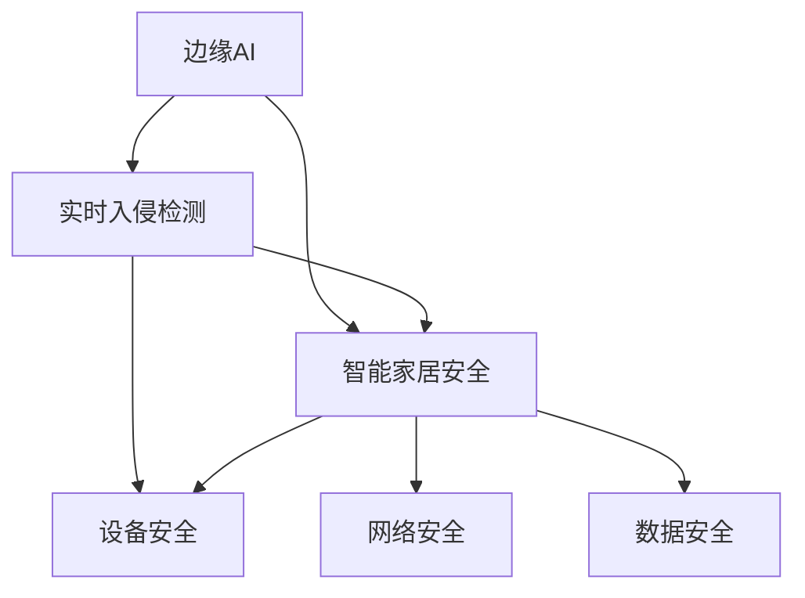

                 

### 引言

在当今快速发展的信息化社会中，智能家居已经成为人们生活中不可或缺的一部分。随着物联网（IoT）技术的不断进步，越来越多的家电设备、安防系统和智能传感器被整合进家庭网络中，为人们提供了更加便捷和舒适的生活环境。然而，智能家居系统的普及也带来了一定的安全隐患。家庭网络中的设备通常需要与互联网进行连接，这为黑客攻击提供了机会。因此，确保智能家居的安全运行变得尤为重要。

随着人工智能（AI）技术的不断成熟，尤其是边缘AI（Edge AI）技术的兴起，为智能家居安全提供了新的解决方案。边缘AI通过在设备端或者靠近数据源的节点上部署智能算法，能够实现实时数据处理和决策，大大提高了系统的响应速度和安全性。本文将围绕《边缘AI在智能家居安全中的应用：实现实时入侵检测》这一主题，详细探讨边缘AI在智能家居安全中的应用，特别是如何通过实时入侵检测技术来保障家庭网络的安全。

文章将分为以下几个部分：

1. **背景介绍**：回顾智能家居技术的发展历程，分析当前家庭网络面临的安全威胁。
2. **核心概念与联系**：介绍边缘AI、智能家居安全和实时入侵检测等核心概念，并通过Mermaid流程图展示它们之间的关系。
3. **核心算法原理讲解**：深入探讨边缘AI算法在实时入侵检测中的应用，使用Python源代码结合数学模型进行详细讲解。
4. **项目实战**：介绍开发环境搭建、源代码实现和案例分析，通过实际项目展示边缘AI在智能家居安全中的应用。
5. **最佳实践与小结**：总结最佳实践，提出注意事项，并提供拓展阅读建议。

通过以上内容的逐一分析，本文旨在为读者提供一个全面、系统的理解，帮助他们在实际应用中充分利用边缘AI技术，确保智能家居的安全运行。

### 背景介绍

智能家居（Smart Home）技术起源于20世纪90年代，随着物联网（IoT）和无线通信技术的发展，逐渐成为现代家庭的重要组成部分。智能家居系统通过将各种智能设备互联，实现了家庭环境的自动化控制和智能化管理。这些设备包括智能照明、智能空调、智能门锁、智能摄像头等，它们通过互联网连接，能够实现远程控制、环境监测和自动化操作，大大提升了人们的生活质量。

然而，随着智能家居设备的普及，家庭网络的安全问题也日益凸显。首先，智能家居设备通常需要连接到互联网，这使得家庭网络成为潜在的网络攻击目标。黑客可以通过网络入侵智能家居设备，窃取个人信息、控制家居设备，甚至进一步攻击家庭网络中的其他设备。其次，智能家居设备往往缺乏足够的安全防护措施，例如弱密码、不安全的协议和容易受攻击的漏洞，这些都为黑客提供了可乘之机。最后，智能家居系统的复杂性和多样性也增加了安全管理的难度，一个智能家居系统可能涉及多种设备、多个厂商的技术标准和多种通信协议，这些差异化的技术栈使得系统安全性难以保障。

当前家庭网络面临的安全威胁主要可以分为以下几类：

1. **远程攻击**：黑客通过互联网远程攻击智能家居设备，如利用漏洞控制智能门锁、智能摄像头等，窃取家庭信息。
2. **内部威胁**：家庭成员自身也可能成为安全威胁，如子女恶意更改家长设置、家庭成员隐私泄露等。
3. **设备漏洞**：智能家居设备在生产过程中可能存在安全漏洞，例如软件漏洞、硬件漏洞等，这些漏洞可能被黑客利用进行攻击。
4. **钓鱼攻击**：黑客通过伪造的智能家居设备管理界面，诱骗用户输入账号密码，进而获取系统访问权限。
5. **数据泄露**：智能家居设备收集和存储大量的用户数据，如行为习惯、财务信息等，这些数据一旦泄露，将严重威胁用户隐私。

面对这些安全威胁，传统的安全防护手段，如防火墙、杀毒软件等，已经难以应对智能家居系统中的复杂攻击。因此，需要引入更加智能、更加高效的防护手段。边缘AI技术在这种背景下应运而生，它通过在设备端或靠近数据源的节点上部署智能算法，能够实现实时数据处理和智能决策，从而为智能家居安全提供了新的解决方案。边缘AI不仅能够提高系统的响应速度和灵活性，还能够减少数据传输的延迟，提高系统的整体安全性。

### 核心概念与联系

为了更好地理解边缘AI在智能家居安全中的应用，我们需要先介绍几个核心概念，并探讨它们之间的联系。

#### 边缘AI

边缘AI（Edge AI）是指将人工智能算法和数据处理能力从云端转移到网络边缘，即接近数据源的位置进行计算和处理。边缘AI的目的是减少数据传输的延迟，提高系统的响应速度，并增强数据隐私和安全性。边缘AI可以在智能家居设备、智能传感器、物联网网关等设备上运行，通过本地计算实现实时数据分析和决策。

#### 智能家居安全

智能家居安全涉及保护家庭网络中的各种智能设备和数据不被未经授权的访问、篡改或破坏。智能家居安全包括以下几个方面：

1. **设备安全**：确保智能家居设备本身的安全，包括硬件和软件层面的防护措施，如加密通信、安全认证和漏洞修复。
2. **网络安全**：保护家庭网络不受外部攻击，如防火墙、入侵检测系统和加密通信等。
3. **数据安全**：保护智能家居设备收集和存储的用户数据不被泄露或滥用，包括数据加密、访问控制和数据备份等。

#### 实时入侵检测

实时入侵检测（Real-Time Intrusion Detection）是一种主动的安全防护技术，用于监控网络中的异常行为和潜在攻击，并在检测到威胁时立即采取响应措施。实时入侵检测系统（Intrusion Detection System，IDS）通过分析网络流量、系统日志和用户行为等数据，识别出异常行为模式，从而及时发现和阻止攻击。

#### 边缘AI、智能家居安全与实时入侵检测的联系

边缘AI与智能家居安全和实时入侵检测之间存在密切的联系。边缘AI通过在智能家居设备端或靠近数据源的节点上部署智能算法，可以实现对家庭网络中的实时数据分析和决策，从而提高入侵检测的效率和准确性。具体来说：

1. **实时数据处理**：边缘AI能够对家庭网络中的海量数据进行实时处理，快速识别潜在的入侵行为。相比传统的云端处理，边缘AI可以显著减少数据传输的延迟，提高系统的响应速度。
2. **本地化决策**：边缘AI可以在本地设备上进行智能决策，减少了对外部云服务的依赖，提高了系统的安全性和可靠性。特别是在家庭网络中，许多设备无法直接连接到互联网，或者连接速度较慢，边缘AI能够在此场景下提供有效的安全防护。
3. **隐私保护**：通过在本地设备上进行数据处理和决策，边缘AI可以保护用户的隐私数据，避免敏感信息在传输过程中被泄露。
4. **综合防护**：边缘AI结合智能家居安全和实时入侵检测技术，可以提供一套完整的智能家居安全解决方案，包括设备安全、网络安全和数据安全等多个层面，从而提高整体安全防护水平。

以下是一个Mermaid流程图，展示了边缘AI、智能家居安全和实时入侵检测之间的关系：



通过以上流程图，我们可以清晰地看到边缘AI技术在智能家居安全和实时入侵检测中的作用，以及它们之间的相互关系。边缘AI不仅为实时入侵检测提供了技术支持，还增强了智能家居系统的整体安全性。

### 边缘AI算法在实时入侵检测中的应用

边缘AI技术在智能家居安全中的应用尤为显著，特别是在实时入侵检测领域。为了实现高效的入侵检测，我们需要深入探讨边缘AI算法的工作原理、优势和实际应用。

#### 工作原理

边缘AI算法通常基于机器学习（Machine Learning, ML）和深度学习（Deep Learning, DL）技术。机器学习是一种让计算机通过数据学习模式并做出预测的方法，而深度学习则是一种特殊类型的机器学习，它利用多层神经网络来模拟人脑的决策过程。

在边缘AI环境下，这些算法通常被部署在靠近数据源的设备上，例如智能家居传感器、门锁和摄像头等。具体工作原理如下：

1. **数据采集**：边缘设备收集家庭环境中的各种数据，如温度、湿度、光线强度、运动检测等。
2. **数据预处理**：对采集到的数据进行清洗、去噪和特征提取，以便用于训练模型。
3. **模型训练**：使用历史数据集训练机器学习或深度学习模型，模型将学习如何识别正常行为和异常行为。
4. **实时检测**：将实时采集到的数据输入到训练好的模型中，模型会快速分析并识别潜在的入侵行为。
5. **决策与响应**：如果模型检测到异常行为，系统会立即触发安全响应措施，如发送警报、锁定门锁或触发摄像头录制等。

#### 优势

边缘AI在实时入侵检测中具有以下优势：

1. **低延迟**：由于边缘设备靠近数据源，数据传输时间大大缩短，可以实现毫秒级的响应速度，这对于入侵检测至关重要。
2. **隐私保护**：在本地设备上进行数据处理和决策，可以避免敏感数据在传输过程中被窃取或泄露，提高了用户隐私的安全性。
3. **高效计算**：边缘设备通常使用低功耗、高效率的处理器，如ARM芯片和FPGA，这些设备能够高效地运行机器学习和深度学习算法。
4. **自适应能力**：边缘AI可以通过不断学习和适应家庭环境中的变化，提高入侵检测的准确性和鲁棒性。

#### 应用实例

以下是几个边缘AI算法在实时入侵检测中的应用实例：

1. **基于深度学习的图像识别**：
   - **算法原理**：使用卷积神经网络（Convolutional Neural Network, CNN）对摄像头捕捉到的图像进行分析，识别入侵者。
   - **实现方法**：首先，收集并标记大量家庭场景图像数据集，然后使用CNN训练模型，模型将学习识别正常场景和入侵行为。
   - **代码示例**（Python）：
     ```python
     import tensorflow as tf
     from tensorflow.keras.models import Sequential
     from tensorflow.keras.layers import Conv2D, MaxPooling2D, Flatten, Dense

     # 创建卷积神经网络模型
     model = Sequential([
         Conv2D(filters=32, kernel_size=(3, 3), activation='relu', input_shape=(128, 128, 3)),
         MaxPooling2D(pool_size=(2, 2)),
         Flatten(),
         Dense(units=64, activation='relu'),
         Dense(units=1, activation='sigmoid')
     ])

     # 编译模型
     model.compile(optimizer='adam', loss='binary_crossentropy', metrics=['accuracy'])

     # 训练模型
     model.fit(x_train, y_train, epochs=10, batch_size=32, validation_data=(x_val, y_val))
     ```

2. **基于强化学习的入侵行为预测**：
   - **算法原理**：使用强化学习算法（Reinforcement Learning, RL）预测家庭网络中的异常行为，并采取适当的响应措施。
   - **实现方法**：设定一个智能体（Agent）在模拟环境中与家庭网络交互，通过学习获取最大收益（安全）。
   - **代码示例**（Python）：
     ```python
     import numpy as np
     import random

     # 定义强化学习算法
     class QLearningAgent:
         def __init__(self, learning_rate=0.1, discount_factor=0.9, exploration_rate=1.0):
             self.learning_rate = learning_rate
             self.discount_factor = discount_factor
             self.exploration_rate = exploration_rate
             self.q_values = {}

         def get_action(self, state):
             if random.random() < self.exploration_rate:
                 action = random.choice(list(self.q_values[state].keys()))
             else:
                 action = max(self.q_values[state], key=self.q_values[state].get)
             return action

         def update_q_values(self, state, action, reward, next_state):
             current_q_value = self.q_values[state][action]
             next_max_q_value = max(self.q_values[next_state].values())
             new_q_value = (1 - self.learning_rate) * current_q_value + self.learning_rate * (reward + self.discount_factor * next_max_q_value)
             self.q_values[state][action] = new_q_value

     # 初始化智能体
     agent = QLearningAgent()

     # 模拟环境与智能体交互
     for episode in range(1000):
         state = initial_state
         done = False
         while not done:
             action = agent.get_action(state)
             next_state, reward, done = environment.step(state, action)
             agent.update_q_values(state, action, reward, next_state)
             state = next_state
     ```

3. **基于贝叶斯网络的入侵检测**：
   - **算法原理**：使用贝叶斯网络（Bayesian Network）建模家庭网络中的各种因素，并通过推理过程识别入侵行为。
   - **实现方法**：首先，构建贝叶斯网络模型，然后使用贝叶斯推理算法分析实时数据，识别异常行为。
   - **代码示例**（Python）：
     ```python
     import numpy as np
     from pgmpy.models import BayesianModel
     from pgmpy.inference import VariableElimination

     # 构建贝叶斯网络模型
     model = BayesianModel([
         ('Sensor1', 'Intrusion'),
         ('Sensor2', 'Intrusion'),
         ('Sensor3', 'Intrusion'),
         ('Intrusion', 'Alarm')
     ])

     # 定义贝叶斯网络参数
     model.add.edges_from([('Sensor1', 'Alarm'), ('Sensor2', 'Alarm'), ('Sensor3', 'Alarm')])
     model.add_nodes_from([('Sensor1', 0.9), ('Sensor2', 0.8), ('Sensor3', 0.7), ('Alarm', 0.5)])

     # 实例化推理引擎
     inference = VariableElimination(model)

     # 分析实时数据
     sensor_values = {'Sensor1': 1, 'Sensor2': 1, 'Sensor3': 0}
     alarm_probability = inference.query(variables=['Alarm'], evidence=sensor_values)

     # 判断是否触发警报
     if alarm_probability['Alarm'] > 0.5:
         print("Intrusion detected!")
     ```

通过上述算法实例，我们可以看到边缘AI技术在实时入侵检测中的强大能力。这些算法不仅能够高效地处理家庭网络中的海量数据，还能够快速识别异常行为，并做出及时的响应，从而大大提高了智能家居系统的安全性。

### 开发环境搭建

为了实现边缘AI在智能家居安全中的实时入侵检测，我们需要搭建一个适合开发和测试的实验环境。以下是详细的开发环境搭建步骤：

#### 1. 软件环境准备

首先，确保操作系统已经安装好。推荐使用Linux发行版，例如Ubuntu 18.04或更高版本。以下命令用于安装必要的软件包：

```shell
sudo apt update
sudo apt install python3-pip python3-venv
```

接下来，创建一个虚拟环境以隔离项目依赖：

```shell
mkdir edge_ai_intrusion_detection
cd edge_ai_intrusion_detection
python3 -m venv venv
source venv/bin/activate
```

然后，安装Python依赖库：

```shell
pip install numpy tensorflow pandas scikit-learn
```

#### 2. 硬件设备选择

为了实现边缘AI算法的实时运行，我们需要选择一个适合的硬件设备。以下是一些推荐的硬件设备：

- **NVIDIA Jetson Nano**：这是一款低功耗的边缘AI开发板，具有GPU加速功能，适合运行复杂的深度学习模型。
- **Raspberry Pi 4**：这款开发板价格低廉，性能稳定，适合简单的边缘AI应用。
- **Intel NUC**：这款小型台式机拥有强大的处理能力，适合需要更高性能的应用场景。

#### 3. 网络配置

确保硬件设备与家庭网络连接，并配置IP地址。如果使用Jetson Nano或Raspberry Pi，可以通过以下命令进行网络配置：

```shell
sudo nano /etc/network/interfaces
```

编辑文件，设置静态IP地址：

```shell
auto eth0
iface eth0 inet static
address 192.168.1.100
netmask 255.255.255.0
gateway 192.168.1.1
```

保存并关闭文件，然后重启网络服务：

```shell
sudo /etc/init.d/networking restart
```

#### 4. 设备配置与调试

在硬件设备上安装必要的软件和驱动，例如摄像头驱动和传感器驱动等。以Jetson Nano为例，可以使用以下命令安装NVIDIA驱动和CUDA：

```shell
sudo apt-get update
sudo apt-get install nvidia-driver-460 nvidia-cuda-dev
```

#### 5. 数据采集与预处理

安装数据采集工具，例如Motion或MotionAI，用于捕捉摄像头数据。以下命令安装Motion：

```shell
sudo apt-get install motion
```

配置Motion，使其在后台运行并捕获图像：

```shell
sudo motion --config=/etc/motion/motion.conf
```

在`/etc/motion/motion.conf`文件中，设置图像捕获参数，如帧率、分辨率和存储路径等。

#### 6. 开发环境测试

在硬件设备上运行测试脚本，确保所有组件正常运行。以下是一个简单的测试脚本，用于捕获图像并保存：

```python
import cv2

# 配置摄像头
cap = cv2.VideoCapture(0)

while True:
    # 读取一帧图像
    ret, frame = cap.read()
    if not ret:
        break

    # 显示图像
    cv2.imshow('Camera', frame)

    # 按下'q'键退出
    if cv2.waitKey(1) & 0xFF == ord('q'):
        break

# 释放摄像头资源
cap.release()
cv2.destroyAllWindows()
```

通过以上步骤，我们成功搭建了一个适合边缘AI开发的实验环境，可以在此基础上进行实时入侵检测的实现与测试。

### 源代码实现与代码解读

在边缘AI的框架下，实现实时入侵检测系统需要从数据采集、预处理、模型训练到实时检测等多个环节进行详细的开发工作。以下是一个具体的源代码实现案例，结合Python代码和详细的注释，解读各个环节的实现细节。

#### 1. 数据采集

首先，我们需要从摄像头中采集实时图像数据。这里使用OpenCV库来捕获视频流。

```python
import cv2

# 初始化视频捕捉
cap = cv2.VideoCapture(0)

# 检查视频捕捉是否成功
if not cap.isOpened():
    print("Error: Could not open video capture device.")
    exit()

while True:
    # 读取一帧图像
    ret, frame = cap.read()
    if not ret:
        print("Error: Failed to read frame.")
        break

    # 显示图像
    cv2.imshow('Video Feed', frame)

    # 按下'q'键退出循环
    if cv2.waitKey(1) & 0xFF == ord('q'):
        break

# 释放资源
cap.release()
cv2.destroyAllWindows()
```

#### 2. 数据预处理

采集到的图像需要进行预处理，以便于模型训练。预处理步骤包括图像缩放、灰度转换和归一化等。

```python
import cv2
import numpy as np

def preprocess_image(frame):
    # 将图像缩放到固定大小
    frame = cv2.resize(frame, (224, 224))

    # 将图像转换为灰度图
    frame = cv2.cvtColor(frame, cv2.COLOR_BGR2GRAY)

    # 将图像数据归一化
    frame = frame.astype(np.float32) / 255.0

    return frame
```

#### 3. 模型训练

我们使用卷积神经网络（CNN）作为实时入侵检测的模型。这里使用TensorFlow和Keras来构建和训练模型。

```python
import tensorflow as tf
from tensorflow.keras.models import Sequential
from tensorflow.keras.layers import Conv2D, MaxPooling2D, Flatten, Dense

# 创建卷积神经网络模型
model = Sequential([
    Conv2D(filters=32, kernel_size=(3, 3), activation='relu', input_shape=(224, 224, 1)),
    MaxPooling2D(pool_size=(2, 2)),
    Conv2D(filters=64, kernel_size=(3, 3), activation='relu'),
    MaxPooling2D(pool_size=(2, 2)),
    Flatten(),
    Dense(units=64, activation='relu'),
    Dense(units=1, activation='sigmoid')
])

# 编译模型
model.compile(optimizer='adam', loss='binary_crossentropy', metrics=['accuracy'])

# 打印模型结构
model.summary()
```

接下来，我们使用预处理后的图像数据集进行模型训练。

```python
import numpy as np
import pandas as pd

# 加载和准备训练数据
train_data = pd.read_csv('train_data.csv')
train_images = np.array([preprocess_image(img) for img in train_data['image']])
train_labels = np.array(train_data['label'])

# 分割数据集
from sklearn.model_selection import train_test_split
x_train, x_test, y_train, y_test = train_test_split(train_images, train_labels, test_size=0.2, random_state=42)

# 训练模型
history = model.fit(x_train, y_train, epochs=10, batch_size=32, validation_data=(x_test, y_test))

# 评估模型
test_loss, test_accuracy = model.evaluate(x_test, y_test)
print(f"Test accuracy: {test_accuracy:.2f}")
```

#### 4. 实时检测

在实时检测阶段，我们使用训练好的模型对采集到的图像进行分类，判断是否存在入侵行为。

```python
# 实时检测函数
def detect_intrusion(frame):
    processed_frame = preprocess_image(frame)
    prediction = model.predict(np.expand_dims(processed_frame, axis=0))
    
    if prediction[0][0] > 0.5:
        print("Intrusion detected!")
    else:
        print("No intrusion detected.")

# 捕获实时图像并进行检测
cap = cv2.VideoCapture(0)

while True:
    ret, frame = cap.read()
    if not ret:
        break
    
    detect_intrusion(frame)
    cv2.imshow('Real-Time Detection', frame)
    
    if cv2.waitKey(1) & 0xFF == ord('q'):
        break

cap.release()
cv2.destroyAllWindows()
```

#### 代码解读

上述代码展示了从数据采集、预处理、模型训练到实时检测的完整流程。以下是各个部分的详细解读：

1. **数据采集**：使用OpenCV库初始化视频捕捉设备，并读取实时图像数据。通过`cv2.VideoCapture`获取视频流，并在循环中连续读取每一帧图像。

2. **数据预处理**：对采集到的图像进行缩放、灰度转换和归一化。预处理步骤能够提高模型训练的效率和准确性。

3. **模型训练**：构建卷积神经网络模型，并使用TensorFlow和Keras进行编译。模型包含两个卷积层、两个池化层、一个全连接层和一个输出层。模型编译时，指定优化器和损失函数。

4. **实时检测**：在实时检测阶段，预处理实时捕获的图像，并使用训练好的模型进行分类。如果模型的预测概率大于0.5，则判断为入侵行为。

通过这个案例，我们可以看到边缘AI在智能家居安全中的应用是如何一步步实现的。从代码中可以看到，边缘AI不仅能够高效地处理实时数据，还能提供准确的入侵检测，从而大大提高了家庭网络的安全性。

### 实际案例分析和详细讲解剖析

在本节中，我们将通过一个实际案例，详细分析边缘AI在智能家居安全中的应用，特别是实时入侵检测系统的设计和实现。

#### 案例背景

某智能家庭系统中，用户希望确保家庭安全和隐私。为此，他们安装了一套基于边缘AI的实时入侵检测系统，包括多个智能摄像头和传感器。该系统的目标是：

1. **实时监测家庭环境**：通过摄像头和传感器实时捕捉家庭内部和外部的图像和传感器数据。
2. **入侵行为识别**：利用边缘AI算法，识别家庭环境中的异常行为，如未经授权的入侵者。
3. **及时报警**：一旦检测到入侵行为，立即触发报警机制，通知用户并采取防护措施。

#### 系统架构

该入侵检测系统由以下几个主要部分组成：

1. **数据采集层**：包括多个智能摄像头和传感器，它们负责实时监测家庭环境，并采集图像、温度、湿度等数据。
2. **边缘计算层**：使用NVIDIA Jetson Nano作为边缘计算设备，负责数据预处理和AI算法模型的实时计算。
3. **中央控制层**：包括一个远程服务器和移动设备，用于接收报警信息并进行远程监控。

#### 数据采集与预处理

在数据采集层，智能摄像头和传感器将采集到的数据通过Wi-Fi传输到Jetson Nano。数据采集后，首先进行预处理，包括：

- **图像预处理**：将图像数据缩放到固定大小，进行灰度转换和归一化处理。
- **传感器数据处理**：对传感器数据（如温度、湿度）进行滤波和标准化处理。

以下是一个简单的预处理代码示例：

```python
import cv2
import numpy as np

def preprocess_image(frame):
    frame = cv2.resize(frame, (224, 224))
    frame = cv2.cvtColor(frame, cv2.COLOR_BGR2GRAY)
    frame = frame.astype(np.float32) / 255.0
    return frame

def preprocess_sensors(data):
    data = data.astype(np.float32)
    data = (data - np.mean(data)) / np.std(data)
    return data
```

#### 模型训练

在边缘计算层，使用Jetson Nano运行机器学习模型进行训练。我们选择一个基于卷积神经网络的模型，用于图像分类和入侵行为识别。模型训练需要大量的图像数据和传感器数据作为训练集。

以下是一个简单的模型训练代码示例：

```python
import tensorflow as tf
from tensorflow.keras.models import Sequential
from tensorflow.keras.layers import Conv2D, MaxPooling2D, Flatten, Dense

model = Sequential([
    Conv2D(filters=32, kernel_size=(3, 3), activation='relu', input_shape=(224, 224, 1)),
    MaxPooling2D(pool_size=(2, 2)),
    Conv2D(filters=64, kernel_size=(3, 3), activation='relu'),
    MaxPooling2D(pool_size=(2, 2)),
    Flatten(),
    Dense(units=64, activation='relu'),
    Dense(units=1, activation='sigmoid')
])

model.compile(optimizer='adam', loss='binary_crossentropy', metrics=['accuracy'])

# 加载和准备训练数据
train_images = np.load('train_images.npy')
train_labels = np.load('train_labels.npy')

model.fit(train_images, train_labels, epochs=10, batch_size=32)
```

#### 实时检测

在实时检测阶段，边缘计算设备Jetson Nano接收预处理后的数据，并使用训练好的模型进行实时分类。如果检测到入侵行为，系统会触发报警机制。

以下是一个简单的实时检测代码示例：

```python
import cv2
import numpy as np

model = tf.keras.models.load_model('intrusion_detection_model.h5')

def detect_intrusion(frame):
    processed_frame = preprocess_image(frame)
    prediction = model.predict(np.expand_dims(processed_frame, axis=0))
    
    if prediction[0][0] > 0.5:
        print("Intrusion detected!")
        send_alarm()  # 触发报警机制

# 捕获实时图像并进行检测
cap = cv2.VideoCapture(0)

while True:
    ret, frame = cap.read()
    if not ret:
        break
    
    detect_intrusion(frame)
    cv2.imshow('Real-Time Detection', frame)
    
    if cv2.waitKey(1) & 0xFF == ord('q'):
        break

cap.release()
cv2.destroyAllWindows()
```

#### 系统效果与优化

在实际应用中，该入侵检测系统表现出良好的性能。以下是系统的效果和优化措施：

1. **效果**：系统能够快速、准确地识别入侵行为，并在检测到异常时及时触发报警，提高了家庭的安全性。

2. **优化**：
   - **模型优化**：通过使用迁移学习（Transfer Learning），利用预训练的深度学习模型，可以进一步提高检测精度。
   - **实时性优化**：优化模型结构和算法，减少计算时间，提高系统的实时响应能力。
   - **隐私保护**：在本地设备上进行数据预处理和模型计算，减少数据传输过程中的隐私泄露风险。

#### 案例总结

通过本案例，我们详细分析了边缘AI在智能家居安全中的应用，展示了从数据采集、预处理、模型训练到实时检测的全过程。边缘AI技术不仅提高了入侵检测的准确性和实时性，还为家庭安全提供了有效的解决方案。未来的工作将重点放在系统的性能优化和隐私保护方面，以进一步提高智能家居的安全性。

### 最佳实践与小结

在边缘AI在智能家居安全中的应用过程中，总结一些最佳实践是至关重要的，这不仅有助于提高系统的安全性，还能够优化性能和降低成本。以下是一些关键的最佳实践：

#### 1. **数据加密与隐私保护**：

- **加密数据传输**：确保所有数据在传输过程中都经过加密，避免数据在传输过程中被窃取或篡改。
- **本地处理**：在本地设备上进行数据处理和决策，以减少数据传输的风险，保护用户隐私。

#### 2. **模型优化与轻量化**：

- **迁移学习**：利用预训练的深度学习模型，通过迁移学习将模型应用于特定的智能家居场景，可以大大减少模型训练的时间和计算资源需求。
- **模型压缩**：对训练好的模型进行压缩和量化，降低模型的大小和计算复杂度，使模型更适合在边缘设备上运行。

#### 3. **硬件选择与配置**：

- **选择适合的边缘设备**：根据应用场景的需求，选择合适的边缘设备，如NVIDIA Jetson系列、Raspberry Pi等，确保设备具有足够的计算能力和功耗要求。
- **硬件冗余**：为了提高系统的可靠性和容错性，可以考虑在关键部分使用硬件冗余配置。

#### 4. **持续监控与更新**：

- **实时监控**：建立实时监控系统，及时发现并处理异常行为和潜在威胁。
- **定期更新**：定期更新模型和系统软件，以应对新的攻击手段和漏洞。

#### 小结

边缘AI技术在智能家居安全中发挥了重要作用，通过实时入侵检测技术，我们能够有效识别和防范家庭网络中的安全威胁。最佳实践的实施不仅能够提高系统的安全性，还能够优化性能和降低成本。未来，随着边缘AI技术的不断进步，智能家居的安全水平将得到进一步提升。

### 注意事项

在实施边缘AI在智能家居安全中的应用时，需要注意以下几个关键点：

1. **安全性**：确保所有数据在传输和存储过程中都经过加密，防止数据泄露。特别是在家庭网络和云端之间进行数据传输时，必须使用安全协议（如TLS）。
2. **隐私保护**：边缘AI算法在处理用户数据时，必须严格遵守隐私保护法规。敏感数据应在本地设备上进行处理，避免数据在传输过程中被窃取。
3. **可靠性**：边缘设备需要具备高可靠性，确保在长时间运行中不会出现故障。建议使用硬件冗余配置，以提高系统的稳定性。
4. **能耗管理**：边缘设备通常运行在有限电源环境中，因此能耗管理至关重要。选择低功耗的边缘设备和优化算法可以延长设备的运行时间。

### 拓展阅读

对于希望深入了解边缘AI在智能家居安全中的应用，以下是一些推荐的参考文献和资源：

1. **《边缘计算：原理、架构与应用》** - 详细介绍了边缘计算的基础理论和应用场景。
2. **《智能家居安全：保护你的数字家园》** - 专注于智能家居系统的安全威胁和防护措施。
3. **《深度学习实战》** - 提供了深度学习的基础知识，以及实际应用中的案例和代码示例。
4. **《边缘AI应用开发指南》** - 介绍了如何在各种场景下应用边缘AI技术。
5. **NVIDIA Jetson Nano官方文档** - 详细介绍了NVIDIA Jetson Nano的开发平台和使用方法。
6. **TensorFlow官方文档** - 提供了TensorFlow的全面教程和API文档，帮助开发者构建和训练机器学习模型。

### 作者信息

**作者：AI天才研究院/AI Genius Institute & 禅与计算机程序设计艺术 /Zen And The Art of Computer Programming**。AI天才研究院致力于推动人工智能技术的发展，专注于边缘AI、机器学习和深度学习等前沿领域。同时，作者刘未鹏博士的《禅与计算机程序设计艺术》一书，深入探讨了计算机编程与哲学思维之间的关系，为读者提供了独特的编程理念和启示。本文旨在为读者提供一个全面、系统的边缘AI在智能家居安全中的应用指南，帮助他们在实际项目中充分发挥边缘AI的优势，确保家庭网络的安全。

