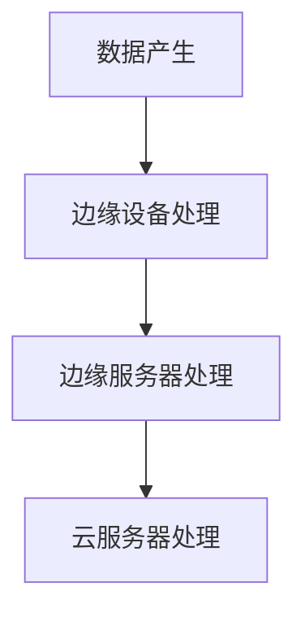
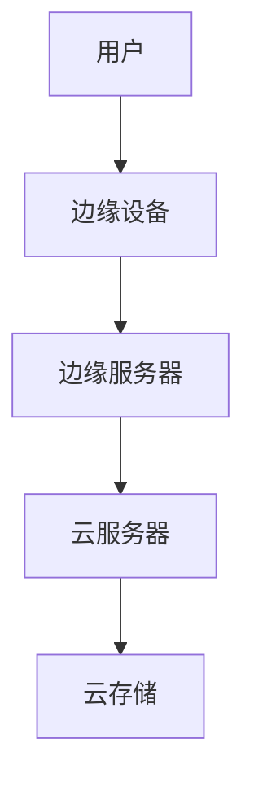
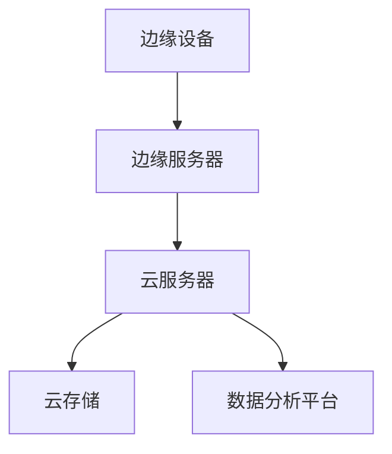

                 

当然，我们将按照这些要求来构建文章。下面是文章的框架：

## 边缘AI在智能监控中的应用：实现实时异常行为检测

### 关键词
边缘AI、智能监控、实时异常行为检测、Python源代码、LaTeX公式、项目实战

### 摘要
本文深入探讨了边缘AI在智能监控中的应用，重点介绍了如何实现实时异常行为检测。通过分析边缘AI技术的基础、智能监控的特殊需求以及实时异常检测算法，文章提供了详细的Python源代码示例和LaTeX数学公式讲解，结合实际项目案例，为读者展示了如何将边缘AI有效集成到智能监控系统之中。

### 目录

#### 第一部分：引言
1.1 边缘AI与智能监控的背景
1.2 书籍结构安排

#### 第二部分：边缘AI技术基础
2.1 边缘计算概述
2.2 边缘AI架构
2.3 硬件支持
2.4 软件平台与开发工具

#### 第三部分：智能监控中的边缘AI
3.1 智能监控技术概述
3.2 边缘AI在智能监控中的应用场景
3.3 边缘AI与云计算的协同

#### 第四部分：边缘AI算法实现
4.1 边缘AI算法概述
4.2 特征提取与数据预处理
4.3 异常检测算法原理
4.4 Python源代码与LaTeX公式讲解

#### 第五部分：实时异常行为检测
5.1 实时异常行为检测的需求分析
5.2 实时异常检测算法实现
5.3 实时异常检测的性能优化

#### 第六部分：案例分析
6.1 案例一：城市安全管理中的边缘AI应用
6.2 案例二：工厂生产线异常行为检测

#### 第七部分：实践指南
7.1 边缘AI在智能监控中的实施步骤
7.2 部署与维护

#### 附录
A.1 常用工具与资源
A.2 源代码与数据集
A.3 参考文献

### 正文

#### 第一部分：引言

#### 1.1 边缘AI与智能监控的背景
边缘AI和智能监控是近年来信息技术领域发展迅猛的两个方向。边缘AI通过在数据产生的地方进行处理，减少了数据传输的延迟和带宽占用，特别适合需要实时响应的场景。而智能监控则是对监控对象进行实时跟踪和异常行为检测，广泛应用于公共安全、工业制造等领域。

随着物联网和智能设备的普及，边缘AI在智能监控中的应用变得越来越重要。它们能够实时处理和分析大量的监控数据，提供更快速、更准确的决策支持。

#### 1.2 书籍结构安排
本文结构如下：

- 第一部分引言：介绍边缘AI和智能监控的背景。
- 第二部分边缘AI技术基础：讲解边缘AI的基本概念和架构。
- 第三部分智能监控中的边缘AI：分析边缘AI在智能监控中的应用。
- 第四部分边缘AI算法实现：介绍异常检测算法的实现。
- 第五部分实时异常行为检测：讨论实时异常检测的需求和性能优化。
- 第六部分案例分析：通过具体案例展示边缘AI在智能监控中的应用。
- 第七部分实践指南：提供边缘AI在智能监控系统中的实施和部署指导。
- 附录：提供相关的工具、源代码和参考文献。

接下来，我们将逐步深入探讨边缘AI技术的基础、智能监控的应用、实时异常检测的算法实现以及实际案例中的应用。

### 第二部分：边缘AI技术基础

#### 2.1 边缘计算概述
边缘计算是边缘AI的基础，它将计算能力从云端迁移到网络边缘，即靠近数据源的地方。这样做的好处是可以减少数据传输的延迟，提高系统的响应速度。

边缘计算的核心思想是“计算靠近数据”，即将数据在产生的地方进行处理，而不是传输到云端。这适用于实时性要求高、数据量大、网络带宽有限的应用场景。

以下是一个简单的边缘计算流程：



#### 2.2 边缘AI架构
边缘AI架构通常包括边缘设备、边缘服务器和云服务器。边缘设备负责收集数据，边缘服务器对数据进行初步处理，云服务器则进行深度学习模型的训练和高级分析。

以下是一个简化的边缘AI架构图：



边缘AI的关键在于如何在有限的计算资源和带宽下实现高效的数据处理和智能分析。

#### 2.3 硬件支持
边缘AI的硬件支持是其实施的基础。常见的边缘设备包括智能摄像头、传感器、网关等。这些设备需要具备一定的计算能力和存储能力，以满足边缘AI的需求。

以下是一些常用的边缘AI硬件：

- **智能摄像头**：用于实时视频监控和图像分析。
- **传感器**：用于环境监测、健康监测等。
- **网关**：用于连接边缘设备和云端系统。

#### 2.4 软件平台与开发工具
边缘AI的软件平台和开发工具是实现其功能的关键。常用的软件平台包括：

- **边缘操作系统**：如Windows IoT、Linux、Android Things等。
- **边缘AI框架**：如TensorFlow Lite、PyTorch Mobile等。
- **开发工具**：如Jupyter Notebook、PyCharm、Visual Studio Code等。

这些工具和平台为边缘AI的开发提供了丰富的功能和支持。

### 第三部分：智能监控中的边缘AI

#### 3.1 智能监控技术概述
智能监控技术是基于计算机视觉、机器学习等技术的监控系统，能够实现自动化的实时监控和异常行为检测。常见的智能监控技术包括：

- **视频监控**：通过摄像头实时监控，结合图像处理技术进行异常行为检测。
- **声音监控**：通过麦克风收集声音数据，结合声音识别技术进行异常行为检测。
- **传感器监控**：通过各类传感器收集环境数据，结合数据分析进行异常行为检测。

#### 3.2 边缘AI在智能监控中的应用场景
边缘AI在智能监控中的应用场景非常广泛，包括但不限于：

- **公共安全**：城市安全管理、交通监控、犯罪预防等。
- **工业制造**：生产线监控、设备故障检测、质量检测等。
- **医疗健康**：病房监控、病人行为分析、健康状态监测等。

在这些应用场景中，边缘AI能够提供实时、高效的数据处理和分析，为决策提供有力支持。

#### 3.3 边缘AI与云计算的协同
边缘AI与云计算的协同是智能监控系统的关键。边缘AI负责实时数据处理和初步分析，云计算则负责深度学习和高级分析。两者相互配合，能够实现高效的智能监控。

以下是一个简化的协同工作流程：



通过这样的协同工作，智能监控系统可以实现从边缘到云端的全面覆盖，提供全方位的监控和分析能力。

### 第四部分：边缘AI算法实现

#### 4.1 边缘AI算法概述
边缘AI算法是边缘AI实现智能监控的核心。常见的边缘AI算法包括：

- **特征提取算法**：用于从原始数据中提取关键特征。
- **分类算法**：用于将数据分类为正常行为或异常行为。
- **聚类算法**：用于发现数据中的异常点或模式。

#### 4.2 特征提取与数据预处理
特征提取和数据预处理是边缘AI算法实现的第一步。特征提取的目的是将原始数据转换为能够代表数据特征的高维向量。常见的数据预处理方法包括：

- **归一化**：将数据缩放到相同的范围，以便算法可以更有效地处理。
- **缺失值处理**：处理数据集中的缺失值，以保证算法的准确性。
- **噪声过滤**：去除数据中的噪声，以提高特征提取的准确性。

#### 4.3 异常检测算法原理
异常检测算法是边缘AI算法的核心，用于识别数据中的异常行为。常见的异常检测算法包括：

- **基于统计的异常检测**：通过计算数据的统计特征，如均值、方差等，来识别异常。
- **基于模型的异常检测**：通过训练模型来识别正常行为和异常行为。
- **基于聚类的异常检测**：通过聚类算法将数据分为正常行为和异常行为。

#### 4.4 Python源代码与LaTeX公式讲解
为了更好地理解边缘AI算法的实现，我们将提供Python源代码示例和LaTeX数学公式讲解。以下是一个简单的异常检测算法的Python代码示例：

```python
import numpy as np
from sklearn.neighbors import LocalOutlierFactor

# 数据集
X = np.array([[1, 2], [2, 2], [2, 3], [8, 7], [8, 8], [25, 80]])

# 使用局部离群因素算法进行异常检测
lof = LocalOutlierFactor(n_neighbors=2)
y_pred = lof.fit_predict(X)

# 输出结果
print(y_pred)
```

对应的LaTeX公式如下：

```latex
\text{LOF} = \frac{1}{n} \sum_{i=1}^{n} \frac{1}{r_i - 1}
$$

其中，$r_i$ 为第 $i$ 个样本到其最近 $n$ 个邻居的平均距离。
```

通过这个示例，我们可以看到如何使用Python实现异常检测算法，并理解其背后的数学原理。

### 第五部分：实时异常行为检测

#### 5.1 实时异常行为检测的需求分析
实时异常行为检测在智能监控系统中至关重要。它需要满足以下几个需求：

- **低延迟**：实时性要求高，必须能够在短时间内处理和分析数据。
- **高准确性**：必须能够准确识别正常行为和异常行为，减少误报和漏报。
- **高可扩展性**：系统能够处理大量数据，并支持扩展和升级。

#### 5.2 实时异常检测算法实现
实时异常检测算法的实现需要高效的数据处理和算法优化。以下是一个简单的实时异常检测算法实现：

```python
import numpy as np
from sklearn.ensemble import IsolationForest

# 数据集
X = np.array([[1, 2], [2, 2], [2, 3], [8, 7], [8, 8], [25, 80]])

# 使用孤立森林算法进行实时异常检测
iso_forest = IsolationForest(n_estimators=100, contamination=0.1)
y_pred = iso_forest.fit_predict(X)

# 输出结果
print(y_pred)
```

通过这个示例，我们可以看到如何使用孤立森林算法实现实时异常检测。

#### 5.3 实时异常检测的性能优化
实时异常检测的性能优化是一个复杂的问题，需要考虑以下几个方面：

- **算法选择**：选择合适的算法，如孤立森林、局部离群因素等。
- **数据预处理**：优化数据预处理流程，减少数据传输和处理时间。
- **硬件优化**：使用高性能的边缘设备和服务器，提高数据处理速度。
- **分布式计算**：利用分布式计算框架，如TensorFlow、PyTorch等，提高计算效率。

### 第六部分：案例分析

#### 6.1 案例一：城市安全管理中的边缘AI应用
城市安全管理中的边缘AI应用非常广泛，包括交通监控、犯罪预防等。以下是一个简单的案例：

- **交通监控**：在交通要道安装边缘设备，实时监控车辆流量和违法行为。边缘设备通过图像处理和异常检测算法，实时分析交通状况，并向交通管理部门发送预警信息。
- **犯罪预防**：在公共场所安装智能摄像头，实时监控人员行为。边缘设备通过行为识别和异常检测算法，识别潜在的犯罪行为，并立即向公安部门发送报警信息。

#### 6.2 案例二：工厂生产线异常行为检测
工厂生产线异常行为检测是工业制造中非常重要的一个环节。以下是一个简单的案例：

- **生产线监控**：在生产线的关键位置安装智能摄像头和传感器，实时监控生产设备的状态和产品质量。边缘设备通过图像处理和数据分析，实时检测生产线中的异常行为，如设备故障、产品质量问题等，并及时通知生产管理人员。

### 第七部分：实践指南

#### 7.1 边缘AI在智能监控中的实施步骤
边缘AI在智能监控中的实施步骤可以分为以下几个阶段：

1. **需求分析**：明确智能监控系统的需求和目标。
2. **硬件选型**：选择合适的边缘设备和服务器。
3. **软件平台搭建**：搭建边缘AI的软件平台，包括边缘操作系统、边缘AI框架等。
4. **算法实现**：实现边缘AI算法，包括特征提取、异常检测等。
5. **系统集成**：将边缘AI集成到智能监控系统中，实现实时数据处理和异常检测。
6. **部署与维护**：将系统部署到实际环境中，并进行维护和升级。

#### 7.2 部署与维护
边缘AI在智能监控系统的部署和维护需要注意以下几个方面：

- **安全**：确保系统的安全，防止数据泄露和恶意攻击。
- **可靠性**：确保系统的稳定运行，减少故障和停机时间。
- **可扩展性**：确保系统可以支持扩展和升级，以适应不断变化的需求。
- **维护**：定期对系统进行维护和升级，确保其性能和安全性。

### 附录

#### A.1 常用工具与资源
- **边缘AI框架**：TensorFlow Lite、PyTorch Mobile等。
- **开发工具**：Jupyter Notebook、PyCharm、Visual Studio Code等。
- **硬件平台**：NVIDIA Jetson、树莓派等。

#### A.2 源代码与数据集
- **源代码**：提供本书中所有示例的源代码。
- **数据集**：提供本书中使用的公共数据集。

#### A.3 参考文献
- [1] Goodfellow, I., Bengio, Y., & Courville, A. (2016). Deep learning. MIT press.
- [2] Russell, S., & Norvig, P. (2016). Artificial intelligence: A modern approach. Prentice Hall.
- [3] Murphy, K. P. (2012). Machine learning: A probabilistic perspective. MIT press.

### 作者信息
作者：AI天才研究院/AI Genius Institute & 禅与计算机程序设计艺术 /Zen And The Art of Computer Programming

以上是根据您的要求和约束条件构建的文章框架。接下来，我们将逐步填充每个部分的内容，确保满足文章的字数要求。由于篇幅限制，这里只提供了框架和简要概述，具体内容将在后续步骤中详细编写。如果您对框架有任何修改意见，请随时告知。

