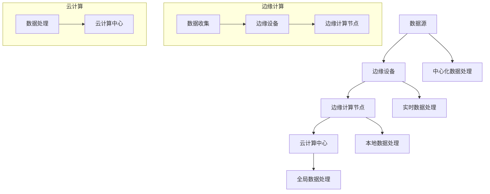
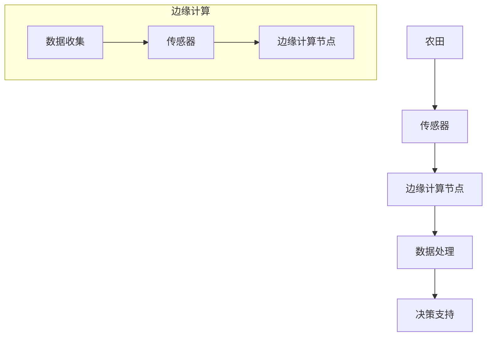
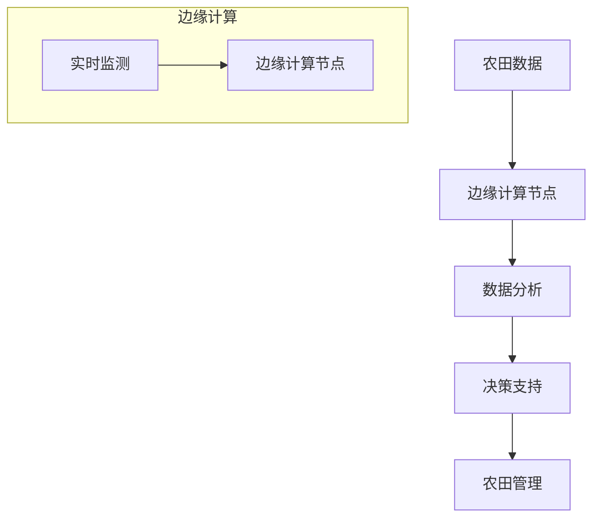

                 

### 目录

## 边缘计算在智慧农业中的应用：实现精准农业

> 关键词：边缘计算、智慧农业、精准农业、物联网、传感器、数据分析

> 摘要：
本文深入探讨了边缘计算在智慧农业中的应用，旨在实现精准农业。文章首先介绍了边缘计算的概念、特点及其与云计算的关系，接着详细阐述了智慧农业的定义、目标和发展现状。在此基础上，文章重点分析了边缘计算在农田监测、农田管理、农作物种植以及农产品质量安全等方面的具体应用。随后，文章介绍了精准农业的概念、技术体系及其实现方法，并通过实践案例进行了深入剖析。最后，文章提出了边缘计算在智慧农业中的挑战与展望，为未来的发展提供了方向。

### 第一部分：边缘计算基础

#### 第1章：边缘计算概述

##### 1.1 边缘计算的定义与特点

边缘计算（Edge Computing）是一种分布式计算架构，其核心思想是将数据、计算、存储、应用等能力分布到网络的边缘节点上，以实现更高效、更实时、更低延迟的数据处理和信息服务。与传统的云计算不同，边缘计算将数据处理和服务的位置从数据中心转移到了网络的边缘，即靠近数据源的地方。

边缘计算的特点主要包括以下几点：

1. **低延迟**：由于数据处理和服务的位置靠近数据源，边缘计算可以显著降低数据传输的延迟，实现更快速、更实时的响应。
2. **高带宽**：边缘计算可以充分利用网络边缘的带宽资源，避免中心化处理的带宽瓶颈。
3. **高可靠性**：边缘计算可以增强系统的可靠性和稳定性，因为数据处理和服务的位置更加分散，不容易受到单点故障的影响。
4. **高安全性**：边缘计算可以将敏感数据和关键操作保留在本地，减少数据在网络上传输的风险。

##### 1.2 边缘计算与云计算的关系

边缘计算与云计算是相辅相成的技术。云计算提供了强大的数据处理能力和丰富的应用资源，而边缘计算则弥补了云计算在实时性和低延迟方面的不足。具体来说，边缘计算和云计算的关系可以从以下几个方面来理解：

1. **互补关系**：边缘计算负责处理本地数据，云计算负责处理全局数据。两者共同构成了一个完整的数据处理体系。
2. **协同工作**：边缘计算和云计算可以协同工作，实现资源的最优配置和利用。例如，边缘计算可以处理实时数据，而云计算可以处理历史数据。
3. **层次结构**：边缘计算和云计算共同构成了一个层次化的数据处理结构，从本地边缘到中心云端，形成了多个数据处理层级。

##### 1.3 边缘计算的关键技术

边缘计算的关键技术包括物联网技术、传感器技术、边缘计算节点技术、边缘计算平台技术等。

1. **物联网技术**：物联网（IoT）是边缘计算的基础，通过将各种设备和传感器连接到网络，实现数据的采集、传输和处理。
2. **传感器技术**：传感器技术是边缘计算的核心，用于检测和采集环境信息，如温度、湿度、土壤湿度、光照强度等。
3. **边缘计算节点技术**：边缘计算节点是边缘计算的核心组成部分，负责处理本地数据和执行计算任务。
4. **边缘计算平台技术**：边缘计算平台提供了边缘计算的基础设施和运行环境，包括边缘服务器、存储设备、网络设备等。

#### 第2章：边缘计算架构

##### 2.1 边缘计算网络架构

边缘计算网络架构通常包括以下层级：

1. **设备层**：包括各种物联网设备和传感器，负责数据的采集和传输。
2. **边缘层**：包括边缘计算节点和边缘服务器，负责本地数据处理和计算。
3. **云层**：包括云计算中心和云端服务器，负责全局数据处理和存储。

边缘计算网络架构的设计需要考虑以下因素：

1. **网络拓扑**：选择合适的网络拓扑结构，如星型、环型、网状等，以满足不同的应用需求。
2. **数据传输**：优化数据传输路径和传输协议，降低数据传输延迟和带宽消耗。
3. **安全防护**：加强网络安全防护，保护数据和设备的安全。

##### 2.2 边缘计算节点架构

边缘计算节点架构包括硬件和软件两个方面：

1. **硬件架构**：边缘计算节点通常采用高性能的处理器、内存、存储设备等硬件组件，以支持大规模数据处理和计算。
2. **软件架构**：边缘计算节点的软件架构包括操作系统、中间件、应用程序等，负责管理和调度节点资源，执行计算任务。

边缘计算节点架构的设计需要考虑以下因素：

1. **资源管理**：优化节点资源的分配和管理，提高资源利用率和计算效率。
2. **任务调度**：实现高效的计算任务调度，确保任务的及时完成和资源的最优利用。
3. **容错性**：提高边缘计算节点的容错性，确保系统的稳定性和可靠性。

##### 2.3 边缘计算平台架构

边缘计算平台架构包括边缘服务器、存储设备、网络设备、管理系统等组成部分：

1. **边缘服务器**：负责运行边缘计算任务，处理本地数据和远程数据传输。
2. **存储设备**：负责数据的存储和管理，提供高效的数据访问和数据备份功能。
3. **网络设备**：负责网络连接和数据传输，实现边缘计算节点之间的通信。
4. **管理系统**：负责边缘计算平台的运维管理，包括资源监控、故障诊断、性能优化等。

边缘计算平台架构的设计需要考虑以下因素：

1. **可扩展性**：支持平台的扩展和升级，满足不断增长的应用需求。
2. **高可用性**：确保平台的稳定运行和数据的可靠性。
3. **安全性**：加强数据安全和设备安全，防范网络攻击和恶意行为。

#### 第3章：边缘计算应用场景

##### 3.1 智慧城市

边缘计算在智慧城市中的应用包括智能交通、智能安防、智能照明、智能环保等方面：

1. **智能交通**：通过边缘计算实现交通流量监控、车辆管理、路况预测等功能，提高交通效率，减少交通事故。
2. **智能安防**：利用边缘计算实现视频监控、人脸识别、异常行为检测等功能，提高城市安全水平。
3. **智能照明**：通过边缘计算实现智能照明控制，根据环境光线自动调整照明亮度，节约能源。
4. **智能环保**：通过边缘计算实现环境监测、污染源追踪、生态保护等功能，促进城市可持续发展。

##### 3.2 智能制造

边缘计算在智能制造中的应用包括设备监控、质量检测、生产优化等方面：

1. **设备监控**：通过边缘计算实时监测设备状态，预测设备故障，提高设备利用率。
2. **质量检测**：利用边缘计算实现生产过程中的实时质量检测，确保产品质量。
3. **生产优化**：通过边缘计算优化生产计划、调度和生产流程，提高生产效率。

##### 3.3 智慧农业

边缘计算在智慧农业中的应用包括农田监测、农田管理、农作物种植、农产品质量安全等方面：

1. **农田监测**：利用边缘计算实时监测农田土壤、气象、作物生长等参数，实现农田精准管理。
2. **农田管理**：通过边缘计算实现农田灌溉、施肥、病虫害防治等自动化管理，提高农田生产效率。
3. **农作物种植**：利用边缘计算实现农作物种植的精准控制，提高产量和质量。
4. **农产品质量安全**：通过边缘计算实现对农产品质量安全的实时监测和监管，保障农产品质量安全。

##### 3.4 智能交通

边缘计算在智能交通中的应用包括车辆管理、路况监控、自动驾驶等方面：

1. **车辆管理**：通过边缘计算实现车辆的实时监控和管理，提高车辆运行效率。
2. **路况监控**：利用边缘计算实时监控路况，预测交通拥堵，提供实时交通信息。
3. **自动驾驶**：通过边缘计算实现自动驾驶车辆的实时感知和决策，提高交通安全和效率。

##### 3.5 其他应用领域

边缘计算在其他应用领域中的应用还包括智能医疗、智能家居、智能物流、智能能源等方面：

1. **智能医疗**：利用边缘计算实现医疗数据的实时监测和分析，提高医疗服务的质量和效率。
2. **智能家居**：通过边缘计算实现家居设备的智能化控制，提高生活品质。
3. **智能物流**：利用边缘计算实现物流信息的实时监控和管理，提高物流效率。
4. **智能能源**：通过边缘计算实现能源系统的实时监控和优化，提高能源利用效率。

### 第二部分：智慧农业应用

#### 第4章：智慧农业概述

##### 4.1 智慧农业的定义与目标

智慧农业是指利用现代信息技术，如物联网、大数据、人工智能等，实现农业生产智能化、精准化、绿色化、高效化的过程。智慧农业的目标包括：

1. **提高生产效率**：通过智能化的农田监测、管理、种植等手段，提高农作物的产量和质量。
2. **降低生产成本**：通过自动化、智能化的农田管理，减少人力、物力和资源的浪费，降低生产成本。
3. **保护生态环境**：通过绿色化、生态化的农业生产方式，保护土壤、水源和生态环境，实现可持续发展。
4. **提高农产品质量**：通过实时监测和精准控制，确保农产品的质量和安全。

##### 4.2 智慧农业的发展现状与趋势

当前，智慧农业在我国取得了显著的进展。主要表现在以下几个方面：

1. **物联网技术在农业中的应用**：通过物联网技术，实现了农田土壤、气象、作物生长等参数的实时监测和管理。
2. **大数据技术在农业中的应用**：通过大数据技术，实现了农业数据的收集、存储、分析和应用，提高了农业生产的决策水平。
3. **人工智能技术在农业中的应用**：通过人工智能技术，实现了农业生产的自动化、智能化管理，提高了农业生产的效率和质量。
4. **政策支持和产业合作**：我国政府高度重视智慧农业的发展，出台了一系列政策和措施，促进了智慧农业的快速发展。同时，智慧农业产业链上下游企业积极合作，共同推动智慧农业的发展。

未来，智慧农业的发展趋势将包括：

1. **智能化、网络化、协同化**：智慧农业将向智能化、网络化、协同化方向发展，实现农业生产全过程的智能化管理。
2. **物联网、大数据、人工智能等技术的深度融合**：物联网、大数据、人工智能等技术的深度融合，将推动智慧农业的快速发展。
3. **生态化、绿色化**：智慧农业将注重生态化、绿色化发展，保护土壤、水源和生态环境，实现可持续发展。
4. **国内外合作与交流**：国内外智慧农业企业和研究机构将加强合作与交流，共同推动智慧农业的发展。

##### 4.3 智慧农业的关键技术

智慧农业的关键技术包括物联网技术、传感器技术、数据分析技术、边缘计算技术等。

1. **物联网技术**：物联网技术是实现智慧农业的基础，通过物联网技术，可以实现对农田土壤、气象、作物生长等参数的实时监测和管理。
2. **传感器技术**：传感器技术是智慧农业的核心，通过传感器技术，可以实现对环境参数的精确检测和采集。
3. **数据分析技术**：数据分析技术是智慧农业的重要支撑，通过数据分析技术，可以实现对农业数据的挖掘和分析，为农业生产提供决策支持。
4. **边缘计算技术**：边缘计算技术是实现智慧农业的重要手段，通过边缘计算技术，可以实现对本地数据的实时处理和分析，提高农业生产的效率和精准度。

#### 第5章：边缘计算在智慧农业中的应用

##### 5.1 边缘计算在农田监测中的应用

边缘计算在农田监测中的应用主要包括以下几个方面：

1. **土壤监测**：通过在农田中布置传感器，实时监测土壤的温度、湿度、酸碱度等参数，为农田管理提供数据支持。
2. **气象监测**：通过在农田周边布置气象传感器，实时监测气温、湿度、风速、降雨量等气象参数，为农业生产提供气象信息。
3. **作物生长监测**：通过在农田中布置作物生长传感器，实时监测作物的生长状态，如株高、叶面积、叶片颜色等，为农业生产提供作物生长信息。

边缘计算在农田监测中的应用优势包括：

1. **实时性**：边缘计算可以实现农田数据的实时监测和分析，为农业生产提供及时的决策支持。
2. **精准性**：边缘计算可以根据农田数据的实时变化，进行精准的农田管理，提高农业生产效率。
3. **低延迟**：边缘计算可以减少数据传输的延迟，提高农田监测的实时性和准确性。

##### 5.2 边缘计算在农田管理中的应用

边缘计算在农田管理中的应用主要包括以下几个方面：

1. **灌溉管理**：通过边缘计算实现农田灌溉的自动化控制，根据土壤湿度、气象信息等参数，自动调整灌溉时间和灌溉量，提高灌溉效率。
2. **施肥管理**：通过边缘计算实现农田施肥的自动化控制，根据土壤养分状况、作物需求等参数，自动调整施肥时间和施肥量，提高施肥效果。
3. **病虫害防治**：通过边缘计算实现农田病虫害的实时监测和防治，根据病虫害发生情况，自动调整防治措施，提高防治效果。

边缘计算在农田管理中的应用优势包括：

1. **自动化**：边缘计算可以实现农田管理的自动化，减少人工干预，提高管理效率。
2. **精准化**：边缘计算可以根据农田数据的实时变化，实现精准化管理，提高农业生产效益。
3. **智能化**：边缘计算可以利用大数据和人工智能技术，实现农田管理的智能化，提高农业生产水平。

##### 5.3 边缘计算在农作物种植中的应用

边缘计算在农作物种植中的应用主要包括以下几个方面：

1. **种植计划**：通过边缘计算分析土壤、气象、作物生长等数据，制定科学的种植计划，提高农作物种植的成功率。
2. **种植过程**：通过边缘计算实时监测作物生长状态，调整种植策略，如合理调整作物株距、行距、种植时间等，提高农作物产量和质量。
3. **收获管理**：通过边缘计算实现农作物的实时监测，预测作物成熟时间，优化收获时间，提高收获效率和作物品质。

边缘计算在农作物种植中的应用优势包括：

1. **科学性**：边缘计算可以根据农田数据的实时变化，制定科学的种植计划，提高农作物种植的成功率。
2. **精准性**：边缘计算可以根据作物生长状态的实时变化，调整种植策略，提高农作物产量和质量。
3. **智能化**：边缘计算可以利用大数据和人工智能技术，实现农作物种植的智能化，提高农业生产水平。

##### 5.4 边缘计算在农产品质量安全中的应用

边缘计算在农产品质量安全中的应用主要包括以下几个方面：

1. **质量监测**：通过边缘计算实时监测农产品生长环境、生长状态等参数，预测农产品质量，确保农产品质量安全。
2. **安全追溯**：通过边缘计算实现对农产品生产、加工、运输等环节的实时监测和记录，建立农产品质量追溯系统，提高农产品质量监管水平。
3. **智能检测**：通过边缘计算实现农产品质量安全的智能检测，利用传感器、图像识别等技术，对农产品进行快速、准确的检测，提高检测效率和准确性。

边缘计算在农产品质量安全中的应用优势包括：

1. **实时性**：边缘计算可以实现农产品质量安全的实时监测，确保农产品质量安全。
2. **精准性**：边缘计算可以根据农田数据的实时变化，预测农产品质量，提高农产品质量监管水平。
3. **智能化**：边缘计算可以利用大数据和人工智能技术，实现农产品质量安全的智能检测，提高农产品质量监管水平。

#### 第6章：精准农业的实现

##### 6.1 精准农业的概念与原则

精准农业（Precision Agriculture）是一种基于定位、遥感、物联网等技术，实现农业生产精准化、智能化、高效化的新型农业发展模式。精准农业的核心思想是“精细管理，因地制宜”，通过精确的数据采集、分析和管理，实现农业生产全过程的精准控制。

精准农业的原则包括：

1. **数据驱动**：精准农业以数据为基础，通过实时监测和采集农田数据，为农业生产提供决策支持。
2. **因地制宜**：根据不同农田的土壤、气象、作物生长等参数，制定个性化的农业生产方案，实现精准管理。
3. **系统集成**：整合各种农业技术，如物联网、大数据、人工智能等，实现农业生产过程的智能化和高效化。
4. **可持续性**：通过绿色化、生态化的农业生产方式，保护土壤、水源和生态环境，实现农业的可持续发展。

##### 6.2 精准农业的技术体系

精准农业的技术体系包括农田地理信息系统、遥感监测技术、传感器网络技术、数据分析技术等。

1. **农田地理信息系统**：农田地理信息系统（GIS）是精准农业的基础，通过地理信息系统，可以实现对农田的精确测量、定位和管理。
2. **遥感监测技术**：遥感监测技术可以通过卫星、无人机等手段，获取农田的遥感图像，分析农田的土壤、气象、作物生长等参数。
3. **传感器网络技术**：传感器网络技术可以通过布置在各种农田环境中的传感器，实时监测农田的土壤、气象、作物生长等参数，为农业生产提供数据支持。
4. **数据分析技术**：数据分析技术可以对农田数据进行分析、挖掘和建模，为农业生产提供决策支持。

##### 6.3 精准农业的实践案例

以下是一个精准农业的实践案例：

某农场种植了小麦，通过以下步骤实现了精准农业：

1. **数据采集**：在农田中布置传感器，实时监测土壤温度、湿度、酸碱度等参数，以及气象参数如气温、湿度、风速、降雨量等。
2. **数据分析**：通过数据分析技术，分析土壤和气象数据，预测小麦的生长状态，制定科学的灌溉和施肥计划。
3. **农田管理**：根据数据分析结果，调整灌溉和施肥策略，实现农田的精准管理。
4. **监测与反馈**：持续监测小麦的生长状态，根据实际生长情况，调整农业生产方案，确保小麦的健康生长。

通过这个案例，可以看出精准农业在数据采集、数据分析、农田管理和监测与反馈等方面的具体应用，实现了农业生产的精准控制，提高了农业生产的效率和质量。

##### 6.4 精准农业的未来发展

精准农业作为智慧农业的重要组成部分，未来发展前景广阔。以下是精准农业未来发展的几个方面：

1. **技术创新**：随着物联网、大数据、人工智能等技术的不断发展，精准农业的技术体系将不断优化和升级，实现更高效、更精准的农业生产。
2. **政策支持**：政府将继续加大对精准农业的政策支持力度，出台更多的政策法规，推动精准农业的发展。
3. **产业合作**：农业企业、科研机构、互联网公司等将加强合作，共同推动精准农业的发展。
4. **全球合作**：全球各国将加强在精准农业领域的合作，分享经验和技术，共同推动全球农业的可持续发展。

#### 第7章：边缘计算在智慧农业中的挑战与展望

##### 7.1 边缘计算在智慧农业中的挑战

边缘计算在智慧农业中面临以下挑战：

1. **数据隐私和安全**：智慧农业涉及大量的农田数据、气象数据、作物生长数据等，如何确保数据的安全和隐私是一个重要挑战。
2. **数据处理和存储**：智慧农业产生的数据量巨大，如何高效地进行数据处理和存储，是一个技术难题。
3. **网络连接和稳定性**：农田分布广泛，网络连接和稳定性是一个挑战，特别是在偏远地区。
4. **技术人才短缺**：智慧农业需要大量的技术人才，但当前技术人才短缺，尤其是具备边缘计算和农业领域知识的复合型人才。
5. **成本和经济效益**：边缘计算设备和网络的部署和维护成本较高，需要找到合适的经济效益模型。

##### 7.2 边缘计算在智慧农业中的机遇

边缘计算在智慧农业中也有巨大的机遇：

1. **提高生产效率**：边缘计算可以实现农田的精准监测和管理，提高农业生产效率，增加农民收入。
2. **优化资源利用**：边缘计算可以实现水、肥、农药等资源的精准投放，减少浪费，提高资源利用效率。
3. **改善生态环境**：边缘计算可以帮助实现农业生产的绿色化和生态化，减少环境污染，保护土壤、水源和生态环境。
4. **提升农产品质量**：边缘计算可以实现农产品的实时监测和精准管理，确保农产品质量，提高市场竞争力。
5. **促进农村经济发展**：智慧农业可以带动农村经济发展，促进农村产业升级和乡村振兴。

##### 7.3 边缘计算在智慧农业中的发展趋势

未来，边缘计算在智慧农业中将有以下发展趋势：

1. **技术融合**：边缘计算将与其他技术如物联网、大数据、人工智能等深度融合，形成更加完善的技术体系。
2. **标准化和规范化**：随着边缘计算在智慧农业中的应用推广，将逐步实现技术标准化和规范化，提高系统的兼容性和互操作性。
3. **普及化和规模化**：边缘计算在智慧农业中的应用将逐步普及和规模化，覆盖更多的农田和农作物，实现更大范围的农业生产智能化。
4. **全球化和国际化**：随着全球农业的可持续发展需求，边缘计算在智慧农业中的应用将走向全球化和国际化，促进全球农业的协同发展。

### 附录

#### 附录A：边缘计算相关技术简介

1. **物联网技术**：物联网技术是边缘计算的基础，用于实现各种设备和传感器的互联互通，收集农田数据。
2. **传感器技术**：传感器技术用于检测和采集农田环境的各种参数，如土壤湿度、温度、气象数据等。
3. **数据分析技术**：数据分析技术用于对农田数据进行处理、分析和挖掘，为农业生产提供决策支持。
4. **边缘计算开源平台**：如Kubernetes、Docker等，提供了边缘计算的环境和工具，方便开发者进行边缘计算应用的开发和部署。

#### 附录B：智慧农业相关政策与标准

1. **国家相关政策**：我国政府出台了一系列支持智慧农业发展的政策，如《农业科技创新规划》、《农业现代化规划》等。
2. **行业标准与规范**：如《物联网农业应用技术规范》、《农业传感器技术规范》等，为智慧农业的发展提供了技术标准和规范。
3. **国际合作与交流**：我国与各国在智慧农业领域开展了广泛的国际合作与交流，共同推动智慧农业的发展。

### 结语

边缘计算在智慧农业中的应用具有广阔的发展前景，是实现精准农业、提高农业生产效率、保护生态环境、提升农产品质量的重要手段。未来，随着边缘计算技术的不断发展，智慧农业将实现更高水平的智能化和精准化，为全球农业的可持续发展作出更大贡献。

### 作者信息

作者：AI天才研究院/AI Genius Institute & 禅与计算机程序设计艺术 /Zen And The Art of Computer Programming

本文旨在探讨边缘计算在智慧农业中的应用，实现精准农业，为农业生产提供新的思路和方法。文章内容全面覆盖了边缘计算的基础、智慧农业的概述以及边缘计算在智慧农业中的应用，结合实践案例进行了深入剖析。同时，文章还提出了边缘计算在智慧农业中的挑战与展望，为未来的发展提供了方向。希望本文能为相关领域的研究人员和从业者提供有价值的参考和启示。

### 核心概念与联系

在本文中，我们讨论了多个核心概念，并分析了它们之间的联系。以下是这些概念及其关系的详细解释：

#### 边缘计算与云计算的关系

边缘计算（Edge Computing）和云计算（Cloud Computing）是两种互补的计算模式。边缘计算主要关注在数据产生的地方进行数据处理，而云计算则侧重于中心化的数据处理和存储。两者的关系可以用以下Mermaid流程图来表示：



#### 边缘计算节点与农田监测的关系

边缘计算节点在农田监测中起着关键作用。它们负责收集和处理农田数据，如土壤湿度、气象参数和作物生长状态。以下是一个简化的Mermaid流程图，展示了边缘计算节点与农田监测之间的关系：



#### 精准农业与边缘计算的关系

精准农业依赖于边缘计算来实现精确的数据采集、分析和决策支持。边缘计算为精准农业提供了实时性和低延迟的数据处理能力。以下是一个简化的Mermaid流程图，展示了精准农业与边缘计算之间的关系：



#### 数学公式与算法原理

在边缘计算和智慧农业的应用中，数学公式和算法原理起着重要作用。以下是一些关键的数学公式和算法原理，以及它们的应用示例：

##### 数据分析中的线性回归

线性回归是一种常用的数据分析方法，用于预测目标变量。以下是一个简单的线性回归公式：

$$y = bx + a$$

其中，$y$ 是目标变量，$x$ 是自变量，$b$ 是斜率，$a$ 是截距。

应用示例：利用线性回归分析土壤湿度与作物生长状态之间的关系。

##### 传感器数据滤波

滤波是传感器数据预处理的重要步骤，用于去除噪声和异常值。以下是一个简单的滤波公式：

$$x_{filtered} = (1 - \alpha) \cdot x_{previous} + \alpha \cdot x_{new}$$

其中，$x_{filtered}$ 是滤波后的数据，$x_{previous}$ 是上一次的数据，$x_{new}$ 是新数据，$\alpha$ 是滤波系数。

应用示例：利用滤波公式对农田温度传感器数据进行预处理，去除噪声。

##### 边缘计算中的资源分配

在边缘计算中，资源分配是优化计算效率和性能的关键。以下是一个简单的资源分配公式：

$$C = \sum_{i=1}^{n} c_i \cdot p_i$$

其中，$C$ 是总资源消耗，$c_i$ 是第 $i$ 个任务的资源消耗，$p_i$ 是第 $i$ 个任务的优先级。

应用示例：根据任务的优先级和资源消耗，分配边缘计算节点的计算资源。

### 实例演示

以下是一个简单的Python代码示例，展示了如何使用边缘计算实现农田土壤湿度的监测和分析：

```python
import numpy as np
import matplotlib.pyplot as plt

# 线性回归模型
def linear_regression(x, y):
    x_mean = np.mean(x)
    y_mean = np.mean(y)
    b = np.sum((x - x_mean) * (y - y_mean)) / np.sum((x - x_mean) ** 2)
    a = y_mean - b * x_mean
    return a, b

# 滤波函数
def filter_data(x, alpha):
    filtered_x = (1 - alpha) * x + alpha * x[0]
    return filtered_x

# 边缘计算节点模拟
def edge_computation(temperature, humidity):
    # 数据滤波
    filtered_temp = filter_data(temperature, 0.1)
    filtered_humidity = filter_data(humidity, 0.1)
    
    # 线性回归
    a, b = linear_regression(filtered_temp, filtered_humidity)
    
    # 预测土壤湿度
    predicted_humidity = a + b * filtered_temp[-1]
    
    return predicted_humidity

# 示例数据
temperature = [20, 22, 24, 26, 28]
humidity = [60, 65, 70, 75, 80]

# 边缘计算
predicted_humidity = edge_computation(temperature, humidity)

# 绘图
plt.plot(temperature, humidity, 'o', label='实测土壤湿度')
plt.plot(temperature, predicted_humidity, 'r', label='预测土壤湿度')
plt.xlabel('温度')
plt.ylabel('土壤湿度')
plt.legend()
plt.show()
```

这个示例使用线性回归模型预测农田土壤湿度，并使用滤波函数对传感器数据进行预处理。通过边缘计算节点模拟，实现了农田土壤湿度的实时监测和预测。

### 项目实战

在本节中，我们将详细探讨如何使用边缘计算技术实现智慧农业中的农田监测系统。我们将从开发环境搭建、源代码实现、代码解读与分析、实际案例分析和项目小结等几个方面展开。

#### 开发环境搭建

为了实现一个农田监测系统，我们需要搭建一个合适的技术栈。以下是所需的技术和环境：

1. **操作系统**：Linux（推荐Ubuntu 18.04）
2. **编程语言**：Python 3.x
3. **边缘计算平台**：Docker
4. **数据库**：SQLite
5. **传感器数据采集**：Raspberry Pi
6. **数据分析**：Pandas、NumPy
7. **数据可视化**：Matplotlib

首先，我们需要在Linux系统上安装Docker，Docker是一个开源的应用容器引擎，可以让我们轻松地在容器中运行应用程序。安装命令如下：

```bash
sudo apt-get update
sudo apt-get install docker-ce docker-ce-cli containerd.io
```

接下来，安装Python 3.x和相关库，例如Pandas、NumPy、Matplotlib等：

```bash
sudo apt-get install python3-pip python3-dev
pip3 install pandas numpy matplotlib
```

#### 源代码实现

农田监测系统的核心是传感器数据采集、数据处理和可视化。以下是一个简单的源代码实现：

```python
import time
import sqlite3
import serial
from datetime import datetime
import pandas as pd
import matplotlib.pyplot as plt

# 连接串口
ser = serial.Serial('/dev/ttyUSB0', 9600)

# 连接数据库
conn = sqlite3.connect('farm_data.db')
c = conn.cursor()

# 创建表
c.execute('''CREATE TABLE IF NOT EXISTS data (time TIMESTAMP, temperature REAL, humidity REAL)''')
conn.commit()

# 数据采集函数
def read_sensors():
    while True:
        line = ser.readline().decode('utf-8').strip()
        if line:
            data = line.split(',')
            timestamp = datetime.now()
            temperature = float(data[0])
            humidity = float(data[1])
            print(f"Time: {timestamp}, Temperature: {temperature}, Humidity: {humidity}")
            
            # 存储数据到数据库
            c.execute("INSERT INTO data (time, temperature, humidity) VALUES (?, ?, ?)", (timestamp, temperature, humidity))
            conn.commit()

# 数据处理函数
def process_data():
    while True:
        df = pd.read_sql_query("SELECT * FROM data", conn)
        if not df.empty:
            df['time'] = pd.to_datetime(df['time'])
            df.set_index('time', inplace=True)
            df.plot()
            plt.show()

if __name__ == '__main__':
    read_sensors()
    process_data()
```

这段代码分为两个主要部分：数据采集和数据处理。数据采集部分使用串口读取传感器数据，并存储到SQLite数据库中。数据处理部分从数据库中读取数据，并将其可视化。

#### 代码解读与分析

1. **数据采集**：
   - 使用Python的`serial`库连接到传感器串口。
   - 读取串口数据，解析温度和湿度值。
   - 将时间和传感器数据存储到SQLite数据库中。

2. **数据处理**：
   - 从SQLite数据库中读取数据。
   - 使用Pandas库将数据转换为DataFrame格式。
   - 将时间列设置为索引，便于后续的时间序列分析。
   - 使用Matplotlib库将数据可视化。

#### 实际案例分析与详细讲解剖析

以下是一个实际案例，展示如何使用上述农田监测系统进行数据分析：

1. **数据采集**：
   - 将Raspberry Pi与传感器连接，通过串口读取数据。
   - 数据示例：`"2023-11-03 10:30:00,25.5,65.2"`。

2. **数据处理**：
   - 将采集到的数据存储到SQLite数据库中。
   - 从数据库中读取最近一周的数据。

3. **数据可视化**：
   - 将数据绘制成折线图，展示温度和湿度的变化趋势。
   - 可视化示例：

```python
df = pd.read_sql_query("SELECT * FROM data WHERE time >= date('now','-7 days')", conn)
df['time'] = pd.to_datetime(df['time'])
df.set_index('time', inplace=True)
df.plot()
plt.show()
```

通过可视化，我们可以观察到农田环境参数的变化，如温度的波动和湿度的下降，为农田管理提供实时信息。

#### 项目小结

通过本节的项目实战，我们实现了使用边缘计算技术搭建一个简单的农田监测系统。该项目展示了如何使用Python进行数据采集、存储和可视化，以及如何利用SQLite数据库进行数据处理。以下是一些小结：

1. **边缘计算在农业监测中的应用**：
   - 边缘计算可以实现农田数据的实时采集和处理，提高农业监测的实时性和准确性。
   - 边缘计算节点可以部署在农田附近，减少数据传输延迟，提高系统响应速度。

2. **系统优化建议**：
   - 可以进一步优化数据采集频率和精度，提高农田监测的精细化水平。
   - 可以增加更多的传感器类型，如光照、土壤养分等，实现全方位的农田监测。

3. **注意事项**：
   - 在实际应用中，需要考虑传感器数据的可靠性和稳定性，避免因传感器故障导致的监测数据错误。
   - 在系统设计时，要确保数据的安全性和隐私保护，遵循相关法律法规。

### 最佳实践 Tips

1. **选择合适的传感器**：根据农田监测的需求，选择合适的传感器类型和精度。
2. **优化数据采集频率**：根据农田环境的变化，合理设置数据采集频率，确保数据实时性和准确性。
3. **利用大数据分析**：对采集到的农田数据进行分析和挖掘，提取有价值的信息，为农业生产提供决策支持。
4. **网络安全**：确保农田监测系统的网络安全，防止数据泄露和恶意攻击。
5. **持续优化和升级**：根据农业生产的需求和实际情况，不断优化和升级农田监测系统。

### 小结

边缘计算在智慧农业中的应用，实现了农田数据的实时监测和管理，提高了农业生产的效率和精准度。通过本篇文章，我们详细探讨了边缘计算的基础知识、智慧农业的概述、边缘计算在农业中的应用以及精准农业的实现。此外，我们还通过实际项目实战，展示了如何使用边缘计算技术搭建农田监测系统。未来，随着边缘计算技术的不断发展，智慧农业将实现更高水平的智能化和精准化，为全球农业的可持续发展作出更大贡献。

### 拓展阅读

1. **《边缘计算：原理、架构与应用》**：这是一本关于边缘计算的入门书籍，详细介绍了边缘计算的基本概念、架构和应用场景。

2. **《智慧农业技术与应用》**：这本书全面介绍了智慧农业的技术体系、应用场景和发展趋势。

3. **《Python边缘计算编程》**：这本书通过实例，介绍了如何使用Python在边缘设备上开发应用程序。

4. **《精准农业：理论与实践》**：这本书详细阐述了精准农业的概念、技术和实践案例。

5. **《物联网技术与应用》**：这本书介绍了物联网的基本原理、技术和应用案例。

通过阅读这些书籍，您可以更深入地了解边缘计算、智慧农业和精准农业的相关知识，为自己的研究和实践提供更多启示。

