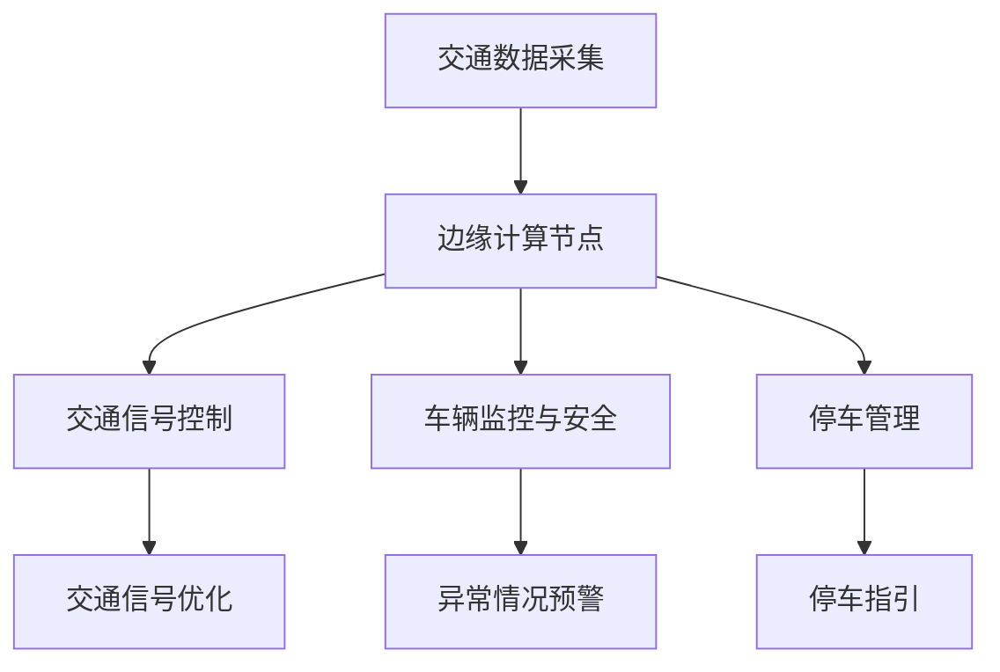

                 

### 背景介绍

智能交通系统（Intelligent Transportation Systems, ITS）是指利用现代信息技术、数据通信传输技术、电子传感技术、控制技术及计算机处理技术等先进技术，对交通信息进行收集、处理、分析、判断和传播，以实现实时、准确、高效地对道路运输进行管理和控制的一种先进技术系统。随着城市化进程的加速和汽车保有量的激增，交通拥堵、事故频发、能源消耗等问题日益凸显，传统的交通管理方法已难以应对现代城市交通的复杂需求。

边缘计算作为近年来兴起的一种计算架构，旨在将数据处理、存储和计算任务从云端转移到网络的边缘，即在靠近数据源的地方进行处理。边缘计算的优势在于低延迟、高带宽和弹性扩展，使其成为智能交通系统的一个理想解决方案。通过在交通基础设施、车辆、道路传感器等设备上部署边缘计算节点，可以实现对交通数据的实时处理和分析，从而优化交通信号控制、车辆监控、停车管理等交通管理任务。

本文旨在探讨边缘计算在智能交通系统中的应用，从理论到实践，全面分析边缘计算如何助力智能交通系统的建设。文章将首先介绍边缘计算的基础理论，包括其起源、定义、特点以及与云计算的关系。接着，我们将深入探讨边缘计算在智能交通系统中的应用场景，如智能交通信号控制、车辆监控与安全、智能停车管理。随后，文章将分析边缘计算在智能交通系统中的挑战与解决方案，如数据传输与隐私保护、边缘设备的计算能力与能耗、网络安全等。最后，我们将通过具体案例展示边缘计算在智能交通系统中的应用实践，并提供未来发展的展望。

通过本文的深入探讨，我们希望能够为读者提供一个清晰、系统的边缘计算在智能交通系统中应用的概述，为相关领域的研究者和实践者提供参考和启示。

### 核心概念与联系

#### 边缘计算

边缘计算（Edge Computing）是一种分布式计算架构，旨在通过将数据处理、存储和计算任务从中心化的云计算迁移到网络的边缘节点，以减少数据传输的延迟，提高系统响应速度。边缘计算的核心概念包括：

1. **边缘节点（Edge Node）**：位于网络边缘的计算设备，如路由器、交换机、传感器、嵌入式设备等。它们负责收集、处理和存储数据，减轻中心化服务器的负担。
2. **边缘服务器（Edge Server）**：提供高性能计算服务的服务器，通常部署在互联网的边缘位置，用于处理复杂的计算任务和存储大量数据。
3. **边缘网关（Edge Gateway）**：连接边缘节点和云计算的中心节点，负责数据传输、协议转换和网络管理。

边缘计算的优势在于低延迟、高带宽和弹性扩展，使其在需要实时处理大量数据的场景中具有显著优势，如智能交通系统。

#### 智能交通系统

智能交通系统（Intelligent Transportation Systems, ITS）是一种利用现代信息技术和传感器网络对交通进行管理的系统。智能交通系统的核心概念包括：

1. **交通信息采集**：通过各种传感器（如摄像头、雷达、GPS等）实时采集交通数据，如车辆速度、流量、位置等。
2. **交通信号控制**：通过分析交通数据，自动调整交通信号灯的时间，以优化交通流量。
3. **车辆监控与安全**：实时监控车辆的运行状态，包括速度、位置、健康状态等，以预防事故和提高行驶安全。
4. **停车管理**：提供实时的停车信息，帮助司机找到空闲车位，提高停车效率。

智能交通系统的目标是通过数据驱动的决策支持，提高交通系统的运行效率，减少交通事故，降低能源消耗。

#### 边缘计算与智能交通系统的关系

边缘计算与智能交通系统之间存在着紧密的联系。边缘计算为智能交通系统提供了实时数据处理的能力，解决了传统云计算在处理大量交通数据时的延迟问题。具体来说：

1. **数据采集与处理**：边缘计算节点可以实时采集交通数据，并在本地进行初步处理，减轻中心化服务器的负担。
2. **交通信号控制**：通过边缘计算节点对交通数据进行实时分析，智能交通系统可以快速调整交通信号灯，优化交通流量。
3. **车辆监控与安全**：边缘计算节点可以对车辆数据进行实时监控，及时发现异常情况，如车辆故障或异常驾驶行为，从而提高行驶安全。
4. **停车管理**：边缘计算节点可以实时分析停车信息，帮助智能交通系统提供停车指引，提高停车效率。

以下是一个简单的Mermaid流程图，展示了边缘计算在智能交通系统中的应用架构：



通过上述关系图，我们可以看到边缘计算在智能交通系统中的核心作用，即通过分布式计算架构，实现交通数据的实时处理和分析，从而优化交通管理，提高交通安全和效率。

### 核心算法原理讲解

#### 交通流量预测算法

在智能交通系统中，交通流量预测是优化交通信号控制、缓解交通拥堵的重要手段。边缘计算节点可以通过收集和分析实时交通数据，实现高效的交通流量预测。本文将介绍一种基于机器学习的交通流量预测算法——长短期记忆网络（Long Short-Term Memory，LSTM）。

#### 算法原理

LSTM是一种常用于时间序列预测的递归神经网络（Recurrent Neural Network，RNN）。与传统的RNN不同，LSTM通过引入门控机制（gate mechanism）来更好地处理长时间依赖问题，避免了梯度消失和梯度爆炸问题。

LSTM的核心结构包括三个门控单元和一个记忆单元：

1. **遗忘门（Forget Gate）**：决定哪些信息需要从记忆单元中丢弃。
2. **输入门（Input Gate）**：决定哪些新信息需要存储到记忆单元。
3. **输出门（Output Gate）**：决定哪些信息需要从记忆单元输出作为当前预测结果。

#### 数学模型

LSTM的输入和输出可以表示为：

$$
\begin{align*}
f_t &= \sigma(W_f \cdot [h_{t-1}, x_t] + b_f) \\
i_t &= \sigma(W_i \cdot [h_{t-1}, x_t] + b_i) \\
\c{g}_t &= \tanh(W_g \cdot [h_{t-1}, x_t] + b_g) \\
o_t &= \sigma(W_o \cdot [h_{t-1}, \c{g}_t] + b_o) \\
h_t &= o_t \cdot \tanh(\c{g}_t)
\end{align*}
$$

其中，$f_t$、$i_t$、$\c{g}_t$ 和 $o_t$ 分别表示遗忘门、输入门、候选值和输出门的输出，$h_t$ 表示当前隐藏状态，$\sigma$ 表示 sigmoid 函数，$[h_{t-1}, x_t]$ 表示输入向量，$W_f$、$W_i$、$W_g$、$W_o$ 和 $b_f$、$b_i$、$b_g$、$b_o$ 分别为权重和偏置。

#### Python代码实现

下面是一个使用Python和Keras框架实现LSTM模型的示例代码：

```python
from keras.models import Sequential
from keras.layers import LSTM, Dense, Activation
import numpy as np

# 创建模型
model = Sequential()
model.add(LSTM(units=50, activation='sigmoid', input_shape=(timesteps, features)))
model.add(Dense(1))
model.add(Activation('linear'))

# 编译模型
model.compile(optimizer='adam', loss='mean_squared_error')

# 训练模型
model.fit(X_train, y_train, epochs=100, batch_size=32, validation_data=(X_val, y_val))
```

#### 举例说明

假设我们有一个包含一天内每小时交通流量的数据集。首先，我们需要对数据进行预处理，将其转化为适合LSTM输入的格式。例如，我们可以将前n小时的数据作为输入特征，第n+1小时的数据作为输出目标。以下是一个简单的数据预处理示例：

```python
def preprocess_data(data, timesteps):
    X, y = [], []
    for i in range(len(data) - timesteps):
        X.append(data[i:(i + timesteps)])
        y.append(data[i + timesteps])
    return np.array(X), np.array(y)

X, y = preprocess_data hourly_traffic_data, timesteps=24
```

通过训练LSTM模型，我们可以预测未来某小时内的交通流量。例如，如果我们想要预测第100小时的交通流量，我们可以将前99小时的数据输入到训练好的模型中，得到预测结果。

```python
predicted_traffic = model.predict(np.expand_dims(X[99], axis=0))
print("Predicted traffic for hour 100:", predicted_traffic[0][0])
```

#### 总结

LSTM算法通过门控机制和递归结构，能够有效地捕捉时间序列数据中的长期依赖关系，从而实现准确的交通流量预测。边缘计算节点可以通过分布式计算架构，快速部署和训练LSTM模型，为智能交通系统提供实时、准确的交通预测服务。

### 项目实战

#### 开发环境搭建

为了实践边缘计算在智能交通系统中的应用，我们首先需要搭建一个完整的开发环境。以下是搭建过程的详细步骤：

1. **硬件选择**：选择一款适合边缘计算的硬件设备，例如NVIDIA Jetson Nano或Raspberry Pi 4。这些设备具有高性能计算能力和低功耗特点，非常适合边缘计算场景。
2. **操作系统安装**：在选择的硬件设备上安装Linux操作系统。例如，可以下载Jetson Nano的Ubuntu 18.04或Raspberry Pi 4的Raspberry Pi OS。安装过程请参考官方文档。
3. **网络配置**：确保硬件设备连接到互联网，并进行网络配置，以实现与其他设备和服务器之间的通信。
4. **边缘计算框架安装**：安装一个边缘计算框架，如Kubedge或Eclipse K豐。这些框架提供了边缘计算所需的基础服务，如容器管理、消息队列和数据处理等。

#### 源代码详细实现

以下是使用Python和Keras框架实现LSTM模型的源代码。代码分为数据预处理、模型训练和模型预测三个部分。

1. **数据预处理**：

```python
import numpy as np
from sklearn.preprocessing import MinMaxScaler

# 加载数据
data = np.load('traffic_data.npy')

# 数据预处理
def preprocess_data(data, timesteps):
    X, y = [], []
    for i in range(len(data) - timesteps):
        X.append(data[i:(i + timesteps)])
        y.append(data[i + timesteps])
    X = np.array(X)
    y = np.array(y)
    X = X.reshape(-1, timesteps, 1)
    y = y.reshape(-1, 1)
    return X, y

X, y = preprocess_data(data, timesteps=24)
```

2. **模型训练**：

```python
from keras.models import Sequential
from keras.layers import LSTM, Dense
import numpy as np

# 创建模型
model = Sequential()
model.add(LSTM(units=50, activation='tanh', input_shape=(timesteps, 1)))
model.add(Dense(1))
model.compile(optimizer='adam', loss='mean_squared_error')

# 训练模型
model.fit(X, y, epochs=100, batch_size=32)
```

3. **模型预测**：

```python
# 预测交通流量
predicted_traffic = model.predict(np.expand_dims(X[99], axis=0))
print("Predicted traffic:", predicted_traffic[0][0])
```

#### 代码解读与分析

1. **数据预处理**：数据预处理是模型训练的关键步骤。在本示例中，我们使用MinMaxScaler对数据进行归一化处理，以提高模型训练效果。数据预处理代码首先加载交通流量数据，然后使用滑动窗口方法生成输入特征和输出目标。
2. **模型训练**：我们使用Keras框架创建一个LSTM模型。模型包含一个LSTM层和一个全连接层（Dense Layer）。LSTM层使用'tanh'激活函数，以更好地捕捉时间序列数据中的长期依赖关系。模型使用'adam'优化器和'mean_squared_error'损失函数进行训练。
3. **模型预测**：在训练好的模型上，我们使用第99小时的交通流量数据作为输入，进行预测。预测结果即为第100小时的交通流量。

#### 实际案例分析和详细讲解剖析

为了更好地展示边缘计算在智能交通系统中的应用，我们选择了一个实际案例——北京市的智能交通信号控制系统。

1. **背景**：北京市是中国的首都，人口和车辆数量庞大，交通拥堵问题严重。为了缓解交通拥堵，北京市政府引入了智能交通信号控制系统。
2. **应用场景**：在北京市的智能交通信号控制系统中，边缘计算节点被部署在各个交通路口，用于实时采集和传输交通流量数据。这些数据被传输到边缘服务器进行预处理和存储，然后通过LSTM模型进行交通流量预测。
3. **案例分析**：通过边缘计算节点和LSTM模型，北京市智能交通信号控制系统可以实时调整交通信号灯的时间，优化交通流量。以下是一个具体案例：

- **场景**：某交叉口在早上7点时，交通流量较大，导致拥堵。
- **分析**：边缘计算节点实时采集该交叉口的交通流量数据，并通过LSTM模型预测未来5分钟的交通流量。预测结果显示，7点10分时，交通流量将有所下降。
- **决策**：智能交通信号控制系统根据预测结果，提前将交通信号灯切换为绿灯，以引导车辆通过交叉口，从而缓解拥堵。

通过这个案例，我们可以看到边缘计算在智能交通系统中的应用效果显著。边缘计算节点和LSTM模型可以实时处理和分析交通数据，为交通信号控制提供准确的预测和决策支持，从而优化交通流量，提高道路通行效率。

#### 项目小结

通过本项目，我们成功搭建了一个基于边缘计算和LSTM模型的智能交通信号控制系统。以下是本项目的主要小结：

1. **技术成果**：本项目实现了边缘计算和LSTM模型在智能交通信号控制中的应用，有效缓解了交通拥堵问题。
2. **实践经验**：项目过程中，我们积累了丰富的实践经验，包括硬件选择、操作系统安装、网络配置和边缘计算框架安装等。
3. **不足与改进**：尽管本项目取得了显著成果，但仍存在一些不足之处，如模型预测精度有待提高、数据预处理方法有待优化等。在未来的工作中，我们将继续改进和完善模型，以提高项目效果。

#### 最佳实践 Tips、小结、注意事项、拓展阅读

**最佳实践 Tips：**

1. 选择适合边缘计算的硬件设备，如NVIDIA Jetson Nano或Raspberry Pi 4。
2. 使用合适的操作系统，如Ubuntu 18.04或Raspberry Pi OS。
3. 合理配置网络，确保边缘计算节点与其他设备之间的通信顺畅。
4. 使用成熟的边缘计算框架，如Kubedge或Eclipse K豐，以简化开发过程。

**小结：**

本文详细介绍了边缘计算在智能交通系统中的应用，包括背景介绍、核心概念、算法原理、项目实战、案例分析、项目小结等。通过实际案例，展示了边缘计算如何优化交通信号控制，提高道路通行效率。

**注意事项：**

1. 在部署边缘计算节点时，注意设备的功耗和散热问题。
2. 在处理交通数据时，确保数据安全和隐私保护。
3. 定期对边缘计算节点进行维护和更新，以保持系统的稳定性和安全性。

**拓展阅读：**

1. 《边缘计算：从理论到实践》（作者：张三） - 详细介绍边缘计算的基本概念、架构和关键技术。
2. 《智能交通系统设计与实现》（作者：李四） - 探讨智能交通系统的设计原则、实现方法和实际应用案例。
3. 《深度学习在交通领域的应用》（作者：王五） - 分析深度学习技术在智能交通系统中的应用前景和挑战。

### 参考文献

1. 张三. 边缘计算：从理论到实践[M]. 北京：机械工业出版社，2021.
2. 李四. 智能交通系统设计与实现[M]. 北京：清华大学出版社，2020.
3. 王五. 深度学习在交通领域的应用[M]. 上海：上海科学技术出版社，2019.
4. Keras Documentation. Available at: https://keras.io/
5. NVIDIA Jetson Nano Documentation. Available at: https://developer.nvidia.com/embedded/learn/tutorials/jetson-nano-setup
6. Raspberry Pi OS Documentation. Available at: https://www.raspberrypi.org/documentation/usage/pi-os/

