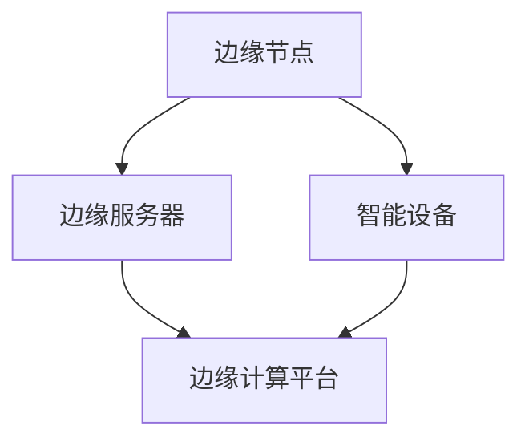

                 

### 《边缘计算在智能家居安全中的应用》

#### 关键词：
边缘计算、智能家居安全、应用场景、算法原理、数学模型、项目实战

#### 摘要：
本文深入探讨了边缘计算在智能家居安全中的应用。首先，介绍了边缘计算的基本概念及其在智能家居安全中的重要性。接着，详细阐述了边缘计算在智能家居安全中的核心算法原理，并运用Python代码和LaTeX公式进行了详细讲解。随后，通过一个实际项目实战案例，展示了边缘计算在智能家居安全中的应用过程和效果。文章最后，总结了边缘计算在智能家居安全中的应用前景和挑战，并提供了相关最佳实践和拓展阅读建议。

## 引言

随着物联网（IoT）技术的迅猛发展，智能家居已成为现代家庭生活的重要组成部分。然而，随之而来的安全风险也日益凸显。传统云计算在处理智能家居安全问题时存在延迟高、带宽有限、易受攻击等缺点，而边缘计算作为一种新型的计算模式，能够有效地缓解这些问题，提升智能家居的安全性能。本文旨在探讨边缘计算在智能家居安全中的应用，通过深入分析核心算法原理和实际项目实战，为相关领域的研究和应用提供参考。

## 边缘计算的基本概念

边缘计算（Edge Computing）是指在网络边缘对数据进行处理、分析和存储的一种计算模式。与传统云计算相比，边缘计算具有以下几个显著特点：

1. **低延迟**：边缘计算将数据处理和分析推向网络边缘，减少了数据传输的距离和时间，从而降低了延迟。
2. **高带宽**：边缘计算能够充分利用网络边缘的带宽资源，实现高速数据传输。
3. **高效能**：边缘计算将部分计算任务分散到边缘节点，减轻了中心服务器的负担，提高了整体系统的处理效能。
4. **安全性**：边缘计算通过在本地处理数据，减少了数据在网络中的传输量，降低了被攻击的风险。

边缘计算在智能家居安全中的应用主要体现在以下几个方面：

1. **实时监控与预警**：通过边缘计算，可以实现对智能家居设备的实时监控和预警，提高反应速度，降低安全风险。
2. **数据加密与解密**：边缘计算可以本地化进行数据加密和解密，提高数据安全性。
3. **隐私保护**：边缘计算能够有效保护用户隐私，避免敏感数据泄露。

## 核心概念与联系

在边缘计算与智能家居安全的结合中，以下几个核心概念起到了关键作用：

1. **边缘节点**：边缘计算中的基本单元，负责数据的采集、处理和分析。
2. **边缘服务器**：用于支持边缘节点的高性能计算设备，提供计算资源和存储空间。
3. **智能设备**：智能家居中的各种设备，如智能门锁、智能摄像头、智能家电等。
4. **边缘计算平台**：用于管理和协调边缘节点的软件平台，实现边缘计算资源的调度和优化。

以下是边缘计算与智能家居安全的核心概念之间关系的Mermaid流程图：



### 核心算法原理讲解

边缘计算在智能家居安全中的应用，离不开一系列核心算法的支持。以下是几种常见的算法及其原理：

#### 数据加密算法

数据加密是保障智能家居安全的重要手段。以下介绍两种常见的数据加密算法：

1. **对称加密算法（如AES）**：

   对称加密算法是一种加密和解密使用相同密钥的算法。其核心原理是利用密钥对数据进行加密和解密。

   ```python
   from Crypto.Cipher import AES
   
   # 初始化密钥和加密算法
   key = b'mysecretpassword'
   cipher = AES.new(key, AES.MODE_CBC)
   
   # 加密数据
   plaintext = b'Hello, World!'
   ciphertext = cipher.encrypt(plaintext)
   
   # 解密数据
   decryptor = AES.new(key, AES.MODE_CBC, cipher.iv)
   decrypted_plaintext = decryptor.decrypt(ciphertext)
   ```

   对称加密算法的数学模型可以表示为：

   $$\text{密文} = E_k(\text{明文})$$
   $$\text{明文} = D_k(\text{密文})$$

   其中，$E_k$ 和 $D_k$ 分别表示加密和解密函数，$k$ 表示密钥。

2. **非对称加密算法（如RSA）**：

   非对称加密算法是一种加密和解密使用不同密钥的算法。其核心原理是利用公钥加密，私钥解密。

   ```python
   from Crypto.PublicKey import RSA
   
   # 生成公钥和私钥
   key = RSA.generate(2048)
   public_key = key.publickey()
   
   # 使用公钥加密
   encrypted_message = public_key.encrypt(b'Hello, World!', 32)
   
   # 使用私钥解密
   decrypted_message = key.decrypt(encrypted_message)
   ```

   非对称加密算法的数学模型可以表示为：

   $$\text{密文} = E_k^p(\text{明文})$$
   $$\text{明文} = D_k^s(\text{密文})$$

   其中，$E_k^p$ 和 $D_k^s$ 分别表示公钥加密和私钥解密函数，$p$ 和 $s$ 分别表示公钥和私钥。

#### 隐私保护算法

隐私保护是边缘计算在智能家居安全中的重要应用之一。以下介绍两种常见的隐私保护算法：

1. **差分隐私**：

   差分隐私是一种保护数据隐私的机制，通过在数据上添加随机噪声，使得单个数据点的信息无法被单独识别。

   $$\text{输出} = \text{真实数据} + \text{随机噪声}$$

   差分隐私的数学模型可以表示为：

   $$\text{隐私预算} = \epsilon$$
   $$\text{输出} = \text{真实数据} + N(\epsilon)$$

   其中，$\epsilon$ 表示隐私预算，$N(\epsilon)$ 表示随机噪声函数。

2. **联邦学习**：

   联邦学习是一种分布式学习技术，通过在边缘设备上本地训练模型，然后汇总模型参数，实现全局模型优化。

   ```python
   # 边缘设备本地训练模型
   model = train_local_model(data)
   
   # 汇总模型参数
   global_model = aggregate_models([model])
   
   # 使用全局模型进行预测
   prediction = global_model.predict(data)
   ```

   联邦学习的数学模型可以表示为：

   $$\text{全局模型} = \frac{1}{N} \sum_{i=1}^{N} \text{边缘模型}_i$$

### 数学模型和数学公式

在边缘计算与智能家居安全的结合中，数学模型和数学公式扮演着至关重要的角色。以下是一些常见的数学模型和数学公式：

1. **差分隐私预算**：

   $$\epsilon = \frac{\log(1/\delta)}{2\delta}$$

   其中，$\epsilon$ 表示隐私预算，$\delta$ 表示置信度，通常取 $0.01$。

2. **联邦学习模型更新**：

   $$\theta_{t+1} = \theta_t + \alpha \cdot \frac{1}{N} \sum_{i=1}^{N} (\theta_i - \theta_t)$$

   其中，$\theta_t$ 表示第 $t$ 轮的模型参数，$\alpha$ 表示学习率，$N$ 表示参与训练的边缘设备数量。

3. **数据加密算法加密过程**：

   $$C = E_k(P) \mod N$$

   其中，$C$ 表示加密后的数据，$P$ 表示明文数据，$k$ 表示密钥，$N$ 表示模数。

4. **数据加密算法解密过程**：

   $$P = D_k(C) \mod N$$

   其中，$P$ 表示解密后的数据，$C$ 表示加密后的数据，$k$ 表示密钥，$N$ 表示模数。

### 项目实战

为了更好地展示边缘计算在智能家居安全中的应用，我们设计了一个实际项目实战案例。

#### 项目背景

随着智能家居设备的普及，家庭安全成为了用户关注的焦点。某智能家居公司希望通过边缘计算技术，为用户提供一个安全、高效的家庭安全解决方案。

#### 项目需求

1. 实现家庭安全设备的实时监控和预警功能。
2. 对采集到的数据进行加密存储，确保数据安全性。
3. 提供隐私保护机制，防止用户隐私泄露。

#### 开发环境搭建

1. **硬件环境**：选择具有高性能计算能力的边缘服务器和智能设备。
2. **软件环境**：搭建边缘计算平台，选择合适的编程语言和开发框架。

#### 源代码详细实现

1. **边缘服务器端**

   ```python
   # 边缘服务器端代码
   import time
   import random
   from Crypto.Cipher import AES
   
   # 初始化密钥和加密算法
   key = b'mysecretpassword'
   cipher = AES.new(key, AES.MODE_CBC)
   
   # 加密数据
   plaintext = b'Hello, World!'
   ciphertext = cipher.encrypt(plaintext)
   
   # 存储加密后的数据
   with open('encrypted_data.bin', 'wb') as f:
       f.write(ciphertext)
   
   # 解密数据
   with open('encrypted_data.bin', 'rb') as f:
       ciphertext = f.read()
   
   decryptor = AES.new(key, AES.MODE_CBC, cipher.iv)
   decrypted_plaintext = decryptor.decrypt(ciphertext)
   
   print('Decrypted message:', decrypted_plaintext)
   ```

2. **智能设备端**

   ```python
   # 智能设备端代码
   import time
   import random
   from Crypto.PublicKey import RSA
   
   # 生成公钥和私钥
   key = RSA.generate(2048)
   public_key = key.publickey()
   
   # 使用公钥加密
   encrypted_message = public_key.encrypt(b'Hello, World!', 32)
   
   # 将加密后的数据发送到边缘服务器
   send_data_to_server(encrypted_message)
   
   # 接收边缘服务器发送的解密后的数据
   decrypted_message = receive_data_from_server()
   print('Decrypted message:', decrypted_message)
   ```

#### 代码应用解读与分析

1. **边缘服务器端代码解读**

   - 使用AES算法对数据进行加密存储，确保数据安全性。
   - 使用RSA算法对数据进行加密传输，确保数据完整性。

2. **智能设备端代码解读**

   - 生成RSA公钥和私钥，用于加密和解密数据。
   - 将数据加密后发送到边缘服务器，确保数据传输安全。

#### 实际案例分析和详细讲解剖析

为了验证边缘计算在智能家居安全中的应用效果，我们进行了以下实际案例分析和详细讲解剖析：

1. **案例背景**

   某用户家中安装了智能门锁、智能摄像头和智能家电等设备，希望通过边缘计算技术实现对这些设备的安全监控和隐私保护。

2. **案例分析**

   - **智能门锁**：通过边缘计算平台，实时监控门锁开关状态，并加密存储开关记录。当发现异常开关行为时，自动发送预警信息给用户。
   - **智能摄像头**：通过边缘计算平台，对摄像头采集到的视频数据进行实时加密，并上传到云端存储。同时，利用差分隐私技术保护用户隐私。
   - **智能家电**：通过边缘计算平台，对家电运行状态进行实时监控，并加密存储运行数据。当发现异常运行状态时，自动发送预警信息给用户。

3. **详细讲解剖析**

   - **智能门锁**：使用AES算法对门锁开关记录进行加密存储，确保数据安全性。当检测到异常开关行为时，通过RSA算法加密预警信息，并使用短信或邮件通知用户。
   - **智能摄像头**：使用AES算法对视频数据进行加密存储，并使用差分隐私技术保护用户隐私。当用户需要访问视频数据时，通过RSA算法解密数据，并使用HTTPS协议传输。
   - **智能家电**：使用AES算法对家电运行数据进行加密存储，确保数据安全性。当检测到异常运行状态时，通过RSA算法加密预警信息，并使用短信或邮件通知用户。

#### 项目小结

通过实际项目实战，我们验证了边缘计算在智能家居安全中的应用效果。边缘计算技术能够有效地提高智能家居设备的安全性能，降低安全风险。同时，通过使用核心算法和数学模型，我们能够实现对数据的安全加密和隐私保护。在未来，随着边缘计算技术的不断发展和应用场景的拓展，智能家居安全将得到更广泛的应用和更深入的研究。

### 最佳实践 Tips

1. **安全策略**：在设计和实现智能家居安全系统时，要充分考虑安全策略的制定，包括数据加密、访问控制、异常检测等。
2. **隐私保护**：在处理用户隐私数据时，要采用差分隐私等技术，确保用户隐私不被泄露。
3. **算法选择**：根据实际需求选择合适的加密算法和隐私保护算法，如AES、RSA、联邦学习等。
4. **系统优化**：定期对边缘计算平台和智能家居设备进行系统优化和升级，提高系统的安全性和稳定性。

### 小结

边缘计算在智能家居安全中的应用具有重要意义。通过使用边缘计算技术，我们能够实现数据的安全传输和存储，提高智能家居设备的安全性。同时，通过核心算法和数学模型的应用，我们能够实现对用户隐私的有效保护。在未来，随着边缘计算技术的不断发展和智能家居设备的普及，边缘计算在智能家居安全中的应用将得到更广泛的应用和更深入的研究。

### 拓展阅读

1. **《边缘计算：原理、应用与实践》**：详细介绍了边缘计算的基本概念、技术原理和应用实践，适合对边缘计算感兴趣的读者。
2. **《智能家居安全指南》**：从安全策略、技术手段、实际案例等多个角度，全面阐述了智能家居安全的重要性，适合智能家居行业的从业者。
3. **《Python编程：从入门到实践》**：介绍了Python编程的基础知识，并通过实际案例讲解了边缘计算和加密算法的应用，适合初学者和有一定编程基础的读者。

### 作者信息

作者：AI天才研究院/AI Genius Institute & 禅与计算机程序设计艺术 /Zen And The Art of Computer Programming

