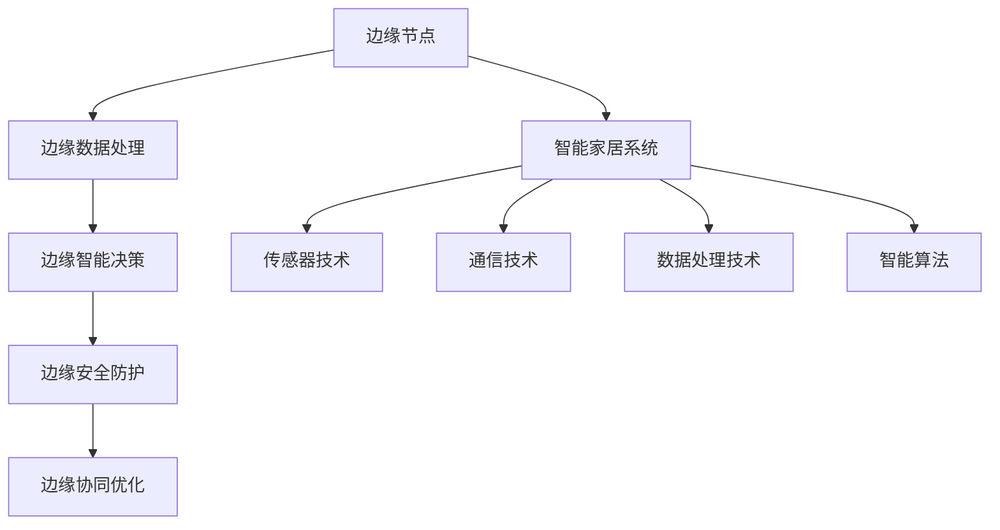
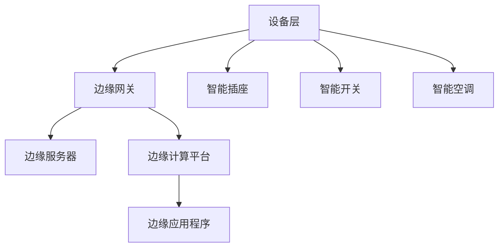
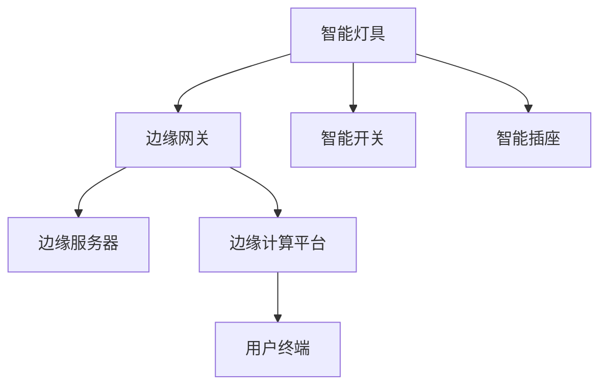
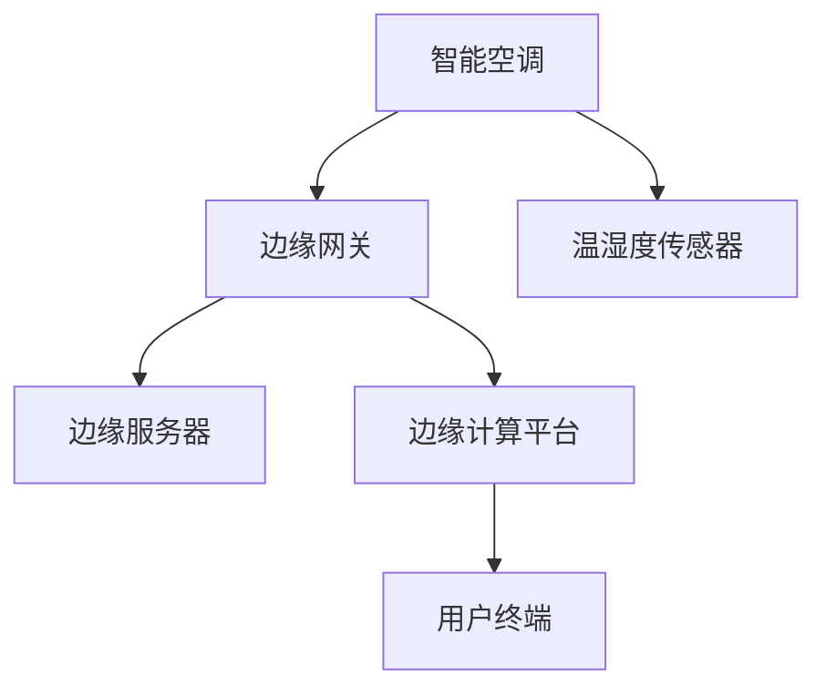

                 

### 边缘计算在智能家居能源管理中的应用

---

# 边缘计算在智能家居能源管理中的应用

## 关键词

- 边缘计算
- 智能家居
- 能源管理
- 智能照明
- 智能空调
- 能源效率
- 安全性

## 摘要

随着物联网和人工智能技术的发展，智能家居系统正逐步融入我们的日常生活。然而，随之而来的能源消耗和管理问题也日益凸显。边缘计算作为一种新型的计算模式，通过在靠近数据源的地方进行数据处理，可以有效减轻云计算中心的负担，提高数据处理的实时性和安全性。本文旨在探讨边缘计算在智能家居能源管理中的应用，分析其在智能照明和智能空调系统中的具体实现，并探讨相应的算法优化和安全措施。通过对实际案例的分析，本文总结出了一些最佳实践，为未来智能家居能源管理的发展提供了有益的参考。

---

### 第1章 绪论

#### 1.1 边缘计算的背景与意义

##### 1.1.1 边缘计算的发展历程

边缘计算这一概念起源于分布式计算和移动计算的研究领域。早在1990年代，分布式计算便已开始探讨如何在网络边缘进行数据处理，以减少对中心服务器的依赖。进入21世纪，随着物联网（IoT）的兴起，边缘计算逐渐受到关注。物联网设备的激增产生了大量的数据，如何快速、高效地处理这些数据成为了研究的热点。边缘计算通过在网络边缘部署计算节点，实现了数据处理的去中心化，从而降低了延迟、减少了带宽消耗。

##### 1.1.2 边缘计算的优势与挑战

边缘计算具有以下优势：

1. **降低延迟**：通过在数据产生的地方进行计算，减少了数据传输的距离和时间，从而降低了系统的响应时间。
2. **减轻网络负担**：边缘计算将部分计算任务分配到网络边缘，减轻了中心服务器的负担，提高了网络的整体性能。
3. **提高隐私保护**：数据在边缘设备上处理，减少了数据传输过程中的泄露风险。

然而，边缘计算也面临一些挑战：

1. **计算资源有限**：边缘设备的计算能力通常有限，需要优化算法和资源管理策略。
2. **异构性**：不同的边缘设备具有不同的硬件和软件配置，需要设计通用的解决方案。
3. **安全性**：边缘设备的安全性相对较低，需要加强安全防护措施。

#### 1.2 智能家居能源管理的现状与发展趋势

##### 1.2.1 智能家居的定义与分类

智能家居是指通过物联网技术将家庭中的各种设备和系统连接起来，实现自动化控制和智能化管理。根据应用领域，智能家居可以分为以下几类：

1. **智能安防系统**：包括入侵检测、视频监控、门锁管理等。
2. **智能照明系统**：包括智能开关、灯光调光、智能窗帘等。
3. **智能家电系统**：包括智能电视、空调、洗衣机、冰箱等。
4. **智能环境控制系统**：包括温度、湿度、空气质量等。
5. **智能能源管理系统**：包括能源监控、能耗分析、能源优化等。

##### 1.2.2 智能家居能源管理的重要性

智能家居系统在日常生活中的广泛应用，带来了显著的能源消耗。据统计，全球家庭能源消耗已占总能源消耗的近30%。因此，如何有效管理智能家居系统的能源消耗，提高能源利用效率，成为了智能家居发展的重要课题。

#### 1.3 边缘计算在智能家居能源管理中的应用

边缘计算在智能家居能源管理中的应用主要体现在以下几个方面：

1. **实时能耗监测与预测**：通过在边缘设备上实时处理传感器数据，可以快速获取家庭的能耗状况，并预测未来的能耗趋势，从而优化能源使用策略。
2. **智能设备联动与控制**：边缘计算可以实现智能家居设备的联动控制，例如根据室内温度自动调节空调，根据光线强度自动调节灯光等，从而实现节能效果。
3. **能源优化与调度**：通过边缘计算平台，可以对家庭能源使用进行优化和调度，例如在用电低谷期进行电器的集中使用，以降低整体能源成本。

---

### 第2章 边缘计算核心概念与原理

#### 2.1 边缘计算的定义与特点

##### 2.1.1 边缘计算的起源与发展历程

边缘计算这一概念起源于分布式计算和移动计算的研究领域。早在1990年代，分布式计算便已开始探讨如何在网络边缘进行数据处理，以减少对中心服务器的依赖。进入21世纪，随着物联网（IoT）的兴起，边缘计算逐渐受到关注。物联网设备的激增产生了大量的数据，如何快速、高效地处理这些数据成为了研究的热点。边缘计算通过在网络边缘部署计算节点，实现了数据处理的去中心化，从而降低了延迟、减少了带宽消耗。

##### 2.1.2 边缘计算的核心概念

边缘计算的核心概念包括：

1. **边缘节点**：边缘计算的基础设施，包括各种边缘设备、网关和服务器等。
2. **边缘网络**：连接边缘节点的通信网络，包括Wi-Fi、5G、LoRa等。
3. **边缘平台**：提供边缘计算服务的软件平台，包括计算框架、数据库、中间件等。
4. **边缘应用程序**：运行在边缘平台上的应用程序，用于实现特定的功能。

##### 2.1.3 边缘计算的关键技术

边缘计算的关键技术包括：

1. **边缘数据处理**：对数据在边缘节点上进行处理和分析，实现数据的本地化处理。
2. **边缘智能**：利用边缘设备的计算能力，实现本地智能决策。
3. **边缘安全**：保护边缘设备不受恶意攻击，确保数据的安全和隐私。
4. **边缘协同**：通过边缘节点之间的协同工作，提高系统的整体性能。

#### 2.2 智能家居能源管理的基本概念

##### 2.2.1 智能家居的定义与功能

智能家居是指通过物联网技术将家庭中的各种设备和系统连接起来，实现自动化控制和智能化管理。智能家居系统具有以下功能：

1. **自动化控制**：通过远程控制和自动化程序，实现家庭设备的自动化操作。
2. **远程监控**：用户可以远程监控家庭的安全状况和设备运行状态。
3. **节能管理**：通过智能调节设备运行状态，实现家庭能源的节约和优化。

##### 2.2.2 智能家居能源管理的关键技术

智能家居能源管理的关键技术包括：

1. **传感器技术**：用于实时监测家庭能耗数据。
2. **通信技术**：用于实现设备和系统之间的通信。
3. **数据处理技术**：用于对能耗数据进行处理和分析。
4. **智能算法**：用于优化能源使用和设备控制。

#### 2.3 边缘计算在智能家居能源管理中的核心概念与联系

边缘计算在智能家居能源管理中的应用，主要体现在以下几个方面：

1. **边缘数据处理**：通过边缘节点对家庭能耗数据进行实时处理和分析，实现本地化的能耗监测和预测。
2. **边缘智能决策**：利用边缘设备的计算能力，实现本地智能决策，如自动调节设备运行状态，实现节能控制。
3. **边缘安全防护**：通过边缘节点的安全防护措施，确保家庭数据和系统的安全。
4. **边缘协同优化**：通过边缘节点之间的协同工作，实现智能家居能源管理的优化和调度。

下面是边缘计算在智能家居能源管理中的核心概念与联系架构 Mermaid 流程图：

---

### 第3章 边缘计算架构设计

#### 3.1 边缘计算架构概述

##### 3.1.1 边缘计算系统的层级结构

边缘计算系统通常分为三层：设备层、网络层和应用层。

1. **设备层**：包括各种边缘设备，如传感器、智能家电、网关等，负责数据的采集和初步处理。
2. **网络层**：包括边缘网关和边缘服务器，负责数据的传输和存储，以及边缘计算服务的提供。
3. **应用层**：包括各种基于边缘计算的应用，如智能家居系统、工业自动化系统等。

##### 3.1.2 边缘计算的关键组件

边缘计算的关键组件包括：

1. **边缘设备**：负责数据采集和初步处理，如传感器、智能家电等。
2. **边缘网关**：负责数据传输、路由和初步处理，同时提供边缘计算服务。
3. **边缘服务器**：提供高性能计算和存储服务，支持大规模数据处理和分析。
4. **边缘平台**：提供边缘计算服务的框架和工具，如边缘数据库、边缘中间件等。
5. **边缘应用程序**：运行在边缘平台上的应用程序，实现特定的功能。

#### 3.2 智能家居能源管理中的边缘计算架构

##### 3.2.1 边缘计算在智能家居能源管理中的应用场景

在智能家居能源管理中，边缘计算的应用场景主要包括：

1. **实时能耗监测**：通过边缘设备实时采集家庭能耗数据，并上传至边缘服务器进行分析和处理。
2. **智能设备联动控制**：通过边缘计算实现智能家居设备的联动控制，如根据室内温度自动调节空调，根据光线强度自动调节灯光等。
3. **能源优化与调度**：通过边缘计算平台对家庭能源使用进行优化和调度，如根据用电低谷期进行电器的集中使用，降低整体能源成本。

##### 3.2.2 边缘计算在智能家居能源管理中的架构设计

边缘计算在智能家居能源管理中的架构设计包括以下几个方面：

1. **设备层**：部署各种边缘设备，如智能插座、智能开关、智能空调等，用于实时采集家庭能耗数据。
2. **网络层**：部署边缘网关，用于将设备层数据传输至边缘服务器，并提供边缘计算服务。
3. **应用层**：部署边缘计算平台和边缘应用程序，用于处理和分析能耗数据，实现智能家居能源管理的功能。

边缘计算在智能家居能源管理中的架构设计如图所示：

---

### 第4章 边缘计算在智能家居能源管理中的应用案例

#### 4.1 案例一：智能照明系统的边缘计算应用

##### 4.1.1 智能照明系统的概述

智能照明系统是一种基于物联网技术的照明控制系统，可以通过手机APP、语音控制、手动开关等方式进行控制。智能照明系统的主要功能包括：

1. **远程控制**：用户可以通过手机APP远程控制照明设备的开关、亮度和色温。
2. **定时开关**：用户可以设置照明设备的定时开关，实现自动化控制。
3. **智能场景**：根据不同的场景，如休闲、工作、睡眠等，智能调节照明设备的亮度和色温。

##### 4.1.2 智能照明系统的边缘计算架构设计

智能照明系统的边缘计算架构设计主要包括以下几个部分：

1. **边缘设备层**：包括智能灯具、智能开关、智能插座等，用于实时采集照明设备的运行状态和能耗数据。
2. **边缘网关层**：包括边缘网关，用于将设备层数据传输至边缘服务器，并提供边缘计算服务。
3. **边缘服务器层**：包括边缘服务器和边缘计算平台，用于处理和分析设备层数据，实现智能照明系统的功能。
4. **应用层**：包括用户终端（手机APP、语音控制设备等），用于与边缘计算平台进行交互，实现照明设备的远程控制。

智能照明系统的边缘计算架构设计如图所示：

##### 4.1.3 智能照明系统的边缘计算实现与效果评估

智能照明系统的边缘计算实现主要包括以下几个方面：

1. **边缘数据处理**：边缘设备实时采集照明设备的运行状态和能耗数据，并通过边缘网关上传至边缘服务器。
2. **边缘智能决策**：边缘计算平台对采集到的数据进行处理和分析，实现智能照明系统的功能，如远程控制、定时开关、智能场景等。
3. **边缘协同优化**：边缘计算平台通过边缘网关与其他边缘设备进行协同工作，实现照明设备的联动控制，提高能源利用效率。

智能照明系统的边缘计算实现效果评估如下：

1. **能耗降低**：通过智能照明系统的边缘计算实现，可以实时监测照明设备的能耗情况，并根据实际需要调整照明设备的亮度，实现能耗的降低。
2. **响应速度提高**：由于数据在边缘设备上进行处理，减少了数据传输的距离和时间，提高了系统的响应速度，用户体验得到提升。
3. **设备维护降低**：通过边缘计算实现设备状态的实时监测和预警，可以提前发现设备故障，减少设备维护成本。

#### 4.2 案例二：智能空调系统的边缘计算应用

##### 4.2.1 智能空调系统的概述

智能空调系统是一种基于物联网技术的空调控制系统，可以通过手机APP、语音控制、手动开关等方式进行控制。智能空调系统的主要功能包括：

1. **远程控制**：用户可以通过手机APP远程控制空调的开关、温度、风速等。
2. **自动调节**：空调系统可以自动调节温度和风速，实现舒适的室内环境。
3. **节能模式**：空调系统可以根据室内温度和湿度自动切换到节能模式，降低能源消耗。

##### 4.2.2 智能空调系统的边缘计算架构设计

智能空调系统的边缘计算架构设计主要包括以下几个部分：

1. **边缘设备层**：包括智能空调、温湿度传感器等，用于实时采集室内温度、湿度等环境数据。
2. **边缘网关层**：包括边缘网关，用于将设备层数据传输至边缘服务器，并提供边缘计算服务。
3. **边缘服务器层**：包括边缘服务器和边缘计算平台，用于处理和分析设备层数据，实现智能空调系统的功能。
4. **应用层**：包括用户终端（手机APP、语音控制设备等），用于与边缘计算平台进行交互，实现空调的远程控制。

智能空调系统的边缘计算架构设计如图所示：

##### 4.2.3 智能空调系统的边缘计算实现与效果评估

智能空调系统的边缘计算实现主要包括以下几个方面：

1. **边缘数据处理**：边缘设备实时采集室内温度、湿度等环境数据，并通过边缘网关上传至边缘服务器。
2. **边缘智能决策**：边缘计算平台对采集到的数据进行分析和处理，实现智能空调系统的功能，如自动调节温度和风速，实现节能模式等。
3. **边缘协同优化**：边缘计算平台通过边缘网关与其他边缘设备进行协同工作，实现空调系统的联动控制，提高能源利用效率。

智能空调系统的边缘计算实现效果评估如下：

1. **能源消耗降低**：通过智能空调系统的边缘计算实现，可以实时监测室内环境数据，并根据实际需要自动调节空调的运行状态，实现能源的节约和优化。
2. **响应速度提高**：由于数据在边缘设备上进行处理，减少了数据传输的距离和时间，提高了系统的响应速度，用户体验得到提升。
3. **设备维护降低**：通过边缘计算实现设备状态的实时监测和预警，可以提前发现设备故障，减少设备维护成本。

---

### 第5章 边缘计算在智能家居能源管理中的算法研究

#### 5.1 能源管理算法的基本原理

##### 5.1.1 能源管理算法的定义与分类

能源管理算法是指用于优化和控制能源使用的一系列算法。根据应用场景和目标，能源管理算法可以分为以下几类：

1. **能耗监测与预测算法**：通过对历史能耗数据进行分析和建模，预测未来的能耗趋势，为能源管理提供依据。
2. **节能控制算法**：根据实时能耗数据和室内环境参数，自动调整设备的运行状态，实现能源的节约和优化。
3. **能源调度算法**：根据电网负荷和能源供应情况，优化能源的分配和调度，实现能源的高效利用。

##### 5.1.2 常用的能源管理算法

常用的能源管理算法包括：

1. **线性规划算法**：通过建立能耗优化模型，求解最优能耗控制策略。
2. **遗传算法**：通过模拟自然进化过程，搜索最优能耗控制策略。
3. **神经网络算法**：通过训练神经网络模型，实现能耗预测和优化。
4. **模糊控制算法**：通过模糊逻辑推理，实现设备的自适应控制。

#### 5.2 边缘计算环境下的能源管理算法优化

##### 5.2.1 边缘计算环境下的算法挑战

在边缘计算环境下，能源管理算法面临以下挑战：

1. **计算资源有限**：边缘设备的计算能力相对有限，需要优化算法设计，减少计算资源的需求。
2. **数据噪声与不确定性**：边缘设备采集的数据可能存在噪声和不确定性，需要设计鲁棒性强的算法。
3. **实时性要求**：边缘计算环境下的能源管理算法需要满足实时性要求，快速响应能耗变化。

##### 5.2.2 能源管理算法在边缘计算环境下的优化方法

为了在边缘计算环境下优化能源管理算法，可以采取以下方法：

1. **数据预处理**：对采集到的数据进行预处理，包括滤波、去噪、数据清洗等，提高数据质量。
2. **分布式算法**：设计分布式算法，将计算任务分配到多个边缘设备，利用多设备的计算能力提高算法性能。
3. **轻量级算法**：设计轻量级算法，减少算法的复杂度，降低计算资源的消耗。
4. **模型压缩与量化**：通过模型压缩和量化技术，减少模型的存储和计算需求。

---

### 第6章 边缘计算在智能家居能源管理中的安全性问题

#### 6.1 安全性问题的背景与重要性

随着智能家居系统的普及，用户隐私和数据安全成为了一个不可忽视的问题。边缘计算在智能家居能源管理中的应用，进一步增加了系统的安全风险。边缘设备通常部署在用户家中，与家庭网络直接相连，容易成为攻击者入侵的入口。因此，确保边缘计算在智能家居能源管理中的安全性至关重要。

##### 6.1.1 智能家居能源管理的安全性挑战

1. **数据泄露风险**：智能家居系统采集和传输的能耗数据可能包含用户隐私信息，如生活习惯、经济状况等，如果数据泄露，将对用户隐私造成严重威胁。
2. **设备控制风险**：攻击者可以通过入侵智能家居系统，控制家庭设备，如智能灯泡、智能插座等，对用户造成财产损失或安全隐患。
3. **网络攻击风险**：智能家居系统连接到互联网，可能成为网络攻击的目标，如DDoS攻击、恶意软件传播等。

##### 6.1.2 边缘计算在智能家居能源管理中的安全挑战

1. **设备安全**：边缘设备通常资源有限，安全防护能力较弱，容易成为攻击者的攻击目标。
2. **数据传输安全**：边缘设备与云端服务器之间的数据传输可能未加密，容易遭受中间人攻击。
3. **系统更新安全**：边缘设备的操作系统和应用程序可能存在漏洞，系统更新时可能引入新的风险。

#### 6.2 边缘计算在智能家居能源管理中的安全措施

为了确保边缘计算在智能家居能源管理中的安全性，可以采取以下安全措施：

1. **设备安全加固**：对边缘设备进行安全加固，包括安装防火墙、安全补丁等，提高设备的安全性。
2. **数据加密传输**：对边缘设备与云端服务器之间的数据进行加密传输，防止数据泄露。
3. **访问控制**：实施严格的访问控制策略，确保只有授权用户可以访问敏感数据和服务。
4. **安全审计**：定期进行安全审计，检测系统中的安全漏洞和异常行为。

---

### 第7章 总结与展望

#### 7.1 边缘计算在智能家居能源管理中的应用总结

边缘计算在智能家居能源管理中发挥了重要作用，通过在边缘设备上进行数据处理和分析，实现了实时能耗监测、智能设备联动控制、能源优化与调度等功能。边缘计算不仅提高了系统的实时性和响应速度，还降低了网络负担，提高了能源利用效率。同时，通过边缘计算实现的安全防护措施，有效保障了用户隐私和数据安全。

#### 7.2 边缘计算在智能家居能源管理中的应用展望

随着物联网和人工智能技术的不断发展，边缘计算在智能家居能源管理中的应用前景广阔。未来，可以预期以下发展趋势：

1. **智能化水平提升**：通过更先进的算法和智能技术，提高智能家居能源管理的智能化水平，实现更高效、更精准的能源优化和调度。
2. **安全性增强**：随着安全技术的不断发展，边缘计算在智能家居能源管理中的安全性将得到进一步提升，保障用户隐私和数据安全。
3. **跨领域融合**：边缘计算技术将与其他领域（如智能交通、智能医疗等）进行深度融合，推动智能家居能源管理向更广泛的领域拓展。
4. **标准化与规范化**：随着边缘计算在智能家居能源管理中的应用越来越广泛，相关标准和规范的制定将逐步完善，推动行业的健康发展。

#### 7.3 未来研究方向与挑战

1. **边缘智能技术**：如何进一步提高边缘设备的计算能力和智能化水平，实现更加高效、智能的边缘计算。
2. **数据安全与隐私保护**：如何在保障用户隐私和数据安全的前提下，实现高效的边缘计算。
3. **跨领域应用**：如何将边缘计算技术与其他领域进行深度融合，实现更广泛的应用场景。
4. **标准化与规范化**：如何制定统一的标准和规范，推动边缘计算在智能家居能源管理中的健康发展。

---

### 辅助资源

#### 8.1 边缘计算开源框架介绍

##### 8.1.1 边缘计算开源框架概述

边缘计算开源框架是指基于开源协议发布的、用于实现边缘计算功能的软件框架。常见的边缘计算开源框架包括：

1. **边缘计算框架**：用于实现边缘计算功能的通用框架，如Kubernetes、EdgeX Foundry等。
2. **边缘AI框架**：用于在边缘设备上实现人工智能功能的框架，如TensorFlow Lite、PyTorch Mobile等。
3. **边缘数据处理框架**：用于实现边缘数据处理功能的框架，如Apache Flink、Apache Kafka等。

##### 8.1.2 边缘计算开源框架的应用场景

边缘计算开源框架可以应用于以下场景：

1. **智能家居**：用于实现智能家居设备的边缘计算功能，如实时数据处理、智能控制等。
2. **工业互联网**：用于实现工业设备的边缘计算功能，如设备监控、数据分析等。
3. **智能交通**：用于实现智能交通系统的边缘计算功能，如车辆监控、路况预测等。

##### 8.1.3 常用边缘计算开源框架简介

以下是一些常用的边缘计算开源框架：

1. **Kubernetes**：一个用于容器编排的开源框架，支持在边缘设备上部署和管理容器化应用程序。
2. **EdgeX Foundry**：一个用于构建边缘设备的开源框架，提供设备管理、数据存储、数据处理等功能。
3. **TensorFlow Lite**：一个用于在边缘设备上运行机器学习模型的框架，支持多种硬件平台和操作系统。

#### 8.2 智能家居能源管理相关标准与规范

##### 8.2.1 智能家居能源管理标准的概述

智能家居能源管理标准是指用于规范智能家居能源管理系统的设计、开发、测试、实施和维护等方面的标准。常见的智能家居能源管理标准包括：

1. **国际标准**：如ISO/IEC 27001（信息安全管理系统）、ISO/IEC 50001（能源管理体系）等。
2. **国家标准**：如GB/T 18877（智能家居系统技术规范）、GB/T 31960.1-2015（智能家居安全规范）等。
3. **行业标准**：如IEEE 2030.5（智能家居能源管理规范）、IIC Smart Energy Profile等。

##### 8.2.2 国内外智能家居能源管理标准的对比

国内外智能家居能源管理标准在内容、范围和实施程度上存在一定差异。以下是对国内外智能家居能源管理标准的一些对比：

1. **内容**：国际标准侧重于信息安全、能源管理等方面，而国内标准则更多地涉及智能家居系统的技术规范、接口标准等。
2. **范围**：国际标准涉及多个领域，如家电、照明、安防等，而国内标准则更多聚焦于家电领域。
3. **实施程度**：国际标准在实施上相对成熟，国内标准则在推广和实施过程中面临一些挑战。

##### 8.2.3 智能家居能源管理标准的应用

智能家居能源管理标准在智能家居系统的设计、开发、测试、实施和维护过程中具有重要的指导作用。以下是一些应用实例：

1. **设计**：遵循智能家居能源管理标准，可以确保智能家居系统的设计符合规范要求，提高系统的可靠性。
2. **开发**：遵循智能家居能源管理标准，可以确保智能家居系统的开发过程遵循最佳实践，提高开发效率。
3. **测试**：遵循智能家居能源管理标准，可以确保智能家居系统的测试过程符合规范要求，提高系统的质量。
4. **实施**：遵循智能家居能源管理标准，可以确保智能家居系统的实施过程符合规范要求，提高系统的实用性。
5. **维护**：遵循智能家居能源管理标准，可以确保智能家居系统的维护过程符合规范要求，提高系统的可持续性。

#### 8.3 辅助资源总结

##### 8.3.1 边缘计算开源框架与智能家居能源管理标准的重要性

边缘计算开源框架和智能家居能源管理标准在智能家居能源管理中具有重要作用。边缘计算开源框架提供了丰富的工具和资源，支持开发者快速实现边缘计算功能。智能家居能源管理标准则为智能家居系统的设计、开发、测试、实施和维护提供了统一的规范，确保系统的可靠性和质量。

##### 8.3.2 如何选择合适的边缘计算开源框架与智能家居能源管理标准

在选择合适的边缘计算开源框架和智能家居能源管理标准时，需要考虑以下几个方面：

1. **应用场景**：根据具体的智能家居能源管理应用场景，选择适合的边缘计算开源框架和智能家居能源管理标准。
2. **技术要求**：根据系统技术要求，选择具备相应技术支持和功能支持的边缘计算开源框架和智能家居能源管理标准。
3. **实施难度**：考虑边缘计算开源框架和智能家居能源管理标准的实施难度，选择易于实施和维护的标准。
4. **社区支持**：选择具有活跃社区支持的边缘计算开源框架和智能家居能源管理标准，确保能够获得及时的技术支持和帮助。

---

### 附录

#### 8.4 附录

##### 8.4.1 边缘计算相关参考资料

1. **《边缘计算：技术、应用与展望》**：本书系统地介绍了边缘计算的技术原理、应用场景和发展趋势，适合从事边缘计算研究和应用的人员阅读。
2. **《边缘计算技术导论》**：本书从基础概念到实际应用，全面介绍了边缘计算的技术原理、架构设计和应用案例，适合边缘计算初学者和从业者。
3. **《边缘智能：理论与应用》**：本书重点介绍了边缘智能的理论基础、算法实现和应用案例，适合对边缘智能感兴趣的读者。

##### 8.4.2 智能家居能源管理相关参考资料

1. **《智能家居能源管理技术》**：本书详细介绍了智能家居能源管理的技术原理、系统架构和关键技术，适合智能家居能源管理领域的从业人员。
2. **《智能家居系统设计与实现》**：本书从系统设计的角度，介绍了智能家居系统的整体架构、关键技术及实现方法，适合智能家居系统的开发者。
3. **《智能家居能源管理标准与应用》**：本书系统阐述了智能家居能源管理标准的制定背景、内容框架和应用实践，适合从事智能家居能源管理标准制定和实施的从业人员。

##### 8.4.3 实验指导与习题解答

1. **实验指导**：本书提供了针对边缘计算和智能家居能源管理相关知识的实验指导，包括实验目的、实验步骤、实验数据和实验报告等内容。
2. **习题解答**：本书提供了针对边缘计算和智能家居能源管理相关知识的习题解答，帮助读者理解和掌握相关知识。

---

### 作者信息

作者：AI天才研究院/AI Genius Institute & 禅与计算机程序设计艺术 /Zen And The Art of Computer Programming

