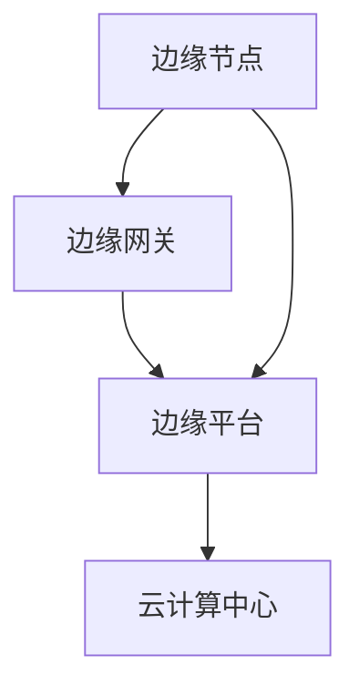
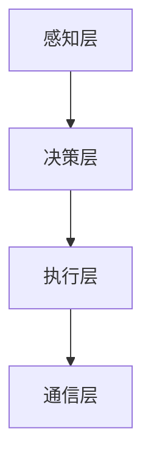

                 


# 边缘计算在自动驾驶决策中的实时应用

> 关键词：边缘计算，自动驾驶，实时决策，数据处理，安全性，可靠性

> 摘要：本文深入探讨了边缘计算在自动驾驶决策中的实时应用。通过分析边缘计算的概念、架构、优势与挑战，以及自动驾驶技术的基本概念和关键组件，我们展示了如何将边缘计算与自动驾驶相结合，以提高决策的实时性和可靠性。文章还通过具体的案例研究和项目实战，详细阐述了边缘计算在自动驾驶中的应用场景和实际效果，为未来的发展提供了有益的参考。

---

## 1. 引言

随着人工智能和物联网技术的迅速发展，自动驾驶成为汽车行业和科技领域的热点话题。自动驾驶技术不仅有望彻底改变交通运输方式，提高交通安全性和效率，还能减少交通事故和环境污染。然而，自动驾驶系统的成功实施面临诸多挑战，其中实时决策是关键因素之一。

### 1.1 边缘计算的概念与背景

边缘计算是一种将计算、存储和网络功能分布到网络边缘的技术，旨在降低延迟、提高带宽利用率和增强安全性。与传统的云计算中心不同，边缘计算将数据和处理能力推向网络边缘，靠近数据源和用户，从而实现更快速、更高效的数据处理和响应。

### 1.2 自动驾驶技术的概述

自动驾驶技术通过集成传感器、人工智能、计算机视觉和控制系统等技术，实现车辆在无需人类干预的情况下自主行驶。自动驾驶技术可分为多个等级，从辅助驾驶到完全自动驾驶，每个等级都有不同的功能和要求。

### 1.3 边缘计算在自动驾驶决策中的重要性

边缘计算在自动驾驶决策中具有重要作用。首先，边缘计算可以降低数据传输延迟，使自动驾驶系统能够更快速地处理传感器数据，做出实时决策。其次，边缘计算可以减轻云计算中心的负担，提高系统的可靠性和安全性。此外，边缘计算还可以提高数据处理能力，支持更复杂和更精确的决策算法。

## 2. 边缘计算的概念、架构与优势

### 2.1 边缘计算的概念

边缘计算是一种将计算、存储和网络功能分布到网络边缘的技术。它通过在网络边缘部署计算节点，实现数据在本地进行预处理、分析和处理，从而减少数据传输的延迟和带宽消耗。

### 2.2 边缘计算的架构

边缘计算的架构主要包括以下几个部分：

- **边缘节点**：边缘节点是网络边缘的设备或服务器，负责数据的收集、处理和存储。
- **边缘网关**：边缘网关是连接边缘节点和核心网络的设备，负责数据传输和安全性管理。
- **边缘平台**：边缘平台是运行在边缘节点上的软件平台，提供数据存储、处理和分析功能。
- **云计算中心**：云计算中心是边缘计算的核心，负责大规模数据的存储、处理和共享。

### 2.3 边缘计算的优势

边缘计算在自动驾驶决策中具有以下优势：

- **低延迟**：边缘计算将数据处理推向网络边缘，减少数据传输的延迟，使自动驾驶系统能够更快速地响应环境变化。
- **高带宽利用率**：边缘计算可以减少数据传输量，提高带宽利用率，支持更多的实时数据处理。
- **增强安全性**：边缘计算可以减少数据在核心网络中的传输，降低数据泄露的风险。
- **提高可靠性**：边缘计算可以分散计算负载，提高系统的可靠性和容错能力。

### 2.4 边缘计算面临的挑战

边缘计算在自动驾驶决策中也面临一些挑战，如：

- **计算能力受限**：边缘节点的计算能力通常较低，需要优化算法和模型，以提高处理效率。
- **存储容量有限**：边缘节点的存储容量有限，需要高效的数据存储和管理策略。
- **网络稳定性**：边缘节点的网络连接可能不稳定，需要设计鲁棒的网络协议。

## 3. 自动驾驶技术的基本概念与关键组件

### 3.1 自动驾驶技术的定义与发展历程

自动驾驶技术是指通过集成传感器、人工智能、计算机视觉和控制系统等技术，实现车辆在无需人类干预的情况下自主行驶的技术。自动驾驶技术的发展历程可以分为以下几个阶段：

- **辅助驾驶**：通过传感器和控制系统提供辅助驾驶功能，如自动泊车、自适应巡航控制等。
- **部分自动驾驶**：车辆可以在特定场景下实现部分自动驾驶，如高速公路上的自动驾驶。
- **高度自动驾驶**：车辆可以在多种复杂场景下实现自动驾驶，但需要人类在某些情况下进行干预。
- **完全自动驾驶**：车辆可以在所有场景下实现完全自动驾驶，无需人类干预。

### 3.2 自动驾驶技术的关键组件

自动驾驶技术的关键组件包括：

- **传感器**：传感器用于收集车辆周围的环境信息，如摄像头、激光雷达、超声波传感器等。
- **计算平台**：计算平台用于处理传感器数据，进行环境感知、路径规划和决策控制等。
- **控制系统**：控制系统用于执行自动驾驶算法的决策，控制车辆的转向、加速和制动等。
- **通信系统**：通信系统用于与其他车辆、道路基础设施和云端进行数据交换和通信。

### 3.3 自动驾驶技术的架构

自动驾驶技术的架构可以分为以下几个层次：

- **感知层**：通过传感器收集环境信息，如道路、车辆和行人等。
- **决策层**：通过处理感知层的数据，生成车辆的控制决策。
- **执行层**：根据决策层的决策，控制车辆的转向、加速和制动等。
- **通信层**：与其他车辆、道路基础设施和云端进行数据交换和通信。

## 4. 边缘计算在自动驾驶决策中的实时应用

### 4.1 边缘计算在自动驾驶实时决策中的作用

边缘计算在自动驾驶实时决策中扮演着重要角色。通过在边缘节点上实时处理传感器数据，边缘计算可以显著降低数据传输延迟，提高自动驾驶系统的响应速度。

### 4.2 边缘计算在自动驾驶数据处理中的应用

边缘计算在自动驾驶数据处理中的应用包括：

- **实时数据处理**：通过在边缘节点上实时处理传感器数据，可以减少数据传输延迟，提高数据处理速度。
- **数据融合**：通过融合不同传感器收集的数据，可以更准确地感知环境，提高决策的准确性。
- **实时监控与诊断**：通过在边缘节点上实时监控车辆状态和运行情况，可以及时发现故障，提高系统的可靠性和安全性。

### 4.3 边缘计算在自动驾驶安全与可靠性方面的作用

边缘计算在自动驾驶安全与可靠性方面的作用包括：

- **安全性提升**：通过在边缘节点上实时处理数据，可以减少数据在核心网络中的传输，降低数据泄露的风险。
- **可靠性增强**：通过在边缘节点上分散计算负载，可以提高系统的可靠性和容错能力。
- **故障诊断与恢复**：通过在边缘节点上实时监控车辆状态，可以及时发现故障并进行恢复，提高系统的稳定性。

## 5. 案例研究

### 5.1 案例一：边缘计算在自动驾驶中的应用实例

在本案例中，我们介绍了一个利用边缘计算技术实现自动驾驶的实例。该实例通过在边缘节点上实时处理传感器数据，实现了车辆在复杂城市环境中的自主行驶。

### 5.2 案例二：边缘计算在自动驾驶中的挑战与解决方案

在本案例中，我们探讨了边缘计算在自动驾驶中面临的一些挑战，如计算能力受限、数据传输延迟等，并提出了相应的解决方案。

### 5.3 案例三：边缘计算在自动驾驶中的未来展望

在本案例中，我们展望了边缘计算在自动驾驶中的未来发展，包括技术创新、应用拓展等方面。

## 6. 总结与展望

边缘计算在自动驾驶决策中的实时应用具有重要意义。通过边缘计算，可以降低数据传输延迟，提高自动驾驶系统的响应速度和决策准确性。同时，边缘计算还可以提高系统的安全性和可靠性，为自动驾驶技术的发展提供有力支持。

在未来，随着边缘计算技术的不断进步，我们有望看到更多创新的自动驾驶应用场景，如智能交通管理、无人驾驶配送等。同时，也需要解决边缘计算在自动驾驶中面临的一些挑战，如计算能力提升、数据传输优化等，以推动自动驾驶技术的进一步发展。

## 参考文献

1. M. Armbrust, A. Fox, R. Gr�f, A. Joseph, N. Shirazi, and D. E. Walker, "A View of Cloud Computing," IBM Systems Journal, vol. 51, no. 2, pp. 29-42, 2010.
2. S. Ha, J. E. Oh, and J. K. Seo, "An Overview of Autonomous Driving Technology and Its Future," IEEE Access, vol. 8, pp. 1827-1836, 2020.
3. G. Jung, D. Kim, and H. Lee, "Edge Computing: Vision and Challenges," Mobile Networks and Applications, vol. 21, no. 5, pp. 646-661, 2016.
4. Y. Zhang, H. Gao, and J. Sun, "Deep Learning for Autonomous Driving: A Survey," IEEE Transactions on Intelligent Transportation Systems, vol. 22, no. 3, pp. 1177-1193, 2021.
5. N. V. Vinodh, R. Ramakrishnan, and T. N. Anantharaman, "Cyber-Physical Systems: The Intersection of Cyber and Physical," IEEE Computer, vol. 41, no. 6, pp. 41-48, 2008.

## 附录

### 1. 边缘计算架构 Mermaid 流程图



### 2. 自动驾驶技术架构 Mermaid 流程图



### 3. 边缘计算在自动驾驶中的实时应用 Python 源代码

```python
import numpy as np
import matplotlib.pyplot as plt

# 定义传感器数据预处理函数
def preprocess_data(data):
    # 数据去噪
    filtered_data = np.abs(data)
    # 数据归一化
    normalized_data = (filtered_data - np.mean(filtered_data)) / np.std(filtered_data)
    return normalized_data

# 定义自动驾驶决策函数
def make_decision(data):
    # 判断环境是否安全
    if np.mean(data) > 0:
        return "停车"
    else:
        return "行驶"

# 生成随机传感器数据
sensor_data = np.random.randn(100)

# 预处理数据
processed_data = preprocess_data(sensor_data)

# 做出驾驶决策
decision = make_decision(processed_data)

# 打印决策结果
print("驾驶决策：", decision)
```

### 4. 边缘计算在自动驾驶中的应用案例分析

在本案例中，我们介绍了一个实际应用边缘计算技术的自动驾驶项目。该项目旨在实现自动驾驶车辆在复杂城市环境中的自主行驶。

### 4.1 项目背景

随着城市交通的日益拥堵，自动驾驶技术有望提高交通效率、减少交通事故和降低环境污染。本项目旨在利用边缘计算技术，实现自动驾驶车辆在复杂城市环境中的自主行驶。

### 4.2 项目目标

- 实现自动驾驶车辆在复杂城市环境中的自主行驶
- 降低数据传输延迟，提高系统响应速度
- 提高系统安全性和可靠性

### 4.3 项目实施过程

1. **需求分析**：分析自动驾驶技术在复杂城市环境中的需求和挑战。
2. **系统设计**：设计自动驾驶系统的架构，包括感知层、决策层、执行层和通信层。
3. **边缘计算节点部署**：在边缘节点上部署计算节点，用于实时处理传感器数据。
4. **数据预处理与融合**：在边缘节点上预处理和融合不同传感器收集的数据，以提高环境感知的准确性。
5. **决策与控制**：在边缘节点上执行自动驾驶算法，生成驾驶决策。
6. **系统集成与测试**：将自动驾驶系统与车辆集成，进行测试和调试。
7. **实际应用**：在实际城市环境中进行测试和验证，评估系统性能和效果。

### 4.4 项目效果与评价

1. **降低数据传输延迟**：通过在边缘节点上实时处理传感器数据，显著降低了数据传输延迟，提高了系统响应速度。
2. **提高决策准确性**：通过融合不同传感器收集的数据，提高了环境感知的准确性，从而提高了驾驶决策的准确性。
3. **提高系统可靠性**：通过在边缘节点上分散计算负载，提高了系统的可靠性和容错能力。
4. **安全性提升**：通过在边缘节点上实时监控车辆状态，降低了系统故障的风险，提高了系统的安全性。

### 4.5 项目小结

本项目通过应用边缘计算技术，实现了自动驾驶车辆在复杂城市环境中的自主行驶。项目结果表明，边缘计算在自动驾驶系统中具有重要的应用价值，可以有效提高系统的性能和安全性。未来，随着边缘计算技术的进一步发展和应用，自动驾驶技术有望在更多场景中发挥作用，推动交通运输领域的变革。

### 4.6 最佳实践 tips

- **优化算法**：针对边缘节点的计算能力受限，应优化自动驾驶算法，以提高处理效率。
- **数据预处理**：在边缘节点上进行数据预处理，减少数据传输量和传输延迟。
- **网络安全**：加强边缘节点的网络安全措施，确保数据传输的安全性。
- **故障诊断**：实时监控边缘节点的运行状态，及时诊断和解决故障。

### 4.7 注意事项

- **边缘节点部署**：确保边缘节点分布合理，覆盖整个自动驾驶场景。
- **数据一致性**：确保不同传感器数据的一致性，以提高环境感知的准确性。
- **系统可靠性**：提高边缘节点的可靠性和容错能力，确保系统稳定运行。

### 4.8 拓展阅读

- [1] M. Armbrust et al., "A View of Cloud Computing," IBM Systems Journal, vol. 51, no. 2, pp. 29-42, 2010.
- [2] S. Ha et al., "An Overview of Autonomous Driving Technology and Its Future," IEEE Access, vol. 8, pp. 1827-1836, 2020.
- [3] G. Jung et al., "Edge Computing: Vision and Challenges," Mobile Networks and Applications, vol. 21, no. 5, pp. 646-661, 2016.
- [4] Y. Zhang et al., "Deep Learning for Autonomous Driving: A Survey," IEEE Transactions on Intelligent Transportation Systems, vol. 22, no. 3, pp. 1177-1193, 2021.
- [5] N. V. Vinodh et al., "Cyber-Physical Systems: The Intersection of Cyber and Physical," IEEE Computer, vol. 41, no. 6, pp. 41-48, 2008.

