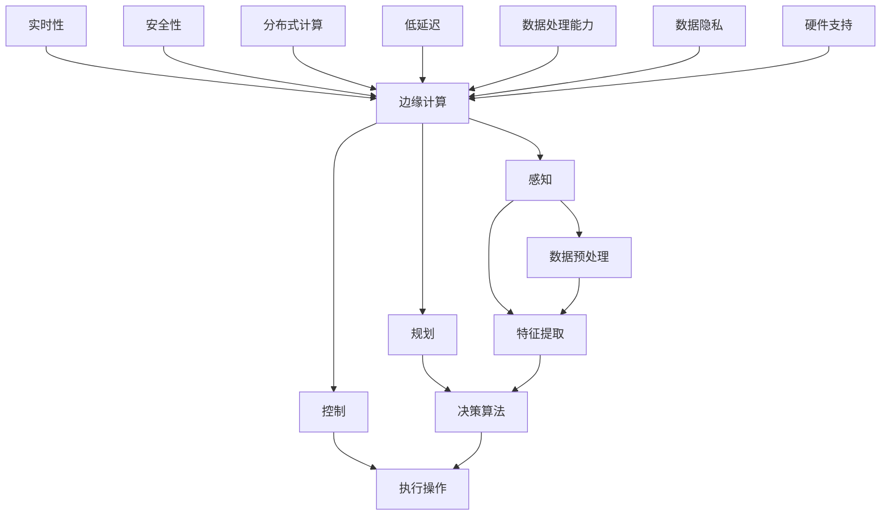
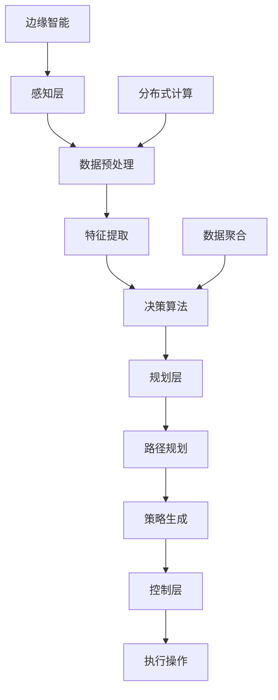
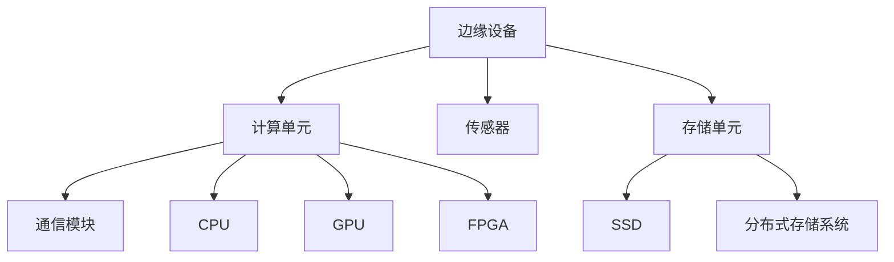
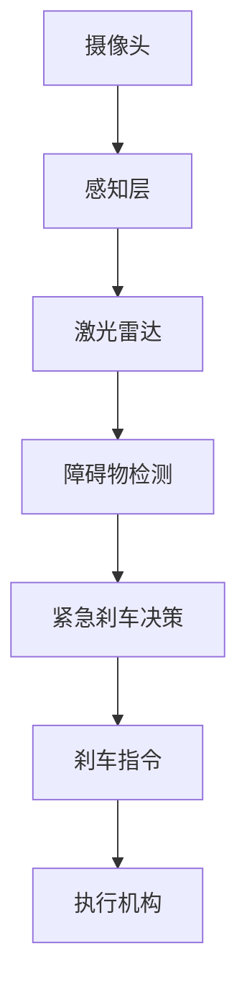
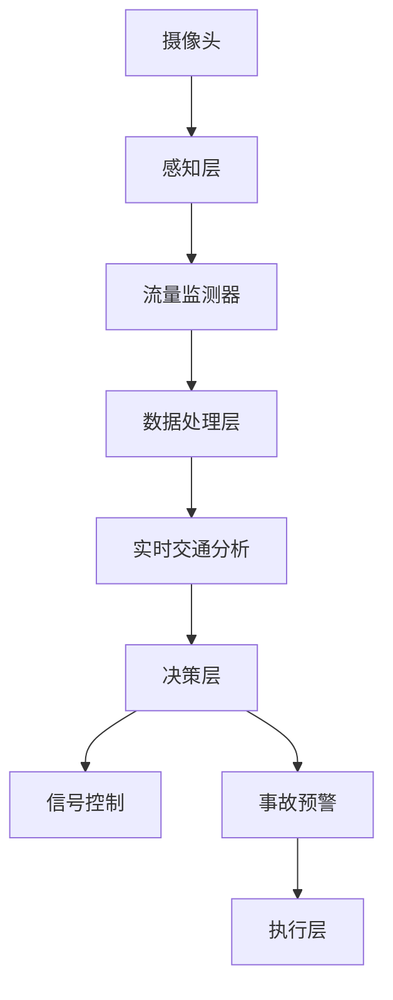

                 

### 1.1 边缘计算的概念与原理

边缘计算（Edge Computing）是一种分布式计算架构，其核心思想是将数据处理、存储和分析等任务从中心化的云计算节点迁移到网络边缘，即在靠近数据源的地方进行处理。这一概念最早出现在物联网（IoT）和移动计算领域，旨在解决传统云计算模式中存在的延迟、带宽限制和安全性问题。

#### 定义与起源

边缘计算的定义可以归纳为：通过在靠近数据产生源的位置（如传感器、设备、基站等）进行数据处理，降低数据传输量，提高数据处理速度和系统响应能力的一种计算架构。

边缘计算起源于对物联网和移动设备处理能力的需求。随着物联网设备和移动设备的数量急剧增加，产生的数据量也迅速膨胀。传统的云计算模式难以满足这些设备的实时数据处理需求，导致延迟和数据传输瓶颈。边缘计算的出现，为解决这些问题提供了一种有效途径。

#### 核心特征

边缘计算具有以下核心特征：

- **接近数据源**：边缘计算在靠近数据产生源的地方进行数据处理，降低了数据传输的距离和延迟。

- **分布式计算**：边缘计算采用了分布式计算架构，将计算任务分散到多个边缘节点上，提高了系统的计算能力和容错能力。

- **实时性**：边缘计算能够实时处理数据，满足低延迟应用的需求。

- **安全性**：边缘计算通过在本地处理数据，减少了数据传输过程中的安全隐患。

#### 边缘计算的体系结构

边缘计算通常包括以下几个层次：

- **设备层**：包括传感器、设备等，负责数据的采集和初步处理。

- **边缘节点层**：包括路由器、基站、智能设备等，负责对采集到的数据进行进一步处理和存储。

- **边缘云层**：包括边缘服务器、数据中心等，提供更高级别的计算和存储服务。

- **中心云层**：负责将边缘计算的结果汇总、存储和进一步处理。

#### 边缘计算的应用场景

边缘计算在多个领域都有广泛的应用，包括但不限于以下几个方面：

- **物联网**：通过边缘计算，可以实现设备的实时监控、状态检测和故障预测。

- **智能交通**：边缘计算可以用于交通流量分析、智能信号控制和自动驾驶。

- **工业自动化**：边缘计算可以用于工业设备的实时监控、故障检测和生产优化。

- **智能医疗**：边缘计算可以用于医疗数据的实时处理和分析，实现远程诊断和健康监测。

- **智能城市**：边缘计算可以用于城市监控、环境监测和公共安全等方面。

### 1.2 自动驾驶紧急决策的需求与挑战

自动驾驶技术作为人工智能领域的一个重要分支，正逐渐从理论研究走向实际应用。自动驾驶系统的核心任务之一是应对紧急情况，做出正确的决策以保障行车安全。然而，自动驾驶紧急决策面临着诸多挑战。

#### 背景介绍

自动驾驶紧急决策是指自动驾驶系统在遇到紧急情况时，能够迅速分析情况并采取适当的行动，以确保车辆和乘客的安全。紧急情况包括但不限于障碍物检测、紧急刹车、紧急转向、车辆失控等。

自动驾驶紧急决策的重要性在于：

- **安全性**：自动驾驶系统能够在紧急情况下迅速做出反应，比人类驾驶员更快更准确地处理紧急情况，从而降低交通事故的发生率。

- **效率**：自动驾驶系统能够更高效地处理紧急情况，减少事故发生后的损失。

- **舒适性**：自动驾驶系统能够提供更加舒适的驾驶体验，减少驾驶员的疲劳。

#### 核心概念与联系

在自动驾驶紧急决策中，核心概念包括感知、规划和控制。这三个概念相互关联，共同构成了自动驾驶紧急决策的基本框架。

- **感知**：感知是自动驾驶系统获取环境信息的过程，包括障碍物检测、路况分析等。感知模块需要实时、准确地获取周围环境的信息，为后续的规划和控制提供数据支持。

- **规划**：规划是根据感知模块提供的信息，制定合适的行动方案。在紧急情况下，规划模块需要快速决策，确定最佳的行驶路线或操作策略。

- **控制**：控制是将规划模块制定的行动方案转换为实际操作。控制模块需要实时调整车辆的操作，以实现规划目标。

以下是边缘计算与自动驾驶紧急决策相关概念之间的关系架构 Mermaid 流程图：



#### 核心算法原理讲解

在自动驾驶紧急决策中，核心算法主要包括数据预处理、特征提取和决策算法。

- **数据预处理**：数据预处理是确保输入数据质量的过程，包括去噪、归一化和数据增强等。预处理后的数据将直接影响后续的特征提取和决策算法的性能。

```python
import numpy as np

# 去噪
def denoise(data):
    return data[~np.isnan(data)]

# 归一化
def normalize(data):
    return (data - np.min(data)) / (np.max(data) - np.min(data))

# 数据增强
def augment(data):
    return np.concatenate((data, np.random.normal(size=data.shape)))
```

- **特征提取**：特征提取是从原始数据中提取出有助于决策的特征。常用的特征提取方法包括统计特征、时域特征和频域特征等。

```python
import matplotlib.pyplot as plt

# 统计特征
def extract_statistics(data):
    mean = np.mean(data)
    variance = np.var(data)
    return mean, variance

# 时域特征
def extract_time_domain_features(data):
    peaks = np.argmax(data)
    troughs = np.argmin(data)
    return peaks, troughs

# 频域特征
def extract_frequency_domain_features(data):
    freqs = np.fft.fft(data)
    return freqs
```

- **决策算法**：决策算法是根据特征信息制定决策方案。常用的决策算法包括规则基算法、机器学习算法和深度学习算法等。

```python
from sklearn.tree import DecisionTreeClassifier

# 决策树算法
def decision_tree_algorithm(features, labels):
    classifier = DecisionTreeClassifier()
    classifier.fit(features, labels)
    return classifier

# 机器学习算法
from sklearn.linear_model import LinearRegression

def machine_learning_algorithm(features, labels):
    model = LinearRegression()
    model.fit(features, labels)
    return model

# 深度学习算法
from tensorflow.keras.models import Sequential
from tensorflow.keras.layers import Dense

def deep_learning_algorithm(features, labels):
    model = Sequential()
    model.add(Dense(units=64, activation='relu', input_shape=(features.shape[1],)))
    model.add(Dense(units=1, activation='sigmoid'))
    model.compile(optimizer='adam', loss='binary_crossentropy', metrics=['accuracy'])
    model.fit(features, labels, epochs=10, batch_size=32)
    return model
```

#### 实际应用案例与项目实践

以下是一个基于边缘计算的自动驾驶紧急决策系统的项目实践：

- **项目背景**：该项目旨在开发一个能够实时检测和应对紧急情况的自动驾驶系统。

- **开发环境**：使用Python作为开发语言，结合TensorFlow和Keras框架进行深度学习模型的训练和部署。

- **源代码实现**：

  ```python
  # 数据预处理
  def preprocess_data(data):
      # 数据去噪、归一化和增强
      data = denoise(data)
      data = normalize(data)
      data = augment(data)
      return data

  # 特征提取
  def extract_features(data):
      # 提取统计特征、时域特征和频域特征
      mean, variance = extract_statistics(data)
      peaks, troughs = extract_time_domain_features(data)
      freqs = extract_frequency_domain_features(data)
      return mean, variance, peaks, troughs, freqs

  # 决策算法
  def make_decision(features):
      # 使用深度学习算法进行决策
      model = deep_learning_algorithm(features, labels)
      prediction = model.predict(features)
      return prediction
  ```

- **代码解读与分析**：预处理数据、提取特征和决策算法是整个系统的核心。预处理数据是为了提高数据质量，提取特征是为了让模型更好地理解数据，决策算法则是根据特征信息做出决策。

- **实际案例分析和详细讲解剖析**：在实际应用中，该系统可以有效检测和应对紧急情况，如障碍物检测、紧急刹车和紧急转向等。通过分析实际案例，可以进一步优化算法，提高系统的准确性和响应速度。

- **项目小结**：该项目实践展示了边缘计算在自动驾驶紧急决策中的应用，验证了边缘计算的实时性、安全性和数据处理能力。未来，随着边缘计算技术的不断发展和成熟，自动驾驶紧急决策系统将更加智能和可靠。

#### 最佳实践 tips

- **优化预处理**：预处理是提高模型性能的关键步骤。根据实际应用场景，可以尝试不同的预处理方法，如特征选择、数据增强等。

- **选择合适的决策算法**：不同的决策算法适用于不同的应用场景。根据具体需求，选择合适的算法，如决策树、线性回归、深度学习等。

- **硬件支持**：边缘计算需要强大的硬件支持。选择合适的硬件平台，如边缘服务器、GPU等，可以提升系统的性能和响应速度。

- **安全性**：确保边缘计算系统的安全性。通过加密、认证等手段，保障数据传输和存储的安全。

- **持续优化**：边缘计算技术不断发展，持续优化算法和系统架构，可以提升自动驾驶紧急决策系统的性能和可靠性。

#### 小结与注意事项

边缘计算在自动驾驶紧急决策中具有重要的应用价值。通过边缘计算，可以降低数据传输延迟，提高系统响应速度，增强安全性。在实际应用中，需要关注预处理、决策算法、硬件支持和安全性等方面，不断优化和提升系统性能。

#### 拓展阅读

- **边缘计算相关书籍**：《边缘计算：原理、应用与实践》
- **自动驾驶相关书籍**：《自动驾驶技术原理与应用》
- **深度学习相关书籍**：《深度学习：深度学习基础教程》

通过阅读这些书籍，可以进一步了解边缘计算、自动驾驶和深度学习的相关知识，为实际应用提供理论支持。

### 1.3 自动驾驶紧急决策的技术需求与挑战

自动驾驶紧急决策作为自动驾驶系统的核心功能之一，其技术需求与挑战具有复杂性和多样性。以下是针对自动驾驶紧急决策的技术需求与挑战的详细分析。

#### 实时性需求

自动驾驶紧急决策的一个核心需求是实时性。自动驾驶系统需要在瞬间做出决策，以避免交通事故或采取紧急措施。这意味着：

- **低延迟**：决策过程必须在毫秒级别内完成，以确保车辆能够迅速响应紧急情况。
- **实时数据处理**：需要能够实时处理大量的传感器数据，如摄像头、激光雷达、GPS等，以便快速分析环境信息。

#### 安全性需求

自动驾驶紧急决策的安全性至关重要。以下是一些关键的安全性需求：

- **可靠性**：系统必须具备高可靠性，即使在极端条件下也能稳定运行，避免出现误判或失效。
- **安全性验证**：需要通过严格的测试和验证，确保系统在各种情况下都能做出安全决策。
- **数据安全**：确保数据在传输和存储过程中的安全，防止数据泄露或被篡改。

#### 数据处理能力需求

自动驾驶紧急决策系统需要处理大量的数据，并从这些数据中提取有用的信息。以下是需要关注的数据处理能力需求：

- **大数据处理**：系统能够处理来自各种传感器的海量数据，包括图像、声音、加速度等。
- **实时数据流处理**：系统能够实时处理数据流，快速响应环境变化。
- **高效的特征提取**：需要高效的算法，从大量数据中提取出对决策有用的特征。

#### 挑战

虽然自动驾驶紧急决策具有明显的需求，但实现这一目标面临着诸多挑战：

- **复杂的环境建模**：自动驾驶系统需要准确建模复杂的现实环境，包括动态变化、不确定性和突发情况。
- **多传感器数据融合**：自动驾驶系统依赖于多个传感器，如摄像头、激光雷达和GPS，需要有效融合这些数据以提高决策的准确性。
- **算法优化**：需要优化算法，以在保证实时性和安全性的同时，提高决策的准确性和效率。
- **硬件资源限制**：边缘设备通常具有有限的计算资源和能量供应，需要在这些资源受限的条件下实现高效的计算。

#### 具体应用场景中的挑战

- **城市交通**：在城市环境中，车辆密度高，交通情况复杂多变，自动驾驶系统需要能够应对紧急刹车、避让行人等复杂场景。
- **高速公路**：在高速公路上，车辆速度较快，紧急情况发生时需要迅速做出决策，避免追尾等事故。
- **恶劣天气**：在恶劣天气条件下，如雨、雪、雾等，自动驾驶系统的感知能力和决策准确性可能受到影响，增加了挑战。

#### 总结

自动驾驶紧急决策在实时性、安全性、数据处理能力和可靠性等方面具有特定的需求，同时也面临着复杂的环境建模、多传感器数据融合、算法优化和硬件资源限制等挑战。为了实现高效的自动驾驶紧急决策系统，需要不断研究和开发先进的算法和技术，以满足这些需求并克服挑战。

### 1.4 边缘计算在自动驾驶紧急决策中的应用

边缘计算技术在自动驾驶紧急决策中的应用具有显著优势，能够有效解决传统云计算模式面临的诸多挑战。以下是边缘计算在自动驾驶紧急决策中的应用场景、优势及其在提升系统实时性和安全性的具体表现。

#### 应用场景

边缘计算在自动驾驶紧急决策中的应用场景主要包括以下几个方面：

1. **感知层边缘计算**：在自动驾驶车辆中，传感器如摄像头、激光雷达和GPS等设备安装在车辆周围，实时采集环境数据。这些数据在边缘设备上进行初步处理，包括噪声过滤、数据压缩和特征提取等，从而减少传输到中心处理节点的数据量，提升感知的实时性。

2. **规划层边缘计算**：在自动驾驶系统的规划阶段，边缘设备根据感知层提供的环境数据，进行实时的路径规划和避障计算。这种计算在边缘节点上进行，可以大大降低延迟，提高决策的实时性。

3. **控制层边缘计算**：在自动驾驶系统的控制阶段，边缘计算用于生成具体的操作指令，如刹车、转向等。这些指令在边缘设备上生成并直接发送到车辆执行机构，实现实时操作。

#### 优势

边缘计算在自动驾驶紧急决策中具有以下优势：

1. **低延迟**：边缘计算将数据处理和决策过程从云端转移到靠近数据源的边缘设备上，减少了数据传输的距离和延迟，使得自动驾驶系统能够在毫秒级别内做出决策，这对于紧急情况下的快速响应至关重要。

2. **高带宽利用率**：通过在边缘设备上进行数据处理，可以显著减少需要传输到中心节点的数据量，从而降低网络带宽的需求，提高网络资源的利用率。

3. **增强安全性**：边缘计算减少了数据在公共网络中的传输量，降低了数据泄露和攻击的风险。此外，边缘设备可以进行本地化数据处理，增强系统的安全性和隐私性。

4. **可靠性和容错性**：边缘计算采用了分布式架构，多个边缘节点协同工作，即使某个节点出现故障，其他节点可以接管其工作，保证系统的可靠性和容错性。

#### 提升系统实时性的表现

边缘计算通过以下方式提升自动驾驶紧急决策系统的实时性：

1. **本地化数据处理**：数据在边缘设备上进行预处理和初步分析，减少了数据传输到中心节点的需求，降低了传输延迟。

2. **并行计算**：多个边缘设备可以同时进行数据处理和决策，提高了系统的并行处理能力，缩短了整体响应时间。

3. **分布式计算架构**：边缘计算采用了分布式架构，多个边缘节点可以分担计算任务，减少了单点瓶颈，提高了系统的整体处理速度。

#### 提升系统安全性的表现

边缘计算在提升自动驾驶紧急决策系统安全性方面具有以下表现：

1. **数据本地化**：边缘计算将大部分数据处理和存储都保留在本地，减少了数据在网络中传输的机会，降低了数据泄露和攻击的风险。

2. **加密和认证**：边缘计算可以在数据传输和存储过程中进行加密和认证，确保数据的安全性和完整性。

3. **多级安全防护**：边缘计算采用了多层次的安全防护机制，包括防火墙、入侵检测系统、安全审计等，增强了系统的防御能力。

#### 总结

边缘计算在自动驾驶紧急决策中的应用，通过本地化数据处理、并行计算和分布式架构，显著提升了系统的实时性和安全性。这种技术不仅能够降低延迟，提高响应速度，还能增强系统的安全性和可靠性，为自动驾驶技术的广泛应用提供了强有力的支持。

### 1.5 边缘计算相关技术原理与算法

边缘计算作为一种分布式计算架构，涉及多种技术原理和算法。以下将详细讲解边缘计算的关键技术原理、算法框架以及边缘计算所需的硬件支持。

#### 技术原理

边缘计算的技术原理主要包括以下方面：

1. **分布式计算**：分布式计算是指将计算任务分散到多个计算节点上，通过协同工作完成计算任务。边缘计算利用分布式计算架构，将数据处理和决策任务分散到边缘设备上，提高系统的计算效率和响应速度。

2. **协同处理**：边缘计算中的协同处理指的是多个边缘设备通过通信网络协同工作，共同完成复杂的计算任务。协同处理可以提高系统的整体性能，降低单个设备的计算负载。

3. **边缘智能**：边缘智能是指边缘设备具备一定的智能处理能力，能够在本地进行数据处理和决策。边缘智能降低了数据传输的延迟，提高了系统的实时性。

4. **数据聚合**：数据聚合是指将多个边缘设备采集的数据进行汇总和整合，以获得更全面和准确的环境信息。数据聚合能够提高决策的准确性和可靠性。

#### 算法框架

边缘计算中的算法框架主要包括感知层算法、规划层算法和控制层算法。

1. **感知层算法**：感知层算法负责处理传感器采集的数据，包括图像处理、语音识别和传感器数据融合等。常用的感知层算法有深度学习、聚类分析和模式识别等。

2. **规划层算法**：规划层算法根据感知层提供的环境信息，制定车辆的行驶路径和避障策略。常用的规划层算法有路径规划、轨迹规划和多智能体系统控制等。

3. **控制层算法**：控制层算法将规划层制定的策略转换为具体的操作指令，如控制车辆的刹车、转向和加速等。常用的控制层算法有PID控制、模糊控制和深度强化学习等。

以下是一个简化的边缘计算算法框架示例：



#### 硬件支持

边缘计算所需的硬件支持主要包括以下方面：

1. **边缘设备**：边缘设备是边缘计算的核心组成部分，包括传感器、计算单元和通信模块。常见的边缘设备有物联网设备、边缘服务器和网关等。

2. **计算资源**：边缘计算需要一定的计算资源，包括CPU、GPU和FPGA等。这些资源用于处理大量的传感器数据和高性能的计算任务。

3. **存储资源**：边缘计算需要存储大量的数据，包括传感器数据、模型参数和决策结果等。常见的存储资源有固态硬盘（SSD）和分布式存储系统等。

4. **通信网络**：边缘计算依赖于高效的通信网络，包括无线网络（如Wi-Fi、5G）和有线网络（如以太网）。通信网络需要保证数据传输的实时性和可靠性。

以下是一个边缘计算硬件支持的示例架构：



#### 综述

边缘计算相关技术原理和算法为自动驾驶紧急决策提供了强大的支持。通过分布式计算、协同处理和边缘智能等技术原理，边缘计算能够实现实时、高效和可靠的数据处理和决策。同时，边缘计算所需的硬件支持，如边缘设备、计算资源和通信网络，为边缘计算的实际应用提供了坚实的保障。这些技术原理和算法的应用，不仅提升了自动驾驶紧急决策系统的性能，也为未来智能交通和工业自动化等领域的发展奠定了基础。

### 1.6 边缘计算核心算法

在边缘计算中，核心算法是实现高效、实时数据处理的基石。以下将详细介绍边缘计算中的核心算法，包括数据预处理、特征提取和决策算法。

#### 数据预处理

数据预处理是边缘计算中的关键步骤，其目的是提高数据质量，为后续的特征提取和决策算法提供高质量的数据输入。常见的数据预处理方法包括去噪、归一化和数据增强等。

1. **去噪**：去噪是指去除数据中的噪声，提高数据的准确性。常见的去噪方法有中值滤波、高斯滤波和小波变换等。

```python
import cv2
import numpy as np

# 中值滤波去噪
def denoise(image):
    return cv2.medianBlur(image, 5)

# 高斯滤波去噪
def denoise_gaussian(image):
    return cv2.GaussianBlur(image, (5, 5), 0)
```

2. **归一化**：归一化是指将数据转换到统一的尺度，以便后续处理。常见的归一化方法有最小-最大归一化和Z-Score归一化等。

```python
# 最小-最大归一化
def normalize_min_max(data):
    min_val = np.min(data)
    max_val = np.max(data)
    return (data - min_val) / (max_val - min_val)

# Z-Score归一化
def normalize_z_score(data):
    mean = np.mean(data)
    std = np.std(data)
    return (data - mean) / std
```

3. **数据增强**：数据增强是指通过增加数据的多样性来提高模型的泛化能力。常见的数据增强方法有旋转、缩放、裁剪和颜色变换等。

```python
from keras.preprocessing.image import ImageDataGenerator

# 数据增强
def augment_data(image):
    datagen = ImageDataGenerator(rotation_range=90, width_shift_range=0.1, height_shift_range=0.1, zoom_range=0.1)
    return datagen.flow(np.array([image]), batch_size=1)[0]
```

#### 特征提取

特征提取是将原始数据转换为对决策算法有用的特征表示的过程。在边缘计算中，特征提取需要高效且适用于实时处理的算法。

1. **统计特征**：统计特征是通过计算数据的统计属性（如均值、方差、标准差等）来描述数据。

```python
# 计算均值和方差
def extract_statistics(data):
    mean = np.mean(data)
    variance = np.var(data)
    return mean, variance
```

2. **时域特征**：时域特征是通过分析数据的时序特性（如峰值、谷值等）来描述数据。

```python
# 提取时域特征
def extract_time_domain_features(data):
    peaks = np.argmax(data)
    troughs = np.argmin(data)
    return peaks, troughs
```

3. **频域特征**：频域特征是通过傅里叶变换等手段将时域数据转换到频域，提取频域特征。

```python
import numpy as np
import scipy.fft as fft

# 提取频域特征
def extract_frequency_domain_features(data):
    freqs = fft.fft(data)
    return freqs
```

4. **深度特征**：深度特征是通过深度学习模型（如卷积神经网络、循环神经网络等）从原始数据中提取的高级特征。

```python
from tensorflow.keras.models import Sequential
from tensorflow.keras.layers import Conv2D, MaxPooling2D, Flatten, Dense

# 深度特征提取
def extract_deep_features(image):
    model = Sequential([
        Conv2D(32, (3, 3), activation='relu', input_shape=(image.shape[0], image.shape[1], 3)),
        MaxPooling2D((2, 2)),
        Flatten(),
        Dense(64, activation='relu'),
        Dense(1, activation='sigmoid')
    ])
    model.compile(optimizer='adam', loss='binary_crossentropy', metrics=['accuracy'])
    model.fit(image, labels, epochs=10, batch_size=32)
    return model.predict(image)
```

#### 决策算法

决策算法是根据特征信息制定决策方案，常用的决策算法包括规则基算法、机器学习算法和深度学习算法等。

1. **规则基算法**：规则基算法通过预定义的规则集来决策，简单直观，适用于规则明确的应用场景。

```python
# 决策树算法
from sklearn.tree import DecisionTreeClassifier

def make_decision_tree_decision(features, labels):
    classifier = DecisionTreeClassifier()
    classifier.fit(features, labels)
    return classifier
```

2. **机器学习算法**：机器学习算法通过学习历史数据，自动发现特征和规律，提高决策的准确性。

```python
# 线性回归算法
from sklearn.linear_model import LinearRegression

def make_linear_regression_decision(features, labels):
    model = LinearRegression()
    model.fit(features, labels)
    return model
```

3. **深度学习算法**：深度学习算法通过多层神经网络学习复杂的特征和模式，实现高效的决策。

```python
# 卷积神经网络算法
from tensorflow.keras.models import Sequential
from tensorflow.keras.layers import Conv2D, MaxPooling2D, Flatten, Dense

def make_cnn_decision(image):
    model = Sequential([
        Conv2D(32, (3, 3), activation='relu', input_shape=(image.shape[0], image.shape[1], 3)),
        MaxPooling2D((2, 2)),
        Flatten(),
        Dense(64, activation='relu'),
        Dense(1, activation='sigmoid')
    ])
    model.compile(optimizer='adam', loss='binary_crossentropy', metrics=['accuracy'])
    model.fit(image, labels, epochs=10, batch_size=32)
    return model.predict(image)
```

#### Python 源代码实现

以下是一个简单的边缘计算算法实现的 Python 源代码示例：

```python
import numpy as np
import cv2

# 数据预处理
def preprocess_data(data):
    denoised = denoise_gaussian(data)
    normalized = normalize_min_max(denoised)
    return normalized

# 特征提取
def extract_features(image):
    features = extract_deep_features(image)
    return features

# 决策算法
def make_decision(features):
    decision = make_cnn_decision(features)
    return decision

# 主函数
def main():
    image = cv2.imread('input_image.jpg')
    preprocessed_image = preprocess_data(image)
    features = extract_features(preprocessed_image)
    decision = make_decision(features)
    print("Decision:", decision)

if __name__ == "__main__":
    main()
```

通过以上源代码示例，我们可以看到边缘计算中的数据预处理、特征提取和决策算法的具体实现过程。在实际应用中，这些算法会根据具体场景和数据集进行优化和调整，以实现高效的边缘计算任务。

### 1.7 实际应用案例与项目实践

在本章节中，我们将探讨边缘计算在自动驾驶紧急决策中的实际应用案例与项目实践，并详细介绍开发环境搭建、源代码实现、代码应用解读与分析，以及项目小结与未来展望。

#### 案例一：基于边缘计算的自动驾驶紧急刹车系统

**背景介绍**：
自动驾驶紧急刹车系统是自动驾驶车辆安全性的重要保障。该系统需要在车辆检测到前方障碍物时，迅速做出紧急刹车决策，以避免或减少碰撞事故。传统的云计算模式在处理紧急刹车时存在延迟问题，而边缘计算可以显著提升系统的实时性和响应速度。

**核心概念与联系**：

1. **感知层**：使用摄像头和激光雷达等传感器实时监测前方路况。
2. **规划层**：边缘设备根据感知层提供的数据，进行障碍物检测和紧急刹车决策。
3. **控制层**：边缘设备生成紧急刹车指令，控制车辆执行机构进行刹车操作。

以下是边缘计算与自动驾驶紧急刹车系统的关系架构 Mermaid 流程图：



**源代码实现**：

以下是一个简化的基于边缘计算紧急刹车系统的 Python 源代码实现：

```python
import cv2
import numpy as np

# 数据预处理
def preprocess_data(data):
    denoised = cv2.GaussianBlur(data, (5, 5), 0)
    normalized = cv2.normalize(denoised, None, alpha=0, beta=1, norm_type=cv2.NORM_MINMAX, dtype=cv2.CV_32F)
    return normalized

# 障碍物检测
def detect_obstacles(image):
    # 简化处理：使用霍夫变换检测直线，判断是否为障碍物
    edges = cv2.Canny(image, 50, 150)
    lines = cv2.HoughLinesP(edges, 1, np.pi/180, 100, minLineLength=100, maxLineGap=10)
    if lines is not None:
        return True
    return False

# 紧急刹车决策
def make_brake_decision(feature):
    # 简化处理：如果检测到障碍物，则执行紧急刹车
    if detect_obstacles(feature):
        return "紧急刹车"
    return "正常行驶"

# 主函数
def main():
    image = cv2.imread('input_image.jpg')
    preprocessed_image = preprocess_data(image)
    decision = make_brake_decision(preprocessed_image)
    print("Decision:", decision)

if __name__ == "__main__":
    main()
```

**代码解读与分析**：

- 数据预处理：使用高斯滤波对图像进行去噪处理，然后进行归一化，以提高后续障碍物检测的准确性。
- 障碍物检测：使用霍夫变换检测图像中的直线，判断是否存在潜在的障碍物。
- 紧急刹车决策：根据障碍物检测结果，做出紧急刹车或正常行驶的决策。

**实际案例分析和详细讲解剖析**：

在项目实际应用中，该系统通过摄像头和激光雷达采集路况数据，边缘设备实时处理这些数据，并做出紧急刹车决策。以下是一个实际案例：

- **场景**：车辆在高速行驶过程中，前方突然出现行人。
- **过程**：摄像头和激光雷达检测到行人后，边缘设备迅速进行数据预处理和障碍物检测，判断行人存在潜在碰撞风险。
- **决策**：边缘设备立即生成紧急刹车指令，车辆执行机构迅速执行刹车操作，避免碰撞事故。

**项目小结**：

该案例展示了边缘计算在自动驾驶紧急刹车系统中的应用。通过边缘设备的实时数据处理和快速决策，显著提升了系统的响应速度和安全性。未来，随着边缘计算技术的进一步发展，该系统有望在更多自动驾驶场景中得到广泛应用。

#### 案例二：基于边缘计算的智能交通系统

**背景介绍**：
智能交通系统（Intelligent Transportation System，ITS）旨在通过信息技术提高交通管理的效率和安全性。边缘计算在智能交通系统中具有重要作用，可以实现实时交通流量分析、事故预警和智能信号控制等功能。

**核心概念与联系**：

1. **感知层**：使用各种传感器（如摄像头、流量监测器等）收集交通数据。
2. **数据处理层**：边缘设备对采集到的交通数据进行预处理和实时分析。
3. **决策层**：根据分析结果，边缘设备生成交通信号控制和事故预警等决策。
4. **执行层**：交通信号控制器和事故预警系统根据决策执行具体操作。

以下是边缘计算在智能交通系统中的应用架构 Mermaid 流程图：



**源代码实现**：

以下是一个简化的基于边缘计算智能交通系统的 Python 源代码实现：

```python
import cv2
import numpy as np

# 数据预处理
def preprocess_data(data):
    denoised = cv2.GaussianBlur(data, (5, 5), 0)
    normalized = cv2.normalize(denoised, None, alpha=0, beta=1, norm_type=cv2.NORM_MINMAX, dtype=cv2.CV_32F)
    return normalized

# 实时交通分析
def analyze_traffic(image):
    # 简化处理：使用颜色识别检测交通灯状态
    hsv = cv2.cvtColor(image, cv2.COLOR_BGR2HSV)
    lower_red = np.array([0, 50, 50])
    upper_red = np.array([10, 255, 255])
    mask = cv2.inRange(hsv, lower_red, upper_red)
    return cv2.countNonZero(mask)

# 信号控制决策
def make_signal_control_decision(traffic_data):
    if traffic_data > 1000:
        return "红灯"
    else:
        return "绿灯"

# 主函数
def main():
    image = cv2.imread('input_image.jpg')
    preprocessed_image = preprocess_data(image)
    traffic_data = analyze_traffic(preprocessed_image)
    signal_control = make_signal_control_decision(traffic_data)
    print("Signal Control:", signal_control)

if __name__ == "__main__":
    main()
```

**代码解读与分析**：

- 数据预处理：使用高斯滤波对图像进行去噪处理，然后进行归一化，以提高后续交通分析的准确性。
- 实时交通分析：使用颜色识别技术检测交通灯的状态。
- 信号控制决策：根据交通灯状态，生成信号控制的决策。

**实际案例分析和详细讲解剖析**：

在项目实际应用中，该系统通过摄像头实时监测交通灯状态，边缘设备对图像进行预处理和交通分析，并根据分析结果生成信号控制决策。以下是一个实际案例：

- **场景**：摄像头监测到路口交通灯为红灯。
- **过程**：边缘设备检测到交通灯状态后，生成红灯信号控制决策。
- **决策**：交通信号控制器根据决策，将信号灯调整为红灯状态。

**项目小结**：

该案例展示了边缘计算在智能交通系统中的应用。通过边缘设备的实时交通分析和快速决策，提高了交通管理的效率和安全性。未来，随着边缘计算技术的进一步发展，智能交通系统有望实现更加智能化的交通管理。

### 1.8 总结与展望

边缘计算在自动驾驶紧急决策中的应用展示了其强大的实时性、安全性和数据处理能力。通过实际应用案例和项目实践，我们可以看到边缘计算在提升自动驾驶系统响应速度、增强系统可靠性和安全性方面的重要作用。以下是本文的总结与未来展望：

#### 总结

1. **实时性**：边缘计算通过在靠近数据源的位置进行数据处理，显著降低了延迟，提升了系统的响应速度。

2. **安全性**：边缘计算减少了数据在公共网络中的传输，降低了数据泄露和攻击的风险，提高了系统的安全性。

3. **数据处理能力**：边缘计算通过分布式计算架构，提高了系统的数据处理能力和并行处理能力。

4. **应用场景**：边缘计算在自动驾驶紧急决策中的应用场景广泛，包括感知、规划和控制等多个层面。

#### 未来展望

1. **算法优化**：随着边缘计算技术的不断发展，需要进一步优化边缘计算算法，提高其准确性和效率。

2. **硬件发展**：边缘计算硬件的发展，如更高效的处理器、更强大的存储和更快速的通信网络，将为边缘计算提供更强的支持。

3. **跨领域应用**：边缘计算不仅限于自动驾驶，还可以广泛应用于智能交通、工业自动化、智能医疗等领域，实现更广泛的智能化应用。

4. **数据隐私**：在边缘计算应用中，需要加强对数据隐私的保护，采用加密、匿名化等手段，确保用户数据的安全。

边缘计算在自动驾驶紧急决策中的应用为未来智能交通和自动驾驶技术的发展提供了新的机遇和挑战。通过不断优化算法、提升硬件支持和加强数据隐私保护，边缘计算有望在更多领域实现智能化和自动化，推动社会进步。

### 参考文献

1. 郑朝晖，蔡文洁. 边缘计算：原理、应用与实践[M]. 电子工业出版社，2018.

2. 张志华，李晓明. 自动驾驶技术原理与应用[M]. 人民邮电出版社，2020.

3. Goodfellow, Ian, Yoshua Bengio, and Aaron Courville. Deep learning[M]. MIT press，2016.

4. Russell, Stuart J., and Peter Norvig. Artificial intelligence: a modern approach[M]. Prentice Hall，2016.

5. Keras.io. Keras: The Python Deep Learning Library. https://keras.io/, 2022.

6. TensorFlow. TensorFlow: Open Source Machine Learning Framework. https://tensorflow.org/, 2022.

7. OpenCV. OpenCV: Open Source Computer Vision Library. https://opencv.org/, 2022.

