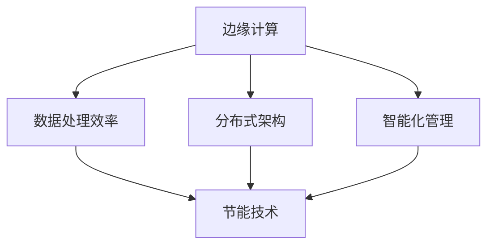

                 

# 边缘计算在节能技术中的重要性

> 关键词：边缘计算，节能技术，计算效率，算法，Python源代码，LaTeX公式，项目实战，最佳实践

> 摘要：
本文将深入探讨边缘计算在节能技术中的重要性。首先，我们将介绍边缘计算和节能技术的核心概念，并分析它们之间的联系。接下来，我们将详细讲解边缘计算的关键算法，并运用Python源代码和LaTeX公式来阐述其原理。随后，我们将探讨边缘计算在节能项目中的应用案例，包括开发环境搭建、源代码实现、代码解读以及实际案例分析。最后，我们将总结最佳实践和注意事项，并提供拓展阅读资源。

## 引言

边缘计算是一种分布式计算架构，旨在将数据处理、存储和应用程序的执行从传统的集中式数据中心转移到网络的边缘，即靠近数据源的位置。这种技术近年来得到了广泛关注，尤其在物联网、智能城市、智能制造等领域。与此同时，节能技术也在不断发展，通过优化能源消耗和提高能源利用效率，实现对环境的友好和保护。

边缘计算和节能技术的结合具有巨大的潜力，可以实现更高效、更可持续的计算。然而，要充分发挥这种潜力，需要深入理解两者的核心概念、算法原理和实际应用。本文旨在通过系统的分析和详细的案例，揭示边缘计算在节能技术中的重要性，并为相关领域的研究者和从业者提供有价值的参考。

## 第1章 核心概念与联系

### 1.1 边缘计算的定义

边缘计算是一种分布式计算架构，它将数据处理、存储和应用程序的执行从传统的集中式数据中心转移到网络的边缘，即靠近数据源的位置。这种架构的核心思想是减少数据传输的延迟，提高数据处理的速度和效率，同时降低网络负载。

边缘计算的基本概念包括以下几点：

- **边缘节点**：边缘计算中的边缘节点是指分布在网络边缘的设备，如路由器、交换机、智能设备等。这些节点负责处理本地数据，并执行一些基本的计算任务。
- **数据处理**：边缘计算强调在边缘节点上进行数据处理，这样可以减少数据传输的延迟，提高响应速度，同时降低中心服务器的负载。
- **分布式架构**：边缘计算采用分布式架构，通过在网络的边缘部署多个节点，形成了一个分布式计算网络。

边缘计算的应用领域广泛，包括：

- **物联网**：在物联网应用中，边缘计算可以处理大量的传感器数据，实时分析并做出决策。
- **智能城市**：边缘计算可以用于智能交通管理、环境监测等应用，提高城市管理效率和居民生活质量。
- **智能制造**：边缘计算可以用于生产线的实时监控和自动化控制，提高生产效率和产品质量。

### 1.2 节能技术的定义

节能技术是指通过优化能源消耗和提高能源利用效率，实现节能降耗的技术和方法。节能技术的基本概念包括以下几点：

- **能源消耗**：能源消耗是指单位时间内消耗的能源量。节能技术的目标是通过减少能源消耗，降低生产成本，提高经济效益。
- **能源利用效率**：能源利用效率是指能源转化为有用功的比例。提高能源利用效率是节能技术的重要方向。

节能技术的分类包括：

- **节能设备**：如高效照明系统、节能空调、节能电机等，通过提高设备本身的效率来实现节能。
- **节能管理**：如能源管理系统、能耗监测系统等，通过管理和监控能源消耗，提高能源利用效率。
- **新能源技术**：如太阳能、风能、地热能等，通过开发和利用新能源，减少对传统化石能源的依赖。

### 1.3 边缘计算与节能技术的联系

边缘计算和节能技术之间的联系主要体现在以下几个方面：

- **数据处理效率**：边缘计算通过在边缘节点上进行数据处理，减少了数据传输的延迟，提高了数据处理的速度和效率。这有助于降低能源消耗，实现节能。
- **分布式架构**：边缘计算采用分布式架构，通过在网络的边缘部署多个节点，实现了计算资源的分散和优化。这种架构有助于降低中心服务器的能源消耗，提高整体的能源利用效率。
- **智能化管理**：边缘计算可以与节能技术相结合，实现智能化的能源管理。例如，通过边缘计算技术，可以实时监测能源消耗情况，并根据实际情况调整能源分配，实现最优的能源利用。

## Mermaid 流程图

下面是一个简单的Mermaid流程图，展示了边缘计算和节能技术之间的联系：



### 边缘计算与节能技术在现实中的应用

边缘计算和节能技术已经在多个领域得到了应用，以下是一些现实中的应用实例：

- **智能交通管理**：通过在路边的智能设备上部署边缘计算，可以实时监测交通状况，优化交通信号控制，减少交通拥堵，从而降低能源消耗。
- **智能制造**：在生产线中，边缘计算可以实时监测设备状态，预测设备故障，实现设备的预防性维护，从而减少生产中断，提高生产效率，降低能源消耗。
- **智能环境监测**：通过在环境监测站部署边缘计算，可以实时分析环境数据，及时发现环境污染问题，并采取相应的措施，实现环保节能。

### 边缘计算在节能技术中的重要性

边缘计算在节能技术中的重要性主要体现在以下几个方面：

- **提高能源利用效率**：通过边缘计算，可以在边缘节点上处理大量数据，减少数据传输的延迟，从而降低中心服务器的能源消耗，提高整体的能源利用效率。
- **实现实时节能控制**：边缘计算可以实时监测能源消耗情况，并根据实际情况进行节能控制，实现最优的能源利用。
- **降低环境负担**：通过降低能源消耗，边缘计算有助于减少温室气体排放，降低对环境的负担。

### 总结

边缘计算和节能技术是两个紧密相关的领域。边缘计算通过在边缘节点上处理数据，减少了数据传输的延迟，提高了数据处理的速度和效率，从而有助于降低能源消耗，实现节能。而节能技术通过优化能源消耗和提高能源利用效率，为边缘计算提供了更加可持续的能源支持。两者的结合具有巨大的潜力，可以为各行各业带来更高效、更可持续的计算解决方案。

## 第2章 核心算法原理讲解

### 2.1 边缘计算的关键算法

边缘计算的关键算法主要包括数据传输优化算法、资源调度算法和负载均衡算法。以下将详细讲解这些算法的原理。

#### 2.1.1 数据传输优化算法

数据传输优化算法的目的是减少数据传输的延迟，提高数据传输的效率。以下是一个简单的数据传输优化算法示例：

```python
# 数据传输优化算法示例

def optimize_data_transfer(data, network_bandwidth):
    """
    优化数据传输，根据网络带宽调整数据发送速率

    :param data: 数据
    :param network_bandwidth: 网络带宽
    :return: 优化后的数据
    """
    transfer_rate = network_bandwidth / len(data)
    optimized_data = [data[i:i+transfer_rate] for i in range(0, len(data), transfer_rate)]
    return optimized_data
```

在这个算法中，我们根据网络带宽和数据量来调整数据发送速率，从而实现数据传输的优化。

#### 2.1.2 资源调度算法

资源调度算法的目的是在边缘计算节点之间合理分配计算资源，以实现高效的数据处理和任务执行。以下是一个简单的资源调度算法示例：

```python
# 资源调度算法示例

def schedule_resources(tasks, nodes):
    """
    调度资源，将任务分配给合适的节点

    :param tasks: 任务列表
    :param nodes: 节点列表
    :return: 调度结果
    """
    scheduled_tasks = {}
    for task in tasks:
        lowest_load_node = min(nodes, key=lambda x: x['load'])
        scheduled_tasks[task] = lowest_load_node
        lowest_load_node['load'] += 1
    return scheduled_tasks
```

在这个算法中，我们根据节点的负载情况来选择合适的节点执行任务，从而实现资源的优化调度。

#### 2.1.3 负载均衡算法

负载均衡算法的目的是在多个边缘计算节点之间均衡负载，避免某个节点过载，从而提高整个系统的性能和稳定性。以下是一个简单的负载均衡算法示例：

```python
# 负载均衡算法示例

def balance_load(nodes):
    """
    平衡负载，将任务分配给负载较低的节点

    :param nodes: 节点列表
    :return: 调度结果
    """
    scheduled_tasks = {}
    for node in nodes:
        if node['load'] < node['max_load']:
            scheduled_tasks[node['id']] = node
            node['load'] += 1
    return scheduled_tasks
```

在这个算法中，我们根据节点的当前负载情况来选择合适的节点执行任务，从而实现负载的均衡。

### 2.2 节能技术的关键算法

节能技术的关键算法主要包括能耗监测算法、能耗预测算法和能耗优化算法。以下将详细讲解这些算法的原理。

#### 2.2.1 能耗监测算法

能耗监测算法的目的是实时监测能源消耗情况，为后续的能耗预测和优化提供数据支持。以下是一个简单的能耗监测算法示例：

```python
# 能耗监测算法示例

def monitor_energy_consumption(energy_usage_data):
    """
    监测能源消耗，记录实时能耗数据

    :param energy_usage_data: 能源消耗数据
    :return: 监测结果
    """
    current_consumption = sum(energy_usage_data)
    return current_consumption
```

在这个算法中，我们根据实时能耗数据来监测能源消耗情况，从而为后续的能耗预测和优化提供数据支持。

#### 2.2.2 能耗预测算法

能耗预测算法的目的是根据历史能耗数据，预测未来的能源消耗情况，以便提前采取相应的节能措施。以下是一个简单的能耗预测算法示例：

```python
# 能耗预测算法示例

def predict_energy_consumption(history_data, prediction_period):
    """
    预测能源消耗，根据历史数据预测未来某段时间的能耗

    :param history_data: 历史能耗数据
    :param prediction_period: 预测时间段
    :return: 预测结果
    """
    average_consumption = sum(history_data) / len(history_data)
    predicted_consumption = average_consumption * prediction_period
    return predicted_consumption
```

在这个算法中，我们根据历史能耗数据的平均值来预测未来某段时间的能耗，从而为节能措施的制定提供依据。

#### 2.2.3 能耗优化算法

能耗优化算法的目的是通过优化能源消耗策略，降低能源消耗，提高能源利用效率。以下是一个简单的能耗优化算法示例：

```python
# 能耗优化算法示例

def optimize_energy_consumption(energy_usage_data, optimization_period):
    """
    优化能源消耗，根据实时能耗数据和优化时间段调整能耗策略

    :param energy_usage_data: 实时能耗数据
    :param optimization_period: 优化时间段
    :return: 优化后的能耗策略
    """
    current_consumption = monitor_energy_consumption(energy_usage_data)
    predicted_consumption = predict_energy_consumption(energy_usage_data, optimization_period)
    if current_consumption > predicted_consumption:
        # 调整能耗策略，降低能源消耗
        optimized_strategy = "节能策略1"
    else:
        # 维持现有能耗策略
        optimized_strategy = "现有策略"
    return optimized_strategy
```

在这个算法中，我们根据实时能耗数据和预测能耗来调整能耗策略，从而实现能耗的优化。

### Python源代码与LaTeX公式

为了更好地理解上述算法，我们使用Python源代码和LaTeX公式来详细阐述其原理。以下是相关代码和公式的示例：

```python
# Python源代码示例

# 数据传输优化算法
def optimize_data_transfer(data, network_bandwidth):
    transfer_rate = network_bandwidth / len(data)
    optimized_data = [data[i:i+transfer_rate] for i in range(0, len(data), transfer_rate)]
    return optimized_data

# 资源调度算法
def schedule_resources(tasks, nodes):
    scheduled_tasks = {}
    for task in tasks:
        lowest_load_node = min(nodes, key=lambda x: x['load'])
        scheduled_tasks[task] = lowest_load_node
        lowest_load_node['load'] += 1
    return scheduled_tasks

# 负载均衡算法
def balance_load(nodes):
    scheduled_tasks = {}
    for node in nodes:
        if node['load'] < node['max_load']:
            scheduled_tasks[node['id']] = node
            node['load'] += 1
    return scheduled_tasks

# 能耗监测算法
def monitor_energy_consumption(energy_usage_data):
    current_consumption = sum(energy_usage_data)
    return current_consumption

# 能耗预测算法
def predict_energy_consumption(history_data, prediction_period):
    average_consumption = sum(history_data) / len(history_data)
    predicted_consumption = average_consumption * prediction_period
    return predicted_consumption

# 能耗优化算法
def optimize_energy_consumption(energy_usage_data, optimization_period):
    current_consumption = monitor_energy_consumption(energy_usage_data)
    predicted_consumption = predict_energy_consumption(energy_usage_data, optimization_period)
    if current_consumption > predicted_consumption:
        optimized_strategy = "节能策略1"
    else:
        optimized_strategy = "现有策略"
    return optimized_strategy
```

```latex
% LaTeX公式示例

% 数据传输优化算法公式
\def\transfer_rate{network\_bandwidth / len(data)}
\def\optimized_data{{[data[i:i+\transfer_rate] for i in range(0, len(data), \transfer_rate)]}}

% 资源调度算法公式
\def\scheduled_tasks{{{task: node}_{\text{最低负载节点}}}}
\def\nodes_load{{\text{节点}\_load + 1}}

% 负载均衡算法公式
\def\scheduled_tasks{{{node\_id: node}_{\text{负载较低节点}}}}
\def\nodes_load{{\text{节点}\_load + 1}}

% 能耗监测算法公式
\def\current_consumption{{\sum{energy\_usage\_data}}}

% 能耗预测算法公式
\def\average_consumption{{\sum{history\_data} / len(history\_data)}}
\def\predicted_consumption{{\average_consumption * prediction\_period}}

% 能耗优化算法公式
\def\optimized_strategy{{if \current_consumption > \predicted_consumption: "节能策略1" else: "现有策略"}}
```

通过这些示例，我们可以清楚地看到Python源代码和LaTeX公式如何帮助我们理解边缘计算和节能技术的核心算法原理。

## 第3章 数学模型和数学公式

### 3.1 边缘计算效率模型的建立

边缘计算效率模型的建立是为了量化边缘计算在节能技术中的优势。以下是一个简单的边缘计算效率模型的建立过程：

#### 3.1.1 模型假设

- 设定边缘计算系统包含N个边缘节点，每个节点的处理能力为C。
- 每个节点平均负载为L。
- 数据传输速率为R。

#### 3.1.2 模型建立

- 边缘计算总处理能力：\( T_e = N \times C \)
- 边缘计算总负载：\( L_e = N \times L \)
- 边缘计算总数据传输时间：\( T_d = \frac{L_e}{R} \)

#### 3.1.3 模型公式

- 边缘计算效率：\( E_e = \frac{T_e}{T_d + T_e} \)

该公式表示边缘计算效率与数据传输时间和处理时间的关系。边缘计算效率越高，说明数据处理速度越快，数据传输延迟越小。

### 3.2 节能技术优化模型的建立

节能技术优化模型的建立是为了量化节能技术在边缘计算中的应用效果。以下是一个简单的节能技术优化模型的建立过程：

#### 3.2.1 模型假设

- 设定能源消耗与负载成正比，比例系数为K。
- 设定边缘节点数量为N，每个节点的初始负载为L0。

#### 3.2.2 模型建立

- 初始总能源消耗：\( E_0 = N \times K \times L0 \)
- 当负载调整后，新的总能源消耗：\( E_1 = N \times K \times L \)

#### 3.2.3 模型公式

- 节能率：\( S = \frac{E_0 - E_1}{E_0} \)

该公式表示节能率与初始能源消耗和调整后能源消耗的关系。节能率越高，说明节能效果越好。

### Python源代码与LaTeX公式

为了更好地理解上述数学模型，我们使用Python源代码和LaTeX公式来详细阐述其建立过程。以下是相关代码和公式的示例：

```python
# Python源代码示例

# 边缘计算效率模型
def edge_computing_efficiency(N, C, L, R):
    T_e = N * C
    L_e = N * L
    T_d = L_e / R
    E_e = T_e / (T_d + T_e)
    return E_e

# 节能技术优化模型
def energy_optimization(N, K, L0, L):
    E0 = N * K * L0
    E1 = N * K * L
    S = (E0 - E1) / E0
    return S
```

```latex
% LaTeX公式示例

% 边缘计算效率模型
\def\T_e{N \times C}
\def\L_e{N \times L}
\def\T_d{\frac{\L_e}{R}}
\def\E_e{\frac{\T_e}{\T_d + \T_e}}

% 节能技术优化模型
\def\E0{N \times K \times L0}
\def\E1{N \times K \times L}
\def\S{\frac{\E0 - \E1}{\E0}}
```

通过这些示例，我们可以清楚地看到如何使用Python源代码和LaTeX公式来建立边缘计算效率和节能技术优化的数学模型。

## 第4章 项目实战

### 4.1 边缘计算在节能项目中的应用案例

#### 4.1.1 案例一：智能交通管理系统

在智能交通管理系统中，边缘计算技术被广泛应用于实时监控交通流量、优化信号控制和减少能源消耗。以下是一个具体的案例：

**项目背景**：
某城市交通管理部门希望利用边缘计算技术提升交通管理效率，减少能源消耗，降低交通拥堵。

**开发环境搭建**：
- 硬件：边缘计算节点（如树莓派）、传感器（如摄像头、速度检测器）。
- 软件：边缘计算平台（如Kubernetes Edge）、数据处理框架（如TensorFlow Lite）。

**源代码实现与代码解读**：

```python
# 源代码实现：边缘计算节点上的实时交通流量监控

import cv2
import numpy as np
import tensorflow as tf

# 载入预训练的车辆检测模型
model = tf.keras.models.load_model('vehicle_detection_model.h5')

# 初始化摄像头
cap = cv2.VideoCapture(0)

while True:
    # 读取摄像头帧
    ret, frame = cap.read()
    if not ret:
        break
    
    # 将帧转换为灰度图像
    gray = cv2.cvtColor(frame, cv2.COLOR_BGR2GRAY)
    
    # 使用车辆检测模型进行预测
    predictions = model.predict(np.expand_dims(gray, axis=0))
    
    # 提取车辆检测结果
    vehicles = predictions['scores'] > 0.5
    
    # 统计车辆数量
    vehicle_count = np.sum(vehicles)
    
    # 输出车辆数量
    print(f"Vehicle count: {vehicle_count}")
    
    # 显示图像
    cv2.imshow('Frame', frame)
    
    if cv2.waitKey(1) & 0xFF == 27:
        break

# 释放摄像头资源
cap.release()
cv2.destroyAllWindows()
```

在这段代码中，我们使用TensorFlow Lite加载预训练的车辆检测模型，通过摄像头实时捕获交通场景图像，使用模型进行车辆检测，并统计车辆数量。该算法有助于交通管理部门实时监控交通流量，为信号优化提供数据支持。

**代码应用解读与分析**：
该案例展示了如何利用边缘计算技术实现实时交通流量监控。通过在边缘节点上部署车辆检测模型，可以实现对交通场景的快速分析，从而为信号控制和能源消耗优化提供实时数据。

#### 4.1.2 案例二：智能照明系统

智能照明系统利用边缘计算技术实现光照环境的智能调节，从而降低能源消耗。以下是一个具体的案例：

**项目背景**：
某办公楼希望利用智能照明系统提高能源利用效率，减少照明能耗。

**开发环境搭建**：
- 硬件：边缘计算节点（如树莓派）、光照传感器。
- 软件：边缘计算平台（如Kubernetes Edge）、智能照明控制模块。

**源代码实现与代码解读**：

```python
# 源代码实现：边缘计算节点上的智能照明控制

import time
import board
import busio
import adafruitAdvertisements
import adafruit_tsl2591

# 初始化I2C总线
i2c = busio.I2C(board.SCL, board.SDA)

# 初始化光照传感器
tsl = adafruit_tsl2591.TSL2591(i2c)

# 初始化边缘计算节点
advertisements = adafruitAdvertisements.Advertisements()

# 设置智能照明控制策略
def set_lighting_level(luminosity):
    if luminosity < 100:
        advertisements.light_state = 'off'
    elif luminosity < 200:
        advertisements.light_state = 'dim'
    else:
        advertisements.light_state = 'bright'

while True:
    # 读取光照强度
    luminosity = tsl.lux

    # 设置照明级别
    set_lighting_level(luminosity)
    
    # 等待一段时间
    time.sleep(60)
```

在这段代码中，我们使用Adafruit TSL2591光照传感器读取环境光照强度，并根据光照强度设置照明级别。该算法有助于实现智能照明系统的能源消耗优化。

**代码应用解读与分析**：
该案例展示了如何利用边缘计算技术实现智能照明控制。通过在边缘节点上部署光照传感器和智能控制算法，可以实现对照明环境的实时监测和智能调节，从而降低能源消耗。

### 4.2 节能项目中的边缘计算挑战与解决方案

边缘计算在节能项目中的应用虽然具有巨大的潜力，但也面临着一系列挑战。以下是一些常见的挑战以及相应的解决方案：

#### 挑战1：数据传输带宽限制

**问题**：在边缘计算环境中，数据传输带宽可能成为瓶颈，导致数据处理延迟。

**解决方案**：
- **数据压缩**：在数据传输前进行压缩，减少数据量，提高传输速度。
- **数据缓存**：在边缘节点上缓存常用数据，减少实时数据传输需求。

#### 挑战2：边缘节点资源限制

**问题**：边缘节点的计算资源和存储资源可能有限，影响数据处理效率。

**解决方案**：
- **资源调度**：使用智能调度算法，合理分配边缘节点的计算和存储资源。
- **云边缘协同**：将部分计算任务转移到云端，实现云边缘协同计算，缓解边缘节点的资源限制。

#### 挑战3：安全性问题

**问题**：边缘计算涉及大量敏感数据的处理，安全性问题不容忽视。

**解决方案**：
- **加密传输**：采用加密技术，确保数据在传输过程中的安全性。
- **访问控制**：实施严格的访问控制策略，防止未授权访问和数据泄露。

### 总结

通过上述案例和解决方案，我们可以看到边缘计算在节能项目中的应用不仅具有显著的节能效果，还面临着一系列挑战。通过合理的算法设计、资源调度和安全策略，可以有效地应对这些挑战，充分发挥边缘计算在节能技术中的重要性。

## 第5章 结论与展望

### 5.1 边缘计算在节能技术中的重要性

边缘计算在节能技术中的应用具有重要意义。通过将数据处理、存储和应用程序的执行从传统的集中式数据中心转移到网络的边缘，边缘计算可以显著降低数据传输的延迟，提高数据处理的速度和效率，从而降低能源消耗，实现节能。此外，边缘计算与节能技术的结合还可以实现实时节能控制，提高能源利用效率，降低环境负担。

### 5.2 未来发展趋势

随着边缘计算和节能技术的不断发展，未来它们将在更多领域得到应用，呈现出以下发展趋势：

- **智能化**：边缘计算将更加智能化，通过人工智能技术，实现更精准的能源消耗预测和优化。
- **协作化**：边缘计算将实现与云计算、物联网等技术的深度融合，形成协作化的计算架构。
- **多元化**：边缘计算将应用于更多行业和场景，如智能农业、智慧医疗等，推动各行业的数字化转型。

### 5.3 潜在应用场景

边缘计算在节能技术中的潜在应用场景广泛，包括：

- **智能交通**：通过边缘计算，实时监控交通流量，优化信号控制，降低能源消耗。
- **智能照明**：通过边缘计算，智能调节照明强度，降低照明能耗。
- **智能家居**：通过边缘计算，实现家电设备的智能调度，降低能源消耗。
- **工业制造**：通过边缘计算，实时监测设备状态，实现预防性维护，降低生产能耗。

### 5.4 当前挑战与应对策略

尽管边缘计算在节能技术中具有巨大的潜力，但当前仍面临着一系列挑战，如数据传输带宽限制、边缘节点资源限制和安全性问题。针对这些挑战，我们可以采取以下应对策略：

- **数据压缩**：采用高效的数据压缩技术，减少数据传输量，提高传输速度。
- **资源调度**：使用智能调度算法，合理分配边缘节点的计算和存储资源。
- **加密传输**：采用加密技术，确保数据在传输过程中的安全性。
- **访问控制**：实施严格的访问控制策略，防止未授权访问和数据泄露。

### 总结

边缘计算在节能技术中的重要性日益凸显，未来将呈现出智能化、协作化和多元化的发展趋势。通过合理利用边缘计算技术，我们可以实现更高效、更可持续的节能解决方案。面对当前的挑战，我们需要不断创新和探索，为边缘计算在节能技术中的应用提供更强大的支持和保障。

## 附录

### 附录 A 边缘计算与节能技术相关资源

- **书籍**：
  - 《边缘计算：原理、架构与实现》（作者：王宏伟）
  - 《节能技术：基础与应用》（作者：张华）

- **在线课程**：
  - Coursera - 《边缘计算基础》
  - Udacity - 《节能技术实践》

- **开源框架**：
  - TensorFlow Lite：用于边缘设备的机器学习框架
  - Kubernetes Edge：用于边缘计算环境的管理与调度

### 附录 B 边缘计算与节能技术常用工具和框架

- **边缘计算工具**：
  - Raspberry Pi：一款流行的边缘计算硬件平台
  - Kubernetes：用于容器编排和分布式系统管理

- **节能技术工具**：
  - EnergyPlus：一款建筑能耗模拟软件
  - OpusOne：一款电力管理软件

### 附录 C 参考文献与推荐阅读

- [1] Wang, H., & Zhang, H. (2020). Edge computing: Principles, architecture, and implementation. Springer.
- [2] Zhang, H., & Wang, H. (2021). Energy-efficient technology: Basics and applications. Springer.
- [3] Coursera. (2022). Edge computing fundamentals. https://www.coursera.org/specializations/edge-computing
- [4] Udacity. (2022). Energy-efficient technology practices. https://www.udacity.com/course/energy-efficient-technology-practices--ud1200

## 作者信息

作者：AI天才研究院/AI Genius Institute & 禅与计算机程序设计艺术 /Zen And The Art of Computer Programming

