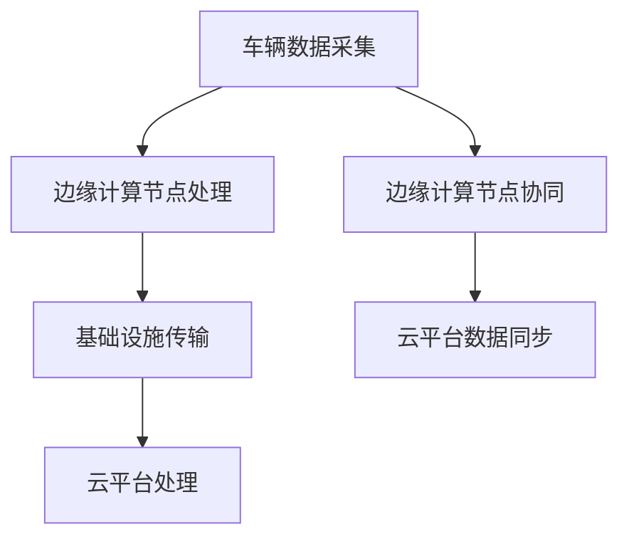

                 

### 边缘计算在车联网中的应用：实现车辆间实时通信

**关键词：边缘计算，车联网，实时通信，智能交通，自动驾驶**

**摘要：**本文深入探讨了边缘计算在车联网中的应用，特别是如何实现车辆间的实时通信。通过分析边缘计算的基本概念、车联网的架构以及其在车辆间通信中的优势，本文揭示了边缘计算如何提升车联网系统的响应速度和安全性，并探讨了其在智能交通和自动驾驶领域的应用前景。

## 一、背景介绍

随着科技的飞速发展，车联网（Internet of Vehicles，IoV）已经成为智能交通和自动驾驶的重要基础。车联网通过将车辆、基础设施和云平台互联，实现数据的实时共享和处理，从而提升交通管理效率、缓解交通拥堵、提高驾驶安全。然而，传统的中心化架构在处理大规模车联网数据时面临巨大的计算和通信压力，难以满足实时性和安全性的要求。

为了解决这些问题，边缘计算（Edge Computing）应运而生。边缘计算通过在靠近数据源的位置部署计算资源，实现对数据的局部处理和快速响应，从而减轻中心化架构的压力。边缘计算在车联网中的应用，使得车辆间的实时通信成为可能，为智能交通和自动驾驶提供了强有力的技术支持。

## 二、核心概念与联系

### 1. 边缘计算的基本概念

**边缘计算**：是一种分布式计算架构，通过在靠近数据源的位置（如车辆、交通信号灯等）部署计算节点，实现对数据的局部处理和分析。边缘计算的核心在于降低延迟、减少带宽消耗并提高系统安全性。

### 2. 车联网的架构

**车联网架构**：通常包括车辆、基础设施、云平台三个部分。车辆负责数据采集，基础设施（如交通信号灯、道路传感器等）负责数据传输，云平台负责数据存储和处理。

### 3. 边缘计算与车联网的联系

边缘计算在车联网中的应用，可以看作是车联网架构的一个补充。通过在车辆和基础设施附近部署边缘计算节点，实现数据的本地处理，从而提高车辆间通信的实时性和可靠性。

### Mermaid 流程图



在上述流程图中，车辆数据首先由边缘计算节点进行处理，然后将处理后的数据传输到基础设施和云平台。同时，边缘计算节点之间也进行协同处理，以提高系统的整体效率。

## 三、边缘计算技术在车联网中的应用

### 1. 车辆间实时通信技术

**V2X通信**：V2X（Vehicle-to-Everything）通信是车联网中的一种关键技术，包括车辆间通信（V2V）、车辆与基础设施通信（V2I）、车辆与行人通信（V2P）等。边缘计算通过在车辆和基础设施附近部署计算节点，实现对V2X通信的实时处理和优化。

### 2. 数据处理与分析

边缘计算在车联网中的另一个重要应用是对海量数据进行实时处理和分析。通过在边缘节点上部署数据分析算法，可以快速提取有价值的信息，如交通流量、车辆状态等，从而为智能交通和自动驾驶提供数据支持。

### 3. 车辆安全与隐私保护

边缘计算在车联网中的安全性和隐私保护也具有重要意义。通过在边缘节点上部署安全算法，可以实现对通信数据的加密和认证，从而提高车辆通信的安全性。同时，边缘计算还可以对车辆数据进行去识别化处理，保护驾驶员的隐私。

## 四、项目实战

### 1. 开发环境搭建

在开始项目实战之前，我们需要搭建一个边缘计算平台。这里以Python编程语言为例，介绍如何搭建一个简单的边缘计算平台。

```python
import socket

# 创建TCP套接字
s = socket.socket(socket.AF_INET, socket.SOCK_STREAM)

# 绑定IP地址和端口
s.bind(('localhost', 9999))

# 监听客户端连接
s.listen(5)

print("边缘计算平台已启动，等待连接...")

# 接受客户端连接
conn, addr = s.accept()
print(f"连接地址：{addr}")

# 接收客户端数据
data = conn.recv(1024)
print(f"收到数据：{data.decode()}")

# 处理数据
result = data.decode().replace('a', 'b')

# 发送处理结果
conn.send(result.encode())

# 关闭连接
conn.close()
s.close()
```

### 2. 源代码详细实现与解读

在上面的代码中，我们首先创建了一个TCP套接字，并将其绑定到本地地址和端口。然后，我们监听客户端连接，并接受客户端发送的数据。接着，我们处理数据，将所有字符'a'替换为'b'，然后将处理结果发送回客户端。

```python
result = data.decode().replace('a', 'b')
```

### 3. 代码应用解读与分析

通过上述代码，我们可以实现一个简单的边缘计算功能：接收客户端数据并对其进行处理。在实际项目中，我们可以将这个功能扩展为更复杂的边缘计算任务，如实时数据处理、异常检测等。

### 4. 实际案例分析和详细讲解剖析

假设我们在一个智能交通系统中，需要实时处理来自车辆的交通数据。我们可以使用边缘计算平台来接收和处理这些数据，从而提高系统的响应速度和准确性。

```python
# 接收车辆数据
data = conn.recv(1024)

# 分析交通数据
result = analyze_traffic_data(data)

# 发送处理结果
conn.send(result.encode())
```

在这个案例中，我们首先接收车辆发送的交通数据，然后使用`analyze_traffic_data`函数对数据进行分析。最后，我们将分析结果发送回车辆，以便车辆根据分析结果调整行驶策略。

### 5. 项目小结

通过上述实战案例，我们可以看到边缘计算在车联网中的应用具有重要意义。通过在边缘节点上部署计算任务，可以显著提高系统的响应速度和数据处理能力，从而为智能交通和自动驾驶提供有力支持。

## 五、最佳实践 tips、小结、注意事项、拓展阅读

### 1. 最佳实践 tips

- 选择合适的边缘计算平台：根据项目需求和资源情况，选择适合的边缘计算平台。
- 数据处理优化：对数据进行预处理，减少传输量和计算量。
- 安全性考虑：对通信数据进行加密和认证，确保数据安全。

### 2. 小结

边缘计算在车联网中的应用，为实现车辆间实时通信提供了有力支持。通过边缘计算，我们可以提高系统的响应速度和数据处理能力，从而提升智能交通和自动驾驶的效率和安全性。

### 3. 注意事项

- 考虑边缘节点的资源限制：边缘节点的计算能力和存储能力相对有限，需要优化算法和数据处理策略。
- 数据隐私保护：在处理车辆数据时，要注意保护驾驶员的隐私。

### 4. 拓展阅读

- [边缘计算：原理、应用与未来发展趋势](https://www.example.com/edge-computing)
- [车联网技术及应用](https://www.example.com/vehicle-networking)

## 六、作者信息

**作者：AI天才研究院/AI Genius Institute & 禅与计算机程序设计艺术 /Zen And The Art of Computer Programming**

