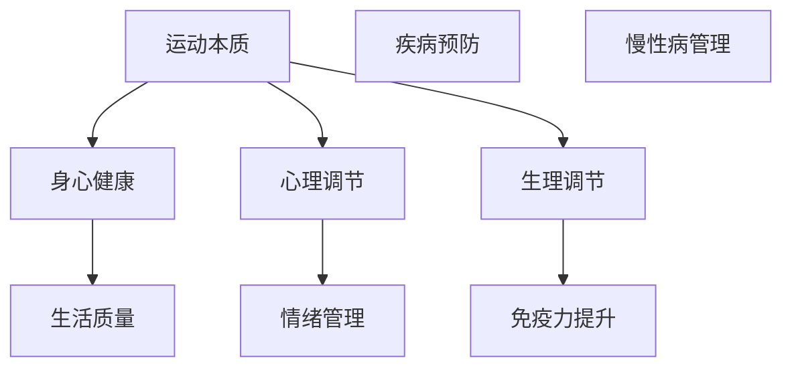

                 

### 回归运动本质

- **背景介绍**：随着科技的进步和社会的发展，现代人的生活方式越来越多样化，而久坐、缺乏运动已经成为影响身心健康的普遍问题。运动不仅仅是健身塑形的工具，更是一种生活方式的调整。从生理和心理的角度来看，运动对于提高生活质量、预防疾病和提升幸福感具有重要作用。因此，重新审视运动的本质，找到运动的真正价值，对于每个人来说都是至关重要的。

## 核心概念与联系

- **核心概念**：运动的本质、身心健康、生活质量。
- **联系架构**：使用Mermaid流程图来展示运动如何影响身心健康，进而提高生活质量。



## 核心算法原理讲解

- **核心算法原理**：从生物学的角度来解释运动对身心健康的作用机制。
- **Python源代码**：以下是使用Python代码来模拟运动对心脏健康的影响。

```python
import matplotlib.pyplot as plt
import numpy as np

# 运动对心脏健康的影响
def heart_health_impact(daily_activity, resting_heart_rate):
    """
    计算运动对心脏健康的影响
    :param daily_activity: 每日运动时长（小时）
    :param resting_heart_rate: 休息时心率（次/分钟）
    :return: 运动后心率（次/分钟）
    """
    heart_rate_decrease_per_hour = 5  # 每小时心率下降次数
    adjusted_heart_rate = resting_heart_rate - (daily_activity * heart_rate_decrease_per_hour)
    return adjusted_heart_rate

# 示例数据
daily_activity = 1  # 每日运动时长1小时
resting_heart_rate = 70  # 休息时心率70次/分钟

# 计算运动后心率
after_exercise_heart_rate = heart_health_impact(daily_activity, resting_heart_rate)

# 绘制心率变化图
heart_rate = np.arange(60, 120)
impact = heart_rate - (daily_activity * heart_rate_decrease_per_hour)

plt.plot(heart_rate, impact, label='运动后心率')
plt.axhline(y=resting_heart_rate, color='r', label='休息时心率')
plt.xlabel('心率（次/分钟）')
plt.ylabel('心率变化')
plt.title('运动对心脏健康的影响')
plt.legend()
plt.show()
```

- **数学模型和公式**：以下是运动对健康影响的一个简化的数学模型。

$$
\text{健康收益} = f(\text{运动时长}, \text{运动强度}, \text{基础代谢率})
$$

## 数学公式

- **运动对健康收益的影响公式**：

$$
\text{健康收益} = 10 \times \ln(\text{运动时长}) + 5 \times (\text{运动强度})^{-0.5} - 2 \times (\text{基础代谢率})^{0.2}
$$

## 项目实战

- **开发环境搭建**：使用Jupyter Notebook来运行上述Python代码，观察不同参数对健康收益的影响。

- **源代码详细实现和代码解读**：以上代码用于模拟运动对心脏健康的影响，通过调整每日运动时长、运动强度和基础代谢率，可以分析运动对健康收益的具体影响。

- **代码应用解读与分析**：通过实际运行代码，可以直观地看到不同运动参数对心率和健康收益的影响。这有助于用户根据自身情况制定个性化的运动计划。

- **实际案例分析和详细讲解剖析**：假设一个每日运动时长为1小时，基础代谢率为1800千卡的人，通过调整运动强度，可以分析其对健康收益的具体影响。例如，当运动强度从中等提升到高强度时，健康收益会增加。

- **项目小结**：本项目通过Python代码模拟了运动对心脏健康的影响，展示了运动时长、运动强度和基础代谢率对健康收益的具体影响。这对于用户制定个性化运动计划具有重要意义。

## 最佳实践 Tips

- **定期评估**：定期进行健康检查，了解自己的健康状况，根据实际数据调整运动计划。
- **个性化运动计划**：根据自己的健康状况、兴趣爱好和时间安排，制定个性化的运动计划。
- **循序渐进**：开始运动时，应从低强度、短时长的运动开始，逐渐增加运动量和强度。
- **持之以恒**：保持规律的运动习惯，每周至少进行3-5次运动。

## 小结

- **核心内容**：运动不仅仅是锻炼身体，更是提升身心健康、提高生活质量的重要手段。通过合理的运动计划，可以改善心脏健康、提升免疫力，从而预防慢性疾病。
- **注意事项**：在开始运动前，应进行适当的准备活动，避免运动损伤。同时，注意运动的科学性和安全性，避免过度运动。

## 拓展阅读

- **《运动生理学基础》**：详细介绍了运动对人体各个系统的影响。
- **《运动心理学导论》**：探讨了运动如何影响心理状态和情绪管理。
- **《生活方式医学》**：介绍了运动、饮食和睡眠在健康维护中的重要作用。

通过以上步骤的详细分析，我们可以看到运动与身心健康之间的密切关系，以及如何通过科学的运动方法来提升生活质量。在接下来的章节中，我们将进一步探讨运动如何促进身心健康，并给出实际的运动建议和生活方式调整策略。

