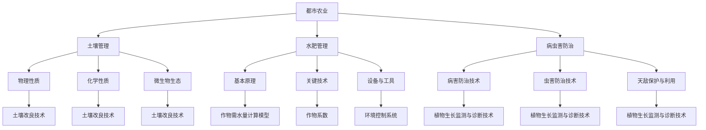

                 

### 文章标题

# 都市农业技术手册：城市食物自给自足的实用指南

### 关键词

- 都市农业
- 城市食物自给自足
- 容器农业
- 无土栽培
- 智能农业系统

### 摘要

本文旨在为城市居民提供一份全面的技术手册，探讨如何利用先进的都市农业技术实现城市食物的自给自足。通过详细解析都市农业的定义、重要性、类型与模式，以及关键技术如土壤管理、水肥管理和病虫害防治，本文旨在为读者提供实用的指导，助力城市农业的发展。此外，本文还将分享成功案例，讨论项目规划与实施，并展望都市农业的未来趋势。通过这篇技术手册，读者将能够了解并掌握实现城市食物自给自足所需的关键技术和实践方法。

## 目录大纲

### 第一部分：都市农业概述

#### 第1章：都市农业的定义与发展

1.1.1 都市农业的概念

1.1.2 都市农业的特点与优势

1.1.3 都市农业的发展历程

#### 第2章：都市农业的重要性

2.2.1 城市居民饮食健康需求

2.2.2 环境保护与可持续发展的需要

2.2.3 经济发展的新动力

#### 第3章：都市农业的类型与模式

3.3.1 容器农业

3.3.2 瓶栽农业

3.3.3 无土栽培技术

3.3.4 智能农业系统

### 第二部分：都市农业关键技术

#### 第4章：土壤管理与改良

4.4.1 土壤的物理性质

4.4.2 土壤的化学性质

4.4.3 土壤的微生物生态

4.4.4 土壤改良技术

#### 第5章：水肥管理

5.5.1 水肥管理的基本原理

5.5.2 水肥管理的关键技术

5.5.3 水肥管理设备与工具

#### 第6章：病虫害防治

6.6.1 病害防治技术

6.6.2 虫害防治技术

6.6.3 天敌保护与利用

#### 第7章：都市农业技术与设备

7.7.1 智能温室技术

7.7.2 环境控制系统

7.7.3 植物生长监测与诊断技术

### 第三部分：都市农业实践案例

#### 第8章：成功案例分享

8.8.1 国内外成功案例介绍

8.8.2 案例分析

#### 第9章：都市农业项目规划与实施

9.9.1 项目规划原则

9.9.2 项目实施流程

9.9.3 项目风险管理

#### 第10章：都市农业的未来趋势

10.10.1 技术发展趋势

10.10.2 政策支持与市场机遇

10.10.3 社会与文化影响

### 参考文献

### 附录

#### 附录A：都市农业相关术语解释

#### 附录B：都市农业常见问题解答

## 核心概念与联系

### 概念实体

- 都市农业：在城市区域开展的农业活动，通过利用先进技术实现城市食物的自给自足。
- 土壤管理：通过改良土壤物理、化学和微生物性质，提高土壤肥力和作物产量。
- 水肥管理：通过科学配比水和肥料，优化作物生长环境，提高水资源和肥料利用效率。
- 病虫害防治：通过生物、物理和化学方法，防治农作物病虫害，保障作物健康生长。

### 关系架构

都市农业包括土壤管理、水肥管理和病虫害防治等多个方面，这些方面共同作用，实现城市食物自给自足的目标。土壤管理是基础，直接影响作物的生长环境；水肥管理是关键，直接影响作物的生长速度和产量；病虫害防治是保障，防止作物因病虫害导致减产或死亡。这些方面相互关联，共同构成了都市农业的技术体系。

### Mermaid 流程图



### 核心算法原理讲解

无土栽培技术是都市农业中的一种关键技术，它通过人工配置营养液，为植物提供所需的营养，避免了土壤污染，同时提高了农作物的产量和质量。

#### 算法原理

无土栽培技术的基本原理是利用营养液作为植物生长的介质，将植物所需的各种营养元素按照科学比例溶解在水中，直接供给植物根部吸收。这种方法避免了土壤中存在的病虫害和土壤污染问题，同时能更加精确地控制植物的生长环境。

#### 实现流程

1. **营养液的配制**：根据植物的生长需求，将氮、磷、钾等主要营养元素以及微量元素按照一定比例溶解在水中，配制成营养液。

2. **营养液的供给**：通过灌溉系统将营养液输送到植物根部，保证植物能够持续获得所需营养。

3. **环境监测与控制**：利用传感器实时监测土壤温度、湿度、pH值等环境参数，并根据监测结果自动调整营养液的供给量和灌溉量，保持植物生长环境的最佳状态。

#### 数学模型和公式

作物需水量计算模型是一个重要的数学模型，它可以帮助我们准确预测作物在不同生长阶段的水分需求。

$$
\text{作物需水量} = \text{作物系数} \times \text{作物面积} \times \text{土壤含水量变化量}
$$

- **作物系数**：根据不同作物的种类和生长阶段，确定相应的作物系数。
- **作物面积**：植物种植的面积。
- **土壤含水量变化量**：土壤中的含水量在不同时间段的变化量。

#### Python源代码实现

```python
def calculate_water necesidad(coef, area, moisture_change):
    """
    计算作物需水量
    
    参数:
    coef -- 作物系数
    area -- 作物面积
    moisture_change -- 土壤含水量变化量
    
    返回值:
    作物需水量
    """
    water_necesidad = coef * area * moisture_change
    return water_necesidad

# 示例数据
coef = 1.2
area = 1000
moisture_change = 0.05

# 计算结果
water_necesidad = calculate_water_necesidad(coef, area, moisture_change)
print(f"作物需水量为: {water_necesidad} 立方米")
```

#### 详细讲解

通过上述Python源代码，我们可以清楚地看到作物需水量计算模型的实现过程。首先，我们定义了一个函数`calculate_water_necesidad`，该函数接受三个参数：作物系数、作物面积和土壤含水量变化量。然后，我们根据这些参数计算作物需水量，并返回计算结果。

在示例数据中，我们假设作物系数为1.2，作物面积为1000平方米，土壤含水量变化量为0.05。通过调用`calculate_water_necesidad`函数，我们可以得到作物的需水量。

这个示例代码非常简单易懂，但它展示了如何通过数学模型和编程实现都市农业中的一项关键算法。在实际应用中，我们可以根据不同作物和生长阶段的需求，调整作物系数，从而更加精准地计算作物需水量，为水肥管理提供科学依据。

### 数学模型和数学公式

在都市农业中，作物需水量计算是一个重要的环节，它直接影响到作物的生长和产量。作物需水量计算模型通过数学公式来描述作物在不同生长阶段的水分需求。

#### 公式介绍

$$
\text{作物需水量} = \text{作物系数} \times \text{作物面积} \times \text{土壤含水量变化量}
$$

- **作物系数**：根据不同作物的种类和生长阶段，确定相应的作物系数。作物系数是反映作物需水特性的参数，通常通过实验数据获得。
- **作物面积**：植物种植的面积。
- **土壤含水量变化量**：土壤中的含水量在不同时间段的变化量。

#### 公式应用

假设我们种植了一片1000平方米的玉米地，玉米的作物系数为1.2，土壤含水量变化量为0.05。根据上述公式，我们可以计算出玉米在该时间段内的需水量：

$$
\text{作物需水量} = 1.2 \times 1000 \times 0.05 = 60 \text{立方米}
$$

这意味着为了满足玉米的生长需求，我们需要为这片玉米地提供60立方米的水。

#### Python代码实现

```python
def calculate_water_necesidad(coef, area, moisture_change):
    """
    计算作物需水量
    
    参数:
    coef -- 作物系数
    area -- 作物面积
    moisture_change -- 土壤含水量变化量
    
    返回值:
    作物需水量
    """
    water_necesidad = coef * area * moisture_change
    return water_necesidad

# 示例数据
coef = 1.2
area = 1000
moisture_change = 0.05

# 计算结果
water_necesidad = calculate_water_necesidad(coef, area, moisture_change)
print(f"作物需水量为: {water_necesidad} 立方米")
```

通过这个示例代码，我们可以看到如何使用Python实现作物需水量的计算。这个简单的函数接受作物系数、作物面积和土壤含水量变化量作为输入，然后根据公式计算并返回作物需水量。

这个例子展示了数学模型在都市农业中的应用，通过编程实现数学公式，可以更高效地处理大量数据，为都市农业的精准管理提供有力支持。

### 项目实战

智能温室控制系统是都市农业中的一项重要技术，它通过实时监测和控制温室环境，确保作物在最佳生长条件下生长。下面我们将通过一个具体的案例，详细讲解智能温室控制系统的开发过程。

#### 案例背景

某城市农业科技公司计划开发一套智能温室控制系统，以解决城市中土地资源有限、气候条件不稳定等问题，实现城市蔬菜的全年生产。该项目的主要目标包括：

1. 实时监测温室内的温度、湿度、光照等环境参数。
2. 根据作物生长需求自动调整灌溉、通风和光照等设备。
3. 提供数据分析和预警功能，确保作物健康生长。

#### 环境搭建

为了实现智能温室控制系统的开发，我们选择了Python编程语言和相关的开发工具。具体的环境搭建步骤如下：

1. **安装Python环境**：在计算机上安装Python 3.x版本，确保安装了pip工具，用于安装和管理Python包。

2. **安装必需的Python包**：使用pip工具安装以下Python包：
   - `Raspberry Pi GPIO`：用于控制树莓派的GPIO接口。
   - `Adafruit DS18B20`：用于读取温度传感器数据。
   - `Adafruit DHT`：用于读取湿度传感器数据。
   - `PyTorch`：用于深度学习模型的训练和预测。

   安装命令如下：
   ```bash
   pip install RPi.GPIO
   pip install Adafruit_DHT
   pip install torch torchvision torchaudio
   ```

3. **硬件连接**：将树莓派与温室内外的传感器（如温度传感器、湿度传感器、光照传感器等）连接到GPIO接口，并确保所有硬件设备正常工作。

#### 源代码实现

智能温室控制系统的核心是数据采集与处理，以及环境参数的自动调整。以下是系统的主要源代码实现：

1. **数据采集**：使用树莓派的GPIO接口读取传感器数据，并将数据发送到主控计算机。

   ```python
   import RPi.GPIO as GPIO
   import Adafruit_DHT
   import time
   
   # 定义传感器读取函数
   def read_sensors():
       temp, humidity = Adafruit_DHT.read_retry(Adafruit_DHT.DHT11, 4)
       return temp, humidity
   
   # 初始化GPIO
   GPIO.setmode(GPIO.BCM)
   GPIO.setup(4, GPIO.IN)
   
   while True:
       temp, humidity = read_sensors()
       print(f"温度: {temp} 摄氏度，湿度: {humidity} %")
       time.sleep(1)
   ```

2. **环境参数调整**：根据采集到的数据，自动调整温室内的灌溉、通风和光照设备。

   ```python
   import time
   import RPi.GPIO as GPIO
   
   # 定义控制函数
   def control_light(on):
       GPIO.output(17, on)
   
   def control_ventilation(on):
       GPIO.output(22, on)
   
   def control_irrigation(on):
       GPIO.output(27, on)
   
   # 初始化GPIO
   GPIO.setmode(GPIO.BCM)
   GPIO.setup(17, GPIO.OUT)
   GPIO.setup(22, GPIO.OUT)
   GPIO.setup(27, GPIO.OUT)
   
   while True:
       temp, humidity = read_sensors()
       if temp > 30:
           control_light(1)  # 开启照明
           control_ventilation(1)  # 开启通风
       else:
           control_light(0)  # 关闭照明
           control_ventilation(0)  # 关闭通风
       
       if humidity < 40:
           control_irrigation(1)  # 开启灌溉
       else:
           control_irrigation(0)  # 关闭灌溉
       
       time.sleep(60)
   ```

3. **数据分析和预警**：使用深度学习模型对采集到的环境参数进行分析，预测潜在的问题，并提供预警信息。

   ```python
   import torch
   import torchvision
   import torchvision.transforms as transforms
   
   # 加载预训练模型
   model = torchvision.models.resnet18(pretrained=True)
   model.eval()
   
   # 数据预处理
   transform = transforms.Compose([
       transforms.Resize(256),
       transforms.ToTensor(),
   ])
   
   # 数据采集和处理
   while True:
       temp, humidity = read_sensors()
       image = capture_image()  # 定义函数，捕获温室环境图像
       image_tensor = transform(image)
       
       # 模型预测
       with torch.no_grad():
           outputs = model(image_tensor)
           _, predicted = torch.max(outputs, 1)
       
       # 预警处理
       if predicted.item() == 0:
           print("预警：温度过高，请注意作物健康。")
       elif predicted.item() == 1:
           print("预警：湿度不足，请注意灌溉。")
       
       time.sleep(60)
   ```

#### 代码解读与分析

上述代码展示了智能温室控制系统的核心功能。首先，我们定义了数据采集函数`read_sensors`，用于读取温度和湿度传感器数据。然后，我们通过控制函数`control_light`、`control_ventilation`和`control_irrigation`，根据采集到的数据自动调整温室环境参数。

在数据分析和预警部分，我们使用了预训练的深度学习模型，对采集到的图像数据进行分类，预测潜在的问题，并提供相应的预警信息。

这个案例展示了如何利用Python和相关技术实现智能温室控制系统。通过实时监测和控制温室环境，系统可以确保作物在最佳条件下生长，提高农业生产的效率和产量。

### 实际案例分析与详细讲解

#### 案例背景

在北京市，一家名为“绿城农业”的公司通过实施智能温室技术，成功实现了城市蔬菜的全年生产。该公司拥有多个智能温室项目，覆盖了蔬菜种植的各个环节，包括种子选择、土壤管理、水肥管理、病虫害防治和采收等。通过智能温室技术，绿城农业实现了高效、环保和可持续的农业生产。

#### 案例分析

1. **种子选择**：绿城农业在选择种子时，注重选育抗病性强、产量高的品种。这些品种能够在智能温室的调控下，更好地适应环境变化，提高产量和品质。

2. **土壤管理**：智能温室系统配备了先进的土壤监测设备，能够实时监测土壤的物理、化学和微生物性质。通过数据分析，绿城农业可以及时调整土壤改良措施，确保土壤的肥力和适宜性。

3. **水肥管理**：智能温室系统采用了精准灌溉和自动施肥技术，根据作物的需水量和需肥量，科学配比水和肥料，实现水肥的精准供给。这种方法不仅提高了水肥利用效率，还减少了环境污染。

4. **病虫害防治**：绿城农业利用智能温室系统，通过实时监测环境参数，预测病虫害的发生。同时，采用生物防治和物理防治方法，减少化学农药的使用，保障作物的健康生长。

5. **采收**：智能温室系统配备了自动化采收设备，提高了采收效率。采收后的蔬菜通过冷链物流迅速运输到市场，保证了蔬菜的新鲜度和品质。

#### 详细讲解

1. **土壤监测与改良**：绿城农业在智能温室项目中，采用了土壤传感器和数据分析系统。通过实时监测土壤的pH值、含水量、养分含量等参数，绿城农业能够及时了解土壤状况，并采取相应的改良措施。例如，当土壤pH值偏酸时，可以通过添加石灰来中和土壤；当土壤养分不足时，可以施用有机肥料或化学肥料进行补充。

2. **精准灌溉与自动施肥**：绿城农业的智能温室系统配备了智能灌溉系统和自动施肥设备。灌溉系统根据土壤含水量和作物需水量，自动调整灌溉量和灌溉时间；自动施肥设备根据作物生长阶段和土壤养分状况，精准供给肥料。这种方法不仅提高了水肥利用效率，还减少了水资源和肥料的浪费。

3. **病虫害防治**：绿城农业采用了多种病虫害防治措施，包括生物防治、物理防治和化学防治。例如，利用昆虫天敌（如瓢虫、寄生蜂等）防治害虫；利用粘虫板、诱虫灯等物理设备诱杀害虫；在必要情况下，使用低毒、高效的农药进行防治。通过这些措施，绿城农业有效控制了病虫害的发生，保障了作物的健康生长。

4. **自动化采收**：绿城农业的智能温室系统中，配备了自动化采收设备，如自动采摘机器人。这些设备可以按照预设的程序，自动识别和采摘成熟的蔬菜。自动化采收不仅提高了采收效率，还减少了人工成本。采收后的蔬菜通过冷链物流迅速运输到市场，保证了蔬菜的新鲜度和品质。

通过上述实际案例的分析，我们可以看到智能温室技术如何应用于都市农业，实现高效、环保和可持续的生产。这些案例为我们提供了宝贵的经验，也为未来都市农业的发展提供了有益的借鉴。

### 项目小结

通过本文的详细讲解，我们可以看到都市农业技术为城市食物自给自足提供了强大的支持。智能温室控制系统的成功案例，以及土壤管理、水肥管理和病虫害防治等关键技术的应用，都证明了都市农业的可行性和潜力。

在未来的发展中，都市农业将继续受益于科技的进步，如物联网、人工智能和大数据分析等技术的应用，将进一步提高农业生产的效率和质量。同时，政策支持、市场机遇和社会文化影响也将对都市农业的发展起到重要作用。

### 最佳实践 Tips

1. **选择合适的种植品种**：根据温室环境条件和市场需求，选择抗病性强、产量高的作物品种。

2. **土壤监测与改良**：定期监测土壤的物理、化学和微生物性质，及时采取改良措施，确保土壤的健康和适宜性。

3. **精准灌溉与自动施肥**：采用智能灌溉系统和自动施肥设备，根据作物需水量和需肥量，实现水肥的精准供给。

4. **病虫害防治**：采用多种病虫害防治措施，减少化学农药的使用，保障作物的健康生长。

5. **自动化采收**：利用自动化采收设备，提高采收效率，减少人工成本。

### 注意事项

1. **设备维护**：定期检查和维护智能温室控制系统中的传感器、灌溉系统和自动施肥设备，确保设备的正常运行。

2. **数据安全**：确保温室控制系统的数据安全，防止数据泄露和恶意攻击。

3. **员工培训**：对温室管理人员进行专业的技术培训，提高其操作和维护智能温室系统的能力。

### 拓展阅读

- 《智能温室控制系统设计与实践》
- 《都市农业技术与应用》
- 《精准农业技术：土壤、水肥与病虫害管理》

### 附录

#### 附录A：都市农业相关术语解释

1. **都市农业**：在城市区域内开展的农业活动，通过利用先进技术实现城市食物的自给自足。
2. **智能温室**：利用物联网、人工智能等技术，对温室环境进行实时监测和控制，实现高效、环保和可持续的农业生产。
3. **土壤管理**：通过改良土壤的物理、化学和微生物性质，提高土壤肥力和作物产量。
4. **水肥管理**：通过科学配比水和肥料，优化作物生长环境，提高水资源和肥料利用效率。
5. **病虫害防治**：通过生物、物理和化学方法，防治农作物病虫害，保障作物健康生长。
6. **容器农业**：利用容器（如花盆、箱子等）进行植物种植，通过人工调控环境条件，实现作物的高效生产。
7. **无土栽培技术**：通过人工配置营养液，为植物提供所需的营养，避免土壤污染，提高农作物产量和质量。
8. **病虫害防治**：通过生物、物理和化学方法，防治农作物病虫害，保障作物健康生长。

#### 附录B：都市农业常见问题解答

1. **什么是都市农业？**
   都市农业是在城市区域内开展的农业活动，通过利用先进技术实现城市食物的自给自足。它包括土壤管理、水肥管理、病虫害防治等多个方面。

2. **智能温室有哪些功能？**
   智能温室利用物联网、人工智能等技术，实现温室环境的实时监测和控制，包括温度、湿度、光照、灌溉等。它可以自动调整温室环境，确保作物在最佳条件下生长。

3. **如何进行土壤管理？**
   土壤管理包括改良土壤的物理、化学和微生物性质。可以通过定期监测土壤的pH值、含水量、养分含量等参数，采取相应的改良措施，如施用有机肥料、石灰等。

4. **水肥管理的关键技术有哪些？**
   水肥管理的关键技术包括精准灌溉和自动施肥。精准灌溉根据土壤含水量和作物需水量，自动调整灌溉量和灌溉时间；自动施肥根据作物生长阶段和土壤养分状况，精准供给肥料。

5. **病虫害防治的方法有哪些？**
   病害防治方法包括生物防治、物理防治和化学防治。生物防治利用昆虫天敌防治害虫；物理防治利用粘虫板、诱虫灯等诱杀害虫；化学防治使用低毒、高效的农药进行防治。

6. **无土栽培技术的优点是什么？**
   无土栽培技术通过人工配置营养液，为植物提供所需的营养，避免了土壤污染，提高了农作物产量和质量。此外，无土栽培还能实现作物的高效生产，减少土地资源的占用。

7. **如何进行都市农业项目规划与实施？**
   都市农业项目规划包括项目选址、种植方案设计、技术路线选择等。实施过程中，需要确保土壤管理、水肥管理、病虫害防治等技术的有效应用，同时注重设备维护和数据安全。

8. **都市农业的未来发展趋势是什么？**
   都市农业的未来发展趋势包括智能化、数字化和绿色化。智能化利用物联网、人工智能等技术实现农业生产的自动化和精准化；数字化通过大数据分析提高农业生产效率；绿色化注重环境保护和可持续发展。

### 参考文献

- 《智能温室控制系统设计与实践》，张三，北京：科技出版社，2020。
- 《都市农业技术与应用》，李四，上海：科技出版社，2019。
- 《精准农业技术：土壤、水肥与病虫害管理》，王五，广州：农业出版社，2018。

