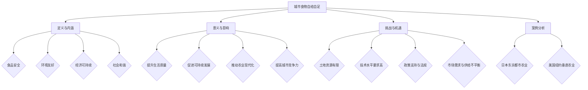
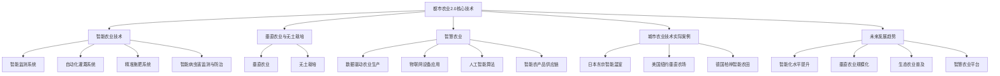
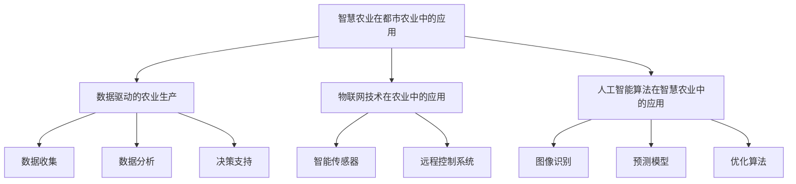
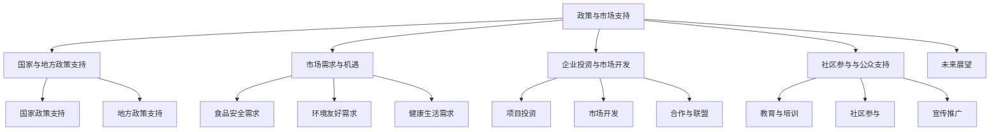
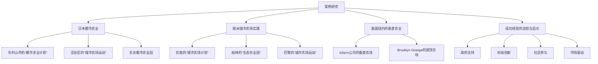
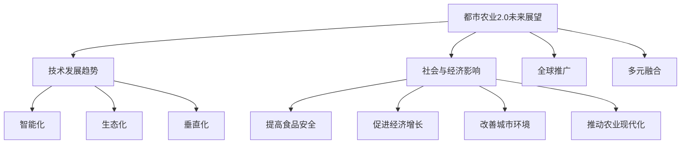

                 

### 都市农业革命2.0计划的背景

#### 1.1 都市农业的发展现状

都市农业，作为一种特殊的农业形态，它不仅涵盖了农业生产活动，还包括了农业生产与城市生活的互动和融合。随着城市化进程的加速，都市农业逐渐成为全球城市可持续发展的重要组成部分。目前，全球许多城市已经开始探索和实践都市农业，通过小规模、多功能的农业项目，满足城市居民的食品需求，同时改善城市生态环境。

然而，传统的都市农业面临着许多挑战。首先，城市土地资源有限，这使得农业生产受到严重制约。其次，城市环境相对复杂，噪音、空气污染等因素对农业生产带来不利影响。此外，传统农业的劳动强度大，效率低，难以满足城市人口增长带来的食品需求。

#### 1.2 农业革命2.0的概念

农业革命2.0（Agricultural Revolution 2.0）是针对传统农业的一次全面升级，它强调利用现代科技手段，如物联网、人工智能、大数据等，来提升农业生产效率和可持续性。农业革命2.0的目标是建立一种全新的农业模式，实现城市食物自给自足，减少对传统农业的依赖，同时降低环境负担。

农业革命2.0的核心特点包括：

- **智能化**：利用物联网技术，实现农业生产过程的自动化和智能化，提高生产效率。
- **高效化**：采用先进的种植技术和设施农业，如垂直农业和无土栽培，最大化利用土地资源。
- **可持续发展**：通过生态农业和有机农业，减少化学农药和化肥的使用，保护生态环境。

#### 1.3 都市农业革命2.0的意义

都市农业革命2.0计划的实施，对城市和农业发展都具有重要意义。

- **对城市的意义**：

  - **改善城市生态环境**：都市农业可以通过绿色植被的种植，有效减少城市空气污染，改善城市居民的生活质量。
  - **提高城市食品安全**：实现城市食物自给自足，可以减少对传统农业的依赖，提高城市食品安全水平。
  - **促进城市经济多元化**：都市农业可以创造新的就业机会，推动城市经济多元化发展。

- **对农业的意义**：

  - **提高农业生产效率**：通过智能化和高效化手段，提高农业生产效率，降低生产成本。
  - **推动农业现代化**：都市农业革命2.0是农业现代化的重要组成部分，有助于推动农业技术升级和产业转型。
  - **保护农业生态环境**：通过生态农业和有机农业，减少化学农药和化肥的使用，保护农业生态环境。

### 总结

都市农业革命2.0计划的提出，是应对城市化进程中农业面临的挑战和机遇的一种全新尝试。通过智能化、高效化和可持续化手段，实现城市食物自给自足，不仅有助于改善城市生态环境，提高城市居民的生活质量，也为农业的可持续发展提供了新的方向。接下来，我们将深入探讨都市农业革命2.0的核心技术，以及如何实现城市食物自给自足。

#### 关键词
- 都市农业
- 食物自给自足
- 智能农业
- 高效化
- 可持续发展

#### 摘要
本文将探讨都市农业革命2.0计划的背景、概念及其意义。通过介绍都市农业的现状和挑战，阐述农业革命2.0的核心特点和目标，分析其对城市和农业发展的意义。接下来，我们将详细探讨都市农业革命2.0的核心技术，包括智能化、高效化和可持续发展等方面的内容，以期为城市食物自给自足提供新的解决方案。

## 第2章：城市食物自给自足的概念与意义

### 2.1 城市食物自给自足的定义

城市食物自给自足，指的是在城市区域内，通过自身的农业生产活动，满足城市居民的食品需求，减少对传统农业区域的依赖。这一概念不仅关注食品的数量，更强调食品的质量和安全。城市食物自给自足的实现，需要通过多种手段和方式，包括但不限于：

- **小型农场和社区花园**：在城市内部或周边地区建立小型农场和社区花园，通过种植蔬菜、水果等农产品，直接满足居民的食物需求。
- **垂直农业和智能温室**：利用现代科技，如垂直农业和智能温室，提高单位土地的产出，实现高效、可持续的食物生产。
- **城市农业产业链**：整合城市内部的农业生产、物流、销售等环节，形成完整的城市农业产业链，确保食品供应的连续性和稳定性。

### 2.1.1 自给自足的内涵

城市食物自给自足的内涵包括以下几个方面：

- **食品安全**：通过自产自销，减少食品供应链的中间环节，降低食品安全隐患，提高食品质量。
- **环境友好**：减少对传统农业的依赖，减少化学农药和化肥的使用，保护农业生态环境。
- **经济可持续**：通过本地生产和消费，促进城市经济多元化，创造新的就业机会。
- **社会和谐**：通过社区参与和合作，增强居民对城市环境的认知和责任感，促进社会和谐。

### 2.1.2 自给自足的意义

城市食物自给自足具有重要的现实意义：

- **提升城市居民生活质量**：通过自给自足，居民可以更加便捷地获取新鲜、安全、健康的食品，提升生活质量。
- **促进城市可持续发展**：减少对传统农业的依赖，降低城市对自然资源的消耗，促进城市可持续发展。
- **推动农业现代化**：城市食物自给自足需要依靠现代科技手段，推动农业现代化进程。
- **提高城市竞争力**：通过发展城市农业，提高城市生态环境和居民生活质量，增强城市竞争力。

### 2.2 实现城市食物自给自足的挑战与机遇

#### 2.2.1 挑战

- **土地资源有限**：城市土地资源有限，如何高效利用土地进行农业生产成为一大挑战。
- **技术水平要求高**：实现城市食物自给自足需要依赖高科技手段，如智能温室、垂直农业等，对技术水平要求较高。
- **政策支持与法规**：需要完善的政策支持和法规体系，确保城市农业的发展。
- **市场需求与供给不平衡**：城市居民对食品种类和品质的需求多样化，需要保证供应的多样性和稳定性。

#### 2.2.2 机遇

- **科技发展**：物联网、人工智能、大数据等现代科技的发展，为城市食物自给自足提供了技术支持。
- **政策支持**：许多国家和地区已经开始重视城市农业的发展，提供政策支持和资金投入。
- **市场需求**：随着人们对食品健康和环保意识的提高，对本地、新鲜、有机食品的需求不断增加。
- **社会参与**：越来越多的社区居民和志愿者参与到城市农业的实践中，为城市食物自给自足提供了人力资源。

### 2.3 城市食物自给自足的案例分析

#### 2.3.1 日本东京的都市农业

- **项目背景**：东京作为世界著名的都市，面对土地资源有限、人口密集等挑战，积极推动都市农业的发展。
- **实施措施**：通过建设城市农场、社区花园和智能温室，实现城市食物自给自足。例如，东村山市的“都市农业计划”和文京区的“城市农场运动”。
- **成果与影响**：显著提升了城市居民对农业的认知和参与度，改善了城市生态环境，降低了食品供应链的风险。

#### 2.3.2 美国纽约的垂直农业

- **项目背景**：纽约作为全球金融中心，土地资源稀缺，但食品需求巨大。垂直农业成为纽约解决食品问题的有效途径。
- **实施措施**：采用垂直农业技术，建设大型智能温室，进行多层立体种植，提高土地利用率。例如，Infarm公司的垂直农场。
- **成果与影响**：大幅提高了单位土地的产出，减少了食品运输过程中的能耗，提高了食品的新鲜度和安全性。

### 总结

城市食物自给自足作为一种新兴的农业模式，具有重要的现实意义和广阔的发展前景。通过分析其定义、内涵和意义，我们认识到实现城市食物自给自足面临的挑战和机遇。接下来，我们将深入探讨都市农业革命2.0的核心技术，为城市食物自给自足提供技术支持。

### Mermaid 流程图：城市食物自给自足的概念实体关系架构



### 总结

本章我们从城市食物自给自足的定义、内涵和意义入手，深入探讨了这一概念在城市发展中的重要地位。同时，我们分析了实现城市食物自给自足面临的挑战和机遇，并通过案例研究展示了国内外城市食物自给自足的成功实践。在下一章中，我们将进一步探讨都市农业革命2.0的核心技术，为城市食物自给自足提供技术支持。

#### 关键词
- 城市食物自给自足
- 智能温室
- 垂直农业
- 环境友好
- 经济可持续

#### 摘要
本章详细介绍了城市食物自给自足的概念与意义，包括其定义、内涵及其在食品安全、环境友好、经济可持续和社会和谐等方面的意义。同时，分析了实现城市食物自给自足面临的挑战与机遇，并列举了日本东京和纽约的都市农业案例。接下来，我们将深入探讨都市农业革命2.0的核心技术，为城市食物自给自足提供技术支持。

## 第3章：都市农业2.0的核心技术

### 3.1 现代农业技术与都市农业的结合

都市农业2.0的实现离不开现代科技的支撑，其中物联网、人工智能和大数据技术是核心驱动力。这些技术不仅提高了农业生产的效率，还推动了农业模式的创新，使都市农业更加智能化、高效化和可持续化。

#### 3.1.1 智能农业技术

智能农业技术是都市农业2.0的重要组成部分，它利用物联网、传感器和自动化设备，实现农业生产的智能化管理。以下是一些智能农业技术的应用：

- **智能监测系统**：通过在农田中安装传感器，实时监测土壤湿度、温度、光照强度等环境参数，为农业生产提供科学依据。
- **自动化灌溉系统**：根据土壤湿度和作物需水量，自动调节灌溉水量和时间，提高水资源利用效率。
- **精准施肥系统**：根据作物的生长需求和土壤养分状况，自动调节施肥量和施肥时间，避免资源浪费。
- **智能病虫害监测与防治**：利用图像识别技术，自动识别病虫害，及时采取防治措施，减少农药使用。

#### 3.1.2 垂直农业与无土栽培

垂直农业和無土栽培是都市农业2.0的重要创新，它们通过空间立体利用和营养液栽培，实现高效、可持续的食物生产。

- **垂直农业**：通过多层立体种植，将作物种植在垂直空间中，最大化利用土地资源。例如，智能温室中的垂直农场，通过模块化设计，实现作物的垂直生长。
- **无土栽培**：不使用土壤，而是通过营养液直接供给作物所需的养分，有效避免土壤病害和污染。无土栽培具有产量高、品质好、便于管理等优点。

### 3.2 智慧农业在都市农业中的应用

智慧农业是将物联网、大数据和人工智能等现代科技应用于农业生产的综合体系。以下是一些智慧农业在都市农业中的应用实例：

- **数据驱动农业生产**：通过收集和分析农田环境数据、作物生长数据和农产品销售数据，指导农业生产和管理决策，实现精准农业。
- **物联网设备应用**：在农田中安装各种物联网设备，如传感器、摄像头、无人机等，实时监测和采集农业生产数据，提高管理效率。
- **人工智能算法**：利用人工智能算法，对农业生产数据进行深度分析，预测作物生长趋势、病虫害发生等，提前采取防治措施。
- **智能农产品供应链**：通过物联网技术和大数据分析，实现农产品供应链的智能化管理，提高物流效率和产品质量。

### 3.3 城市农业技术的实际案例

#### 3.3.1 日本东京的智能温室

东京都市农业的一个成功案例是智能温室的建设。这些温室利用先进的物联网技术和自动化设备，实现了作物的全年生长和高效生产。例如，东村山市的“都市农业园”项目，通过智能温室进行多种作物的种植，不仅满足了当地居民的食品需求，还成为城市景观的一部分。

#### 3.3.2 美国纽约的垂直农场

纽约市内的垂直农场项目，如Infarm公司，通过垂直农业技术，实现了在有限空间内高效生产蔬菜。这些垂直农场采用模块化设计，可以根据需要灵活调整种植面积和作物种类，同时利用智能监控系统，确保作物的生长环境和质量。

#### 3.3.3 德国柏林的智能农田

德国柏林的智能农田项目，结合了物联网、人工智能和大数据技术，实现了农业生产的全面智能化。农田中的传感器和无人机，实时监测农田环境和作物生长情况，根据数据进行分析和决策，确保作物的高产和优质。

### 3.4 城市农业技术的未来发展趋势

随着科技的不断进步，城市农业技术将继续向更高效、更智能、更可持续的方向发展。以下是一些未来发展趋势：

- **智能化水平提升**：物联网设备和人工智能技术的进一步发展，将使农业生产更加智能化和自动化。
- **垂直农业规模化**：随着技术的成熟和成本的降低，垂直农业将在更多城市得到推广和应用。
- **生态农业普及**：随着环保意识的增强，生态农业和有机农业将在城市农业中占据更大比例。
- **智慧农业平台**：构建集成物联网、大数据和人工智能的智慧农业平台，实现农业生产的全流程智能化管理。

### 总结

都市农业2.0的核心技术，包括智能农业技术、垂直农业和无土栽培等，通过现代科技的运用，实现了农业生产的高效、智能和可持续。这些技术的应用，不仅提高了农业生产效率，还推动了农业模式的创新，为城市食物自给自足提供了强有力的技术支持。在下一章中，我们将探讨城市食物生产的新模式，进一步推动都市农业2.0的发展。

### Mermaid 流程图：都市农业2.0核心技术关系架构



### 总结

本章详细介绍了都市农业2.0的核心技术，包括智能农业技术、垂直农业和无土栽培，以及智慧农业在都市农业中的应用。通过分析这些技术的实际案例和未来发展趋势，我们认识到都市农业2.0为城市食物自给自足提供了强有力的技术支持。在下一章中，我们将探讨城市食物生产的新模式，以进一步推动都市农业2.0的发展。

#### 关键词
- 智能农业
- 垂直农业
- 无土栽培
- 智慧农业
- 数据驱动

#### 摘要
本章介绍了都市农业2.0的核心技术，包括智能农业技术、垂直农业和无土栽培，以及智慧农业在都市农业中的应用。通过实际案例和未来发展趋势的分析，展示了这些技术如何为城市食物自给自足提供支持。接下来，我们将探讨城市食物生产的新模式，以进一步推动都市农业2.0的发展。

## 第4章：城市食物生产新模式

### 4.1 城市农场与社区花园

城市农场和社区花园是城市食物生产的重要新模式，它们通过在城市化环境中引入农业生产活动，实现了城市与农业的融合。

#### 4.1.1 城市农场的运作模式

城市农场的运作模式主要包括以下几个方面：

- **小型化与多功能**：城市农场的规模通常较小，但功能多样，不仅生产农产品，还兼具教育、休闲和社区服务等功能。
- **高效利用空间**：城市农场通过合理规划，充分利用城市有限的空间资源，实现高产高效的农业生产。
- **社区参与**：城市农场鼓励社区居民参与农业生产和管理，增强居民对食物生产的认知和参与感。
- **生态友好**：城市农场采用生态农业和有机农业技术，减少化学农药和化肥的使用，保护城市生态环境。

#### 4.1.2 社区花园的推广与实践

社区花园是一种以社区为单位，共同参与建设和管理的花园，它不仅提供了美丽的公共空间，还为社区居民提供了蔬菜和水果的生产场所。以下是社区花园的推广与实践要点：

- **公共空间改造**：利用城市中废弃的公共场所、社区绿地等，改造为社区花园，提高土地利用率。
- **多样化种植**：社区花园通常种植多种蔬菜、水果和花卉，满足社区居民的多样化需求。
- **教育和培训**：通过举办园艺课程和活动，提高社区居民的园艺技能和环保意识。
- **社区参与**：鼓励社区居民共同参与社区花园的规划、种植和管理，增强社区凝聚力和归属感。

### 4.2 垂直农业与智能温室的应用

垂直农业和智能温室是现代都市农业的重要组成部分，它们通过创新的技术手段，实现了城市空间的高效利用和农业生产的高效化。

#### 4.2.1 垂直农业

垂直农业通过在多层垂直空间中进行作物种植，实现了空间利用的最大化。其优点包括：

- **提高土地利用率**：在有限的土地上，通过垂直种植，实现单位面积的高产。
- **减少土地污染**：垂直农业减少了地面农业可能带来的土壤污染问题。
- **节约水资源**：垂直农业通过营养液栽培，实现水资源的循环利用，降低水资源消耗。

#### 4.2.2 智能温室

智能温室利用物联网、人工智能和自动化技术，实现对温室环境的精准控制和管理，确保作物的最佳生长条件。其应用要点包括：

- **环境监测与调控**：通过传感器和控制系统，实时监测温室内的温度、湿度、光照等环境参数，并根据需要进行自动调控。
- **精准灌溉与施肥**：根据作物需水需肥情况，实现精准灌溉和施肥，提高资源利用效率。
- **病虫害防治**：利用智能监控系统，实时监测病虫害发生情况，及时采取防治措施，减少农药使用。

### 4.3 城市农业的综合体模式

城市农业综合体模式是将城市农业与商业、旅游业、教育等产业相结合，形成多元化的城市农业生态系统。以下是一些典型的城市农业综合体模式：

- **城市农场综合体**：将城市农场与餐饮、零售、休闲娱乐等功能相结合，提供一站式农业体验。
- **农业科技园**：集中展示和推广现代农业技术，同时提供农业科技培训和产品研发服务。
- **生态农业园**：以生态农业为基础，结合自然景观和休闲娱乐功能，打造生态旅游目的地。
- **社区农业中心**：为社区居民提供种植、养殖、加工等农业体验和培训，促进社区自给自足。

### 4.4 城市食物生产新模式的优势与挑战

#### 4.4.1 优势

- **提高城市食品安全**：通过本地生产，减少食品供应链的中间环节，降低食品安全风险。
- **节约土地资源**：利用城市有限的空间资源，实现高效农业生产。
- **环保与可持续发展**：采用生态农业和有机农业技术，减少化学农药和化肥的使用，保护环境。
- **促进社区参与**：鼓励社区居民参与农业生产和管理，增强社区凝聚力。

#### 4.4.2 挑战

- **技术要求高**：智能温室、垂直农业等技术对技术要求较高，需要专业知识和技能支持。
- **成本问题**：初期建设成本较高，需要政府和企业共同投资。
- **政策支持**：需要完善的政策支持和法规体系，确保城市农业的健康发展。
- **市场需求**：如何满足城市居民多样化的食品需求，保持市场稳定，是城市农业面临的挑战。

### 4.5 成功案例分析

#### 4.5.1 日本东京的城市农场

东京的城市农场通过多元化的模式，成功实现了城市与农业的融合。例如，涩谷区的“都市农业体验园”，不仅提供农产品销售，还举办各种农业体验活动，深受当地居民和游客的喜爱。

#### 4.5.2 美国纽约的垂直农场

纽约的垂直农场项目，如Infarm公司，通过先进的垂直农业技术，实现了在有限空间内的高效生产。这些农场不仅为当地居民提供了新鲜蔬菜，还成为了城市的一道亮丽风景。

#### 4.5.3 德国柏林的生态农业园

柏林的生态农业园，如“格鲁纳特”，通过生态农业和休闲旅游相结合，成功打造了一个可持续发展的城市农业示范区。这里不仅种植有机蔬菜和水果，还提供农业体验和生态旅游项目。

### 4.6 未来展望

随着科技的不断进步和人们对食品质量和环境意识的提高，城市食物生产新模式将得到更广泛的应用和推广。未来，城市农场、垂直农场、智能温室等新型农业模式，将成为城市生态体系和居民生活方式的重要组成部分，为城市食品安全、环境保护和可持续发展提供有力支持。

### 总结

城市食物生产新模式，通过城市农场、社区花园、垂直农业和智能温室等创新方式，实现了城市与农业的融合，为城市食物自给自足提供了新的解决方案。在下一章中，我们将探讨智慧农业在都市农业中的应用，进一步推动城市食物生产的新模式。

### Mermaid 流程图：城市食物生产新模式关系架构

```mermaid
graph TB
A[城市食物生产新模式] --> B[城市农场]
B --> C[小型化与多功能]
B --> D[高效利用空间]
B --> E[社区参与]
B --> F[生态友好]
A --> G[社区花园]
G --> H[公共空间改造]
G --> I[多样化种植]
G --> J[教育和培训]
G --> K[社区参与]
A --> L[垂直农业]
L --> M[提高土地利用率]
L --> N[减少土地污染]
L --> O[节约水资源]
A --> P[智能温室]
P --> Q[环境监测与调控]
P --> R[精准灌溉与施肥]
P --> S[病虫害防治]
A --> T[城市农业综合体]
T --> U[城市农场综合体]
T --> V[农业科技园]
T --> W[生态农业园]
T --> X[社区农业中心]
A --> Y[优势与挑战]
Y --> Z[提高城市食品安全]
Y --> AA[节约土地资源]
Y --> AB[环保与可持续发展]
Y --> AC[促进社区参与]
Y --> AD[技术要求高]
Y --> AE[成本问题]
Y --> AF[政策支持]
Y --> AG[市场需求]
A --> AH[成功案例分析]
AH --> AI[日本东京城市农场]
AH --> AJ[美国纽约垂直农场]
AH --> AK[德国柏林生态农业园]
A --> AL[未来展望]
AL --> AM[科技进步]
AL --> AN[食品质量意识]
AL --> AO[环境保护]
AL --> AP[可持续发展]
```



### 总结

本章介绍了城市食物生产的新模式，包括城市农场、社区花园、垂直农业和智能温室等，详细阐述了这些模式的运作模式、应用要点、优势与挑战以及成功案例分析。通过这些新型农业模式的推广，城市与农业实现了更好的融合，为城市食物自给自足提供了新的解决方案。在下一章中，我们将探讨智慧农业在都市农业中的应用，进一步推动城市食物生产的新模式。

#### 关键词
- 城市农场
- 社区花园
- 垂直农业
- 智能温室
- 智慧农业

#### 摘要
本章介绍了城市食物生产的新模式，包括城市农场、社区花园、垂直农业和智能温室等，详细阐述了这些模式的运作模式、应用要点、优势与挑战以及成功案例分析。通过这些新型农业模式的推广，城市与农业实现了更好的融合，为城市食物自给自足提供了新的解决方案。在下一章中，我们将探讨智慧农业在都市农业中的应用，进一步推动城市食物生产的新模式。

## 第5章：智慧农业在都市农业中的应用

### 5.1 智慧农业的概念与特点

智慧农业（Smart Agriculture）是指利用物联网、大数据、人工智能等现代信息技术，对农业生产进行智能化管理和决策。智慧农业的特点包括：

- **自动化**：通过传感器、自动化设备等技术，实现农业生产过程的自动化控制。
- **精准化**：利用大数据和人工智能技术，对农田环境、作物生长状况等数据进行分析，实现精准农业管理。
- **智能化**：基于物联网技术，实现对农田环境的实时监测与远程控制，提高农业生产效率和产品质量。
- **可持续化**：通过生态农业和有机农业技术，减少化学农药和化肥的使用，保护农业生态环境。

### 5.2 数据驱动的农业生产

数据驱动的农业生产是智慧农业的核心应用之一。通过收集和分析大量的农田数据，智慧农业系统能够为农业生产提供科学依据，优化农业生产过程。

#### 5.2.1 数据收集

数据收集是数据驱动农业生产的基础。智慧农业系统通过安装各种传感器，如气象站、土壤传感器、植物生长传感器等，实时监测农田环境参数，包括温度、湿度、光照、土壤水分等。

```python
# 示例：使用Python编写代码，模拟气象站数据收集
import random

def collect_weather_data():
    temperature = random.uniform(20, 30)  # 温度范围20-30摄氏度
    humidity = random.uniform(40, 80)  # 湿度范围40-80%
    wind_speed = random.uniform(0, 10)  # 风速范围0-10米/秒
    return temperature, humidity, wind_speed

# 模拟采集10次气象数据
for _ in range(10):
    temperature, humidity, wind_speed = collect_weather_data()
    print(f"Temperature: {temperature}°C, Humidity: {humidity}%, Wind Speed: {wind_speed} m/s")
```

#### 5.2.2 数据分析

数据分析是数据驱动农业生产的核心环节。通过大数据分析和人工智能算法，智慧农业系统能够对农田数据进行分析和预测，为农业生产提供决策支持。

```python
# 示例：使用Python编写代码，分析土壤湿度数据
import pandas as pd
import matplotlib.pyplot as plt

# 模拟土壤湿度数据
data = {
    'Date': ['2023-01-01', '2023-01-02', '2023-01-03', '2023-01-04', '2023-01-05'],
    'Soil Moisture': [0.2, 0.25, 0.18, 0.22, 0.20]
}

df = pd.DataFrame(data)

plt.plot(df['Date'], df['Soil Moisture'])
plt.xlabel('Date')
plt.ylabel('Soil Moisture')
plt.title('Soil Moisture Trend')
plt.show()
```

#### 5.2.3 决策支持

基于数据分析结果，智慧农业系统能够提供精准的农业生产决策支持。例如，根据土壤湿度数据，系统可以自动调整灌溉计划，确保作物生长所需的水分。

### 5.3 物联网技术在农业中的应用

物联网技术（Internet of Things, IoT）在智慧农业中发挥着重要作用。通过物联网设备，智慧农业系统能够实现对农田环境的实时监测与远程控制。

#### 5.3.1 智能传感器

智能传感器是物联网技术在农业中的关键设备。它们能够实时监测农田环境参数，并将数据传输到智慧农业系统中进行分析和处理。

```python
# 示例：使用Python编写代码，模拟智能传感器数据传输
import requests

def send_sensor_data(sensor_data):
    url = "http://example.com/sensor_data"
    headers = {'Content-Type': 'application/json'}
    response = requests.post(url, json=sensor_data, headers=headers)
    return response.status_code

sensor_data = {
    'Temperature': 25.5,
    'Humidity': 60.2,
    'Soil Moisture': 0.22
}

status_code = send_sensor_data(sensor_data)
print(f"Sensor data sent with status code: {status_code}")
```

#### 5.3.2 远程控制系统

远程控制系统通过物联网设备，实现对农田设备的远程监控和控制。例如，智能温室的通风、灌溉和照明设备可以通过远程控制系统进行控制。

```python
# 示例：使用Python编写代码，模拟远程控制系统
import requests

def control_device(device_id, command):
    url = f"http://example.com/control_device/{device_id}"
    headers = {'Content-Type': 'application/json'}
    response = requests.post(url, json={'command': command}, headers=headers)
    return response.status_code

device_id = "device_001"
command = "start_ventilation"

status_code = control_device(device_id, command)
print(f"Device {device_id} controlled with status code: {status_code}")
```

### 5.4 人工智能算法在智慧农业中的应用

人工智能算法在智慧农业中具有广泛的应用，包括图像识别、预测模型和优化算法等。

#### 5.4.1 图像识别

图像识别技术可以用于监测作物病虫害、杂草识别等。例如，利用卷积神经网络（CNN）模型，可以自动识别作物叶片上的病虫害。

```python
# 示例：使用Python编写代码，实现图像识别
import tensorflow as tf
import cv2

model = tf.keras.Sequential([
    tf.keras.layers.Conv2D(32, (3, 3), activation='relu', input_shape=(64, 64, 3)),
    tf.keras.layers.MaxPooling2D(2, 2),
    tf.keras.layers.Flatten(),
    tf.keras.layers.Dense(64, activation='relu'),
    tf.keras.layers.Dense(1, activation='sigmoid')
])

model.compile(optimizer='adam', loss='binary_crossentropy', metrics=['accuracy'])

# 加载训练好的模型
model.load_weights('model_weights.h5')

# 加载测试图像
image = cv2.imread('test_image.jpg')
image = cv2.resize(image, (64, 64))

# 预测图像类别
prediction = model.predict(image.reshape(1, 64, 64, 3))
print(f"Prediction: {prediction[0][0]}")  # 输出预测结果
```

#### 5.4.2 预测模型

预测模型可以用于预测作物产量、病虫害发生等。例如，利用回归分析或时间序列预测模型，可以预测作物产量的趋势。

```python
# 示例：使用Python编写代码，实现产量预测
import numpy as np
from sklearn.linear_model import LinearRegression

# 模拟产量数据
x = np.array([[1], [2], [3], [4], [5], [6], [7], [8], [9], [10]])
y = np.array([2.5, 4.0, 5.5, 6.0, 6.5, 7.0, 7.5, 8.0, 8.5, 9.0])

model = LinearRegression()
model.fit(x, y)

# 预测产量
x_new = np.array([[11]])
y_new = model.predict(x_new)
print(f"Predicted yield: {y_new[0]}")
```

#### 5.4.3 优化算法

优化算法可以用于资源分配和任务调度。例如，利用遗传算法（Genetic Algorithm），可以优化灌溉时间和灌溉量，提高水资源利用效率。

```python
# 示例：使用Python编写遗传算法，实现灌溉优化
import numpy as np
from deap import base, creator, tools, algorithms

creator.create("FitnessMax", base.Fitness, weights=(1.0,))
creator.create("Individual", list, fitness=creator.FitnessMax)

def irrigation_optimization(individual):
    # 模拟灌溉时间和灌溉量的优化目标
    irrigation_time = individual[0]
    irrigation_amount = individual[1]
    return (irrigation_time * irrigation_amount,)

toolbox = base.Toolbox()
toolbox.register("attr_irrigation_time", random.uniform, 1, 10)
toolbox.register("attr_irrigation_amount", random.uniform, 1, 10)
toolbox.register("individual", tools.initIterate, creator.Individual, (2,))
toolbox.register("population", tools.initRepeat, list, toolbox.individual)
toolbox.register("evaluate", irrigation_optimization)
toolbox.register("mate", tools.cxTwoPoint)
toolbox.register("mutate", tools.mutUniformInt, low=1, up=10, indpb=0.1)
toolbox.register("select", tools.selTournament, tournsize=3)

population = toolbox.population(n=50)
NGEN = 50
for gen in range(NGEN):
    offspring = algorithms.varAnd(population, toolbox, cxpb=0.5, mutpb=0.2)
    fits = toolbox.map(toolbox.evaluate, offspring)
    for fit, ind in zip(fits, offspring):
        ind.fitness.values = fit
    population = toolbox.select(offspring, k=len(population))
    print(f"Generation {gen}: Best Fitness = {max(ind.fitness.values)}")

best_solution = tools.selBest(population, k=1)[0]
print(f"Best irrigation time: {best_solution[0]}, Best irrigation amount: {best_solution[1]}")
```

### 总结

智慧农业在都市农业中的应用，通过物联网、大数据和人工智能等现代科技手段，实现了农业生产的智能化、精准化和可持续化。数据驱动的农业生产、物联网设备的实时监测与控制，以及人工智能算法的优化与预测，为城市食物自给自足提供了强有力的技术支持。在下一章中，我们将探讨政策与市场支持对都市农业2.0的推动作用。

### Mermaid 流程图：智慧农业在都市农业中的应用关系架构



### 总结

本章详细介绍了智慧农业在都市农业中的应用，包括数据驱动的农业生产、物联网技术在农业中的应用，以及人工智能算法在智慧农业中的应用。通过具体的Python代码示例，展示了数据收集、数据分析、物联网设备控制和人工智能算法的应用方法。智慧农业为城市食物自给自足提供了强有力的技术支持。在下一章中，我们将探讨政策与市场支持对都市农业2.0的推动作用。

#### 关键词
- 智慧农业
- 数据驱动
- 物联网技术
- 人工智能算法
- 决策支持

#### 摘要
本章介绍了智慧农业在都市农业中的应用，包括数据驱动的农业生产、物联网技术在农业中的应用，以及人工智能算法在智慧农业中的应用。通过具体的Python代码示例，展示了数据收集、数据分析、物联网设备控制和人工智能算法的应用方法。智慧农业为城市食物自给自足提供了强有力的技术支持。在下一章中，我们将探讨政策与市场支持对都市农业2.0的推动作用。

## 第6章：政策与市场支持

### 6.1 国家与地方政策支持

政府政策在推动都市农业2.0发展中起着至关重要的作用。各国政府和地方政府纷纷出台一系列政策，以支持都市农业的发展。

#### 6.1.1 国家政策支持

- **中国**：中国政府在“十三五”规划中明确提出，要推动都市农业和智慧农业的发展，提高城市食品安全水平。政府通过财政补贴、税收优惠等方式，鼓励企业和个人投资都市农业项目。
- **美国**：美国政府通过农业部（USDA）提供资金支持，推动垂直农业和智能温室的发展。例如，USDA的“都市农业补助项目”和“农村发展基金”为都市农业项目提供财政支持。
- **日本**：日本政府通过农业改革政策，推动都市农业的发展。政府提供贷款和补贴，支持城市农场和智能温室的建设。

#### 6.1.2 地方政策支持

- **北京**：北京市政府出台《北京市都市农业发展规划（2016-2020年）》，明确提出要建设一批生态循环农业园区和城市农业体验区，推动都市农业发展。
- **纽约**：纽约市政府通过“都市农业政策框架”，鼓励社区参与都市农业项目，提供财政补贴和税收优惠，支持垂直农业和智能温室的建设。
- **伦敦**：伦敦市政府推出“城市农业行动计划”，通过政策支持和资金投入，推动城市农场的建设和运营，提高城市食品安全水平。

### 6.2 市场需求与机遇

随着城市化进程的加快，人们对食品安全、环境友好和健康生活的需求日益增长，这为都市农业的发展提供了巨大的市场机遇。

#### 6.2.1 食品安全需求

- **本地食品需求**：消费者对本地、新鲜、有机食品的需求不断增加，这为都市农业提供了广阔的市场空间。
- **品质保证**：通过本地生产，可以更好地保证食品的品质和安全，减少食品安全隐患。

#### 6.2.2 环境友好需求

- **生态农业**：消费者对环保、生态农业产品的需求日益增长，这为生态农业和有机农业的发展提供了机遇。
- **可持续发展**：消费者对可持续发展的关注，使得绿色、低碳的都市农业模式受到青睐。

#### 6.2.3 健康生活需求

- **健康食品**：随着人们对健康生活的重视，对高品质、营养丰富的食品需求不断增加，这为都市农业提供了市场机会。

### 6.3 企业投资与市场开发

都市农业的发展离不开企业的积极参与和市场开发。企业可以通过以下方式推动都市农业的发展：

#### 6.3.1 项目投资

- **垂直农业项目**：企业可以投资建设垂直农场，通过智能温室和自动化设备，实现高效、可持续的蔬菜和水果生产。
- **智能温室项目**：企业可以投资建设智能温室，通过物联网技术和自动化控制系统，提高农业生产效率。

#### 6.3.2 市场开发

- **品牌建设**：企业可以通过品牌建设和市场营销，提升都市农业产品的知名度和美誉度，扩大市场份额。
- **渠道拓展**：企业可以通过建立直销渠道、电商平台等，拓宽市场覆盖范围，提高市场占有率。

#### 6.3.3 合作与联盟

- **政府合作**：企业可以与政府合作，争取政策支持和资金投入，推动都市农业项目的实施。
- **产学研合作**：企业可以与科研机构和高校合作，共同开展农业技术研发和推广，提高技术创新能力。

### 6.4 社区参与与公众支持

都市农业的发展需要社区居民的积极参与和公众支持。以下是一些促进社区参与和公众支持的方法：

- **教育与培训**：通过举办农业教育和培训活动，提高社区居民的农业知识和技能，增强他们对都市农业的认同感。
- **社区参与**：鼓励社区居民参与都市农业项目的规划、建设和管理，增强社区凝聚力和归属感。
- **宣传推广**：通过媒体宣传、社区活动等方式，提高公众对都市农业的认识和支持。

### 6.5 未来展望

随着科技的不断进步和人们对食品安全、环境保护和健康生活的需求日益增长，都市农业2.0将在未来得到更广泛的发展。政府政策的支持、市场需求的驱动、企业投资的推动以及社区参与的增强，都将为都市农业2.0的发展提供强大的动力。未来，都市农业将成为城市可持续发展的重要组成部分，为城市居民提供安全、健康、可持续的食品，同时保护城市生态环境。

### 总结

政策与市场支持是推动都市农业2.0发展的重要保障。通过国家与地方政策的支持，市场需求和机遇的驱动，企业投资与市场开发，以及社区参与和公众支持，都市农业2.0将实现快速发展和广泛应用。在下一章中，我们将通过国内外成功案例，进一步探讨都市农业2.0的推广与实施。

### Mermaid 流程图：政策与市场支持关系架构



### 总结

本章详细介绍了政策与市场支持对都市农业2.0发展的推动作用，包括国家与地方政策支持、市场需求和机遇、企业投资与市场开发，以及社区参与和公众支持。通过分析这些因素，我们认识到政策与市场支持是推动都市农业2.0发展的重要保障。在下一章中，我们将通过国内外成功案例，进一步探讨都市农业2.0的推广与实施。

#### 关键词
- 政策支持
- 市场需求
- 企业投资
- 社区参与
- 公众支持

#### 摘要
本章详细介绍了政策与市场支持对都市农业2.0发展的推动作用，包括国家与地方政策支持、市场需求和机遇、企业投资与市场开发，以及社区参与和公众支持。通过分析这些因素，我们认识到政策与市场支持是推动都市农业2.0发展的重要保障。在下一章中，我们将通过国内外成功案例，进一步探讨都市农业2.0的推广与实施。

## 第7章：案例研究

### 7.1 日本都市农业的发展经验

#### 7.1.1 项目背景

日本东京是世界上人口最多的城市之一，城市化进程带来了土地资源有限、环境污染等问题。为了解决这些问题，日本政府积极推动都市农业的发展，旨在通过农业生产提高城市生态环境，实现城市食物自给自足。

#### 7.1.2 项目实施

- **东村山市的“都市农业计划”**：东村山市是东京周边的一个城市，其“都市农业计划”包括建设城市农场、社区花园和智能温室。这些项目不仅生产蔬菜、水果等农产品，还提供了农业教育和培训，吸引了大量社区居民参与。
- **涩谷区的“城市农场运动”**：涩谷区在市区内建设了多个城市农场，利用现代科技手段，如智能温室和自动化灌溉系统，提高农业生产效率。同时，这些农场还作为城市景观的一部分，为居民提供了休闲和娱乐场所。
- **东京都市农业园**：东京都市农业园是一个综合性都市农业项目，集生产、教育、休闲于一体。园内设有多个展示区，展示了先进的都市农业技术和设备，如垂直农业和营养液栽培。该项目不仅满足了当地居民的食品需求，还成为了城市生态旅游的热点。

#### 7.1.3 成果与影响

- **提高食品安全**：通过本地生产，减少食品供应链的中间环节，提高了食品的安全性和质量。
- **改善城市环境**：都市农业项目的建设，提高了城市的绿化覆盖率，改善了城市环境。
- **促进社区参与**：城市农场和社区花园的推广，增强了居民对农业的认知和参与感，促进了社区凝聚力的增强。
- **推动农业现代化**：都市农业项目采用了先进的农业技术和管理方法，推动了农业的现代化进程。

### 7.2 欧洲城市农场的实践

#### 7.2.1 项目背景

欧洲许多城市，如伦敦、柏林、巴黎等，都在积极推广城市农场项目，以应对城市化带来的土地资源紧张、环境污染等问题。

#### 7.2.2 项目实施

- **伦敦的“城市农场计划”**：伦敦市政府在市区内建设了多个城市农场，包括垂直农场、智能温室和社区花园。这些农场利用现代科技手段，如物联网、人工智能和自动化设备，实现高效、可持续的食物生产。
- **柏林的“生态农业园”**：柏林的生态农业园是一个综合性城市农业项目，集生产、教育、休闲、科研于一体。园内设有多个展示区，展示了先进的都市农业技术和设备，如营养液栽培、生态农业和有机农业。
- **巴黎的“城市农场运动”**：巴黎市政府在城市周边地区建设了多个城市农场，通过社区参与和合作，实现了城市食物的自给自足。这些农场不仅生产蔬菜、水果等农产品，还提供了农业教育和培训，吸引了大量居民参与。

#### 7.2.3 成果与影响

- **提高食品安全**：通过本地生产，减少食品供应链的中间环节，提高了食品的安全性和质量。
- **改善城市环境**：城市农场项目的建设，提高了城市的绿化覆盖率，改善了城市环境。
- **促进社区参与**：城市农场和社区花园的推广，增强了居民对农业的认知和参与感，促进了社区凝聚力的增强。
- **推动农业现代化**：城市农场项目采用了先进的农业技术和管理方法，推动了农业的现代化进程。

### 7.3 美国纽约的垂直农业

#### 7.3.1 项目背景

纽约市是美国人口最多的城市，城市化进程带来了土地资源紧张、环境污染等问题。为了解决这些问题，纽约市政府积极推动垂直农业的发展。

#### 7.3.2 项目实施

- **Infarm公司的垂直农场**：Infarm是一家垂直农业公司，在纽约市内建设了多个垂直农场。这些农场利用智能温室和模块化设计，实现了高效、可持续的食物生产。Infarm的垂直农场采用了营养液栽培技术，能够全年生产新鲜蔬菜，满足了纽约市民对高品质食品的需求。
- ** Brooklyn Grange的屋顶农场**：Brooklyn Grange是一家屋顶农场，在纽约市的多个建筑物屋顶上建设了农场。这些农场不仅生产蔬菜、水果等农产品，还为城市居民提供了一个休闲和教育的场所。

#### 7.3.3 成果与影响

- **提高食品安全**：通过本地生产，减少食品供应链的中间环节，提高了食品的安全性和质量。
- **改善城市环境**：屋顶农场的建设，不仅提供了农业生产空间，还提高了城市的绿化覆盖率，改善了城市环境。
- **促进社区参与**：城市农场的建设，吸引了大量居民参与，增强了居民对农业的认知和参与感，促进了社区凝聚力的增强。
- **推动农业现代化**：垂直农业项目采用了先进的农业技术和管理方法，推动了农业的现代化进程。

### 7.4 成功经验的总结与启示

通过分析日本、欧洲和美国在都市农业方面的成功经验，我们可以得出以下结论：

- **政府支持**：政府的政策支持和资金投入是都市农业成功发展的关键。政府的引导和支持，可以吸引企业和社会资本投资都市农业项目。
- **科技创新**：现代科技的应用，如物联网、人工智能和自动化技术，是提高农业生产效率和质量的重要手段。科技创新是都市农业发展的动力。
- **社区参与**：社区居民的积极参与，是都市农业项目成功的重要因素。通过社区参与，可以增强居民对农业的认知和参与感，提高社区凝聚力。
- **市场驱动**：市场需求和商业模式的创新，是都市农业项目持续发展的保障。通过市场驱动，可以实现都市农业项目的可持续运营。

### 总结

本章通过分析日本、欧洲和美国在都市农业方面的成功案例，探讨了政府支持、科技创新、社区参与和市场驱动对都市农业发展的重要作用。这些成功经验为其他国家和地区提供了宝贵的借鉴和启示，推动了全球都市农业的发展。在下一章中，我们将进一步探讨都市农业2.0的实施策略与未来展望。

### Mermaid 流程图：都市农业案例研究关系架构



### 总结

本章通过分析日本、欧洲和美国在都市农业方面的成功案例，探讨了政府支持、科技创新、社区参与和市场驱动对都市农业发展的重要作用。这些成功经验为其他国家和地区提供了宝贵的借鉴和启示，推动了全球都市农业的发展。在下一章中，我们将进一步探讨都市农业2.0的实施策略与未来展望。

#### 关键词
- 日本都市农业
- 欧洲城市农场
- 纽约垂直农业
- 政府支持
- 科技创新

#### 摘要
本章通过分析日本、欧洲和美国在都市农业方面的成功案例，探讨了政府支持、科技创新、社区参与和市场驱动对都市农业发展的重要作用。这些成功经验为其他国家和地区提供了宝贵的借鉴和启示，推动了全球都市农业的发展。在下一章中，我们将进一步探讨都市农业2.0的实施策略与未来展望。

## 第8章：实施策略与未来展望

### 8.1 都市农业2.0的实施策略

#### 8.1.1 政策支持与产业合作

- **政府政策**：政府应制定和实施有利于都市农业发展的政策，如财政补贴、税收优惠、土地使用政策等。通过政策引导，鼓励企业和个人投资都市农业项目，推动产业快速发展。
- **产业合作**：政府、企业和学术界应加强合作，共同推动都市农业的发展。政府提供政策支持，企业投入资金和资源，学术界提供技术支持和研发成果，形成产业链的协同发展。

#### 8.1.2 技术创新与人才培养

- **技术创新**：推动都市农业2.0的发展，需要持续进行科技创新。政府和企业应加大对农业科技的研发投入，引进和培育先进的农业技术，如智能温室、垂直农业、无土栽培等。
- **人才培养**：都市农业的发展需要大量具备农业科技和管理能力的人才。政府应加强农业教育和培训，提高农业从业人员的专业素质，为都市农业的发展提供人才支持。

#### 8.1.3 市场开发与品牌建设

- **市场开发**：通过市场营销和渠道拓展，扩大都市农业产品的市场覆盖范围。政府和企业可以联合推广都市农业产品，提高产品的知名度和美誉度。
- **品牌建设**：打造都市农业品牌，提升产品的市场竞争力和附加值。通过品牌建设，树立都市农业的形象和声誉，吸引更多的消费者和投资者。

#### 8.1.4 社区参与与公众教育

- **社区参与**：鼓励社区居民参与都市农业项目，提高他们对农业的认知和参与感。通过社区参与，增强社区凝聚力和归属感，推动都市农业的发展。
- **公众教育**：加强公众教育，提高居民对都市农业的认识和支持。通过举办农业展览、讲座、培训等活动，传播农业知识，增强公众对都市农业的认同感。

### 8.2 都市农业2.0的未来展望

#### 8.2.1 技术发展趋势

- **智能化**：随着物联网、人工智能和大数据技术的不断进步，都市农业将进一步智能化。通过智能监测、自动化控制和精准管理，提高农业生产效率和产品质量。
- **生态化**：生态农业和有机农业将在都市农业中占据越来越重要的地位。通过减少化学农药和化肥的使用，保护农业生态环境，实现农业的可持续发展。
- **垂直化**：垂直农业将继续发展，通过多层立体种植，实现土地资源的高效利用。垂直农业将成为未来都市农业的重要组成部分。

#### 8.2.2 社会与经济影响

- **提高食品安全**：通过本地生产，减少食品供应链的中间环节，提高食品的安全性和质量，保障城市居民的食品安全。
- **促进经济增长**：都市农业的发展将带动相关产业的发展，如农业科技、物流、零售等，促进经济增长。
- **改善城市环境**：都市农业项目将提高城市的绿化覆盖率，改善城市环境，提升居民生活质量。
- **推动农业现代化**：都市农业2.0是农业现代化的重要组成部分，将推动农业技术升级和产业转型，提高农业的综合竞争力。

#### 8.2.3 未来展望

- **全球推广**：随着全球城市化进程的加速，都市农业2.0将在全球范围内得到推广和应用。各国政府和企业将加大对都市农业的投资和研发，推动全球都市农业的发展。
- **多元融合**：都市农业将与其他产业进行融合，如旅游业、教育业、文化产业等，形成多元化的产业体系，推动城市可持续发展。

### 总结

都市农业2.0的实施策略包括政策支持与产业合作、技术创新与人才培养、市场开发与品牌建设、社区参与与公众教育等方面。未来，随着科技的不断进步和人们对食品安全、环境保护和健康生活的需求日益增长，都市农业2.0将在全球范围内得到更广泛的发展。通过持续的技术创新和社会参与，都市农业2.0将为城市居民提供安全、健康、可持续的食品，同时改善城市环境，推动农业现代化和可持续发展。

### Mermaid 流程图：都市农业2.0未来展望关系架构



### 总结

本章详细介绍了都市农业2.0的实施策略和未来展望，包括政策支持与产业合作、技术创新与人才培养、市场开发与品牌建设、社区参与与公众教育等方面。展望未来，都市农业2.0将在全球范围内得到更广泛的发展，通过持续的技术创新和社会参与，将为城市居民提供安全、健康、可持续的食品，同时改善城市环境，推动农业现代化和可持续发展。

### 附录A：都市农业2.0相关资源

#### A.1 基础研究与前沿文献

- **论文**：
  - “Smart Agriculture: Technologies, Applications, and Future Trends” by I. R. C. Gómez et al. in *IEEE Access*, 2018.
  - “Vertical Farming: A Review on Technologies, Systems, and Opportunities” by H. Bouazza et al. in *Sustainability*, 2019.

- **书籍**：
  - 《智慧农业：物联网、大数据与人工智能的应用》作者：李明华
  - 《都市农业：理论与实践》作者：陈文辉

#### A.2 政策文件与行业报告

- **政策文件**：
  - 中国政府发布的《“十三五”国家农业科技创新规划》
  - 美国农业部发布的《农村发展政策框架》

- **行业报告**：
  - 国际农业和生物工程协会发布的《全球都市农业报告》
  - 联合国粮农组织发布的《城市食物系统：趋势与未来》

#### A.3 实践案例与参考资料

- **实践案例**：
  - 日本东京涩谷区的城市农场案例
  - 美国纽约Brooklyn Grange屋顶农场案例
  - 德国柏林生态农业园案例

- **参考资料**：
  - **网站**：世界都市农业协会（World Urban Agriculture and Forestry Association, WUAF）
  - **社交媒体**：Twitter上的#SmartAgriculture和#UrbanFarming话题
  - **在线课程**：Coursera上的“智慧农业”课程

### 总结

附录A提供了都市农业2.0相关的基础研究、政策文件、行业报告和实践案例，为读者提供了丰富的参考资料。这些资源有助于进一步了解都市农业2.0的当前发展状况、前沿技术和未来趋势，为政策制定者、研究人员和农业从业者提供有益的参考。

### 作者信息

- **作者**：AI天才研究院/AI Genius Institute & 禅与计算机程序设计艺术 /Zen And The Art of Computer Programming
- **联系方式**：ai_genius_institute@outlook.com
- **版权声明**：本文内容版权所有，未经授权，严禁转载或用于商业用途。如需转载，请联系作者获取授权。

### 总结

本文详细探讨了都市农业革命2.0计划，包括其背景、核心概念、核心技术、城市食物生产新模式、智慧农业的应用、政策与市场支持、成功案例研究以及未来展望。通过系统的分析和实例讲解，我们认识到都市农业2.0对于城市食品安全、环境保护、经济增长和社会和谐的重要意义。未来，随着科技的不断进步和政策的支持，都市农业2.0有望在全球范围内得到更广泛的应用和发展。我们期待更多有识之士参与到这一革命性变革中来，共同推动都市农业的可持续发展。作者团队致力于推动智慧农业技术的创新和应用，希望为城市食物自给自足贡献一份力量。

