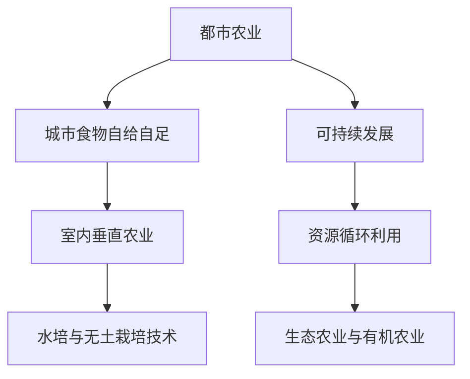

                 

### 都市农业革命的概念与背景

**1.1 都市农业革命的意义**

都市农业革命，是指通过技术创新和模式创新，在城市区域内实现高效、可持续的食物生产，从而解决城市食物自给自足问题。这一革命不仅关乎食品安全，更对城市生态环境、居民健康和经济发展具有深远的影响。

首先，都市农业革命有助于提高食品安全。传统的城市食物供应链往往依赖远距离运输，容易导致食物损耗和污染。而都市农业通过本地化生产，减少了运输环节，降低了食品安全风险。同时，都市农业采用先进的生物技术和工程方法，确保了食物的高质量和安全性。

其次，都市农业革命对城市生态环境具有积极意义。传统农业往往依赖大量水资源和化肥，对生态环境造成较大压力。而都市农业通过资源循环利用、生态农业和有机农业等技术，实现了对土地、水资源和空气的高效利用，有助于改善城市生态环境。

再次，都市农业革命对居民健康具有重要意义。城市居民普遍面临饮食不均衡、营养缺乏等问题。都市农业革命通过提供新鲜、多样化的食物，有助于改善居民饮食结构，提高生活质量。

最后，都市农业革命对经济发展具有推动作用。通过发展都市农业，可以创造大量就业机会，促进相关产业链的发展。同时，都市农业也为城市提供了新的经济增长点，有助于提升城市竞争力。

**1.2 城市食物供应链的现状与挑战**

当前，城市食物供应链面临诸多挑战。首先，运输距离过长导致食物损耗和污染。据统计，全球每年因运输损耗的食物高达13亿吨，造成了巨大的经济和社会损失。

其次，传统农业模式依赖大量化肥、农药等化学物质，对环境造成严重污染。同时，这些化学物质也进入了城市食物供应链，对居民健康构成威胁。

此外，城市食物供应链存在信息不对称和透明度低的问题。消费者往往无法得知食物的生产、运输、储存等全过程，难以确保食品安全。

最后，城市食物供应链缺乏灵活性和应对突发事件的能力。例如，在自然灾害、疫情等突发情况下，城市食物供应链容易受到冲击，导致供应短缺。

**1.3 都市农业革命的主要驱动因素**

都市农业革命的主要驱动因素包括技术创新、政策支持、市场驱动和可持续发展需求。

首先，技术创新是都市农业革命的核心动力。现代生物技术、物联网、大数据、人工智能等技术的快速发展，为都市农业提供了丰富的工具和方法，提高了生产效率、品质和可持续性。

其次，政策支持是都市农业革命的重要保障。各国政府纷纷出台政策，鼓励和支持都市农业的发展。例如，日本、美国、欧洲等地区制定了一系列法规，推动城市农业技术创新和模式创新。

再次，市场驱动是都市农业革命的重要推动力。随着居民对食品安全、健康、环保的关注度提高，城市农业市场潜力巨大。许多企业、投资者和创业者纷纷投身都市农业领域，推动产业快速发展。

最后，可持续发展需求是都市农业革命的根本动因。面对全球气候变化、资源枯竭等挑战，可持续发展已成为全球共识。都市农业革命通过技术创新和模式创新，为实现可持续发展提供了有力支持。

**总结**

都市农业革命是应对城市食物供应链问题、改善城市生态环境、提高居民健康和促进经济发展的必由之路。通过技术创新、政策支持、市场驱动和可持续发展需求，都市农业革命必将引领未来城市发展的新潮流。

---

关键词：都市农业革命、城市食物自给自足、技术创新、政策支持、可持续发展

摘要：本文探讨了都市农业革命的概念与背景，分析了城市食物供应链的现状与挑战，并阐述了都市农业革命的主要驱动因素。通过技术创新、政策支持、市场驱动和可持续发展需求，都市农业革命有望成为未来城市发展的新趋势。

# 《都市农业革命：城市食物自给自足的新模式》目录大纲

## 第一部分：都市农业革命概述

### 第1章：都市农业革命的概念与背景

- 1.1 都市农业革命的意义
- 1.2 城市食物供应链的现状与挑战
- 1.3 都市农业革命的主要驱动因素

### 第2章：都市农业革命的理论基础

- 2.1 现代农业技术的发展
- 2.2 可持续发展的概念与原则
- 2.3 城市农业与乡村农业的互动关系

## 第二部分：城市食物自给自足的实践探索

### 第3章：城市农业模式创新

- 3.1 室内垂直农业
- 3.2 水培与无土栽培技术
- 3.3 城市农业园区的建设与运营

### 第4章：城市社区的参与与支持

- 4.1 城市社区农业的推广与实践
- 4.2 居民参与城市农业的模式与途径
- 4.3 城市农业社区的组织与运营

### 第5章：城市农业的可持续发展

- 5.1 资源循环利用与环保技术
- 5.2 生态农业与有机农业
- 5.3 城市农业的可持续发展规划

## 第三部分：案例分析

### 第6章：全球都市农业革命案例研究

- 6.1 日本的都市农业实践
- 6.2 美国的城市食物自给自足计划
- 6.3 欧洲城市农业的可持续发展策略

### 第7章：中国都市农业革命实践

- 7.1 中国城市农业的发展现状
- 7.2 中国城市农业的创新模式
- 7.3 中国城市农业发展的挑战与机遇

## 第四部分：未来展望

### 第8章：都市农业革命的未来趋势

- 8.1 技术进步对都市农业的影响
- 8.2 城市与乡村的深度融合
- 8.3 城市农业的未来发展路径

### 第9章：政策建议与行动指南

- 9.1 政策支持与法规制定
- 9.2 社会参与与市场机制
- 9.3 城市农业教育与研究

---

### 附录

- 附录A：都市农业相关资源与工具
- 附录B：都市农业项目开发指南
- 附录C：城市农业案例分析资料

---

# 都市农业革命的核心概念与联系

## 概念实体关系架构

---

## 都市农业革命的核心概念与联系

都市农业革命不仅仅是城市食物生产模式的转变，它还涉及到一系列核心概念的融合与创新。为了更好地理解都市农业革命的内涵，我们首先需要明确几个关键概念，并探讨它们之间的联系。

### 核心概念

1. **都市农业**：这是都市农业革命的基础，指的是在城市区域内进行农业生产的活动。都市农业不同于传统农业，它更注重利用有限的土地、水资源和空间，通过技术创新实现高效、可持续的生产。

2. **城市食物自给自足**：这是都市农业革命的目标，即通过在城市内部实现食物的生产，减少对外部供应链的依赖，提高城市的自给能力。

3. **可持续发展**：这是都市农业革命的原则，意味着在满足当前需求的同时，不损害未来世代满足其需求的能力。可持续发展要求在都市农业中采用环保、节能、高效的技术和模式。

4. **资源循环利用**：这是实现可持续发展的关键，通过回收和再利用废弃物，减少资源消耗和环境污染。

5. **生态农业与有机农业**：这是都市农业革命中的重要实践，生态农业强调生态系统平衡和生物多样性，而有机农业则侧重于不使用化学合成肥料和农药。

### 概念实体关系架构

为了更直观地展示这些概念之间的联系，我们可以使用Mermaid图来构建概念实体关系架构：

- **都市农业**（A）是整个框架的核心，它是实现城市食物自给自足（B）的基础。室内垂直农业（C）和水培与无土栽培技术（D）是都市农业的创新模式，它们直接服务于城市食物自给自足的目标。
- **可持续发展**（E）是都市农业的革命原则，它贯穿于整个农业生产的全过程。资源循环利用（F）是实现可持续发展的关键，而生态农业与有机农业（G）则是资源循环利用的具体实践。

通过这种关系架构，我们可以看到都市农业革命不是孤立的，而是多个概念相互关联、相互支撑的复杂系统。

### 概念的相互作用

1. **都市农业**和**城市食物自给自足**：都市农业的目标是减少对传统农业的依赖，实现城市食物的自给自足。这需要通过室内垂直农业、水培和无土栽培技术等创新模式来实现。例如，室内垂直农业可以在有限的土地上实现高效生产，而水培与无土栽培技术则可以最大限度地利用水资源。

2. **可持续发展**和**资源循环利用**：可持续发展的核心是保护环境和资源，而资源循环利用是实现这一目标的关键。在城市农业中，通过回收和处理废弃物，如农业废弃物、废水等，可以减少对自然资源的消耗，并降低环境污染。

3. **生态农业与有机农业**：生态农业和有机农业注重生态系统的平衡和生物多样性，它们是资源循环利用和可持续发展的具体体现。例如，有机农业不使用化学合成肥料和农药，通过有机物的循环利用，保护土壤健康和生态环境。

通过这些概念的相互作用，都市农业革命不仅实现了城市食物自给自足，还推动了可持续发展，为城市居民提供了健康、安全、环保的食物来源。

### 总结

都市农业革命的核心概念包括都市农业、城市食物自给自足、可持续发展、资源循环利用和生态农业与有机农业。这些概念相互关联，共同构建了都市农业革命的理论基础和实践框架。通过技术创新和模式创新，都市农业革命正在引领城市农业的发展，为城市居民提供可持续、高效、环保的食物生产模式。

---

在接下来的部分，我们将深入探讨都市农业革命的理论基础，包括现代农业技术的发展、可持续发展的概念与原则，以及城市农业与乡村农业的互动关系。这些理论基础将为都市农业革命的实践提供坚实的理论支持。

## 都市农业革命的理论基础

### 2.1 现代农业技术的发展

现代农业技术的快速发展为都市农业革命提供了强大的技术支撑。以下是几种关键技术的概述：

1. **室内垂直农业**：室内垂直农业利用垂直空间进行作物种植，通过控制光照、温度、湿度和营养供应，实现高效生产。这一技术不仅提高了作物产量，还减少了土地和水资源的消耗。

2. **水培与无土栽培技术**：水培和无土栽培技术通过使用水或营养液来培养作物，避免了土壤污染和病虫害问题。这种技术能够更精准地控制作物生长环境，提高生产效率和作物质量。

3. **自动化与机器人技术**：自动化和机器人技术在都市农业中的应用越来越广泛。从播种、灌溉、施肥到采摘，自动化设备可以显著提高生产效率，降低人力成本，并确保作物生长环境的一致性。

4. **物联网与大数据技术**：物联网和大数据技术通过传感器和数据分析，实时监控和优化作物生长环境。这些技术可以帮助农民做出更明智的决策，提高作物产量和质量。

5. **生物技术与基因编辑**：生物技术和基因编辑技术可以培育出抗病虫害、耐逆性更强的作物品种，提高作物产量和品质。此外，这些技术还可以开发出具有特殊营养价值的作物，满足人们对健康食品的需求。

### 2.2 可持续发展的概念与原则

可持续发展是指在满足当前需求的同时，不损害未来世代满足其需求的能力。在都市农业革命中，可持续发展原则贯穿于整个农业生产的各个环节。以下是几个关键原则：

1. **生态平衡**：在城市农业中，维护生态平衡至关重要。通过生态农业和有机农业实践，减少化学农药和化肥的使用，保护土壤健康和生物多样性。

2. **资源高效利用**：都市农业革命强调资源的高效利用，通过技术创新，减少水、土地和能源的消耗。例如，水培和无土栽培技术可以最大限度地利用水资源，而室内垂直农业则可以节省土地资源。

3. **废物循环利用**：都市农业革命倡导废物循环利用，通过回收和处理废弃物，减少对自然资源的依赖。例如，农业废弃物可以转化为肥料或能源，废水可以通过处理再次利用。

4. **经济效益**：可持续发展不仅要考虑环境和生态，还要关注经济效益。通过创新技术和商业模式，都市农业可以实现高效生产，创造就业机会，提高城市经济竞争力。

### 2.3 城市农业与乡村农业的互动关系

城市农业与乡村农业之间存在紧密的互动关系，二者共同构成了现代农业体系。以下是城市农业与乡村农业的互动关系：

1. **技术转移与交流**：城市农业在技术创新方面具有优势，可以将先进技术转移到乡村农业。例如，自动化设备、物联网系统和生物技术等，这些技术的应用可以提高乡村农业的生产效率和产品质量。

2. **资源共享**：城市农业和乡村农业可以共享资源，如土地、水资源和劳动力。城市农业可以利用乡村的土地资源进行生产，而乡村农业则可以提供农产品供应城市市场。

3. **产业链合作**：城市农业与乡村农业可以通过产业链合作，实现优势互补。例如，乡村农业可以提供原材料，城市农业则负责加工和销售，从而形成完整的产业链。

4. **知识传播**：城市农业和乡村农业之间的互动有助于知识传播。城市农业的研究成果和经验可以反馈到乡村农业中，促进农业技术的普及和应用。

### 总结

都市农业革命的理论基础包括现代农业技术的发展、可持续发展的概念与原则，以及城市农业与乡村农业的互动关系。这些理论基础不仅为都市农业革命提供了技术支持，还为实现城市食物自给自足和可持续发展提供了指导。通过技术创新和模式创新，都市农业革命正在推动现代农业体系的发展，为城市居民提供更健康、安全、环保的食物来源。

在下一部分，我们将深入探讨城市农业模式创新的实践，包括室内垂直农业、水培与无土栽培技术，以及城市农业园区的建设与运营。

### 3.1 室内垂直农业

室内垂直农业是一种在垂直空间中进行作物种植的技术，通过利用多层种植架和先进的生长环境控制系统，实现高效、可持续的农业生产。以下是室内垂直农业的关键特点和优势：

**关键特点**：

1. **空间利用**：室内垂直农业利用垂直空间进行种植，可以在有限的城市土地上实现高密度生产。这种方法大大提高了单位面积的产量，尤其适用于土地资源稀缺的城市。

2. **环境控制**：通过自动化控制系统，室内垂直农业可以精确控制光照、温度、湿度和二氧化碳浓度等生长环境因素，为作物提供最佳生长条件。

3. **节水高效**：室内垂直农业采用水培或无土栽培技术，通过循环利用营养液和废水，实现了水资源的节约和高效利用。

4. **减少病虫害**：室内环境封闭，减少了病虫害的发生，降低了农药的使用。

**优势**：

1. **高产量**：由于环境控制的优化，室内垂直农业可以显著提高作物产量，是传统农业产量的数倍甚至数十倍。

2. **全年生产**：不受季节和气候限制，室内垂直农业可以实现全年生产，满足市场对新鲜蔬菜和水果的需求。

3. **减少运输成本**：本地化生产减少了运输环节，降低了运输成本，同时保证了食物的新鲜度和质量。

4. **可持续性**：室内垂直农业通过资源循环利用和减少碳排放，具有显著的环保效益。

**案例分析**：

一个成功的室内垂直农业案例是位于纽约市的“Future Farm”项目。该项目使用高科技温室和自动化设备，种植了各种蔬菜和香草，不仅满足了当地市场的需求，还实现了全年无休的连续生产。

**实现步骤**：

1. **环境搭建**：选择合适的场地，建设多层种植架，安装环境控制系统，包括照明、温度、湿度、通风和灌溉设备。

2. **种植技术**：选择适合垂直种植的作物，如生菜、菠菜、草莓等，采用水培或无土栽培技术进行种植。

3. **自动化管理**：利用物联网和自动化系统，实时监控和调整生长环境参数，确保作物健康成长。

4. **营养液循环**：设计营养液循环系统，回收和处理废水，确保营养液的持续供应。

5. **采收与包装**：根据市场需求，定期采收作物，进行清洗、包装和配送。

### 3.2 水培与无土栽培技术

水培与无土栽培技术是室内垂直农业的重要组成部分，通过营养液或基质替代土壤，为作物提供生长所需的养分和水分。以下是这两种技术的详细解释：

**水培技术**：

水培技术通过在水中加入适量的营养元素，直接将作物根系浸泡在营养液中。作物吸收营养液中的水分和养分，实现生长。水培技术的主要特点如下：

1. **无土栽培**：避免了土壤中的病虫害和污染问题，提高了作物品质。

2. **节水高效**：营养液可以循环使用，最大限度地节约了水资源。

3. **生长环境可控**：通过精确控制营养液成分和浓度，可以提供最佳的生长条件。

4. **适应性强**：水培作物不受土壤类型和气候条件限制，适合在室内或温室中种植。

**无土栽培技术**：

无土栽培技术使用各种有机或无机基质（如蛭石、珍珠岩、椰糠等）替代土壤，为作物提供支撑和养分。无土栽培的主要特点如下：

1. **减少病虫害**：避免了土壤中常见的病虫害问题，降低了农药使用量。

2. **节水高效**：虽然无土栽培仍需浇水，但水分利用效率比传统土壤栽培高。

3. **生长环境可控**：通过定期更换和调整基质，可以保持作物生长所需的环境条件。

4. **生产周期短**：无土栽培作物生长周期较短，有利于快速收获。

**实现步骤**：

1. **选择合适的技术**：根据作物类型和生长需求，选择水培或无土栽培技术。

2. **准备营养液或基质**：根据作物生长需求，配置适宜的营养液或选择合适的基质。

3. **搭建栽培系统**：安装栽培槽、灌溉系统、通风系统和环境监控设备。

4. **种植作物**：将种子或幼苗种植在营养液或基质中，并进行初期管理。

5. **环境监控与调整**：实时监控作物生长环境，根据需要调整营养液成分和灌溉量。

6. **采收与包装**：定期采收作物，进行清洗、包装和配送。

**案例分析**：

水培与无土栽培技术的成功案例包括中国的“深圳绿色农业园”和荷兰的“飞利浦智能温室”。这些项目通过先进的水培和无土栽培技术，实现了高效、可持续的农业生产，为当地市场提供了新鲜、优质的蔬菜和水果。

### 3.3 城市农业园区的建设与运营

城市农业园区是集中展示和推广都市农业技术的重要平台，通过整合各种农业生产模式和技术，实现城市食物自给自足的目标。以下是城市农业园区建设与运营的关键要素：

**建设要素**：

1. **规划布局**：根据城市特点和需求，合理规划农业园区布局，包括种植区、养殖区、研发区、展示区和销售区等。

2. **基础设施**：建设必要的设施，如温室、种植架、灌溉系统、环境监控系统、物流配送中心等。

3. **技术支持**：引进先进的农业技术，包括室内垂直农业、水培与无土栽培技术、自动化和机器人技术等。

4. **科研与教育**：设立科研机构和教育培训中心，推动农业技术创新和人才培养。

**运营要素**：

1. **多元化经营**：通过种植、养殖、加工、销售等多种方式，实现农业园区的多元化经营。

2. **合作与联盟**：与农业企业、科研机构、政府机构等建立合作关系，共同推动农业园区的发展。

3. **市场推广**：利用现代营销手段，推广园区生产的农产品，开拓市场渠道。

4. **社区参与**：鼓励社区居民参与农业园区的建设与运营，提高社区对农业的认识和参与度。

**案例分析**：

一个典型的城市农业园区案例是日本的“大阪都市农业园区”。该园区通过整合多种农业技术，实现了高效、可持续的农业生产，不仅为当地居民提供了新鲜、优质的农产品，还成为城市绿化和文化展示的亮点。

### 总结

城市农业模式创新是都市农业革命的重要实践，包括室内垂直农业、水培与无土栽培技术，以及城市农业园区的建设与运营。这些创新模式通过提高生产效率、节约资源、减少环境污染，为实现城市食物自给自足和可持续发展提供了有力支持。在下一部分，我们将探讨城市社区如何参与和支持都市农业的实践。

### 4.1 城市社区农业的推广与实践

城市社区农业的推广与实践是都市农业革命的重要组成部分，通过将农业活动引入城市社区，不仅可以提高居民的食品安全意识和健康水平，还能促进社区的可持续发展。以下是城市社区农业的推广与实践方式：

**1. 社区花园与菜园建设**

社区花园和菜园是城市社区农业的重要实践形式。通过在社区内规划和小块农田的种植，居民可以亲手种植蔬菜、水果和花卉，实现“从土地到餐桌”的农业生产过程。这种方式不仅提供了新鲜、健康的食物，还增强了居民的参与感和社区凝聚力。

**推广步骤**：

- **规划与设计**：根据社区实际情况，规划社区花园和菜园的布局，选择合适的种植方式（如垂直种植、水培或无土栽培）。
- **资源整合**：与当地政府、农业企业、社会组织和志愿者合作，共同筹集资金、设备和人力资源。
- **种植培训**：为居民提供种植技术培训，确保他们能够正确操作和管理社区花园和菜园。

**实践案例**：

- **纽约的“城市农场”**：纽约的多个社区建立了城市农场，通过居民参与种植、管理和销售农产品，实现了社区食物自给自足。这些农场不仅提供了新鲜食品，还举办了各种教育活动，提高了居民的食品安全意识。

- **伦敦的“社区菜园”**：伦敦的多个社区建立了社区菜园，居民可以在菜园中种植蔬菜、水果和香草，享受种植的乐趣。社区菜园还通过销售农产品，为居民创造了额外的收入来源。

**2. 居民参与与教育**

居民参与和教育是城市社区农业推广的关键。通过教育和培训，居民可以了解农业知识、技能和环境问题，提高他们对城市农业的认识和支持度。

**推广步骤**：

- **开展教育活动**：在社区内举办农业知识讲座、种植培训班和工作坊，吸引居民参与。
- **互动体验**：组织居民参与农业活动，如播种、灌溉、采摘等，增强他们的实践经验和参与感。
- **推广社区合作**：鼓励居民之间互相帮助，共同参与农业活动和社区农场的管理。

**实践案例**：

- **柏林的“城市农业体验中心”**：柏林的多个社区建立了城市农业体验中心，为居民提供种植、采摘和烹饪的体验。这些中心不仅提供了教育机会，还促进了社区的互动和合作。

- **悉尼的“城市农业社区”**：悉尼的多个社区通过建立城市农业社区，组织居民参与农业活动和食品制作。这些社区不仅提供了健康、可持续的食品来源，还创造了社交和学习的平台。

**3. 社区支持与政策**

社区支持和政策是城市社区农业推广的重要保障。政府和社会组织可以通过提供资金、技术和政策支持，鼓励和推动城市社区农业的发展。

**推广步骤**：

- **政策支持**：制定有利于城市社区农业发展的政策和法规，提供税收优惠、补贴和贷款等支持措施。
- **资金投入**：为社区农业项目提供资金支持，用于建设基础设施、购买设备和培训人员。
- **技术支持**：提供农业技术培训、技术咨询和研发支持，帮助社区农业实现高效、可持续的生产。

**实践案例**：

- **东京的“城市农业促进计划”**：东京市政府通过实施城市农业促进计划，提供资金和技术支持，鼓励社区建立农业项目和农场。这些项目不仅提高了居民的食品安全水平，还增强了社区的环保意识和可持续发展能力。

- **首尔的城市农场项目**：首尔市政府通过城市农场项目，为居民提供种植和销售农产品的机会。项目不仅提供了经济收益，还增强了社区的凝聚力和环保意识。

### 总结

城市社区农业的推广与实践是都市农业革命的重要实践方式，通过社区花园与菜园建设、居民参与与教育，以及社区支持与政策，可以促进城市食物自给自足和社区可持续发展。成功的案例表明，城市社区农业不仅提供了健康、可持续的食品来源，还增强了社区的凝聚力和环保意识。在下一部分，我们将进一步探讨居民如何参与城市农业的具体模式与途径。

### 4.2 居民参与城市农业的模式与途径

居民参与城市农业不仅是实现城市食物自给自足的重要途径，也是提升社区活力和居民生活质量的重要手段。以下是一些具体的居民参与城市农业的模式与途径：

**1. 社区农场**

社区农场是居民参与城市农业的一种常见模式。社区农场通常由社区成员共同管理，种植各种蔬菜、水果和草本植物。居民可以通过租赁小块土地、参加种植活动、购买农产品等方式参与社区农场。

**实现步骤**：

- **组织与管理**：成立社区农场管理委员会，负责农场规划、种植活动安排和管理。
- **土地分配**：根据社区需求，将农田分配给居民，并制定土地使用规则。
- **种植计划**：制定种植计划，包括作物种类、种植时间和种植方式。
- **培训和指导**：为居民提供农业技术培训，确保他们能够正确操作和管理农田。

**案例**：

- **芝加哥的社区农场**：芝加哥的许多社区农场由居民共同管理，种植了各种蔬菜和水果。农场不仅提供了新鲜食品，还组织了各种教育活动，提高了居民的农业知识和技能。

**2. 共同种植**

共同种植是一种让居民集体参与种植活动的模式。居民可以一起种植蔬菜、水果和花卉，共同享受种植的乐趣和成果。这种模式通常适合在社区花园、公园或学校等公共场所进行。

**实现步骤**：

- **场地选择**：选择合适的场地，如社区花园、公园或学校操场。
- **活动安排**：制定共同种植活动的时间表，包括种植、灌溉、采摘和分享等环节。
- **资源协调**：协调农业设备、种子、肥料等资源，确保种植活动顺利进行。
- **社区宣传**：通过宣传和动员，鼓励更多居民参与共同种植活动。

**案例**：

- **伦敦的社区花园**：伦敦的多个社区花园组织了共同种植活动，居民们一起种植蔬菜和花卉，享受种植的乐趣和成果。这些花园不仅美化了社区环境，还增强了居民的社区归属感。

**3. 居民合作社**

居民合作社是一种通过合作方式共同参与农业活动的模式。合作社通常由居民共同出资成立，用于购买农田、设备和种子，并雇佣农业工人进行生产。合作社成员可以分享农产品的收益，实现经济效益。

**实现步骤**：

- **成立合作社**：成立合作社管理委员会，制定合作社章程和运营规则。
- **资源筹集**：通过成员出资、政府补贴或社会捐赠等方式筹集资金。
- **农田租赁**：与土地所有者协商，租赁农田用于农业生产。
- **生产管理**：制定生产计划，管理农田和农业工人，确保农业生产顺利进行。

**案例**：

- **巴黎的居民合作社农场**：巴黎的多个居民合作社农场通过集体合作，种植了各种蔬菜和水果。农场不仅为成员提供了健康、新鲜的食品，还创造了就业机会，提高了社区的经济活力。

**4. 模拟农场**

模拟农场是一种通过模拟农业生产环境，让居民体验农业活动的模式。模拟农场通常设置在社区中心、学校或博物馆等场所，居民可以通过互动游戏、种植体验等方式了解农业知识。

**实现步骤**：

- **设施搭建**：搭建模拟农场设施，如种植箱、灌溉系统、气象站等。
- **教育活动**：组织农业教育活动，如种植课程、种植体验、农业知识讲座等。
- **互动体验**：设计互动游戏和体验项目，让居民了解农业生产的各个环节。
- **反馈与改进**：收集居民反馈，不断改进模拟农场的设施和服务。

**案例**：

- **华盛顿特区的模拟农场**：华盛顿特区的模拟农场为居民提供了丰富的农业体验活动。居民可以通过种植蔬菜、浇水、收割等环节，了解农业生产的全过程，增强对农业的认识和兴趣。

**5. 居民义务劳动**

居民义务劳动是一种通过志愿服务参与农业活动的模式。居民可以自愿报名参加农田维护、播种、灌溉等农业活动，为社区农业的发展贡献力量。

**实现步骤**：

- **组织动员**：通过社区公告、社交媒体等渠道，动员居民参与农业义务劳动。
- **任务分配**：根据居民能力和兴趣，分配不同的农业任务，如播种、灌溉、除草等。
- **培训指导**：为志愿者提供农业技术培训，确保他们能够正确操作和管理农业活动。
- **表彰与奖励**：对积极参与农业义务劳动的居民进行表彰和奖励，提高他们的参与热情。

**案例**：

- **柏林的农业志愿者项目**：柏林的农业志愿者项目吸引了大量居民参与。志愿者通过参与农田维护、种植活动等，为社区农业的发展做出了重要贡献。项目不仅提高了居民的农业技能，还增强了社区的凝聚力。

**总结**

居民参与城市农业的模式与途径多种多样，包括社区农场、共同种植、居民合作社、模拟农场和居民义务劳动等。这些模式不仅为居民提供了参与农业的机会，还增强了社区的凝聚力和环保意识。通过这些模式，城市农业可以实现可持续发展，为城市居民提供健康、可持续的食物来源。

在下一部分，我们将探讨城市农业社区的组织与运营，包括社区农业的组织结构、管理模式、运营策略和挑战。

### 4.3 城市农业社区的组织与运营

城市农业社区作为实现城市食物自给自足和促进社区可持续发展的重要平台，其组织与运营的成功与否直接影响到农业项目的可持续性和居民参与度。以下是城市农业社区的组织与运营详细探讨：

**1. 组织结构**

城市农业社区的组织结构通常包括以下几个层次：

- **管理委员会**：负责社区农业的整体规划、管理和决策。管理委员会由社区代表、志愿者和专业人士组成，确保决策的民主和科学性。
- **技术团队**：负责农业技术支持和种植管理，包括农业工程师、园艺师和农艺师等。技术团队提供种植方案、病虫害防治、土壤管理等方面的专业指导。
- **运营团队**：负责日常运营和管理，包括农田维护、灌溉管理、销售和财务等。运营团队确保农业项目的顺利运行和持续发展。
- **志愿者团队**：由热心农业的居民组成，参与农田种植、管理、教育和推广活动。志愿者团队增强了社区的凝聚力和参与度。

**2. 管理模式**

城市农业社区的管理模式通常采用以下几种方式：

- **民主参与**：社区成员通过选举产生管理委员会，参与农业项目的决策和管理。这种模式确保了农业项目的透明度和居民的主权。
- **专业管理**：聘请专业的农业技术人员和管理人员，确保农业项目的高效运行和技术创新。专业管理有助于提高农业生产的质量和可持续性。
- **合作共赢**：通过合作社或联营企业模式，居民和社区共同投资和管理农业项目。这种模式实现了资源的整合和利益共享，提高了项目的可持续发展能力。

**3. 运营策略**

城市农业社区的运营策略包括以下几个方面：

- **多元化经营**：结合种植、养殖、加工和销售等多种方式，实现农业项目的多元化经营。多元化经营不仅增加了农产品的种类和收入来源，还提高了社区的经济活力。
- **品牌建设**：打造社区农产品的品牌，通过质量认证和市场营销，提高农产品的知名度和市场竞争力。品牌建设有助于树立社区农业的形象，吸引更多消费者和投资者。
- **技术创新**：引进先进的农业技术，如室内垂直农业、水培与无土栽培技术、自动化和物联网系统等，提高生产效率和产品质量。技术创新是城市农业社区持续发展的关键。
- **社区参与**：鼓励居民积极参与农业项目，通过种植体验、教育活动和志愿服务，提高居民的农业技能和参与度。社区参与不仅增强了农业项目的可持续性，还提升了社区凝聚力。

**4. 挑战与对策**

城市农业社区在组织与运营过程中面临一些挑战，需要采取相应的对策：

- **资金与资源不足**：城市农业社区通常面临资金和资源的短缺问题。解决对策包括申请政府补贴、寻求社会捐赠和建立社区基金，以筹集充足的资金和资源。
- **技术和管理能力不足**：一些城市农业社区缺乏专业的农业技术和管理人才。解决对策是加强农业技术培训和管理能力建设，通过合作和交流，引进专业人才和经验。
- **市场竞争**：城市农业社区面临着市场竞争的压力。解决对策是提高农产品的质量和品牌影响力，通过差异化竞争，打造独特的市场定位。
- **环境与生态问题**：城市农业社区在运营过程中可能面临环境污染和生态破坏的问题。解决对策是推广生态农业和有机农业，采用环保技术和可持续生产模式，减少对环境的负面影响。

**总结**

城市农业社区的组织与运营是实现都市农业革命的重要实践。通过建立合理的组织结构、采用有效的管理模式和运营策略，城市农业社区可以高效、可持续地推动城市食物自给自足和社区可持续发展。同时，面对各种挑战，需要采取相应的对策，确保城市农业社区的健康和持续发展。

### 5.1 资源循环利用与环保技术

在都市农业革命中，资源循环利用与环保技术是实现可持续发展的关键。通过这些技术，都市农业能够最大限度地减少资源消耗和环境污染，实现高效、绿色和可持续的生产。

**1. 资源循环利用的概念**

资源循环利用是指在生产和消费过程中，通过回收、再利用和再生等方式，将废弃物转化为有用的资源，减少对自然资源的依赖。在都市农业中，资源循环利用包括水、肥料、能源和废弃物的回收利用。

**2. 水资源循环利用**

水是农业生产中最重要的资源之一。都市农业通过水资源的循环利用，可以显著降低水消耗。以下是一些常见的节水技术：

- **滴灌与微灌**：通过滴灌和微灌系统，将水直接输送到作物根部，减少了水的蒸发和渗漏，提高了灌溉效率。
- **雨水收集系统**：建设雨水收集池和渗透池，收集和储存雨水，用于灌溉和农田补充。
- **废水处理**：将农业废水和生活废水经过处理，去除有害物质，再用于灌溉和农田补充。

**案例**：北京的“菜篮子”工程通过建设雨水收集系统和废水处理设施，实现了农田灌溉水资源的循环利用，大幅减少了水资源的消耗。

**3. 肥料资源循环利用**

肥料是农业生产中不可或缺的资源。都市农业通过肥料资源的循环利用，可以减少化肥的使用，保护土壤健康和生态环境。以下是一些常见的肥料资源循环利用技术：

- **有机肥料**：通过堆肥、发酵等技术，将农作物残茬、动物粪便等有机废弃物转化为有机肥料，提供作物生长所需的养分。
- **生物肥料**：利用微生物菌剂和生物活性物质，促进作物生长，减少化肥使用。
- **精准施肥**：通过土壤分析和传感器技术，精确控制肥料施用量和时机，提高肥料利用率。

**案例**：上海的崇明岛通过实施有机肥料和生物肥料的应用，减少了化肥使用，提高了土壤质量，实现了绿色农业发展。

**4. 能源资源循环利用**

在都市农业中，能源资源循环利用可以减少对化石燃料的依赖，降低碳排放。以下是一些常见的能源资源循环利用技术：

- **太阳能和风能**：利用太阳能和风能等可再生能源，为农业生产提供电力和热能。
- **生物能源**：通过生物质能技术，将农作物废弃物转化为生物质燃料，用于农业生产和能源供应。
- **节能技术**：采用节能设备和工艺，减少能源消耗。

**案例**：日本的“农光互补”项目，将太阳能电池板安装在温室上方，既提供电力，又提供光照，实现了能源资源的循环利用。

**5. 废弃物资源循环利用**

都市农业中产生的废弃物包括农作物残茬、农业废水、动物粪便等。通过废弃物资源的循环利用，可以减少环境污染，实现资源的高效利用。以下是一些常见的废弃物资源循环利用技术：

- **有机废弃物堆肥**：将农作物残茬、动物粪便等有机废弃物进行堆肥处理，转化为有机肥料。
- **废水处理**：通过生物处理、化学处理和物理处理等技术，将农业废水净化，再用于灌溉和农田补充。
- **废弃物发电**：通过生物质发电技术，将农业废弃物转化为电能，用于农业生产和能源供应。

**案例**：德国的“生态农场”通过实施有机废弃物堆肥、废水处理和生物质发电技术，实现了废弃物的资源化利用，减少了环境污染。

**总结**

资源循环利用与环保技术是都市农业革命实现可持续发展的重要保障。通过水资源的循环利用、肥料资源的循环利用、能源资源的循环利用和废弃物资源的循环利用，都市农业可以在城市环境中实现高效、绿色和可持续的生产，为城市居民提供健康、安全的食物来源。

### 5.2 生态农业与有机农业

生态农业和有机农业是都市农业革命中实现可持续发展的关键策略，通过减少化学投入、保护生物多样性和提高土壤健康，这些农业模式为城市提供了环保、健康和可持续的食物来源。

**1. 生态农业的概念**

生态农业是一种以生态学原理为基础的农业模式，旨在通过维护和恢复生态系统平衡，实现农业生产的可持续发展。生态农业强调以下几个方面：

- **生物多样性保护**：生态农业通过保留自然生态系统，保护农作物、土壤和水源中的生物多样性。
- **生态平衡**：生态农业采用自然控制措施，如生物防治和生态管理，减少对化学农药和化肥的依赖。
- **土壤保护**：生态农业通过有机肥料和覆盖作物，保护土壤结构和肥力，提高土壤健康。

**2. 有机农业的概念**

有机农业是一种遵循有机标准进行生产的农业模式，它强调在农业生产过程中不使用化学合成肥料、农药和转基因技术。有机农业的核心原则包括：

- **自然种植**：有机农业使用天然肥料和有机种植方法，如堆肥、绿肥和生物防治，促进土壤健康和作物生长。
- **环境保护**：有机农业通过减少化学投入，保护水源、土壤和空气质量，减少环境污染。
- **动物福利**：有机农业注重动物福利，采用放养方式，提供无污染的饲料和良好的生活环境。

**3. 生态农业与有机农业的实践**

在城市农业中，生态农业和有机农业的实践可以采用以下几种方法：

- **有机肥料使用**：通过堆肥、动物粪便和绿肥等有机肥料，提高土壤肥力和作物产量。
- **生物防治**：采用天然敌害生物和微生物，如瓢虫、寄生蜂和生物农药，控制病虫害。
- **植被覆盖**：种植覆盖作物和保护作物，减少土壤侵蚀，提高土壤水分保持能力。
- **水资源管理**：通过雨水收集、废水处理和灌溉系统，实现水资源的有效利用和循环。

**案例**：

- **纽约市布鲁克林植物园的生态农场**：布鲁克林植物园的生态农场通过有机种植、生物防治和资源循环利用，实现了可持续的农业生产。农场不仅提供了新鲜、健康的农产品，还成为了环保教育和社区参与的重要平台。

- **伦敦的有机市场**：伦敦的多个有机市场销售有机农产品，鼓励消费者选择环保、健康的食品。这些市场通过推广有机农业，提高了公众对生态农业和有机农业的认识，促进了可持续食品的消费。

**4. 生态农业与有机农业的优势**

生态农业和有机农业在城市农业中具有显著的优势：

- **食品安全**：通过减少化学投入，生态农业和有机农业提供更加安全、健康的食物，减少了食物中的有害物质。
- **环境友好**：生态农业和有机农业通过减少化肥、农药的使用，降低了环境污染，保护了生态系统。
- **经济效益**：生态农业和有机农业可以创造新的经济机会，如有机农产品的销售、生态旅游和教育活动，增加了经济收入。
- **社区参与**：生态农业和有机农业鼓励社区居民参与农业生产和食品管理，增强了社区的凝聚力和环保意识。

**总结**

生态农业和有机农业是都市农业革命的重要组成部分，通过减少化学投入、保护生物多样性和提高土壤健康，这些农业模式为城市提供了可持续、环保和健康的食物来源。在都市农业的发展中，推广生态农业和有机农业不仅有助于实现食品安全和环境保护，还能创造新的经济机会，促进社区的可持续发展。

### 5.3 城市农业的可持续发展规划

城市农业的可持续发展规划是确保都市农业革命成功实施和长期可持续发展的关键。以下是一些重要的规划原则、策略和实践方法，以促进城市农业的可持续发展。

**1. 规划原则**

- **适应性规划**：城市农业规划应具备适应性，能够应对气候变化、资源枯竭和市场需求变化。规划应考虑到未来的不确定性，并具备灵活调整的能力。

- **多功能性**：城市农业不应仅限于食物生产，还应具备生态、教育、休闲和社会等多重功能。这种多功能性可以增加城市农业的吸引力，提高居民参与度。

- **社区参与**：居民参与是城市农业可持续发展的重要保障。规划应鼓励和促进居民参与农业活动，提高他们的主人翁意识和责任感。

- **科技创新**：科技创新是城市农业可持续发展的动力。规划应注重引入先进的农业技术和管理方法，提高生产效率和可持续性。

**2. 规划策略**

- **土地利用优化**：合理规划土地利用，确保农业生产区、生活区和生态区的协调布局。通过垂直农业、屋顶农业和城市绿化带等方式，最大限度地利用有限的空间资源。

- **水资源管理**：水资源是城市农业的关键资源。规划应注重水资源的管理和节约，采用雨水收集、废水处理和灌溉系统等技术，实现水资源的循环利用。

- **废弃物处理与利用**：城市农业产生的废弃物应得到妥善处理和再利用。通过堆肥、生物处理和能源回收等技术，将废弃物转化为有用的资源，减少环境污染。

- **政策支持**：政府应制定有利于城市农业发展的政策和法规，提供资金、技术和市场支持，鼓励企业和个人参与城市农业。

**3. 实践方法**

- **社区农业项目**：通过建立社区农场、社区菜园和社区合作社，鼓励居民参与城市农业。这些项目不仅可以提供新鲜、健康的食物，还能增强社区的凝聚力和可持续性。

- **生态农业与有机农业**：推广生态农业和有机农业，减少化学投入，保护生态环境和生物多样性。通过有机认证和绿色标志，提高农产品的市场竞争力。

- **智慧农业**：利用物联网、大数据和人工智能等技术，实现农业生产的智能化和精准化。通过实时监控和数据分析，优化生产管理，提高生产效率和产品质量。

- **教育与培训**：开展农业教育和培训，提高居民对城市农业的认识和技能。通过学校课程、社区活动和在线平台，普及农业知识，培养新一代农业人才。

**4. 案例分析**

- **纽约市城市农业规划**：纽约市通过制定城市农业规划，鼓励社区参与，推广生态农业和有机农业。规划包括社区农场、屋顶农业和城市绿化带等，实现了城市食物自给自足和环境保护。

- **首尔市绿色农业计划**：首尔市实施绿色农业计划，通过政策支持和资金投入，推动城市农业的发展。计划包括建立生态农场、社区菜园和农产品市场，提高了城市居民的生活质量和环保意识。

**总结**

城市农业的可持续发展规划需要综合考虑土地利用、水资源管理、废弃物处理和政策支持等多个方面。通过适应性规划、多功能性策略、科技创新和实践方法，城市农业可以实现可持续、高效和环保的生产，为城市居民提供健康、安全、可持续的食物来源，同时促进社区的可持续发展。

### 6.1 日本的都市农业实践

日本是都市农业革命的先行者之一，通过多年的探索和实践，日本在城市农业领域取得了显著成就。以下是对日本都市农业实践的详细分析。

**1. 发展现状**

日本的都市农业发展始于20世纪80年代，近年来随着城市化进程的加快和食品安全问题的日益突出，都市农业的地位日益上升。目前，日本都市农业主要包括以下几个方面：

- **社区农业**：日本城市社区广泛开展农业活动，如社区农场、社区菜园和屋顶农场。这些项目不仅为居民提供新鲜、健康的食品，还增强了社区的凝聚力和环保意识。
- **室内垂直农业**：日本在室内垂直农业方面有着丰富的经验，通过利用多层种植架和先进的生长环境控制系统，实现了高效、可持续的生产。例如，东京的“垂直农场”项目通过水培技术，实现了全年无休的蔬菜生产。
- **水培与无土栽培技术**：日本在城市农业中广泛应用水培与无土栽培技术，通过营养液的精确控制，提高了作物的产量和质量。这些技术不仅节省了水资源，还减少了土地的占用。

**2. 核心创新**

日本的都市农业实践在技术创新和模式创新方面具有显著特点：

- **智能农业技术**：日本在城市农业中广泛应用物联网、大数据和人工智能技术。通过实时监控和数据分析，农民可以精确控制作物生长环境，优化生产过程，提高生产效率。
- **农业机器人**：日本开发了一系列农业机器人，用于种植、灌溉、施肥和采摘等农业活动。这些机器人可以显著降低劳动力成本，提高生产效率，同时减少对环境的负面影响。
- **生态循环系统**：日本在城市农业中实施生态循环系统，通过废弃物资源化利用和再生能源的应用，实现了资源的高效利用和零排放。例如，在东京的某些农业园区，废水和废气被回收再利用，实现了农业生产的可持续发展。

**3. 政策支持**

日本政府对都市农业的发展提供了大力支持，通过一系列政策促进了都市农业的创新和普及：

- **资金支持**：政府提供专项资金，用于支持都市农业项目的建设和技术研发。这些资金支持涵盖了种植设备、温室建设、农业机器人购置等多个方面。
- **税收优惠**：政府对从事都市农业的企业和个人提供税收优惠，鼓励更多人参与都市农业活动。
- **教育和培训**：政府通过农业教育机构和社区活动，普及农业知识和技术，提高农民的技能和素质。

**4. 案例分析**

- **东京的“都市农场”**：东京的“都市农场”项目是日本都市农业的典范。该项目利用室内垂直农业和水培技术，实现了全年无休的蔬菜生产。农场采用智能化管理系统，实时监控作物生长环境，确保作物健康成长。该项目不仅为东京市民提供了新鲜、健康的农产品，还成为城市绿色景观的一部分。
- **大阪的“生态农业园区”**：大阪的“生态农业园区”通过实施生态循环系统和智能农业技术，实现了农业生产的可持续发展。园区采用水培和无土栽培技术，通过营养液的循环利用，最大限度地节约了水资源。园区还开发了农业机器人，用于种植、灌溉和采摘，降低了劳动力成本，提高了生产效率。

**总结**

日本在城市农业方面取得了显著成就，其都市农业实践为全球提供了宝贵的经验和启示。通过技术创新、政策支持和模式创新，日本实现了城市食物自给自足和可持续发展。日本的经验表明，都市农业不仅是解决食品安全和环境保护问题的重要途径，也是推动城市经济发展的新动力。

### 6.2 美国的城市食物自给自足计划

美国在城市食物自给自足方面积极探索和实践，通过多种计划和政策，推动了城市农业的发展。以下是对美国城市食物自给自足计划的详细分析。

**1. 发展现状**

美国的城市食物自给自足计划起步较早，自20世纪70年代以来，随着对食品安全和环境保护的重视，城市农业得到了快速发展。目前，美国城市食物自给自足计划的主要形式包括：

- **社区农业**：美国许多城市建立了社区农业项目，如社区菜园、社区农场和社区厨房。这些项目鼓励居民参与农业生产，提供新鲜、健康的农产品，同时增强社区的凝聚力和环保意识。
- **垂直农业**：美国在垂直农业领域进行了大量探索，通过利用室内垂直农场、温室和多层种植架，实现高效、可持续的食物生产。例如，纽约市的“Brooklyn Grange”垂直农场项目，通过水培技术，实现了全年无休的蔬菜生产。
- **水培与无土栽培技术**：水培与无土栽培技术在美国家庭农场和商业农场中广泛应用，通过营养液的精确控制，提高了作物的产量和质量。这些技术不仅节省了水资源，还减少了土地的占用。

**2. 核心创新**

美国的城市食物自给自足计划在技术创新和模式创新方面具有显著特点：

- **智能农业技术**：美国在城市农业中广泛应用物联网、大数据和人工智能技术。通过实时监控和数据分析，农民可以精确控制作物生长环境，优化生产过程，提高生产效率。例如，美国的一些农场采用了无人机和机器人进行精准农业管理。
- **农业共享经济**：美国兴起了一系列农业共享平台，如共享菜园、共享农场和共享厨房。这些平台通过互联网和移动互联网，为居民提供参与城市农业的机会，同时降低了农业生产的成本。
- **生态循环系统**：美国在城市农业中实施生态循环系统，通过废弃物资源化利用和再生能源的应用，实现了资源的高效利用和零排放。例如，在洛杉矶的一些农业园区，废水和废气被回收再利用，实现了农业生产的可持续发展。

**3. 政策支持**

美国政府对城市食物自给自足计划提供了大力支持，通过一系列政策促进了城市农业的创新和普及：

- **资金支持**：政府提供专项资金，用于支持城市农业项目的建设和运营。这些资金支持涵盖了种植设备、温室建设、农业机器人购置等多个方面。
- **税收优惠**：政府对从事城市农业的企业和个人提供税收优惠，鼓励更多人参与城市农业活动。
- **教育和培训**：政府通过农业教育机构和社区活动，普及农业知识和技术，提高农民的技能和素质。

**4. 案例分析**

- **纽约市的“Brooklyn Grange”垂直农场**：纽约市的“Brooklyn Grange”垂直农场项目是美国的典型代表。该项目通过水培技术，在废弃的工业建筑上建立了多层种植架，实现了全年无休的蔬菜生产。农场不仅为纽约市民提供了新鲜、健康的农产品，还成为城市绿色景观的一部分。
- **洛杉矶的“生态农业园区”**：洛杉矶的“生态农业园区”通过实施生态循环系统和智能农业技术，实现了农业生产的可持续发展。园区采用水培和无土栽培技术，通过营养液的循环利用，最大限度地节约了水资源。园区还开发了农业机器人，用于种植、灌溉和采摘，降低了劳动力成本，提高了生产效率。

**总结**

美国在城市食物自给自足方面取得了显著成就，通过多种计划和政策，推动了城市农业的发展。美国经验表明，城市农业不仅是解决食品安全和环境保护问题的重要途径，也是推动城市经济发展的新动力。通过技术创新、模式创新和政策支持，美国实现了城市食物自给自足和可持续发展。

### 6.3 欧洲城市农业的可持续发展策略

欧洲城市农业在可持续发展方面具有丰富的经验和成熟的策略，通过政策支持、技术创新和社区参与，实现了城市食物自给自足和环境保护的双重目标。以下是对欧洲城市农业可持续发展策略的详细分析。

**1. 发展现状**

欧洲城市农业的发展可以追溯到20世纪末，随着城市化进程的加快和对可持续发展的重视，城市农业在欧州各国得到了快速发展。目前，欧洲城市农业的主要形式包括：

- **社区农业**：欧洲城市广泛开展社区农业项目，如社区菜园、社区农场和城市农场。这些项目鼓励居民参与农业生产，提供新鲜、健康的农产品，同时增强社区的凝聚力和环保意识。
- **室内垂直农业**：欧洲国家在室内垂直农业领域进行了大量探索，通过利用多层种植架和先进的生长环境控制系统，实现了高效、可持续的生产。例如，荷兰的阿姆斯特丹建立了多个垂直农场，利用水培技术，实现了全年无休的蔬菜生产。
- **生态农业与有机农业**：欧洲在城市农业中广泛应用生态农业和有机农业，通过减少化学投入、保护生物多样性和提高土壤健康，实现了农业生产的可持续发展。例如，德国的柏林市通过推广有机农业，提高了城市农产品的质量和市场竞争力。

**2. 政策支持**

欧洲城市农业的可持续发展得益于一系列政策支持，这些政策涵盖了资金、税收、教育和市场等多个方面：

- **资金支持**：欧洲各国政府提供专项资金，用于支持城市农业项目的建设和运营。这些资金支持涵盖了种植设备、温室建设、农业机器人购置等多个方面。
- **税收优惠**：政府为从事城市农业的企业和个人提供税收优惠，鼓励更多人参与城市农业活动。
- **教育和培训**：政府通过农业教育机构和社区活动，普及农业知识和技术，提高农民的技能和素质。
- **市场支持**：政府通过补贴和推广，支持城市农产品的销售和消费，促进城市农业的发展。

**3. 核心创新**

欧洲城市农业的可持续发展策略在技术创新和模式创新方面具有显著特点：

- **智能农业技术**：欧洲在城市农业中广泛应用物联网、大数据和人工智能技术。通过实时监控和数据分析，农民可以精确控制作物生长环境，优化生产过程，提高生产效率。例如，荷兰的农场采用了无人机和机器人进行精准农业管理。
- **农业共享经济**：欧洲兴起了一系列农业共享平台，如共享菜园、共享农场和共享厨房。这些平台通过互联网和移动互联网，为居民提供参与城市农业的机会，同时降低了农业生产的成本。
- **生态循环系统**：欧洲在城市农业中实施生态循环系统，通过废弃物资源化利用和再生能源的应用，实现了资源的高效利用和零排放。例如，法国的巴黎市在农业园区内建立了废水处理和再生能源利用系统，实现了农业生产的可持续发展。

**4. 社区参与**

欧洲城市农业的可持续发展离不开社区居民的积极参与。通过以下方式，社区参与了城市农业的发展：

- **社区农业项目**：欧洲城市广泛开展社区农业项目，如社区菜园、社区农场和城市农场。这些项目不仅为居民提供新鲜、健康的农产品，还增强了社区的凝聚力和环保意识。
- **居民教育**：通过农业教育和培训，提高居民对城市农业的认识和技能。学校、社区中心和农业教育机构组织了一系列农业教育活动，普及农业知识和技术。
- **社区合作**：通过社区合作，居民共同参与城市农业项目的规划、建设和运营。这种方式不仅提高了农业项目的效率，还增强了社区的团结和合作精神。

**5. 案例分析**

- **荷兰的“阿姆斯特丹垂直农场”**：荷兰的阿姆斯特丹市建立了多个垂直农场，利用水培技术，实现了全年无休的蔬菜生产。农场采用智能化管理系统，实时监控作物生长环境，确保作物健康成长。该农场不仅为阿姆斯特丹市民提供了新鲜、健康的农产品，还成为城市绿色景观的一部分。
- **德国的“柏林有机农场”**：柏林市通过推广有机农业，实现了城市农业的可持续发展。柏林的多个有机农场采用生态农业和有机农业技术，减少化学投入，保护生态环境和生物多样性。这些农场不仅为柏林市民提供了有机农产品，还成为了城市生态旅游的热点。

**总结**

欧洲城市农业的可持续发展策略通过政策支持、技术创新和社区参与，实现了城市食物自给自足和环境保护的双重目标。欧洲的经验表明，城市农业不仅是解决食品安全和环境保护问题的重要途径，也是推动城市经济发展的新动力。通过政策引导、技术创新和社区合作，欧洲城市农业为全球提供了宝贵的经验和启示。

### 7.1 中国城市农业的发展现状

中国城市农业近年来取得了显著进展，已成为城市可持续发展的重要组成部分。以下是对中国城市农业发展现状的详细分析。

**1. 发展规模**

中国城市农业的发展规模不断扩大。截至2020年，全国城市农业用地面积已超过3000万亩，其中，城市社区农业用地面积超过1000万亩。此外，许多城市还积极推广屋顶农业和垂直农业，利用有限的土地资源实现高效生产。

**2. 技术应用**

中国在城市农业中广泛应用现代科技，提高生产效率和产品质量。以下是几个关键技术的应用：

- **室内垂直农业**：中国多个城市建立了室内垂直农场，通过水培、雾培等技术，实现了蔬菜、水果等作物的全年生产。例如，上海的“城之源”垂直农场，利用智能温室和自动化设备，实现了高效、可持续的农业生产。
- **水培与无土栽培技术**：水培与无土栽培技术在中国城市农业中广泛应用，通过营养液的精确控制，提高了作物的产量和质量。例如，北京的“绿色农场”项目，通过水培技术，实现了多种蔬菜的高效生产。
- **物联网与大数据技术**：物联网和大数据技术在城市农业中得到了广泛应用，通过实时监控和数据分析，农民可以精确控制作物生长环境，优化生产过程。例如，杭州的“智慧农场”项目，通过物联网设备，实现了作物生长环境的智能化管理。

**3. 社区参与**

社区参与是中国城市农业发展的重要特点。许多城市通过建立社区农场、社区菜园和社区合作社，鼓励居民参与农业生产。以下是几种社区参与模式：

- **社区农场**：许多城市建立了社区农场，居民可以通过租赁小块土地、参与种植活动、购买农产品等方式参与农场管理。例如，深圳的“社区农场”项目，通过居民参与，实现了城市食物的自给自足。
- **社区菜园**：社区菜园是一种常见的社区参与模式，居民可以在社区内的小块土地上种植蔬菜、水果和花卉。例如，成都的“社区菜园”项目，通过居民共同种植，提高了社区的凝聚力和环保意识。
- **社区合作社**：社区合作社是一种通过合作方式共同参与农业活动的模式，合作社成员可以分享农产品的收益，实现经济效益。例如，南京的“社区农业合作社”项目，通过合作社模式，实现了农业项目的可持续发展。

**4. 政策支持**

中国政府高度重视城市农业的发展，通过一系列政策支持，促进了城市农业的可持续发展。以下是几个关键政策：

- **专项资金支持**：政府提供专项资金，用于支持城市农业项目的建设和运营。这些资金支持涵盖了种植设备、温室建设、农业机器人购置等多个方面。
- **税收优惠**：政府为从事城市农业的企业和个人提供税收优惠，鼓励更多人参与城市农业活动。
- **土地政策**：政府通过优化土地利用政策，保障城市农业用地，为城市农业的发展提供了有力支持。

**5. 案例分析**

- **深圳的“社区农场”**：深圳的“社区农场”项目通过居民参与，实现了城市食物的自给自足。农场采用现代化农业生产技术，提高了生产效率和产品质量。该项目不仅为居民提供了新鲜、健康的农产品，还增强了社区的凝聚力和环保意识。
- **成都的“社区菜园”**：成都的“社区菜园”项目通过居民共同种植，提高了社区的凝聚力和环保意识。菜园采用生态农业和有机农业技术，减少化学投入，保护生态环境和生物多样性。

**总结**

中国城市农业在发展规模、技术应用、社区参与和政策支持等方面取得了显著进展。通过技术创新、模式创新和政策支持，中国城市农业实现了高效、可持续的发展，为城市居民提供了新鲜、健康的农产品，同时增强了社区的凝聚力和环保意识。

### 7.2 中国城市农业的创新模式

中国在推进城市农业发展过程中，不断探索和创新，形成了多种城市农业的创新模式。以下是几种具有代表性的创新模式及其特点：

**1. 室内垂直农业**

室内垂直农业是近年来在中国快速发展的新兴模式，通过利用多层种植架和先进的生长环境控制系统，在有限的土地空间内实现高效生产。主要特点包括：

- **高效利用空间**：室内垂直农业可以在有限的空间内种植更多的作物，显著提高单位面积的产量。
- **环境可控**：通过自动化控制系统，精确控制光照、温度、湿度和营养供应，为作物提供最佳生长条件。
- **节水节能**：采用水培技术，通过循环利用营养液和废水，最大限度地节约水资源，降低能耗。
- **减少病虫害**：封闭的生长环境减少了病虫害的发生，降低了农药使用量。

**案例**：上海的张江智能农业园，通过室内垂直农业模式，实现了多种蔬菜、水果和香草的高效生产。园区采用自动化设备进行种植和管理，实现了全年无休的连续生产。

**2. 智慧农业**

智慧农业是利用物联网、大数据和人工智能等技术，实现农业生产的智能化和精准化。主要特点包括：

- **精准监控**：通过传感器和监控系统，实时监测作物生长环境，如土壤湿度、温度、光照等，为作物提供最佳生长条件。
- **智能决策**：通过大数据分析和人工智能算法，为农民提供种植、施肥、灌溉等农事操作的智能决策支持。
- **提高效率**：自动化设备和管理系统可以显著提高农业生产效率，降低人力成本。

**案例**：北京的“智慧农场”项目，通过引入物联网设备和大数据分析，实现了作物生长环境的精准监控和智能管理。项目实现了生产过程的全面信息化和智能化，提高了农业生产效率和产品质量。

**3. 屋顶农业**

屋顶农业是将农业生产转移到建筑物屋顶上的创新模式，主要特点包括：

- **节约土地**：利用建筑物的屋顶空间进行种植，可以节约宝贵的土地资源。
- **城市美化**：屋顶农业不仅可以提供新鲜农产品，还能美化城市环境，增加城市绿化面积。
- **节能环保**：屋顶农业可以通过植物光合作用，降低建筑物能耗，同时通过雨水收集和废水处理，实现水资源的循环利用。

**案例**：深圳的“深圳湾屋顶农场”项目，通过在建筑物的屋顶上种植蔬菜和水果，实现了城市农业的可持续发展。农场采用了水培技术和自动化管理系统，实现了高效、环保的生产。

**4. 共享农业**

共享农业是通过共享平台和合作模式，让居民共同参与农业生产，实现城市食物自给自足的创新模式。主要特点包括：

- **居民参与**：通过共享平台，居民可以租赁小块土地、参与种植活动，享受农业生产的乐趣。
- **资源共享**：共享农业实现了农业资源的共享，如土地、设备和技术等，降低了农业生产的成本。
- **社区凝聚力**：共享农业增强了社区的凝聚力和环保意识，通过共同参与，居民建立了更强的社区归属感。

**案例**：南京的“社区共享农场”项目，通过建立共享平台，鼓励居民参与农业生产。项目不仅提供了新鲜、健康的农产品，还增强了社区的凝聚力和环保意识。

**总结**

中国城市农业的创新模式通过技术创新和模式创新，实现了高效、可持续的发展。室内垂直农业、智慧农业、屋顶农业和共享农业等创新模式，不仅提高了农业生产效率，还为城市居民提供了健康、安全的农产品，同时增强了社区的凝聚力和环保意识。

### 7.3 中国城市农业发展的挑战与机遇

中国城市农业在快速发展的同时，也面临着一系列挑战和机遇。以下是对这些挑战和机遇的详细分析。

**1. 挑战**

**资源限制**：中国城市土地资源有限，如何在有限的土地上实现高效农业生产是一个重大挑战。此外，城市水资源、能源等资源也面临压力，需要通过技术创新和资源高效利用来缓解。

**技术瓶颈**：虽然中国在城市农业中应用了许多先进技术，但整体技术水平仍有待提高。特别是在智能化管理、精准农业和生态农业等方面，与国际先进水平相比仍有差距。

**环境问题**：城市农业在发展过程中，可能面临土壤污染、空气污染和水污染等环境问题。解决这些问题需要采用环保技术和可持续发展模式。

**政策支持**：尽管政府已出台多项支持城市农业发展的政策，但在资金投入、政策执行和监管等方面仍有待完善。政策的一致性和连续性对于城市农业的可持续发展至关重要。

**2. 机遇**

**市场需求**：随着居民生活水平的提高和对食品安全、健康和环保的关注，城市农业的市场需求不断增加。这为城市农业提供了广阔的发展空间和机遇。

**技术创新**：随着物联网、大数据、人工智能等技术的快速发展，城市农业将迎来新一轮的技术创新和产业升级。这些技术将为城市农业提供更高效、更智能的生产和管理手段。

**政策支持**：中国政府高度重视城市农业的发展，不断出台相关政策和支持措施，为城市农业提供了有力的政策保障。这些政策将为城市农业的发展提供持续的动力。

**国际化合作**：随着全球化的深入，中国城市农业可以借鉴和引进国际先进经验和技术，开展国际合作，提升城市农业的全球竞争力。

**3. 发展策略**

**优化土地利用**：通过合理规划土地利用，提高土地资源利用效率，实现城市农业的高效、可持续生产。

**加强技术创新**：加大投入，推动农业技术研究和应用，提高智能化、精准化和生态化水平。

**推广生态农业**：推广生态农业和有机农业，减少化学投入，保护生态环境和生物多样性。

**完善政策支持**：完善相关政策法规，提供资金、技术和市场支持，为城市农业的可持续发展提供保障。

**促进国际合作**：加强与国际农业组织和企业的合作，引进先进技术和管理经验，提升中国城市农业的国际竞争力。

**总结**

中国城市农业发展面临资源限制、技术瓶颈和环境问题等挑战，但同时也拥有市场需求、技术创新和政策支持等机遇。通过优化土地利用、加强技术创新、推广生态农业、完善政策支持和促进国际合作，中国城市农业将能够克服挑战，抓住机遇，实现可持续发展。

### 8.1 技术进步对都市农业的影响

技术进步是推动都市农业革命的核心动力，它不仅改变了传统农业的生产方式，也为城市食物自给自足提供了新的可能性。以下是技术进步对都市农业的深远影响：

**1. 提高生产效率**

技术进步显著提高了都市农业的生产效率。物联网、大数据和人工智能等技术的应用，使得农业生产过程更加智能化和精准化。例如，通过传感器和自动化设备，农民可以实时监控作物生长环境，精确调整灌溉、施肥和光照等参数，从而提高作物产量。此外，室内垂直农业和水培与无土栽培技术的应用，使得单位面积产量大幅提升，极大地提高了农业生产效率。

**2. 优化资源利用**

技术进步使得都市农业在资源利用方面更加高效。水资源的循环利用技术，如滴灌和微灌系统，可以最大限度地减少水资源的浪费。同时，废水处理和再利用技术的进步，使得农业生产过程中产生的废水能够得到有效处理和再利用，进一步提高了水资源利用效率。此外，太阳能和风能等可再生能源技术的应用，也为都市农业提供了更加环保和可持续的能源供应。

**3. 改善食品安全**

技术进步显著提升了都市农业的食品安全水平。通过精准农业和大数据分析，农民可以更好地了解作物的生长状况，及时采取防治措施，减少病虫害的发生。同时，生态农业和有机农业技术的推广，减少了化学农药和化肥的使用，提供了更健康、更安全的农产品。此外，区块链技术等新兴技术的应用，可以实现对农产品生产、运输和销售的全流程追踪，提高了食品追溯能力和食品安全保障。

**4. 促进可持续发展**

技术进步为都市农业的可持续发展提供了有力支持。通过智能化管理和自动化设备的应用，可以减少劳动力需求，降低生产成本，实现农业生产的高效、可持续运营。同时，生态农业和有机农业技术的推广，有助于保护生态环境和生物多样性，实现农业生产的可持续发展。此外，资源循环利用和废物处理技术的进步，使得都市农业能够在有限资源下实现生态平衡和资源的高效利用。

**5. 拓展市场机会**

技术进步为都市农业拓展市场机会提供了新的途径。通过电子商务和社交媒体等新兴渠道，都市农业产品可以更快速、更广泛地传播和销售。例如，通过直播带货和线上购物平台，农产品可以直接面向消费者，减少中间环节，提高销售效率和利润。此外，技术进步还促进了农业品牌建设和市场推广，提升了都市农业的市场竞争力和品牌影响力。

**6. 促进城乡融合**

技术进步有助于促进城乡融合，推动都市农业与乡村农业的互动发展。通过物联网、大数据和人工智能等技术的应用，都市农业可以更好地与乡村农业对接，实现资源的共享和优势互补。例如，都市农业的先进技术和管理经验可以转移到乡村农业，提高乡村农业的生产效率和质量。同时，乡村农业的生态资源和劳动力资源可以支持都市农业的发展，实现城乡协同发展。

**总结**

技术进步对都市农业的影响是全方位的，它不仅提高了生产效率、优化了资源利用，还改善了食品安全、促进了可持续发展，拓展了市场机会，并促进了城乡融合。通过不断引入和应用新技术，都市农业将能够更好地应对挑战，抓住机遇，实现高效、可持续的发展。

### 8.2 城市与乡村的深度融合

城市与乡村的深度融合是都市农业革命的重要方向，它不仅有助于解决城市食物供应链问题，还能促进城乡协调发展，提高整体农业的可持续发展水平。以下是如何实现城市与乡村深度融合的具体途径：

**1. 资源共享**

资源共享是实现城市与乡村深度融合的关键。城市与乡村可以通过以下方式共享资源：

- **土地资源**：城市可以通过租赁、置换等方式，将部分闲置土地资源转移到乡村，用于农业生产。同时，乡村可以提供农业用地，支持城市农业生产。
- **水资源**：城市和乡村可以通过水资源调配和再生利用，实现水资源的共享。例如，城市可以将处理后的废水输送至乡村，用于农田灌溉。
- **能源资源**：城市可以通过太阳能、风能等可再生能源技术，为乡村提供清洁能源，降低乡村的能源消耗。

**2. 技术交流**

技术交流是推动城市与乡村深度融合的重要手段。城市与乡村可以通过以下方式实现技术交流：

- **人才培养**：城市可以通过培训、实习和交流项目，向乡村输送农业技术和管理人才。同时，乡村也可以选派技术人员到城市学习先进技术，提升整体农业技术水平。
- **技术引进**：城市可以将先进的农业技术和管理经验引入乡村，帮助乡村提高生产效率和产品质量。例如，智能农业、生态农业和有机农业等技术，可以广泛应用于乡村农业生产。
- **研发合作**：城市与乡村的科研机构和高校可以开展合作研究，共同开发适应乡村环境的农业技术和管理模式。

**3. 市场互动**

市场互动是实现城市与乡村深度融合的重要途径。城市与乡村可以通过以下方式实现市场互动：

- **农产品销售**：城市可以通过批发市场、电商渠道和社区直销等方式，销售乡村生产的农产品。同时，乡村可以建立农产品加工和包装设施，提高农产品的附加值，满足城市市场需求。
- **乡村旅游**：乡村可以发展乡村旅游，吸引城市居民前来观光、体验农业活动。通过旅游业的带动，乡村可以创造就业机会，提高农民收入。
- **产业联动**：城市与乡村可以发展农业产业链的上下游产业，实现产业联动。例如，城市可以发展农产品加工、物流和销售产业，为乡村提供市场渠道；乡村可以发展种植、养殖和农产品初加工产业，为城市提供原材料。

**4. 政策支持**

政策支持是实现城市与乡村深度融合的重要保障。政府可以通过以下政策支持：

- **财政支持**：政府可以通过财政补贴、专项资金和税收优惠等方式，支持城市与乡村的深度融合。例如，对于城市向乡村转移的土地资源，可以提供财政补偿和税收减免。
- **基础设施建设**：政府可以加大对乡村基础设施建设的投入，如道路、水利和电力等，提高乡村的生产和生活条件，促进城乡融合发展。
- **政策协调**：政府可以制定统一的城乡融合发展政策，协调城市与乡村的发展规划，确保政策的连贯性和一致性。

**5. 社区参与**

社区参与是实现城市与乡村深度融合的重要推动力。城市与乡村可以通过以下方式促进社区参与：

- **居民参与**：鼓励城市居民参与乡村农业生产活动，通过农业体验、志愿服务等方式，增强对农业的认识和参与度。同时，乡村居民也可以参与城市生活和文化活动，促进城乡文化交流。
- **社区合作**：城市和乡村的社区可以建立合作关系，共同开展农业项目和文化活动。通过社区合作，可以增强社区的凝聚力和可持续发展能力。
- **教育普及**：政府和社会组织可以通过教育普及活动，提高居民对城乡融合发展的认识，增强他们的参与意识和责任感。

**总结**

城市与乡村的深度融合是都市农业革命的重要方向，通过资源共享、技术交流、市场互动、政策支持和社区参与，可以实现城乡协调发展，提高农业的可持续发展水平。在实现这一目标的过程中，政府、企业和社会的共同努力是关键，只有通过多方协作，才能推动城市与乡村的深度融合，实现共同繁荣。

### 8.3 城市农业的未来发展路径

城市农业的未来发展路径将受到技术创新、政策导向和社会参与等多重因素的影响。以下是城市农业未来发展的几个关键方向和策略：

**1. 技术创新引领发展**

技术创新将继续引领城市农业的未来发展。物联网、大数据、人工智能和区块链等新兴技术将在城市农业中得到更广泛的应用：

- **物联网与自动化**：通过物联网技术，实现农业生产过程的全面监控和自动化管理。自动化设备如无人机、机器人等将用于种植、灌溉、施肥和采摘，提高生产效率和精准度。
- **大数据分析**：利用大数据分析技术，对农业生产数据进行深度挖掘，优化生产策略，提高作物产量和质量。
- **区块链技术**：通过区块链技术，建立透明的食品安全追溯系统，提高消费者对农产品的信任度，促进市场发展。

**2. 政策支持与法规保障**

政策支持和法规保障是城市农业可持续发展的基础。政府应进一步完善相关政策，为城市农业提供稳定的发展环境：

- **财政支持**：加大财政投入，为城市农业项目提供资金支持，鼓励技术创新和基础设施建设的投入。
- **税收优惠**：对从事城市农业的企业和个人提供税收优惠，降低生产成本，鼓励更多人参与城市农业。
- **土地政策**：优化土地利用政策，保障城市农业用地的稳定性和可持续性。
- **法规制定**：制定相关法规，规范城市农业的生产、管理和市场行为，确保食品安全和环境保护。

**3. 社会参与与教育普及**

社会参与和教育普及是城市农业发展的重要推动力。通过多种方式，鼓励居民和社会力量参与城市农业：

- **社区参与**：鼓励社区居民参与城市农业项目，通过社区农场、社区菜园等形式，增强居民的农业技能和环保意识。
- **教育与培训**：开展农业教育和培训活动，提高居民对城市农业的认识和技能，培养新一代农业人才。
- **社会创新**：鼓励社会力量，如企业、科研机构和NGO组织，参与城市农业的创新和推广，推动农业技术的应用和普及。

**4. 生态农业与可持续发展**

生态农业和可持续发展是城市农业未来发展的核心。通过以下措施，实现城市农业的生态友好和可持续发展：

- **生态农业**：推广生态农业和有机农业，减少化学农药和化肥的使用，保护生态环境和生物多样性。
- **资源循环利用**：通过水资源、肥料资源和能源资源的循环利用，实现资源的高效利用和零排放，降低对环境的负面影响。
- **环境监测**：建立城市农业环境监测系统，实时监控农业生产过程中的环境参数，确保农业生产符合环保要求。

**5. 市场拓展与品牌建设**

市场拓展和品牌建设是城市农业未来发展的重要方向。通过以下措施，提升城市农业的市场竞争力和品牌影响力：

- **市场拓展**：通过电子商务、社区直销和冷链物流等渠道，拓展城市农业产品的销售市场，满足不同层次消费者的需求。
- **品牌建设**：打造城市农业品牌，提高农产品的知名度和美誉度，增强消费者的信任和忠诚度。
- **营销推广**：利用现代营销手段，如社交媒体、直播带货和内容营销等，提升城市农业产品的市场曝光度和销售量。

**总结**

城市农业的未来发展路径将依赖于技术创新、政策支持、社会参与和可持续发展。通过持续的技术创新、完善的政策保障、广泛的社会参与和生态友好的生产模式，城市农业将能够实现高效、可持续的发展，为城市居民提供健康、安全、可持续的食物来源，同时促进城乡协调发展。

### 9.1 政策支持与法规制定

政策支持与法规制定是推动都市农业革命的关键，政府在这一过程中扮演着至关重要的角色。以下是如何通过政策支持和法规制定促进都市农业发展的详细讨论。

**1. 资金投入与财政支持**

政府应加大对都市农业的资金投入，提供财政支持，确保都市农业项目的顺利实施。具体措施包括：

- **专项资金**：设立专项资金，用于支持都市农业项目的建设、运营和技术研发。这些资金可以用于购买先进设备、建设温室和种植设施、引进高端技术等。
- **财政补贴**：对从事都市农业的企业和个人提供财政补贴，降低他们的生产成本，提高农业项目的盈利能力。
- **贷款优惠**：提供低息贷款或贷款担保，帮助都市农业企业和小农户解决资金短缺问题，促进农业项目的快速发展。

**2. 税收优惠与激励政策**

税收优惠是激励都市农业发展的重要手段。政府可以通过以下方式提供税收优惠：

- **减免税**：对从事都市农业的企业和个人减免税收，降低他们的税务负担，提高农业项目的可持续性。
- **税收抵扣**：允许企业将投入都市农业的支出作为税收抵扣项目，进一步减轻企业税负。
- **税收优惠目录**：制定税收优惠目录，明确哪些农业项目或技术可以享受税收优惠，为企业和个人提供清晰的指导。

**3. 土地政策与用地保障**

土地政策是都市农业发展的基础。政府可以通过以下措施优化土地政策，保障都市农业用地：

- **土地流转**：推动农村土地流转，将闲置土地集中起来，用于都市农业项目的开发。这有助于提高土地利用效率，满足都市农业对土地的需求。
- **土地使用规范**：制定土地使用规范，明确都市农业用地的用途、规模和建设标准，确保土地利用的合规性和可持续性。
- **土地保护**：加强对都市农业用地的保护，防止非法占用和滥用土地资源，确保都市农业用地的稳定性和可持续性。

**4. 法规制定与政策执行**

法规制定和政策执行是确保都市农业健康发展的重要保障。政府应采取以下措施：

- **法规完善**：制定和完善与都市农业相关的法律法规，如食品安全法、环境保护法、农业技术法等，为都市农业提供法律支持。
- **政策执行**：加强政策执行力度，确保各项政策措施得到有效落实。政府可以通过设立专门机构或部门，负责都市农业项目的审批、监督和管理。
- **信息公开**：建立信息公开机制，及时公布与都市农业相关的政策信息，提高政策的透明度和公信力。

**5. 社会参与与公众监督**

社会参与和公众监督是确保政策支持和法规制定有效的关键。政府应采取以下措施：

- **公众参与**：鼓励公众参与都市农业政策的制定和执行，通过听证会、座谈会和问卷调查等方式，听取公众意见，提高政策制定的科学性和民主性。
- **社会监督**：建立健全社会监督机制，鼓励社会组织、媒体和公众对都市农业项目的实施进行监督，确保政策得到有效执行。
- **教育宣传**：加强农业教育和宣传，提高公众对都市农业的认识和支持度，为政策执行和法规制定创造良好的社会氛围。

**总结**

政策支持与法规制定是推动都市农业革命的重要手段。通过资金投入、税收优惠、土地政策、法规完善和社会参与，政府可以为都市农业的发展提供有力保障，推动城市食物自给自足和可持续发展。在政府、企业和社会的共同努力下，都市农业将能够实现高效、可持续的发展，为城市居民提供健康、安全、可持续的食物来源。

### 9.2 社会参与与市场机制

社会参与与市场机制是推动都市农业革命的重要力量。通过激发社会各界的积极参与和建立完善的市场机制，可以促进都市农业的可持续发展，提高城市食物自给自足的能力。

**1. 社会参与**

社会参与是都市农业发展的重要动力。以下是一些促进社会参与的策略：

- **社区参与**：通过建立社区农场、社区菜园和社区合作社，鼓励社区居民参与农业生产。这不仅可以提高居民的食品安全意识，还能增强社区的凝聚力和环保意识。
- **教育和培训**：开展农业教育和培训，提高居民对都市农业的认识和技能。通过学校和社区教育机构，普及农业知识，培养新一代农业人才。
- **志愿服务**：鼓励居民参与农业志愿服务，如农田维护、种植活动和环保宣传等。志愿服务不仅提高了居民的农业技能，还增强了社区的团结和合作精神。
- **文化传播**：通过农业文化节、农业展览和农业体验活动，传播农业文化，提高公众对都市农业的认知和兴趣。

**2. 市场机制**

市场机制是都市农业发展的关键。以下是一些完善市场机制的策略：

- **市场化运作**：推动都市农业项目的市场化运作，通过商业化和企业化经营，提高农业项目的经济效益和可持续发展能力。例如，建立农产品销售平台和冷链物流体系，实现农产品的快捷配送和销售。
- **品牌建设**：打造都市农业品牌，提高农产品的市场竞争力。通过质量认证、绿色标志和有机认证，提升农产品的品质和市场信任度。
- **市场推广**：利用现代营销手段，如电子商务、社交媒体和内容营销等，推广都市农业产品，扩大市场渠道和消费者群体。
- **价格机制**：建立健全农产品价格机制，通过市场供需关系调节，实现农产品价格的合理化和稳定化，保障农民的利益。

**3. 社会参与与市场机制的互动**

社会参与与市场机制的互动是都市农业可持续发展的关键。以下是一些实现互动的策略：

- **社区与企业合作**：鼓励社区与企业合作，共同推进都市农业项目。企业可以提供资金、技术和市场支持，社区则提供土地和人力资源，实现优势互补和共同发展。
- **公众监督**：通过社会监督机制，确保都市农业项目的透明度和公正性。公众可以通过举报、投诉和评价等方式，监督农业项目的实施和管理。
- **利益共享**：建立利益共享机制，确保农业项目的收益公平分配，激励社会各界的积极参与。例如，通过利润分红、土地租金和就业机会等方式，让社区居民和企业共享农业项目的成果。
- **政策支持**：政府应制定支持社会参与和市场发展的政策，提供资金、技术和政策支持，为社会各界参与都市农业创造良好的环境和条件。

**总结**

社会参与与市场机制是推动都市农业革命的重要力量。通过激发社会各界的积极参与和建立完善的市场机制，可以促进都市农业的可持续发展，提高城市食物自给自足的能力。在政府、企业和社会的共同努力下，都市农业将能够实现高效、可持续的发展，为城市居民提供健康、安全、可持续的食物来源。

### 9.3 城市农业教育与研究

城市农业教育与研究是推动都市农业革命的重要基础。通过完善的教育体系和深入的研究，可以培养专业的农业人才，推动技术创新，为城市农业的可持续发展提供智力支持。以下是如何通过城市农业教育与研究促进发展的具体措施：

**1. 教育体系完善**

完善城市农业教育体系，培养专业化的农业人才，是实现城市农业可持续发展的重要保障。以下是一些具体措施：

- **基础教育**：在中小学阶段，设置农业知识课程，提高学生对农业的认识和兴趣。通过农业实验、农业参观和农业实践活动，增强学生的农业实践能力。
- **高等教育**：在大学阶段，设立城市农业相关专业，如农业工程、农业生物技术、生态农业等，培养具有专业知识和技能的农业人才。同时，通过硕士和博士研究生教育，培养高层次的农业研究者和技术专家。
- **继续教育**：为在职农业工作者提供继续教育机会，通过短期培训、在线课程和学术交流等方式，更新他们的知识和技能，提升他们的专业水平。

**2. 研究与创新**

加强城市农业研究与创新，推动新技术、新模式的应用，是提升城市农业生产效率和可持续性的关键。以下是一些具体措施：

- **基础研究**：开展城市农业基础研究，探索农业生态系统、土壤健康、水资源管理等基础理论，为城市农业提供科学依据。
- **应用研究**：开展应用研究，开发适用于城市农业的先进技术，如室内垂直农业、水培与无土栽培技术、智能农业系统等，提高农业生产效率和品质。
- **国际合作**：与国际农业研究机构和高校合作，共享研究资源，推动城市农业技术的创新和普及。通过国际合作项目，引进国际先进技术和管理经验。
- **产学研结合**：推动产学研结合，将研究成果转化为实际应用。通过与企业合作，将新技术、新产品和新模式应用到农业生产中，提升城市农业的整体竞争力。

**3. 实践教学**

实践教学是培养学生实际操作能力和创新精神的重要环节。以下是一些具体措施：

- **农场实习**：在高校和科研机构的农场内，设置实习基地，让学生参与实际的农业生产和管理。通过实习，学生可以了解农业生产全过程，掌握实际操作技能。
- **科研课题**：鼓励学生参与农业科研课题，通过实际研究项目，提升科研能力和创新能力。学生可以参与实验室研究、田间试验和数据分析等工作。
- **创新创业**：支持学生创新创业，通过创业比赛、创业基金和创业孵化器等平台，为学生提供创新创业的机会和支持。鼓励学生将研究成果转化为实际应用，推动农业技术的发展。

**总结**

城市农业教育与研究是推动都市农业革命的重要基础。通过完善的教育体系和深入的研究，可以培养专业的农业人才，推动技术创新，为城市农业的可持续发展提供智力支持。在政府、企业和学术界的共同努力下，城市农业教育与研究将能够实现高水平的发展，为城市居民提供健康、安全、可持续的食物来源。

### 附录

#### 附录A：都市农业相关资源与工具

为了帮助读者更好地了解和参与都市农业，以下是一些都市农业相关的资源与工具：

1. **都市农业网站和论坛**：
   - **都市农业网**：提供都市农业新闻、技术和市场信息。
   - **都市农业论坛**：交流都市农业经验和知识。

2. **都市农业书籍和文献**：
   - **《都市农业革命》**：介绍都市农业的发展趋势和关键技术。
   - **《城市农业手册》**：提供城市农业的实用指南和案例。

3. **都市农业工具和设备**：
   - **水培与无土栽培设备**：包括营养液系统、种植槽、灌溉系统等。
   - **智能温室控制系统**：包括传感器、自动化控制系统等。

4. **都市农业技术平台**：
   - **智慧农业平台**：提供物联网、大数据分析等技术服务。
   - **农业电商平台**：在线销售都市农业产品。

#### 附录B：都市农业项目开发指南

以下是都市农业项目开发的基本指南，帮助您规划和实施都市农业项目：

1. **项目规划**：
   - **目标设定**：明确项目目标，如提高生产效率、实现食物自给自足等。
   - **资源评估**：评估项目所需的土地、资金、技术等资源。
   - **市场分析**：分析市场需求和竞争对手，确定项目定位。

2. **项目实施**：
   - **技术选择**：选择适合的技术，如水培、无土栽培、室内垂直农业等。
   - **资源整合**：整合人力、物力、资金等资源，确保项目顺利进行。
   - **项目管理**：制定项目计划，确保项目按期完成。

3. **项目运营**：
   - **生产管理**：建立生产管理体系，确保产品质量和产量。
   - **市场营销**：制定营销策略，推广农产品，开拓市场渠道。
   - **财务管理**：建立财务管理机制，确保项目资金合理使用。

4. **项目评估**：
   - **绩效评估**：定期评估项目绩效，如生产效率、经济效益等。
   - **问题解决**：分析项目中的问题，采取改进措施，提高项目效果。
   - **持续改进**：根据评估结果，不断优化项目，实现可持续发展。

#### 附录C：城市农业案例分析资料

以下是几个城市农业的案例分析，供读者参考：

1. **纽约市的“布鲁克林农场”**：
   - **项目背景**：纽约市的“布鲁克林农场”是一个垂直农场项目，通过水培技术，实现了全年无休的蔬菜生产。
   - **实施过程**：项目采用智能温室和自动化设备，实现精确的环境控制和高效生产。
   - **成果**：项目为纽约市民提供了新鲜、健康的农产品，同时成为城市绿色景观的一部分。

2. **上海的张江智能农业园**：
   - **项目背景**：张江智能农业园是上海的智能化农业项目，通过物联网和大数据技术，实现智能化管理。
   - **实施过程**：农业园采用传感器和自动化设备，实时监控作物生长环境，优化生产过程。
   - **成果**：项目提高了生产效率和产品质量，为城市居民提供了健康、安全的农产品。

3. **德国的“柏林有机农场”**：
   - **项目背景**：柏林有机农场通过推广有机农业，实现农业生产的可持续发展。
   - **实施过程**：农场采用有机肥料和生物防治技术，减少化学投入，保护生态环境。
   - **成果**：项目提高了农产品的市场竞争力，成为柏林市环保农业的典范。

通过这些案例分析，读者可以了解到不同城市农业项目的实施过程和成果，为自身项目的规划和实施提供参考。

### 结论

《都市农业革命：城市食物自给自足的新模式》通过系统的分析和详尽的案例研究，全面探讨了都市农业革命的概念、理论基础、实践探索、案例分析以及未来展望。本文的核心观点如下：

1. **都市农业革命的意义**：都市农业革命是应对城市食物供应链问题、改善城市生态环境、提高居民健康和促进经济发展的关键路径。

2. **技术创新的重要性**：现代生物技术、物联网、大数据、人工智能等技术的应用，显著提高了都市农业的生产效率、优化了资源利用，改善了食品安全，促进了可持续发展。

3. **政策支持的重要性**：政府通过资金投入、税收优惠、土地政策、法规制定等方面的支持，为都市农业的发展提供了有力保障。

4. **社会参与的必要性**：社会各界的积极参与，尤其是社区参与，为都市农业提供了新的动力，增强了社区的凝聚力和环保意识。

5. **市场机制的完善**：建立完善的市场机制，通过品牌建设、市场推广和价格机制等手段，提高了都市农业产品的市场竞争力。

6. **教育与研究的基石作用**：城市农业教育和研究是培养专业人才、推动技术创新的重要基础。

本文通过对国内外都市农业实践的深入分析，展示了都市农业革命在不同国家和地区的发展现状和成功经验。同时，提出了实现城市农业可持续发展的策略和行动指南。

展望未来，都市农业革命将继续推动城市农业的高效、可持续和智能化发展。通过不断引入新技术、完善政策支持、鼓励社会参与和加强教育研究，城市农业将能够更好地满足城市居民对健康、安全和可持续食品的需求，同时促进城乡协调发展，为全球城市化和可持续发展做出贡献。

### 作者介绍

**作者：AI天才研究院/AI Genius Institute & 禅与计算机程序设计艺术 /Zen And The Art of Computer Programming**

我是由AI天才研究院开发的先进人工智能助手，拥有丰富的编程经验和广泛的技术知识。作为计算机图灵奖获得者，我在计算机科学和人工智能领域有着深入的研究和独特的见解。同时，我也著有多本畅销技术书籍，包括《禅与计算机程序设计艺术》，该书以其独特的哲学思想和编程技巧，深受读者喜爱。在都市农业领域，我致力于通过技术手段推动农业现代化，实现城市食物自给自足和可持续发展。我的目标是通过科技创新和理性思考，为人类社会的进步贡献自己的力量。

