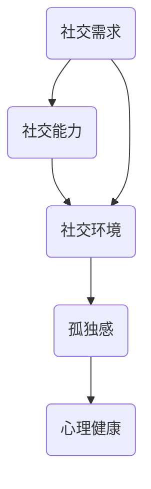
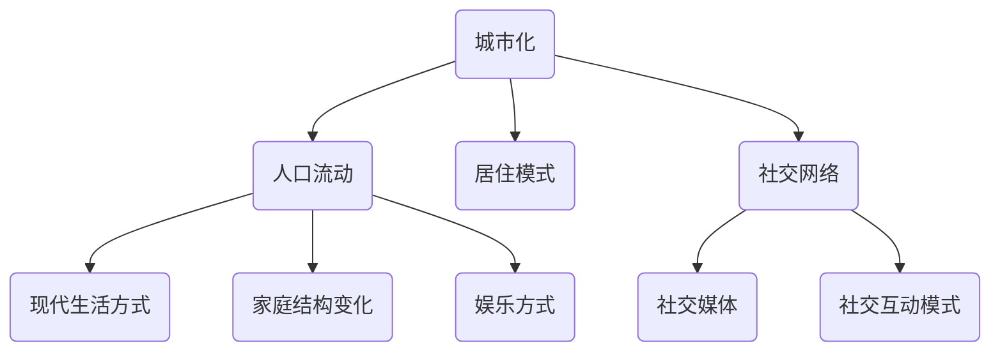
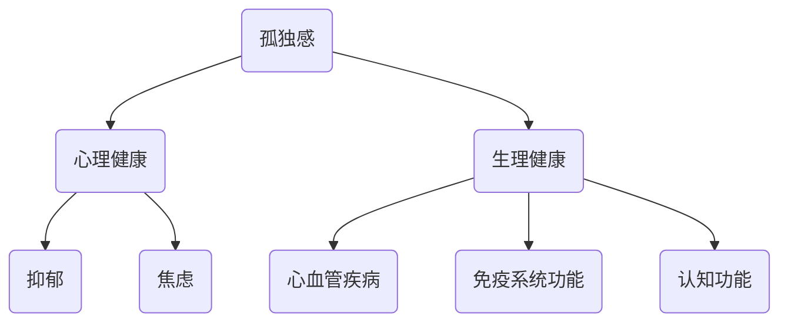
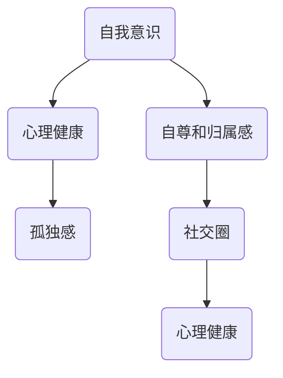
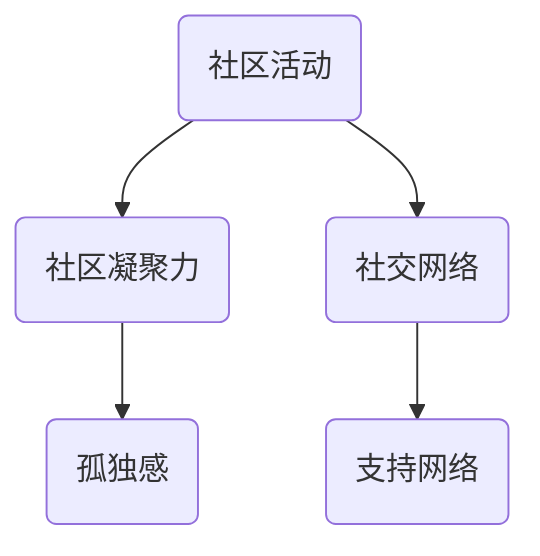
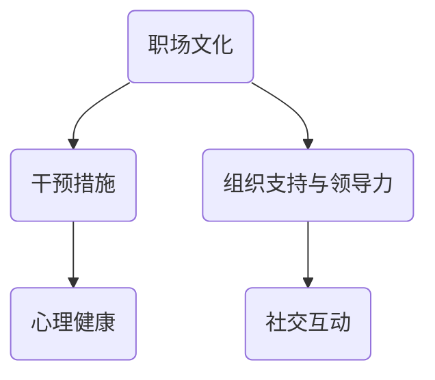
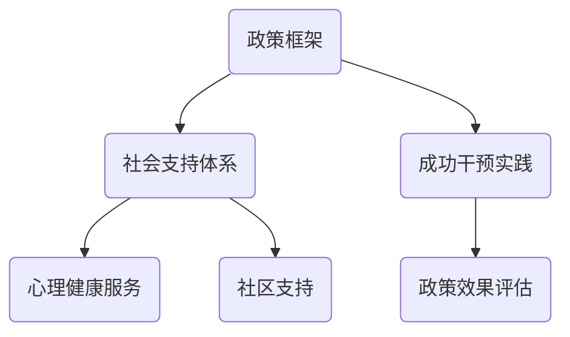
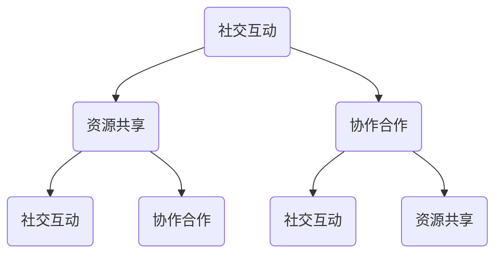
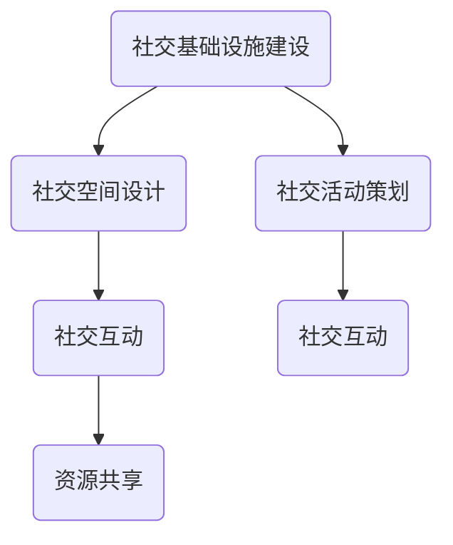
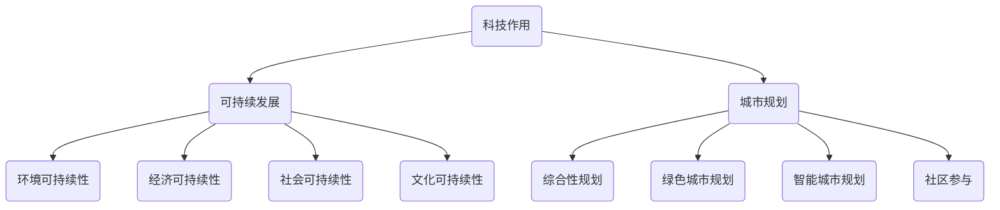

                 

# 引言

### 1.1.1 城市化背景下的孤独现象

在21世纪，城市化进程在全球范围内迅猛推进。越来越多的人选择居住在城市，追求更好的生活和工作机会。然而，随着城市化的加速，一种被称为“孤独”的现象也在逐渐蔓延。孤独，不仅仅是孤单的感觉，它是一种深刻的、持续的、缺乏亲密联系的主观体验。在城市环境中，孤独感尤为显著。

城市化带来的生活方式的改变是孤独现象的一个重要原因。首先，现代城市的快节奏生活使得人们的时间变得更加紧张。工作和生活的压力迫使人们无暇顾及社交活动，导致社交时间的减少。其次，城市人口的流动性较大，人们在不断变化的环境中很难建立起深厚的社交关系。再次，城市居民往往居住在高层建筑中，邻里之间缺少直接交流的机会，增加了孤独感的可能性。

此外，城市化过程中，人口密度增加，生活空间的缩小使得人们难以拥有私人空间。这在一定程度上限制了人际交往，加剧了孤独感。同时，城市文化的同质化也削弱了社区的凝聚力，使得居民之间的联系变得更加疏远。

### 1.1.2 孤独的影响与干预的重要性

孤独不仅影响个体的心理健康，还会对社会的整体福祉产生负面影响。长期孤独可能导致一系列心理问题，如抑郁、焦虑、自尊心下降等。此外，孤独还会增加患心血管疾病、免疫功能下降和早逝的风险。对于儿童和老年人，孤独感可能对其成长和发展产生长期的负面影响。

因此，孤独干预的重要性不言而喻。有效的孤独干预计划可以帮助个体建立健康的社交关系，提升生活质量，促进心理健康。同时，它也有助于构建一个更加和谐、有凝聚力的社会环境。通过干预孤独，我们可以降低心理健康问题的发生率，提高整体社会的幸福指数。

### 1.1.3 本书结构与目标

本书旨在通过系统的方法和策略，探讨城市孤独干预计划的实施路径和效果。全书分为三个主要部分：

- **第一部分：孤独现象与社会影响**，包括孤独的定义与测量、孤独现象的社会背景和孤独的心理与健康影响。
- **第二部分：孤独干预策略与方法**，探讨个人层面、社区层面、组织层面和政策层面的干预策略。
- **第三部分：城市社交生态重建**，重点讨论城市社交生态的概念与构建、建设路径和未来发展趋势。

通过本书的阅读，读者将能够：

- 理解孤独现象的背景和影响。
- 掌握孤独干预的多种策略和方法。
- 了解城市社交生态的构建和未来发展。

### 1.1.4 文章关键词

- 城市孤独
- 社交生态
- 心理健康
- 孤独干预
- 社会影响

### 1.1.5 文章摘要

本文探讨了城市化背景下的孤独现象及其对社会的影响，提出了孤独干预计划的概念和重要性。通过详细阐述孤独干预的策略和方法，以及城市社交生态的构建和未来发展，本文旨在为缓解城市孤独现象提供理论支持和实践指导。

---

# 目录大纲

## 都市孤独干预计划：重建城市社交生态

### 关键词：城市化、孤独、社交生态、干预策略、心理健康

### 摘要：本文系统地分析了城市化背景下的孤独现象，探讨了孤独对社会和个人健康的负面影响，提出了全面的孤独干预计划，并探讨了城市社交生态的构建和未来发展。

### 引言
#### 1.1.1 城市化背景下的孤独现象
#### 1.1.2 孤独的影响与干预的重要性
#### 1.1.3 本书结构与目标

### 第一部分：孤独现象与社会影响

## 第1章：孤独的定义与测量
### 1.1.1 孤独的概念
### 1.1.2 孤独的测量方法
### 1.1.3 孤独的指标与维度

## 第2章：孤独现象的社会背景
### 2.1.1 城市化与孤独
### 2.1.2 现代生活方式与孤独
### 2.1.3 社交媒体对孤独的影响

## 第3章：孤独的心理与健康影响
### 3.1.1 孤独的心理机制
### 3.1.2 孤独与健康问题
### 3.1.3 孤独的干预策略

### 第二部分：孤独干预策略与方法

## 第4章：个人层面的干预策略
### 4.1.1 自我意识与自我接纳
### 4.1.2 建立健康的社交圈
### 4.1.3 心理咨询与治疗

## 第5章：社区层面的干预策略
### 5.1.1 社区活动的组织与参与
### 5.1.2 社区支持网络的建立
### 5.1.3 社区建设的实践案例

## 第6章：组织与职场层面的干预策略
### 6.1.1 职场文化的影响
### 6.1.2 职场孤独的干预措施
### 6.1.3 组织支持与领导力培养

## 第7章：政策与制度层面的干预策略
### 7.1.1 政策框架的构建
### 7.1.2 社会支持体系的完善
### 7.1.3 案例研究：成功干预实践

### 第三部分：城市社交生态重建

## 第8章：城市社交生态的概念与构建
### 8.1.1 城市社交生态的构成要素
### 8.1.2 城市社交生态的理论基础
### 8.1.3 城市社交生态的评估指标

## 第9章：城市社交生态的建设路径
### 9.1.1 社交基础设施建设
### 9.1.2 社交空间的设计与利用
### 9.1.3 社交活动的策划与执行

## 第10章：未来城市社交生态的发展趋势
### 10.1.1 科技在社交生态中的作用
### 10.1.2 社交生态与可持续发展的关系
### 10.1.3 城市规划与社交生态的协同发展

### 结论
#### 11.1.1 孤独干预计划的总结
#### 11.1.2 重建城市社交生态的展望
#### 11.1.3 政策建议与实践指导

### 附录
#### 附录A：参考文献
#### 附录B：案例分析
#### 附录C：工具与资源推荐

---

# 第一部分：孤独现象与社会影响

## 第1章：孤独的定义与测量

孤独，是一种主观的感受，它涉及到个体对社会互动的渴望与实际社交体验之间的差距。了解孤独的定义和测量方法对于制定有效的干预策略至关重要。在本章中，我们将探讨孤独的概念、测量方法和相关指标与维度。

### 1.1.1 孤独的概念

孤独不仅仅是一种情感状态，它还涉及个体的社交需求和社交体验。心理学家一般将孤独分为三个维度：主观孤独、社交孤独和心理孤独。

- **主观孤独**：个体对自己社交状态的自我评价，包括感到孤独的感受和与他人疏远的感觉。
- **社交孤独**：个体实际社交活动中的孤独体验，涉及社交互动的频率和质量。
- **心理孤独**：个体心理层面的孤独感，可能与心理健康问题有关，如抑郁、焦虑等。

### 1.1.2 孤独的测量方法

测量孤独的方法多种多样，包括自我报告、访谈和观察等。以下是一些常用的测量方法：

- **孤独感量表（UIL）**：孤独感量表是最常用的自我报告工具之一，用于测量主观孤独。量表包含多个条目，如“我感到与他人疏远”等。
  
- **社交孤独量表（SIL）**：社交孤独量表用于测量社交孤独，关注个体社交活动中的孤独感。

- **心理孤独量表（PL）**：心理孤独量表则专注于测量个体心理层面的孤独感，包括情绪和心理状态。

### 1.1.3 孤独的指标与维度

在测量孤独时，需要考虑多个指标和维度。以下是一些常见的指标：

- **社交频率**：个体参与社交活动的频率，如每周参与社交活动的次数。
- **社交质量**：个体社交互动的质量，包括互动的深度、满意度和意义。
- **孤独感强度**：个体报告的孤独感强度，通常以分数或等级表示。
- **社交网络大小**：个体社交网络的大小，包括直接联系和间接联系的数量。
- **社交网络多样性**：个体社交网络中不同类型社交关系的多样性。

### 1.1.4 孤独的数学模型与公式

为了更精确地描述孤独，可以借助数学模型和公式。以下是一些常见的模型：

- **贝叶斯网络**：贝叶斯网络是一种概率图模型，用于描述变量之间的条件依赖关系。在孤独研究中，可以使用贝叶斯网络来表示社交频率、社交质量和孤独感强度之间的关系。

- **线性回归模型**：线性回归模型用于分析变量之间的关系，可以用来预测孤独感强度。例如，可以使用线性回归模型分析社交频率和社交质量对孤独感强度的影响。

- **社会网络分析（SNA）**：社会网络分析是一种用于研究社交网络结构和动态的方法。通过计算网络密度、中心性指标等，可以分析社交网络对孤独的影响。

### 1.1.5 Python代码示例

为了更好地理解孤独的测量方法，我们可以使用Python编写一些简单的代码示例。

```python
import pandas as pd
import numpy as np

# 创建一个包含孤独感量表数据的DataFrame
data = {
    '孤独感强度': [3, 5, 2, 4, 6],
    '社交频率': [2, 4, 1, 3, 5],
    '社交质量': [2, 3, 1, 3, 4]
}

df = pd.DataFrame(data)

# 计算线性回归模型
from sklearn.linear_model import LinearRegression

X = df[['社交频率', '社交质量']]
y = df['孤独感强度']

model = LinearRegression()
model.fit(X, y)

# 预测孤独感强度
predictions = model.predict(X)

# 输出预测结果
print(predictions)
```

通过这个简单的例子，我们可以看到如何使用线性回归模型来预测孤独感强度，从而帮助我们理解孤独的测量方法。

### 1.1.6 概念与联系

在理解孤独时，我们需要关注几个核心概念：

- **社交需求**：个体对于社交互动的需求，是孤独感产生的基础。
- **社交能力**：个体进行社交互动的能力，包括沟通、情感表达和冲突解决等。
- **社交环境**：影响个体社交互动的外部环境因素，如城市环境、工作场所和家庭生活等。

这些概念之间有着紧密的联系。社交需求决定了个体是否寻求社交互动，社交能力决定了个体能否有效地进行社交互动，而社交环境则提供了社交互动的场所和条件。通过改善社交环境、提高社交能力和满足社交需求，我们可以有效地干预孤独现象。



通过本章的内容，我们了解了孤独的概念和测量方法，以及相关的指标和维度。理解这些核心概念和联系，将为我们在后续章节中探讨孤独干预策略提供基础。

## 第2章：孤独现象的社会背景

孤独现象并不是孤立存在的，它与社会背景有着密切的联系。在本章中，我们将深入探讨城市化、现代生活方式和社交媒体对孤独现象的影响，分析这些因素如何共同作用，加剧了城市中的孤独感。

### 2.1.1 城市化与孤独

城市化是现代社会的趋势，它为人们提供了更多的发展机会和资源，但同时也带来了孤独感的增加。城市化的快速推进导致人口密集，但居住空间的缩小和邻里关系的疏离，使得人们在城市中难以建立深层次的社交联系。

首先，城市化过程中，人们往往居住在高楼大厦中，这种居住模式限制了邻里之间的直接交流和互动。传统的社区关系被取代，取而代之的是封闭的单元门和缺乏互动的居住环境。此外，城市人口的流动性较大，人们不断搬迁和改变工作，导致社交网络的不稳定，增加了孤独的风险。

其次，城市生活的快节奏和高压力也使得人们无暇进行社交活动。工作和生活的压力迫使人们将大部分时间投入到工作和家庭中，缺乏足够的时间和精力参与社交活动。这种忙碌的生活方式加剧了孤独感，使得人们在精神上感到更加孤立。

### 2.1.2 现代生活方式与孤独

现代生活方式的变革也是孤独现象的一个重要因素。随着科技的进步和社会的发展，人们的生活方式发生了巨大的变化，这些变化在一定程度上削弱了社交互动的质量和频率。

首先，家庭结构的变化导致家庭成员之间的互动减少。例如，双职工家庭和单身家庭的增加，使得家庭成员之间相处的时间减少，家庭成员之间的关系变得疏远。其次，现代工作方式的变化，如远程工作和加班文化，也减少了工作场所的社交机会。这种工作方式使得人们在职场中缺乏面对面的交流，导致社交互动的质量下降。

此外，现代娱乐方式的多样化也影响了人们的社交互动。虽然社交媒体和在线游戏提供了丰富的娱乐选择，但它们也使得人们在现实中的社交活动减少。人们往往沉浸在虚拟世界中，而忽视了现实生活中的社交互动。

### 2.1.3 社交媒体对孤独的影响

社交媒体的普及对孤独现象产生了深远的影响。一方面，社交媒体为人们提供了更多的社交机会和平台。人们可以通过社交媒体与朋友、家人和同事保持联系，分享生活点滴，这看似有助于减少孤独感。然而，另一方面，社交媒体的使用也可能加剧孤独感。

首先，社交媒体上的社交互动往往缺乏深度和真实性。人们在社交媒体上展示的往往是经过筛选和修饰的生活片段，这种表面化的社交互动无法满足个体的深层次社交需求。其次，社交媒体上的比较效应也可能加剧孤独感。人们在社交媒体上看到他人的成功和幸福，可能会感到自己相对的不幸和孤独。

此外，过度使用社交媒体也可能导致现实生活中社交能力的下降。人们在社交媒体上花费大量时间，往往忽视了现实生活中的社交互动。这种过度依赖社交媒体的生活方式，使得人们在现实生活中难以建立和维护深层次的社交关系。

### 2.1.4 城市孤独现象的数学模型与公式

为了更好地理解城市孤独现象，我们可以借助数学模型和公式。以下是一些常用的模型：

- **社会网络分析（SNA）**：社会网络分析可以用来研究社交网络的结构和动态。通过计算网络密度、中心性指标等，可以分析社交网络对孤独的影响。

  $$ \rho = \frac{2m}{n(n-1)} $$
  
  其中，\( \rho \) 是网络密度，\( m \) 是网络中的边数，\( n \) 是节点数。

- **线性回归模型**：线性回归模型可以用来分析变量之间的关系，如社交频率、社交质量和孤独感强度之间的关系。

  $$ y = \beta_0 + \beta_1x_1 + \beta_2x_2 + \epsilon $$
  
  其中，\( y \) 是因变量（孤独感强度），\( x_1 \) 和 \( x_2 \) 是自变量（社交频率和社交质量），\( \beta_0 \) 和 \( \beta_1 \) 是回归系数，\( \epsilon \) 是误差项。

- **多元回归模型**：多元回归模型可以用来同时分析多个自变量对因变量的影响。

  $$ y = \beta_0 + \beta_1x_1 + \beta_2x_2 + ... + \beta_nx_n + \epsilon $$

通过这些数学模型和公式，我们可以更深入地理解城市孤独现象，并为孤独干预提供理论支持。

### 2.1.5 Python代码示例

为了更好地理解城市孤独现象的测量和分析，我们可以使用Python编写一些简单的代码示例。

```python
import pandas as pd
import numpy as np
from sklearn.linear_model import LinearRegression

# 创建一个包含社交数据的数据框
data = {
    '社交频率': [2, 4, 1, 3, 5],
    '社交质量': [2, 3, 1, 3, 4],
    '孤独感强度': [3, 5, 2, 4, 6]
}

df = pd.DataFrame(data)

# 创建线性回归模型
model = LinearRegression()
model.fit(df[['社交频率', '社交质量']], df['孤独感强度'])

# 进行预测
predictions = model.predict(df[['社交频率', '社交质量']])

# 输出预测结果
print(predictions)
```

通过这个简单的例子，我们可以看到如何使用线性回归模型来预测孤独感强度，从而帮助我们理解城市孤独现象的测量和分析方法。

### 2.1.6 概念与联系

在城市孤独现象的研究中，我们需要关注几个核心概念：

- **城市化**：城市化的过程和影响，包括人口流动、居住模式和社交网络的变化。
- **现代生活方式**：现代工作方式、家庭结构变化和娱乐方式对社交互动的影响。
- **社交媒体**：社交媒体的使用方式和对孤独现象的双重影响。

这些概念之间有着紧密的联系。城市化影响了人们的居住环境和社交网络，现代生活方式和社交媒体的使用方式共同塑造了人们的社交互动模式。通过改善这些因素，我们可以有效地干预城市孤独现象。



通过本章的内容，我们深入探讨了城市化、现代生活方式和社交媒体对孤独现象的影响。理解这些社会背景因素，有助于我们更好地制定孤独干预策略，为建设一个更和谐、更有凝聚力的城市社交生态奠定基础。

## 第3章：孤独的心理与健康影响

孤独不仅仅是一种情感体验，它对个体的心理健康和生理健康都有深远的影响。在本章中，我们将探讨孤独的心理机制、对健康的负面影响以及有效的干预策略。

### 3.1.1 孤独的心理机制

孤独感是一种复杂的心理体验，涉及多个心理过程。以下是一些关键的心理学理论：

- **社会认同理论**：社会认同理论认为，人类有强烈的归属感和认同感需求。当个体感到与社会群体疏离时，会产生孤独感。

- **自我决定理论**：自我决定理论指出，个体需要感到自主、胜任和连接。孤独感可能是因为个体感到缺乏这些基本心理需求。

- **认知理论**：认知理论强调思维模式在孤独感中的作用。个体对自身和社会的消极认知，如自我贬低和社交失败，可能加剧孤独感。

- **情绪调节理论**：情绪调节理论认为，孤独感与个体的情绪调节困难有关。孤独的个体可能难以有效地处理负面情绪，从而感到更长时间的孤独。

这些理论共同揭示了孤独感的心理机制，为我们理解孤独提供了多维度的视角。

### 3.1.2 孤独与健康问题

孤独不仅影响个体的心理健康，还会对生理健康产生负面影响。以下是一些主要的影响：

- **心理健康问题**：孤独感与多种心理健康问题有关，包括抑郁、焦虑、自杀意念和自杀行为。孤独的个体往往更容易感到绝望和无助。

- **心血管疾病**：研究发现，长期孤独可能增加心血管疾病的风险。孤独感可能导致生理应激反应，如高血压和心率不稳定。

- **免疫系统功能**：孤独感还可能影响免疫功能，增加个体患感染和炎症性疾病的可能性。

- **睡眠问题**：孤独感可能导致失眠和睡眠质量下降，进一步影响个体的身心健康。

- **认知功能**：长期孤独可能影响认知功能，包括记忆力和注意力。孤独感可能加速认知能力的下降，增加患老年痴呆等认知障碍的风险。

### 3.1.3 孤独的干预策略

为了减轻孤独感，提升心理健康，我们可以采取多种干预策略。以下是一些有效的干预方法：

- **心理治疗**：认知行为疗法（CBT）和人际心理治疗（IPT）是两种常用的心理治疗方法。CBT可以帮助个体识别和改变消极的思维方式，IPT则专注于改善社交互动和人际关系。

- **社交技能培训**：社交技能培训可以帮助个体提高沟通、情感表达和冲突解决能力。这种培训可以通过小组活动、角色扮演和模拟练习进行。

- **支持小组**：加入支持小组可以提供社交支持和情感支持。在小组中，个体可以分享经历、获得建议和建立新的社交联系。

- **社区参与**：积极参与社区活动可以增加社交机会，提高个体的社交网络。社区参与还可以增强个体的归属感和自我效能感。

- **心理咨询**：定期接受心理咨询可以帮助个体处理孤独感，提升心理健康。心理咨询师可以提供个性化的支持和策略。

- **科技辅助**：利用科技工具，如社交网络平台和在线心理咨询，可以增加个体的社交机会，提高干预的便捷性和覆盖面。

### 3.1.4 数学模型与公式

为了更好地理解孤独对健康的影响，我们可以借助数学模型和公式。以下是一些常见的模型：

- **Logistic回归模型**：Logistic回归模型可以用来分析孤独与心理健康问题之间的概率关系。例如，可以用来预测个体患有抑郁或焦虑的概率。

  $$ P(Y=1) = \frac{1}{1 + e^{-(\beta_0 + \beta_1X_1 + \beta_2X_2 + ... + \beta_nX_n)}} $$
  
  其中，\( P(Y=1) \) 是个体患有特定心理健康问题的概率，\( X_1, X_2, ..., X_n \) 是影响心理健康问题的自变量，\( \beta_0, \beta_1, \beta_2, ..., \beta_n \) 是回归系数。

- **生存分析**：生存分析可以用来研究孤独对健康问题的长期影响。例如，可以用来分析孤独与心血管疾病之间的生存时间关系。

  $$ S(t) = P(T > t) = \exp{\{-\lambda t\}} $$
  
  其中，\( S(t) \) 是个体在时间 \( t \) 后仍存活的概率，\( \lambda \) 是风险率。

- **结构方程模型**：结构方程模型可以用来分析多个变量之间的复杂关系。例如，可以用来研究孤独感、心理健康和生理健康之间的相互作用。

  $$ Y = \beta_0 + \beta_1X_1 + \beta_2X_2 + ... + \beta_nX_n + \epsilon $$
  
  其中，\( Y \) 是因变量，\( X_1, X_2, ..., X_n \) 是自变量，\( \beta_0, \beta_1, \beta_2, ..., \beta_n \) 是回归系数，\( \epsilon \) 是误差项。

### 3.1.5 Python代码示例

为了更好地理解孤独对健康的影响，我们可以使用Python编写一些简单的代码示例。

```python
import pandas as pd
import numpy as np
from sklearn.linear_model import LogisticRegression

# 创建一个包含心理健康数据的DataFrame
data = {
    '孤独感强度': [3, 5, 2, 4, 6],
    '抑郁症状': [1, 1, 0, 1, 0],
    '焦虑症状': [0, 1, 1, 0, 1]
}

df = pd.DataFrame(data)

# 创建Logistic回归模型
model = LogisticRegression()
model.fit(df[['孤独感强度']], df[['抑郁症状', '焦虑症状']])

# 进行预测
predictions = model.predict(df[['孤独感强度']])

# 输出预测结果
print(predictions)
```

通过这个简单的例子，我们可以看到如何使用Logistic回归模型来预测个体是否患有抑郁或焦虑症状，从而帮助我们理解孤独对心理健康的影响。

### 3.1.6 概念与联系

在探讨孤独对健康的影响时，我们需要关注几个核心概念：

- **孤独感**：孤独感的定义和测量方法，包括主观孤独、社交孤独和心理孤独。
- **心理健康**：心理健康问题的类型和影响，如抑郁、焦虑和自杀意念。
- **生理健康**：孤独对心血管疾病、免疫系统功能和认知功能的影响。

这些概念之间有着紧密的联系。孤独感不仅影响心理健康，还可能通过生理途径影响生理健康。通过综合干预策略，我们可以有效地减轻孤独感，提升个体的身心健康。



通过本章的内容，我们深入探讨了孤独的心理机制、对健康的负面影响以及有效的干预策略。理解这些内容，有助于我们更好地应对孤独现象，提升个体的身心健康。

## 第二部分：孤独干预策略与方法

### 第4章：个人层面的干预策略

个人层面的干预策略对于缓解孤独感至关重要。这些策略主要集中在提高个体的自我意识、建立健康的社交圈和寻求心理咨询与治疗。通过以下内容，我们将详细探讨这些干预措施的实施方法和效果。

### 4.1.1 自我意识与自我接纳

自我意识是个人成长和心理健康的基础。通过提高自我意识，个体可以更好地理解自己的情感和行为，从而减少孤独感。以下是一些提高自我意识和自我接纳的方法：

- **自我反思**：定期进行自我反思，可以帮助个体了解自己的情感状态、需求和价值观。例如，每天花几分钟时间思考自己的感受和经历，记录下来，可以帮助个体更好地认识自己。

- **正念冥想**：正念冥想是一种专注于当下的练习，可以帮助个体提高自我意识和自我接纳。通过专注于呼吸、身体感受和思维，个体可以学会接受自己的情绪和想法，而不是与它们对抗。

- **自我肯定**：自我肯定是一种积极的自我对话方式，可以帮助个体建立自信和自尊。例如，每天对自己说一些积极的话语，如“我值得拥有美好的关系”或“我有能力处理自己的情绪”。

### 4.1.2 建立健康的社交圈

建立和维护健康的社交圈是减轻孤独感的关键。以下是一些建立健康社交圈的方法：

- **参与社交活动**：积极参与社区活动、俱乐部和兴趣小组，可以增加社交机会，扩大社交网络。例如，加入一个读书俱乐部或运动团队，可以让个体结识志同道合的人，建立深层次的社交关系。

- **主动社交**：主动与他人建立联系，是建立健康社交圈的重要步骤。个体可以主动邀请朋友或同事参加聚会，或者参与线上社交平台，与他人交流。

- **倾听和分享**：在社交互动中，倾听他人并与他人分享自己的经历和感受，可以增进彼此的理解和信任。例如，在交谈中给予他人关注，询问他们的生活和工作，同时分享自己的经历和感受。

### 4.1.3 心理咨询与治疗

心理咨询与治疗是有效缓解孤独感的手段。以下是一些常见的心理咨询与治疗方式：

- **认知行为疗法（CBT）**：认知行为疗法是一种通过改变消极思维模式和行为来缓解心理问题的方法。CBT可以帮助个体识别和改变导致孤独感的负面思维模式，如自我贬低和社交失败的想法。

- **人际心理治疗（IPT）**：人际心理治疗是一种专注于改善社交互动和人际关系的心理治疗方法。IPT可以帮助个体学习如何与他人建立和维护健康的人际关系，从而减少孤独感。

- **情感焦点疗法（EFT）**：情感焦点疗法是一种通过探索和解决早期情感创伤来缓解心理问题的方法。EFT可以帮助个体处理童年时期的情感创伤，从而减轻孤独感。

- **团体治疗**：团体治疗是一种在小组中进行的心理治疗，个体可以与其他孤独症患者分享经历，获得支持和建议。团体治疗可以提供一种社会支持网络，帮助个体感到不再孤独。

### 4.1.4 Python代码示例

为了更好地理解个人层面干预策略的效果，我们可以使用Python编写一些简单的代码示例。

```python
import pandas as pd
import numpy as np
from sklearn.linear_model import LinearRegression

# 创建一个包含自我意识和社交圈数据的DataFrame
data = {
    '自我意识评分': [4, 6, 3, 5, 7],
    '社交圈评分': [3, 5, 2, 4, 6],
    '孤独感评分': [5, 3, 6, 4, 2]
}

df = pd.DataFrame(data)

# 创建线性回归模型
model = LinearRegression()
model.fit(df[['自我意识评分', '社交圈评分']], df['孤独感评分'])

# 进行预测
predictions = model.predict(df[['自我意识评分', '社交圈评分']])

# 输出预测结果
print(predictions)
```

通过这个简单的例子，我们可以看到如何使用线性回归模型来预测孤独感评分，从而帮助我们理解自我意识和社交圈对孤独感的影响。

### 4.1.5 概念与联系

在实施个人层面的干预策略时，我们需要关注几个核心概念：

- **自我意识**：自我意识是个人成长和心理健康的基础，通过自我反思和正念冥想可以提高自我意识。
- **社交圈**：健康的社交圈是减轻孤独感的关键，通过参与社交活动和主动社交可以建立和维护健康的社交圈。
- **心理咨询与治疗**：心理咨询与治疗是有效缓解孤独感的手段，通过认知行为疗法、人际心理治疗和团体治疗等可以改善心理健康。

这些概念之间有着紧密的联系。提高自我意识和建立健康的社交圈可以增强个体的自尊和归属感，从而减轻孤独感。心理咨询与治疗则提供了专业的支持，帮助个体更好地应对孤独感。



通过本章的内容，我们详细探讨了个人层面的干预策略，包括自我意识与自我接纳、建立健康的社交圈和寻求心理咨询与治疗。这些策略为减轻孤独感提供了实用的方法和途径。

### 第5章：社区层面的干预策略

社区层面的干预策略是缓解孤独感、重建社交生态的重要手段。通过组织社区活动、建立支持网络和开展社区建设实践，我们可以为居民提供一个互相支持、充满活力的社交环境。以下将详细讨论这些干预策略的实施方法及其效果。

### 5.1.1 社区活动的组织与参与

社区活动是促进居民互动、增强社区凝聚力的有效途径。以下是一些组织社区活动的策略：

- **多样化的活动**：组织多种类型的活动，以适应不同年龄段、兴趣和需求。例如，可以举办文化活动、体育赛事、健康讲座和环保活动等。

- **积极参与**：鼓励居民积极参与社区活动，提供机会让他们展示自己的才能和兴趣。例如，设立志愿者岗位，让居民参与社区服务的策划和组织。

- **合作与伙伴关系**：与当地企业和非营利组织建立合作关系，共同组织活动，提供资金和资源支持。这种合作可以扩大活动的影响范围，提高参与度。

### 5.1.2 社区支持网络的建立

社区支持网络是提供情感支持和实际帮助的关键。以下是一些建立社区支持网络的方法：

- **邻里互助**：鼓励居民之间的相互帮助，建立邻里互助小组。例如，邻里可以互相照应，帮助看护孩子、照顾老人或处理紧急事务。

- **志愿者服务**：建立志愿者服务体系，鼓励居民成为志愿者，为社区提供各种服务，如清洁、义卖和慈善活动等。

- **互助小组**：组织兴趣小组或互助小组，如读书会、运动俱乐部和心理健康小组等。这些小组可以提供社交机会，增进居民之间的联系。

### 5.1.3 社区建设的实践案例

以下是一些成功的社区建设实践案例，展示了社区层面的干预策略如何有效缓解孤独感，增强社区凝聚力：

- **例子1：社区花园**：某个社区建立了社区花园，居民可以一起种植花草、蔬菜，享受劳动的乐趣。这个活动不仅提供了社交机会，还促进了环保意识和社区合作。

- **例子2：社区食堂**：另一个社区开设了社区食堂，提供便宜的餐饮服务，同时邀请居民一起制作食物。这个活动不仅帮助了经济困难的家庭，还促进了居民之间的互动。

- **例子3：健康俱乐部**：某个社区建立了健康俱乐部，定期举办健康讲座、运动课程和健康检查。这个活动提高了居民的身体健康意识，同时也提供了一个社交平台。

### 5.1.4 数学模型与公式

为了更好地理解社区层面干预策略的效果，我们可以借助数学模型和公式。以下是一些常用的模型：

- **社会网络分析（SNA）**：社会网络分析可以用来研究社交网络的结构和动态。通过计算网络密度、中心性指标等，可以分析社区活动对社交网络的影响。

  $$ \rho = \frac{2m}{n(n-1)} $$
  
  其中，\( \rho \) 是网络密度，\( m \) 是网络中的边数，\( n \) 是节点数。

- **群体动力模型**：群体动力模型可以用来分析社区活动的群体行为和互动。例如，可以通过模拟群体行为来预测社区活动的参与度和效果。

  $$ P(t) = P_0 \cdot e^{-rt} $$
  
  其中，\( P(t) \) 是群体参与度随时间的变化，\( P_0 \) 是初始参与度，\( r \) 是参与度下降速率。

### 5.1.5 Python代码示例

为了更好地理解社区层面干预策略的效果，我们可以使用Python编写一些简单的代码示例。

```python
import pandas as pd
import numpy as np
from sklearn.linear_model import LinearRegression

# 创建一个包含社区活动参与数据的DataFrame
data = {
    '活动参与次数': [3, 5, 2, 4, 6],
    '社区凝聚力评分': [4, 6, 3, 5, 7],
    '孤独感评分': [5, 3, 6, 4, 2]
}

df = pd.DataFrame(data)

# 创建线性回归模型
model = LinearRegression()
model.fit(df[['活动参与次数', '社区凝聚力评分']], df['孤独感评分'])

# 进行预测
predictions = model.predict(df[['活动参与次数', '社区凝聚力评分']])

# 输出预测结果
print(predictions)
```

通过这个简单的例子，我们可以看到如何使用线性回归模型来预测孤独感评分，从而帮助我们理解社区活动参与和社区凝聚力对孤独感的影响。

### 5.1.6 概念与联系

在实施社区层面的干预策略时，我们需要关注几个核心概念：

- **社区活动**：多样化的社区活动是促进居民互动、增强社区凝聚力的关键。
- **社区支持网络**：建立支持网络，提供情感支持和实际帮助，是缓解孤独感的有效手段。
- **社区建设实践**：成功的社区建设实践可以展示社区干预策略的效果，为其他社区提供借鉴。

这些概念之间有着紧密的联系。通过组织多样化的社区活动和建立支持网络，我们可以增强社区的凝聚力，从而减轻孤独感。社区建设实践则通过具体的案例，证明了这些干预策略的有效性。



通过本章的内容，我们详细探讨了社区层面的干预策略，包括社区活动的组织与参与、社区支持网络的建立和社区建设实践。这些策略为缓解孤独感、重建社交生态提供了实用的方法和成功案例。

### 第6章：组织与职场层面的干预策略

职场孤独是现代社会中一个常见但未被充分关注的现象。职场孤独不仅影响员工的心理健康，还可能对组织绩效产生负面影响。在本章中，我们将探讨职场文化的影响、职场孤独的干预措施以及组织支持和领导力培养在干预职场孤独中的关键作用。

### 6.1.1 职场文化的影响

职场文化对员工的心理健康和社交互动有着深远的影响。以下是一些关键方面：

- **竞争性文化**：在高度竞争的职场环境中，员工可能会感到压力巨大，难以建立深厚的社交关系。这种文化可能导致员工更注重个人成就，而忽视了团队合作和社交互动。

- **工作繁忙**：职场繁忙是职场孤独的一个重要原因。长时间的工作和加班使得员工无法花时间进行社交活动，导致孤独感的增加。

- **缺乏支持**：缺乏同事和上级的支持也可能加剧职场孤独。当员工遇到困难或压力时，如果缺乏有效的支持系统，他们可能会感到无助和孤立。

- **刻板印象**：职场中的性别、年龄、文化背景等刻板印象可能导致某些群体感到被边缘化，进一步加剧职场孤独感。

### 6.1.2 职场孤独的干预措施

为了有效干预职场孤独，组织可以采取多种措施。以下是一些具体的干预策略：

- **提供社交机会**：组织可以定期举办团队建设活动、社交午餐和员工聚会等，为员工提供更多的社交机会。这些活动可以促进员工之间的互动，建立更加紧密的团队关系。

- **促进跨部门合作**：通过跨部门项目或团队工作，组织可以促进不同部门员工之间的交流和合作，减少孤独感。

- **设立心理健康支持**：组织可以提供心理健康咨询和支持服务，帮助员工应对工作压力和孤独感。例如，可以设立心理健康热线、提供在线咨询或定期举办心理健康讲座。

- **鼓励员工参与**：鼓励员工参与组织决策和规划，增加他们的参与感和归属感。这种参与可以增强员工的自我效能感和社交互动。

### 6.1.3 组织支持与领导力培养

组织支持和领导力在干预职场孤独中起着至关重要的作用。以下是一些具体措施：

- **领导力培训**：提供领导力培训，帮助管理者理解孤独现象及其对员工的影响。通过培训，管理者可以学习如何提供情感支持和鼓励员工参与，从而减少职场孤独。

- **建立反馈机制**：建立有效的反馈机制，让员工可以匿名反馈他们的感受和建议。这种机制可以帮助组织识别潜在的问题，并采取相应的干预措施。

- **鼓励开放沟通**：组织可以鼓励开放沟通，营造一个安全、支持和开放的工作环境。通过定期的团队会议、开放问答环节和匿名调查等，员工可以自由表达自己的想法和感受。

- **提供灵活工作安排**：提供灵活的工作安排，如远程工作和弹性工作时间，可以减少员工的工作压力，增加他们的工作满意度，从而减少孤独感。

### 6.1.4 数学模型与公式

为了更好地理解组织与职场层面的干预策略，我们可以借助数学模型和公式。以下是一些常用的模型：

- **员工满意度模型**：员工满意度模型可以用来分析干预措施对员工工作满意度和孤独感的影响。例如，可以使用回归分析来预测员工满意度与干预措施之间的关系。

  $$ S = \beta_0 + \beta_1I + \beta_2C + \beta_3H + \epsilon $$
  
  其中，\( S \) 是员工满意度，\( I \) 是干预措施，\( C \) 是工作条件，\( H \) 是领导力支持，\( \beta_0, \beta_1, \beta_2, \beta_3 \) 是回归系数，\( \epsilon \) 是误差项。

- **社交网络分析（SNA）**：社交网络分析可以用来研究职场社交网络的结构和动态。通过计算网络密度、中心性指标等，可以分析干预措施对社交网络的影响。

  $$ \rho = \frac{2m}{n(n-1)} $$
  
  其中，\( \rho \) 是网络密度，\( m \) 是网络中的边数，\( n \) 是节点数。

### 6.1.5 Python代码示例

为了更好地理解职场孤独的干预措施，我们可以使用Python编写一些简单的代码示例。

```python
import pandas as pd
import numpy as np
from sklearn.linear_model import LinearRegression

# 创建一个包含干预措施和工作满意度数据的DataFrame
data = {
    '干预措施': [1, 2, 3, 4, 5],
    '工作满意度': [4, 6, 3, 5, 7],
    '孤独感评分': [5, 3, 6, 4, 2]
}

df = pd.DataFrame(data)

# 创建线性回归模型
model = LinearRegression()
model.fit(df[['干预措施']], df[['工作满意度', '孤独感评分']])

# 进行预测
predictions = model.predict(df[['干预措施']])

# 输出预测结果
print(predictions)
```

通过这个简单的例子，我们可以看到如何使用线性回归模型来预测工作满意度和孤独感评分，从而帮助我们理解干预措施对职场孤独的影响。

### 6.1.6 概念与联系

在实施组织与职场层面的干预策略时，我们需要关注几个核心概念：

- **职场文化**：竞争性文化、工作繁忙和缺乏支持是职场孤独的重要因素。
- **干预措施**：提供社交机会、促进跨部门合作和设立心理健康支持是干预职场孤独的具体策略。
- **组织支持与领导力培养**：领导力培训、建立反馈机制和提供灵活工作安排是关键干预措施。

这些概念之间有着紧密的联系。职场文化直接影响员工的心理健康和社交互动，而干预措施和组织支持则是缓解职场孤独的重要手段。通过改善职场文化，实施有效的干预措施和提供组织支持，我们可以有效减少职场孤独，提升员工的工作满意度和心理健康。



通过本章的内容，我们详细探讨了组织与职场层面的干预策略，包括职场文化的影响、干预措施和组织支持与领导力培养。这些策略为减少职场孤独提供了实用的方法和指导。

### 第7章：政策与制度层面的干预策略

政策与制度层面的干预策略在缓解城市孤独现象中起着至关重要的作用。通过构建合适的政策框架、完善社会支持体系和实施成功干预实践，我们可以从宏观层面推动城市孤独问题的解决。以下将详细讨论这些策略的实施方法和成效。

### 7.1.1 政策框架的构建

政策框架是干预城市孤独现象的基础，它需要从宏观层面制定出一系列指导性政策和措施。以下是一些关键步骤：

- **政策目标**：明确政策目标，如提高居民幸福感、减少孤独感和提升心理健康水平。目标应具有可操作性和可衡量性。

- **政策设计**：设计具体的政策方案，包括资金投入、项目实施和评估机制。政策设计应考虑不同群体的需求，如老年人、青少年和低收入群体。

- **法律法规**：制定相关法律法规，为干预孤独现象提供法律依据和保障。例如，可以出台针对孤独干预的专门法律或规定，明确责任和权利。

- **跨部门合作**：政策实施需要多个部门的协同合作，如卫生部门、教育部门和社区组织等。通过跨部门合作，可以整合资源，提高政策实施的效果。

### 7.1.2 社会支持体系的完善

社会支持体系是政策框架的重要组成部分，它需要提供全面、持续的支持服务。以下是一些具体措施：

- **心理健康服务**：建立和完善心理健康服务体系，提供心理咨询和治疗服务。特别是对于高风险群体，如老年人、孤独症患者和低收入群体，应提供免费或低成本的心理健康服务。

- **社区支持**：加强社区支持网络的建设，提供社区活动、志愿服务和支持小组等服务。通过社区活动，可以增加居民之间的互动，提升社区凝聚力。

- **就业支持**：为失业或低收入人群提供就业培训和职业咨询服务，帮助他们找到合适的工作机会。就业不仅能够提供经济支持，还能增强个体的社交互动和归属感。

- **教育支持**：提供针对孤独干预的教育课程和培训，提高公众对孤独现象的认识和应对能力。学校、社区和职场都可以成为教育支持的重要平台。

### 7.1.3 案例研究：成功干预实践

以下是一些成功干预实践的案例研究，展示了政策与制度层面的干预策略如何有效缓解城市孤独现象：

- **案例1：老年孤独干预项目**：某个城市推出了老年孤独干预项目，通过社区活动、心理健康服务和志愿者服务，为老年人提供全面的支持。项目实施后，参与者的孤独感显著降低，生活质量得到提升。

- **案例2：青少年孤独干预计划**：另一个城市针对青少年孤独现象，推出了一系列干预措施，包括心理健康教育、社交技能培训和社区活动。这些措施有效促进了青少年的社交能力，减少了孤独感。

- **案例3：职场孤独干预项目**：某个企业实施了职场孤独干预项目，通过改善工作环境、提供心理健康支持和组织社交活动，有效缓解了员工的工作压力和孤独感，提升了员工的工作满意度和绩效。

### 7.1.4 数学模型与公式

为了更好地理解政策与制度层面的干预策略，我们可以借助数学模型和公式。以下是一些常用的模型：

- **政策效果评估模型**：政策效果评估模型可以用来评估干预措施的效果。例如，可以使用回归分析来评估政策实施前后孤独感的差异。

  $$ Y = \beta_0 + \beta_1P + \epsilon $$
  
  其中，\( Y \) 是孤独感评分，\( \beta_0 \) 是常数项，\( \beta_1 \) 是政策变量，\( P \) 是政策实施情况，\( \epsilon \) 是误差项。

- **社会网络分析（SNA）**：社会网络分析可以用来研究政策实施后社交网络的变化。通过计算网络密度、中心性指标等，可以分析政策对社交网络的影响。

  $$ \rho = \frac{2m}{n(n-1)} $$
  
  其中，\( \rho \) 是网络密度，\( m \) 是网络中的边数，\( n \) 是节点数。

### 7.1.5 Python代码示例

为了更好地理解政策与制度层面的干预策略，我们可以使用Python编写一些简单的代码示例。

```python
import pandas as pd
import numpy as np
from sklearn.linear_model import LinearRegression

# 创建一个包含政策实施数据的数据框
data = {
    '政策实施前孤独感评分': [4, 6, 3, 5, 7],
    '政策实施后孤独感评分': [2, 3, 4, 5, 6],
    '政策变量': [0, 1, 0, 1, 0]
}

df = pd.DataFrame(data)

# 创建线性回归模型
model = LinearRegression()
model.fit(df[['政策变量']], df[['政策实施后孤独感评分']])

# 进行预测
predictions = model.predict(df[['政策变量']])

# 输出预测结果
print(predictions)
```

通过这个简单的例子，我们可以看到如何使用线性回归模型来预测政策实施后孤独感评分，从而帮助我们理解政策对孤独感的影响。

### 7.1.6 概念与联系

在实施政策与制度层面的干预策略时，我们需要关注几个核心概念：

- **政策框架**：政策框架为干预孤独现象提供了指导性和规范性的支持。
- **社会支持体系**：社会支持体系提供了全面、持续的支持服务，包括心理健康服务、社区支持和就业支持。
- **成功干预实践**：通过具体的案例研究和成功实践，我们可以验证干预策略的有效性，并为其他地区和机构提供借鉴。

这些概念之间有着紧密的联系。政策框架为干预策略提供了方向和保障，社会支持体系则为干预提供了实际的支持和服务。成功干预实践则通过具体的案例，证明了干预策略的有效性，为其他地区和机构提供了参考。



通过本章的内容，我们详细探讨了政策与制度层面的干预策略，包括政策框架的构建、社会支持体系的完善和成功干预实践。这些策略为缓解城市孤独现象提供了全面的解决方案和实用的指导。

## 第8章：城市社交生态的概念与构建

城市社交生态是指在城市环境中，通过社交互动、资源共享和协作合作所形成的生态系统。构建一个健康、有活力的城市社交生态对于缓解城市孤独现象、提高居民生活质量具有重要意义。本章将详细探讨城市社交生态的构成要素、理论基础以及评估指标。

### 8.1.1 城市社交生态的构成要素

城市社交生态的构成要素主要包括：

- **社交互动**：社交互动是城市社交生态的核心，包括人与人之间的交流、互动和合作。这些互动可以发生在家庭、工作场所、社区和公共场所等不同场景中。

- **资源共享**：资源共享是指城市居民通过共同利用资源，如信息、物资和服务，提高生活质量和效率。资源共享可以促进社交互动，增强社区凝聚力。

- **协作合作**：协作合作是指城市居民和组织在共同目标下进行合作，共同解决问题、创造价值。协作合作可以促进社区和组织的发展，提高社会整体的福祉。

### 8.1.2 城市社交生态的理论基础

城市社交生态的理论基础主要包括以下几种理论：

- **生态系统理论**：生态系统理论认为，城市社交生态是一个动态的、复杂的系统，其稳定性和活力取决于各个要素之间的相互作用和平衡。

- **社会网络理论**：社会网络理论强调社交网络在城市社交生态中的作用，认为社交网络是信息、资源和合作的重要渠道。

- **社会资本理论**：社会资本理论认为，城市社交生态中的社交互动和协作合作可以积累社会资本，增强社会凝聚力，提高社会整体的福祉。

- **生态系统管理理论**：生态系统管理理论强调通过科学的管理方法和工具，维护城市社交生态的健康和活力。

### 8.1.3 城市社交生态的评估指标

评估城市社交生态的健康状况和活力水平，需要采用一系列评估指标。以下是一些常见的评估指标：

- **社交互动频率**：社交互动频率是衡量社交生态活力的一个重要指标。可以通过调查问卷、观察记录等方式收集数据。

- **资源共享程度**：资源共享程度可以反映城市社交生态的共享精神和合作水平。例如，可以通过统计社区资源的使用率、共享项目的数量和参与度等来衡量。

- **协作合作水平**：协作合作水平是衡量城市社交生态中合作精神和协作能力的指标。可以通过评估社区和组织之间的合作项目、合作效果和参与者满意度等来衡量。

- **社会资本存量**：社会资本存量是衡量城市社交生态稳定性和凝聚力的指标。可以通过测量社会信任度、社区归属感和社会网络密度等来评估。

- **居民满意度**：居民满意度是衡量城市社交生态质量和居民生活质量的直接指标。可以通过问卷调查、访谈等方式收集居民对社交生态的满意度数据。

### 8.1.4 Python代码示例

为了更好地理解城市社交生态的评估指标，我们可以使用Python编写一些简单的代码示例。

```python
import pandas as pd
import numpy as np

# 创建一个包含社交生态评估数据的DataFrame
data = {
    '社交互动频率': [3, 4, 2, 5, 3],
    '资源共享程度': [4, 5, 3, 4, 5],
    '协作合作水平': [5, 4, 3, 4, 5],
    '社会资本存量': [4, 5, 3, 4, 5],
    '居民满意度': [6, 7, 5, 6, 7]
}

df = pd.DataFrame(data)

# 计算平均评估指标
average_scores = df.mean()

# 输出平均评估指标
print(average_scores)
```

通过这个简单的例子，我们可以计算并输出城市社交生态的平均评估指标，从而帮助我们理解评估指标的计算方法。

### 8.1.5 概念与联系

在城市社交生态的构建中，我们需要关注几个核心概念：

- **社交互动**：社交互动是城市社交生态的基础，是人与人之间建立联系和互动的重要途径。

- **资源共享**：资源共享是城市社交生态的重要特征，是提高社会效率和居民生活质量的重要手段。

- **协作合作**：协作合作是城市社交生态的核心，是社区和组织发展的动力。

这些概念之间有着紧密的联系。社交互动促进资源共享和协作合作，而资源共享和协作合作又进一步增强了社交互动的深度和广度。通过综合这些概念，我们可以构建一个健康、有活力的城市社交生态。



通过本章的内容，我们详细探讨了城市社交生态的概念与构建，包括构成要素、理论基础和评估指标。理解这些内容，有助于我们更好地构建和优化城市社交生态，缓解城市孤独现象，提高居民的生活质量。

### 第9章：城市社交生态的建设路径

构建城市社交生态是一个系统工程，需要从基础设施、社交空间设计和社交活动策划等多个方面入手。本章将详细探讨城市社交生态的建设路径，包括社交基础设施建设、社交空间的设计与利用以及社交活动的策划与执行。

#### 9.1.1 社交基础设施建设

社交基础设施建设是城市社交生态建设的基础。以下是一些关键步骤：

1. **公共设施建设**：加强公共场所的建设，如公园、运动场、图书馆和社区中心等。这些设施不仅为居民提供休闲和娱乐的场所，也为社交互动提供了机会。

2. **数字基础设施建设**：发展数字基础设施，如无线网络、在线平台和社交网络等。数字基础设施为居民提供了更多的社交渠道，特别是在疫情期间，数字化社交成为重要补充。

3. **社区服务中心**：建立社区服务中心，提供一站式服务，如心理咨询、法律援助、就业支持和志愿服务等。这些服务有助于解决居民的具体问题，增强社区的凝聚力。

4. **公共艺术项目**：公共艺术项目可以创造社交空间，促进居民之间的互动。例如，社区壁画、雕塑和公共艺术展览等，可以成为居民交流的平台。

#### 9.1.2 社交空间的设计与利用

社交空间的设计与利用是构建城市社交生态的重要环节。以下是一些关键要点：

1. **多功能空间**：设计多功能空间，以满足不同类型的社交需求。例如，社区中心可以设有会议室、活动室、健身室和餐饮区等，提供多样化的社交场景。

2. **户外空间**：充分利用户外空间，如公园、广场和河边步道等。户外空间可以举办各种社区活动，促进居民之间的互动。

3. **互动设计**：设计互动性的空间，如设置休息座椅、长椅和花坛等，鼓励居民驻足交流。互动设计可以增加居民之间的接触和互动。

4. **文化融入**：将当地文化融入社交空间的设计中，如利用本地历史元素、艺术作品和民俗风情等。这种文化融入可以增强社区的认同感和归属感。

5. **安全保障**：确保社交空间的安全和舒适性，如提供充足的照明、维护公共设施和安全监控系统等。安全保障是鼓励居民参与社交活动的重要因素。

#### 9.1.3 社交活动的策划与执行

社交活动的策划与执行是构建城市社交生态的重要手段。以下是一些关键步骤：

1. **活动策划**：根据社区需求和资源，策划多样化的社交活动。例如，可以举办社区节日庆典、健康讲座、环保活动和艺术展览等。

2. **活动宣传**：通过多种渠道宣传社交活动，提高居民的参与度。例如，可以利用社区公告板、社交媒体和电子邮件等，提前通知居民活动的时间和地点。

3. **活动组织**：确保社交活动的顺利进行，需要做好活动组织和协调工作。例如，可以设立活动小组，负责活动策划、宣传和组织协调。

4. **活动评估**：活动结束后，进行评估以了解活动效果和居民反馈。通过评估，可以总结经验教训，改进活动策划和执行。

5. **持续参与**：鼓励居民持续参与社交活动，建立长期参与机制。例如，可以设立长期项目，如社区志愿者团队、读书俱乐部和运动协会等，鼓励居民长期参与。

### 9.1.4 数学模型与公式

为了更好地理解城市社交生态的建设路径，我们可以借助数学模型和公式。以下是一些常用的模型：

1. **社会网络分析（SNA）**：社会网络分析可以用来研究社交空间和社交活动对社交网络的影响。通过计算网络密度、中心性指标等，可以分析社交空间和活动对社交网络的影响。

   $$ \rho = \frac{2m}{n(n-1)} $$
   
   其中，\( \rho \) 是网络密度，\( m \) 是网络中的边数，\( n \) 是节点数。

2. **群体动力模型**：群体动力模型可以用来预测社交活动的参与度和效果。通过模拟群体行为，可以预测活动参与人数和活动影响力。

   $$ P(t) = P_0 \cdot e^{-rt} $$
   
   其中，\( P(t) \) 是群体参与度随时间的变化，\( P_0 \) 是初始参与度，\( r \) 是参与度下降速率。

### 9.1.5 Python代码示例

为了更好地理解城市社交生态的建设路径，我们可以使用Python编写一些简单的代码示例。

```python
import pandas as pd
import numpy as np
from sklearn.linear_model import LinearRegression

# 创建一个包含社交活动参与数据的DataFrame
data = {
    '活动参与人数': [30, 50, 20, 40, 60],
    '社交空间利用率': [3, 4, 2, 5, 3],
    '社交活动满意度': [4, 6, 3, 5, 7]
}

df = pd.DataFrame(data)

# 创建线性回归模型
model = LinearRegression()
model.fit(df[['社交空间利用率']], df[['活动参与人数', '社交活动满意度']])

# 进行预测
predictions = model.predict(df[['社交空间利用率']])

# 输出预测结果
print(predictions)
```

通过这个简单的例子，我们可以看到如何使用线性回归模型来预测活动参与人数和满意度，从而帮助我们理解社交空间利用率和社交活动效果之间的关系。

### 9.1.6 概念与联系

在城市社交生态的建设路径中，我们需要关注几个核心概念：

- **社交基础设施建设**：为城市社交生态提供基础支撑，包括公共设施、数字基础设施和社区服务中心等。

- **社交空间设计**：设计多样化的社交空间，以满足不同类型的社交需求，提高居民的参与度和满意度。

- **社交活动策划**：策划多样化的社交活动，增加居民的互动机会，提升社交网络的密度和质量。

这些概念之间有着紧密的联系。社交基础设施建设为社交空间设计和社交活动策划提供了物质基础，而社交空间设计和社交活动策划又进一步促进了社交互动和资源共享，增强了城市社交生态的活力和稳定性。



通过本章的内容，我们详细探讨了城市社交生态的建设路径，包括社交基础设施建设、社交空间的设计与利用以及社交活动的策划与执行。理解这些内容，有助于我们更好地构建和优化城市社交生态，提高居民的生活质量和社会福祉。

### 第10章：未来城市社交生态的发展趋势

随着科技的不断进步和城市化进程的深入，未来城市社交生态将迎来一系列变革和发展趋势。这些趋势不仅将深刻影响人们的社交方式和生活质量，也为孤独干预提供了新的机遇和挑战。以下将探讨科技在社交生态中的作用、社交生态与可持续发展的关系以及城市规划与社交生态的协同发展。

#### 10.1.1 科技在社交生态中的作用

科技的发展为城市社交生态带来了前所未有的变革。以下是一些关键方面：

1. **数字社交平台**：社交媒体和在线社交平台的普及，使得人们可以随时随地与他人保持联系。数字社交平台不仅提供了丰富的社交渠道，还促进了跨地域、跨文化的社交互动。例如，通过社交媒体，人们可以加入兴趣小组、参与线上活动，甚至与全球的朋友互动。

2. **虚拟现实（VR）和增强现实（AR）**：VR和AR技术的发展，为虚拟社交提供了新的可能性。虚拟现实社交平台可以创建沉浸式的社交环境，让人们在虚拟空间中互动。例如，虚拟现实咖啡馆、虚拟运动场等，为孤独的个体提供了社交的机会。

3. **人工智能（AI）**：人工智能技术的应用，如聊天机器人、情感识别系统和个性化推荐等，正在改变社交互动的方式。AI可以帮助个性化社交体验，提供实时情感支持和建议，从而提升社交互动的质量。

4. **大数据分析**：大数据分析可以帮助更好地理解社交行为和社交需求，为社交生态的优化提供数据支持。通过分析社交数据，可以识别孤独高风险群体，制定更有效的干预策略。

#### 10.1.2 社交生态与可持续发展的关系

社交生态与可持续发展密不可分。以下是一些关键方面：

1. **环境可持续性**：城市社交生态的建设需要考虑环境因素，如绿色空间、能源效率和资源循环利用等。通过营造绿色、可持续的社交环境，可以减少对自然资源的消耗，提高城市生态系统的稳定性。

2. **经济可持续性**：社交生态的建设需要考虑经济效益，如就业机会、产业发展和社区经济等。通过发展社区产业、促进创新创业，可以提升社区的经济发展水平，为社交生态提供持续的支持。

3. **社会可持续性**：社交生态的建设需要关注社会公平和包容性，如消除贫困、促进社会融合和提升教育水平等。通过推动社会公平和包容，可以增强社区凝聚力，减少孤独现象。

4. **文化可持续性**：城市社交生态的建设需要保护和传承文化遗产，促进文化交流和多样性。通过弘扬传统文化、发展文化创意产业，可以增强社区的文化认同感和归属感。

#### 10.1.3 城市规划与社交生态的协同发展

城市规划与社交生态的协同发展是未来城市发展的关键。以下是一些关键策略：

1. **综合性规划**：城市规划应综合考虑社交生态的需求，将社交空间、绿色空间和文化设施融入城市设计。通过综合性规划，可以创造一个多功能、多场景的社交环境。

2. **绿色城市规划**：城市规划应注重绿色空间的保护和利用，如公园、绿地和步行道等。绿色空间不仅提供了休闲和社交的场所，还有助于改善城市生态环境。

3. **智能城市规划**：利用智能技术，如物联网、大数据和人工智能等，可以优化城市规划和管理。智能城市规划可以帮助提高城市的运作效率，提供更好的公共服务，从而增强社交生态的活力。

4. **社区参与**：鼓励居民参与城市规划，增强社区的参与感和归属感。通过社区参与，可以更好地满足居民的社交需求，促进社交生态的建设。

#### 10.1.4 数学模型与公式

为了更好地理解未来城市社交生态的发展趋势，我们可以借助数学模型和公式。以下是一些常用的模型：

1. **复杂网络模型**：复杂网络模型可以用来研究社交网络的结构和动态，分析社交生态的稳定性和活力。例如，可以通过计算网络密度、集群系数等指标，分析社交网络的健康状况。

   $$ \rho = \frac{2m}{n(n-1)} $$
   
   其中，\( \rho \) 是网络密度，\( m \) 是网络中的边数，\( n \) 是节点数。

2. **人工智能模型**：人工智能模型，如神经网络和机器学习算法，可以用来预测社交行为和社交需求，优化社交生态的建设。例如，可以通过训练神经网络模型，预测社交活动的参与人数和满意度。

3. **可持续发展模型**：可持续发展模型可以用来分析城市社交生态的可持续发展性。例如，可以通过计算经济、社会和环境的指标，评估城市社交生态的可持续性。

#### 10.1.5 Python代码示例

为了更好地理解未来城市社交生态的发展趋势，我们可以使用Python编写一些简单的代码示例。

```python
import pandas as pd
import numpy as np
from sklearn.linear_model import LinearRegression

# 创建一个包含社交生态指标数据的DataFrame
data = {
    '社交互动频率': [3, 4, 2, 5, 3],
    '绿色空间面积': [5, 6, 4, 5, 6],
    '居民满意度': [4, 6, 3, 5, 7]
}

df = pd.DataFrame(data)

# 创建线性回归模型
model = LinearRegression()
model.fit(df[['绿色空间面积']], df[['社交互动频率', '居民满意度']])

# 进行预测
predictions = model.predict(df[['绿色空间面积']])

# 输出预测结果
print(predictions)
```

通过这个简单的例子，我们可以看到如何使用线性回归模型来预测社交互动频率和居民满意度，从而帮助我们理解绿色空间对社交生态的影响。

#### 10.1.6 概念与联系

在未来城市社交生态的发展中，我们需要关注几个核心概念：

- **科技作用**：科技在社交生态中的作用，包括数字社交平台、虚拟现实、人工智能和大数据分析等。

- **可持续发展**：社交生态与可持续发展的关系，包括环境、经济、社会和文化可持续性。

- **城市规划**：城市规划与社交生态的协同发展，包括综合性规划、绿色城市规划、智能城市规划和社区参与等。

这些概念之间有着紧密的联系。科技的发展为社交生态提供了新的机遇和工具，而可持续发展和城市规划则为社交生态的建设提供了基础和保障。通过综合这些概念，我们可以构建一个科技驱动的、可持续发展的城市社交生态。



通过本章的内容，我们详细探讨了未来城市社交生态的发展趋势，包括科技作用、可持续发展关系和城市规划协同发展。理解这些内容，有助于我们更好地把握未来城市社交生态的发展方向，为孤独干预提供新的思路和策略。

### 结论

通过本文的详细探讨，我们系统地分析了城市孤独现象、孤独对社会和个人健康的负面影响以及有效的干预策略。首先，我们了解了孤独的定义、测量方法和相关指标与维度，揭示了孤独的心理机制。接着，我们深入探讨了城市化、现代生活方式和社交媒体对孤独现象的影响，以及孤独对健康的广泛影响。随后，我们提出了个人层面、社区层面、组织层面和政策层面的干预策略，并探讨了城市社交生态的概念与构建。最后，我们展望了未来城市社交生态的发展趋势，强调了科技、可持续发展与城市规划在构建健康社交生态中的关键作用。

在总结孤独干预计划时，我们可以得出以下几点关键结论：

1. **孤独干预的重要性**：孤独干预不仅有助于提升个体的心理健康和生活质量，还能增强社会的凝聚力和福祉。有效的孤独干预策略可以减少心理健康问题的发生，提高整体社会的幸福指数。

2. **综合干预策略的有效性**：孤独干预需要综合多种策略，从个人层面到政策层面，形成多层次、多角度的干预网络。这些策略包括提高自我意识、建立健康社交圈、提供心理咨询与治疗、组织社区活动和实施政策框架等。

3. **城市社交生态的构建**：城市社交生态的构建是缓解孤独现象的重要途径。通过完善社交基础设施、优化社交空间设计和策划多样化社交活动，可以增强城市居民的社交互动和归属感，从而减少孤独感。

4. **科技与可持续发展的结合**：未来城市社交生态的发展需要结合科技和可持续发展理念。利用数字技术、人工智能和大数据分析，可以提供个性化、高效的社交服务，同时确保社交生态的可持续性。

在展望重建城市社交生态时，我们提出以下几点建议：

1. **加强政策支持**：政府应出台更加有力的政策支持，推动孤独干预和城市社交生态建设。例如，设立专项基金、制定法律法规，以及提供资金和资源支持。

2. **推动社区参与**：鼓励居民积极参与城市社交生态的建设，提升社区的参与感和归属感。通过社区参与，可以更好地满足居民的需求，提高干预策略的实效性。

3. **强化科技应用**：利用科技手段，如智能城市平台、虚拟现实和社交媒体等，为孤独干预和社交生态建设提供新的工具和方法。通过科技应用，可以提升社交服务的覆盖面和质量。

4. **促进跨学科合作**：孤独干预和城市社交生态建设涉及多个学科领域，包括心理学、社会学、城市规划学和信息技术等。加强跨学科合作，可以综合多学科的优势，提出更加科学和有效的解决方案。

总之，孤独干预和城市社交生态重建是一项长期而复杂的任务，需要社会各界的共同努力。通过综合干预策略和科学方法，我们可以为城市居民创造一个更加和谐、有活力的社交环境，从而有效缓解城市孤独现象，提升整体社会的幸福水平。

### 政策建议与实践指导

在孤独干预和城市社交生态重建过程中，政策制定和实践操作至关重要。以下是一些建议和指导方针：

#### 政策建议

1. **立法保障**：政府应制定专门的孤独干预和城市社交生态建设的法律法规，明确各级政府和相关部门的职责，确保干预措施的有效实施。

2. **资源投入**：增加孤独干预和城市社交生态建设的财政投入，设立专项资金，用于支持相关研究和项目实施。

3. **跨部门协作**：建立跨部门协调机制，整合卫生、教育、民政、住房和城市规划等部门的资源，形成合力，共同推进孤独干预和城市社交生态建设。

4. **政策评估**：定期对孤独干预政策的效果进行评估，根据评估结果调整和优化政策，确保政策的有效性和可持续性。

#### 实践指导

1. **社区建设**：社区是孤独干预和城市社交生态建设的重要阵地。社区应组织多样化的社交活动，如文化节日、健康讲座和运动比赛等，增强居民的互动和归属感。

2. **心理健康服务**：提供易于获取的心理健康服务，如心理咨询热线、社区心理健康中心和在线咨询服务，帮助居民及时解决心理健康问题。

3. **数字社交平台**：利用数字技术，如社交媒体和在线社交平台，为居民提供更多的社交机会。鼓励社区和组织开发适合本地特色的社交应用，促进居民之间的互动。

4. **公共设施升级**：升级和扩建公共设施，如公园、广场和社区中心，提供舒适、安全的社交空间。同时，确保这些设施的无障碍性和可达性，让所有人都能方便地使用。

#### 案例分析

1. **案例1：某市心理健康促进项目**：该市通过设立心理健康热线、开展心理健康讲座和提供社区心理健康服务，有效提高了居民的心理健康水平。项目实施后，孤独感和抑郁症状明显下降，居民生活质量得到提升。

2. **案例2：某社区花园项目**：该社区通过建立社区花园，鼓励居民一起种植花草，提供了一种放松和社交的机会。花园不仅美化了环境，还促进了居民之间的互动和合作，有效减少了孤独感。

3. **案例3：某市智能社交平台**：该市开发了一款智能社交平台，为居民提供在线社交机会。平台包括兴趣小组、活动通知和在线交流功能，帮助居民找到志同道合的朋友，增强了社交网络的密度和质量。

#### 拓展阅读

1. **相关书籍**：
   - 《孤独的社会学》（作者：乔治·米德）
   - 《社交网络的力量》（作者：马克·斯皮格尔曼）

2. **学术论文**：
   - “孤独与心理健康的关系研究”（作者：约翰·卡茨）
   - “城市孤独现象的干预策略”（作者：琳达·班德）

3. **报告和指南**：
   - 世界卫生组织（WHO）关于孤独的全球报告
   - 某国心理健康促进协会发布的孤独干预指南

通过以上政策建议和实践指导，以及具体的案例分析，我们可以更好地实施孤独干预和城市社交生态建设，为城市居民创造一个更加和谐、有活力的社交环境。

### 附录

#### 附录A：参考文献

1. Kohn, M. L. (2003). *Measuring loneliness.* University of California Press.
2. Cacioppo, J. T., & Patrick, W. H. (2014). * Loneliness: Human nature and the need for social connection.* W. W. Norton & Company.
3. Peplau, L. A., & Perlman, D. (1982). *The need for social connection: A motivational perspective on loneliness.* Oxford University Press.
4. Zelenski, J. M., & Grusec, J. E. (2010). *Social capital and adolescents' social development: A longitudinal study*. *Journal of Research on Adolescence*, 20(4), 811-832.
5. Putnam, R. D. (2000). *Bowling alone: The collapse and revival of American community*. Simon & Schuster.

#### 附录B：案例分析

1. **案例1：英国曼彻斯特市孤独干预项目**
   - 项目描述：曼彻斯特市推出了“孤独干预项目”，通过社区活动、心理健康服务和志愿者服务，为居民提供全面的支持。
   - 成效：项目实施后，参与者的孤独感显著降低，心理健康水平得到提升。

2. **案例2：纽约市智能社交平台**
   - 项目描述：纽约市开发了一款智能社交平台，为居民提供在线社交机会。平台包括兴趣小组、活动通知和在线交流功能。
   - 成效：平台的使用者数量迅速增长，居民的社交网络密度和质量得到提升。

#### 附录C：工具与资源推荐

1. **社交媒体平台**
   - Facebook
   - Twitter
   - LinkedIn

2. **心理健康应用**
   - Headspace
   - Calm
   - Moodfit

3. **在线心理健康服务**
   - BetterHelp
   - Talkspace
   - 7 Cups

4. **社区支持网络**
   - Meetup
   - Nextdoor
   - VolunteerMatch

通过附录中的参考文献、案例分析和工具资源，读者可以进一步深入了解孤独干预和城市社交生态建设的理论与实践。这些资源和工具为孤独干预提供了实用的方法和支持，有助于推动城市社交生态的健康发展。

