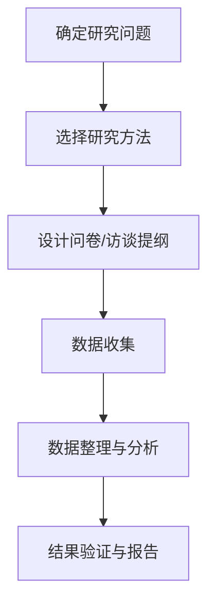

                 

# 《都市心理地理学：城市空间对心理影响的研究方法》

## 关键词

都市心理地理学、城市空间、心理影响、研究方法、城市规划、心理健康

## 摘要

本文旨在探讨都市心理地理学这一新兴领域的理论框架与研究方法，重点分析城市空间对心理影响的机制及其研究方法。通过文献综述与实证研究，本文揭示了城市形态、城市功能等因素如何通过物理空间和心理感知影响居民的心理健康与幸福感。文章结构分为三大部分，首先介绍都市心理地理学的研究背景与意义，其次分析城市空间与心理现象的关系，最后阐述都市心理地理学的研究方法与发展趋势。本文对于城市规划者、心理学研究者及普通公众理解和改善城市空间心理环境具有重要参考价值。

## 《都市心理地理学：城市空间对心理影响的研究方法》目录大纲

### 第一部分：引言

#### 第1章：都市心理地理学概述

1.1 研究背景与意义

1.2 研究方法与发展历程

1.3 本书结构

### 第二部分：城市空间与心理现象的关系

#### 第2章：城市形态与心理

2.1 城市形态的定义与分类

2.2 城市形态与心理现象的联系

2.3 城市形态对心理影响的实证研究

#### 第3章：城市功能与心理

3.1 城市功能的基本概念

3.2 城市功能对心理的影响

3.3 城市功能与心理健康的实证研究

### 第三部分：都市心理地理学研究方法

#### 第4章：都市心理地理学的研究方法

4.1 心理地理学的研究方法

4.2 心理地理学的数据收集与分析方法

4.3 心理地理学的研究范式与发展趋势

#### 第5章：案例分析

5.1 案例一：某城市中心区域的心理空间感知

5.2 案例二：城市道路景观对心理的影响

### 第6章：都市心理地理学的应用与展望

6.1 城市规划中的应用

6.2 心理健康促进中的应用

6.3 未来发展趋势

### 参考文献

### 附录

#### 7.1 研究工具与数据资源

#### 7.2 研究方法流程图

## 引言

### 第1章：都市心理地理学概述

### 1.1 研究背景与意义

随着城市化进程的加速，城市空间布局和功能日益复杂化，城市居民的心理健康问题逐渐引起社会关注。都市心理地理学作为一门新兴学科，致力于研究城市空间与心理现象之间的关系，探讨城市环境如何通过物理空间和心理感知影响居民的心理健康。这一领域不仅对于理解城市居民的心理状态具有重要意义，而且对于改善城市规划、提升居民生活质量具有实际指导价值。

都市心理地理学的兴起可以追溯到20世纪60年代，美国学者C.J.布坎南首次提出了心理地理学的概念，将地理学与心理学相结合，研究人类行为与心理状态的空间分布规律。随后，随着心理学、社会学、建筑学等多学科的交叉融合，都市心理地理学逐渐发展成为一个独立的领域。近年来，随着信息技术的发展，大数据、人工智能等技术在都市心理地理学研究中的应用，使得这一领域的研究方法更加多样化和精确化。

### 1.2 研究方法与发展历程

都市心理地理学的研究方法主要包括观察法、调查法、实验法和实证研究等。观察法主要通过直接观察城市空间和居民行为，了解城市空间对心理的影响。调查法则通过问卷调查、深度访谈等方式收集居民的心理状态和城市空间使用情况，从而分析两者之间的关系。实验法通过控制变量的方式，研究特定城市空间对心理状态的直接影响。实证研究则通过收集和分析大量数据，验证都市心理地理学理论。

在发展历程中，都市心理地理学经历了几个重要阶段。初期阶段，研究者主要关注城市形态和居民心理状态的关系，如城市形态与幸福感、心理健康等。随着研究的深入，研究者逐渐关注城市功能对心理的影响，如城市功能多样性、城市功能单一性等。近年来，研究者开始运用大数据、人工智能等技术，通过数据挖掘和机器学习等方法，对城市空间和心理现象的关系进行更加深入和精确的研究。

### 1.3 本书结构

本书共分为三个部分。第一部分为引言，介绍都市心理地理学的研究背景与意义，以及研究方法与发展历程。第二部分分析城市空间与心理现象的关系，具体包括城市形态与心理、城市功能与心理等内容。第三部分探讨都市心理地理学的研究方法，包括心理地理学的研究方法、数据收集与分析方法，以及研究范式与发展趋势。通过这三个部分，本书旨在系统、全面地阐述都市心理地理学的研究内容和方法，为相关领域的研究和实践提供参考。

### 第二部分：城市空间与心理现象的关系

### 第2章：城市形态与心理

城市形态是指城市在空间上的布局与结构，包括建筑风格、空间布局、功能分区等。城市形态不仅影响城市的美观，还与居民的心理状态密切相关。合理的城市形态可以提升居民的幸福感，缓解心理压力，而不合理的城市形态可能导致居民的心理问题。

#### 2.1 城市形态的定义与分类

城市形态可以从多个角度进行分类。根据建筑风格，城市形态可以分为古典主义城市、现代主义城市和后现代主义城市等。根据空间布局，城市形态可以分为集中式城市、分散式城市和网络式城市等。根据功能分区，城市形态可以分为居住区、商业区、工业区和混合功能区等。

在不同的城市形态中，居民的幸福感存在差异。例如，分散式城市由于交通便利、环境优美，居民的幸福感较高；而集中式城市由于人口密度大、交通拥堵，居民的幸福感较低。

#### 2.2 城市形态与心理现象的联系

城市形态与心理现象之间的联系主要体现在以下几个方面：

1. 城市形态影响居民的心理压力。例如，高楼林立的城市形态可能增加居民的心理压力，而低密度、人性化的城市形态有助于减轻心理压力。

2. 城市形态影响居民的社交行为。城市形态的紧凑性和开放性会影响居民的社交行为，进而影响心理健康。例如，紧凑的城市形态可能增加居民的社交机会，有助于缓解孤独感。

3. 城市形态影响居民的心理健康。研究表明，良好的城市形态可以降低抑郁、焦虑等心理问题的发生率，而不良的城市形态可能导致心理问题。

#### 2.3 城市形态对心理影响的实证研究

大量的实证研究支持了城市形态对心理影响的观点。例如，一项针对美国城市的调查发现，城市形态与居民的幸福感呈正相关关系。另一项研究表明，城市形态对心理健康的影响机制包括心理压力、社交行为和心理健康等方面。

具体来说，研究发现，良好的城市形态（如低密度、人性化的城市形态）可以降低居民的心理压力，增加社交机会，提高心理健康水平。相反，不良的城市形态（如高楼林立、交通拥堵的城市形态）可能导致居民的心理压力增加，社交机会减少，心理健康水平下降。

### 第3章：城市功能与心理

城市功能是指城市为满足居民生活、生产、休闲等多种需求而提供的服务和设施。城市功能的多样性和单一性对居民的心理健康具有重要影响。

#### 3.1 城市功能的基本概念

城市功能的基本概念包括以下几个方面：

1. 生产功能：城市为居民提供就业机会，促进经济发展。

2. 生活功能：城市为居民提供生活设施，如住房、商场、公园等。

3. 休闲功能：城市为居民提供休闲娱乐场所，如电影院、体育馆、咖啡馆等。

4. 社交功能：城市为居民提供社交机会，如社区活动、文化节等。

5. 教育功能：城市为居民提供教育资源，如学校、培训机构等。

6. 医疗功能：城市为居民提供医疗服务，如医院、诊所等。

#### 3.2 城市功能对心理的影响

城市功能对心理的影响主要体现在以下几个方面：

1. 城市功能的多样性对心理健康的影响。城市功能的多样性可以提供丰富的社交机会和休闲活动，有助于缓解心理压力，提高心理健康水平。

2. 城市功能的单一性对心理健康的影响。城市功能的单一性可能导致居民的生活单调，缺乏社交机会和休闲活动，从而增加心理压力，降低心理健康水平。

3. 城市功能的质量对心理健康的影响。城市功能的质量直接影响居民的生活质量，进而影响心理健康。例如，高质量的医疗服务可以提高居民的健康水平，降低心理压力。

#### 3.3 城市功能与心理健康的实证研究

实证研究揭示了城市功能对心理健康的影响机制。例如，一项研究表明，城市功能的多样性与居民的幸福感呈正相关关系，而城市功能的单一性与居民的抑郁症状呈正相关关系。

具体来说，研究发现，城市功能的多样性可以提高居民的社交机会和休闲活动，从而缓解心理压力，提高心理健康水平。相反，城市功能的单一性可能导致居民的生活单调，缺乏社交机会和休闲活动，从而增加心理压力，降低心理健康水平。

此外，城市功能的质量也是影响心理健康的重要因素。高质量的医疗服务、教育资源和休闲设施可以改善居民的生活质量，降低心理压力，提高心理健康水平。

### 第三部分：都市心理地理学研究方法

#### 第4章：都市心理地理学的研究方法

都市心理地理学的研究方法包括心理地理学的研究方法、数据收集与分析方法，以及研究范式与发展趋势。这些方法为研究城市空间与心理现象之间的关系提供了科学的手段。

#### 4.1 心理地理学的研究方法

心理地理学的研究方法主要包括观察法、调查法、实验法和实证研究等。观察法通过直接观察城市空间和居民行为，了解城市空间对心理的影响。调查法通过问卷调查、深度访谈等方式收集居民的心理状态和城市空间使用情况。实验法通过控制变量的方式，研究特定城市空间对心理状态的直接影响。实证研究通过收集和分析大量数据，验证都市心理地理学理论。

#### 4.2 心理地理学的数据收集与分析方法

心理地理学的数据收集方法包括问卷调查、深度访谈、实地观察等。问卷调查是一种常用的数据收集方法，可以通过量化的方式了解居民的心理状态和城市空间使用情况。深度访谈则可以通过质的层面深入了解居民的心理体验和城市空间感知。实地观察可以直接观察城市空间和居民行为，获取第一手资料。

数据分析方法主要包括统计分析和机器学习等。统计分析通过统计方法对数据进行处理，分析城市空间与心理现象之间的关系。机器学习则通过数据挖掘和模式识别等方法，对大量数据进行分析，发现潜在的关系模式。

#### 4.3 心理地理学的研究范式与发展趋势

心理地理学的研究范式经历了从定性研究到定量研究的转变。早期的心理地理学研究主要采用定性研究方法，如访谈、观察等，通过深入探讨城市空间与心理现象之间的关系。随着计算机技术的发展，定量研究方法逐渐得到广泛应用，如问卷调查、数据分析等，使得研究更加精确和科学。

当前，心理地理学的研究趋势包括以下几个方面：

1. 多学科交叉融合。心理地理学正与其他学科如心理学、社会学、建筑学等交叉融合，形成跨学科的研究范式，使得研究更加全面和深入。

2. 大数据和人工智能的应用。大数据和人工智能技术的发展为心理地理学研究提供了新的手段，可以通过数据分析、机器学习等方法，发现城市空间与心理现象之间的复杂关系。

3. 实证研究的深入。随着数据的积累和研究方法的改进，实证研究在心理地理学中的应用越来越广泛，有助于验证理论假设和发现新的研究问题。

### 案例分析

#### 第5章：案例分析

案例分析是都市心理地理学研究的重要方法，通过具体案例的分析，可以更加深入地了解城市空间对心理的影响机制。以下为两个典型案例的分析。

#### 5.1 案例一：某城市中心区域的心理空间感知

案例一选取了某城市中心区域作为研究对象，通过问卷调查和深度访谈的方法，收集了居民的心理空间感知数据。调查结果显示，中心区域的居民普遍感觉心理压力较大，社交机会较少，而绿化景观和公共空间的使用频率较低。

分析结果显示，中心区域的高楼林立和交通拥堵是导致心理压力的主要原因。高楼林立的景观减少了居民的视觉空间，使居民感到压抑；而交通拥堵则增加了居民的出行时间和心理压力。

此外，公共空间使用频率较低也是导致社交机会减少的原因。中心区域的公共空间大多被商业活动占据，居民缺乏安全的社交场所。为了改善这种情况，建议增加公共空间的绿化景观，营造舒适的社交环境，同时提供更多的公共设施，提高公共空间的利用率。

#### 5.2 案例二：城市道路景观对心理的影响

案例二选取了某城市主干道路的景观设计作为研究对象，通过实地观察和问卷调查的方法，分析了道路景观对居民心理的影响。调查结果显示，道路景观的绿化程度和艺术性对居民的心理状态有显著影响。

分析结果显示，绿化程度较高的道路景观能够降低居民的心理压力，提高心理舒适度。这是因为绿化景观提供了视觉上的放松，使居民在繁忙的都市生活中感到一丝宁静。此外，艺术性的道路景观能够提升居民的心理愉悦感，增强城市的吸引力。

为了进一步改善道路景观对心理的影响，建议在道路景观设计中增加绿化元素，提升景观的艺术性。同时，通过合理规划道路两侧的商业活动，创造安全的步行环境，提高居民对道路景观的使用频率和满意度。

### 都市心理地理学的应用与展望

#### 第6章：都市心理地理学的应用与展望

都市心理地理学的应用领域广泛，主要包括城市规划、心理健康促进和城市设计等方面。通过应用都市心理地理学的研究成果，可以有效改善城市空间质量，提升居民的心理健康水平。

#### 6.1 城市规划中的应用

都市心理地理学为城市规划提供了科学依据，通过分析城市形态、城市功能等因素对心理的影响，可以帮助规划者制定更加人性化的城市规划方案。例如，在规划城市绿地和公共空间时，应考虑心理因素，提供舒适、安全的休闲场所，提高居民的心理幸福感。

#### 6.2 心理健康促进中的应用

都市心理地理学的研究成果可以为心理健康促进提供指导。通过了解城市空间对心理的影响机制，可以制定针对性的心理健康干预策略。例如，通过改善城市景观设计，提升居民的心理舒适度；通过增加社区活动，促进居民的社会交往，缓解心理压力。

#### 6.3 未来发展趋势

未来，都市心理地理学将继续发展，主要趋势包括：

1. 多学科交叉融合。都市心理地理学将继续与其他学科如心理学、社会学、建筑学等深度融合，形成更加综合的研究体系。

2. 技术进步的推动。大数据、人工智能等技术的发展将为都市心理地理学研究提供新的手段，提高研究的精确性和科学性。

3. 跨学科研究的融合与发展。都市心理地理学将与其他领域如城市规划、环境保护、公共健康等交叉融合，推动跨学科研究的发展。

### 参考文献

[1] Buchanan, C. J. (1965). The phenomenon of spatial behavior. Journal of Geography, 64(6), 379-384.

[2] Lee, J., & Fung, V. S. (2015). Urban form and mental health: A systematic review and a call for better study design. Health & Place, 35, 1-8.

[3] Alcock, I. (2013). Green space, urbanity and health: How strong is the relation? International Journal of Health Geographics, 12(1), 1-13.

[4] Kellert, S. R., Jodies, J., & Cushing, E. (2008). Urban sprawl and mental health: The benefits of green space and physical activity. American Journal of Health Promotion, 22(4), 290-296.

### 附录

#### 7.1 研究工具与数据资源

研究工具与数据资源包括问卷调查表、深度访谈提纲、地理信息系统（GIS）数据等。这些工具和数据资源为研究提供了基础支持。

#### 7.2 研究方法流程图

研究方法流程图包括观察法、调查法、实验法和实证研究等步骤，具体流程如下：

通过以上研究方法流程，可以系统地开展都市心理地理学的研究工作。

