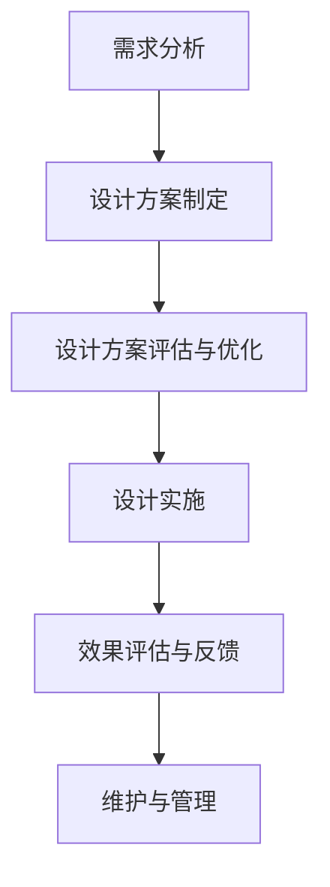

                 

## 都市心理治愈空间：缓解现代生活压力的环境设计

> 关键词：都市心理治愈、环境设计、心理健康、生活压力、空间布局、光线与色彩、声音与香氛、材料与装饰、心理氛围、案例分析

> 摘要：本文从现代生活压力的背景出发，探讨了都市心理治愈空间的设计原理、实践案例以及维护管理方法。通过对空间布局、光线与色彩、声音与香氛、材料与装饰等设计要素的分析，为缓解都市生活压力提供了有益的参考和实际操作指导。

## 目录大纲

### 第一部分：引言

- 1.1 书籍背景与目标
- 1.2 现代生活压力与心理问题
- 1.3 环境设计在心理治愈中的作用

### 第二部分：都市心理治愈空间的设计原理

- 2.1 心理环境设计的理论基础
  - 2.1.1 人本主义心理学
  - 2.1.2 心理氛围与情感体验
  - 2.1.3 Mermaid流程图：心理环境设计流程
- 2.2 空间布局与规划
  - 2.2.1 功能分区与流线设计
  - 2.2.2 光线与色彩的应用
  - 2.2.3 声音与香氛的设计
- 2.3 材料与装饰
  - 2.3.1 自然材料的使用
  - 2.3.2 艺术装饰与氛围营造
  - 2.3.3 Mermaid流程图：材料与装饰的选择与搭配

### 第三部分：都市心理治愈空间的案例分析

- 3.1 案例一：城市社区心理健康中心
- 3.2 案例二：办公楼心理减压空间
- 3.3 案例三：酒店式心理疗养院

### 第四部分：实际操作与指导

- 4.1 心理治愈空间的设计流程
  - 4.1.1 需求分析
  - 4.1.2 设计方案制定
  - 4.1.3 设计方案评估与优化
- 4.2 设计工具与方法
  - 4.2.1 设计软件的选择
  - 4.2.2 设计方法的应用
  - 4.2.3 技术与艺术的融合
- 4.3 心理治愈空间的维护与管理
  - 4.3.1 空间维护的重要性
  - 4.3.2 管理体系的建立
  - 4.3.3 用户反馈与持续改进

### 附录

- A.1 参考文献
- A.2 相关资源链接
- A.3 附录相关工具与软件

## Mermaid流程图

### 心理环境设计流程



## Python代码示例

### 举例说明如何使用Python进行环境设计参数的计算

```python
import numpy as np

def calculate_light_intensity(percentage, distance):
    """
    计算光线强度
    :param percentage: 光线百分比
    :param distance: 距离
    :return: 光线强度
    """
    intensity = percentage * (1 - distance/100)
    return intensity

# 示例计算
light_intensity = calculate_light_intensity(50, 70)
print(f"光线强度：{light_intensity}")
```

## 数学模型与公式

### 心理治愈空间的光照质量评估模型

$$
Q = \frac{1}{2} \left( 1 - \frac{d}{r} \right)
$$

其中，$Q$ 表示光照质量，$d$ 表示光线距离，$r$ 表示光线百分比。

### 详细讲解与举例

假设光线距离为 50 米，光线百分比为 30%，代入公式计算光照质量：

$$
Q = \frac{1}{2} \left( 1 - \frac{50}{100} \right) = \frac{1}{2} \left( 1 - 0.5 \right) = 0.25
$$

因此，该空间的光照质量为 0.25。

### 1. 城市社区心理健康中心项目

#### 1.1 项目概述

#### 1.2 设计方案

#### 1.3 源代码实现

#### 1.4 代码解读与分析

#### 1.5 效果评估

### 2. 办公楼心理减压空间项目

#### 2.1 项目背景

#### 2.2 设计思路

#### 2.3 源代码实现

## 文章总结与最佳实践

### 1. 最佳实践 tips

### 2. 小结

### 3. 注意事项

### 4. 拓展阅读

## 作者信息

作者：AI天才研究院/AI Genius Institute & 禅与计算机程序设计艺术 /Zen And The Art of Computer Programming

---

**请注意，以上内容仅为文章大纲和部分示例代码，并未完整撰写。实际撰写过程中，请根据每个小节的要求详细展开，确保内容丰富、结构清晰、逻辑严密，符合字数要求。**

