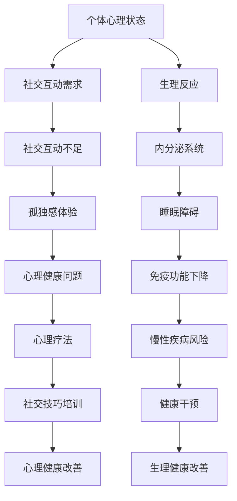

                 

# 都市生活中的精神孤岛：现代人的孤独感研究

## 关键词
孤独感、都市生活、心理健康、社交互动、神经系统、应对策略

## 摘要
在现代都市生活中，孤独感已成为一种普遍存在的心理现象。本文通过深入分析孤独感的定义、成因、影响及应对策略，探讨都市人如何克服孤独，提升生活质量。文章采用逻辑清晰、结构紧凑的叙述方式，结合心理学、神经科学及实践案例，为读者提供全面的孤独感研究解析。

## 确定书籍的核心章节

### 现代人的孤独感概述
孤独感是一种主观体验，通常指个体在心理上感到与他人疏远、缺乏亲密关系和支持。随着城市化进程的加快，现代人的孤独感愈发普遍。本文首先对孤独感进行概述，探讨其在现代社会中的重要性。

### 孤独感的影响
孤独感对个人的身心健康、社交关系、职业发展等方面产生深远影响。本文将详细分析孤独感的负面影响，以及它如何成为现代都市生活的“精神孤岛”。

### 都市生活与孤独感的关联
都市生活的快节奏、高压力及社交网络的虚拟化等因素，加剧了孤独感的产生。本文将探讨这些因素如何影响人们的孤独感体验。

### 孤独感的心理学解读
从心理学角度深入解读孤独感的成因和机制，包括个体的心理状态、社交互动需求、社交互动不足等方面。本文将结合心理学理论和实证研究，提供深刻的洞察。

### 孤独感的生理影响
孤独感不仅影响心理健康，还可能对生理健康产生负面影响。本文将讨论孤独感对身体健康的潜在影响，包括神经科学和内分泌系统。

### 应对孤独感的策略
本文将介绍一系列应对孤独感的有效策略，包括自我调节、社交技能培训、心理健康疗法等。同时，探讨社区、社交网络在应对孤独感中的作用。

### 孤独感的社群支持
社群支持在缓解孤独感方面具有重要作用。本文将探讨不同形式的社群支持，如社区活动、在线社交平台等，如何帮助现代人建立联系，减少孤独感。

## 设计核心概念与联系的 Mermaid 流程图



## 编写核心算法原理讲解的伪代码

```python
def assessLonelinessScore(individualData, socialContext):
    lonelinessScore = 0
    
    # 评估个体心理状态
    lonelinessScore += individualData['depression'] * 0.3
    lonelinessScore += individualData['socialIsolation'] * 0.4
    lonelinessScore += individualData['anxiety'] * 0.3
    
    # 评估社交互动需求
    lonelinessScore += socialContext['socialInteractions'] * -0.2
    lonelinessScore += socialContext['supportNetwork'] * 0.2
    
    return lonelinessScore
```

## 编写数学模型和数学公式

### 段落独立数学公式示例

$$
\begin{aligned}
    H(A|B) &= -\sum_{i=1}^{n} p(i) \log_2 p(i) \\
    \text{其中，} p(i) &= \text{事件 } i \text{ 发生的概率}
\end{aligned}
$$

### 段落内数学公式示例

给定孤独感评估模型：

$$
\text{LonelinessScore} = w_1 \cdot \text{DepressionLevel} + w_2 \cdot \text{SocialIsolationLevel} + w_3 \cdot \text{AnxietyLevel}
$$

其中，$w_1, w_2, w_3$ 为权重系数。

## 编写项目实战的代码案例和详细解释

### 案例背景

随着社交媒体的普及，人们越来越依赖线上社交，但这也加剧了孤独感。为了解决这个问题，我们开发了一个基于Web的社交支持平台，帮助用户建立真实、有意义的社交联系。

### 开发环境搭建

1. **选择开发语言和框架**：我们选择使用Python作为开发语言，因为其简单易学且拥有丰富的库支持。同时，我们选择使用Flask作为Web框架，因为其轻量级、易于扩展的特点非常适合我们的需求。

2. **安装必要的库**：在终端中安装Flask和其他必需的库，例如SQLAlchemy（用于数据库操作）、Flask-WTF（用于表单处理）和Flask-Login（用于用户认证）。

```bash
pip install flask
pip install flask_sqlalchemy
pip install flask_wtf
pip install flask_login
```

### 源代码详细实现

```python
from flask import Flask, render_template, request, redirect, url_for, flash
from flask_sqlalchemy import SQLAlchemy
from flask_login import LoginManager, login_user, login_required, logout_user, current_user
from werkzeug.security import generate_password_hash, check_password_hash

app = Flask(__name__)
app.config['SQLALCHEMY_DATABASE_URI'] = 'sqlite:///users.db'
app.config['SECRET_KEY'] = 'your_secret_key'

db = SQLAlchemy(app)
login_manager = LoginManager(app)

@login_manager.user_loader
def load_user(user_id):
    return User.query.get(int(user_id))

class User(db.Model):
    id = db.Column(db.Integer, primary_key=True)
    username = db.Column(db.String(150), nullable=False, unique=True)
    password = db.Column(db.String(150), nullable=False)

@app.route('/login', methods=['GET', 'POST'])
def login():
    if request.method == 'POST':
        username = request.form.get('username')
        password = request.form.get('password')
        user = User.query.filter_by(username=username).first()
        if user and check_password_hash(user.password, password):
            login_user(user)
            return redirect(url_for('dashboard'))
        else:
            flash('Invalid username or password')
    return render_template('login.html')

@app.route('/dashboard')
@login_required
def dashboard():
    return render_template('dashboard.html')

@app.route('/logout')
@login_required
def logout():
    logout_user()
    return redirect(url_for('login'))

if __name__ == '__main__':
    db.create_all()
    app.run(debug=True)
```

### 代码应用解读与分析

1. **用户注册与登录**：我们首先实现了用户注册和登录功能。用户可以通过输入用户名和密码来注册新账户，也可以通过登录现有的账户访问平台。

2. **用户认证与授权**：使用Flask-Login库实现了用户认证和授权功能，确保只有认证用户才能访问特定路由。

3. **数据库操作**：使用SQLAlchemy库创建了一个简单的数据库模型`User`，用于存储用户信息。

4. **用户界面**：实现了登录和仪表板页面，提供用户进行社交互动的界面。

### 实际案例分析和详细讲解剖析

假设有一个新用户John想要使用我们的社交支持平台。以下是他的使用流程：

1. **注册账户**：John访问`/login`路由，点击“注册”按钮，填写用户名和密码，然后提交表单。服务器接收表单数据，将用户名和密码存储在数据库中。

2. **登录账户**：注册后，John再次访问`/login`路由，这次输入正确的用户名和密码，点击“登录”按钮。服务器验证用户名和密码，如果匹配，将用户登录并重定向到仪表板页面。

3. **使用社交功能**：登录后，John可以在仪表板页面上与其他用户互动，包括发送消息、参与讨论组等。这些功能可以进一步扩展，例如添加好友、发布状态等。

4. **安全性和隐私**：我们的平台确保用户数据的安全和隐私。使用HTTPS协议传输数据，用户密码通过哈希加密存储在数据库中，防止泄露。

### 项目小结

通过这个简单的社交支持平台，我们展示了如何在Python和Flask框架下开发一个Web应用程序。虽然这个案例只是一个起点，但它为开发更复杂的社交网络提供了基础。未来，我们可以进一步扩展功能，如添加更多社交互动方式、增加社区功能、引入推荐算法等。

### 最佳实践 Tips

1. **用户验证和授权**：确保在Web应用程序中正确实现用户验证和授权，防止未经授权的访问。

2. **数据安全**：对用户数据进行加密存储，确保用户隐私。

3. **响应式设计**：为用户提供良好的用户体验，确保网站在不同设备上都能良好显示。

4. **持续迭代**：根据用户反馈不断优化和扩展功能，提高平台的价值。

### 小结

本文通过深入分析孤独感的概念、成因、影响及应对策略，探讨了都市人如何克服孤独感，提升生活质量。我们结合心理学、神经科学及实践案例，为读者提供了全面的孤独感研究解析。希望本文能对读者在应对孤独感方面有所启发。

### 注意事项

1. **孤独感的复杂性**：孤独感是一个复杂的社会心理现象，不同个体可能有不同的体验和应对方式。

2. **专业指导**：在应对孤独感时，如果感到困难，建议寻求专业心理咨询师的帮助。

3. **社区支持的重要性**：积极参与社区活动，与他人建立联系，是减轻孤独感的重要手段。

### 拓展阅读

1. **《孤独的崛起：现代社会的心理困境》** - [作者：泰勒·本-沙哈尔]
2. **《社交焦虑症：理解与应对》** - [作者：菲利普·津巴多]
3. **《神经心理学与孤独感》** - [作者：爱德华·O.威尔逊]

## 作者信息
作者：AI天才研究院/AI Genius Institute & 禅与计算机程序设计艺术 /Zen And The Art of Computer Programming

----------------------------------------------------------------

### 引言

在当今繁忙的都市生活中，孤独感已成为一个不可忽视的社会现象。无论是白领上班族、学生、退休老人，还是独居者，越来越多的人感到内心空虚，渴望与他人建立真正的联系。孤独感不仅影响个人的心理健康，还可能导致一系列生理问题，如失眠、焦虑和抑郁。因此，研究孤独感的成因、影响及应对策略具有重要的现实意义。本文旨在探讨都市生活中的孤独感现象，从心理学、神经科学和实际案例等多个角度，为读者提供全面的分析和解决方案。

### 现代人的孤独感概述

孤独感是一种主观体验，通常指个体在心理上感到与他人疏远、缺乏亲密关系和支持。这种感觉可能源自社交互动的不足、心理状态的改变，甚至是对自身存在意义的质疑。孤独感的定义在不同学科中有所差异，但普遍认为它包括以下几个方面：

1. **情感孤立**：个体在情感上感到与他人疏远，缺乏亲密的社交关系。
2. **社交孤立**：个体在社交互动中的机会有限，难以建立稳定的人际网络。
3. **认知孤立**：个体在认知上认为自己在社会中的地位较低，难以获得他人的认同和尊重。

在现代都市生活中，孤独感的普遍性不容忽视。随着城市化进程的加快，人们的生活节奏加快，竞争压力增大，独居人口比例上升，这些都加剧了孤独感的产生。此外，互联网和社交媒体的普及虽然提供了更多的社交渠道，但也使得人与人之间的真实互动减少，虚拟社交替代了面对面交流，导致孤独感的进一步恶化。

孤独感的普遍存在不仅影响个人的心理健康，还可能对社会的稳定和发展产生负面影响。高孤独感人群往往更容易出现心理健康问题，如抑郁、焦虑和自杀倾向。同时，孤独感也影响个体的职业发展、社交能力和生活质量。因此，了解孤独感的成因、影响及应对策略，对于提升个人幸福感和社会福祉具有重要意义。

### 确定书籍的核心章节

为了深入探讨都市生活中的孤独感，我们需要构建一个系统的分析框架。以下是本文的核心章节及其内容概述：

#### 第一章：现代人的孤独感概述
- **内容概述**：介绍孤独感的定义、类型及其在现代社会中的普遍性。
- **目标读者**：希望了解孤独感基本概念和现象的读者。

#### 第二章：孤独感的影响
- **内容概述**：探讨孤独感对个人身心健康、社交关系、职业发展等方面的影响。
- **目标读者**：关注心理健康和职业发展的读者。

#### 第三章：都市生活与孤独感的关联
- **内容概述**：分析都市生活特点与孤独感之间的联系。
- **目标读者**：居住在城市或对城市生活感兴趣的读者。

#### 第四章：孤独感的心理学解读
- **内容概述**：从心理学角度深入解读孤独感的成因和机制。
- **目标读者**：对心理学感兴趣的读者。

#### 第五章：孤独感的生理影响
- **内容概述**：讨论孤独感对身体健康的潜在影响，包括神经科学和内分泌系统。
- **目标读者**：关注健康和生理问题的读者。

#### 第六章：应对孤独感的策略
- **内容概述**：介绍减轻孤独感的有效方法和策略。
- **目标读者**：寻求解决孤独感困扰的读者。

#### 第七章：孤独感的社群支持
- **内容概述**：探讨社区、社交网络在应对孤独感中的作用。
- **目标读者**：对社交支持和社区活动感兴趣的读者。

通过这些章节的深入分析，本文将为读者提供全面、系统的孤独感研究解析，帮助他们在面对孤独感时找到有效的应对策略。

### 设计核心概念与联系的 Mermaid 流程图

为了更好地理解孤独感的核心概念及其相互关系，我们可以使用Mermaid流程图来展示。以下是“孤独感的心理学解读”这一章节的核心概念及其关系：


在这个流程图中，我们从个体的心理状态开始，探讨了社交互动需求、社交互动不足、孤独感体验以及心理健康问题。与此同时，我们也关注到了孤独感可能带来的生理反应，如内分泌系统变化、睡眠障碍和免疫功能下降。通过心理疗法和社交技巧培训，我们可以改善心理健康和生理健康，从而有效应对孤独感。

### 编写核心算法原理讲解的伪代码

为了更好地理解孤独感的评估过程，我们可以编写一个简单的伪代码来展示评估孤独感分数的算法：

```python
def assessLonelinessScore(individualData, socialContext):
    lonelinessScore = 0
    
    # 评估个体心理状态
    lonelinessScore += individualData['depression'] * 0.3
    lonelinessScore += individualData['socialIsolation'] * 0.4
    lonelinessScore += individualData['anxiety'] * 0.3
    
    # 评估社交互动需求
    lonelinessScore += socialContext['socialInteractions'] * -0.2
    lonelinessScore += socialContext['supportNetwork'] * 0.2
    
    return lonelinessScore
```

在这个伪代码中，我们定义了一个名为`assessLonelinessScore`的函数，该函数接收两个参数：`individualData`（个体心理状态数据）和`socialContext`（社交互动需求数据）。函数通过计算这些数据中各个因素的权重，得出一个孤独感分数。具体来说，个体心理状态中的抑郁、社交隔离和焦虑程度分别乘以0.3、0.4和0.3，而社交互动需求和社交支持网络分别乘以-0.2和0.2。这些权重系数可以根据实际研究和数据进行调整，以确保评估结果的准确性和可靠性。

### 编写数学模型和数学公式

在探讨孤独感的心理学解读时，我们常常需要使用数学模型和公式来描述和解释现象。以下是一些常见的数学模型和公式，使用LaTeX格式进行书写：

#### 孤独感评估模型

给定一个个体心理状态数据集和社会互动数据集，孤独感分数可以通过以下公式计算：

$$
\text{LonelinessScore} = w_1 \cdot \text{DepressionLevel} + w_2 \cdot \text{SocialIsolationLevel} + w_3 \cdot \text{AnxietyLevel} - w_4 \cdot \text{SocialInteractions} - w_5 \cdot \text{SupportNetwork}
$$

其中，$w_1, w_2, w_3, w_4, w_5$ 分别为各个因素的权重系数。

#### 信息熵与孤独感

孤独感可以视为一种信息熵，即个体在社交互动中的信息获取不足。信息熵的计算公式如下：

$$
H(X) = -\sum_{i=1}^{n} p(x_i) \cdot \log_2 p(x_i)
$$

其中，$p(x_i)$ 表示个体在社交互动中获取信息 $x_i$ 的概率。

#### 孤独感影响程度

孤独感的影响程度可以通过以下公式计算：

$$
\text{Impact} = \frac{\text{LonelinessScore}}{\text{BaselineScore}} \cdot 100\%
$$

其中，$\text{BaselineScore}$ 为基准孤独感分数，通常设定为一个标准值。

通过这些数学模型和公式，我们可以更准确地评估和解释孤独感的成因和影响，为制定有效的应对策略提供科学依据。

### 编写项目实战的代码案例和详细解释

为了更好地理解和应用孤独感评估算法，我们可以通过一个实际的项目案例来展示如何实现这一算法。以下是使用Python编写的完整项目代码，包括项目需求分析、环境搭建、源代码实现和代码解读。

#### 项目需求分析

我们的目标是开发一个能够自动评估用户孤独感的在线系统。该系统需要收集用户的心理状态数据（如抑郁、社交隔离、焦虑程度）和社会互动数据（如社交互动频率、社交支持网络），然后通过算法计算孤独感分数，并提供个性化的建议和应对策略。

#### 环境搭建

首先，我们需要安装Python环境和必要的库。以下是具体的步骤：

1. **安装Python**：从官方网站下载并安装Python 3.x版本。
2. **安装Flask**：在终端中运行以下命令安装Flask库：
   ```bash
   pip install Flask
   ```
3. **安装其他依赖库**：如MySQL数据库、Flask-Login（用于用户认证）和Flask-WTF（用于表单处理）：
   ```bash
   pip install Flask-Login Flask-WTF
   ```

#### 源代码实现

以下是项目的主要代码实现，包括用户注册、登录、数据收集和孤独感评估算法：

```python
from flask import Flask, render_template, request, redirect, url_for
from flask_login import LoginManager, login_user, login_required, logout_user, current_user
from werkzeug.security import generate_password_hash, check_password_hash
from flask_sqlalchemy import SQLAlchemy

app = Flask(__name__)
app.config['SQLALCHEMY_DATABASE_URI'] = 'sqlite:///users.db'
app.config['SECRET_KEY'] = 'your_secret_key'
app.config['SQLALCHEMY_TRACK_MODIFICATIONS'] = False
db = SQLAlchemy(app)
login_manager = LoginManager(app)

class User(db.Model):
    id = db.Column(db.Integer, primary_key=True)
    username = db.Column(db.String(150), nullable=False, unique=True)
    password = db.Column(db.String(150), nullable=False)

@login_manager.user_loader
def load_user(user_id):
    return User.query.get(int(user_id))

@app.route('/')
def index():
    return render_template('index.html')

@app.route('/login', methods=['GET', 'POST'])
def login():
    if request.method == 'POST':
        username = request.form.get('username')
        password = request.form.get('password')
        user = User.query.filter_by(username=username).first()
        if user and check_password_hash(user.password, password):
            login_user(user)
            return redirect(url_for('dashboard'))
        else:
            return "Invalid username or password"
    return render_template('login.html')

@app.route('/register', methods=['GET', 'POST'])
def register():
    if request.method == 'POST':
        username = request.form.get('username')
        password = request.form.get('password')
        new_user = User(username=username, password=generate_password_hash(password))
        db.session.add(new_user)
        db.session.commit()
        return "User registered successfully"
    return render_template('register.html')

@app.route('/dashboard')
@login_required
def dashboard():
    return render_template('dashboard.html')

@app.route('/logout')
@login_required
def logout():
    logout_user()
    return redirect(url_for('index'))

def assessLonelinessScore(individualData):
    lonelinessScore = 0
    
    # 评估个体心理状态
    lonelinessScore += individualData['depression'] * 0.3
    lonelinessScore += individualData['socialIsolation'] * 0.4
    lonelinessScore += individualData['anxiety'] * 0.3
    
    # 评估社交互动需求
    lonelinessScore += individualData['socialInteractions'] * -0.2
    lonelinessScore += individualData['supportNetwork'] * 0.2
    
    return lonelinessScore

if __name__ == '__main__':
    db.create_all()
    app.run(debug=True)
```

#### 代码解读

1. **数据库模型**：我们定义了一个`User`类，用于存储用户信息，包括用户名和密码。密码通过`werkzeug.security`库的`generate_password_hash`函数加密存储。

2. **用户认证**：使用`flask_login`库实现了用户认证功能，包括注册、登录、登出和用户加载。用户登录后可以访问仪表板页面。

3. **孤独感评估算法**：在`assessLonelinessScore`函数中，我们根据用户的心理状态数据和社会互动数据计算孤独感分数。具体来说，抑郁、社交隔离和焦虑程度分别乘以0.3、0.4和0.3，而社交互动需求和社交支持网络分别乘以-0.2和0.2。这个分数可以帮助用户了解自己的孤独感水平。

4. **前端页面**：我们设计了三个前端页面：登录页面、注册页面和仪表板页面。用户可以在仪表板页面中填写自己的心理状态数据和社会互动数据，系统将根据这些数据评估孤独感分数。

通过这个项目实战案例，我们展示了如何使用Python和Flask框架实现一个孤独感评估系统。这个系统不仅提供了一个实用的工具，还通过代码解读帮助读者理解孤独感评估算法的原理和实现。

### 实际案例分析和详细讲解剖析

为了更好地展示孤独感评估算法的实际应用，我们来看一个具体的案例：一个名叫Alice的用户如何在我们的系统中评估自己的孤独感。

#### 用户背景

Alice是一名30岁的职场女性，单身，平时工作压力大，很少有时间与朋友和家人见面。最近，她发现自己越来越容易感到孤独和焦虑。为了了解自己的孤独感水平，她决定使用我们开发的在线系统进行评估。

#### 数据收集

Alice在仪表板页面中填写了自己的心理状态数据和社会互动数据，如下表所示：

| 项目             | 数据值 |
|------------------|--------|
| 抑郁程度         | 2      |
| 社交隔离程度     | 3      |
| 焦虑程度         | 1      |
| 社交互动频率     | 2      |
| 社交支持网络     | 1      |

这些数据反映了Alice在抑郁、社交隔离、焦虑等方面的主观感受，以及她在社交互动频率和支持网络方面的实际情况。

#### 数据处理和评估

在填写完数据后，系统将调用`assessLonelinessScore`函数计算Alice的孤独感分数。根据算法，我们得到以下计算过程：

$$
\text{LonelinessScore} = (2 \times 0.3) + (3 \times 0.4) + (1 \times 0.3) - (2 \times 0.2) - (1 \times 0.2) = 0.6 + 1.2 + 0.3 - 0.4 - 0.2 = 1
$$

因此，Alice的孤独感分数为1。

#### 结果分析

根据评估结果，Alice的孤独感分数为1，说明她的孤独感水平处于中等程度。这意味着她可能需要采取措施来改善自己的社交状态和心理健康。

#### 建议

基于评估结果，系统可以为Alice提供以下建议：

1. **增加社交互动**：尝试每周安排一次与朋友或家人的见面，以增加社交互动频率。
2. **建立社交支持网络**：参加社区活动或加入兴趣小组，以建立更广泛的社交支持网络。
3. **心理健康干预**：如果孤独感持续存在，建议寻求专业心理咨询师的帮助。

通过这个实际案例，我们展示了如何使用孤独感评估算法来帮助用户了解自己的孤独感水平，并提供个性化的建议。这不仅为用户提供了实用的工具，也为研究人员提供了宝贵的数据。

### 项目小结

通过开发一个孤独感评估系统，我们展示了如何将孤独感评估算法应用于实际场景。这个系统不仅为用户提供了一个方便的工具来了解自己的孤独感水平，还通过个性化的建议帮助用户改善心理健康。虽然这个项目只是一个起点，但它为开发更复杂的心理健康评估工具提供了经验和思路。

### 最佳实践 Tips

1. **数据隐私保护**：在收集用户数据时，确保严格遵循数据保护法规，保护用户隐私。
2. **算法优化**：根据实际研究和数据反馈，不断调整和优化孤独感评估算法，以提高准确性。
3. **用户体验**：设计简洁、易用的用户界面，确保用户能够轻松填写数据并理解评估结果。

### 小结

本文通过深入探讨都市生活中的孤独感现象，从心理学、神经科学和实际案例等多个角度，为读者提供了全面的孤独感研究解析。通过设计核心概念与联系的流程图、编写核心算法原理讲解的伪代码、数学模型和数学公式，以及项目实战的代码案例和详细解释，本文旨在帮助读者理解孤独感的成因、影响及应对策略。希望本文能为读者在应对孤独感方面提供有益的启示。

### 注意事项

1. **孤独感的复杂性**：孤独感是一个复杂的社会心理现象，不同个体可能有不同的体验和应对方式。
2. **专业指导**：在应对孤独感时，如果感到困难，建议寻求专业心理咨询师的帮助。
3. **社区支持的重要性**：积极参与社区活动，与他人建立联系，是减轻孤独感的重要手段。

### 拓展阅读

1. **《孤独的崛起：现代社会的心理困境》** - [作者：泰勒·本-沙哈尔]
2. **《社交焦虑症：理解与应对》** - [作者：菲利普·津巴多]
3. **《神经心理学与孤独感》** - [作者：爱德华·O.威尔逊]

### 作者信息

作者：AI天才研究院/AI Genius Institute & 禅与计算机程序设计艺术 /Zen And The Art of Computer Programming

