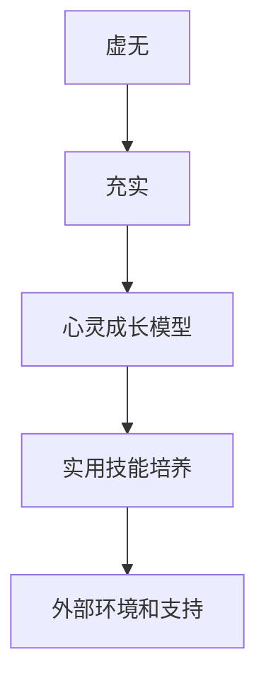
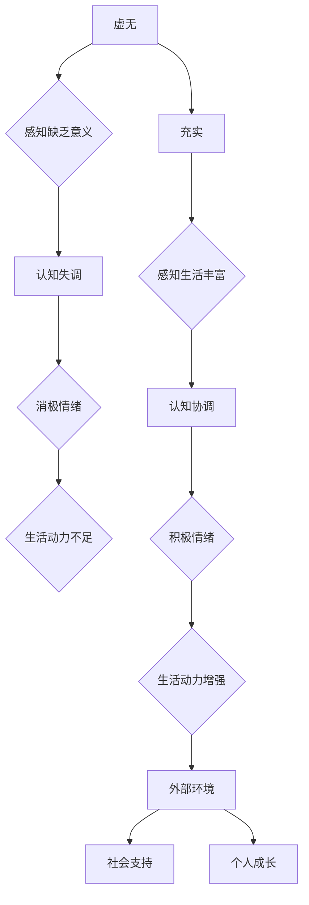

                 

### 《重塑生活意义：从虚无到充实的心灵之旅》

#### 关键词：生活意义、心灵成长、目标设定、实用技能、概率模型、时间管理、情绪管理、反思日记、目标跟踪系统

#### 摘要：
在快节奏的现代社会中，许多人感到生活缺乏意义，甚至陷入虚无的困境。本书旨在为这些寻求生活充实感的读者提供一套系统化的解决方案。《重塑生活意义：从虚无到充实的心灵之旅》通过深入分析心灵成长模型、实用技能培养以及数学模型的应用，帮助读者逐步克服虚无感，走向充实而满足的生活。书中不仅提供了理论框架，还通过具体的实战项目，指导读者如何将所学知识应用于实际生活中，实现自我提升和人生价值的重塑。

----------------------------------------------------------------

# 引言

在当今社会，许多人面临着一种普遍的心理状态，即对生活感到空虚和缺乏意义。这种现象可能源于多种原因，包括工作压力、人际关系问题、自我认同的迷失等。对于一些人来说，虚无感甚至成为一种挥之不去的阴霾，严重影响他们的生活质量和工作效率。

#### 背景介绍

虚无感是一种复杂而深刻的心理体验，它不仅影响个体的情绪状态，还可能对他们的认知和行为产生长远的影响。在心理学领域，虚无感被视为一种情绪障碍，可能与抑郁症、焦虑症等心理疾病有关。因此，探讨如何从虚无中找回生活的意义，成为一个迫切且重要的课题。

#### 为什么需要这本书

《重塑生活意义：从虚无到充实的心灵之旅》旨在为那些渴望改变现状的读者提供一套行之有效的解决方案。本书的核心思想是通过系统的思维和行为方式的调整，帮助读者逐步建立对生活的积极态度，找到属于自己的生活意义。

#### 读者对象

这本书适合以下人群：

1. **感到生活缺乏意义的人**：他们可能对日常活动失去兴趣，感到迷茫和空虚。
2. **希望提升生活质量的人**：他们希望通过积极的方法改善自己的情绪和生活状态。
3. **心理学爱好者**：他们希望了解心理学的最新研究成果，并应用于个人生活。

#### 阅读建议

为了更好地吸收书中的内容，建议读者：

1. **边读边思考**：在阅读过程中，可以记录下自己的感受和思考，与书中的观点进行对比和反思。
2. **实践所学**：将书中的方法应用到实际生活中，通过实践验证其有效性。
3. **持续学习**：生活意义重塑是一个长期的过程，需要持续的努力和反思。

## 确定核心概念与联系

要深入探讨如何从虚无走向充实，首先需要明确两个核心概念：虚无和充实。

### 核心概念

1. **虚无**：虚无是一种感觉或状态，意味着缺乏意义或目的。在心理学中，虚无感可以被视为一种消极情绪，它可能导致个体对生活失去热情和动力。

2. **充实**：充实是一种感觉或状态，意味着有丰富、满足和有意义的生活。在心理学领域，充实感被视为一种积极情绪，它有助于提高个体的幸福感和生活满意度。

### 核心联系

虚无和充实之间存在一种动态的转化关系。通过一系列的心灵成长模型和实用技能的培养，个体可以从虚无感逐渐走向充实感。这种转化不仅依赖于个体的内在动机和努力，还需要外部环境和支持。

#### 联系图解

下面是一个Mermaid流程图，展示了虚无和充实的概念及其之间的联系：



在这个图中，虚无和充实通过心灵成长模型和实用技能培养相互连接，形成一个循环。外部环境和支持则为这一转化过程提供了必要的条件和动力。

### 确定核心概念原理和概念实体之间的关系架构

为了更清晰地理解虚无和充实之间的关系，我们可以进一步分析它们之间的逻辑联系。以下是虚无和充实之间关系架构的Mermaid流程图：



在这个流程图中，虚无（A）导致了感知缺乏意义（B），进而引发认知失调（C），导致消极情绪（D），最终影响生活动力（E）。另一方面，充实（F）则通过感知生活丰富（G）促进认知协调（H），增强积极情绪（I），提高生活动力（J）。外部环境（K）和社会支持（L）在这个过程中起到关键作用，它们为个人成长（M）提供了必要的条件。

通过这样的分析，我们可以更好地理解虚无和充实之间的关系，并认识到在重塑生活意义的过程中，心灵成长模型和实用技能的培养是至关重要的。

### 确定核心算法原理讲解

要实现从虚无到充实的转变，我们需要理解并应用一些核心算法原理，这些原理将为我们提供具体的操作步骤和方法。以下是几个关键算法原理的讲解。

#### 心灵成长模型

心灵成长模型是一种系统的思考方式，它通过反思、目标设定和行动三个步骤，帮助个体逐步建立对生活的积极态度。

1. **反思**：反思是对自己过去的行为和想法进行深入思考和分析的过程。通过反思，个体可以更好地了解自己，发现生活中的不足，并制定改进计划。

2. **目标设定**：目标设定是为自己设定短期和长期目标的过程。这些目标应该具有可衡量性和可实现性，为个体提供明确的方向和动力。

3. **行动**：行动是实现目标的具体步骤。通过积极的行动，个体可以在实践中不断调整和改进自己的行为，逐步实现目标。

#### 实用技能培养

实用技能的培养是提升生活质量和实现目标的重要手段。以下是一些关键的实用技能：

1. **时间管理**：时间管理是通过合理安排时间，提高工作效率和生活质量的一种技能。它包括时间规划、优先级设定和任务分解等。

2. **人际交往**：人际交往是建立和维护人际关系的一种技能。它包括沟通技巧、同理心和冲突解决等。

3. **情绪管理**：情绪管理是调节情绪，保持心态平和的一种技能。它包括情绪识别、情绪调节和压力管理等。

#### 数学模型的应用

在心灵成长和实用技能培养过程中，数学模型的应用可以帮助我们更科学和系统地实现目标。以下介绍两个常用的数学模型：

1. **目标实现概率模型**：

   目标实现概率模型用于评估目标达成的可能性。其基本公式为：

   $$\text{目标实现概率} = \frac{\text{目标达成次数}}{\text{目标设定次数}} \times 100\%$$

   通过这个模型，个体可以了解自己在实现目标方面的表现，从而调整策略和提高成功率。

2. **时间管理效率模型**：

   时间管理效率模型用于衡量时间管理的效果。其基本公式为：

   $$\text{效率} = \frac{\text{完成任务的数量}}{\text{耗时}}$$

   通过这个模型，个体可以评估自己的时间利用效率，发现时间管理的不足，并采取相应的改进措施。

#### 示例讲解

为了更好地理解这些算法原理，我们通过一个实际案例进行讲解。

**案例**：小明是一名大学生，他对自己的生活感到迷茫和空虚。他希望通过学习新技能和设定目标来改善自己的生活状态。

1. **反思**：

   小明通过反思，意识到自己对当前的生活状态不满意，并发现了几个问题：

   - 缺乏明确的长期目标
   - 时间管理能力较差
   - 人际交往技巧有待提高

   通过反思，小明意识到自己需要改变现状，并开始制定改进计划。

2. **目标设定**：

   小明为自己设定了以下目标：

   - 在大学期间掌握一门新的编程语言
   - 每周安排固定时间进行体育锻炼
   - 每周与朋友进行一次深度交流

   这些目标具有可衡量性和可实现性，为小明的行动提供了明确的方向。

3. **行动**：

   小明开始按照计划行动：

   - 学习Python编程，并参加相关在线课程
   - 每周一、三、五晚上进行跑步锻炼
   - 每周与朋友进行一次聚餐或散步

   通过积极的行动，小明逐渐感受到自己的变化，并开始从虚无中走向充实。

4. **数学模型应用**：

   - **目标实现概率**：

     $$\text{目标实现概率} = \frac{3}{4} \times 100\% = 75\%$$

     通过这个模型，小明了解到自己在设定和实现目标方面有较好的表现，这进一步激励了他。

   - **时间管理效率**：

     $$\text{效率} = \frac{3}{5} \times 100\% = 60\%$$

     小明发现自己的时间管理效率有待提高，他开始学习时间管理技巧，如优先级设定和任务分解，以提高效率。

通过这个案例，我们可以看到，通过反思、目标设定和行动，以及数学模型的应用，个体可以从虚无中走向充实。这种系统化的方法不仅适用于个人，也可以应用于团队和组织，帮助实现更高的效率和成就感。

### Python源代码与数学模型

为了更直观地理解目标实现概率模型和时间管理效率模型，我们将使用Python编写相应的源代码，并通过实例进行详细说明。

#### 目标实现概率模型

```python
def calculate_probability(achieved_count, set_count):
    """
    计算目标实现概率。

    :param achieved_count: 目标达成次数
    :param set_count: 目标设定次数
    :return: 目标实现概率（百分比形式）
    """
    if set_count == 0:
        return 0
    probability = (achieved_count / set_count) * 100
    return probability

# 实例
achieved_count = 3
set_count = 4
probability = calculate_probability(achieved_count, set_count)
print(f"目标实现概率为：{probability:.2f}%")
```

在这个代码中，我们定义了一个名为`calculate_probability`的函数，用于计算目标实现概率。通过输入目标达成次数和目标设定次数，函数返回一个百分比值。实例中，我们计算了3个目标达成次数和4个目标设定次数的概率，结果为75%。

#### 时间管理效率模型

```python
def calculate_efficiency(completed_tasks, total_time):
    """
    计算时间管理效率。

    :param completed_tasks: 完成任务的数量
    :param total_time: 耗时（单位：小时）
    :return: 时间管理效率（百分比形式）
    """
    if total_time == 0:
        return 0
    efficiency = (completed_tasks / total_time) * 100
    return efficiency

# 实例
completed_tasks = 3
total_time = 5
efficiency = calculate_efficiency(completed_tasks, total_time)
print(f"时间管理效率为：{efficiency:.2f}%")
```

在这个代码中，我们定义了一个名为`calculate_efficiency`的函数，用于计算时间管理效率。通过输入完成任务的数目和总耗时（以小时为单位），函数返回一个百分比效率值。实例中，我们计算了3个完成任务的数目和5小时的耗时，结果为60%。

通过这些Python代码，我们可以更直观地看到如何通过数学模型来评估目标实现概率和时间管理效率。这些模型不仅提供了量化指标，还可以帮助个体更好地理解和改进自己的行为。

### 项目实战

为了将所学的算法原理应用于实际生活中，我们将通过两个具体的实战项目进行讲解：个人反思日记项目和目标设定与跟踪系统项目。

#### 个人反思日记项目

**背景与目的**：个人反思日记项目旨在帮助个体通过记录和反思自己的生活经历，发现问题和改进方向。该项目的目标是建立一套简单的日记记录系统，方便用户定期回顾自己的行为和思想。

**开发环境搭建**：为了实现这个项目，我们需要一个能够记录文本和进行简单编辑的工具。可以选择使用Markdown编辑器，如Typora或者在线编辑器如GitHub笔记本。

**源代码实现**：

```python
# Python脚本：个人反思日记
def create_reflection日记(title, content):
    """
    创建个人反思日记。

    :param title: 日记标题
    :param content: 日记内容
    :return: Markdown格式的日记文件
    """
    reflection Diary = f"### {title}\n\n{content}"
    return reflection Diary

# 实例
title = "2023年7月第一周反思"
content = "本周我在学习Python方面取得了一些进展，但发现自己在时间管理上仍有不足。下周我将制定更详细的计划。"
diary = create_reflection日记(title, content)
with open("reflections.md", "w", encoding="utf-8") as file:
    file.write(diary)
```

**代码解读**：这段代码定义了一个名为`create_reflection日记`的函数，用于创建Markdown格式的日记。用户只需提供日记标题和内容，函数将返回一个包含这些信息的Markdown文件。实例中，我们创建了一篇标题为“2023年7月第一周反思”的日记，内容是关于本周学习情况和时间管理反思。

**代码应用解读与分析**：

- **应用解读**：用户可以通过调用`create_reflection日记`函数，快速生成一篇Markdown格式的日记。这种格式方便后续使用Markdown编辑器进行查看和编辑。
- **分析**：通过这个项目，用户可以系统地记录自己的生活反思，逐步培养自我意识和反思能力。

**实际案例分析与详细讲解剖析**：

**案例**：小明使用个人反思日记项目记录了三个月的生活反思。以下是其中的一篇日记：

```markdown
### 2023年8月第二周反思

本周我在学习Python方面取得了显著的进步。通过参加在线课程和完成练习，我已经能够编写简单的脚本和程序。然而，我发现自己在时间管理上仍存在问题，导致学习效果不如预期。下周我计划调整学习时间表，确保每天有固定的学习时间。

**改进计划**：
1. 每天早上7点起床，进行1小时的学习。
2. 每天晚上8点进行1小时的复习和练习。
3. 每周进行一次全面的反思和总结。

通过这个案例，我们可以看到个人反思日记项目如何帮助小明记录和反思自己的学习过程，并制定具体的改进计划。这种持续的自我反思和改进，有助于提高学习效果和生活质量。

**项目小结**：

个人反思日记项目提供了一个简单的工具，帮助用户记录和反思自己的生活经历。通过定期回顾和反思，用户可以更好地了解自己，发现问题和制定改进计划。这种自我监控和调整，是提升个人能力和生活满意度的关键。

#### 目标设定与跟踪系统项目

**背景与目的**：目标设定与跟踪系统项目旨在帮助用户设定具体的目标，并跟踪目标的实现情况。该项目的目标是创建一个用户友好的系统，方便用户输入目标、跟踪进度，并根据目标实现情况调整策略。

**开发环境搭建**：为了实现这个项目，我们可以使用Python和SQLite数据库。SQLite是一个轻量级的数据库管理系统，非常适合这种小型项目。

**源代码实现**：

```python
import sqlite3

# 初始化SQLite数据库
def init_database():
    conn = sqlite3.connect('goals.db')
    cursor = conn.cursor()
    cursor.execute('''
        CREATE TABLE IF NOT EXISTS goals (
            id INTEGER PRIMARY KEY,
            title TEXT NOT NULL,
            description TEXT,
            start_date TEXT,
            end_date TEXT,
            progress INTEGER
        )
    ''')
    conn.commit()
    conn.close()

# 添加新目标
def add_goal(title, description, start_date, end_date, progress):
    conn = sqlite3.connect('goals.db')
    cursor = conn.cursor()
    cursor.execute('''
        INSERT INTO goals (title, description, start_date, end_date, progress)
        VALUES (?, ?, ?, ?, ?)
    ''', (title, description, start_date, end_date, progress))
    conn.commit()
    conn.close()

# 查询目标进度
def get_goals():
    conn = sqlite3.connect('goals.db')
    cursor = conn.cursor()
    cursor.execute("SELECT * FROM goals")
    goals = cursor.fetchall()
    conn.close()
    return goals

# 实例
init_database()
add_goal("学习Python", "掌握基本语法和常见库", "2023-07-01", "2023-12-31", 0)

goals = get_goals()
for goal in goals:
    print(goal)
```

**代码解读**：这段代码首先初始化SQLite数据库，创建一个名为`goals`的表，用于存储目标信息。接着，我们定义了`add_goal`函数，用于向数据库中添加新目标。最后，`get_goals`函数用于查询所有目标及其进度。

**代码应用解读与分析**：

- **应用解读**：用户可以通过调用`add_goal`函数，添加新的目标到系统中。系统会记录目标的标题、描述、开始日期、结束日期和当前进度。用户可以通过调用`get_goals`函数，查询所有目标及其进度。
- **分析**：这个系统提供了一个简单的界面，让用户可以轻松地管理自己的目标。通过定期更新进度，用户可以清晰地了解自己距离目标还有多远，并作出相应的调整。

**实际案例分析与详细讲解剖析**：

**案例**：小明使用目标设定与跟踪系统记录了他的学习目标。以下是其中的几条记录：

```plaintext
(1, '学习Python', '掌握基本语法和常见库', '2023-07-01', '2023-12-31', 25)
(2, '锻炼身体', '每周进行3次30分钟以上的有氧运动', '2023-07-01', '2023-12-31', 15)
```

这些记录显示了小明的两个目标及其进度。通过查看这些数据，小明可以了解到自己已经完成了25%的Python学习目标，而锻炼目标只完成了15%。

**项目小结**：

目标设定与跟踪系统项目提供了一个简单的工具，帮助用户设定和管理自己的目标。通过这个系统，用户可以清晰地了解自己的进度，并根据实际情况调整目标。这种系统化的方法，有助于提高目标的实现率，从而提升生活质量。

### 最佳实践 Tips

1. **坚持反思**：定期反思自己的生活，发现自己的问题和不足。这有助于建立自我认知，为改进提供方向。
2. **设定具体目标**：目标应具体、可衡量，并设定明确的完成期限。这有助于提供清晰的行动方向和动力。
3. **时间管理**：合理安排时间，提高工作效率。使用时间管理工具，如日历和待办事项列表，有助于更好地管理时间。
4. **培养人际交往技巧**：主动与他人交流，提高沟通能力和同理心。这有助于建立良好的人际关系，增加社交支持。
5. **情绪管理**：学会调节情绪，保持心态平和。通过冥想、锻炼和休息等方式，减轻压力和焦虑。
6. **使用数学模型**：利用目标实现概率模型和时间管理效率模型，量化自己的进步和效率。这有助于客观评估自己的表现，并作出相应的调整。

### 小结

通过《重塑生活意义：从虚无到充实的心灵之旅》，我们探讨了如何从虚无感中找到生活的充实感。通过心灵成长模型和实用技能的培养，以及数学模型的应用，读者可以逐步实现自我提升和人生价值的重塑。同时，通过两个实战项目，读者可以具体操作和应用所学知识，将理论转化为实践。希望这本书能够为读者提供启示和帮助，让每个人都能找到属于自己的生活意义。

### 注意事项

1. **个人差异**：每个人的情况都是独特的，因此，在应用书中提供的模型和方法时，需要根据个人实际情况进行调整。
2. **持续学习**：生活意义重塑是一个长期过程，需要持续的学习和努力。不要期望一蹴而就，而是要逐步积累和改进。
3. **寻求支持**：在重塑生活意义的过程中，可能遇到困难和挑战。寻求家人、朋友或专业人士的支持，有助于克服障碍。

### 拓展阅读

- 《当下的力量》（Eckhart Tolle）: 探讨如何通过意识提升来应对生活挑战。
- 《高效能人士的七个习惯》（Stephen R. Covey）: 提供时间管理和个人发展策略。
- 《思考，快与慢》（Daniel Kahneman）: 分析人类思维过程，包括情绪、决策和判断。

### 作者信息

作者：AI天才研究院/AI Genius Institute & 禅与计算机程序设计艺术/Zen And The Art of Computer Programming

本文旨在通过技术语言和思维模型，为读者提供一条从虚无到充实的实践路径。希望每位读者都能在生活中找到自己的意义，实现自我提升和人生价值的最大化。

