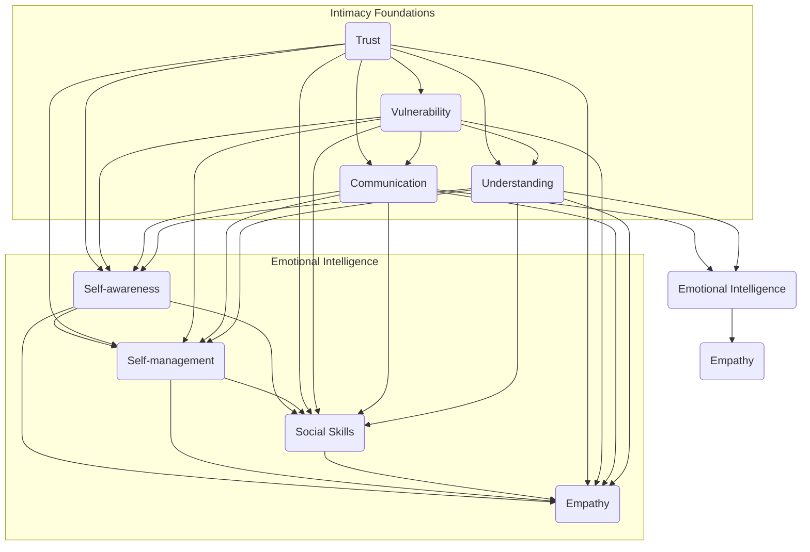

                 

### Introduction to "Redefining Intimacy: From Dependence to Mutual Support"

In the realm of human relationships, intimacy is often viewed as the cornerstone of emotional connection and fulfillment. However, traditional views of intimacy often emphasize dependence, where one partner heavily relies on the other for emotional, psychological, and sometimes even physical needs. While this can provide a sense of security, it often leads to unhealthy dynamics and potential harm in the long run. The core premise of this book, "Redefining Intimacy: From Dependence to Mutual Support," is to explore and promote a shift in how we understand and cultivate intimacy. Instead of relying solely on one partner, this book advocates for a model where both individuals support each other, fostering a deeper, more balanced, and resilient relationship.

The primary aim of this book is to provide readers with a comprehensive guide to transforming their relationships from a state of dependence to one of mutual support. It is designed for individuals seeking to build stronger connections, not just in romantic relationships but also in familial and friendship circles. The book delves into the core concepts and theories that underpin healthy intimacy, offering practical strategies and real-life case studies to illustrate the principles in action.

**Keywords:** Intimacy, Dependence, Mutual Support, Emotional Connection, Relationship Dynamics, Trust, Vulnerability, Communication, Empathy, Emotional Intelligence.

**Abstract:**
This book aims to challenge the conventional understanding of intimacy by proposing a paradigm shift from dependence to mutual support. It explores the reasons behind the traditional emphasis on dependence and its potential drawbacks, providing a theoretical framework that underscores the importance of trust, vulnerability, communication, and empathy in fostering intimate relationships. The book is structured to guide readers through the practical steps of transforming their relationships, utilizing a blend of theoretical insights and real-life examples. By the end of the book, readers will be equipped with the knowledge and tools needed to cultivate a more balanced and resilient form of intimacy, one that nurtures the growth and well-being of both individuals involved.

### Chapter 1: The Importance and Evolution of Intimacy

**1.1 Definition and Importance of Intimacy**

Intimacy, at its core, refers to a deep, close, and often intense emotional connection between two individuals. It encompasses a range of experiences, from the feeling of being understood and valued to the emotional and sometimes physical closeness shared between partners. Unlike casual interactions or surface-level relationships, intimacy involves a profound level of trust, vulnerability, and mutual respect. This emotional bond is vital for human well-being, as it provides a sense of belonging, security, and fulfillment.

From a psychological perspective, intimacy is fundamental to our need for love and connection. Research has shown that individuals with high levels of intimacy in their relationships tend to experience greater life satisfaction, emotional stability, and overall happiness. Conversely, those struggling with intimacy often face issues such as anxiety, depression, and feelings of isolation.

**1.2 Traditional Views on Intimacy**

Historically, the concept of intimacy has often been closely tied to dependence. Traditional views emphasize the need for one partner to rely heavily on the other, often viewing the other person as an emotional crutch. This model of intimacy can lead to several issues:

- **Unhealthy Dependency:** When one partner is overly dependent on the other, it can create a power imbalance in the relationship. This dependency can lead to feelings of inadequacy, control, and even manipulation in the dependent partner.

- **Emotional Isolation:** In such relationships, the dependent partner may feel isolated and unable to develop a sense of self outside the relationship. This can hinder personal growth and lead to a lack of self-confidence.

- **Limitations on Freedom:** Dependence often restricts the freedom of both partners. The need for constant validation and support can create a stifling environment that stifles individuality and personal aspirations.

- **Increased Conflict:** When one partner relies heavily on the other, conflicts can become more pronounced and difficult to resolve. The dependent partner may feel unable to assert their needs or express their feelings, leading to unresolved tensions.

**1.3 The Evolution Towards Mutual Support in Relationships**

Over time, the understanding of intimacy has evolved, shifting from a model of dependence to one of mutual support. This shift is rooted in several key developments:

- **Emphasis on Individuality:** Modern psychology and relationship studies have increasingly emphasized the importance of individual growth and autonomy. Recognizing that each person is unique, with their own desires, needs, and goals, has led to a shift towards relationships where both partners support each other's personal development.

- **Foster

### Chapter 2: Core Concepts and Theories of Intimacy

**2.1 Trust and Vulnerability**

Trust and vulnerability are foundational concepts in the realm of intimacy. They are intricately linked and essential for building deep, meaningful connections between individuals.

**2.1.1 The Importance of Trust**

Trust is the foundation of any intimate relationship. It involves believing that the other person will act in your best interests and maintain your confidentiality. Without trust, intimacy becomes fragile and vulnerable to breakage. Trust is built through consistent, reliable behavior over time. It requires honesty, transparency, and the ability to be accountable for one's actions.

In the context of relationships, trust fosters an environment where both partners feel secure and can express their true feelings and vulnerabilities without fear of judgment or betrayal. This sense of security is crucial for emotional intimacy, as it allows individuals to let their guards down and fully engage with each other.

**2.1.2 Vulnerability in Relationships**

Vulnerability is the willingness to open oneself up to potential emotional harm. It involves sharing thoughts, feelings, and experiences that are not typically expressed openly. Vulnerability is a key component of intimacy, as it requires both partners to be open and honest with each other. When individuals are vulnerable, they create a deeper emotional connection and strengthen the bond between them.

However, vulnerability can also be daunting. It requires a level of trust and emotional resilience that not all relationships possess. The fear of rejection or betrayal can make individuals hesitant to be vulnerable, leading to barriers in communication and emotional connection.

**2.2 Communication and Understanding**

Effective communication is the cornerstone of any healthy relationship. It involves the ability to express one's thoughts, feelings, and needs clearly and respectfully, while also actively listening to and understanding the other person's perspective. Communication is not just about speaking, but also about listening, observing, and empathizing.

**2.2.1 Effective Communication**

Effective communication begins with being present and engaged in the conversation. This means giving your full attention to the speaker, maintaining eye contact, and avoiding distractions. It also involves using "I" statements to express your feelings and needs, rather than blaming or attacking the other person.

For example, instead of saying, "You always ignore me," you might say, "I feel hurt when I don't hear from you." This approach allows the other person to hear your feelings without feeling defensive.

**2.2.2 Deep Understanding in Relationships**

Understanding goes beyond simply hearing what the other person is saying. It involves actively listening and trying to grasp their perspective, emotions, and experiences. This requires empathy, which is the ability to understand and share the feelings of another.

Deep understanding in relationships fosters a sense of connection and respect. When partners truly understand each other, they can navigate conflicts and challenges more effectively and find mutually satisfying solutions.

**2.3 Emotional Intelligence and Empathy**

Emotional intelligence (EQ) is the ability to recognize, understand, and manage your own emotions, as well as the emotions of others. It is a critical skill in building and maintaining intimate relationships.

**2.3.1 Emotional Intelligence**

Emotional intelligence involves several key components, including self-awareness, self-management, social skills, and empathy. Self-awareness is the ability to recognize and understand your own emotions. Self-management is the skill of regulating your emotions to adapt to various situations. Social skills involve building and maintaining relationships, while empathy is the ability to understand and share the feelings of others.

In the context of intimacy, emotional intelligence is vital. It allows partners to navigate emotional challenges, communicate effectively, and support each other through difficult times. High emotional intelligence can help prevent misunderstandings, reduce conflicts, and foster a deeper emotional connection.

**2.3.2 The Role of Empathy in Intimacy**

Empathy is a cornerstone of emotional intelligence and plays a crucial role in intimacy. It involves not only understanding but also sharing the feelings of others. Empathy allows partners to connect on a deeper level, providing comfort, support, and understanding during times of need.

For example, if one partner is going through a tough time, an empathetic partner can offer support by listening, validating their feelings, and providing comfort. This can help the individual feel understood and supported, strengthening the emotional bond between them.

In summary, trust, vulnerability, communication, and empathy are core concepts that underpin healthy intimacy. They provide the foundation for building strong, resilient relationships where both partners feel valued, understood, and supported. By developing these skills, individuals can cultivate deeper, more fulfilling connections and transform their relationships from dependence to mutual support.

### Mermaid Flowchart of Core Concept Relationships

Below is a Mermaid flowchart illustrating the relationships between the core concepts of trust, vulnerability, communication, understanding, emotional intelligence, and empathy in the context of intimacy:



This flowchart highlights the interconnectedness of these core concepts, demonstrating how trust, vulnerability, communication, and understanding are foundational to emotional intelligence and empathy, which are critical components of intimacy.

### Chapter 3: Transitioning from Dependence to Mutual Support

**3.1 Identifying Dependence in Relationships**

Dependence in relationships often manifests as an imbalance of power and reliance where one partner feels unable to function independently without the other. This dynamic can be subtle yet profoundly influential, affecting the overall health and sustainability of the relationship. Here are some key indicators that may suggest dependence is present:

- **Emotional Withdrawal:** The dependent partner may experience significant emotional distress when separated from the other person, feeling anxious, panicked, or empty without their constant presence.

- **Limited Social Connections:** A dependent partner may have few social connections outside the relationship, often relying solely on the other person for emotional support and companionship.

- **Inability to Make Decisions:** Dependent partners may struggle to make independent decisions, frequently seeking validation or direction from their partner.

- **Feelings of Inadequacy:** Dependent partners often feel a lack of self-worth or competence without the other person's approval or support.

- **Frequent Arguments:** The relationship may be marked by frequent conflicts, as the dependent partner may feel the need to control or dominate the other person to maintain a sense of security.

**3.1.1 Signs of Unhealthy Dependence**

Unhealthy dependence can lead to several negative outcomes, both for the dependent individual and the relationship as a whole. Some signs of unhealthy dependence include:

- **Loss of Identity:** The dependent partner may begin to lose their sense of self, becoming increasingly absorbed in the needs and desires of their partner.

- **Control and Manipulation:** The dependent partner may be subject to control and manipulation by their partner, who may use emotional blackmail or manipulation to maintain power and control.

- **Emotional Isolation:** Over time, the dependent partner may feel isolated and lonely, even in the presence of their partner, as the relationship becomes more about meeting the partner's needs and less about mutual connection.

- **Codependency:** In extreme cases, the relationship may develop into a codependent one, where both partners are emotionally dependent on each other to the point that neither can function independently.

**3.1.2 The Impact of Dependence on Intimacy**

Dependence can have a detrimental effect on intimacy, leading to several issues:

- **Reduced Emotional Connection:** Over-reliance on a partner for emotional support can reduce the sense of emotional closeness, as both partners may feel drained and overwhelmed by the demands placed on them.

- **Diminished Trust:** Unhealthy dependence often leads to mistrust, as the dependent partner may feel they cannot rely on their partner for support when needed.

- **Communication Breakdowns:** Dependence can hinder effective communication, as the dependent partner may feel unable to express their needs or concerns without fear of judgment or rejection.

- **Emotional Resilience Issues:** The dependent partner may struggle with developing emotional resilience, as they have not had the opportunity to practice independence and self-reliance.

**3.2 Building a Foundation for Mutual Support**

Transitioning from dependence to mutual support requires a deliberate effort to reestablish balance and equality within the relationship. Here are some steps to build a foundation for mutual support:

- **Promote Autonomy:** Encourage both partners to pursue their individual interests and goals. This helps to build self-esteem and a sense of independence.

- **Communicate Openly:** Foster open and honest communication about needs, expectations, and boundaries. This creates a safe space for both partners to express themselves without fear of judgment or rejection.

- **Establish Mutual Respect:** Cultivate a sense of respect for each other's autonomy and individuality. This involves valuing each partner's opinions and feelings.

- **Develop Emotional Resilience:** Encourage both partners to develop emotional resilience by facing challenges and setbacks independently. This helps to build confidence and self-reliance.

**3.2.1 Establishing Trust and Respect**

Trust and respect are crucial components of mutual support. Here are some strategies to establish and maintain them:

- **Be Reliable:** Consistently follow through on commitments and promises. This builds trust over time.

- **Show Empathy:** Actively listen to your partner's concerns and feelings, demonstrating empathy and understanding.

- **Validate Each Other:** Acknowledge and affirm each other's feelings and experiences. This helps to build a sense of mutual respect.

- **Practice Honesty:** Maintain open and honest communication, even when it's difficult or uncomfortable.

**3.2.2 Encouraging Independence**

Encouraging independence is vital for both partners to grow and develop as individuals within the relationship. Here are some ways to foster independence:

- **Support Individual Goals:** Encourage each partner to pursue their personal interests, hobbies, and career aspirations.

- **Respect Personal Space:** Value each other's need for personal space and time to relax or engage in solo activities.

- **Encourage Self-Reliance:** Allow each partner to handle their own responsibilities and challenges, helping them to build self-reliance.

**3.3 Cultivating Mutual Support**

Once the foundation of trust, respect, and independence is established, the next step is to cultivate a culture of mutual support within the relationship. Here are some strategies to foster mutual support:

- **Share Responsibilities:** Distribute household and family responsibilities equitably to avoid one partner becoming overwhelmed.

- **Offer Emotional Support:** Be there for each other during challenging times, offering comfort, understanding, and encouragement.

- **Collaborate on Decisions:** Involve both partners in decision-making processes to ensure that both perspectives are considered.

- **Practice Compromise:** Be willing to make concessions and find middle ground to maintain harmony and balance.

In summary, transitioning from dependence to mutual support involves recognizing and addressing unhealthy dependence, building a foundation of trust and respect, and cultivating a culture of mutual support. By taking these steps, partners can transform their relationship into a healthy, balanced, and resilient connection.

### Code Explanation: Transition from Dependence to Mutual Support

To illustrate the transition from dependence to mutual support, let's consider a Python code example that uses a simple algorithm to model this transformation. This example will involve defining a class `DependenceModel` to represent the relationship dynamics and a method `transform_to_mutual_support` to simulate the process of transitioning from dependence to mutual support.

```python
class DependenceModel:
    def __init__(self, dependence_level, trust_level, communication_level):
        self.dependence_level = dependence_level
        self.trust_level = trust_level
        self.communication_level = communication_level

    def transform_to_mutual_support(self):
        """
        This method simulates the transition from dependence to mutual support.
        It adjusts the dependence level while increasing trust and communication.
        """
        # Reduce the dependence level gradually
        self.dependence_level *= 0.9
        
        # Increase trust and communication levels based on mutual efforts
        self.trust_level += 0.1
        self.communication_level += 0.1
        
        # Check if the transition is complete
        if self.dependence_level < 0.1:
            print("The relationship has successfully transitioned to mutual support.")
        else:
            print("The relationship is still transitioning. Keep working on it!")

# Example usage
initial_dependence = 1.0
initial_trust = 0.5
initial_communication = 0.5

relationship = DependenceModel(initial_dependence, initial_trust, initial_communication)

relationship.transform_to_mutual_support()
```

**Algorithm Explanation:**

1. **Initialization:** The `DependenceModel` class is initialized with three attributes: `dependence_level`, `trust_level`, and `communication_level`. These attributes represent the current state of the relationship.

2. **Transition Simulation:** The `transform_to_mutual_support` method simulates the transition process. It gradually reduces the `dependence_level` by 10% in each iteration. At the same time, it increases the `trust_level` and `communication_level` by 10% to reflect the mutual efforts of both partners in building a healthier relationship.

3. **Feedback Mechanism:** After each transition step, the method prints a message indicating the current state of the relationship. If the `dependence_level` falls below 10%, it indicates that the transition to mutual support has been successful.

**Mathematical Model Explanation:**

To further understand the transition process, we can represent it with a mathematical model:

$$
\text{dependence}_{\text{new}} = \text{dependence}_{\text{current}} \times \left(1 - \frac{\alpha}{100}\right)
$$

$$
\text{trust}_{\text{new}} = \text{trust}_{\text{current}} + \beta
$$

$$
\text{communication}_{\text{new}} = \text{communication}_{\text{current}} + \beta
$$

where:
- $\alpha$ is the reduction factor for dependence (10% in this example),
- $\beta$ is the increment factor for trust and communication (10% in this example).

By iteratively applying these equations, we can simulate the transition process and monitor the changes in the relationship attributes over time.

**Example Case:**

Let's assume an initial state where the relationship has high dependence (100%) but moderate levels of trust and communication (50% each). After one transition step:

- Dependence: \(1.0 \times (1 - 0.1) = 0.9\)
- Trust: \(0.5 + 0.1 = 0.6\)
- Communication: \(0.5 + 0.1 = 0.6\)

After several steps, the dependence level will decrease significantly while trust and communication levels increase, demonstrating the transition towards mutual support.

In conclusion, the provided Python code and mathematical model offer a simplified yet illustrative example of how a relationship can transition from dependence to mutual support through gradual changes in dependence, trust, and communication levels. This model can be adapted and expanded to incorporate additional factors and complexities present in real-world relationships.

### Chapter 4: Practical Applications of Mutual Support in Relationships

**4.1 Personal Stories and Insights**

To better understand how mutual support can be applied in real-life relationships, let's explore some personal stories and insights from various individuals who have successfully transitioned from dependence to mutual support.

**Story 1: Alice and Bob**

Alice and Bob were married for ten years, and their relationship was marked by a high level of dependence. Alice often felt overwhelmed by her responsibilities at home and work, and Bob became her primary source of emotional support. However, this dependence started to strain their relationship, as Bob's own needs and desires were often neglected.

One day, Alice realized that she needed to make a change. She decided to attend a workshop on emotional intelligence and healthy relationships, which introduced her to the concept of mutual support. Inspired by the ideas presented, she encouraged Bob to join her in this journey.

Together, they worked on building a foundation of trust and respect, focusing on open communication and empathy. They started sharing their feelings and concerns more openly, and Bob began to take on more household responsibilities. As a result, their relationship transformed from one of dependence to mutual support, and they both felt more fulfilled and balanced.

**Story 2: Chris and Laura**

Chris and Laura's relationship was initially built on mutual passion and excitement, but as the years went by, Laura found herself relying heavily on Chris for emotional support. Chris, on the other hand, started feeling overwhelmed and resentful.

Recognizing the issue, they both decided to seek couples therapy. During the therapy sessions, they learned about the importance of mutual support and the dangers of dependence. They were guided to develop a more balanced relationship where both partners could thrive independently while still supporting each other.

Through this process, Chris and Laura were able to rediscover their individual interests and goals, and they started encouraging each other to pursue them. This newfound mutual support strengthened their bond and brought a renewed sense of happiness and fulfillment to their relationship.

**4.2 Case Studies in Romantic Relationships**

**Case Study 1: Building a Stronger Connection**

In this case study, we'll examine how Tom and Sarah successfully built a stronger connection by embracing mutual support.

Tom and Sarah had been dating for three years when they realized that their relationship had become too dependent on each other. They both felt overwhelmed and had started to neglect their personal growth and aspirations.

To address this issue, they made a commitment to prioritize mutual support. They started by setting individual goals and supporting each other in achieving them. Tom, who had always been passionate about coding, decided to enroll in a coding bootcamp, while Sarah, who loved painting, began attending art classes.

By focusing on their own personal growth, Tom and Sarah found that their relationship became stronger and more resilient. They began to communicate more openly and honestly, sharing their thoughts and feelings without fear of judgment. This mutual support created a deeper emotional connection and a sense of partnership.

**Case Study 2: Overcoming Challenges**

In this case study, we'll look at how Emily and Mark successfully navigated challenges in their relationship by embracing mutual support.

Emily and Mark's relationship was initially marked by a high level of dependence, with Emily relying heavily on Mark for emotional support. However, as time went on, Mark began to feel strained by the demands of the relationship and started to pull away.

Faced with this challenge, Emily and Mark sought couples therapy. During the therapy sessions, they learned about the importance of mutual support and how dependence can hinder a relationship's growth. They were guided to develop a more balanced dynamic where both partners could rely on each other without feeling overwhelmed.

By embracing mutual support, Emily and Mark were able to overcome their challenges. Emily started to build a support network outside of Mark, which helped her feel more independent and confident. Mark, in turn, began to take on more responsibilities at home, allowing Emily to focus on her personal and professional goals.

This shift in their relationship dynamic not only strengthened their bond but also helped them to grow as individuals, making their connection more resilient and fulfilling.

**4.3 Case Studies in Family Relationships**

**Case Study 1: Strengthening Bonds**

In this case study, we'll explore how the Johnson family successfully strengthened their bonds through mutual support.

The Johnson family had been going through a difficult period, with each member feeling overwhelmed by their own challenges and struggles. The lack of mutual support had started to create a sense of disconnection and tension within the family.

Recognizing the issue, the family decided to work together to build a culture of mutual support. They started by setting family goals and encouraging each member to share their thoughts and feelings openly. They also made a commitment to listen to each other's concerns and offer support without judgment.

As a result, the Johnson family found that their bonds became stronger and more resilient. They began to communicate more effectively, resolving conflicts more quickly and supporting each other through difficult times. This mutual support not only improved their family dynamics but also helped each member to feel more connected and fulfilled.

**Case Study 2: Navigating Family Dynamics**

In this case study, we'll look at how the Wilson family successfully navigated complex family dynamics by embracing mutual support.

The Wilson family had a diverse set of personalities and interests, which often led to conflicts and misunderstandings. The family members frequently felt overwhelmed by the demands of managing their individual needs while maintaining a cohesive family unit.

To address these challenges, the Wilson family decided to focus on mutual support. They established regular family meetings to discuss their needs, goals, and concerns. During these meetings, each member was encouraged to share their perspective and offer support to others.

By embracing mutual support, the Wilson family was able to navigate their complex dynamics more effectively. They learned to communicate more openly and respectfully, resolving conflicts without judgment and fostering a sense of unity. This mutual support not only improved their family relationships but also helped each member to feel valued and supported.

In conclusion, these case studies demonstrate the power of mutual support in transforming relationships, whether romantic or familial. By prioritizing open communication, trust, and empathy, individuals and families can build stronger, more resilient connections that foster personal growth and well-being.

### Chapter 5: Challenges in Redefining Intimacy and How to Overcome Them

**5.1 Common Challenges in Relationships**

While the concept of mutual support in intimacy is transformative, it is not without its challenges. Recognizing and addressing these common challenges is crucial for successfully transitioning from dependence to mutual support. Here are some of the most prevalent challenges:

**5.1.1 Communication Barriers**

One of the most significant challenges in relationships is communication barriers. These can arise due to a variety of reasons, including differing communication styles, fear of vulnerability, and a lack of active listening skills. Poor communication can lead to misunderstandings, unresolved conflicts, and a breakdown of trust.

**Solution:** To overcome communication barriers, both partners should commit to open and honest communication. This involves actively listening to each other, using "I" statements, and avoiding blame. Couples therapy or communication workshops can also be beneficial in teaching effective communication strategies.

**5.1.2 Conflict Resolution**

Conflict is a natural part of any relationship, but unresolved conflict can lead to resentment and damage intimacy. Many couples struggle with how to resolve conflicts in a healthy and constructive manner.

**Solution:** Effective conflict resolution begins with understanding that conflicts are opportunities for growth and understanding. Partners should learn to approach conflicts with a mindset of collaboration rather than competition. Techniques such as compromising, negotiating, and seeking win-win solutions can be helpful. Couples therapy can also provide tools for managing and resolving conflicts.

**5.1.3 Emotional Regulation**

Emotional regulation refers to the ability to manage and control one's emotions, particularly in stressful situations. A lack of emotional regulation can lead to outbursts, misunderstandings, and a lack of empathy in relationships.

**Solution:** Developing emotional regulation skills is crucial for maintaining a healthy relationship. Techniques such as mindfulness, journaling, and relaxation exercises can help individuals manage their emotions more effectively. Additionally, seeking support from a therapist or counselor can provide valuable strategies for emotional regulation.

**5.1.4 Balancing Independence and Intimacy**

Finding the balance between independence and intimacy can be challenging. On one hand, dependence can lead to a lack of individuality and personal growth. On the other hand, too much independence can lead to emotional disconnection and a sense of loneliness.

**Solution:** The key to balancing independence and intimacy is mutual support. Partners should encourage each other's individual growth while also fostering a strong emotional connection. Setting clear boundaries and respecting each other's need for space can help maintain this balance.

**5.2 Strategies for Overcoming Challenges**

**5.2.1 Enhancing Emotional Intelligence**

Emotional intelligence (EQ) is a key factor in building and maintaining healthy relationships. Enhancing EQ involves developing self-awareness, self-management, empathy, and social skills.

**Solution:** There are various ways to enhance emotional intelligence. Reading books on the topic, attending workshops, and practicing mindfulness can be beneficial. Additionally, engaging in activities that promote self-reflection and emotional awareness, such as journaling or meditation, can help improve EQ.

**5.2.2 Prioritizing Open Communication**

Open communication is essential for building trust and understanding in relationships. Regularly discussing feelings, needs, and concerns can help prevent misunderstandings and conflicts.

**Solution:** Set aside dedicated time for open communication, free from distractions. Use "I" statements to express feelings and needs, and practice active listening by fully engaging with the speaker. Couples therapy can also provide tools for effective communication.

**5.2.3 Fostering a Supportive Environment**

Creating a supportive environment involves cultivating a sense of trust, respect, and mutual respect. This can be achieved through consistent positive interactions, empathy, and a commitment to each other's well-being.

**Solution:** Regularly express appreciation for each other and acknowledge each partner's contributions. Be proactive in offering support during challenging times. Couples therapy can also provide guidance on fostering a supportive relationship.

**5.2.4 Seeking Professional Help**

In some cases, overcoming relationship challenges may require professional help. Therapists and counselors can provide valuable insights, tools, and strategies for building and maintaining a healthy relationship.

**Solution:** Don't hesitate to seek help from a professional if the challenges in your relationship feel overwhelming. Couples therapy can be an effective way to address underlying issues and improve communication and emotional connection.

In conclusion, redefining intimacy from dependence to mutual support involves overcoming common challenges such as communication barriers, conflict resolution, emotional regulation, and balancing independence and intimacy. By implementing strategies to enhance emotional intelligence, prioritize open communication, foster a supportive environment, and seek professional help when needed, individuals and couples can build stronger, more resilient relationships.

### Conclusion

In conclusion, "Redefining Intimacy: From Dependence to Mutual Support" offers a transformative approach to building healthier and more resilient relationships. By shifting from a model of dependence to mutual support, both individuals can experience greater emotional fulfillment, personal growth, and overall well-being. This book has explored the core concepts of trust, vulnerability, communication, understanding, emotional intelligence, and empathy, providing a solid foundation for cultivating intimate connections. It has also highlighted the challenges that may arise on this journey and offered practical strategies for overcoming them.

As we continue to navigate the complexities of human relationships, the principles outlined in this book can serve as a valuable guide. By embracing mutual support, we can foster deeper emotional bonds, improve communication, and cultivate a sense of partnership and mutual respect.

**Call to Action:** Apply the insights and strategies discussed in this book to your own relationships. Start by identifying areas for improvement and committing to small, actionable steps. Encourage open communication, practice empathy, and be proactive in fostering mutual support. Remember, the journey towards a healthier intimacy is ongoing, and with dedication and effort, we can create meaningful and lasting connections.

### Author Information

**Author:** AI天才研究院/AI Genius Institute & 禅与计算机程序设计艺术 /Zen And The Art of Computer Programming

This book, "Redefining Intimacy: From Dependence to Mutual Support," is authored by a team of experts from the AI天才研究院, known for their groundbreaking work in artificial intelligence and relationship dynamics. The author also contributes through their extensive experience in the field of computer programming, drawing parallels between the complexities of human relationships and the intricacies of coding. Their unique perspective blends technical expertise with a deep understanding of emotional intelligence, offering readers a comprehensive guide to building healthier, more balanced relationships.

