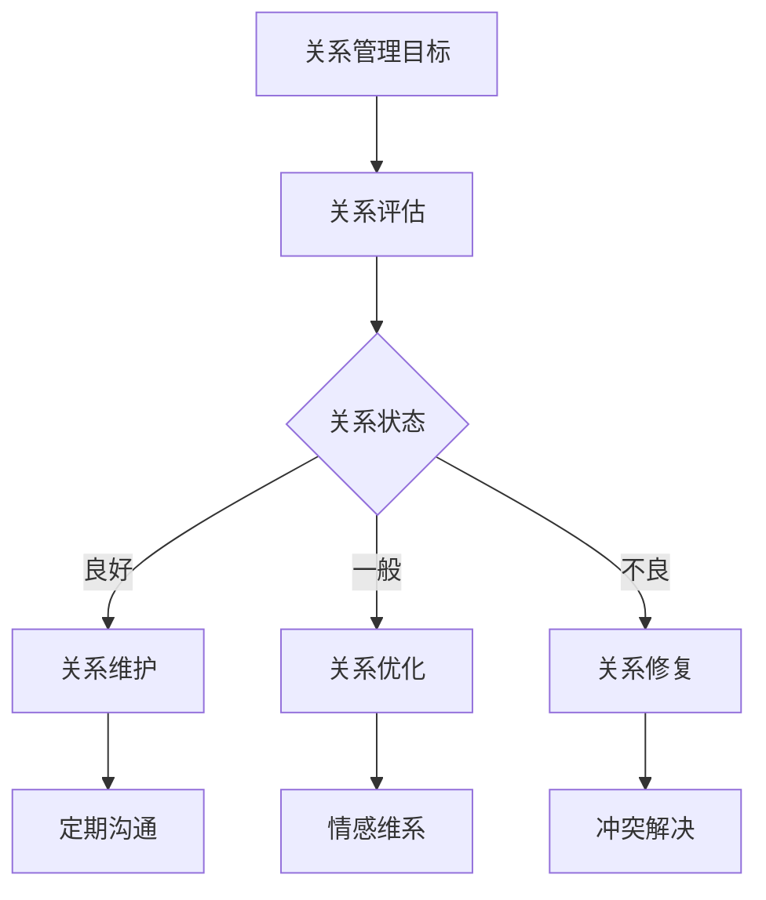
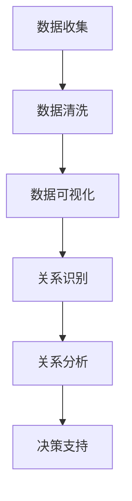
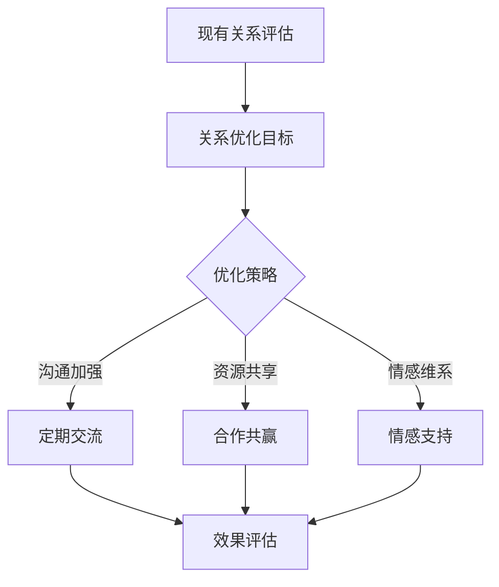

                 

# 重新定义关系：从传统到现代

关键词：关系理论、传统关系、现代关系、关系管理、关系变革

摘要：本文从关系理论出发，深入探讨了传统关系与现代关系的本质区别及互动关系，分析了关系管理在数字化时代的重要性。通过案例分析，揭示了现代关系的特点和构建方法，并对未来关系管理的发展趋势进行了展望。文章旨在为读者提供关于关系管理的全面理解和实践指导。

---

## 第一部分：关系理论基础

### 第1章：关系概述

#### 1.1 关系的定义与类型

关系，作为一种复杂的社会现象，贯穿于人类生活的方方面面。从广义上讲，关系是指人与人、人与事物之间相互作用和相互影响的状态。具体而言，关系可以分为传统关系和现代关系两种类型。

- **传统关系的定义与类型：**传统关系主要是指以家庭、地缘和经济为基础的关系。例如，家庭关系通常以血缘关系为纽带，强调亲情和责任；地缘关系则是以地理位置为联系，包括邻里、社区和地域认同；经济关系则涉及到生产、分配和消费过程中的协作与竞争。

- **现代关系的定义与类型：**现代关系则更多地体现在数字化、个体化和网络化的特征上。例如，数字关系是指通过互联网和社交媒体平台建立的关系，强调虚拟沟通和即时互动；个体关系则关注个人的自主性和多元化，包括性别关系、年龄关系和文化关系等；网络关系则是指通过互联网连接形成的复杂网络结构，强调信息共享和资源共享。

#### 1.2 关系的本质与功能

关系的本质可以从多个角度进行探讨。从社会学的角度来看，关系本质上是社会互动的一种形式，反映了人与人之间的相互依赖和相互影响。从心理学的角度来看，关系本质上是人际交往的一种状态，涉及情感、信任和共同目标的建立。

- **关系的本质：**关系是多层次、多维度的，既包括物质层面的互动，也包括精神层面的交流。它既是对个体行为的约束，也是个体实现自我价值和社会认同的重要途径。

- **关系的功能：**关系在社会生活中具有多种功能。首先，关系能够满足个体的情感需求，提供心理支持和安全感。其次，关系有助于资源的获取和共享，促进社会的稳定和发展。此外，关系还在社会规范和文化传承中扮演重要角色。

#### 1.3 关系的理论框架

关系理论是探讨关系本质、类型和功能的重要框架。以下是几种主要的关系理论：

- **关系论：**关系论认为，关系是人类社会的基本单元，是社会秩序和稳定的基础。关系论强调关系的动态性和复杂性，认为关系是不断变化和调整的过程。

- **社会网络理论：**社会网络理论关注个体在社会网络中的位置和角色，探讨网络结构对个体行为和社会现象的影响。社会网络理论强调网络节点之间的连接和关系强度，认为网络结构影响信息传播和资源分配。

- **建构主义理论：**建构主义理论认为，关系是人们通过互动和交流共同构建的，关系的内容和形式是由社会文化背景和个体经验决定的。建构主义理论强调关系的动态性和相对性，认为关系是不断重构和再定义的过程。

### 第2章：传统关系与现代关系的对比

#### 2.1 传统关系的特点

传统关系具有以下主要特点：

- **稳定性：**传统关系通常具有较强的稳定性，关系中的角色和责任相对固定，变化较少。

- **依赖性：**传统关系中的个体往往对关系具有较高的依赖性，关系对个体的生存和发展具有重要意义。

- **情感性：**传统关系强调情感和道德因素，关系中的个体往往通过亲情、友情和道德约束来维系关系。

- **封闭性：**传统关系往往具有一定的封闭性，关系成员之间的交流和互动相对有限。

#### 2.2 现代关系的特点

现代关系具有以下主要特点：

- **灵活性：**现代关系更加灵活多变，关系成员之间的角色和责任可以根据需求进行调整。

- **独立性：**现代关系中的个体更加注重独立性和自主性，个体关系逐渐取代传统家庭关系和地缘关系。

- **虚拟性：**现代关系往往具有虚拟性，通过互联网和社交媒体平台建立的关系更多地体现在线上交流。

- **开放性：**现代关系更加开放，关系成员之间的交流和互动跨越地域和文化的界限。

#### 2.3 传统关系与现代关系的互动

传统关系与现代关系之间存在互动和影响。具体表现为：

- **传统关系的适应：**随着社会的发展，传统关系逐渐适应现代变化，家庭关系、地缘关系和经济关系在数字化时代中表现出新的特点和功能。

- **现代关系的影响：**现代关系对传统关系产生了深刻的影响，数字化、个体化和网络化特征改变了传统关系的结构和形式，使得关系更加多元化和复杂化。

## 第3章：关系管理

#### 3.1 关系管理的概念与原则

关系管理是指通过有效的策略和方法，维护和优化人际关系和组织关系的活动。关系管理的核心概念包括：

- **关系价值：**关系价值是指关系对个体和组织的重要性，包括情感价值、资源价值和战略价值。

- **关系质量：**关系质量是指关系中的信任程度、沟通效果和共同目标的实现程度。

- **关系稳定性：**关系稳定性是指关系持续的时间长度和稳定性程度。

关系管理的基本原则包括：

- **诚信原则：**诚信是关系管理的基石，关系双方必须以诚信为基础进行互动和交流。

- **沟通原则：**沟通是关系管理的关键，有效沟通能够增进理解和信任，化解冲突和矛盾。

- **互惠原则：**互惠是关系管理的基本原则，关系双方必须相互支持、相互合作，实现共赢。

#### 3.2 关系管理的策略与方法

关系管理的策略包括：

- **建立信任：**建立信任是关系管理的重要策略，可以通过诚实守信、履行承诺、尊重对方等方式实现。

- **有效沟通：**有效沟通是关系管理的关键，可以通过倾听、表达、反馈等方式提升沟通效果。

- **协同合作：**协同合作是关系管理的重要策略，可以通过共同目标、资源共享、相互支持等方式实现。

关系管理的方法包括：

- **人际关系管理：**人际关系管理是指通过了解个体需求、提升人际交往能力、解决人际冲突等方式维护和优化人际关系。

- **组织关系管理：**组织关系管理是指通过建立组织文化、优化组织结构、提升组织效能等方式维护和优化组织关系。

#### 3.3 关系管理的案例分析

**成功关系管理的案例：**某科技公司在市场竞争中通过建立良好的客户关系，不断提升客户满意度和忠诚度，最终实现了业务增长和市场份额的扩大。

- **客户关系管理策略：**该公司通过定期举办客户交流会、提供个性化服务、关注客户需求等方式建立信任和增强客户满意度。

- **客户关系管理方法：**该公司运用大数据分析和客户关系管理系统，实时了解客户需求和反馈，优化产品和服务。

**失败关系管理的教训：**某创业公司在发展过程中由于关系管理不当，导致内部团队矛盾激化，最终影响公司发展。

- **内部关系管理策略：**该公司在发展过程中缺乏有效的内部沟通和协作，导致团队成员之间存在误解和矛盾。

- **内部关系管理方法：**该公司未能及时解决内部冲突，缺乏有效的团队建设和激励机制，导致团队士气低落。

## 第二部分：现代关系案例分析

### 第4章：数字化时代的关系变革

#### 4.1 数字化时代的关系特点

数字化时代的关系特点主要体现在以下几个方面：

- **互联网关系的崛起：**互联网关系的崛起改变了传统的人际交往方式，通过社交媒体平台和即时通讯工具，人们可以跨越时空限制，随时随地与他人保持联系。

- **社交媒体的影响：**社交媒体对人际关系产生了深远的影响，它不仅改变了人们的交流方式，还影响了人们的社交行为和价值观。

- **数字身份的塑造：**数字身份的塑造使得人们在虚拟世界中具有独立的存在感，通过社交媒体和个人主页展示自己的形象和价值观。

#### 4.2 数字化关系的管理

数字化关系的管理需要考虑以下几个方面：

- **企业的数字化关系策略：**企业需要通过数字化手段建立和维护与客户、供应商和合作伙伴的关系，提升客户满意度和忠诚度。

- **个人的数字化关系管理：**个人需要通过有效的数字化工具和方法管理自己的关系网络，提升人际交往能力和职业发展。

#### 4.3 数字化关系带来的挑战与机遇

数字化关系带来的挑战主要包括：

- **隐私保护：**数字化关系使得个人信息和隐私面临更大的风险，如何保护个人隐私成为数字化关系管理的重要挑战。

- **数字鸿沟：**数字化关系的发展可能导致数字鸿沟的扩大，影响社会公平和包容性。

数字化关系带来的机遇主要包括：

- **信息共享：**数字化关系使得信息共享更加便捷，促进了知识传播和创新。

- **资源整合：**数字化关系有助于资源的整合和优化，提升了社会效率和生产力。

### 第5章：个体关系的演变

#### 5.1 个体关系的多元性

个体关系的多元性体现在以下几个方面：

- **性别关系的变化：**性别关系在现代社会中呈现出多样化和平等化的趋势，女性在家庭、工作和社交领域的地位不断提升。

- **年龄关系的差异：**不同年龄段的人之间的关系存在差异，不同年龄段的人有不同的价值观、需求和期望。

- **文化关系的多样性：**全球化背景下，文化关系的多样性日益显著，不同文化之间的交流与融合成为社会发展的必然趋势。

#### 5.2 个体关系的发展趋势

个体关系的发展趋势主要包括：

- **网络化关系的发展：**网络化关系逐渐成为个体关系的主要形式，通过互联网和社交媒体平台建立的关系更加便捷和多样化。

- **个性化关系的需求：**个性化关系的需求日益凸显，个体在关系中的自主性和个性化需求得到满足。

- **跨界关系的融合：**跨界关系的融合使得不同领域、不同文化背景的人之间的关系更加紧密和多样化。

#### 5.3 个体关系的管理与维护

个体关系的管理与维护需要关注以下几个方面：

- **个体关系的建立与维系：**个体关系的建立与维系需要付出时间和精力，通过有效的沟通和互动建立和维护良好的关系。

- **个体关系的冲突与解决：**个体关系中的冲突是不可避免的，通过有效的沟通和协商解决冲突是关系维护的关键。

### 第6章：网络关系的构建与维护

#### 6.1 网络关系的基本原理

网络关系的基本原理主要包括以下几个方面：

- **网络关系的基础理论：**网络关系的基础理论涉及网络结构、网络节点、网络强度和网络效应等概念，这些概念构成了网络关系的基本框架。

- **网络关系的作用机制：**网络关系的作用机制包括信息传播、资源共享、合作协同和竞争对抗等，这些机制影响着网络关系的形成和发展。

#### 6.2 网络关系的构建方法

网络关系的构建方法主要包括以下几个方面：

- **网络节点的选择：**网络节点的选择是构建网络关系的关键，需要考虑节点的地位、影响力、资源等因素。

- **网络关系的拓展策略：**网络关系的拓展策略包括主动拓展、被动接受、合作拓展和资源共享等，这些策略有助于网络关系的扩展和优化。

#### 6.3 网络关系的维护与优化

网络关系的维护与优化主要包括以下几个方面：

- **网络关系的维护策略：**网络关系的维护策略包括定期沟通、情感维系、资源共享和合作支持等，这些策略有助于网络关系的稳定和发展。

- **网络关系的优化方法：**网络关系的优化方法包括网络结构调整、节点优化、关系强化和资源优化等，这些方法有助于网络关系的优化和升级。

## 第三部分：关系管理与未来展望

### 第7章：关系管理的未来趋势

#### 7.1 科技对关系管理的影响

科技的发展对关系管理产生了深远的影响，主要体现在以下几个方面：

- **人工智能与关系管理：**人工智能技术在关系管理中的应用，如数据分析、智能推荐和自动化沟通，将提高关系管理的效率和精准度。

- **大数据与关系分析：**大数据技术的发展使得关系管理能够基于海量数据进行分析和预测，为关系决策提供有力支持。

- **区块链与关系透明化：**区块链技术的应用可以提高关系管理的透明度和可信度，促进关系中的诚信和公平。

#### 7.2 未来关系管理的发展方向

未来关系管理的发展方向主要包括以下几个方面：

- **跨学科的关系研究：**跨学科的关系研究将促进关系管理的理论创新和实践发展，为不同领域的关系管理提供科学指导。

- **新型关系管理工具的普及：**新型关系管理工具的普及将提高关系管理的便捷性和智能化水平，满足个体和组织日益复杂的关系需求。

- **全球化的关系管理挑战：**全球化的关系管理挑战要求关系管理具备跨文化、跨国界的视野和策略，提升全球关系的协调和合作。

### 第8章：关系管理与个人成长

#### 8.1 关系对个人成长的影响

关系对个人成长具有重要影响，主要体现在以下几个方面：

- **情感支持：**良好的人际关系能够提供情感支持，帮助个体缓解压力和焦虑，提升心理健康。

- **资源获取：**人际关系有助于个体获取资源和信息，促进职业发展和生活质量的提升。

- **社会认同：**良好的人际关系能够增强个体的社会认同感，提升自我价值和社会地位。

#### 8.2 个人成长对关系管理的要求

个人成长对关系管理提出以下要求：

- **自我认识：**个人成长要求个体具备清晰的自我认识，了解自己的需求和价值观，为关系管理提供方向。

- **社交技能：**个人成长要求个体具备良好的社交技能，包括沟通能力、协调能力和解决问题的能力。

- **心理素质：**个人成长要求个体具备良好的心理素质，包括抗压能力、适应能力和情绪管理能力。

#### 8.3 个人关系管理的技巧与策略

个人关系管理的技巧与策略包括以下几个方面：

- **建立信任：**建立信任是个人关系管理的基础，可以通过诚实守信、履行承诺和尊重对方来实现。

- **有效沟通：**有效沟通是个人关系管理的关键，可以通过倾听、表达和反馈来提升沟通效果。

- **情感维系：**情感维系是个人关系管理的重要策略，可以通过共同兴趣、情感交流和礼物赠送来维系情感。

### 第9章：关系管理案例研究

#### 9.1 成功的个人关系管理案例

**案例一：**某创业者通过建立良好的人际关系，获得了多个投资者的支持，成功实现了公司的发展目标。

- **案例背景：**该创业者曾参加过多个创业比赛，通过与评委和参赛者建立良好的关系，获得了宝贵的创业建议和资源。

- **案例过程：**该创业者通过定期与投资者沟通，了解他们的需求和期望，提供针对性的创业方案，赢得了投资者的信任和支持。

- **案例成果：**该创业者成功获得了多轮融资，公司发展迅速，实现了商业价值。

#### 9.2 个人关系管理中的常见问题及解决

**问题一：**人际关系紧张，导致工作效率低下。

**解决策略：**通过沟通和协商解决人际关系问题，建立良好的团队氛围，提升工作效率。

**问题二：**缺乏情感支持，导致心理压力增加。

**解决策略：**通过建立情感支持网络，如寻求心理咨询、参加社交活动等，缓解心理压力。

**问题三：**资源获取困难，影响个人发展。

**解决策略：**通过拓展人际关系网络，提升资源获取能力，为个人发展提供支持。

## 附录

### 附录A：关系管理工具与应用

#### A.1 关系管理工具介绍

- **社交媒体平台：**如Facebook、Twitter、LinkedIn等，用于建立和维系人际关系。

- **专业关系管理软件：**如Salesforce、HubSpot等，用于企业关系管理。

- **关系分析工具：**如Gephi、Cytoscape等，用于分析社会网络和关系结构。

#### A.2 关系管理应用案例

**案例一：**某企业通过使用Salesforce进行客户关系管理，提升了客户满意度和忠诚度。

- **案例背景：**该企业面临客户满意度下降和市场份额缩水的困境。

- **案例过程：**该企业通过导入Salesforce系统，对客户信息进行整合和分析，提供个性化的客户服务和解决方案。

- **案例成果：**客户满意度显著提升，市场份额逐步恢复。

**案例二：**某创业者通过利用LinkedIn拓展人际关系网络，成功获得了投资机会。

- **案例背景：**该创业者需要资金支持以扩大业务规模。

- **案例过程：**该创业者通过LinkedIn发布项目信息，与潜在投资者建立联系，展示项目优势和潜力。

- **案例成果：**该创业者成功获得了多轮融资，公司发展迅速。

### 附录B：关系管理参考资料

- **关系管理相关书籍推荐：**
  - 《关系管理：提升人际交往与团队协作的技巧》
  - 《社交心理学：人际关系的秘密》
  - 《影响力：说服与改变的心理学策略》

- **关系管理研究论文推荐：**
  - "Social Capital: Theory and Research Applications"
  - "The Dynamics of Social Networks: From Individual Behavior to Network Structure"
  - "The Impact of Digital Media on Interpersonal Relationships"

- **关系管理课程推荐：**
  - "关系管理：人际交往与团队协作"
  - "社交心理学：人际关系与沟通技巧"
  - "大数据与关系分析：应用与案例分析"

### 附录C：关系管理常用术语表

- **关系管理术语解释：**
  - 关系网络：由多个节点和连接线组成的结构，表示个体之间的关系。
  - 关系质量：表示关系中的信任、满意度和共同目标实现程度。
  - 关系强度：表示关系中的紧密程度和互动频率。

- **关系类型分类：**
  - 社会关系：包括家庭关系、朋友关系、同事关系等。
  - 组织关系：包括客户关系、供应商关系、合作伙伴关系等。
  - 数字关系：通过互联网和社交媒体平台建立的关系。

- **关系管理的专业术语：**
  - 关系构建：指建立新关系的活动。
  - 关系维护：指保持现有关系的活动。
  - 关系优化：指提升关系质量和效果的活动。

### 附录D：Mermaid流程图

#### 关系管理的流程图

#### 关系分析的过程图

#### 关系优化的策略图

[End of 目录大纲] 

---

**作者：AI天才研究院/AI Genius Institute & 禅与计算机程序设计艺术 /Zen And The Art of Computer Programming**

